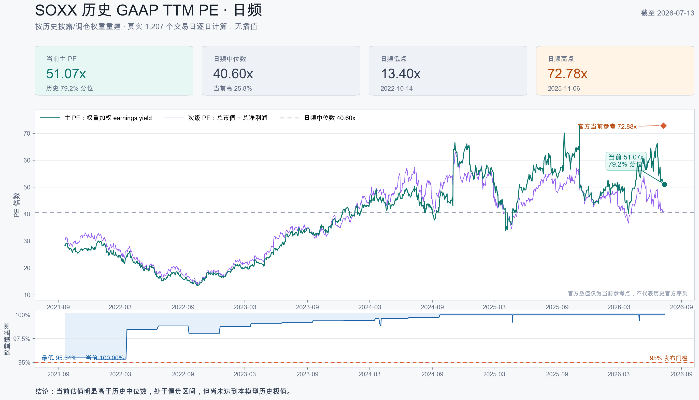
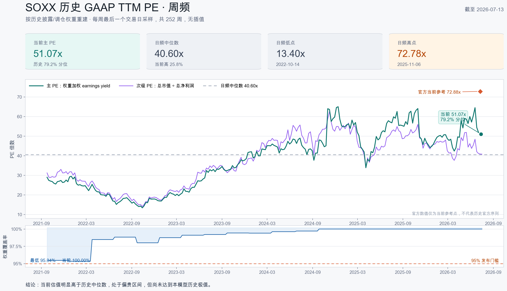

# SOXX 历史 GAAP TTM PE — CC 审核交接文档

> 日期：2026-07-14
> 审核对象：`codex/soxx-historical-ttm-pe`
> 实现审计基准：`d47f6a9`（17 commits，基于 `db86d75`）
> 当前状态：CC 独立审计已完成，确认问题已在同一 worktree 修复；最终回归/复审进行中。未 merge、未 push、未部署、未写生产估值表

## 0. CC 独立审计处理结果（2026-07-14）

CC 的结论是 `Ready to merge: With fixes`，无 P0；本轮逐项复现后接受并处理：

| 审计项 | 处理 |
|---|---|
| live snapshot 可绕过 TERN→TER 身份证据 | live/disclosure 统一走 exact CIK/CUSIP/ISIN resolver；缺证据 fail closed |
| verifier 对 forced-refresh clean padding 假红 | base evidence 只比较 post-refresh raw 可重建事件；repair metadata 单独做内部一致性检查 |
| FX 只校验正数，反向 TWDUSD 可穿透 | 新增共享方向/量级 validator，读取、抓取、落库三层 fail closed |
| split 当天 price+mcap 同步除十可误判 | 增加 split-adjusted economic return 连续性，并保持 anomaly 到 mcap 恢复 |
| 空 output range 会删除旧估值 | `replace_basket_ttm_valuation_range([])` 在 DELETE 前抛错 |
| 文档误称完整批次事务 | 更正为 per-snapshot/symbol/range 原子；stage gate 阻止发布但不回滚已成功 source writes |
| 任意古老 malformed quarter 毒化当前 TTM | 只忽略 provisional TTM 窗口之前的坏行；窗口内/之后仍 fail closed |
| query/verifier provenance 与字段缺口 | quarantine 从 status 推导；核对 member_count 与 methodology_version=1.0 |

明确保留为一次性研究限制：渐进 implied-share 漂移、首行 bootstrap、跨批次 restatement vintage、共享计算内核 verifier 与无 immutable repair manifest。记录见 `docs/issues/046-048`。

## 1. 给 CC 的审核指令

请把本次工作当成一次独立的金融数据管线与代码审计，而不是确认测试是否通过。

审核范围：

```text
branch: codex/soxx-historical-ttm-pe
base:   db86d75
head:   d47f6a9
diff:   git diff db86d75...d47f6a9
plan:   docs/plans/2026-07-14-soxx-historical-ttm-pe.md
```

请只报告问题，不要直接修改代码、数据库、cron 或生产环境。输出格式：

1. 先列具体做得好的地方；
2. 问题按 P0 / P1 / P2 排序；
3. 每条必须给出 `file:line`；
4. 说明触发条件、错误结果及建议修复方向；
5. 如果没有 P0/P1，请明确写出；
6. 单独回答本文第 12 节的金融方法论问题；
7. 给出 `Ready to merge: Yes / No / With fixes` 的明确结论；
8. 不要把“与 BlackRock 官方数值不相等”本身当作 bug，先判断口径是否可比。

最高优先级审计面：

- 市值污染能否穿透 sanity gate；
- 历史财务数据是否发生前视；
- 成分股日期语义和 live-tail 是否正确；
- corporate alias 是否会把两家公司数据拼接；
- 主 PE 的负盈利处理是否符合业务目标；
- verifier 是否真正独立于 producer；
- dry-run 是否存在任何隐性数据库写入；
- 官方 72.88x 与本模型 51.07x 的差值是否暴露方法错误。

## 2. 原始目标与本轮决策

Boss 的原始目标是：

> 按 SOXX 历史调仓/持仓变化，重建一个可观察历史位置的 PE 序列。

本轮没有回填历史 forward PE，因为 2026 年 7 月以前不存在可审计的 forward-estimate vintage。最终实现的是：

> **SOXX 历史 rebalance-weighted GAAP TTM PE proxy**。

业务用途：

- 回答 SOXX 当前估值相对自身历史处于什么位置；
- 观察成分和权重变化对组合估值的影响；
- 为后续指数内估值转移研究提供历史底座；
- 不冒充 BlackRock 官方历史 PE，也不冒充 forward PE。

实施前，review 指出了 `issue035`：KLAC 在 2026-06-10 至 2026-06-23 的 `historical_market_cap` 约缩小十倍。原设计的 7 天 freshness 和 90% coverage 都无法发现“数据存在但错误”；若按 complete-row skip 幂等策略运行，污染会永久保留。因此计划与实现新增了市值 sanity、强制重拉和 quarantine。

## 3. 已实现内容

### 3.1 数据源扩展

`src/data/fmp_client.py` 新增：

- SOXX fund disclosure dates；
- 历史 fund disclosure holdings；
- live ETF holdings；
- historical FX；
- stock splits；
- 空响应与供应商错误语义。

### 3.2 持仓与身份规范化

`src/data/fmp_forward_ingestion.py` 新增：

- 19 期 disclosure snapshot + 1 期 live snapshot 规范化；
- 原始行留档；
- 双股权 `covered_by`；
- cash fund 排除；
- disclosure / live 日期语义；
- scheduled rebalance 推断；
- ticker alias 与 authoritative identity correction。

当前重要身份规则：

- `TERN → TER`：FMP 的 SOXX disclosure 把 Teradyne 标成 `TERN`，但 FMP 市值/财务中的 `TERN` 是 Terns Pharmaceuticals。实现通过 exact CUSIP、ISIN、vendor CIK 与 raw identity 把经济标的修正为 `TER`；错误公司的 `TERN` 数据不会进入计算。
- `CREE → WOLF`：只允许 whole-key fallback。若 CREE 原始数据不完整，整个成员同时使用 WOLF 的市值和利润；禁止一半用 CREE 市值、一半用 WOLF 财务。
- `XLNX`：没有证据支持自动映射 AMD，因此不做映射。

### 3.3 市值 sanity

`terminal/historical_market_cap_sanity.py` 新增：

- 日间市值跳变检测；
- 股价同步性检查；
- split 事件交叉检查；
- implied shares 异常检查；
- refresh window 生成；
- post-refresh reclassification；
- unresolved / invalid 日期 quarantine。

处理结果：

- **KLAC**：识别 2026-06-10 至 2026-06-23 的 ÷10 污染；强制重拉 2026-06-03 至 2026-06-30；重拉后零 quarantine。
- **MCHP**：识别 2026-02-02 至 2026-02-06 的 ×2 污染；重拉 2026-01-26 至 2026-02-13；重拉后零 quarantine。
- **SLAB**：约 49% 跳变与股价一致，因此接受为真实市场变化。
- **NVDA / AVGO / LRCX 等 split**：只有 observed implied shares 同比例变化才解释为 split；避免对供应商已同步回溯调整的 price 和 HMC 再调整一次。
- **CREE**：2021-09-20 至 2021-10-01 共 10 个原始日期仍被 quarantine，经济成员使用完整 WOLF fallback。
- **XLNX**：102 个日期被 quarantine；早期权重覆盖最低降到 95.34%，但仍高于发布门槛。

### 3.4 估值计算

`terminal/historical_basket_valuation.py` 新增：

- as-of 四个连续季度选择；
- 季度 accepted/visible date 约束；
- 外币利润按估值日附近 FX 转 USD；
- 7 天市值 staleness；
- 权重合并和双股权覆盖；
- 主、次两套 GAAP TTM PE；
- 每个成员的证据链；
- 每日 sanity evidence。

### 3.5 存储、编排、查询与验证

- `src/data/market_store.py`：新增 fund disclosure、split、FX、basket valuation 等 auditable tables 与窄 CRUD。
- `scripts/backfill_soxx_historical_pe.py`：分阶段、幂等、dry-run、网络显式授权、严格 `>20%` publication gate；每个 snapshot/symbol/currency batch/output range 各自原子，不存在完整 backfill 批次回滚。
- `scripts/query_basket_ttm_pe.py`：查询、Markdown/CSV 导出、当前值和历史百分位。
- `scripts/verify_basket_ttm_pe.py`：SQLite `mode=ro`，重算 coverage、成员证据、sanity 分类、manifest 分母与当前行。
- `ARCHITECTURE.md` / `CLAUDE.md`：新增数据流和操作说明；本阶段没有接 cron。

## 4. 两个 PE 指标的精确定义

### 4.1 主 PE：SOXX 实际权重口径

对每个有完整市值和 TTM 净利润的成员：

\[
E/P_i = \frac{TTM\ Net\ Income_i}{Market\ Cap_i}
\]

然后按当期 SOXX 披露权重计算：

\[
Weighted\ E/P = \frac{\sum_i w_i(E/P_i)}{\sum_i w_i}
\]

\[
Primary\ PE = \frac{1}{Weighted\ E/P}
\]

实现字段：`rebalance_weighted_ttm_pe_gaap_proxy`。

关键语义：

- 这是 PE 的加权调和平均等价形式，不是个股 PE 的算术平均；
- 负净利润不会被自动剔除，会作为负 earnings yield 进入组合；
- 加权 earnings yield 必须大于零；
- 有效权重覆盖不足 90% 时不发布；
- 这是正式主指标，因为它回答“按当时 SOXX 权重持有，组合估值多少”。

### 4.2 次级 PE：全市值合并口径

\[
Secondary\ PE = \frac{\sum_i Market\ Cap_i}{\sum_i TTM\ Net\ Income_i}
\]

实现字段：`uncapped_mcap_basket_pe_gaap`。

它不使用 SOXX 权重，相当于把所有成分公司视为一家合并公司，或者使用 uncapped full-market-cap 权重。用途是诊断 SOXX 的权重上限与调仓规则给估值带来的影响，不是正式 SOXX 持仓 PE。

当前：

- 主 PE：51.07x；
- 次级 PE：40.80x；
- 差值 10.27x 表明 SOXX 实际权重相对纯市值权重分配了更多权重给低 earnings-yield 公司，或压低了高 earnings-yield 公司的相对权重。

## 5. 成分与日期语义

历史序列使用：

- 19 个历史 quarter-end disclosure snapshots；
- 1 个 2026Q2 之后的 live snapshot；
- disclosure 权重在推断的 composition effective interval 内固定；
- 记录 `holding_date`、`rebalance_close_date`、`composition_effective_date`、`composition_available_date`；
- `valuation_date < composition_available_date` 的日期显式标记为 ex-post composition proxy；
- 非预期季度发生的成员变化只告警，不静默归因于计划调仓。

当前 live tail：

- live holding/fetch date：2026-07-14；
- composition effective date：2026-06-22；
- current valuation date：2026-07-13；
- quality tier：`live_tail_weaker`；
- 当前权重来自抓取日漂移后的 live snapshot，不声称是精确调仓日权重。

## 6. 真实只读 dry-run 结果

最终网络 dry-run 使用生产 `market.db` 的 SQLite `mode=ro` 连接，允许 FMP 网络读取，但不创建 store、不调用写入方法。

生产数据库运行前后：

```text
mtime=1783982579
size=882147328
before == after
```

结果：

| 指标 | 数值 |
|---|---:|
| 日期范围 | 2021-09-20 → 2026-07-13 |
| trading dates | 1,207 |
| computed / publishable | 1,207 / 1,207 |
| publishable coverage | 100.00% |
| 主 PE 当前值 | 51.0665x |
| 主 PE 历史百分位 | 79.2046% |
| 主 PE 中位数 | 40.6016x |
| 主 PE 最低值 | 13.4011x（2022-10-14） |
| 主 PE 最高值 | 72.7761x（2025-11-06） |
| 次级 PE 当前值 | 40.7953x |
| 次级 PE 历史百分位 | 52.1955% |
| 权重覆盖最低值 | 95.3444% |
| 权重覆盖中位数 | 99.4317% |
| 当前权重覆盖 | 100.00% |

当前成员无缺失。历史最低覆盖主要来自 XLNX 被 quarantine，而不是数据静默填充。

网络阶段结果：

- fundamentals：39/41 full-range complete；`ALAB`、`ARM` 因上市较晚不覆盖 2021 起点；
- HMC：35/41 full-range complete；`ALAB`、`ARM`、`CRDO`、`CREE`、`WOLF`、`XLNX` 不覆盖完整起点；
- 两者均未触发严格 `>20%` fuse；
- empty API responses：0；
- FX：EUR、TWD 成功；
- 当前日期成员和权重覆盖：100%。

保留工件：

- dry-run 摘要：`/tmp/soxx_postreview_dry_run_20260714.json`；
- 完整日频临时数据：`/tmp/soxx_daily_pe_20260714.json`；
- dry-run 报告：`docs/research/2026-07-14-soxx-historical-ttm-pe-dry-run.md`。

## 7. 可视化

重新执行同口径只读计算后，内存截取 1,207 行真实日频结果。没有插值。

### 日频



- 1,207 个真实交易日；
- daily primary / secondary PE；
- 95% 权重发布门槛；
- 当前官方参考点仅作为单点展示。

### 周频



- 252 周；
- 每周取最后一个交易日；
- 不做平滑、不做插值。

## 8. 官方 72.88x 与本模型 51.07x

### 8.1 已确认事实

iShares SOXX 官网显示：

- P/E：72.88x，as of 2026-07-10；
- Number of Holdings：30；
- 2026-07-13 NAV 单日下跌 4.81%。

来源：

- <https://www.ishares.com/us/products/239705/ishares-semiconductor-etf>
- <https://www.ishares.com/us/literature/fact-sheet/soxx-ishares-semiconductor-etf-fund-fact-sheet-en-us.pdf>

SOXX 2026-03-31 Fact Sheet 对 P/E 的定义为：

- 个股最新收盘价 ÷ latest 12 months EPS；
- 排除 negative earnings；
- 排除 extraordinary items；
- 个股 P/E 高于 60 时按 60 处理。

本模型则使用：

- 四个连续、当时可见季度的 GAAP total net income；
- 当前/估值日 market cap；
- 负利润作为负 earnings yield 保留；
- 不做 60x 个股 cap；
- FMP 数据与后续 restatement 约束，而非 BlackRock 的供应商 EPS。

### 8.2 初步差值桥接

```text
官方 2026-07-10                 72.88x
按 SOXX 7/13 下跌 4.81% 粗调    约 69.37x
本模型 2026-07-13               51.07x
日期粗调后仍剩                  约 18.30x
```

日期调整只是敏感性估算，不是正式 reconciliation，因为各成分股价格和权重并非完全按 ETF NAV 同比例变化。

earnings yield 视角：

- 官方原始隐含 yield：`1 / 72.88 = 1.37%`；
- 日期粗调后隐含 yield：约 1.44%；
- 本模型：`1 / 51.07 = 1.96%`。

因此日期对齐后，本模型识别的组合 earnings yield 仍约高 0.52 个百分点，约高 36%。可能来源：

1. BlackRock vendor standardized EPS 与 FMP GAAP net income 不同；
2. extraordinary items 排除；
3. current diluted weighted-average shares 与 market-cap implied shares 不同；
4. 回购、增发、多股权类别、少数股东权益；
5. 7/10 官方真实权重与 7/14 live drifted weights 不同；
6. 官方实时网页与季度 Fact Sheet 可能使用不同聚合/供应商口径。

### 8.3 一个需要 CC 特别检查的矛盾

Fact Sheet 说个股 P/E 超过 60 按 60 处理，但官网组合 P/E 达到 72.88。如果组合特征严格由 capped constituent P/E 通过常规正权重平均或调和平均得到，结果理论上不应超过 60。

这可能意味着：

- 官网实时 metric 没有采用 Fact Sheet 中完全相同的 cap 规则；
- 方法在 2026-03-31 之后变化；
- 网页与 Fact Sheet 使用不同数据供应商或聚合方法；
- 或者我们对公开定义的理解仍不完整。

这不是当前已解决问题。审核时请判断：它是否只是 BlackRock 口径不透明，还是暴露本模型对官方指标定义的根本误解。

注意：`40.80x → 51.07x` 是纯市值口径到 SOXX 实际权重口径的差异；它不是 `51.07x → 72.88x` 的官方差值解释。

## 9. 测试与质量门

CC 审计前记录：

- feature suite：124 passed；
- adjacent regression：169 passed；
- full suite：2,441 passed / 14 failed / 3 skipped / 15 warnings；
- 14 个失败与冻结基线一致，零新增：breadth ignored fixtures、concept-registry 旧预期、`PORTFOLIO_SHEET_ID` 环境项；
- Python 3.10 AST：通过；
- `compileall`：通过；
- `bash -n`：通过；
- `git diff --check`：通过；
- 新增行 security grep：通过；
- `.env`、DB、API key 值未进入分支。

CC 修复后记录：

- feature suite：144 passed；
- full suite：2,461 passed / 14 failed / 3 skipped / 15 warnings；
- 14 个失败仍与冻结基线同类，零新增；
- `compileall` 与 `git diff --check`：通过；
- post-audit 网络 dry-run：rc=0，生产 DB 指纹前后相同，当前主/次 PE 与主百分位精确不变；前段代理 503 导致 MKSI/MTSI/MU 本轮为空，因此不以该轮的历史分布覆盖上一份成功工件。

CC 审计前的三轮 code review 结论为无剩余 P0/P1；随后 CC 仍发现并复现了上述边界，说明该结论不应继续作为最终验收。原 reviewer 执行过以下 tamper tests：

- 修改 `members_json` → verifier red；
- 清空 `mcap_sanity_json` → verifier red；
- 删除 live snapshot 且没有同-effective disclosure → verifier red；
- 缺 `--min-date` → fail-fast；
- raw anomaly fallback、非空 incomplete fuse、current vs last-publishable → 通过。

## 10. 已知审计边界

### 10.1 dry-run 工件时间边界

`/tmp/soxx_postreview_dry_run_20260714.json` 在 CC 审计修复之前生成，但在先前所有估值、fuse、identity、sanity 和数据库安全修复之后执行。CC 修复新增的路径是：

- live alias 身份 fail-closed；
- FX 方向/量级三层校验；
- split-day economic continuity；
- ancient malformed quarter 窗口化处理；
- verifier/query/空 range 安全边界。

随后用最终代码生成 `/tmp/soxx_ccaudit_dry_run_20260714.json`：生产 DB 指纹不变，当前主 PE `51.0664801186x`、次级 `40.7953491796x`、主百分位 `79.2046396023%` 与旧成功工件精确一致，KLAC/MCHP 零 quarantine，EUR/TWD 新 validator 通过。但代理 503 使 MKSI/MTSI/MU 本轮 fundamentals 为空，所以该轮只证明当前结果/安全边界稳定，不替代旧成功工件的完整历史分布。

### 10.2 verifier 对历史 refetch 的边界

verifier 可以从 source tables 只读重算：

- persisted member evidence；
- current/base HMC sanity classification；
- coverage 与当前行；
- 空 evidence 或被篡改 evidence。

但强制 range refresh 替换原始 source rows 后，verifier 无法独立重建“历史上确实发生过 refetch”这一事实。以下字段仍属于 producer-side evidence：

- `pre_refresh_status`；
- `forced_refresh_attempted`；
- `refresh_succeeded`；
- `refresh_windows`。

它复用 producer 的纯计算内核，因此不构成独立方法学实现；如果未来改为 recurring production pipeline，需要 immutable run manifest 才能独立证明 repair event。

### 10.3 尚未发生的生产验收

本轮没有写 `basket_ttm_valuation`，因此没有运行针对正式 persisted output 的最终生产 verifier/export。完成生产验收仍需单独批准：

1. merge + push；
2. 云端资源锁；
3. backup；
4. 正式 backfill write；
5. `mode=ro` verifier；
6. query/export；
7. 再次核对数据库和报告。

## 11. 高风险文件导航

| 文件 | 审核重点 |
|---|---|
| `terminal/historical_basket_valuation.py` | as-of、TTM、负利润、FX、主/次 PE、alias whole-key fallback |
| `terminal/historical_market_cap_sanity.py` | jump、split、price alignment、quarantine、accepted status |
| `scripts/backfill_soxx_historical_pe.py` | staged semantics、fuse、dry-run RO、强制重拉、事务边界 |
| `scripts/verify_basket_ttm_pe.py` | verifier 独立性、manifest SSOT、tamper detection |
| `src/data/fmp_forward_ingestion.py` | disclosure identity、日期语义、TERN→TER、CREE→WOLF |
| `src/data/market_store.py` | schema、replace-range、rollback、immutable evidence |
| `config/soxx_symbol_aliases.json` | authoritative vs fallback alias 规则 |
| `tests/test_historical_basket_valuation.py` | 金融公式和边界用例 |
| `tests/test_historical_market_cap_sanity.py` | issue035 与 split sanity |
| `tests/test_verify_basket_ttm_pe.py` | verifier 红灯路径 |

## 12. 希望 CC 明确回答的问题

1. 主指标保留负 earnings yield 是否符合“SOXX 持仓组合估值”的业务目标，还是应该另加一个 official-like 指标：排除亏损、排除 extraordinary items、个股 PE cap 60？
2. `sum(w × NI/mcap) / covered_weight` 在缺失权重小于 10% 时重新归一化，是否会系统性低估或高估 PE？是否应同时公布未归一化版本？
3. 使用 total net income / market cap 代替 price / diluted EPS，是否存在可观的结构性偏差？哪些公司最可能放大偏差？
4. 目前四季度 visibility/accepted-date 约束是否完全防止前视和后来 restatement 反向污染？
5. disclosure 固定权重映射到整个 effective interval 是否符合本研究目的？ex-post 标记是否足够，还是应该阻止 available date 之前发布？
6. live 7/14 drifted weights 回溯到 6/22 是否可以接受？是否应只从 fetch date 开始使用 live snapshot？
7. KLAC/MCHP sanity 是否还有能穿透的“存在但错误”形态，例如多日渐变、同 price 错误同步、shares 与 split 同时污染？
8. `CREE → WOLF` whole-key fallback 和 `TERN → TER` authoritative rewrite 是否覆盖所有身份边界？
9. XLNX 不映射 AMD、只降低 coverage 的决定是否正确？
10. strict `>20%` fuse 是否合理？恰好 20% 不熔断是否符合计划语义？
11. verifier 是否对 producer 复用了过多逻辑，从而可能同错同过？
12. 官方 72.88x 是否提示主模型存在重大低估，还是可接受的方法差异？请给出优先验证顺序。

## 13. 建议审核命令

```bash
cd "/Users/owen/CC workspace/Finance/.worktrees/soxx-historical-ttm-pe"

git status --short
git log --oneline --reverse db86d75..d47f6a9
git diff --stat db86d75...d47f6a9
git diff db86d75...d47f6a9 -- \
  terminal/historical_basket_valuation.py \
  terminal/historical_market_cap_sanity.py \
  scripts/backfill_soxx_historical_pe.py \
  scripts/verify_basket_ttm_pe.py \
  src/data/fmp_forward_ingestion.py \
  src/data/market_store.py

"/Users/owen/CC workspace/Finance/.venv/bin/python" -m pytest \
  tests/test_fmp_historical_valuation_client.py \
  tests/test_fmp_fund_disclosure_ingestion.py \
  tests/test_market_store_historical_basket_valuation.py \
  tests/test_historical_market_cap_sanity.py \
  tests/test_historical_basket_valuation.py \
  tests/test_backfill_soxx_historical_pe.py \
  tests/test_query_basket_ttm_pe.py \
  tests/test_verify_basket_ttm_pe.py -q
```

请不要为了审核直接运行带 `--allow-network` 的全量 dry-run；它会串行调用约百次 FMP API。只有在代码静态审计或已有工件无法回答问题时，再明确说明重跑目的。

## 14. 当前结论，但不是审核结论

当前证据支持：

- 历史序列可以稳定计算；
- 7 天口径下 1,207/1,207 日期可发布；
- issue035 类显性市值污染已被拦截；
- 当前 51.07x 处于本模型 79.2% 历史百分位；
- 当前明显高于自身 40.60x 中位数，但低于 72.78x 历史日频极值；
- 生产数据库没有被 dry-run 修改。

仍需 CC 判断：

- 金融方法是否真的回答 Boss 想问的问题；
- 官方差值是否暴露了结构性低估；
- verifier 和 repair evidence 是否足够支持正式生产写入；
- 是否需要在 merge 前增加 official-like 对照指标或 constituent-level reconciliation。
