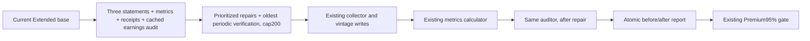
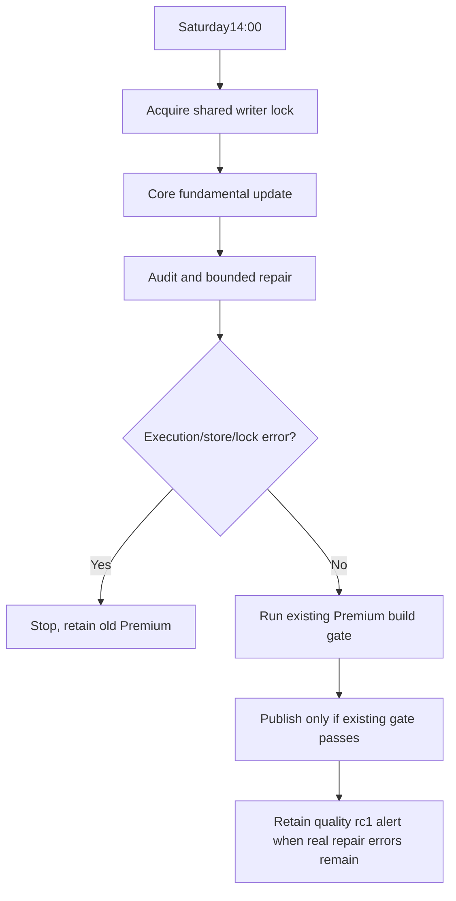

# Fundamental quality loop — implementation and acceptance

## Approved scope

Boss requested data-cleanliness checks and repair after the Premium incident, permitted DSH implementation, and selected weekly before Premium, Saturday14:00, up to200 securities. Alignment: north-star data layer / Extended base / shared current+vintage+coverage collector. This extends existing maintenance and keeps database ownership, selection policy and Premium95% gate intact.

The previous narrow preparer could not detect raw statements and metrics growing stale together. Existing reconciliation also lacked post-repair metrics/readiness verification and ignored failed coverage when old rows existed. The new audit sees all these cases, reads one SQLite snapshot, and separates successful requests from resolved quality problems.

## Design

Alternatives: (1) only log mismatches — cheap but misses uniformly stale inputs; (2) re-fetch all919 every week — simple but >150 minutes of requests plus Core, wasteful; (3) chosen full read-only audit, repair-first and bounded rolling verification. API budget/time is explicit, not inferred from a successful process exit. The source may still return old/ambiguous data: retain unresolved warning/error evidence rather than modify financial semantics.

## Implementation responsibilities

DSH used the configured `deepseek-official/deepseek-flash` route (DeepSeek-V41-Flash). The first broad attempt ended at its per-response output limit without code. A bounded audit task produced the auditor and tests but hit the step limit before a completed final turn; its result was not treated as acceptance. Codex implemented repair/orchestration and independently reviewed the actual files, correcting future/invalid attempt timestamps, stale coverage annotations, empty-universe false cleanliness, proactive cooldown bypass and concurrent-read snapshot consistency. No Codex subagents were used.

## Evidence (updated during rollout)

- Fresh cloud financial-only snapshot:919 eligible base names; no production DB writes for validation.
- Initial audit:18 actionable targets,737 periodic-verification candidates; fundamental readiness883/919 (same canonical gate), distinct structural/source/backoff causes retained.
- Cloud relevant suite:276 passed before the added concurrent-writer snapshot test; new snapshot regression was reproduced red and passed after the transaction fix.
- Real temporary SQLite + fake source client: unchanged data remains unresolved; new-quarter repair runs collector→vintage→metrics→audit; repeated run makes zero provider calls. Atomic report failure preserves prior report.

- Final relevant suite: **277 passed in5.55s**. Full suite: **3650 passed,12 failed,4 skipped** in271.90s; failing node IDs exactly equal the12 failures already reproduced on baseline. The subsequently added concurrent-snapshot regression is included in the277 targeted tests.
- Cloud isolated cached-source replay selected exactly TXT/VG/AZO (cap3), performed15 fake-source calls and zero external API calls. AZO request succeeded but remained stale; all three remained unresolved and none were counted truly_resolved. Failure/empty data remained explicit. The production DB was never opened for writes during this replay.
- Main-thread code review of implementation/direct callers/tests completed, including false-clean timestamp/state cases, cooldown bypass, atomic reporting, bounded calls, writer-lock ownership and the independent Premium gate. No unresolved implementation findings at rollout.
