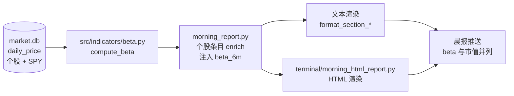

# 晨报个股 6 个月 Beta 属性 — 设计文档

> 日期：2026-06-12 · 状态：已批准（2026-06-12 Boss 对话确认）· 类型：小功能（无需 /architecture）
> 北极星对齐：分析层（Terminal / 晨报）展示增强，不触碰数据层 schema 与策略层

## 1. 需求

晨报中每个个股条目新增 **6 个月 beta** 属性，与市值并列展示。

- FMP profile 自带的 beta 是 5 年月频口径，对 Boss（trend trader，关注当前周期敏感度）太钝，弃用
- 自算口径：**126 个交易日（≈6 个月）日频收益率对 SPY 回归**
- 已确认方案：**即算即用，不落库**（beta 是 `daily_price` 的纯派生量，原始数据两端同步、随时可重算任意历史日期，落库属冗余）

## 2. 数据流



## 3. 组件设计

### 3.1 新增 `src/indicators/beta.py`（纯计算，遵循 indicators 目录惯例）

```python
def compute_beta(stock_closes: pd.Series, bench_closes: pd.Series,
                 window: int = 126, min_obs: int = 60) -> Optional[float]:
    """日期对齐 → 日简单收益率 → 取末尾 window 日 → cov/var。
    有效重叠样本 < min_obs 时返回 None。"""
```

> 本轮只做 `compute_beta` 纯函数。晨报侧复用 `build_market_signal_report` 已加载的
> 180 行 price_frames（个股零额外查询），经 `_compute_signal_betas` helper 接线；
> store 级便捷接口（按 symbol 查库算 beta）暂无第二消费方，YAGNI 不做（2026-06-12 plan review 修订）。

- 公式：`beta = cov(r_i, r_m) / var(r_m)`，简单收益率
- 对齐规则：按日期 inner join（个股停牌/缺日自动剔除），再截取末尾 126 个重叠交易日
- `var(r_m)` 接近 0（理论不可能但防御）→ 返回 None
- benchmark 留参数，未来可看 QQQ beta；本期晨报固定 SPY

### 3.2 晨报接线 `scripts/morning_report.py`

- 在个股条目 enrich 处（`build_market_signal_report()` 注入 marketCap 的同一层级）注入 `item["beta_6m"]`
- SPY 收盘序列**每次报告只查一次**，缓存后传入各 symbol 的计算，避免重复查询
- 仅对**当日实际展示的个股**计算（信号命中股，非全池 955 只），单股一次 SQL + 一次向量运算，性能无忧

### 3.3 渲染（文本 + HTML 双路径）

- 新增 `_format_beta()`：`1.83` 格式（两位小数）；None → `"—"`（遵循现有缺失值惯例 `morning_report.py:1162` 等）
- 在每处渲染市值的个股属性行后并列追加，如：`$2.9T · β 1.83`
- HTML 路径 `terminal/morning_html_report.py` 同步加列/字段，沿用 `html.escape()` 惯例

## 4. 替代方案对比（已与 Boss 确认）

| 方案 | 内容 | 结论 |
|------|------|------|
| FMP 自带 beta | 5 年月频，零计算成本 | ❌ 窗口太长，Boss 明确否决 |
| **即算即用（本方案）** | 报告生成时从 daily_price 现算 | ✅ 零 schema/cron/同步改动，数据总是新鲜 |
| market.db 加 beta_6m 字段 | 云端 pipeline 算好落库 | ❌ schema+cron+同步三处改动，换来的历史序列本可随时重建；未来回测确有高频查询需求时再加 |

## 5. 风险与边界

| 风险 | 处理 |
|------|------|
| 上市不足 6 个月 / 数据稀疏 | `min_obs=60` 阈值，不足返回 None → 显示 `—` |
| 扩展池标的 daily_price 历史深度不明 | **实现前验证**：抽查 Extend 层标的在 daily_price 的历史行数；不足 60 日的自然走 None 路径，不报错 |
| 个股与 SPY 日期错位（停牌、新股） | inner join 对齐后再截窗，错位日自动剔除 |
| 云端 Python 3.10 | 不用 3.12 特性（f-string 反斜杠、match/case） |
| 晨报生成时长 | 只算展示股（数十只量级），增量 < 1s |

## 6. 验收标准（Boss 不看代码即可验证）

1. **单元测试**：合成序列（构造已知 beta，如 r_i = 1.5·r_m + 噪声）→ 计算值误差 < 0.05；样本不足 → None；日期错位 → 正确对齐
2. **对照验证**：取 NVDA/MSFT 等用独立脚本（yfinance 数据）手算 6M beta，与本实现误差 < 0.1
3. **晨报实测**：本地 dry-run 生成一份晨报，每个个股条目市值旁出现 `β x.xx`，数据不足的标的显示 `—`
4. **不动数据层**：`git diff` 确认 market_store.py schema 无变更，market.db 无新表/列

## 7. 范围外（明确不做）

- PI 组合加权 beta 暴露（函数已可复用，另起需求再接）
- beta 历史序列落库 / 回测接入
- QQQ 等其他基准的展示
