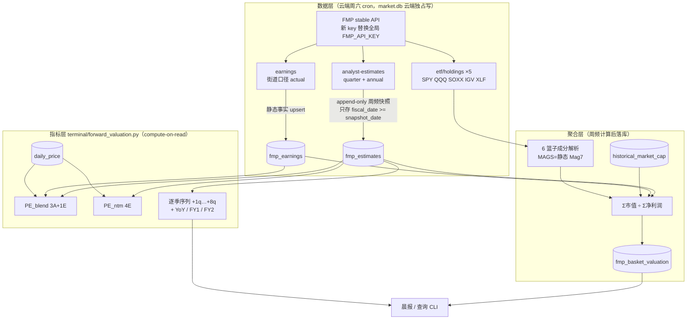

# FMP Forward EPS 估值体系 — 设计 Spec

> **状态**: ✅ Brainstorm 完成，待 Boss review → writing-plans
> **日期**: 2026-07-09 | **前置**: brainstorm 草稿 `2026-07-09-fmp-forward-eps-valuation-brainstorm.md`（13 项决策全数拍板）+ 背景研究 `docs/research/2026-07-02-forward-eps-quarterly-data-sources.md`
> **北极星对齐**: 数据层（新 FMP 数据线）+ 分析层（估值指标）；同时是「指数内估值转移指标体系」的 Phase 0（PIT panel 从本项目上线开始累积）

---

## 1. 一句话目标

升级 FMP 订阅拿季度颗粒度 forward EPS consensus，为扩展池 ~949 只个股与 6 个指数篮子（SPY/QQQ/SOX/MAGS/IGV/XLF）计算**两种 forward P/E**（PE_blend = 3 实际+1 预测 / PE_ntm = 4 预测），周频快照 append-only 自建 PIT 库，指数级估值落库，最终替代 yfinance forward estimates 线。

## 2. 非目标（YAGNI）

- ❌ 日频快照（周频足够，随周六 forward cron）
- ❌ 个股派生指标落库（compute-on-read，仅指数级落库）
- ❌ concept registry L3 自定义篮子（等 registry 重构后二期接入）
- ❌ 本期下线 yfinance 线（4 周对拍通过后另行决策执行）
- ❌ EPS 之外的深度预测分析（revenue/EBITDA 字段照存，指标层本期只做 EPS/净利润）

## 3. 架构总览



数据流向单向：FMP → 3 张新表 → 指标层现算 → 晨报/CLI。指标层不反向写库（唯一例外：聚合层的篮子估值由 cron 落库，理由见 §6.4）。

## 4. 已拍板决策索引（13 项）

完整表见 brainstorm 草稿。关键项：

| # | 决策 | 结论 |
|---|------|------|
| 6 | 新 FMP key | 替换全局 `FMP_API_KEY`（本地+云端 .env），明文不入 repo |
| 7 | yfinance 线去留 | FMP 替代，先 4 周对拍再下线；对拍期两线并存 |
| 8 | 架构 | 方案 B：新表 + 独立派生指标层 |
| 9 | 存储粒度 | 方案 A+：周频只存未来行；一次性 backfill 2021-01-01 起 |
| 10 | NTM 对齐 | Rule A 日历严格（`fiscal_date >= as_of` 取 4 季），锯齿 artifact 文档标注 |
| 11 | YoY 分母 | 街道 actual（`fmp_earnings.eps_actual`），绝不用 income GAAP（issue036） |
| 12 | 指数落库 | 6 篮子周频落库；个股 compute-on-read |
| 13 | 两种 P/E | PE_blend（3 已报告街道 actual + 1 预测）+ PE_ntm（4 预测） |

## 5. 数据层设计

### 5.1 FMP client 扩展（`src/data/fmp_client.py`）

新增 3 个方法，风格对齐现有方法（`_request` + rate limit）：

```python
def get_analyst_estimates(symbol, period="quarter", limit=100) -> List[Dict]
    # GET stable/analyst-estimates?symbol=X&period={quarter|annual}
def get_earnings(symbol, limit=8) -> List[Dict]
    # GET stable/earnings?symbol=X  （epsActual/epsEstimated/revenueActual/…）
def get_etf_holdings(symbol) -> List[Dict]
    # GET stable/etf/holdings?symbol=X  （asset/weightPercentage/marketValue）
```

三个端点均已用新 key 实测可用（2026-07-09）：quarter estimates AAPL 深度 +9~10 季；earnings 未报告季 `epsActual=null`；holdings SPY 505 / QQQ ✓ / SOXX 33 / IGV ✓ / XLF 80；**MAGS holdings 是 T-bill+TRS 不可用 → 静态硬编码 Mag 7**。

**限速**：现有 client 默认 2s 间隔下全量周频抓取（~1100 股 × 3 调用）需约 110 分钟，不可接受。新 plan 限额更高，抓取任务使用**独立可配置间隔**（`config/settings.py`，默认保守值，实施时按新 plan 实测限额调优，目标 <30 分钟）。现有其他 FMP 调用不改间隔。

### 5.2 新表 ×3（market.db，云端独占写，同步走现有 `sync_to_cloud.sh --pull`）

```sql
-- 周频 PIT 快照（append-only，核心资产）
CREATE TABLE IF NOT EXISTS fmp_estimates (
    symbol TEXT NOT NULL,
    snapshot_date TEXT NOT NULL,      -- 抓取日；PIT 锚
    fiscal_date TEXT NOT NULL,        -- 财季/财年截止日
    period_type TEXT NOT NULL CHECK(period_type IN ('Q','FY')),
    eps_avg REAL, eps_high REAL, eps_low REAL,
    rev_avg REAL, rev_high REAL, rev_low REAL,
    net_income_avg REAL, ebitda_avg REAL,
    num_analysts_eps INTEGER, num_analysts_rev INTEGER,
    PRIMARY KEY (symbol, snapshot_date, fiscal_date, period_type)
);
CREATE INDEX idx_fest_symbol_snap ON fmp_estimates(symbol, snapshot_date);
CREATE INDEX idx_fest_snap ON fmp_estimates(snapshot_date);

-- 街道口径财报事实（非快照制：actual 不变，无 PIT 需求）
CREATE TABLE IF NOT EXISTS fmp_earnings (
    symbol TEXT NOT NULL,
    announce_date TEXT NOT NULL,      -- 财报公告日（FMP earnings 的 date 字段）
    eps_actual REAL, eps_estimated REAL,
    revenue_actual REAL, revenue_estimated REAL,
    last_updated TEXT,
    PRIMARY KEY (symbol, announce_date)
);

-- 指数篮子估值（周频落库，见 §6.4）
CREATE TABLE IF NOT EXISTS fmp_basket_valuation (
    basket TEXT NOT NULL,             -- 'SPY'|'QQQ'|'SOX'|'MAGS'|'IGV'|'XLF'
    snapshot_date TEXT NOT NULL,
    fwd_pe_blend REAL,                -- Σ市值 ÷ Σ(3 已报告街道净利 + 1 预测净利)
    fwd_pe_ntm REAL,                  -- Σ市值 ÷ Σ NTM 净利润
    total_mcap REAL, ntm_net_income REAL, blend_net_income REAL,
    n_members INTEGER, n_covered_ntm INTEGER, n_covered_blend INTEGER,
    mcap_coverage_ntm REAL, mcap_coverage_blend REAL,
    members_json TEXT,                -- 审计: [{symbol, mcap, ntm_ni, blend_ni}]
    PRIMARY KEY (basket, snapshot_date)
);
```

`market_store.py` 新增 upsert/get 方法，风格对齐现有 `upsert_forward_estimates` / `get_latest_forward_estimates`（含 `_validate_table` 白名单登记）。

### 5.3 写入规则

- **fmp_estimates 周频**：每周六对每股写 `fiscal_date >= snapshot_date` 的行（未来 ~10 Q + ~5 FY ≈ 15 行/股）。`INSERT OR REPLACE`——PK 含 snapshot_date，天然 append-only + 同日重跑幂等
- **fmp_estimates 一次性 backfill**：接入日全量抓 `limit=100`，存 `fiscal_date >= 2021-01-01` 的全部行（含历史），`snapshot_date = backfill 日`。约 46k 行，之后零增量
- **fmp_earnings**：周频 upsert 最近 8 季 + 一次性 backfill 2021 起（`limit` 放大到覆盖 2021）。约 24k 行 backfill。**写入前先删除该股 `eps_actual IS NULL` 的旧行**——未报告行的公告日是预排日会漂移，不清删会残留幽灵行，污染"最早未报告行"判定
- **现有 yfinance `forward_estimates` 表完全不动**，对拍期并存
- 体量估算：fmp_estimates 年增 ~86 万行（1100 股 × 15 行 × 52 周），SQLite 无压力

### 5.4 抓取 universe

**扩展池 ∪ 6 篮子全部成分**（约 1050~1150 只）。理由：SPY 有约百余只 <$10B 成分不在扩展池，若只算池内成员，扩展池周频换血会让 SPY 序列人为跳变——序列稳定性是 PIT 时间序列的生命线。成分清单每周从 holdings 端点刷新后现场求并集。

### 5.5 云端 cron 集成

挂在周六 `finance_forward` job（现 10:15）末尾追加 FMP 步骤，与现有 yfinance 步骤串行：

1. 刷新 5 个 ETF holdings（5 调用）→ 解析成分 → 求 universe 并集
2. 逐股抓 quarter estimates + annual estimates + earnings（3 调用/股）
3. 写 fmp_estimates（未来行）+ fmp_earnings（upsert）
4. 计算 6 篮子两种 P/E → 写 fmp_basket_valuation（**此步阶段②才接入**，阶段①只跑 1-3+5）
5. verifier 自检（见 §8，篮子检查项随阶段②扩展）+ Telegram 摘要（复用现有 cron 报告模式）

失败隔离：单股失败记日志继续批次；**若失败率 >20% 中止篮子聚合步**（快照可以残缺，篮子估值不能用残缺快照算）——estimates 写入本身可安全部分写（重跑同 snapshot_date 幂等补齐）。

### 5.6 key 替换（部署步骤，非代码）

部署时把新 key 写入本地 + 云端 `.env` 的 `FMP_API_KEY`（覆盖旧值），现有全部 FMP 调用自动受益。明文绝不入 repo/文档（2026-06-10 隐私敞口教训）。`.env` 中暂存的 `FMP_UPGRADED_API_KEY` 行替换后删除。

## 6. 指标层设计（`terminal/forward_valuation.py`，compute-on-read）

### 6.1 两种 P/E（个股）

**PE_ntm（4 预测）**：
- 从指定 snapshot（默认最新）取 `period_type='Q'` 且 `fiscal_date >= as_of` 的最近 4 季 `eps_avg` 求和 = NTM EPS
- `forward P/E = close ÷ NTM EPS`
- Rule A 日历严格：财季结束→财报发布的窗口（~2-6 周）NTM 提前滚动一季，锯齿 artifact 已知已文档化（决策 10）

**PE_blend（3 实际 + 1 预测）**：
- 已报告/未报告分界 = `fmp_earnings.eps_actual` 非 null / null（自包含，不依赖 income 表）
- 分母 = 最近 3 个已报告季 `eps_actual` 之和 + 下一个未报告财季的 `eps_avg`（预测值统一取自 fmp_estimates，保证与 PE_ntm 同源）
- 未报告财季与 estimates 行的对齐规则：对最早的未报告 earnings 行（`eps_actual IS NULL` 且 `announce_date` 最小），其财季 = fmp_estimates 中满足 `fiscal_date < announce_date` 且 `announce_date - fiscal_date <= 120 天` 的最大 `fiscal_date`；无匹配 → 返回 None + 原因码
- 注：PE_blend 滚动发生在财报日（Rule B 语义），PE_ntm 滚动在日历季末（Rule A），两者滚动节奏不同是设计使然（决策 10 + 13）

### 6.2 逐季序列与 YoY

- `+1q…+8q`：`eps_avg/high/low + num_analysts_eps` 逐季序列（支持 8q8q 型图与逐季增速）
- **YoY 增速** = `est(+kq) ÷ eps_actual(去年同季)` − 1；去年同季从 fmp_earnings 取（对齐规则同 §6.1，announce_date 反推财季），同为街道口径无失真；缺 actual → 该季 YoY 输出 None 不补插

### 6.3 FY1 / FY2

annual 行直读：FY1/FY2 EPS、FY1→FY2 隐含增速、FY1 口径 forward P/E。仅个股展示层，篮子不落 FY 口径。

### 6.4 价格对齐与 as-of 纪律

- **当前查询**：分子 = 最新 `daily_price` close（日频），分母 = 最新快照（周频）；输出**显式携带** `price_date` + `snapshot_date`，不做隐式对齐
- **历史序列**：锚定 `snapshot_date`，配当日或之前最近交易日 close——每个历史点 PIT 一致
- 个股派生值一律不落库；指数级落库的唯一理由：成分清单周频漂移，不落库则历史指数 P/E 永久失去 PIT 重建能力（fmp_basket_valuation 的 members_json 把当周成分一并留档）

### 6.5 质量 gate

- 任一入算季 `num_analysts_eps < 3` → 结果带 `thin_coverage` flag（ONTO 远季仅 2-6 人）
- NTM 4 季 / blend 4 项任一缺失 → 返回 None + 原因码，**不静默补插**
- NTM EPS ≤ 0 → P/E 输出 None + `negative_earnings` flag（个股层面；篮子层面 Σ 法天然处理）

## 7. 聚合层设计

### 7.1 成分清单

| 篮子 | 来源 | 备注 |
|------|------|------|
| SPY / QQQ / IGV / XLF | FMP `etf/holdings` 周频刷新 | 过滤非股票行：`asset` 须匹配常规 ticker 格式（≤5 位字母，容许 `.`/`-` 类股后缀）且非现金/货基代码；无法判别的行记日志后剔除 |
| SOX | **SOXX holdings 代理**（iShares 跟踪 SOX） | 33 行，同样过滤 |
| MAGS | **静态硬编码 Mag 7**（AAPL/MSFT/NVDA/GOOGL/AMZN/META/TSLA） | FMP 返回 T-bill+TRS 不可用（实测） |

### 7.2 聚合公式

```
fwd_pe_ntm   = Σ成分市值 ÷ Σ成分 NTM 净利润        （net_income_avg 未来 4 季求和，Rule A）
fwd_pe_blend = Σ成分市值 ÷ Σ成分 blend 净利润
   blend 净利润 = 3 已报告季街道净利 + 1 季预测净利
   已报告季街道净利 ≈ eps_actual × 稀释股数（income_quarterly 股数——股数口径中性可用）
   预测净利 = net_income_avg（下一个未报告季）
```

- 负盈利成员照算进 Σ（Σ 法优于逐股 P/E 加权：无穷大/负 P/E 不炸）
- 市值取 snapshot 当日 `historical_market_cap`，缺则回退最新 profile 市值
- 稀释股数取该财季 `income_quarterly` 匹配行，缺则回退该股最近已知股数
- **口径说明**：结果是"成分组的市值加权估值"，非 ETF 实际权重（SPY float-adjusted、MAGS 等权）；估值追踪的标准做法，6 篮子口径统一可横比

### 7.3 缺失处理

成分无 estimates/earnings 覆盖 → 该成员从分子分母**同时剔除**（绝不单边），`mcap_coverage_*` 记录真实覆盖率；coverage < 90% 照常出数但带 flag，展示端显示警示。

## 8. Verifier 与数据验证

新增或扩展 verify 脚本（参照 `scripts/verify_forward_coverage.py` 模式：RO URI + ISO date 校验 + empty fail-fast）：

- 快照覆盖率：本次 snapshot_date 下有 ≥4 未来季的 symbol 数 ÷ universe **≥ 90%**（低于则 verifier FAIL + Telegram 警示）
- 篮子完整性：6 篮子当周各 1 行、coverage 字段合理、members_json 可解析
- fmp_earnings 新鲜度：抽样近期财报票 actual 已回填

## 9. 三阶段推进

| 阶段 | 内容 | 验收 |
|------|------|------|
| **① 数据层** | client 3 方法 + 3 表 + backfill（estimates 2021+ / earnings 2021+）+ 周频 cron 步骤 + key 替换 | 云端首跑：universe 全量快照落库，verifier 全绿；backfill 行数对账 |
| **② 指标层 + 聚合层** | forward_valuation.py（两种 P/E + 逐季 + YoY + FY）+ 6 篮子聚合 + basket 落库接入 cron + 查询 CLI | 抽样对拍（AAPL/MU/ONTO/GLW）人工核对；篮子数与公开数据源横比 sanity |
| **③ 晨报集成 + 对拍** | 晨报接入（形态届时另定小 plan）；FMP vs yfinance 4 周对拍报告 | 对拍报告过 Boss review 后，yfinance 线下线另行决策 |

阶段 ① 先行独立上线——PIT panel 从第一个周六 cron 开始累积，指标层可以晚于数据层。

## 10. 风险与缓解

| 风险 | 缓解 |
|------|------|
| FMP consensus 样本薄（AAPL 9-13 人 vs IBES ~40） | thin_coverage flag + ③ 阶段 4 周对拍 yfinance（Refinitiv）定量评估 |
| earnings→estimates 财季对齐规则出错（非常规财历） | 120 天窗口 + 无匹配返回 None；测试覆盖 1 月底/4 月底公告等边界 |
| 新 plan 限额实际值未验证 | 独立可配置间隔，实施时实测调优；保守默认值兜底 |
| 篮子序列受成分漂移影响 | universe = 扩展池 ∪ 篮子成分（决策），members_json 留档可审计 |
| GAAP/街道口径混用 | 铁律：actual 只用 fmp_earnings（街道），income 表只取股数；测试断言守护 |
| 周六 cron 时长膨胀 | 独立间隔目标 <30 分钟；失败率 >20% 中止聚合步防脏数据 |

## 11. 测试策略

- **client**：fixture JSON（真实响应样本）解析测试 ×3 端点，含 MAGS TRS 行过滤、epsActual null
- **store**：3 表 upsert/get/幂等重跑/PK 冲突，tmp sqlite
- **指标层**：NTM 对齐边界（季末缺口窗口、缺季、thin analysts、负 EPS）、blend 分界（null actual、120 天窗口无匹配）、YoY 缺 actual、as-of 双日期输出
- **聚合层**：负净利成员、缺覆盖成员剔除对称性、coverage 计算、MAGS 静态清单、股数 fallback 链
- **cron wrapper**：失败率中止逻辑、Telegram 摘要、幂等重跑
- 全程 TDD（项目惯例），云端 Python 3.10 兼容（无 3.12 特性）
