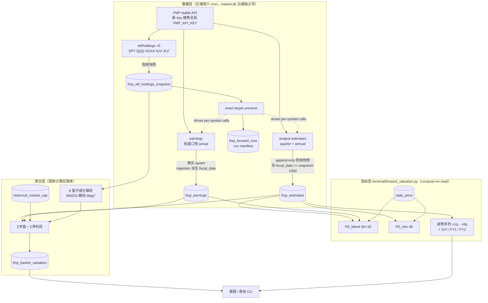

# FMP Forward EPS 估值体系 — 设计 Spec

> **状态**: ✅ Boss review round 1–3 + writing-plans technical hardening 完成 → 进入实施计划批注
> **Review log（2026-07-11 writing-plans hardening）**: P0 DDL index 缺 `IF NOT EXISTS` 导致 MarketStore 二次打开失败 → 全部 index 改幂等；P1 当前 extended cache 会让历史 verifier 分母漂移 → 新增最小 `fmp_forward_runs` 审计表，writer 在请求前冻结 exact target manifest，verifier 只读该 manifest；coverage 只计 `eps_avg IS NOT NULL` 的未来季。业务表仍为原 4 张，13 项产品决策不变
> **Review log（2026-07-09 round 1）**: P0 报告滞后窗口 PE_blend 断供 → 存储改 `fiscal_date >= snapshot−120d`；P1 fmp_earnings 缺 fiscal_date → ingestion 派生入库 + match_method；P1 阶段① holdings 不落库破坏篮子 PIT → 新增 `fmp_etf_holdings_snapshot` 阶段①即写；P1 历史 PE_blend 未来 actual 泄露 → 强制 `announce_date <= as_of`；minor backfill 批打标 `snapshot_kind='backfill'`
> **Review log（2026-07-09 round 3）**: P1 holdings PK 空 raw_asset 重复丢行 → PK 改 `raw_row_index`，raw_asset 降为审计字段；P1 副类股被记 coverage loss → 加 `covered_by` 列，weight_coverage 分子计入"已由发行人代表覆盖"的副类股权重；P2 universe/verifier 分母 → 写死 `extended_pool ∪ included 规范化 symbol ∪ MAGS 静态`
> **Review log（2026-07-09 round 2）**: P0 双股权重复计权 → share_class_groups 主类股唯一入算 + companyName 撞名 verifier；P1 key 日志泄露 → client 脱敏列为换 key 硬前置；P1 非美股成分口径 → listing_overrides 映射 + 未映射排除留审计；P2 backfill/weekly 同日顺序写死；P2 holdings 快照扩审计字段（raw_asset/name/included/filter_reason）+ weight_coverage 独立覆盖账
> **日期**: 2026-07-09 | **前置**: brainstorm 草稿 `2026-07-09-fmp-forward-eps-valuation-brainstorm.md`（13 项决策全数拍板）+ 背景研究 `docs/research/2026-07-02-forward-eps-quarterly-data-sources.md`
> **北极星对齐**: 数据层（新 FMP 数据线）+ 分析层（估值指标）；同时是「指数内估值转移指标体系」的 Phase 0（PIT panel 从本项目上线开始累积）

---

## 1. 一句话目标

升级 FMP 订阅拿季度颗粒度 forward EPS consensus，为扩展池 ~949 只个股与 6 个指数篮子（SPY/QQQ/SOX/MAGS/IGV/XLF）计算**两种 forward P/E**（PE_blend = 3 实际+1 预测 / PE_ntm = 4 预测），周频快照 append-only 自建 PIT 库，指数级估值落库，最终替代 yfinance forward estimates 线。

## 2. 非目标（YAGNI）

- ❌ 日频快照（周频足够，随周六 forward cron）
- ❌ 个股派生指标落库（compute-on-read，仅指数级落库）
- ❌ concept registry L3 自定义篮子（等 registry 重构后二期接入）
- ❌ 本期下线 yfinance 线（4 周对拍通过后另行决策执行）
- ❌ EPS 之外的深度预测分析（revenue/EBITDA 字段照存，指标层本期只做 EPS/净利润）

## 3. 架构总览



数据流向单向：FMP → 4 张业务表 + 1 张 run-manifest 审计表 → 指标层现算 → 晨报/CLI。指标层不反向写库（唯一例外：聚合层的篮子估值由 cron 落库，理由见 §6.4）。

## 4. 已拍板决策索引（13 项）

完整表见 brainstorm 草稿。关键项：

| # | 决策 | 结论 |
|---|------|------|
| 6 | 新 FMP key | 替换全局 `FMP_API_KEY`（本地+云端 .env），明文不入 repo |
| 7 | yfinance 线去留 | FMP 替代，先 4 周对拍再下线；对拍期两线并存 |
| 8 | 架构 | 方案 B：新表 + 独立派生指标层 |
| 9 | 存储粒度 | 方案 A+：周频只存未来行；一次性 backfill 2021-01-01 起 |
| 10 | NTM 对齐 | Rule A 日历严格（`fiscal_date >= as_of` 取 4 季），锯齿 artifact 文档标注 |
| 11 | YoY 分母 | 街道 actual（`fmp_earnings.eps_actual`），绝不用 income GAAP（issue036） |
| 12 | 指数落库 | 6 篮子周频落库；个股 compute-on-read |
| 13 | 两种 P/E | PE_blend（3 已报告街道 actual + 1 预测）+ PE_ntm（4 预测） |

## 5. 数据层设计

### 5.1 FMP client 扩展（`src/data/fmp_client.py`）

新增 3 个方法，风格对齐现有方法（`_request` + rate limit）：

```python
def get_analyst_estimates(symbol, period="quarter", limit=100) -> List[Dict]
    # GET stable/analyst-estimates?symbol=X&period={quarter|annual}
def get_earnings(symbol, limit=8) -> List[Dict]
    # GET stable/earnings?symbol=X  （epsActual/epsEstimated/revenueActual/…）
def get_etf_holdings(symbol) -> List[Dict]
    # GET stable/etf/holdings?symbol=X  （asset/weightPercentage/marketValue）
```

三个端点均已用新 key 实测可用（2026-07-09）：quarter estimates AAPL 深度 +9~10 季；earnings 未报告季 `epsActual=null`；holdings SPY 505 / QQQ ✓ / SOXX 33 / IGV ✓ / XLF 80；**MAGS holdings 是 T-bill+TRS 不可用 → 静态硬编码 Mag 7**。

**限速**：现有 client 默认 2s 间隔下全量周频抓取（~1100 股 × 3 调用）需约 110 分钟，不可接受。新 plan 限额更高，抓取任务使用**独立可配置间隔**（`config/settings.py`，默认保守值，实施时按新 plan 实测限额调优，目标 <30 分钟）。现有其他 FMP 调用不改间隔。

### 5.2 新表 ×4（market.db，云端独占写，同步走现有 `sync_to_cloud.sh --pull`）

```sql
-- 周频 PIT 快照（append-only，核心资产）
CREATE TABLE IF NOT EXISTS fmp_estimates (
    symbol TEXT NOT NULL,
    snapshot_date TEXT NOT NULL,      -- 抓取日；PIT 锚
    fiscal_date TEXT NOT NULL,        -- 财季/财年截止日
    period_type TEXT NOT NULL CHECK(period_type IN ('Q','FY')),
    snapshot_kind TEXT NOT NULL DEFAULT 'weekly'
        CHECK(snapshot_kind IN ('weekly','backfill')),  -- backfill 批不是真 PIT 快照，防误用
    eps_avg REAL, eps_high REAL, eps_low REAL,
    rev_avg REAL, rev_high REAL, rev_low REAL,
    net_income_avg REAL, ebitda_avg REAL,
    num_analysts_eps INTEGER, num_analysts_rev INTEGER,
    PRIMARY KEY (symbol, snapshot_date, fiscal_date, period_type)
);
CREATE INDEX IF NOT EXISTS idx_fest_symbol_snap ON fmp_estimates(symbol, snapshot_date);
CREATE INDEX IF NOT EXISTS idx_fest_snap ON fmp_estimates(snapshot_date);

-- 街道口径财报事实（非快照制：actual 不变，无 PIT 需求；历史计算须 as-of 过滤，见 §6.1）
CREATE TABLE IF NOT EXISTS fmp_earnings (
    symbol TEXT NOT NULL,
    announce_date TEXT NOT NULL,      -- 财报公告日（FMP earnings 的 date 字段）
    fiscal_date TEXT,                 -- 财季截止日，ingestion 时派生（见 §5.3），join SSOT
    match_method TEXT,                -- 'estimates_window' | 'none'（无匹配，行保留但不入算）
    eps_actual REAL, eps_estimated REAL,
    revenue_actual REAL, revenue_estimated REAL,
    last_updated TEXT,
    PRIMARY KEY (symbol, announce_date)
);
CREATE INDEX IF NOT EXISTS idx_fearn_symbol_fiscal ON fmp_earnings(symbol, fiscal_date);

-- ETF 成分快照（阶段①即落库——成分周频漂移，不存则阶段②无法 PIT 重建篮子历史）
-- 全部原始行落库（含被过滤行），included/filter_reason 留审计证据链
CREATE TABLE IF NOT EXISTS fmp_etf_holdings_snapshot (
    basket TEXT NOT NULL,             -- 'SPY'|'QQQ'|'SOX'|'IGV'|'XLF'（MAGS 静态清单不需要）
    snapshot_date TEXT NOT NULL,
    raw_row_index INTEGER NOT NULL,   -- FMP 响应行序；raw_asset 实测有空串重复（QQQ 5 行/SOXX 3 行等），不能当 PK
    raw_asset TEXT,                   -- FMP 原始 asset 字段（含外股后缀/现金代码/空串原样，纯审计）
    symbol TEXT,                      -- 规范化后的 US ticker；被排除行为 NULL
    name TEXT, weight_pct REAL, market_value REAL,
    updated_at TEXT,                  -- FMP updatedAt
    included INTEGER NOT NULL,        -- 1=入算成分 0=排除
    filter_reason TEXT,               -- 'cash_or_fund'|'swap'|'foreign_listing_unmapped'|'dual_class_secondary'|NULL
    covered_by TEXT,                  -- 仅 dual_class_secondary 行：代表其覆盖的主类股 ticker（如 GOOG 行 → 'GOOGL'）
    PRIMARY KEY (basket, snapshot_date, raw_row_index)
);

-- 指数篮子估值（周频落库，见 §6.4）
CREATE TABLE IF NOT EXISTS fmp_basket_valuation (
    basket TEXT NOT NULL,             -- 'SPY'|'QQQ'|'SOX'|'MAGS'|'IGV'|'XLF'
    snapshot_date TEXT NOT NULL,
    fwd_pe_blend REAL,                -- Σ市值 ÷ Σ(3 已报告街道净利 + 1 预测净利)
    fwd_pe_ntm REAL,                  -- Σ市值 ÷ Σ NTM 净利润
    total_mcap REAL, ntm_net_income REAL, blend_net_income REAL,
    n_members INTEGER, n_covered_ntm INTEGER, n_covered_blend INTEGER,
    mcap_coverage_ntm REAL, mcap_coverage_blend REAL,
    weight_coverage REAL,             -- Σ入算成分 holdings 权重 ÷ Σ股票行权重（含被排除外股/副类股的真实覆盖账）
    members_json TEXT,                -- 审计: [{symbol, mcap, ntm_ni, blend_ni}]
    PRIMARY KEY (basket, snapshot_date)
);

-- Run manifest（审计元数据，不是第五个业务数据集）
-- 冻结 writer 当时的 exact denominator，避免 extended_universe.json 后续刷新
-- 令历史 verifier 分母漂移。
CREATE TABLE IF NOT EXISTS fmp_forward_runs (
    snapshot_date TEXT NOT NULL,
    run_kind TEXT NOT NULL CHECK(run_kind IN ('weekly','backfill')),
    status TEXT NOT NULL CHECK(status IN ('planned','running','complete','failed')),
    target_universe_json TEXT NOT NULL,
    target_count INTEGER NOT NULL,
    quarter_success INTEGER NOT NULL DEFAULT 0,
    quarter_failure_count INTEGER NOT NULL DEFAULT 0,
    started_at TEXT NOT NULL,
    completed_at TEXT,
    summary_json TEXT,
    PRIMARY KEY (snapshot_date, run_kind)
);
CREATE INDEX IF NOT EXISTS idx_ffr_status ON fmp_forward_runs(status, snapshot_date);
```

`market_store.py` 新增 upsert/get 方法，风格对齐现有 `upsert_forward_estimates` / `get_latest_forward_estimates`（含 `_validate_table` 白名单登记）。

### 5.3 写入规则

- **fmp_estimates 周频**：每周六对每股写 **`fiscal_date >= snapshot_date − 120 天`** 的行（未来 ~10 Q + ~5 FY + 报告滞后窗口内 1-2 个已结束未报告季 ≈ 17 行/股）。120 天回看是 P0 修复：PE_blend 的"+1 预测季"常常财季已结束但未报告（如 AAPL 财季 6/28 结束、7/30 才报告），只存 `>= snapshot_date` 会把它过滤掉导致 PE_blend 财报前窗口算不出。注意存储放宽**不改变** PE_ntm 的 Rule A 计算过滤（read-time 仍取 `fiscal_date >= as_of`）。`INSERT OR REPLACE`——PK 含 snapshot_date，天然 append-only + 同日重跑幂等
- **fmp_estimates 一次性 backfill**：接入日全量抓 `limit=100`，存 `fiscal_date >= 2021-01-01` 的全部行（含历史），`snapshot_date = backfill 日`，**`snapshot_kind='backfill'`**（backfill 批的历史行是"当时 consensus 的今日留档"，不是真 PIT 快照，打标防止未来误当历史快照消费）。约 46k 行，之后零增量。**与 weekly 同日语义（P2）**：`snapshot_kind` 不在 PK 内，同日两批的未来行会互相覆盖——规定 backfill 为一次性手动步骤，**避开周六 cron 时段执行**；若确需同日，顺序写死"先 backfill 后 weekly"，weekly 覆盖未来行并重标 `kind='weekly'`（同源数据取更新者，无歧义）
- **fmp_earnings**：周频 upsert 最近 8 季 + 一次性 backfill 2021 起（`limit` 放大到覆盖 2021）。约 24k 行 backfill。**写入前先删除该股 `eps_actual IS NULL` 的旧行**——未报告行的公告日是预排日会漂移，不清删会残留幽灵行，污染"最早未报告行"判定
- **fmp_earnings 的 `fiscal_date` 在 ingestion 时派生**（P1 修复：join SSOT 入库，不留到 read-time）：同一 run 内用该股 estimates 的财季日期集合匹配——取满足 `fiscal_date < announce_date` 且 `announce_date − fiscal_date <= 120 天` 的最大 `fiscal_date`，记 `match_method='estimates_window'`；无匹配（非常规财历/数据缺口）记 `match_method='none'`，行保留但一切计算跳过并计入 verifier 统计。所有下游 join（PE_blend / YoY / 街道净利×股数）只用入库的 `fiscal_date`，可审计可复核
- **现有 yfinance `forward_estimates` 表完全不动**，对拍期并存
- 体量估算：fmp_estimates 年增 ~86 万行（1100 股 × 15 行 × 52 周），SQLite 无压力

### 5.4 抓取 universe

**`extended_pool ∪ 5 篮子 included 规范化 symbol ∪ MAGS 静态清单`**（约 1050~1150 只）。并集用的是**过滤规范化之后**的 `included=1` symbol 集（cash/swap/外股未映射/副类股均已排除），不是原始 holdings 行。理由：SPY 有约百余只 <$10B 成分不在扩展池，若只算池内成员，扩展池周频换血会让 SPY 序列人为跳变——序列稳定性是 PIT 时间序列的生命线。成分清单每周从 holdings 端点刷新落快照后求并集。

### 5.5 云端 cron 集成

挂在周六 `finance_forward` job 末尾追加 FMP 步骤，与现有 yfinance 步骤串行。writing-plans 生产审计发现 10:00 `finance_fundamental` 实测运行到 10:26，而 forward 现为 10:15，存在并发写 `market.db`；落地时 forward 推荐移到 10:45（若近期 fundamental >35min 则 11:00），且 fundamental/forward 共用 `market_db_writer` 资源锁，时钟只作缓冲、资源锁才是不并发保证：

1. 刷新 5 个 ETF holdings（5 调用）→ **落库 `fmp_etf_holdings_snapshot`**（阶段①即写入，保证篮子成分 PIT 从第一周开始累积）→ 解析成分 → 求 universe 并集
2. 逐股抓 quarter estimates + annual estimates + earnings（3 调用/股）
3. 写 fmp_estimates（未来行）+ fmp_earnings（upsert）
4. 计算 6 篮子两种 P/E → 写 fmp_basket_valuation（**此步阶段②才接入**，阶段①只跑 1-3+5）
5. verifier 自检（见 §8，篮子检查项随阶段②扩展）+ Telegram 摘要（复用现有 cron 报告模式）

Run-manifest 状态机：先以 exact full universe 写 `running`；writer gate 失败 → `failed`；writer 通过仍保持 `running`；weekly/backfill 各自只由同 `run_kind` verifier PASS → `complete`，verifier FAIL/exception → `failed`。`--symbols` 非 dry-run 只允许作为 resume：必须是既有 full manifest 的子集且不得改变历史分母；同日 full rerun 在任何 DB 写入前先核对 manifest 相等。Resume 后 run-wide success/failure 从完整 snapshot 重算，subset attempt 统计不得覆盖 full-run 字段。

失败隔离：单股失败记日志继续批次；**若失败率 >20% 中止篮子聚合步**（快照可以残缺，篮子估值不能用残缺快照算）——estimates 写入本身可安全部分写（重跑同 snapshot_date 幂等补齐）。

### 5.6 key 替换（部署步骤，含代码前置）

**前置（必须先行）：日志脱敏**。现状 `fmp_client.py` 的 `logger.error(f"Request error: {e}")` 在网络异常时会把含 `apikey` 的完整 URL 写入日志，而 `cron_wrapper.sh` 失败时 tail 40 行日志直发 Telegram——完整泄露链。修法：`_request` 的异常/错误日志统一过 `_sanitize`（正则掩码 `apikey=***`），单测断言日志文本不含 key。**脱敏 commit 部署后才允许换 key**。

替换本身：新 key 写入本地 + 云端 `.env` 的 `FMP_API_KEY`（覆盖旧值），现有全部 FMP 调用自动受益。明文绝不入 repo/文档（2026-06-10 隐私敞口教训）。`.env` 中暂存的 `FMP_UPGRADED_API_KEY` 行替换后删除。

## 6. 指标层设计（`terminal/forward_valuation.py`，compute-on-read）

### 6.1 两种 P/E（个股）

**PE_ntm（4 预测）**：
- 从指定 snapshot（默认最新）取 `period_type='Q'` 且 `fiscal_date >= as_of` 的最近 4 季 `eps_avg` 求和 = NTM EPS
- `forward P/E = close ÷ NTM EPS`
- Rule A 日历严格：财季结束→财报发布的窗口（~2-6 周）NTM 提前滚动一季，锯齿 artifact 已知已文档化（决策 10）

**PE_blend（3 实际 + 1 预测）**：
- **as-of 纪律（P1 修复，防未来 actual 泄露）**：一切"已报告/未报告"判定都叠加 as-of 过滤——已报告 = `eps_actual IS NOT NULL AND announce_date <= as_of`；`announce_date > as_of` 的行即使 actual 已回填也视作未报告。当前查询 `as_of = today` 时过滤自然无损；历史序列计算（`as_of = 历史 snapshot_date`）没有这条会用到当时尚未公布的 actual
- 分母 = as-of 视角下最近 3 个已报告季 `eps_actual` 之和 + 下一个未报告财季的 `eps_avg`（预测值统一取自对应 snapshot 的 fmp_estimates，保证与 PE_ntm 同源）
- 财季对齐直接用 `fmp_earnings.fiscal_date`（ingestion 时已派生入库，见 §5.3）；`match_method='none'` 的行不入算，凑不齐 3+1 → 返回 None + 原因码
- 注 1：PE_blend 滚动发生在财报日（Rule B 语义），PE_ntm 滚动在日历季末（Rule A），两者滚动节奏不同是设计使然（决策 10 + 13）
- 注 2：`eps_actual` 数值本身是 latest-known（极少数重述场景与当时值有微差），as-of 过滤管的是"何时可见"，已满足 PIT 要求；重述级精度非本项目目标

### 6.2 逐季序列与 YoY

- `+1q…+8q`：`eps_avg/high/low + num_analysts_eps` 逐季序列（支持 8q8q 型图与逐季增速）
- **YoY 增速** = `est(+kq) ÷ eps_actual(去年同季)` − 1；去年同季从 fmp_earnings 按 `fiscal_date` 取（目标 = 该 est 财季 `fiscal_date − 1 年`，容差 ±20 天），同为街道口径无失真；同样受 §6.1 as-of 纪律约束（`announce_date <= as_of`）；缺 actual → 该季 YoY 输出 None 不补插

### 6.3 FY1 / FY2

annual 行直读：FY1/FY2 EPS、FY1→FY2 隐含增速、FY1 口径 forward P/E。仅个股展示层，篮子不落 FY 口径。

### 6.4 价格对齐与 as-of 纪律

- **当前查询**：分子 = 最新 `daily_price` close（日频），分母 = 最新快照（周频）；输出**显式携带** `price_date` + `snapshot_date`，不做隐式对齐
- **历史序列**：锚定 `snapshot_date`，配当日或之前最近交易日 close——每个历史点 PIT 一致
- 个股派生值一律不落库；指数级落库的唯一理由：成分清单周频漂移，不落库则历史指数 P/E 永久失去 PIT 重建能力（fmp_basket_valuation 的 members_json 把当周成分一并留档）

### 6.5 质量 gate

- 任一入算季 `num_analysts_eps < 3` → 结果带 `thin_coverage` flag（ONTO 远季仅 2-6 人）
- NTM 4 季 / blend 4 项任一缺失 → 返回 None + 原因码，**不静默补插**
- NTM EPS ≤ 0 → P/E 输出 None + `negative_earnings` flag（个股层面；篮子层面 Σ 法天然处理）

## 7. 聚合层设计

### 7.1 成分清单

| 篮子 | 来源 | 备注 |
|------|------|------|
| SPY / QQQ / IGV / XLF | `fmp_etf_holdings_snapshot` 当周快照（源头 FMP `etf/holdings` 周频刷新） | 全部原始行落库，规范化/过滤结果记 `included` + `filter_reason`（审计证据链）；净成分 = `included=1` |
| SOX | **SOXX holdings 代理**（iShares 跟踪 SOX），同上走快照表 | 33 行，同样规则 |
| MAGS | **静态硬编码 Mag 7**（AAPL/MSFT/NVDA/GOOGL/AMZN/META/TSLA） | FMP 返回 T-bill+TRS 不可用（实测） |

**成分规范化与过滤规则**（parse 时执行，结果全部入快照表）：

1. **现金/货基/swap 行** → `included=0, filter_reason='cash_or_fund'|'swap'`（CUSIP 型 asset、TRS 标记、已知货基代码）
2. **非美股 listing 映射**：SOXX/IGV 实测含 `NVMI.TA`/`OTEX.TO`/`LSPD.TO` 等外市代码，但这些公司均有美股上市与 FMP estimates 覆盖 → 静态映射表 `config/baskets/listing_overrides.json`（如 `NVMI.TA→NVMI`）规范化到 US ticker；映射外的外市后缀 → `included=0, filter_reason='foreign_listing_unmapped'` + verifier 警示（提示补映射）
3. **双股权去重（P0）**：`GOOG/GOOGL`、`FOX/FOXA`、`NWS/NWSA`、`HEI/HEI.A` 类同发行人多类股同时在池——FMP `netIncomeAvg` 与 `historical_market_cap` 均为**公司级**，逐 ticker Σ 会把该发行人权重放大一倍。静态配置 `config/baskets/share_class_groups.json` 指定发行人主类股（取 estimates 覆盖/流动性优的一类），副类股 → `included=0, filter_reason='dual_class_secondary', covered_by=<主类股 ticker>`；发行人以公司级市值+净利**只计一次**。副类股是"已由发行人代表覆盖"而非缺失——coverage 记账见 §7.3。verifier 对入算成分做 profile `companyName` 重复检测，撞名且不在配置表 → 警示（抓未来漂入的新双股权）

### 7.2 聚合公式

```
fwd_pe_ntm   = Σ成分市值 ÷ Σ成分 NTM 净利润        （net_income_avg 未来 4 季求和，Rule A）
fwd_pe_blend = Σ成分市值 ÷ Σ成分 blend 净利润
   blend 净利润 = 3 已报告季街道净利 + 1 季预测净利
   已报告季街道净利 ≈ eps_actual × 稀释股数（income_quarterly 股数——股数口径中性可用）
   预测净利 = net_income_avg（下一个未报告季）
```

- 负盈利成员照算进 Σ（Σ 法优于逐股 P/E 加权：无穷大/负 P/E 不炸）
- 市值取 snapshot 当日 `historical_market_cap`，缺则回退最新 profile 市值
- 稀释股数取该财季 `income_quarterly` 匹配行，缺则回退该股最近已知股数
- **口径说明**：结果是"成分组的市值加权估值"，非 ETF 实际权重（SPY float-adjusted、MAGS 等权）；估值追踪的标准做法，6 篮子口径统一可横比

### 7.3 缺失处理

成分无 estimates/earnings 覆盖 → 该成员从分子分母**同时剔除**（绝不单边），`mcap_coverage_*` 记录真实覆盖率；coverage < 90% 照常出数但带 flag，展示端显示警示。

**weight_coverage 口径**（用 holdings 权重独立记账，不依赖我们自己的市值数据）：

```
weight_coverage = (Σ included 行权重 + Σ dual_class_secondary 行权重[其 covered_by 主类股已入算])
                  ÷ Σ 全部股票行权重（含 foreign_listing_unmapped）
```

副类股权重计入**已覆盖**（发行人公司级市值/净利已代表全部类股，GOOG/GOOGL 不算 coverage loss）；真正的缺失只有 `foreign_listing_unmapped` 和主类股本身无 estimates 覆盖两类。现金/货基/swap 行不属于股票行，分子分母都不进。

## 8. Verifier 与数据验证

新增或扩展 verify 脚本（参照 `scripts/verify_forward_coverage.py` 模式：RO URI + ISO date 校验 + empty fail-fast）：

- 快照覆盖率：本次 snapshot_date 下有 ≥4 个 `eps_avg IS NOT NULL` 未来季的 symbol 数 ÷ universe **≥ 90%**（低于则 verifier FAIL + Telegram 警示）。writer 在发起逐股请求前把 §5.4 的 exact sorted universe 写入 `fmp_forward_runs`；verifier 只读该 snapshot manifest，**不使用当前 extended cache 重建历史分母，也不混入原始 holdings 行**
- 篮子完整性：6 篮子当周各 1 行、coverage 字段合理、members_json 可解析
- fmp_earnings 新鲜度：抽样近期财报票 actual 已回填

## 9. 三阶段推进

| 阶段 | 内容 | 验收 |
|------|------|------|
| **① 数据层** | client 3 方法 + **4 业务表 + 1 run-manifest 审计表**（estimates / earnings / holdings snapshot / basket 建表预留 / exact denominator）+ backfill（estimates 2021+ / earnings 2021+）+ 周频 cron 步骤 + key 替换 | 云端首跑：universe manifest + 全量快照 + holdings 快照落库，verifier 全绿；backfill 行数对账 |
| **② 指标层 + 聚合层** | forward_valuation.py（两种 P/E + 逐季 + YoY + FY）+ 6 篮子聚合 + basket 落库接入 cron + 查询 CLI；**用①期间累积的 holdings 快照回算①各周篮子估值**（basket 历史从①首跑周起完整） | 抽样对拍（AAPL/MU/ONTO/GLW）人工核对；篮子数与公开数据源横比 sanity |
| **③ 晨报集成 + 对拍** | 晨报接入（形态届时另定小 plan）；FMP vs yfinance 4 周对拍报告 | 对拍报告过 Boss review 后，yfinance 线下线另行决策 |

阶段 ① 先行独立上线——PIT panel 从第一个周六 cron 开始累积，指标层可以晚于数据层。

## 10. 风险与缓解

| 风险 | 缓解 |
|------|------|
| FMP consensus 样本薄（AAPL 9-13 人 vs IBES ~40） | thin_coverage flag + ③ 阶段 4 周对拍 yfinance（Refinitiv）定量评估 |
| earnings→estimates 财季对齐规则出错（非常规财历） | ingestion 时派生入库（`fiscal_date` + `match_method`，可审计）；无匹配行不入算 + verifier 统计；测试覆盖 1 月底/4 月底公告等边界 |
| 历史序列泄露未来信息 | PE_blend/YoY 强制 `announce_date <= as_of` 过滤；estimates 只按 snapshot 读；`snapshot_kind='backfill'` 批不当 PIT 历史消费；各有测试断言守护 |
| 新 plan 限额实际值未验证 | 独立可配置间隔，实施时实测调优；保守默认值兜底 |
| 篮子序列受成分漂移影响 | universe = 扩展池 ∪ 篮子成分（决策），members_json + holdings 快照全行留档可审计 |
| 双股权发行人重复计权（GOOG/GOOGL 类） | share_class_groups 静态配置只计主类股 + verifier companyName 撞名检测抓漂入 |
| API key 泄露（日志→Telegram） | client 日志脱敏为换 key 硬前置（§5.6），单测断言日志无 key |
| GAAP/街道口径混用 | 铁律：actual 只用 fmp_earnings（街道），income 表只取股数；测试断言守护 |
| 周六 cron 时长膨胀 | 独立间隔目标 <30 分钟；失败率 >20% 中止聚合步防脏数据 |

## 11. 测试策略

- **client**：fixture JSON（真实响应样本）解析测试 ×3 端点，含 MAGS TRS 行过滤、epsActual null
- **store**：4 表 upsert/get/幂等重跑/PK 冲突，tmp sqlite；ingestion 派生 fiscal_date 匹配规则（正常/无匹配/非常规财历）；null 行清删；**holdings 空 raw_asset 重复行全落库不丢**（raw_row_index PK 回归测试）
- **指标层**：NTM 对齐边界（季末缺口窗口、缺季、thin analysts、负 EPS）、blend 分界（null actual、`match_method='none'` 跳过、**as-of 泄露断言**：历史 as_of 不得使用 `announce_date > as_of` 的 actual）、报告滞后窗口 PE_blend 可算（P0 回归测试：AAPL 6/28 财季场景）、YoY 缺 actual、as-of 双日期输出
- **聚合层**：负净利成员、缺覆盖成员剔除对称性、coverage 计算（mcap + weight 双口径）、MAGS 静态清单、股数 fallback 链、**双股权去重**（GOOG/GOOGL 只计一次、副类股 covered_by 正确、weight_coverage 不把副类股算缺失）、**外股映射**（NVMI.TA→NVMI、未映射后缀排除+警示+计入 coverage loss）
- **安全**：`_sanitize` 日志脱敏单测（模拟 RequestException，断言日志文本不含 apikey）
- **cron wrapper**：失败率中止逻辑、Telegram 摘要、幂等重跑
- 全程 TDD（项目惯例），云端 Python 3.10 兼容（无 3.12 特性）
