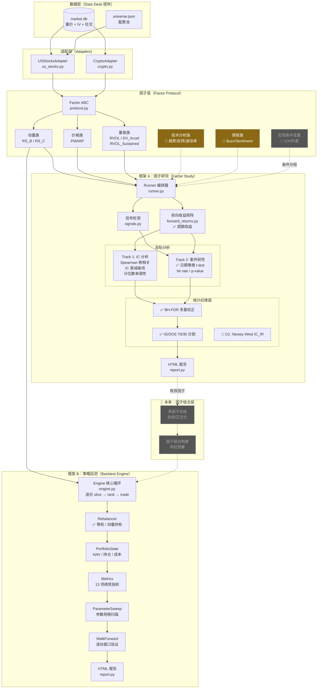
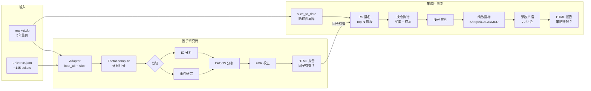
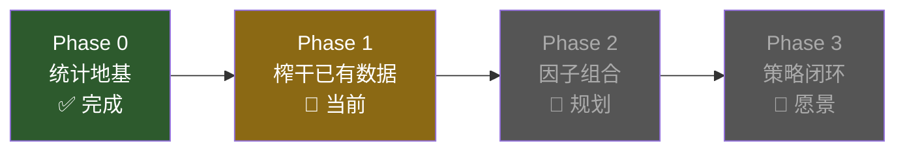

# 因子挖掘 + 回测子系统 — 北极星路线图

> **定位**：本文档是因子/回测子系统的全景地图。回答三个问题：现在在哪、要去哪、怎么走过去。

---

## 一、子系统定位

```
未来资本 AI 交易台
├── Data Desk ──────── 数据采集与存储
├── Terminal ────────── 分析编排
├── Knowledge Base ──── 投资框架
├── ★ Backtest Desk ── 因子挖掘 + 回测 ← 本文档
├── Options Desk ────── 期权
├── Portfolio Desk ──── 持仓管理
└── Risk Desk ──────── 风控
```

Backtest Desk 的使命：**用统计证据回答两个核心问题**

| 问题 | 框架 | 输出 |
|------|------|------|
| 这个因子有没有预测力？ | Factor Study（因子研究） | IC, p-value, 衰减曲线 |
| 这个策略能不能赚钱？ | Backtest Engine（策略回测） | Sharpe, CAGR, MaxDD |

两者的关系是**先验证、后构建**：Factor Study 筛选出有效因子 → Backtest Engine 用有效因子构建可交易策略。

---

## 二、系统架构

### 2.1 全景架构图



> ✅ = 已实现 | 🔲 = 待建 | 灰色 = 未来规划

### 2.2 核心数据流



---

## 三、当前状态盘点

### 3.1 代码规模

| 模块 | 文件数 | 行数 | 核心类/函数 |
|------|--------|------|------------|
| 回测引擎 (`backtest/*.py`) | 8 | ~1,795 | BacktestEngine, PortfolioState, Rebalancer, BacktestMetrics |
| 因子研究 (`backtest/factor_study/`) | 10 | ~2,200 | FactorStudyRunner, Factor(ABC), ICResult, EventStudyResult |
| 适配器 (`backtest/adapters/`) | 3 | ~580 | USStocksAdapter, CryptoAdapter |
| **合计** | **21** | **~4,575** | — |

### 3.2 因子清单

| 因子 | 族群 | 范围 | 市场 | 数据源 | IC 验证 |
|------|------|------|------|--------|---------|
| RS_Rating_B | 动量 | 0-99 | 美股 | market.db 量价 | ✅ 可跑 |
| RS_Rating_C | 动量 | 0-99 | 美股 | market.db 量价 | ✅ 可跑 |
| PMARP | 价格 | 0-100 | 美股 | market.db 量价 | ✅ 可跑 |
| RVOL | 量能 | -5~10 | 美股 | market.db 量价 | ✅ 可跑 |
| DV_Acceleration | 量能 | 0-5 | 美股 | market.db 量价 | ✅ 可跑 |
| RVOL_Sustained | 量能 | 0-30 | 美股 | market.db 量价 | ✅ 可跑 |
| Crypto_RS_B | 动量 | 0-99 | 币圈 | Binance CSV | ✅ 可跑 |
| Crypto_RS_C | 动量 | 0-99 | 币圈 | Binance CSV | ✅ 可跑 |
| Market_Momentum | 宏观 | -5~5 | 美股 | market.db 量价 | ✅ 可跑 |

**问题：9 个因子全部是动量/量能族。缺少基本面、情感、宏观维度。**

### 3.3 统计纪律现状

| 编号 | 问题 | 严重度 | 状态 |
|------|------|--------|------|
| R1 | IC/事件用原始收益而非超额收益 | RED | ✅ 已修 |
| R2 | 参数扫描无多重检验校正 | RED | ✅ 已修 (BH-FDR) |
| R3 | 无 IS/OOS 时间分割 | RED | ✅ 已修 (70/30) |
| R4 | 事件研究重叠窗口膨胀 N | RED | ✅ 已修 (日期聚类) |
| R5 | 再平衡逻辑模糊 | RED | ✅ 已修 (双模式) |
| O1 | IC_IR 无 Newey-West 校正 | ORANGE | 🔲 待修 |
| O2 | Sharpe 用 Rf=0 而非国债利率 | ORANGE | 🔲 待修 |
| O3 | Alpha 算术年化非几何 | ORANGE | 🔲 待修 |

**当前评级：B+ / A-（5 RED 清零，3 ORANGE 待修）**

---

## 四、北极星路线图

### 4.0 总览



### Phase 0：统计地基 ✅ 完成

让框架输出的结论**可信赖**。一切后续工作的前提。

- ✅ 超额收益（vs SPY）
- ✅ 日期聚类 t-test
- ✅ BH-FDR 多重检验校正
- ✅ IS/OOS 时间分割
- ✅ 等权 vs 动量持有双模式
- 🔲 O1-O3 收尾（低优先级，不阻塞后续）

---

### Phase 1：榨干已有数据 — 经典因子 + 快速验证

> **设计决策**：不做自动因子挖掘引擎。Codex1 证明暴力搜索因子空间的 ROI 不够——那是文艺复兴的游戏。我们的优势是判断力，瓶颈不是"因子太少"，而是"从直觉到验证太慢"。
>
> 策略：**人提供假设，机器提供速度**。

**聚焦两个领域，两件事并行推进**：

> **范围决策**：Phase 1 只做技术分析 + 社交情感两个领域。基本面因子（价值/质量/预期修正）暂不做——季报频率低（每季度 1 个数据点）、IC 计算需降频、与我们的交易风格不匹配。宏观因子作为条件变量纳入，但不是独立因子。

#### 1A. 批量铺设经典因子（搬运已知知识）

用 market.db 已有数据实现经过学术/实战验证的经典因子，跑 IC 建立 baseline。

**技术分析族 — 趋势与均线** — 数据源：`daily_price` (market.db)

| 因子 | 含义 | 难度 |
|------|------|------|
| MA_Cross | 短期均线/长期均线比值（如 EMA20/EMA50） | 低 |
| Price_vs_MA200 | 价格相对 200 日均线的偏离度 | 低 |
| Trend_Strength | ADX 或线性回归 R² 衡量趋势强度 | 中 |
| Drawdown_Rank | 当前回撤深度的横截面排名（浅回撤=强势） | 低 |

**技术分析族 — 反转与超买超卖** — 数据源：`daily_price` (market.db)

| 因子 | 含义 | 难度 |
|------|------|------|
| RSI_14 | 14 日 RSI 横截面排名 | 低 |
| Mean_Reversion | N 日收益率反转（短期跌多的未来是否反弹） | 低 |
| Bollinger_Pct | 价格在布林带中的位置 (0-1) | 低 |

**技术分析族 — 波动率** — 数据源：`daily_price` + `iv_daily` (market.db)

| 因子 | 含义 | 难度 |
|------|------|------|
| HV_Rank | 历史波动率百分位排名 | 低 |
| IV_Rank | 隐含波动率百分位（IV 数据已有 ~1 年） | 低 |
| IV_HV_Spread | IV - HV 差值（正=市场预期波动 > 实际，可能有事件） | 中 |

**社交情感族** — 数据源：`social_sentiment` (Adanos)

| 因子 | 含义 | 难度 |
|------|------|------|
| Social_Buzz | 社交讨论热度 Z-score | 低 |
| Sentiment_Score | 情感倾向分 | 低 |
| Attention_ZScore | 加权注意力异常值 | 低 |
| Buzz_Acceleration | 讨论量 N 日变化率（突增检测） | 低 |

> ⚠️ 社交数据仅 ~60 天，OOS 自动跳过。IC 结论置信度有限，但值得先看趋势。

**宏观条件变量**（非独立因子，用于条件 IC 分析）— 数据源：FRED

| 变量 | 含义 | 用途 |
|------|------|------|
| VIX_Regime | VIX 所处百分位 | 分组：高波 vs 低波环境下，哪些技术因子更有效？ |
| Yield_Curve_Slope | 10Y-2Y 利差 | 分组：陡峭 vs 倒挂环境下的因子表现差异 |

> ⚠️ 宏观变量横截面不变（同一天所有股票值相同），不能直接做 IC。作为**条件变量**——在不同 regime 下分别跑 IC，看哪些因子在哪种环境下有效。需要扩展 Runner 支持条件分组。

#### 1B. 快速假设验证管道（降低摩擦）

**当前**：手动写 Factor 类 → 注册到 `FACTOR_REGISTRY` → 跑 runner → 看报告（~2 小时）

**目标**：描述因子逻辑 → 自动生成 adapter → 即时验证 → 报告（~5 分钟）

实现方式：
1. **因子模板库**（`factor_study/templates/`）— 预定义常见因子模式：
   - `RankTemplate`: 某指标的横截面排名（输入：字段名 + 表名）
   - `RatioTemplate`: 两个指标的比值排名
   - `ChangeTemplate`: 某指标的 N 期变化
   - `CrossSectionalZTemplate`: 横截面 Z-score
2. **CLI 快捷方式** — `run_factor_study.py --quick "ROE rank from ratios_annual"` 自动匹配模板、生成临时 Factor、跑 IC
3. **LLM 辅助**（可选）— Claude 读投资论文/你的 memo，提取可测试的因子假设，输出模板参数

> 1B 的价值：把"试一个新因子"的成本从 2 小时降到 5 分钟。试得越多，发现有效因子的概率越大——不靠暴力搜索，靠降低验证摩擦。

---

### Phase 2：因子组合 — 从单因子到多因子

**目标**：把多个有效因子组合成一个综合信号，构建多因子选股模型。

**前提**：Phase 1 产出至少 3-5 个 IC 显著且 OOS 不塌陷的因子。

| 能力 | 说明 |
|------|------|
| 因子相关性矩阵 | 两个因子 IC 高但高度相关 = 信息重复，需要去冗余 |
| 因子正交化 | 回归残差法去除因子间共线性 |
| 加权合成 | IC_IR 加权 / 等权 / 机器学习权重 |
| 组合 IC 评估 | 合成分数的 IC 应优于任何单因子 |
| 因子轮动信号 | 不同 regime 下不同因子的 IC 有消长，可做动态权重 |

**关键设计决策**（到时需要讨论）：
- 静态权重 vs 动态权重？
- 用 IC_IR 排序 vs 用优化器求权重？
- 正交化在因子层做还是组合层做？

---

### Phase 3：策略闭环 — 从研究到实盘

**目标**：因子研究的结论能自动喂入策略回测，形成 Research → Backtest → Signal → Trade 的完整链路。


| 能力 | 说明 |
|------|------|
| Factor → Engine 管道 | 用 Factor Study 验证的因子自动接入 Backtest Engine 作为选股信号 |
| 多因子回测 | Engine 接受合成分数而非单一 RS 排名 |
| 实时信号生成 | 最新数据 → 因子打分 → 今日推荐 Top-N |
| OPRMS 对接 | 因子信号输入 Timing X 轴评分 |
| 因子衰减监控 | 生产环境中跟踪因子 IC 是否衰减，触发重新验证 |

---

## 五、关键设计原则

| 原则 | 含义 | 体现 |
|------|------|------|
| **防前视屏障** | 计算因子分数时只能看到截止当日的数据 | `adapter.slice_to_date(date)` |
| **先验证后构建** | 因子未经 IC + 事件双轨验证不进入策略 | Factor Study → Backtest 单向流 |
| **超额收益优先** | 所有统计检验基于超过基准的收益，而非绝对收益 | `build_excess_return_matrix()` |
| **独立性保证** | 统计检验的 N 必须是真正独立的观测数 | 日期聚类 t-test |
| **多重检验意识** | 扫描越多参数，假阳性越多，必须校正 | BH-FDR |
| **IS/OOS 分离** | 模型在训练集表现好不算数，测试集才算 | 70/30 时间分割 |
| **市场无关性** | 框架通过 Adapter 抽象，同一逻辑跑美股/币圈 | Adapter Pattern |

---

## 六、文件地图

```
backtest/
├── __init__.py              # 公开 API
├── config.py                # BacktestConfig + FactorStudyConfig
│
├── ── 框架 A: 策略回测 ──
├── engine.py                # 核心循环：逐日 slice → rank → trade → NAV
├── portfolio.py             # 持仓状态：NAV 跟踪、买卖执行、成本计算
├── rebalancer.py            # 换仓决策：Top-N + sell_buffer 缓冲
├── metrics.py               # 绩效指标：13 项（Sharpe/Calmar/α/β/IR/MDD...）
├── sweep.py                 # 参数网格：rs_method × top_n × freq × buffer
├── optimizer.py             # Walk-Forward：滚动训练/验证窗口
├── report.py                # HTML 报告：净值曲线 + 绩效表
│
├── ── 框架 B: 因子研究 ──
├── factor_study/
│   ├── __init__.py          # 公开 API
│   ├── protocol.py          # Factor ABC + FactorMeta 统一接口
│   ├── factors.py           # 9 个因子适配器（RS/PMARP/RVOL/DV...）
│   ├── signals.py           # 4 种信号类型（threshold/cross/sustained）
│   ├── forward_returns.py   # 前向收益矩阵 + 超额收益（vs SPY）
│   ├── ic_analysis.py       # Track 1: IC / IC_IR / 分位数 / 衰减曲线
│   ├── event_study.py       # Track 2: 事件研究 + 日期聚类 t-test
│   ├── sweep.py             # 因子参数网格定义
│   ├── runner.py            # 编排器：数据→打分→IS/OOS→双轨→报告
│   └── report.py            # HTML 报告：IC 表 + 事件表 + FDR
│
├── ── 适配层 ──
└── adapters/
    ├── us_stocks.py         # 美股：market.db → DataFrame + slice_to_date
    ├── crypto.py            # 币圈：Binance CSV → DataFrame
    └── crypto_rs.py         # 币圈 RS 计算（短周期 7d/3d/1d）
```

### 入口脚本

| 脚本 | 用途 | 示例 |
|------|------|------|
| `scripts/run_factor_study.py` | 因子研究 | `--factor RS_Rating_B --html` |
| `scripts/run_rs_backtest.py` | 策略回测 | `--market us_stocks --sweep` |

---

## 七、与其他 Desk 的接口

```
Data Desk ──→ market.db ──→ Adapters ──→ Backtest Desk
                                              │
                                              ├──→ Terminal（因子信号 → 晨报 Section）
                                              ├──→ Knowledge Base（IC 结论 → OPRMS Timing）
                                              └──→ Portfolio Desk（买卖清单 → 仓位执行）🔲
```

| 上游依赖 | 接口 | 说明 |
|----------|------|------|
| Data Desk | `market.db` 量价表 | 5 年日频 OHLCV，145 tickers |
| Data Desk | `market.db` IV 表 | 期权隐含波动率（~1 年） |
| Data Desk | `market.db` social_sentiment 表 | 社交情感（~60 天） |
| Data Desk | `market.db` forward_estimates 表 | 前瞻预期（~3 个月） |
| Data Desk | `universe.json` | 股票池定义 |

| 下游消费者 | 接口 | 状态 |
|-----------|------|------|
| Terminal 晨报 | 因子扫描结果 → Section 展示 | 🔲 未对接 |
| Knowledge OPRMS | 因子信号 → Timing 系数输入 | 🔲 概念阶段 |
| Portfolio Desk | 策略信号 → 今日买卖清单 | 🔲 概念阶段 |
