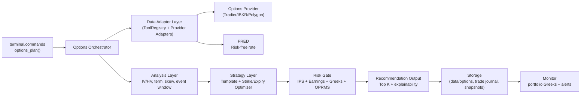

# 期权模块顶层架构设计（Top-Level）

> 日期: 2026-02-24
> 目标系统: Finance 工作区（未来资本 AI Trading Desk）
> 状态: Draft v1（用于需求评审与技术立项）

## 1. 目标与成功标准

### 1.1 业务目标

在现有 Finance 工作区增加“期权模块”，实现从观点输入到策略推荐、风险校验、持仓监控的闭环，服务 Trading Desk 与 Risk Desk。

### 1.2 成功标准（MVP）

1. 给定 `symbol + 观点 + 时间窗口`，系统可输出 Top 3 期权策略候选。
2. 每个候选必须输出可执行参数：到期日、行权价、最大亏损、盈亏平衡点、关键 Greeks。
3. 所有建议必须通过 IPS 与 Greeks 风控规则校验（不合规直接拦截）。
4. 期权持仓能进入组合级 Greeks 汇总，并在超限时触发预警。

### 1.3 非目标（MVP 暂不做）

1. 自动下单/券商交易执行。
2. 高频或逐笔级别策略。
3. 完整历史 tick 级回测框架。

## 2. 需求澄清（分层）

### 2.1 L1 必须需求（MVP）

1. 期权链数据接入（至少 1 个 provider）。
2. 标准化数据模型（合约、报价、Greeks、IV、OI、Volume）。
3. 策略推荐引擎（覆盖 CSP、Covered Call、Vertical Spread、Earnings Defined-Risk）。
4. 下单前风险闸门（IPS 禁止策略、Earnings T-5、Greeks 限额、DNA/Timing 仓位约束）。
5. 组合 Greeks 报表（Delta/Gamma/Theta/Vega）与超限告警。

### 2.2 L2 增强需求（Phase 2+）

1. IV 曲面与期限结构分析（Term Structure / Skew）。
2. 情景压力测试（标的价格、IV 变化、时间衰减）。
3. 展期建议（roll out / roll up / roll down）。
4. 期权策略回测与复盘指标体系。

### 2.3 L3 运营需求

1. 数据可追溯：任一建议都能追溯到对应链快照与风险参数。
2. 可观测性：失败率、延迟、数据新鲜度、风控拦截率。
3. 审计性：建议生成、风控决策、人工覆盖都需要记录。

## 3. 顶层架构



### 3.1 分层职责

1. 编排层（Orchestrator）: 接收输入、调用数据与分析模块、聚合结果。
2. 数据接入层（Data Adapter）: 对接期权 provider，统一为内部标准结构。
3. 分析层（Analysis）: 计算 IV Rank/Percentile、HV 对比、期限结构、事件窗口。
4. 策略层（Strategy）: 根据观点与市场状态筛选策略并优化行权价/到期日。
5. 风控层（Risk Gate）: 执行硬约束，拒绝违规建议并返回拦截原因。
6. 存储与监控层（Storage/Monitor）: 持久化快照、产出 Greeks 报表与告警。

## 4. 模块与目录建议

```text
terminal/
  options/
    commands.py               # options_plan/options_check/options_monitor
    orchestrator.py           # 顶层编排
    models.py                 # 统一数据模型(dataclass/pydantic)
    data/
      adapter.py              # Provider 适配与标准化
      cache.py                # 快照缓存与读取
    analysis/
      iv_metrics.py           # IV Rank/Pctl, IV-HV
      term_structure.py       # 期限结构
      skew.py                 # skew 指标
      event_window.py         # earnings 前后窗口逻辑
    strategy/
      templates.py            # 策略模板与适用条件
      selector.py             # 策略筛选
      optimizer.py            # strike/expiry 优化
      payoff.py               # 盈亏结构与关键点
    risk/
      gate.py                 # 风险总闸门
      greeks_limits.py        # Greeks 限额校验
      sizing.py               # OPRMS 期权仓位换算
    monitor/
      greeks_aggregator.py    # 组合 Greeks 汇总
      alerts.py               # 告警规则
data/
  options/
    raw/{provider}/{symbol}/{date}.json
    normalized/{symbol}/{datetime}.parquet
    snapshots/{date}/
```

## 5. 核心流程

### 5.1 策略推荐流程（在线）

1. 输入: `symbol, direction, timeframe, expected_move, conviction, event_preference`。
2. 拉取数据: 标的现价 + 期权链 + 风险利率 + 事件日历。
3. 计算因子: IV/HV、IV Rank、Skew、Term Structure、流动性评分。
4. 生成候选: 模板库筛选 + 参数优化（strike/expiry）。
5. 风控校验: IPS 禁止项、Earnings 规则、Greeks 限额、DNA/Timing 限额。
6. 输出结果: Top K 策略 + 解释 + 风险标签 + 失败策略拒绝原因。

### 5.2 下单前校验流程（交易前）

1. 读取拟交易结构（多腿合约 + 数量 + 成本）。
2. 计算最大亏损、delta 等效敞口、组合 Greeks 增量。
3. 对照风险阈值给出 `PASS/WARN/BLOCK`。
4. 写入审计日志（含规则命中明细）。

### 5.3 持仓后监控流程（日常）

1. 定时更新持仓 Greeks 与事件窗口状态。
2. 输出组合级仪表盘（Delta/Gamma/Theta/Vega vs Limit）。
3. 触发超限告警与建议动作（减仓/对冲/展期）。

## 6. 关键数据模型（最小集合）

1. `OptionContract`: symbol, expiry, strike, type, multiplier。
2. `OptionQuote`: bid, ask, last, mark, volume, open_interest, timestamp。
3. `OptionGreeks`: delta, gamma, theta, vega, rho, iv。
4. `OptionChainSnapshot`: underlying_price, rf_rate, contracts[]。
5. `OptionIdeaInput`: 观点输入（方向、周期、幅度、置信度）。
6. `OptionStrategyPlan`: 策略参数、盈亏结构、最大风险、风控标签。
7. `RiskCheckResult`: PASS/WARN/BLOCK + 命中规则列表。

## 7. 与现有系统集成点

1. ToolRegistry: 复用 `terminal/tools/protocol.py` 的 `OPTIONS` 分类，新增 provider tools。
2. OPRMS: 复用 `knowledge/oprms` 与 `terminal.pipeline.calculate_position` 的仓位逻辑。
3. Risk Rules: 强绑定 `risk/ips.md`、`risk/rules/greeks-exposure-limits.md`、`risk/rules/earnings-calendar-protocol.md`。
4. Portfolio/Monitor: 对接现有监控入口，扩展期权 Greeks 汇总。
5. Trading Desk: 输出直接映射到 `trading/strategies/options/` 的策略模板与交易日志字段。

## 8. 分期落地建议

### Phase A（MVP 基线）

1. 接入 1 个 provider 并完成标准化模型。
2. 打通 `options_plan()` 在线推荐接口。
3. 上线风险闸门与审计日志。
4. 产出组合 Greeks 报表（先日频）。

### Phase B（增强分析）

1. 引入 IV 曲面/Skew/期限结构高级指标。
2. 增加情景压力测试与展期建议。
3. 提升流动性和滑点建模精度。

### Phase C（研究与回测）

1. 建立期权策略回测数据层与评估指标。
2. 打通复盘回写，沉淀策略胜率与失效模式。

## 9. MVP 验收标准（可测试）

1. 80%+ 请求在 3 秒内返回策略建议（非交易时段可放宽）。
2. 所有输出策略均附带最大亏损与盈亏平衡点。
3. 对违规策略必须返回明确 `BLOCK` 原因（可追溯到具体规则）。
4. 组合 Greeks 报表与手工核对误差在可接受范围（例如 < 2%）。
5. 关键路径具备自动化测试（模型标准化、策略选择、风控拦截）。

## 10. 待决策清单（立项前必须确认）

1. 首选数据源（Tradier / IBKR / marketdata.app / 其他）及预算上限。
2. MVP 是否允许 15 分钟延迟数据。
3. 是否允许生成“可执行下单参数”但不触发自动下单（建议是）。
4. 风控阈值是否沿用现有文档原值，还是按当前账户规模重标定。
5. 期权模块第一期优先覆盖的策略范围（建议先 4 类基础策略）。

---

此文档是对 `docs/design/options_desk_blueprint.md` 的工程化落地版本，重点在“可实现架构 + 可验收需求”。
