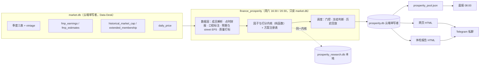

# North Star — 美股景气引擎系统架构方向

> **状态**: **已定稿（2026-09-26 Boss 批准）**。Codex 审批 11 条意见全部接受，其中 3 处由 Boss 拍板；第一至三层经 Boss 逐层批准，第四、五层随全稿审批；三重验证见需求覆盖矩阵、Pre-mortem 与文末反向挑战记录
> **起草**: 2026-09-26
> **输入**: `prosperity-engine-requirements.md`（R1–R16）、`prosperity-engine-research.md`（D1–D9 拍板）、`prosperity-engine-glossary.md`
> **架构师角色**: 买方量化投研基础设施架构师（点时正确性 > 统计显著性 > 功能丰富）
> **对应主北极星**: 第二层「分析层 · 基本面」的量化维度

## 选定方案（Step 2）

**方案 A：独立引擎 + 派生库。** 新 job `finance_prosperity`，周六 16:30，与其他写库任务共用 `market_db_writer` 锁，对 `market.db` 只读；门控不满足就沿用旧榜并标 stale；支持 `--as-of` 补跑。结果写 `prosperity.db`（云端单写者，长表）→ 精选池 JSON → 静态网页与体检报告 → 晨报。本地 `prosperity_research.db` 跑实验方案，与生产共用同一套纯函数打分内核。

运行位置（2026-09-26 复议后维持云端）：云端磁盘紧张的原因是约 16G 的 `market.db` 整库副本，不是计算量；`prosperity.db` 只有几十 MB，D9 补数也只能在云端写。放本地还会多出"推回云端给晨报"的依赖，并受本机开机和本地副本可靠性影响。

---

## 第一层：数据层（2026-09-26 Boss 批准）

分两部分：**A. `market.db` 侧的一次性前置任务**（Data Desk 负责，云端写入）；**B. 引擎侧的点时读取层**（对 `market.db` 只读）。

### 实测依据（云端 `market.db`，2026-09-26 只读查询）

- 资产负债表 / 现金流表：965/981 只只有约 8 季（2024-09 起）。利润表：613 只 40 季，438 只 8 季。
- 2021-09 → 2026-06 各季末市值 ≥$10B 的公司并集：1,306 只，其中 402 只已不在当前池，260 只完全没有财报；剔除优先股、次级股、基金后剩 1,198 只。其中 208 只没有 `fmp_earnings`。
- `approximate_members_as_of` 没有市值时效窗口：已退市或改名的旧代码会一直算作成员（2022-06 有 6 个，2024-06 有 22 个，2026-06 有 39 个）。
- 改名公司新旧代码并存：ABC/COR、ANTM/ELV、BLL/BALL、FLT/CPAY、PEAK/DOC 的市值和财报在同一时期都有记录。
- `historical_market_cap` 从 2021-04-13 起；`daily_price` 从 2021-02-01 起；2021 年前的 11,741 行利润表全部有 `accepted_date`。
- 云端磁盘 49G 用了 46G；`Finance/data/` 19G，其中 `market.db` 本体 1.1G，其余约 16G 是整库副本。

### A. 前置任务（按顺序）

| 步骤 | 内容 | 验收 | 需求 |
|---|---|---|---|
| P0 磁盘 | 周六自动备份只留最近 2 份；各次修复前的手动快照、`.backups/`、`backups/` 全部清掉（删前逐份列清单给 Boss 确认）；备份脚本加保留上限（issue046） | 空闲空间 ≥10G；下一次周六备份后份数仍 ≤2 | 上线前置 |
| P1 成员修复 | `approximate_members_as_of` 加市值时效窗口（as_of 前 10 天内有市值才算）；新增代码别名表，把改名前的旧代码映射到新代码（沿用 `security_source_corrections` 的模式）。这是 Data Desk 的共享函数，按 dev-loop bounded 修 | 上面 5 对改名公司在任何季末只算一次；幽灵成员 = 0 | R4 |
| P2 D9 补数 | 目标：1,198 只历史成员。三表都拉 40 季（FMP 按调用计费，40 季与 32 季成本相同，能回到约 2016 年）；`fmp_earnings` 历史补给 208 只完全没有的，以及 P3 street EPS 检查查出深度不足或财季映射缺失的（按实际缺口，不按"有没有行"）。复用 `backfill_extended_fundamentals.py` 的历史模式（按当时市值选目标、断点续跑清单、熔断），不写新采集器。约 6,000 次调用、约 3.5 小时，避开周六窗口，拿 `market_db_writer` 锁 | 见 P3 | R2、R4、R13、R14 |
| P3 验收 | 每个季末：①三表：身份合规成员中 ≥95% 在当日有 ≥8 季连续三表（`has_asof_window`，只查三表）；②street EPS：逐只检查截至当日已公告的 `eps_actual` 深度（按第二层 SUE 口径：SUE 至少 11 季、完整窗口 13 季；ΔSUE 再多 1 季）、`fiscal_date` 映射率、同财季重复、拆股口径，给出 SUE 可计算率。两项的缺口都逐只列原因，并把"上市历史本来不足"与"采集不足 / `provider_empty` / 失败"分开统计，后者回 P2 补。然后本地重拉 `market.db`，跑 `PRAGMA quick_check`，并复核 2021-09 起点和财报季覆盖率 | 覆盖率报告（三表 + street EPS 两部分）+ quick_check ok | R2、R4、R13 |

P1 与 P2 可以并行：补数目标多选几只没有坏处（旧代码本来就是历史成员），去重只影响读取。补数会让 `market.db` 增加约 200MB（当前表 + vintage 基线），所以必须排在 P0 之后。

### B. 引擎侧点时读取层（只读 `market.db`）

| 模块 | 负责 | 不负责 |
|---|---|---|
| 成员解析 | live 用 `extended_membership`（严格，2026-08-21 起）；历史用 P1 修复后的市值成员；剔除身份受限的代码；每行标 `membership_basis` | 不自己算市值 |
| 点时财报 | 取"可用时点 ≤ as_of"的季度三表。live 读当前表；`--as-of` 补跑时，as_of 在 D9 完成日之后用 `known_as_of`（严格），之前用 `approximate_as_reported`。**按输入来源分别标点时等级**（三表 / street EPS / 一致预期），整行 `pit_basis` 取最弱的一项：`live`（当周实时计算，所用输入值已存档）/ `strict` / `approximate`。`fmp_earnings` 没有历史版本（同一公告的 actual 会被原地更新），补跑中凡用到 street EPS 的行最多是 `approximate`。`accepted_date` 是 EDGAR 接收时间，不是本地采集时间，本身不构成严格点时 | 不回填、不修数；不给 `fmp_earnings` 加版本表（2026-09-26 Boss 拍板） |
| 口径标注 | 按相邻财季间隔天数算 `period_days`，标 53 周财年与 16/12 周季度；拆股校验（只认整数比）；报告币种；`quarter_bucket` / `data_age_days` / `reported_this_week` | 不做天数折算（归因子层） |
| 预期与 street EPS | 一致预期按财季 ±10 天匹配；公告前只取严格早于公告日的最后一个快照；修正只比较同一组固定财季；TTM 用 `fmp_earnings.eps_actual` 求和；NTM 按下方"NTM 契约"；净利润预期不用 | 不做修正广度（D5 未选），yfinance 线可按原计划退役 |
| 数据质量 | 在 `src/data/fundamental_quality.py` 补 Q8–Q17、E1–E7 规则（纯函数、稳定 issue 码），读取时打标；硬错误（营收 <0、单位错等）把对应字段置空，软问题只挂徽章。**影响打分字段（营收、毛利、FCF、净利、street EPS、一致预期）的硬错误检查是生产发布前置**，其余规则可分批 | 不改 `market.db`，不静默丢行 |

**NTM 契约（M4 验收项；不直接复用 `compute_forward_member` 的 `ntm_eps`）**
- **窗口**：TTM 最后一季之后的 4 个未公告季度（公告日 > as_of 的财季，含季末已过、尚未公告的那一季），与 TTM 首尾相接；不能用"`fiscal_date ≥ as_of`"选季度，否则季末到公告之间会跳过一季。
- **D6 回退**：第 3、4 季分析师 <3 人时，改用 FY1/FY2 按时间加权，挂 `ntm_fy_blend` 标签；两种都算不出记缺失。
- **币种与单位**：每股预期先按报告币种换成美元，再按 ADR 比率换到交易单位，与 TTM street EPS 同一口径；币种或 ADR 比率无法核实时 NTM 记缺失（闸门不罚，挂徽章），不能拿原始 `eps_avg` 直接求和比较。
- **验收**：用含季末到公告空窗期的样本、ADR 样本、远季覆盖薄的样本各做测试夹具。

**输出**：每期每只股票一个"点时输入包"，交给因子层（只在内存里）；另往 `prosperity.db` 写一行 `stock_period`：成员依据、各来源点时等级与整行 `pit_basis`、所用财季、可用时点、口径标签、质量标记、`code_version`，**以及当次实际用到的 street EPS 实际值、公告前一致预期、NTM 各季预期与换算系数**（每行十几个数，因为 `fmp_earnings` 与预期会被原地更新，靠反查无法复原）。三表原始数值不复制：`strict` 行按财季键和 as_of 查 `fundamental_vintage`；`approximate` 行只能查当前表，这一点已由标签表明。

**术语**：PIT / vintage / approximate、accepted_date、street 与 GAAP、53 周季度、quarter_bucket（见 glossary）。

---

## 第二层：因子与打分内核（2026-09-26 Boss 批准）

**职责**：输入数据层的点时输入包，输出每只股票的因子原始值、z 值、各方案分数、评级与降级原因。**不负责**：取数、调度、冻结判断、写库、页面。**形态**：纯函数内核，不做任何读写，生产与研究共用同一份代码。

### 因子集合（4 族）

| 族 | 因子 | 口径 | 历史可用 |
|---|---|---|---|
| 加速 | 营收加速 | 本季同比 − 上季同比（pp），先按 91 ÷ 季度天数折算（D1：即季调环比） | 2021 起 |
| | EPS 加速 | ΔSUE = 本季 SUE − 上季 SUE（两季各用各自窗口的 σ） | 2021 起 |
| 增长 | 营收同比 | 单季，天数折算 | 2021 起 |
| | EPS 同比 | **SUE**：(本季 − 去年同季) ÷ σ，σ 取本季之前最近 8 次同比变化的标准差（不含本季、不减均值，Novy-Marx 口径），至少 6 个观测 | 2021 起 |
| | 4 季平均增速 | 沿用 Premium 的 4 季平均增速（营收腿与利润腿平均），利润腿改用 street EPS；CAGR 公式、负基数与扭亏路径在 M6 plan 里逐条写成公式并进测试夹具，未写明前不计分 | 2021 起 |
| 质量 | 毛利率同比 / 毛利率 / FCF 率同比 | pp / 水平 / pp；银行、保险、REIT、公用事业等口径不成立的记为缺失（D4） | 2021 起（FCF 需 D9） |
| 预期 | surprise | (street 实际 − 公告前一致预期) ÷ 股价；2026-07 前用 `fmp_earnings.eps_estimated`，之后用本地公告前快照，逐行标来源 | 2021 起 |
| | 修正幅度 | 同一组固定财季的一致预期变化 ÷ 股价；2026-10 前 4 周，之后 13 周 | 2026-07 起 |

- 只展示不计分：原始环比、多年同季基准环比、净利润增速及"净利润增速 − EPS 增速"、NTM/TTM PE、预期增速数值、β、GAAP EPS；EPS 百分比增速与"扭亏"标签照常显示。
- 所有 EPS 因子用 street 口径（`fmp_earnings.eps_actual`），GAAP 只展示（issue036）。
- SUE 边界：σ = 0 或有效观测 <6 记缺失并标原因；负 EPS 照常计算（SUE 基于差值，不除以 EPS）；所需季数见数据层 P3。
- 同比按日期配对基期，不按位置取 [i−4]；配不上记缺失并标 `gap`。
- 每只股票每期只有一个"当前财季"（三表已可用的最新一季），所有因子对齐到该季；EPS 公告即使更早，也随该季报表一起生效。

### 打分流程（保持原框架，新增一道闸门）

1. 可排名门槛：≥6 个已披露季度，且有数据因子的权重合计 ≥0.5；不满足的不排名并标原因。
2. 在可排名集合内做 μ±3σ 缩尾 → 重算 μ、σ → z 截 ±3；缺失不填 0，按覆盖率重新摊权。
3. 合成分截 ±2 映射 0–100；按 8 季毛利率斜率百分位加减 −10 到 +10 分，不再截断。
4. 评级 STRICT ≥65 / FULL ≥50 / BELOW。降级闸门：净利率同比 <0；次新三关（营收增速 ≥75%、毛利率 ≥40%、分数 ≥70）；**新增 NTM EPS ≤ TTM EPS → BELOW**（NTM 按数据层"NTM 契约"；缺数据或口径无法核实不罚，挂徽章）。
5. 组内分：按 11 个 sector，至少 5 只才算，只作参考。
6. PE 护栏：NTM E/P 行业内低分位 × 负修正或负 surprise → 红旗；主方案只挂红旗，带降级版本作为并列方案。

预期增速做成评级闸门而非 z 之前剔除：历史期没有预期数据，前置剔除会让 2026-07 前后参与标准化的集合断层。

### 周榜标准化参数

- **财报类因子**：周榜沿用上一次季末冻结榜的**标准化参数包**；季末冻结时重新估计。一只票的财报因子贡献只随它自己的数据变化（总分仍会随每周重估的预期因子变化）。
- **预期类因子**：同一时刻快照，每周重新估计。
- **参数包**（每个方案一份，带 `params_version`，存 `prosperity.db`）：每个因子的两阶段缩尾边界（第一轮 μ±3σ 边界 + 缩尾后的 μ、σ）、毛利率斜率分档边界；排名类方案（F1-rank）另存每个因子的参考分布（排序后的截面值），周榜把新值插进参考分布求排名。
- **冷启动**：某方案还没有任何冻结榜时（历史回放的开头、新方案首次上线），用当周截面自估参数，该周各行挂 `params_bootstrap`；第一份冻结榜产生后切换。
- **生效时间**：新参数包从冻结当周起生效（见第三层"季末冻结"）。

### 方案注册表

Python 冻结 dataclass（因子与权重、变换方式、闸门、行业豁免清单、阈值）→ `scheme_hash` 写进每行分数和池 JSON，读取端对不上就 fail-closed；每个方案有变更日志（R5）。`scheme_hash` 只反映配置，计算代码的变化另由 `code_version` 反映（引擎包内数据层与内核源码的哈希，另存 git sha 供审计），两者一起构成榜单身份。加因子 = 写纯函数 + 登记族、所需历史、豁免行业 + 在方案里引用；不做 DSL（R6）。

| 方案 | 内容 |
|---|---|
| F1 融合主方案 | 加速 .35（营收 .22、EPS .13）；增长 .30（营收同比 .10、EPS 同比 .15、4 季平均 .05）；质量 .25（毛利率同比 .12、毛利率 .03、FCF 率同比 .10）；预期 .10（surprise .05、修正 .05） |
| F1-rank | 同 F1，缩尾 z 换成排名 z（D3） |
| F1-exfin | 剔除金融、REIT、公用事业的对照版 |
| F0 原框架基线 | 原站 B 方案去掉存货后按比例放大 |

权重都是先验，文档注明出处，不用 22 季数据拟合。预期族合计 ≤.10（本地无法验证、大盘股衰减证据最多）。

### S1 对拍工具（R3）

研究侧、只在本地跑，fixture 保持 gitignored。对共有因子（营收同比、营收加速、毛利率及其同比、FCF 率同比、净利率同比）与原站 47 期逐行比对，输出差异清单与原因分类，目标 95% 的行差 <0.5pp。另跑一版原站口径（不折算天数、按位置配对），把口径差异和数据差异分开。

## 第三层：调度与季末冻结（2026-09-26 Boss 批准）

**职责**：什么时候算、用什么参数算、能不能发布、何时冻结季末榜。**不负责**：打分逻辑（第二层）、产出格式（第四层）。

**实测依据**（云端 crontab 与日志，2026-09-26）：周六 forward 10:45 开始、约 12:35 结束；基本面 14:00 开始、约 15:02 结束并发布 Premium。基本面最近两周以 `rc=1`（质量问题未解决）结束但数据已更新；forward 最近两周也是 `FAIL rc=1`。**上游退出码不能当门控。**

### 周更流程（`finance_prosperity`）

- **触发**：固定 cron 周六 16:30 CST，20:30 补跑一次。**计算与发布分两个状态**记在 `prosperity.db`：本周榜已算完且已发布 → 退出 0；已算完但未发布 → 跳过计算，只从库里重做发布（池文件、网页、体检报告）；都没有 → 走完整流程。
1. **拿锁**：`market_db_writer`，保证读 `market.db` 时没有写入任务；锁忙返回 75，交给 20:30 补跑。
2. **硬门控**（任一不满足：不出新榜，沿用旧榜并标 stale）：`market.db` 完整性检查通过；本周六基本面刷新确实跑过（看本周质量报告与覆盖率记录，不看退出码）；可排名成员数 ≥ 上周的 90%。
3. **软门控（forward）**：本周快照覆盖率够 → 正常用；缺失但上一份在 14 天内 → 用上一份，预期族标 `forward_stale`；更旧 → 预期族记缺失、按覆盖率摊权。
4. **计算**：财报类因子用上次季末冻结榜的 μ、σ、斜率分档；预期类每周重估；所有方案各算一遍。
5. **季末冻结判断** → 6. **写 `prosperity.db`，标记"已计算"** → 7. **交给输出层发布，全部成功后标记"已发布"**。

### 季末冻结

- 季末后第 60 天起，第一个覆盖率 ≥95% 的周六冻结；第 80 天强制冻结并标注实际覆盖率。覆盖率 = 可排名成员中"当前财季"已到达该季的比例。
- 冻结当天先重估财报类因子的参数包，**当周周榜直接用新参数**；季末榜就是这一份周榜的不可变拷贝，另标 `board_type = quarter_final`。
- 每份榜单分开存四个时点/标签：财季标签（如 2026Q2）、数据截止（as_of）、实际冻结生效时点（`frozen_at`）、榜单类型（weekly / quarter_final），另带 `params_version`。
- 唯一键（board_type, as_of, scheme_hash, code_version），不可覆盖；修 bug 时 `code_version` 变化、改方案时 `scheme_hash` 变化，新旧并存，旧冻结榜永不改写。
- 60 / 95% / 80 来自研究 3 实测，本地副本重拉后复核（数据层 P3）。

### 历史重建与方案上线

- **历史重建 = 逐周回放同一流程**：2021-09 起每个周六算一次，季末榜按同一冻结规则自然产生；不写单独的回测代码；逐行标 approximate / strict。约 260 周 × 4 方案，纯计算十几分钟。
- **新方案上线**：本地 `prosperity_research.db` 跑历史重建与体检报告 → Boss 批准 → 云端对该方案做一次历史重建 → 之后每周计算。研究产物不进生产库。
- **`--as-of` 补跑**：计算规则与幂等性同正常周六，但**历史补跑默认只写库、不发布**，不改当前池文件、网页和晨报读到的指针；只有 as_of 是本周时才发布。

### 失败隔离与数据量

- 独立 job，失败不影响 Premium 与晨报；晨报读到的池文件停在上一版，由 8 天新鲜度检查报出；失败记录复用 `cron_wrapper.sh`。
- `prosperity.db` 每年约 50 万行因子值 + 20 万行分数，几十 MB；备份按新规则留 2 份；本地用 `sync_to_cloud.sh` 单向拉只读副本。

---

## 第四层：输出（精选池 / 网页 / 体检报告）

**职责**：把 `prosperity.db` 里的结果变成三种产物。**不负责**：计算任何分数（只读 `prosperity.db`）；晨报怎么用池（第五层）。三种产物都只读库、可以随时重新生成，所以都不入库。

### 4.1 景气精选池文件（R9）

- 路径 `data/pool/prosperity_pool.json`，形态沿用 `premium_pool.json`：`schema_version`、`name`（景气精选池）、`as_of`、`generated_at`、`criteria`、`universe`、`coverage`、`members`。
- `criteria` 换成 `{scheme_id, scheme_hash, top_n}`，读取端与当前生产方案对不上就 fail-closed（沿用 Premium 的 criteria mismatch 机制）。
- `members`：来自 F1 主方案的**最新周榜**，**先过滤只留 STRICT 与 FULL，再按评级、分数排序取最多 N 只，不足不补**（BELOW 永不入池，2026-09-26 Boss 拍板）；每行带 rank、grade、score、徽章。N 暂定 40，在首份体检报告后定（需求 5：约 30–50）。
- **"合格股票为零"≠"不可用"**：计算成功但没有 STRICT/FULL 时照常发布空 `members`，并在 `coverage` 里写明合格数为 0；这属于有效结果，不触发 Premium 回退。只有门控或校验失败才算不可用。
- 校验复用 `src/data/premium_pool.py` 的模式：schema、覆盖率 ≥0.95、原子发布、四种不可用原因。**新鲜度同时看 `generated_at` 和 `as_of`**（as_of 距今 ≤8 天），防止今天补跑出来的历史榜被当成新鲜。硬门控失败的那周不发布新文件。

### 4.2 网页榜单（R10）

- **载体**：一个自包含 HTML 文件（内联 JSON + Chart.js via jsdelivr，复用 `terminal/html_report.py` 的样式），每次周更后在云端生成。
- **访问方式**（三种方案比较）：
  | 方式 | 优点 | 缺点 |
  |---|---|---|
  | **Telegram 私聊附件（推荐，主）** | 手机、电脑随时能打开；历史版本留在聊天记录里；复用现有 `src/telegram_bot.py` | 文件要控制大小 |
  | **本地拉取副本（推荐，辅）** | 随 `sync_to_cloud.sh --pull` 到本地，浏览器直接打开 | 只能在电脑上看 |
  | SSH 隧道开本地端口 | 实时 | 每次要开终端，不符合"少看盘" |
  公网 nginx / GitHub Pages 排除（原站数据保密、暴露面）；claude.ai 页面排除（cron 无法自动发布）。发私聊还是群组由 Boss 定，默认私聊。
- **内容**：方案切换、期数切换（最新周榜 + 各季末冻结榜）；表格列出排名、代码、名称、sector、评级、分数、各族小分、关键因子、NTM/TTM PE、β；徽章有 approximate、forward_stale、质量、gap、非标准季度、PE 红旗、扭亏；点开一行看分数拆解（每个因子的原始值、z、权重、贡献）和 8 季序列。
- **大小预算**：单文件 ≤5MB。最新周榜和最近 4 个季末榜带完整拆解，更早的季末榜只带可排名行的分数、评级、各族小分。
- **MVP 最小版**（2026-09-26 Boss 拍板，满足 S2"网页可访问"）：最新周榜 + 各季末榜的表格（排名、代码、名称、sector、评级、分数、各族小分、徽章），可切方案和期数，经 Telegram 私聊投递。分数拆解、8 季序列、NTM/TTM PE 与 β 列在 MVP 之后补齐。

### 4.3 体检报告（R11、S3）

- 每个方案一份自包含 HTML，**格式固定**，头部写方案 hash、期数 n、approximate 占比，以及"不作上线门槛"的说明。
- **生成时机**：研究侧，本地命令对任意方案随时生成；生产侧，每次季末冻结后在云端为生产方案重新生成，随网页一起投递。两边是同一份代码。
- **固定章节**：
  1. **分层前瞻收益**：按季末冻结榜分五档，**从 `frozen_at` 后第一个交易日收盘价起算**（不是从财季末），看之后 1/2/3 季收益（3 季对应原站持有期）相对池均值的超额。逐期统计后对约 20 个期值做 t 区间；重叠持有期用 Newey-West；多方案比较用 BH-FDR。复用 `backtest/event_study/stats.py`、`evaluation.py`。
  2. **IC**：逐期 Spearman IC 与 ICIR。
  3. **对照组**：扩展池等权均值；价格动量 Top N（12-1，因 `daily_price` 从 2021-02 起，2022-03 之后才有）；Premium 池（用 `selection_compass` 纯函数在同一套点时输入上重算，标 approximate）。
  4. 与价格动量 Top N 的重叠度。
  5. 行业集中度：最大 sector 占比、HHI。
  6. 换手率：相邻季末榜 Top N 之间，周榜另算。
  7. **失败案例**：之后 3 季收益最差的 STRICT 股票，附当时的分数拆解。
  8. **短史因子**：forward 族标 UNKNOWN（n=x），不给显著性结论。
- **收益口径**：用 `daily_price` 复权收盘价，所有档位和对照组用同一个起点。持有期未满的样本不进完整窗口统计，单独标"进行中"。每只股票按退出类型标注：正常到期 / 并购退出 / 退市 / 价格中断。并购退出按最后价格近似；退市和价格中断拿不到可信终值时记"收益未知"，不当成持有期收益，报告头部写收益覆盖率与未知名单（不去追并购对价或破产回收）。没有任何价格的历史成员也列入未知名单，作为幸存者偏差说明。

---

## 第五层：晨报过渡（R16、S4）

**职责**：让晨报从 Premium 平滑切到景气精选池，全程不中断、不静默降级。**不负责**：池怎么选（第四层）；晨报里 EMA30、RVOL 等时机信号本身的逻辑（原样复用）。

**现状**（`scripts/morning_report.py`）：`load_premium_pool()` 读池文件，拿成员集合做两件事：给技术信号标 🔴，以及对池成员跑 EMA30 时机门。不可用原因在 `:1665` 映射成中文提示。

| 阶段 | 做什么 | 退出条件 |
|---|---|---|
| **并行期** | Premium 照旧驱动 🔴 和 EMA30 段；新增一段"景气池（试运行）"：景气池成员跑同一个 EMA30 门，并列出与 Premium 的交集、新增、移出 | 首份体检报告出来、Boss 看过 |
| **切换** | 新增配置 `SELECTION_POOL_SOURCE = premium / prosperity`，加一个统一的 `load_selection_pool()`，两种池返回同样的结构；晨报文案里的池名改为取自池文件，不再写死"精选Premium池"。Boss 拍板后改配置 | 切换后连续 4 周正常 |
| **Premium 退役** | 停 Premium 的周更构建；代码归档，不删；`premium_pool.json` 冻结留档 | Boss 确认 |

- **降级规则**：Premium 退役前，景气池不可用时回退到 Premium，晨报顶部明确横幅写"景气池不可用（原因），本日使用 Premium"。回退前 Premium 自身必须通过 `validate_premium_pool` 的全部校验（含新鲜度）；两个池都不可用时，两个原因都显示，池相关段落标不可用，**不当作空池放行**。景气池"合格为零"是有效结果，不回退（见 4.1）。退役后只显示不可用原因。
- **稳定期计数**：切换后"连续 4 周正常"只计景气池本身可用的周；任何一周发生回退，计数清零。
- **退役是终态**：Premium 退役后构建已停，冻结的 `premium_pool.json` 必然过期；不允许靠改配置切回 Premium，想恢复要重新走上线流程。
- **回滚**：退役前切回配置即可；退役后见上条。

---

## 系统全景图

## 模块依赖图

| # | 模块 | 依赖 | 层级 | 可跳过 | 说明 |
|---|---|---|---|---|---|
| 1 | M0 备份保留与磁盘清理 | 无 | 基础 | ❌ | P0：清理 + 备份脚本加上限 |
| 2 | M1 成员修复 | 无 | 基础 | ❌ | P1：市值时效窗口 + 改名别名表 |
| 3 | M2 D9 历史补数与验收 | 1 | 基础 | ❌ | P2/P3：1,198 只三表 40 季 + earnings 按实际缺口补，三表 + street EPS 两部分覆盖率报告，本地重拉 |
| 4 | M3 质量规则扩展 | 无 | 核心 | 部分：打分字段硬错误检查 ❌，其余 ✅ 可分批 | `fundamental_quality.py` 补 Q8–Q17、E1–E7 |
| 5 | M4 点时读取层 | 2 | 基础 | ❌ | 成员解析、点时财报（分来源点时等级）、口径标注、预期与 street EPS、NTM 契约；代码可先用测试夹具开发，真实验收依赖 3 |
| 6 | M5 方案注册表 | 无 | 基础 | ❌ | 冻结 dataclass + scheme_hash + 变更日志 |
| 7 | M6 因子与打分内核 | 5, 6 | 基础 | ❌ | 纯函数：因子、缩尾 z / 排名 z、摊权、评级闸门、组内分 |
| 8 | M7 S1 对拍工具 | 7, 3 | 核心 | ❌（MVP 验收项） | 与原站共有因子逐行比对 |
| 9 | M8 prosperity.db 存储 | 6 | 基础 | ❌ | 长表 schema、唯一键（含 board_type、code_version）、不可覆盖、参数包、计算/发布状态、存档输入值 |
| 10 | M9 调度 job | 5, 7, 9 | 基础 | ❌ | 门控、冻结、计算与发布分状态、`--as-of`（历史只写库）、历史回放、cron 两个条目 |
| 11 | M10 精选池文件 | 9 | 核心 | ❌ | `prosperity_pool.json` 发布与校验 |
| 12 | M11 网页 | 9 | 核心 | ❌ 最小版（MVP 验收项）；完整版 ✅ 可延后 | 自包含 HTML |
| 13 | M12 体检报告 | 9, 10 | 核心 | ❌（MVP 验收项） | 固定格式 HTML |
| 14 | M13 Telegram 投递 | 12, 13 | 外围 | ❌ 网页投递（MVP，"网页可访问"靠它）；体检报告投递 ✅ | 周更后发送网页，冻结后附体检报告 |
| 15 | M14 晨报并行接入 | 11 | 核心 | ✅ 可延后 | "景气池（试运行）"段 |
| 16 | M15 晨报切换与 Premium 退役 | 13, 15 | 外围 | ✅ | S4，Boss 看完首份体检报告后 |

## 建设路径

1. **阶段 0 数据前置**（M0 → M2，M1 与 M3 并行）：点时正确性排第一，后面所有东西都建在这批数据上；M0 必须先做，否则补数会写满磁盘。
2. **阶段 1 内核**（M5 → M4 → M6 → M7）：先用 S1 对拍证明因子算对了，再搭管线和页面，免得错误在输出层才被发现。
3. **阶段 2 管线**（M8 → M9）：云端 job 上线，跑一次生产方案的历史重建。
4. **阶段 3 输出**（M10、M12、M11 最小版 + M13 网页投递）：精选池、网页最小版和体检报告都是 MVP 验收项（S2、S3）；网页完整版随后。
5. **阶段 4 晨报**（M14 → Boss 看首份体检报告 → M15）。

**MVP = 阶段 0–3 + M7**（对应 S1 + S2 + S3），其中 M3 只要求打分字段硬错误检查，M11 只要求最小版。每个模块开工前单独走 dev-loop plan，在 worktree 里开发。

## 各层完成度

| 层 | 完成度 | 可复用部件 / 关键缺口 |
|---|---|---|
| 数据前置 | ~40% | 补数机制现成（历史模式、断点续跑、锁、熔断）；缺磁盘清理、成员修复、实际补数 |
| 数据层 | ~50% | `known_as_of` / `approximate_as_reported` / 成员读取 / `compute_forward_member` / 质量审计现成；缺口径标注、±10 天匹配、质量规则补充 |
| 因子与打分 | ~10% | `selection_compass` 的 EPS 语义可参照；内核与注册表待写 |
| 调度 | ~20% | `cron_wrapper.sh` 锁与 RC 75 约定现成；门控与冻结待写 |
| 输出 | ~40% | `premium_pool.py` 校验与发布模式、`html_report.py`、统计工具、`telegram_bot.py` 现成 |
| 晨报过渡 | ~30% | 晨报已有池读取、EMA30 门、不可用原因映射；缺统一 loader 与配置开关 |

## 关键架构决策

| 决策 | 内容 | 理由 | 对应需求 | 日期 |
|---|---|---|---|---|
| 方案 A | 独立引擎 + `prosperity.db` 派生库，云端周六 16:30 | 有历史榜单库、失败不连带 Premium、周更自动化 | R7、R8 | 2026-09-26 |
| 运行位置 | 维持云端，不搬本地 | 磁盘问题在备份副本，不在计算量；晨报在云端读池文件 | R7、R9 | 2026-09-26 |
| 可用时点 | 三表统一用 `accepted_date`（缺失退回 `filing_date`）；公告日只用于 surprise、street EPS、本周已报标记。**偏离 R2 原文"以财报发布日判断"** | 现金流不能用公告日；统一时点才不会让同一只票同一周混着两个季度；Q1–Q3 两者中位差 0 天，只有 Q4 慢约一周 | R2 | 2026-09-26 |
| D9 范围 | 1,198 只历史成员，三表 40 季 + 208 只 earnings | BS/CF 全体只有 8 季；只补当前成员会带进幸存者偏差 | R2、R4、R13 | 2026-09-26 |
| 成员修复 | 市值时效窗口 + 改名别名表，在共享函数里修 | 幽灵成员和重复公司会同时影响历史榜和其他研究 | R4 | 2026-09-26 |
| 备份保留 | 周备份留 2 份，手动快照清空，脚本加上限 | 16G 副本占满磁盘，会让所有写库任务失败 | 上线前置 | 2026-09-26 |
| PIT 分段 | 三表：D9 完成日之后的补跑用 `known_as_of`，之前用 `approximate_as_reported`；按来源分别标点时等级，整行 `pit_basis` 取最弱（live / strict / approximate） | vintage 从 2026-08-22 起、只有 8 季深度，D9 完成后才完整；`fmp_earnings` 无版本，补跑里的 EPS 输入最多 approximate | R2、R8 | 2026-09-26 |
| 输入存档 | `stock_period` 存当次用到的 street EPS、公告前预期、NTM 各季预期与换算系数，加 `code_version`；不给 `fmp_earnings` 加版本表 | earnings 与预期会被原地更新，反查无法复原；存值比改 Data Desk 表范围小（Boss 拍板） | R2、R8 | 2026-09-26 |
| EPS 口径 | EPS 同比用 SUE（σ 取本季之前 8 次同比变化，不减均值），EPS 加速用 ΔSUE，street 口径 | 低基数不爆炸、无估值偏向；需 11–13 季 street EPS，由 P3 检查 | R13 | 2026-09-26 |
| 周榜 z 参数 | 财报类沿用上次季末冻结的参数包（缩尾边界、μσ、斜率分档、排名参考分布），冷启动用当周截面并打标；预期类每周重估 | 周更是混合时点截面；预期快照是同一时刻 | R1、R7 | 2026-09-26 |
| NTM 契约 | 下 4 个未公告季度、D6 FY1/FY2 回退、每股先换美元再换 ADR 单位；不直接复用 `compute_forward_member.ntm_eps` | 现有实现按 fiscal_date 选季、EPS 未换汇、无 D6 回退，会错误降级 | R14 | 2026-09-26 |
| 预期增速闸门 | NTM ≤ TTM → BELOW，放在评级层，不在 z 之前剔除 | 保持历史与现在的标准化集合可比 | R14 | 2026-09-26 |
| 首批方案 | F1 / F1-rank / F1-exfin / F0 | 主方案 + D3 并列 + 行业对照 + 原框架基线 | R5、R11 | 2026-09-26 |
| 触发方式 | 固定 16:30 + 20:30 补跑，数据门控判断上游就绪，不看退出码；计算与发布分状态，20:30 可只重做发布；历史补跑只写库不发布 | 上游任务常以 rc=1 结束但数据已更新；发布失败要能自动恢复 | R7 | 2026-09-26 |
| 冻结不可覆盖 | （board_type, as_of, scheme_hash, code_version）唯一；季末榜 = 冻结当周周榜的拷贝，另存财季标签与 `frozen_at` | 历史榜是记录，不能被改写；修 bug 不改配置时也要能区分 | R7、R8 | 2026-09-26 |
| 历史重建 | 逐周回放生产流程，不写单独回测代码 | 一套代码，历史与现在同口径 | R7、R11 | 2026-09-26 |
| 精选池来源 | F1 最新周榜只留 STRICT + FULL，取最多 N 只（暂定 40），不足不补；合格为零照常发布、不算不可用 | 被闸门降级的股票不能进池（Boss 拍板）；N 由体检报告定 | R9 | 2026-09-26 |
| 网页载体 | 自包含 HTML，Telegram 私聊为主、本地副本为辅；MVP 含最小版 | 手机随时可看、零新依赖、不暴露公网；S2 要求网页可访问（Boss 拍板） | R10 | 2026-09-26 |
| 晨报切换 | 并行期 → 配置开关切换 → 连续 4 周景气池自身可用后 Premium 退役（归档）；退役前可带横幅回退到通过校验的 Premium，回退周计数清零；退役为终态 | 晨报不中断、不静默降级、可回滚 | R16 | 2026-09-26 |

## 需求覆盖矩阵

| 需求 | 数据前置 M0–M3 | 数据层 M4 | 注册表 M5 | 内核 M6 | 对拍 M7 | 存储 M8 | 调度 M9 | 池 M10 | 网页 M11 | 体检 M12 | 晨报 M14–15 |
|---|---|---|---|---|---|---|---|---|---|---|---|
| R1 融合打分流程 | | | ✓ | ✓ | | | | | | | |
| R2 防前视 | ✓ | ✓ | | | | | | | | | |
| R3 共有因子校验 | | | | | ✓ | | | | | | |
| R4 历史市值成员 | ✓ | ✓ | | | | | | | | | |
| R5 方案注册表 | | | ✓ | | | ✓ | | | | | |
| R6 可插拔门槛与因子 | | | ✓ | ✓ | | | | | | | |
| R7 周榜 + 季末冻结 | | | | | | ✓ | ✓ | | | | |
| R8 落库 | | ✓ | | | | ✓ | | | | | |
| R9 精选池文件 | | | | | | | | ✓ | | | |
| R10 网页 | | | | | | | | | ✓ | | |
| R11 体检报告 | | | | | | | ✓ | | | ✓ | |
| R12 数据质量 | ✓ | ✓ | | | | | | | | | |
| R13 环比 / EPS 因子 | ✓ | | | ✓ | | | | | | | |
| R14 forward 因子 | ✓ | ✓ | | ✓ | | | ✓ | | | | |
| R15 改良候选 | | | ✓ | | | | ✓ | | | ✓ | |
| R16 晨报切换 | | | | | | | | ✓ | | | ✓ |

全部 16 条都有模块覆盖。R15 属于 MVP 之后，架构上靠"注册表加方案 → 本地历史重建 → 体检报告 → 上线"这条流程承接。

## 风险与应对

### Pre-mortem（假设一年后失败，最可能的原因）

| 风险 | 当前架构的应对 | 是否充分 |
|---|---|---|
| 历史数据错了或不全，榜单看着正常但其实是垃圾（重述、幽灵成员、改名重复、缺季配错基期） | P3 覆盖率门槛；成员修复；S1 与原站逐行对拍；同比按日期配对；逐行标 pit_basis 与质量徽章 | ✓ |
| 体检报告被过度解读，方案越调越拟合 22 期历史 | 报告格式固定、头部写 n 和"不作上线门槛"；权重只取先验并注明出处；方案 hash 与变更日志；多方案 BH-FDR | ✓（最终靠纪律，架构只能让每次改动留痕） |
| 引擎悄悄停更，晨报几周都在用旧池 | 8 天新鲜度 fail-closed；晨报每天显示不可用原因；stale 标记；cron FAIL 记录 | ✓ |
| 云端资源问题：磁盘写满、锁冲突、上游改时间 | M0 备份上限；锁 + 20:30 补跑；门控看数据不看时间和退出码 | ✓ |
| FMP 口径变化（财季日期漂移、拆股口径混合、ADR 币种）把错数送进 Top N | ±10 天匹配；整数比拆股校验；NTM 契约统一每股币种与 ADR 单位；打分字段硬错误检查是发布前置；BELOW 不入池 | ✓ |
| 历史榜"看起来可复现"但其实复现不了（earnings 原地更新、代码修 bug 后 hash 不变） | 分来源点时等级、整行取最弱；存档实际用到的 EPS 与预期输入；`code_version` 进榜单身份 | ✓ |
| 系统本身成为新的维护负担，违背"少看盘"的初衷 | 复用约 70% 现有部件；不做 DSL / DAG / MLflow；Premium 退役后管线总数不增加；只有两个 cron 条目 | ✓（需在实现阶段守住范围） |

### 反向挑战记录

按 Boss 指示（2026-09-26），本草稿写完后交 **Codex 审批**，由它承担"老兵反向挑战"。Codex 结论：总体架构保留，修订后定稿；四个点名判断（accepted_date、SUE、冻结参数、带横幅回退）有条件赞成。主线程逐条对照代码核实，11 条全部成立。

| # | 挑战 | 回应 |
|---|---|---|
| 1 | [P1] `fmp_earnings` 无历史版本（`replace_fmp_earnings` 原地更新 actual，读取只按 `announce_date` 过滤），整行不能标严格 PIT；靠财季键反查不能复原；`scheme_hash` 不反映修 bug | **接受，收窄**：分来源点时等级、整行取最弱；存档实际用到的 EPS 与预期值 + `code_version`；不给 `fmp_earnings` 加版本表（Boss 拍板） |
| 2 | [P1] P3 只查三表（`has_asof_window`），SUE 需要的 street EPS 深度、财季映射未验收 | **接受**：P3 增加 street EPS 检查，按实际缺口补数，"上市不足"与"采集不足"分开统计 |
| 3 | [P1] D6 回退未进北极星；`compute_forward_member` 按 `fiscal_date ≥ snapshot` 选季、`ntm_eps` 未换汇 | **接受**：新增 NTM 契约，列为 M4 验收项 |
| 4 | [P1] "按评级再按分数取前 N"会把 BELOW 补进池 | **接受**：只留 STRICT + FULL，最多 N 只，不足不补（Boss 拍板）；合格为零不算不可用 |
| 5 | [P1] "本周榜存在即退出"让发布失败无法自动恢复；新鲜度只看 `generated_at` | **接受**：计算与发布分状态；历史补跑只写库；新鲜度同时看 `as_of` |
| 6 | [P1] 季末榜标签时间、冻结时间、收益起点混用；冻结当天参数与唯一键冲突 | **接受**：四个时点分开存；冻结当周周榜用新参数，季末榜为其拷贝；收益从 `frozen_at` 后首个交易日起算 |
| 7 | 冻结参数缺冷启动、排名参考分布、缩尾边界；"周分数只随自身数据变化"过宽 | **接受**：参数包 + `params_bootstrap`；表述收窄为财报因子贡献 |
| 8 | SUE 定义北极星与术语表不一致；"SUE 一阶差"表述歧义；4 季平均增速未定义完整 | **接受**：以北极星不减均值口径为准并改术语表；EPS 加速 = ΔSUE；4 季平均增速公式在 M6 plan 写清前不计分 |
| 9 | 退市收益用最后报价会混入短窗口 | **接受，简化**：按退出类型标注，无可信终值记"收益未知"并报覆盖率，不追并购对价 |
| 10 | S2 要求网页可访问，M11 却可延后；M3 可跳过与风险表矛盾 | **接受**：M11 最小版 + M13 网页投递进 MVP（Boss 拍板）；打分字段硬错误检查为发布前置 |
| 11 | 回退终态规则不全；研究第 9 节交接说明新旧并存 | **接受**：补回退校验、双不可用、计数清零、退役终态；研究第 9 节改为单一当前状态 |

未反驳任何一条。Codex 与主线程都没有重新实测云端覆盖率、磁盘和耗时，这些数字仍由 P3 复核。
