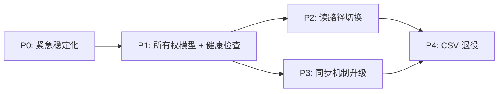

# 数据基建升级路线图

> 2026-03-03 | 基于全量审计的架构升级计划
> 状态: **P1-P3 已完成** (2026-03-04) | 剩余: CSV 退役

---

## 问题全景

本次审计发现 9 个数据基建问题：

| \\# | 问题                                      | 严重度 | 根因                      |
| --- | --------------------------------------- | --- | ----------------------- |
| 1   | 量价数据 CSV 和 market.db 双源并存，读写路径不一致       | 高   | market.db 上线后未完成切换      |
| 2   | market.db 无覆盖率/新鲜度/质量检查                 | 高   | 健康检查只覆盖 CSV             |
| 3   | 云端代码落后本地 3 周（8 个 commit）                | 高   | 手动 rsync，忘了就落后          |
| 4   | company.db `in_pool` 列失同步 (3/121)       | 中   | 冗余副本，universe.json 才是真相 |
| 5   | company.db 双端写入冲突（rsync 整文件覆盖）          | 高   | 云端写 IV，本地写分析，同步时互相覆盖    |
| 6   | universe.json pull 时覆盖本地新增股票            | 中   | 没有 merge 策略             |
| 7   | 6 个文件绕过 `get_price_df()` 直读 CSV         | 中   | 历史遗留                    |
| 8   | sync\_to\_cloud.sh 无冲突检测，pull/push 范围不清 | 中   | 设计时没有 DB 所有权概念          |
| 9   | IV/期权表放在 company.db（应属 market.db）       | 中   | 建表时 market.db 还不存在      |

---

## 终态架构

```
┌──────────────────────────────────────────────────────────────────┐
│                         终态架构                                  │
├──────────────┬───────────────────────────────────────────────────┤
│  market.db   │ 时序数据 — 云端独占写入                            │
│              │ • daily_price (量价)                               │
│              │ • income/balance_sheet/cash_flow_quarterly (基本面) │
│              │ • ratios_annual (估值比率)                         │
│              │ • metrics_quarterly (衍生指标)                     │
│              │ • iv_daily (IV 聚合) ← P1 从 company.db 迁入      │
│              │ • options_snapshots (期权链) ← P1 从 company.db 迁入│
│              │                                                    │
│              │ 同步: 云端 → 本地 (单向 pull)                      │
├──────────────┼───────────────────────────────────────────────────┤
│  company.db  │ 公司维度 — 本地独占写入                            │
│              │ • companies (元数据/OPRMS/memo)                    │
│              │ • analyses (分析记录)                              │
│              │ • kill_conditions (交易触发条件)                    │
│              │ • situation_summary (agent 记忆)                   │
│              │ • 删除 in_pool 列                                  │
│              │                                                    │
│              │ 同步: 本地 → 云端 (单向 push)                      │
├──────────────┼───────────────────────────────────────────────────┤
│ universe.json│ 股票池定义 — 双端写入，merge 同步                  │
│              │ • screener 源: 云端增删 (周六 refresh)             │
│              │ • analysis/manual 源: 本地只增 (分析/手动)         │
│                            │
│              │                                                    │
│              │ 同步: 按 symbol 取并集，非覆盖                     │
├──────────────┼───────────────────────────────────────────────────┤
│  CSV 价格    │ 完全退役，文件删除                                 │
├──────────────┼───────────────────────────────────────────────────┤
│  代码部署     │ 云端 git clone + 每日自动 git pull                │
│              │ sync_to_cloud.sh --code 退役                      │
└──────────────┴───────────────────────────────────────────────────┘
```

**核心原则**：
1. 每个数据存储有且仅有一个写入方 → 同步 = 单向拷贝，永不冲突
2. universe.json 是唯一例外，用 merge（并集）处理双端添加
3. 所有量价读取走 `get_price_df()` → market.db，无旁路
4. 代码部署自动化，不依赖人记得跑脚本

---

## 分阶段实施

### P0: 紧急稳定化（不改架构，恢复运行）

> 目标: 让当前系统数据保持新鲜，消除已知不一致

| 步骤  | 操作                                    | 验证标准                               |
| --- | ------------------------------------- | ---------------------------------- |
| 0.1 | `sync_to_cloud.sh --code` 推送最新代码到云端   | 云端 `price_fetcher.py` 含 dual-write |
| 0.2 | `sync_to_cloud.sh --pull` 拉取云端最新量价到本地 | 本地 CSV 最新日期 = 上个交易日                |
| 0.3 | 本地运行 `sync_db_pool()` 修复 in\_pool     | `in_pool=1` 数量 = universe.json 数量  |
| 0.4 | 云端验证 cron 正常                          | `tail cron_price.log` 显示今日成功       |

**预估**: 10 分钟，零代码改动

---

### P1: 所有权模型 + 健康检查（基础设施层）

> 目标: 建立 DB 所有权规则，让 market.db 具备与 CSV 同等的监控能力

#### P1.1: 删除 `in_pool` 列

- `company_store.py`: 删除 `sync_pool()` 方法，`in_pool` 列保留但不再写入
- 所有读 `in_pool` 的地方改为调 `pool_manager.get_symbols()`
- 受影响调用点: \~5 处 (dashboard, iv\_scripts, theme\_pool)
- `pool_manager.py`: 删除 `sync_db_pool()` 函数

| 验证  | 标准                |
| --- | ----------------- |
| 测试  | 所有现有测试通过          |
| E2E | Dashboard 显示正确池数量 |

#### P1.2: IV/期权表迁移到 market.db

- `market_store.py`: 新增 `iv_daily` 和 `options_snapshots` 表 schema
- `market_store.py`: 新增 `save_iv_daily()`, `save_options_snapshot()`, `cleanup_old_snapshots()`
- `iv_tracker.py`, `chain_analyzer.py`, `backfill_iv.py`: 写入目标从 company\_store 改为 market\_store
- `company_store.py`: 保留旧表只读（兼容查询），不再写入
- 数据迁移脚本: 从 company.db 拷贝现有 IV 数据到 market.db

| 验证  | 标准                                               |
| --- | ------------------------------------------------ |
| 数据  | market.db iv\_daily 行数 = company.db iv\_daily 行数 |
| 测试  | IV 相关测试全部通过                                      |

#### P1.3: market.db 健康检查

在 `data_health.py` 中新增 market.db 检查项（与 CSV 检查对等）:

| 检查项      | PASS                    | WARN     | FAIL      |
| -------- | ----------------------- | -------- | --------- |
| 量价覆盖率    | DB symbols \>= 95% pool | \>= 80%  | \< 80%    |
| 量价新鲜度    | 最新日期 \<= 3 个交易日         | \<= 7    | \> 7      |
| 基本面覆盖率   | \>= 95% pool            | \>= 80%  | \< 80%    |
| 基本面新鲜度   | \<= 14 天                | \<= 30 天 | \> 30 天   |
| 数据质量     | null close = 0, 无重复     | -        | 有 null/重复 |
| Pool 一致性 | DB symbols 包含全部 pool    | \>= 90%  | \< 90%    |

同时保留 CSV 检查（P2 完成后再移除）。

| 验证   | 标准                                                 |
| ---- | -------------------------------------------------- |
| 健康检查 | `python -m src.data.data_health` 输出包含 market.db 各项 |
| 集成   | `sync_to_cloud.sh` push 前检查包含 market.db            |

#### P1.4: 云端 git 部署

- 云端初始化 git repo: `git clone <github-url> /root/workspace/Finance-git`
- 迁移: 把 data/、logs/、.env 从旧目录软链到 git 目录
- 新增云端 cron: 每天 06:00 `git pull origin main`（在所有数据 cron 之前）
- `sync_to_cloud.sh --code` 退役（改为提示 "代码已自动同步"）
- 云端部署后验证: `git log --oneline -1` 输出写入 cron 日志

| 验证  | 标准                               |
| --- | -------------------------------- |
| 自动化 | 本地 push GitHub 后，次日云端代码自动更新      |
| 日志  | `cron_git_pull.log` 记录每日 pull 结果 |

**P1 预估**: 改动 \~8 个文件，新增 \~200 行，迁移脚本 1 个

---

### P2: 读路径切换（CSV → market.db）

> 目标: 所有分析代码从 market.db 读取量价数据，CSV 不再被读取

#### P2.1: 核心读取函数切换

改 `price_fetcher.py` 的两个核心函数:

```python
# load_price_cache(): CSV → market.db
def load_price_cache(symbol):
    # 旧: pd.read_csv(PRICE_DIR / f"{symbol}.csv")
    # 新: market_store.get_daily_prices() → pd.DataFrame

# get_price_df(): 保持相同 API，底层换源
def get_price_df(symbol, days=None, max_age_days=3):
    # 新鲜度检查: SELECT MAX(date) FROM daily_price WHERE symbol=?
    # 过期则 fetch_and_update_price() → 写入 market.db
    # 返回 DataFrame（列名、排序与之前一致）
```

**关键**: `get_price_df()` 的返回格式不变（DataFrame, 降序, 相同列名），所有调用者零改动。

| 验证   | 标准                             |
| ---- | ------------------------------ |
| 单元测试 | 所有 price\_fetcher 测试通过         |
| 格式一致 | 返回 DataFrame 列名/排序/类型与 CSV 版一致 |

#### P2.2: 迁移 5 个直读 CSV 的文件

| 文件                               | 当前                                  | 改为                                    |
| -------------------------------- | ----------------------------------- | ------------------------------------- |
| `backtest/adapters/us_stocks.py` | `_load_csv()` 直读 CSV                | 调 `get_price_df()` 或接受 DataFrame dict |
| `src/analysis/correlation.py`    | `load_price_returns()` 直读 CSV       | 调 `get_price_df()`                    |
| `terminal/options/iv_tracker.py` | `compute_hv()` 用 raw `open()` 读 CSV | 调 `get_price_df()`                    |
| `src/data/data_health.py`        | `glob("*.csv")` 扫描                  | 查 market.db（P1.3 已实现）                 |
| `src/data/data_guardian.py`      | 备份 `data/price/*.csv`               | 备份 `data/market.db` 文件                |

| 验证   | 标准                                                                 |
| ---- | ------------------------------------------------------------------ |
| Grep | `grep -r "data/price" src/ terminal/ backtest/ scripts/` 只剩注释和配置常量 |
| 全量测试 | 所有测试通过                                                             |
| E2E  | 跑一次 deep analysis，结果正常                                             |

#### P2.3: 写路径改为 market.db 优先

`fetch_and_update_price()` 改为:
- 主写: market.db（必须成功）
- 副写: CSV（兼容期，P4 删除）

**P2 预估**: 改动 \~7 个文件，核心改动集中在 price\_fetcher.py

---

### P3: 同步机制升级

> 目标: sync 脚本体现 DB 所有权，universe.json 用 merge 策略

#### P3.1: sync\_to\_cloud.sh 重写

```bash
# 新的 sync 逻辑:

pull_from_cloud() {
    # market.db: 云端 → 本地 (单向)
    rsync cloud:data/market.db → local:data/market.db

    # universe.json: merge (按 symbol 取并集)
    scp cloud:data/pool/universe.json → /tmp/cloud_universe.json
    python3 -c "merge_universe('/tmp/cloud_universe.json', 'data/pool/universe.json')"
}

push_to_cloud() {
    # company.db: 本地 → 云端 (单向)
    rsync local:data/company.db → cloud:data/company.db

    # universe.json: merge (按 symbol 取并集)
    scp local:data/pool/universe.json → /tmp/local_universe.json
    # 云端执行 merge
    ssh cloud "python3 -c \"merge_universe('/tmp/local_universe.json', 'data/pool/universe.json')\""
}
```

#### P3.2: universe.json merge 函数

```python
def merge_universe(incoming_path: str, local_path: str) -> int:
    """按 symbol 取并集，source 优先级: analysis > manual > attention > screener"""
    # 按 symbol 建索引
    # 两边都有的: 保留 source 优先级更高的
    # 只有一边有的: 直接纳入
    # 返回合并后的总数
```

放在 `pool_manager.py` 中，供 sync 脚本调用。

#### P3.3: 云端 CSV 写入退役

- `price_fetcher.py`: 云端环境下不再写 CSV（通过环境变量 `FINANCE_ENV=cloud` 控制）
- 云端 `fetch_and_update_price()` 只写 market.db
- 本地保持 dual-write 直到 P4

| 验证       | 标准                                     |
| -------- | -------------------------------------- |
| pull 测试  | pull 后本地 market.db 最新日期 = 云端           |
| merge 测试 | 本地加股票 → pull → 股票仍在                    |
| push 测试  | 本地分析结果 → push → 云端 company.db 含分析      |
| 单向性      | pull 不覆盖 company.db，push 不覆盖 market.db |

**P3 预估**: sync 脚本重写 + merge 函数 \~100 行

---

### P4: CSV 退役 + 收尾

> 目标: 清理遗留，加固防线

#### P4.1: 删除 CSV 写入路径

- `price_fetcher.py`: 删除 `save_price_cache()` 和所有 CSV 写入代码
- `fetch_and_update_price()`: 只写 market.db
- `config/settings.py`: `PRICE_DIR` 标记废弃或删除

#### P4.2: 清理 CSV 文件

- 最终确认无代码依赖 CSV 后，删除 `data/price/` 目录
- 云端同步删除

#### P4.3: data\_guardian 升级

- 备份目标: `data/market.db` + `data/company.db`（替代 CSV tar.gz）
- SQLite 备份用 `.backup` 命令（比文件拷贝安全，不怕 WAL 状态）
- 保留相同的快照保留策略（max 10）

#### P4.4: data\_health.py 清理

- 删除所有 CSV 相关检查（P1.3 的 market.db 检查已就位）
- 统一报告格式: market.db 检查 + company.db 检查 + pool 一致性

#### P4.5: 文档更新

- `CLAUDE.md`: 更新数据架构描述
- `ARCHITECTURE.md`: 更新数据流图
- `MEMORY.md` / `long-term-memory.md`: 更新导航地图
- `docs/CHANGELOG.md`: 记录此次架构升级

| 验证   | 标准                                                           |
| ---- | ------------------------------------------------------------ |
| Grep | `grep -rn "\.csv" src/ terminal/ backtest/ scripts/` 零生产代码命中 |
| 健康检查 | `data_health` 报告无 CSV 相关项                                    |
| 备份   | Guardian snapshot 包含两个 .db 文件                                |

**P4 预估**: 删除代码为主，净减 \~200 行

---

## 依赖关系



- P0 → P1: 必须先稳定，再改架构
- P1 → P2: 健康检查就位后才能安全切换读路径
- P1 → P3: 所有权模型确定后才能重写 sync
- P2 + P3 → P4: 读写都切完才能退役 CSV
- P2 和 P3 可以并行开发（无代码依赖）

---

## 风险与回退

| 风险                       | 概率  | 缓解措施                          |
| ------------------------ | --- | ----------------------------- |
| market.db 读取性能不如 CSV     | 低   | SQLite 单 symbol 查询 \<10ms，有索引 |
| 切换后某个遗漏的 CSV 读取路径导致分析失败  | 中   | P2 用 grep 全量扫描 + E2E 验证       |
| 云端 git pull 冲突           | 低   | 云端不修改代码，只 pull，不会冲突           |
| universe.json merge 丢失股票 | 低   | merge 用并集策略，只增不减              |
| market.db 文件同步时中断导致损坏    | 低   | rsync 原子传输 + Guardian 备份兜底    |

**每个 Phase 的回退方案**:
- P1: in\_pool 删除可逆（列还在，重新写入即可）
- P2: CSV 文件还在，切回 CSV 读取只需 revert 一个 commit
- P3: sync 脚本可回退到旧版
- P4: 回退 = 从 market.db 重新导出 CSV（一个脚本搞定）

---

## 验收标准（整体）

完成所有 Phase 后，以下条件必须全部满足:

- [ ]() `grep -rn "data/price.*\.csv" src/ terminal/ backtest/ scripts/` 零生产代码命中
- [ ]() `python -m src.data.data_health` 输出 market.db + company.db 全项 PASS
- [ ]() 云端 `git log --oneline -1` = 本地 `git log --oneline -1`（24h 内）
- [ ]() `sync_to_cloud.sh --pull` 后本地 market.db 最新日期 = 云端
- [ ]() `sync_to_cloud.sh --push` 后云端 company.db 含最新 OPRMS 评级
- [ ]() universe.json 本地加股票 → pull → 股票仍在
- [ ]() Deep analysis 跑一只股票，data\_context.md 显示正确的最新价格
- [ ]() `data/price/` 目录不存在

