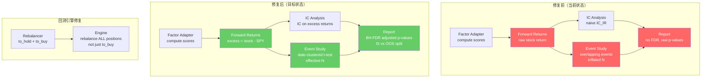
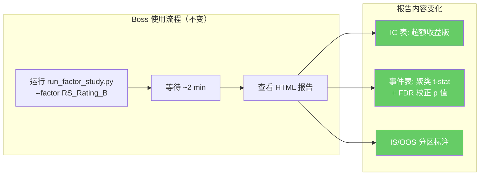

hec# 因子研究 + 回测框架统计纪律升级 — 实施计划

> **For Claude:** REQUIRED SUB-SKILL: Use superpowers:executing-plans to implement this plan task-by-task.

**Confidence: 88%**
**不确定点**: R5（to\_hold 再平衡）可能是有意的 hysteresis 设计，而非 bug — 标注让 Boss 判断

**Goal:** 修复因子研究框架和回测引擎中 5 个 RED 级统计纪律问题，使输出结论可信赖

**Tech Stack:** Python 3.12 (本地) / 3.10 (云端)，numpy, scipy, pandas, 无新外部依赖

---

## Architecture（架构图）



> 红色 = 当前有问题的组件；绿色 = 修复后的组件。核心变化：原始收益→超额收益、重叠事件→聚类事件、裸 p 值→FDR 校正

## Business Flow（业务流程图）



> 用户操作完全不变。报告自动包含超额收益、聚类统计和 FDR 校正。

## Alternatives Considered（替代方案）

### R1: Benchmark Adjustment

| 方案                                 | 优势                     | 劣势           | 选择  |
| ---------------------------------- | ---------------------- | ------------ | --- |
| **A: forward\_returns 层减 SPY（推荐）** | 一处改动，IC 和 Event 同时受益   | 需加载 SPY 价格   | ✅   |
| B: IC/Event 各自独立减 benchmark        | 不改 forward\_returns 接口 | 两处重复逻辑，容易不一致 | ❌   |

### R4: Event Independence

| 方案                                          | 优势              | 劣势                  | 选择  |
| ------------------------------------------- | --------------- | ------------------- | --- |
| **A: 按日期聚类取均值再 t-test（推荐）**                 | 简单、保守、统计教科书标准做法 | 丢失了跨股票信息的精度         | ✅   |
| B: HAC (Newey-West) t-stat on event returns | 保留所有样本，正确调整 SE  | 需按日期排序，更复杂，依赖选择 lag | ❌   |

### R3: Out-of-Sample

| 方案                                | 优势             | 劣势                           | 选择   |
| --------------------------------- | -------------- | ---------------------------- | ---- |
| **A: 固定 70/30 时间分割 + 最小数据门槛（推荐）** | 简单，且自动适应数据不足场景 | 只有一个 split 点                 | ✅    |
| B: Walk-forward k-fold            | 多个验证窗口，统计功效更高  | 复杂度高，已有 optimizer.py 的骨架但需重构 | 后续考虑 |

**数据现实约束：** 量价 5 年（OOS 可行），IV 2 年（勉强），社交仅 \~60 天（不可行）。OOS 分割需设最小门槛：OOS 区间 \< 50 个计算日则跳过，报告标注 "OOS skipped: insufficient data" 而非硬分割出无意义的结果。

### R5: to\_hold 再平衡

| 方案                                      | 优势                | 劣势                         | 选择  |
| --------------------------------------- | ----------------- | -------------------------- | --- |
| **A: 加 config 参数 `rebalance_held`（推荐）** | 两种策略都保留，用回测数据判断优劣 | 多一个参数                      | ✅   |
| B: 只保留真等权                               | 简单                | 丢失了 momentum-hold 这个有效策略变体 | ❌   |
| C: 只保留现状改名                              | 不改代码              | 无法对比                       | ❌   |

## Risks & Mitigation（风险自证）

- **最大风险:** R1 加载 SPY 价格后，SPY 在 market.db 中不存在或日期不对齐
  - **缓解:** SPY 通过 `_load_prices("SPY")` 加载，与其他股票同源。日期对齐用 inner join（只保留 SPY 和个股都有数据的日期）
- **为什么不用更简单的做法:** 每个修复都是业界最简标准做法，没有更简单的了
- **回滚方案:** worktree 隔离开发，main 不受影响。每个 fix 独立 commit，可逐个 revert

## Acceptance Criteria（验收标准）

- [ ]() **R1**: 报告 IC 表标题显示 "excess return"；分位数收益反映超过 SPY 的部分（牛市中 Q1 应为负）
- [ ]() **R2**: 报告事件表有 `p_fdr` 列；同一次扫描中 p\_fdr \>= 0.10 的结果不再标 `*`
- [ ]() **R3**: 量价因子报告分 IS/OOS 两区块；数据不足时显示 "OOS skipped" 警告而非空结果
- [ ]() **R4**: 事件表 `n_eff` 列 \< `n_events`；连续信号的 p 值明显上升（因为有效 N 更小）
- [ ]() **R5**: `rebalance_held=True` 时所有持仓回到 1/N；`=False` 时保持漂移。两种模式可独立跑回测对比
- [ ]() 所有现有测试通过（1269+）；每个 fix 有对应新测试

---

## 实施任务

### 依赖关系

```
R1 (excess returns) ─────┐
                          ├──→ R3 (OOS split, 用 excess returns)
R4 (event clustering) ────┘
R2 (FDR correction) ──────── 独立
R5 (rebalance) ──────────── 独立（不同模块）
```

**执行顺序**: R1 → R4 → R2 → R3 → R5

---

### Task 1: R1 — Benchmark-Adjusted Excess Returns

**Files:**
- Modify: `backtest/factor_study/forward_returns.py`
- Modify: `backtest/factor_study/runner.py`
- Modify: `backtest/factor_study/ic_analysis.py` (ICResult 字段名)
- Modify: `backtest/factor_study/report.py` (标题标注 excess)
- Test: `tests/test_backtest/test_factor_study/test_forward_returns.py` (新)
- Test: 更新现有测试

**Step 1: 写 excess return 矩阵的失败测试**

```python
# tests/test_backtest/test_factor_study/test_excess_returns.py
def test_build_excess_return_matrix_subtracts_benchmark():
    """Excess return = stock return - benchmark return for same horizon."""
    # AAPL: 100 → 110 (+10%), SPY: 100 → 105 (+5%)
    # Excess = 10% - 5% = 5%
    dates = pd.date_range("2024-01-01", periods=30, freq="B")
    aapl_prices = [100 + i * (10/29) for i in range(30)]  # 100→110
    spy_prices = [100 + i * (5/29) for i in range(30)]    # 100→105

    price_dict = {
        "AAPL": pd.DataFrame({"close": aapl_prices}, index=dates),
    }
    benchmark_df = pd.DataFrame({"close": spy_prices}, index=dates)

    result = build_excess_return_matrix(
        price_dict, benchmark_df,
        [dates[0].strftime("%Y-%m-%d")],
        [20],
    )

    # 20-day forward excess return should be ~5% (10% - 5%)
    excess = result[20].loc[dates[0].strftime("%Y-%m-%d"), "AAPL"]
    assert 0.04 < excess < 0.06
```

**Step 2: 实现 `build_excess_return_matrix()`**

在 `forward_returns.py` 中新增:

```python
def build_excess_return_matrix(
    price_dict: dict,
    benchmark_df: pd.DataFrame,
    computation_dates: list[str],
    horizons: list[int],
) -> dict[int, pd.DataFrame]:
    """Build forward return matrix with benchmark subtracted.

    excess_return[h][date, symbol] = stock_fwd_ret(h) - benchmark_fwd_ret(h)
    """
    raw = build_return_matrix(price_dict, computation_dates, horizons)

    # Build benchmark returns using same _forward_return logic
    bench_dates = sorted(benchmark_df.index)
    bench_map = {d.strftime("%Y-%m-%d"): i for i, d in enumerate(bench_dates)}
    bench_close = benchmark_df["close"].values

    for h in horizons:
        bench_rets = {}
        for date_str in computation_dates:
            if date_str not in bench_map:
                continue
            idx = bench_map[date_str]
            end_idx = idx + h
            if end_idx >= len(bench_close):
                continue
            bench_rets[date_str] = bench_close[end_idx] / bench_close[idx] - 1.0

        for date_str in raw[h].index:
            if date_str in bench_rets:
                raw[h].loc[date_str] -= bench_rets[date_str]

    return raw
```

**Step 3: 修改 runner.py 使用 excess returns**

在 `_run_single_factor()` 中:

```python
# 当前 (L108-110):
return_matrices = build_return_matrix(full_data, computation_dates, config.forward_horizons)

# 改为:
if config.benchmark_symbol:
    benchmark_nav = adapter.get_benchmark_nav(config.benchmark_symbol)
    bench_df = pd.DataFrame(benchmark_nav, columns=["date", "close"]).set_index("date")
    bench_df.index = pd.to_datetime(bench_df.index)
    return_matrices = build_excess_return_matrix(
        full_data, bench_df, computation_dates, config.forward_horizons
    )
else:
    return_matrices = build_return_matrix(
        full_data, computation_dates, config.forward_horizons
    )
```

**Step 4: 报告标注 excess**

`report.py` 的 `_build_ic_table()` 中，IC 表标题从 "Forward Return" 改为 "Excess Return (vs SPY)"（当 config.benchmark\_symbol 存在时）。

**Step 5: 运行测试验证**

```bash
pytest tests/test_backtest/test_factor_study/ -v
```

**Step 6: Commit**

```bash
git commit -m "feat(factor-study): R1 — benchmark-adjusted excess returns in IC and event study"
```

---

### Task 2: R4 — 事件研究日期聚类

**Files:**
- Modify: `backtest/factor_study/event_study.py`
- Modify: `backtest/factor_study/report.py` (显示 n\_eff)
- Test: `tests/test_backtest/test_factor_study/test_event_study.py` (新增 case)

**Step 1: 写聚类 t-test 的失败测试**

```python
def test_clustered_ttest_reduces_significance():
    """Same stock triggering 5 consecutive weeks should have n_eff=1, not 5."""
    # 5 overlapping events from same stock same signal
    score_history = {
        "AAPL": [
            ("2024-01-05", 95), ("2024-01-12", 96),
            ("2024-01-19", 94), ("2024-01-26", 97),
            ("2024-02-02", 93),
        ],
    }
    signal_def = SignalDefinition(
        signal_type=SignalType.THRESHOLD, threshold=90.0
    )

    # All 5 share ~80% of their 60-day forward window
    result = run_event_study(score_history, return_matrix_60d, signal_def)

    # n_events=5 but n_effective should be much smaller
    assert result.n_events == 5
    assert result.n_effective <= 2  # date-clustered
```

**Step 2: 实现日期聚类**

在 `event_study.py` 的 `_study_for_horizon()` 中:

```python
# 当前: 收集 flat list event_returns, 做 ttest_1samp
# 改为: 按日期桶聚类，先取日均值，再 t-test on 日均值

from collections import defaultdict

def _study_for_horizon(events_by_symbol, ret_df, horizon):
    # 1. 按日期聚类收集 returns
    date_bucket = defaultdict(list)
    n_raw = 0
    for symbol, dates in events_by_symbol.items():
        for date_str in dates:
            if date_str in ret_df.index and symbol in ret_df.columns:
                val = ret_df.loc[date_str, symbol]
                if not np.isnan(val):
                    date_bucket[date_str].append(val)
                    n_raw += 1

    if not date_bucket:
        return EventStudyResult(...)  # empty

    # 2. 每个日期取均值 → 一个独立观测
    cluster_means = [np.mean(rets) for rets in date_bucket.values()]
    n_effective = len(cluster_means)
    arr = np.array(cluster_means)

    # 3. t-test on cluster means (正确的有效 N)
    if n_effective >= 2:
        t_stat, p_value = ttest_1samp(arr, 0.0)
    else:
        t_stat, p_value = float("nan"), float("nan")

    return EventStudyResult(
        n_events=n_raw,
        n_effective=n_effective,
        mean_return=float(np.mean(arr)),
        median_return=float(np.median(arr)),
        hit_rate=float(np.mean(arr > 0)),
        t_stat=float(t_stat),
        p_value=float(p_value),
        horizon=horizon,
    )
```

**Step 3: EventStudyResult 加 `n_effective` 字段**

```python
@dataclass
class EventStudyResult:
    n_events: int           # 原始事件数
    n_effective: int        # 聚类后有效观测数 (新增)
    mean_return: float
    ...
```

**Step 4: report.py 显示 n\_eff**

事件表增加 `n_eff` 列，在 `n_events` 旁边。

**Step 5: 运行测试**

**Step 6: Commit**

```bash
git commit -m "feat(factor-study): R4 — date-clustered t-test for event study independence"
```

---

### Task 3: R2 — 多重检验 FDR 校正

**Files:**
- Modify: `backtest/factor_study/report.py`
- Test: `tests/test_backtest/test_factor_study/test_report.py` (新增)

**Step 1: 写 FDR 校正的失败测试**

```python
def test_fdr_correction_reduces_significance():
    """With 75 hypotheses, p=0.04 should no longer be significant after BH correction."""
    # 生成 75 个 EventStudyResult，其中 3 个 p<0.05（期望假阳性数）
    results = [make_event_result(p_value=0.04 + i*0.01) for i in range(75)]
    results[0] = make_event_result(p_value=0.04)  # borderline

    adjusted = apply_fdr_correction(results)

    # p=0.04 * 75/1 = 3.0 >> 0.05, 不再显著
    assert adjusted[0].p_fdr > 0.05
```

**Step 2: 实现 BH-FDR 校正**

在 `report.py` 中新增函数:

```python
def _apply_bh_fdr(p_values: list[float]) -> list[float]:
    """Benjamini-Hochberg FDR correction.

    Manual implementation (no statsmodels dependency).
    """
    n = len(p_values)
    if n == 0:
        return []

    # 排序
    indexed = sorted(enumerate(p_values), key=lambda x: x[1])
    adjusted = [0.0] * n

    # 从大到小调整: p_adj[i] = min(p_adj[i+1], p[i] * n / rank)
    prev = 1.0
    for rank_idx in range(n - 1, -1, -1):
        orig_idx, p = indexed[rank_idx]
        rank = rank_idx + 1
        adj = min(prev, p * n / rank)
        adj = min(adj, 1.0)
        adjusted[orig_idx] = adj
        prev = adj

    return adjusted
```

**Step 3: 在 `_build_event_table()` 中应用**

收集所有事件结果的 p\_value，批量 BH 校正，然后用 `p_fdr` 替代 `p_value` 做显著性标星。

HTML 表和文本表都增加 `p_fdr` 列。

**Step 4: Commit**

```bash
git commit -m "feat(factor-study): R2 — Benjamini-Hochberg FDR correction for parameter sweep"
```

---

### Task 4: R3 — In-Sample / Out-of-Sample 时间分割

**Files:**
- Modify: `backtest/config.py` (新增 `oos_fraction` 参数)
- Modify: `backtest/factor_study/runner.py` (分割 + 分别跑)
- Modify: `backtest/factor_study/report.py` (IS/OOS 分区显示)
- Test: 新增

**Step 1: FactorStudyConfig 加 OOS 参数**

```python
# config.py FactorStudyConfig
oos_fraction: float = 0.3        # 最后 30% 的日期作为 OOS
min_oos_dates: int = 50          # OOS 最少计算日数，不够则跳过 OOS
```

**Step 2: runner.py 分割逻辑（含最小门槛）**

```python
# 在 _run_single_factor() 中:
split_idx = int(len(computation_dates) * (1 - config.oos_fraction))
is_dates = computation_dates[:split_idx]
oos_dates = computation_dates[split_idx:]

# 门槛检查: OOS 数据不足则跳过
has_oos = len(oos_dates) >= config.min_oos_dates

# IS: 始终计算
is_return_matrices = build_excess_return_matrix(... is_dates ...)
is_ic_results = analyze_ic(... is_dates ...)
is_event_results = ...

# OOS: 仅在数据充足时计算
if has_oos:
    oos_return_matrices = build_excess_return_matrix(... oos_dates ...)
    oos_ic_results = analyze_ic(... oos_dates ...)
    oos_event_results = ...
else:
    oos_ic_results = None
    oos_event_results = None
```

**Step 3: FactorStudyResults 增加 IS/OOS 区分**

```python
@dataclass
class FactorStudyResults:
    factor_meta: FactorMeta
    ic_results: dict                      # IS results
    event_results: dict                   # IS results
    oos_ic_results: Optional[dict]        # OOS results (None = data insufficient)
    oos_event_results: Optional[dict]     # OOS results (None = data insufficient)
    is_dates: list[str]
    oos_dates: list[str]
    oos_skipped: bool                     # True = OOS 数据不足，已跳过
```

**Step 4: report.py IS/OOS 分区渲染**

HTML 报告分两个区块:
- "In-Sample (70%): 2021-01 \~ 2024-09" — IC 表 + 事件表
- 如果 `oos_skipped=False`:
  - "Out-of-Sample (30%): 2024-10 \~ 2026-03" — IC 表 + 事件表
  - 关键对比: IS IC vs OOS IC（衰减幅度）
- 如果 `oos_skipped=True`:
  - "⚠️ OOS skipped: insufficient data (N={len(oos\_dates)} \< {min\_oos\_dates})"

**Step 5: Commit**

```bash
git commit -m "feat(factor-study): R3 — in-sample / out-of-sample time split validation"
```

---

### Task 5: R5 — 回测引擎再平衡模式可配置

**决策**: 两种模式都保留，加 `rebalance_held` config 参数，用回测对比哪种更好。

- `rebalance_held=True` — 真等权：每次 rebalance 所有持仓回到 1/N
- `rebalance_held=False`（当前默认） — 动量持有：只买入新股，已有持仓权重随价格漂移

**Files:**
- Modify: `backtest/config.py` (加 `rebalance_held` 参数)
- Modify: `backtest/engine.py` (根据参数分支)
- Test: `tests/test_backtest/test_engine.py` (两种模式各一个测试)

**Step 1: config 加参数**

```python
# config.py BacktestConfig
rebalance_held: bool = True  # True=真等权, False=动量持有(原行为)
```

**Step 2: 写两种模式的测试**

```python
def test_rebalance_held_true_equalizes_weights():
    """rebalance_held=True: ALL positions rebalanced to 1/N."""
    config = BacktestConfig(rebalance_held=True, ...)
    # 持有 AAPL 已涨 50%, MSFT 持平, 新加 GOOG
    # 再平衡后: 三者都应 ~33.3%
    ...
    for w in weights.values():
        assert abs(w - 1/3) < 0.01

def test_rebalance_held_false_preserves_drift():
    """rebalance_held=False: held positions keep drifted weight."""
    config = BacktestConfig(rebalance_held=False, ...)
    # AAPL 涨了 50% → 权重应 > 1/3
    ...
    assert weights["AAPL"] > 0.40  # 漂移保留
```

**Step 3: 修改 engine.py `_rebalance()`**

```python
if self.config.rebalance_held:
    # 真等权: 对所有持仓调整到目标权重
    target_symbols = action.to_hold + action.to_buy
    target_weight = 1.0 / len(target_symbols) if target_symbols else 0
    nav = self.portfolio.nav(current_prices)
    target_value = nav * target_weight

    for symbol in target_symbols:
        current_value = self.portfolio.holdings.get(symbol, 0) * current_prices.get(symbol, 0)
        diff = target_value - current_value
        if diff > 0:
            self.portfolio.buy(symbol, diff, current_prices[symbol])
        elif diff < -0.01:
            shares_to_sell = abs(diff) / current_prices[symbol]
            self.portfolio.sell(symbol, shares_to_sell, current_prices[symbol])
else:
    # 动量持有 (原行为): 只买入新股
    for symbol in action.to_buy:
        ...  # 现有逻辑不变
```

**Step 4: Commit**

```bash
git commit -m "feat(backtest): R5 — configurable rebalance_held (true equal-weight vs momentum-hold)"
```

---

## 完整 Checklist

| \\# | 修复                            | 文件                       | 状态    |
| --- | ----------------------------- | ------------------------ | ----- |
| 1.1 | R1: excess return 矩阵          | forward\_returns.py      | [ ]() |
| 1.2 | R1: runner 加载 benchmark       | runner.py                | [ ]() |
| 1.3 | R1: 报告标注 excess               | report.py                | [ ]() |
| 1.4 | R1: 测试                        | test\_excess\_returns.py | [ ]() |
| 2.1 | R4: 日期聚类 t-test               | event\_study.py          | [ ]() |
| 2.2 | R4: EventStudyResult + n\_eff | event\_study.py          | [ ]() |
| 2.3 | R4: 报告显示 n\_eff               | report.py                | [ ]() |
| 2.4 | R4: 测试                        | test\_event\_study.py    | [ ]() |
| 3.1 | R2: BH-FDR 实现                 | report.py                | [ ]() |
| 3.2 | R2: 事件表 p\_fdr 列              | report.py                | [ ]() |
| 3.3 | R2: 测试                        | test\_report.py          | [ ]() |
| 4.1 | R3: oos\_fraction 配置          | config.py                | [ ]() |
| 4.2 | R3: runner 分割逻辑               | runner.py                | [ ]() |
| 4.3 | R3: 报告 IS/OOS 分区              | report.py                | [ ]() |
| 4.4 | R3: 测试                        | test\_runner.py          | [ ]() |
| 5.1 | R5: config 加 rebalance\_held  | config.py                | [ ]() |
| 5.2 | R5: engine 双模式逻辑              | engine.py                | [ ]() |
| 5.3 | R5: 测试（两种模式）                  | test\_engine.py          | [ ]() |

