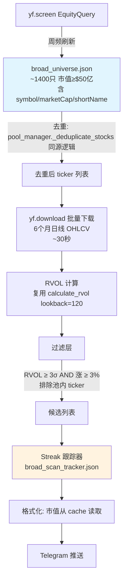
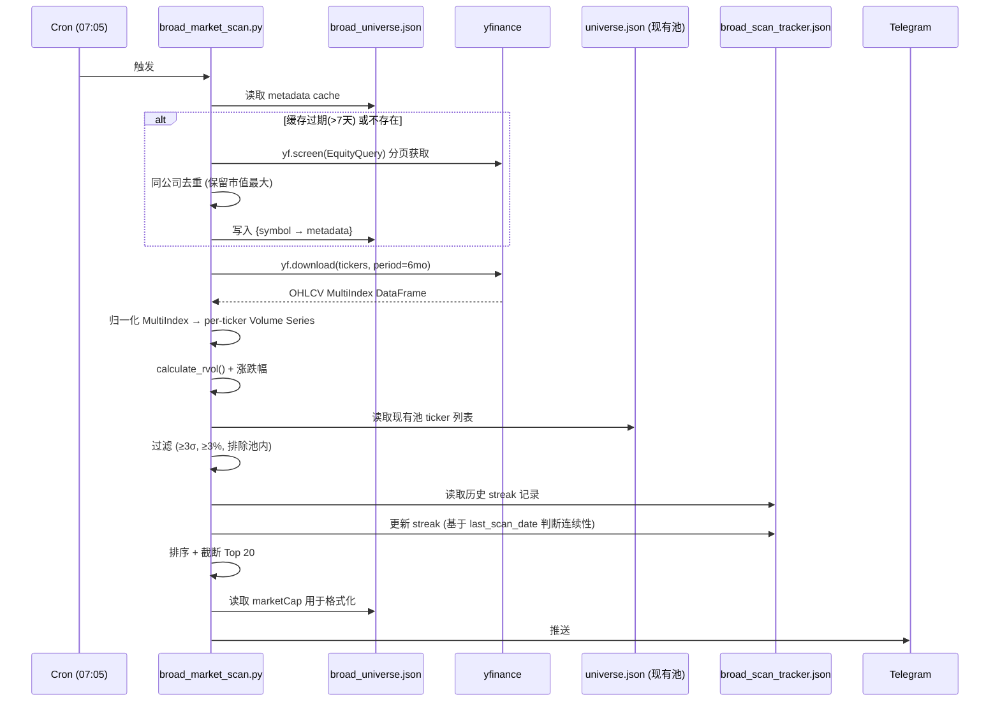

# 池外广扫 (Broad Market RVOL Scanner) — 实现计划

> **日期**: 2026-03-20
> **状态**: 待审批 (v2 — 修复 review P1×3 + P2×1)
> **前置**: 热点追踪系统蓝图 (`docs/design/trend_tracker_blueprint.md`)
> **目标**: 每日扫描全市场 RVOL 异常，以独立 Telegram 消息推送

---

## 一、架构

### 数据流



### 业务流程



---

## 二、关键设计决策

### 决策 1: Universe 门槛 — $50 亿 (可配置)

| 门槛 | 数量 | 下载时间 | 覆盖 |
|------|------|---------|------|
| $100 亿 | ~940 | ~26s | 漏掉 $50-100 亿的 mid-cap（恰好是新趋势点火区） |
| **$50 亿** | **~1400** | **~35s** | 覆盖 mid-cap，性能代价可忽略 |
| $20 亿 | ~2500 | ~70s | 太多小盘噪音 |

**选择 $50 亿**。理由：本系统的目标是捕捉池外盲区的新趋势。$50-100 亿区间（~400 只）正是新兴龙头的典型市值段（如 RKLB ~$90 亿、SMCI 起涨前 ~$60 亿）。性能代价仅多 ~10 秒。CLI `--min-mcap` 可覆盖。

### 决策 2: Streak 定义 — 连续扫描日

```
"连续" = 在连续的成功扫描运行中都出现

tracker.json 顶层存 last_scan_date (上次成功运行的交易日)
每条记录存 last_seen (该 ticker 上次出现的扫描日期)

判断逻辑:
  if record.last_seen == tracker.last_scan_date:
      consecutive_days += 1   # 上次也出现了，streak 延续
  else:
      consecutive_days = 1    # 中间断过，重新计数
```

这个定义自动处理：
- **周末**：周五扫描 → 周一扫描，last_scan_date=周五，连续
- **假期**：周四扫描 → 下周一扫描，last_scan_date=周四，连续
- **脚本挂了一天**：跳过的那天不算中断，因为没有 last_scan_date 更新
- **真正中断**：周一出现 → 周三不出现 → 周四出现 = streak 重置为 1

### 决策 3: Cache 存 metadata，不只是 ticker 列表

```json
{
  "updated": "2026-03-20",
  "market_cap_threshold": 5000000000,
  "last_scan_date": "2026-03-19",
  "stocks": {
    "AAPL": {"marketCap": 3890000000000, "shortName": "Apple Inc.", "exchange": "NMS"},
    "NVDA": {"marketCap": 4340000000000, "shortName": "NVIDIA Corporation", "exchange": "NMS"}
  }
}
```

- `yf.screen()` 已返回这些字段，存下来零额外成本
- Telegram 格式化直接读 `stocks[symbol].marketCap`，无需二次查询
- 同公司去重在写入 cache 前完成（复用 `pool_manager._normalize_company_name` 逻辑）

---

## 三、组件设计

### 3.1 核心脚本: `scripts/broad_market_scan.py`

**独立脚本**，不修改现有 `morning_report.py`。

**脚手架复用** `scripts/rs_universe_scan.py`：
- argparse 结构（`--no-telegram`, `--min-mcap`）
- `send_telegram()` 函数（retry + Markdown 格式）
- logging 配置
- PROJECT_ROOT / sys.path 设置

**刻意不复用**：
- `rs_universe_scan.py` 的 FMP 数据获取逻辑（我们用 yfinance）
- `rs_universe_scan.py` 的 RS 计算逻辑（我们算 RVOL）

**CLI**:
```bash
python scripts/broad_market_scan.py                    # 完整扫描 + Telegram
python scripts/broad_market_scan.py --no-telegram      # 本地测试
python scripts/broad_market_scan.py --refresh-universe  # 强制刷新 ticker 列表
python scripts/broad_market_scan.py --min-mcap 100     # 覆盖门槛为 $100 亿
```

### 3.2 Metadata Cache: `data/scans/broad_universe.json`

见决策 3 的 schema。去重逻辑复用 `pool_manager._normalize_company_name` 的思路（标准化公司名，同名保留市值最大）。

### 3.3 Streak 跟踪器: `data/scans/broad_scan_tracker.json`

```json
{
  "_meta": {
    "last_scan_date": "2026-03-19"
  },
  "RKLB": {
    "first_seen": "2026-03-17",
    "last_seen": "2026-03-19",
    "consecutive_days": 3,
    "appearances": 5,
    "max_rvol": 4.8,
    "max_return": 9.2
  }
}
```

- Streak 判断逻辑见决策 2
- 自动清理 >30 天未出现的条目
- `_meta.last_scan_date` 每次成功运行后更新

### 3.4 RVOL 计算

**直接复用** `src/indicators/rvol.py:calculate_rvol(volumes, lookback=120)`。

yfinance `download()` 返回 MultiIndex DataFrame。归一化步骤：
```python
# yf.download 返回 columns = MultiIndex(Price, Ticker)
volume_df = data['Volume']  # DataFrame: index=date, columns=tickers
for ticker in volume_df.columns:
    series = volume_df[ticker].dropna()
    if len(series) >= 121:
        rvol = calculate_rvol(series, lookback=120)
```

### 3.5 Telegram 输出格式

```
━━━ 池外广扫 (市值≥$50亿, 排除池内) ━━━

🔴 连续出现 ≥3 天:
  RKLB | RVOL 4.8σ | +9.2% | 连续3天 | $92亿
  VST  | RVOL 3.5σ | +6.1% | 连续4天 | $180亿

🟡 今日新触发 (RVOL ≥3σ, 涨≥3%):
  OKLO | RVOL 5.1σ | +8.3% | 首次 | $68亿
  GRAB | RVOL 3.2σ | +4.1% | 第2天 | $55亿

📊 扫描 1,372只 | 触发 14只 | 池外 9只 | Top 20 截断
```

---

## 四、方案对比

| 维度 | A: 独立脚本 + 独立推送 | B: 集成到 morning_report.py |
|------|----------------------|---------------------------|
| 实现复杂度 | 低（新文件，不碰旧代码） | 中（改动已稳定的代码） |
| 故障隔离 | ✅ 互不影响 | ❌ 广扫失败可能拖垮早报 |
| 维护成本 | 独立迭代 | 与早报耦合 |
| 用户体验 | 两条独立 Telegram 消息 | 一条消息里多一个 Section |
| 推荐 | **✅ 选择** | 成熟后再考虑合并 |

---

## 五、风险与应对

| 风险 | 影响 | 应对 |
|------|------|------|
| yfinance 在云端(中国)访问不稳定 | 扫描失败 | 设计为可在本地运行；加 retry + timeout |
| yfinance 偶发数据缺失（~1% TLS 错误） | 部分 ticker RVOL 算不出 | 静默跳过，实测 99% 成功率 |
| 同公司双重上市 (GOOG/GOOGL) | 重复信号 | 写入 cache 前按 `_normalize_company_name` 去重，保留市值最大 |
| 单日触发太多 | 噪音 | 硬上限 Top 20，按 RVOL 排序截断 |
| yf.screen() API 变动 | 列表获取失败 | 读上次 cache fallback，log warning |

---

## 六、验收标准

1. `--no-telegram` 模式本地可跑，输出格式正确
2. 扫描 ~1400 只股票，总耗时 < 1 分钟
3. 正确排除现有池内 ticker（对照 `universe.json`）
4. Streak 跟踪正确：周末不断档、真正中断会重置
5. Telegram 推送格式正确，市值从 cache 读取显示
6. yfinance 部分下载失败时 graceful degradation
7. cache 周频自动刷新 + `--refresh-universe` 强制刷新
8. 同公司双重上市去重生效

---

## 七、实现 Checklist

### 代码

- [ ] 1. 创建 `scripts/broad_market_scan.py` 骨架（参照 `rs_universe_scan.py` 的 argparse/logging/path 模式）
- [ ] 2. Universe 获取模块：`yf.screen(EquityQuery)` 分页 + 同公司去重 + metadata cache（JSON, 7 天过期）
- [ ] 3. yfinance 批量下载模块：`yf.download()` + MultiIndex 归一化 + 错误处理
- [ ] 4. RVOL 计算 + 过滤：复用 `calculate_rvol`，方向 ≥ 3% + RVOL ≥ 3σ
- [ ] 5. 池内排除：读 `data/pool/universe.json` 提取 ticker 集合
- [ ] 6. Streak 跟踪器：JSON 读写 + `last_scan_date` 连续性判断 + 过期清理
- [ ] 7. Telegram 格式化 + 推送：复用 `rs_universe_scan.py:send_telegram` 模式，市值从 cache 读取

### 测试

- [ ] 8. 单测：yfinance MultiIndex 归一化（mock download 返回值，验证 per-ticker Series 提取）
- [ ] 9. 单测：Streak 计算逻辑（连续交易日、周末跨越、中断重置、过期清理）
- [ ] 10. 本地 E2E：`--no-telegram` 全流程跑通

### 部署

- [ ] 11. 部署到 cron（07:05，主早报之后）

---

## 八、复用地图

| 复用来源 | 用什么 | 怎么用 |
|---------|--------|--------|
| `rs_universe_scan.py` | 脚本骨架、argparse、send_telegram、logging | 直接参照模式 |
| `src/indicators/rvol.py` | `calculate_rvol(volumes, lookback)` | 直接 import 调用 |
| `pool_manager.py` | `_normalize_company_name` 去重思路 | 复制逻辑（不 import，避免耦合 FMP） |
| `pool_manager.py:load_universe()` | 读取现有池 ticker 列表 | 直接 import 调用 |

**刻意不复用**：
- `fmp_client.py`（本脚本零 FMP 依赖）
- `morning_report.py`（故障隔离，独立运行）
- `market_store.py`（不写数据库，无状态设计）

---

## 九、不做什么

- 不建数据库（yfinance 无状态拉取，避免维护负担）
- 不做主题标签（池外扫描不分主题，主题联动是下一步 Layer A）
- 不做 RVOL sustained（需要多日数据库；用 tracker streak 替代）
- 不修改现有 morning_report.py
- 不做回测（这是注意力工具，不是交易信号）
