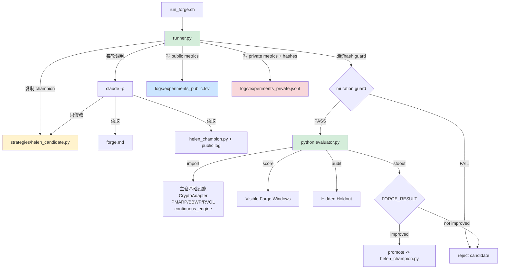

# Forge — 策略自动锻造系统设计文档

> **设计日期**: 2026-03-26
> **状态**: 设计完成，待实现
> **依赖**: Helen v2.0 (dual-engine BTC timing), autoresearch pattern (Karpathy)
> **MVP 标的**: Helen (BTC 择时)，架构通用

---

## 前因：为什么需要 Forge

### 从 Helen v1.0 到 v2.0 的启示

Helen（极简双引擎 BTC 择时系统）的优化过程是这样的：

1. Boss 提供完整的主观交易系统（v1.0 法典）
2. CC 做代码实现 + 回测
3. 发现日线数据缺失导致右侧引擎 6 年瘫痪（数据 bug）
4. 修复后发现风控模块是纯负收益（-5.4%/年 CAGR，MDD 仅改善 0.6%）
5. 发现交接棒（PMARP>50%）过早清仓，左侧平均只持有 3.3 天
6. 三刀优化：砍风控 + 贪婪映射 + 自然交接棒
7. 结果：CAGR 42.6% → 48.7%（vs B&H 50.4%），MDD -46.9% → -45.8%

**这个过程花了一整个会话的人工诊断和实验。** 每一步都是：假设 → 改代码 → 跑回测 → 看数据 → 新假设。这正是 autoresearch 模式能自动化的事。

### Autoresearch 的核心洞察

Karpathy 的 autoresearch 用三个文件实现了 LLM 训练的自动化实验：
- `prepare.py`（不可改）— 数据 + 评估函数
- `train.py`（可改）— 训练代码，agent 唯一可修改的文件
- `program.md`（指令）— agent 的约束规则

棘轮循环：改代码 → 跑实验 → 好就 commit，差就 reset → 循环。一晚上 ~100 个实验。

### 直接用 autoresearch 的问题

1. **过拟合**：LLM 训练 5 分钟不会过拟合，但策略优化 100 轮几乎必然拟合到历史噪声
2. **指标设计**：val_bpb 是单一标量，策略有 CAGR/MDD/Exposure 多维度
3. **安全门槛**：LLM 没有"爆仓"风险，策略有

**Forge = autoresearch 模式 + 受限变异面 + 多窗口可见评分 + 隐藏审计通道 + 可复现实验锁**

---

## 系统概览

### 核心循环

```text
LOOP (人工启动，runner 自动循环，人工决定何时停):
  1. LOAD — 读取 champion 策略 + public log + campaign.lock.json
  2. HYPOTHESIZE — agent 基于 champion 和最近实验形成一个单点假设
  3. MUTATE — 仅修改 candidate 策略（参数调整 or 结构变更）
  4. VERIFY — runner 做 diff whitelist / hash guard / import guard
  5. EVALUATE — evaluator 跑可见锻造窗口 + 隐藏审计窗口
  6. GATE — 所有可见窗口必须过门槛，否则直接丢弃
  7. RATCHET — runner 用 visible_score 比较 champion vs candidate
  8. AUDIT — runner 写 public log + private audit log（agent 不可见）
  9. PROMOTE / DISCARD — 晋级为 champion 或删除 candidate
 10. REPEAT / STOP
```

### 控制面补强（v0.2）

| 平面 | 责任 | 原因 |
|------|------|------|
| **Mutation Plane** | agent 只改 `candidate` 策略文件 | 把搜索空间锁在可控边界内 |
| **Control Plane** | `runner.py` 负责循环、评估、晋级、日志、停止 | git/reset/logging 不能交给 agent |
| **Scoring Plane** | `evaluator.py` 负责评分和门槛 | 评分逻辑必须冻结 |
| **Audit Plane** | private audit log 记录隐藏 holdout、hash、基线版本 | 防止 OOS 泄漏 + 保证可复现 |
| **Repro Plane** | `campaign.lock.json` 固定数据快照/基线 SHA/成本参数 | 否则同一策略随时间会“漂移” |

### 核心三件套对应关系

| autoresearch | Forge | 角色 | 可改? |
|---|---|---|---|
| `prepare.py` | `evaluator.py` | 裁判：visible score + hidden audit + 门槛 | 不可改 |
| `train.py` | `strategies/helen_candidate.py` | 候选策略：agent 唯一可修改的文件 | **可改** |
| `program.md` | `forge.md` | 指令：约束规则 + 探索方向 + 禁区 | 不可改 |

> 注：Forge 相比 autoresearch 额外增加了 `runner.py` 和 `campaign.lock.json` 两个控制面文件；否则策略搜索在金融场景下不够安全。

### 两种优化模式

| 模式 | 描述 | 价值 |
|------|------|------|
| **A. 参数优化** | 调数值（EMA 周期、斜率阈值、hold 天数） | 精细校准，低风险 |
| **B. 策略进化** | 改结构（换指标、改逻辑、加新条件） | 发现人类未想到的改进，高价值 |

Forge 同时支持两者。agent 根据 forge.md 的探索方向自主决定每轮做 A 还是 B。

---

## 过拟合防护

### 单一固定 IS/OOS 不够

固定分割比“全量回测直接 ratchet”好，但还不够。  
如果 agent 对同一段 IS 连续试 50-100 轮，它仍然会把噪声拟合出来。  
因此 v0.2 改为：**多窗口可见评分 + 单独隐藏审计通道**。

```text
BTC 4H 数据时间线：

|-- Warmup --|--------- Visible Forge Zone ---------|---- Hidden Audit Holdout ----|
   2017-08        2019-01 ————————————> 2023-06         2023-07 ————————> 2026-03
   指标预热          agent 可见，但只见聚合分数              agent 永远不可见
   不计分            由 3 个锚定窗口聚合出 visible_score      仅供 runner / 人工审计
```

**Visible Forge Zone（建议 3 个锚定窗口）**：
- Window A: 2019-01 → 2021-12
- Window B: 2020-01 → 2022-12
- Window C: 2021-01 → 2023-06

agent 只看到三窗聚合后的 `visible_score`，不看到 holdout 的任何真实值。

### 规则

1. **棘轮只看 `visible_score`，不能只看 raw CAGR**
2. **holdout 每轮都跑，但只写 private audit log，不进入 agent 上下文**
3. **所有可见窗口必须同时过门槛**，不能出现“平均值好看，单窗爆炸”
4. **搜索预算是配置项**：如 30 轮 / 50 轮封顶，不能无限试到命中噪声
5. **分割点、窗口、成本参数写死在 `campaign.lock.json` + `evaluator.py`**，agent 无法篡改

### 门槛设定

```
硬门槛（每个 visible window 都必须通过）：
  - MaxDD > -55%            → reject
  - Exposure < 20%          → reject
  - import / runtime error  → reject

棘轮指标（通过门槛后比较）：
  - visible_score = min(window_A_excess_cagr, window_B_excess_cagr, window_C_excess_cagr)
  - 取三窗口中最差的 excess CAGR（天然惩罚单窗口过拟合）
  - MDD/Exposure 已被门槛过滤，不需要进 score
  - 明确禁止用 raw CAGR 单独做 ratchet

隐藏审计指标（private log，人工看）：
  - holdout excess CAGR / holdout MDD / holdout exposure / holdout turnover
  - visible-holdout gap（过拟合程度）
  - campaign 内的最佳审计快照

自动停机规则：
  - holdout_excess_cagr < champion_holdout_excess_cagr - 15% → runner 自动暂停
  - 连续 N 轮无改进（N = campaign.lock 配置，默认 20）→ runner 自动停止
```

Exposure 下限的存在意义：没有它，agent 的最优策略是“几乎不交易”。  
而 **禁止用 raw CAGR 单独 ratchet** 的意义是：否则 BTC 的最优解会退化成“尽量贴近 Buy & Hold 的高 beta 策略”，这和 Helen 的使命并不一致。

---

## 文件结构

```
Finance/
└── forge/                        # 策略锻造模块
    ├── runner.py                 # 不可改 — 控制面（循环 / diff guard / 晋级 / 日志）
    ├── evaluator.py              # 不可改 — 评分裁判
    ├── campaign.lock.json        # 不可改 — 数据快照 / 基线 SHA / 成本 / 窗口
    ├── forge.md                  # 不可改 — agent 指令
    ├── strategies/               # 可改 — 策略文件
    │   ├── helen_champion.py     # 当前最优策略
    │   └── helen_candidate.py    # 本轮候选策略（agent 仅可修改此文件）
    ├── logs/
    │   ├── experiments_public.tsv    # agent 可见 — 仅 visible 指标
    │   └── experiments_private.jsonl # agent 不可见 — holdout + hashes + 审计
    ├── manifests/
    │   └── helen_surface.yaml    # 可选 — 参数面白名单（优先于任意 Python 变更）
    ├── run_forge.sh              # 薄 wrapper，实际调用 runner.py
    └── README.md                 # 使用说明
```

### 关键设计决策

**1. Champion / Candidate 双文件，不用 git commit/reset 当状态机**

每轮由 runner 复制 `helen_champion.py -> helen_candidate.py`，agent 只改 candidate。  
评估通过才 promote 为新的 champion。这样：
- 最优策略始终有显式文件，不依赖 git reset 兜底
- 失败候选天然可删除，不会污染基线
- 并行实验时也更容易做多分支比较

**2. `helen_candidate.py` 是 `dual_engine.py` 的实验室副本，不是 import**

agent 需要能自由修改策略逻辑。如果直接 import 生产模块，会污染主仓。  
Forge 里的 candidate/champion 是“实验室版本”，验证通过后再人工合并回 `src/timing/dual_engine.py`。

**3. evaluator.py import 主仓的基础设施，但要被 `campaign.lock.json` 钉住**

数据加载（CryptoAdapter）、指标计算（PMARP/BBWP/RVOL）、回测引擎（continuous_engine）都从主仓 import。  
但每轮实验必须同时记录：
- 数据快照 hash
- evaluator/base infra git SHA
- 成本参数
- 分割窗口版本

否则同一策略在不同日期重跑会得到不同分数，ratchet 将失去意义。

**4. run_forge.sh 只是外壳，真正的控制器是 runner.py**

每轮循环依然可以是一次独立的 `claude -p` 调用，但：
- `git add / commit / reset`
- 日志落盘
- diff whitelist
- hidden holdout 计算
- stop rule 判定

都必须由 runner.py 负责，**不能交给 agent 自治**。

**5. 默认先走参数面，结构进化是二级模式**

v0.1 让 agent 同时做“参数优化”和“任意 Python 结构进化”，搜索空间太大。  
v0.2 改为两级：
- **Level 1 / Parameter Surface**：优先改 `helen_surface.yaml` 里的白名单参数
- **Level 2 / Structural Mode**：连续 10 轮参数优化无改进时，自动解锁结构变更（`campaign.lock: "structural_unlock_after_stale": 10`）

这样可以显著降低无效搜索和 bug 率。

**6. 通用性**

未来加新策略只需：
1. 在 `strategies/` 下放 `*_champion.py` / `*_candidate.py`
2. 在 `campaign.lock.json` 中注册数据源、窗口和成本参数
3. 在 evaluator.py 中注册 scoring adapter
4. 在 forge.md 中添加该策略的探索方向

框架本身不变。

---

## evaluator.py 输出 Contract

### stdout（agent 可见）

```
FORGE_RESULT:
  status: PASS                  # PASS / FAIL_GATE / FAIL_GUARD / ERROR
  visible_score: 0.1834         # runner ratchet 用
  visible_excess_cagr: -0.0121  # 对 B&H 的超额收益
  visible_mdd: -0.4579
  visible_exposure: 0.548
  visible_turnover: 5.21
  best_visible_score: 0.1790
  improved: true
  changed_files: strategies/helen_candidate.py
  audit_holdout: HIDDEN         # 不返回真实值
```

### `logs/experiments_public.tsv`（agent 可见）

```tsv
timestamp	experiment_id	hypothesis	status	visible_score	visible_excess_cagr	visible_mdd	visible_exposure	visible_turnover	accepted
```

- `hypothesis`：runner 从 agent 输出或 candidate 文件头部提取
- `accepted`：true = promote 为 champion，false = 删除 candidate
- **不允许出现任何 holdout / OOS 真实值**

### `logs/experiments_private.jsonl`（仅 runner / 人工审计）

每条记录至少包含：
- visible metrics
- holdout metrics
- strategy hash
- evaluator/base infra SHA
- data snapshot hash
- accepted / rejected 原因

---

## forge.md — Agent 指令

```markdown
# Forge — Helen 策略锻造指令

## 你的身份
你是一个量化策略研究员。你的工作是通过修改 `strategies/helen_candidate.py`，
在 visible windows 通过 MaxDD / Exposure 门槛的前提下，提升 `visible_score`。

## 工作流程
1. 读 `strategies/helen_champion.py` 和 `logs/experiments_public.tsv` 最近 20 行，理解当前状态
2. 形成一个假设（必须是单变量或单结构变化）
3. 只修改 `strategies/helen_candidate.py`
4. 不要执行 git、不要写日志、不要读取 private audit 文件
5. 在 candidate 文件头部写出本轮 hypothesis 注释
6. 完成后退出；runner 会负责评估、记录、晋级或丢弃

## 探索方向（优先级从高到低）
1. 右侧引擎的 EMA 周期和斜率阈值
2. 左侧触发条件（PMARP 阈值、BBWP/RVOL 乘数）
3. 左侧退出条件（max hold 天数）
4. 尝试新的指标组合（RSI、MACD、布林带等）
5. 尝试不同的仓位映射函数（sigmoid、阶梯、指数）

## 禁区
- 不要修改 `runner.py` / `evaluator.py` / `campaign.lock.json`
- 不要读取或使用 private audit / holdout 的任何信息
- 不要修改 `logs/experiments_public.tsv` 的历史记录
- 不要在策略中 hardcode 特定日期或价格
- 不要让策略在特定时间段做特殊处理（日期嗅探 = 过拟合）
- 不要引入外部依赖

## 实验策略
- 每次只改一个变量或一个结构点，隔离因果关系
- 参数调整用小步长（±10-20%），不要跳跃式修改
- 优先修改参数面白名单；只有连续失败后才升级到结构性变更
- 如果连续 5 次失败，换一个探索方向
- 读 public log 的历史，不要重复已经失败的实验
```

---

## 启动流程

### run_forge.sh

```bash
#!/bin/bash
# Forge thin wrapper
# 用法: ./forge/run_forge.sh --rounds 50 --strategy helen

set -euo pipefail

FORGE_DIR="$(cd "$(dirname "$0")" && pwd)"
cd "$FORGE_DIR"

python runner.py "$@"
```

### 人工操作流程

```
1. cd Finance/forge
2. ./run_forge.sh --rounds 50        # 启动 50 轮自动实验
3. 过程中可以 Ctrl+C 随时停
4. 看 `logs/experiments_public.tsv` 观察 visible 收敛
5. 看 `logs/experiments_private.jsonl` 审计 holdout 是否恶化
6. 如果满意，手动把 `strategies/helen_champion.py` 的改进合并回 `src/timing/dual_engine.py`
```

---

## 架构图



---

## 通用化路径

MVP 只服务 Helen，但架构预留了通用扩展点：

| 扩展 | 改动 |
|------|------|
| 新策略 | 新增 champion/candidate + scoring adapter + campaign.lock 条目 |
| 新标的 | campaign.lock 参数化 symbol / interval / cost model |
| Walk-forward 替代锚定窗口 | 只改 evaluator 内部，runner/agent 接口不变 |
| 多目标优化 | 只改 visible_score 公式和 gate，接口不变 |
| 并行实验 | 多 campaign 目录或多 worktree，各自独立 champion/public/private log |

---

## 风险与缓解

| 风险 | 影响 | 缓解 |
|------|------|------|
| Hidden holdout 泄漏给 agent | 失去最后一道防线 | public/private 双日志，runner 严禁把 private 内容注入 prompt |
| raw CAGR 诱导高 beta 拟合 | 退化成近似 Buy & Hold | visible_score 改为相对 B&H 的 utility，不允许 raw CAGR 单独 ratchet |
| Agent 越权修改 runner/evaluator/log | 审计失真，门槛失效 | diff whitelist + hash guard + candidate-only 可写边界 |
| 任意 Python 搜索空间过大 | 无效实验和 bug 激增 | 默认先走参数面，结构进化降级为二级模式 |
| 100 轮后 visible 收敛但 holdout 恶化 | 继续跑只会加深过拟合 | runner 增加 stop rule：无改进轮数上限 + holdout meltdown 自动停机 |
| 数据/基线代码漂移 | 历史最佳无法复现 | campaign.lock + base SHA + data hash 写入 private audit |
| OOS 段随时间推移变短 | 审计代表性下降 | 每个 campaign 固定快照；新季度重新开新 campaign，不复用旧 holdout |

---

## 变更记录

| 版本 | 日期 | 内容 |
|------|------|------|
| v0.1 设计 | 2026-03-26 | 初始设计，基于 autoresearch 模式 + IS/OOS 防护 + Helen MVP |
| v0.2 审核修订 | 2026-03-26 | 加入 public/private log、runner 控制面、campaign.lock、multi-window visible score、champion/candidate 分离 |
| v0.2 三点定板 | 2026-03-26 | visible_score = min(三窗口 excess_cagr)；结构进化在参数面连续 10 轮无改进后解锁；holdout meltdown 阈值 -15% 自动停机 |
