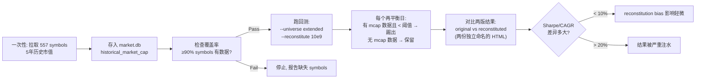

# RS 回测 Reconstitution Bias 修正 — Implementation Plan

> **For Claude:** REQUIRED SUB-SKILL: Use superpowers:executing-plans to implement this plan task-by-task.

**Confidence: 90%**
**不确定点**: 批量拉取 557 symbols 时部分 symbol 可能返回空（新上市不足5年、ticker 变更等），需靠覆盖率门卫把关
**北极星对齐**: 离线 R&D 层（回测引擎 + 因子研究框架）— 确保 RS 动量因子的有效性验证不被 reconstitution bias 污染

**Goal:** 给 RS 回测引擎注入历史市值数据，让每次再平衡日只纳入"当时市值达标"的股票，消除 look-ahead/reconstitution bias。

**Tech Stack:** Python + FMP API (stable endpoint) + SQLite (market.db) + 现有 backtest 框架

### Scope 声明（诚实边界）

本 plan 修正的是 **reconstitution bias**（用今天的市值名单回看历史），**不是** survivorship bias（退市/被收购股票缺席）。当前 extended universe 来自今天的 FMP screener（活跃股票），退市标的永远不会进入回测。消除 survivorship bias 需要历史 index membership 或 delisting 数据，属于 Phase 2 范围。

---

## Architecture（架构图）

```mermaid
graph TD
    FMP["FMP Stable API<br>/stable/historical-market-capitalization<br>?symbol=XXX&from=...&to=..."] -->|fetch| CLIENT[fmp_client.py<br>get_historical_market_cap]
    CLIENT -->|upsert| TABLE[(market.db<br>historical_market_cap<br>symbol | date | market_cap)]
    SCRIPT["scripts/fetch_historical_mcap.py<br>批量拉取 + 覆盖率报告"] --> CLIENT

    TABLE -->|get_bulk_market_caps_at| ADAPTER[USStocksAdapter<br>mcap_threshold 参数]
    PRICES[(daily_price)] -->|加载| ADAPTER
    ADAPTER -->|"slice_to_date + mcap 过滤<br>(缺数据 = 保留, 不踢出)"| ENGINE[BacktestEngine]
    ENGINE -->|RS排名 → Top-N| RESULT[回测结果]

    CLI["run_rs_backtest.py<br>--reconstitute 10e9"] -->|配置| ENGINE

    GATE{覆盖率门卫<br>mcap 数据 ≥90%?}
    ADAPTER --> GATE
    GATE -->|Pass| ENGINE
    GATE -->|Fail| ABORT[拒绝出结果<br>要求先补数据]
```

> 一句话：FMP 历史市值 → market.db 新表 → 适配器按日期过滤（缺数据保留不踢出） → 覆盖率 ≥90% 才出结果

## Business Flow（业务流程图）



> 一句话：拉数据 → 覆盖率检查 → 跑两版 → 对比，判断 RS 动量的有效性有多少是 reconstitution bias 造成的

## Alternatives Considered（替代方案）

| 方案 | 优势 | 劣势 | 选择理由 |
|------|------|------|----------|
| **A: FMP stable/historical-market-capitalization（推荐）** | 日频、Starter 可用（已实测 200 OK）、5年覆盖、与现有 FMP 客户端统一 | 只有当前列表的股票（不含已退市）；需 557 API calls | 成本为零（已有订阅），覆盖期与回测窗口匹配，修正 reconstitution bias |
| B: Price × shares outstanding 代理 | 零 API 调用 | 仅池内 145 只有财报数据，扩展池 412 只无财报 → 覆盖率 26% | 覆盖太窄，无法用于 extended universe 回测 |
| C: 价格比率代理 (mcap_today × price_ratio) | 零 API 调用，100% 覆盖 | 回购/增发导致 ±20% 误差，不是真实数据 | 退路方案：如果 FMP 端点对某些 symbol 批量失败，可作为 fallback |

## Risks & Mitigation（风险自证）

- **最大风险:** 部分 symbol 返回空（新上市不足5年、ticker 变更、FMP 覆盖盲区）→ 覆盖率不足 90%
  - **缓解:** 覆盖率门卫硬卡。不足 90% 时报告缺失列表，Boss 决定是否用价格比率代理补全或接受现状
- **数据缺失的默认行为:** `mcaps.get(sym)` 返回 None 时 **保留该股票**（不踢出），避免把"没数据"误判为"太小"
- **为什么不用更简单的做法:** 价格比率代理（方案 C）有 ±20% 误差，在 $10B 阈值附近的边缘股票会被错误纳入/排除。FMP 方案得到精确日频数据
- **回滚方案:** 新增的都是独立组件（新表、新方法、新 CLI flag），不改已有行为。`--reconstitute` 不传 = 原有行为不变

## Acceptance Criteria（验收标准）

- [ ] `historical_market_cap` 表有数据，且覆盖率 ≥ 90%（≥ 500/557 symbols 有 mcap 行）
- [ ] `python3 scripts/run_rs_backtest.py --universe extended --reconstitute 10e9` 正常出结果
- [ ] 不传 `--reconstitute` 时行为与当前完全一致（零回归）
- [ ] 缺 mcap 数据的 symbol 被保留（不被静默踢出），日志中有 WARNING 提示
- [ ] 对比报告有两份独立 HTML（`_original` / `_reconstituted`），清晰展示 Sharpe/CAGR/MDD 差异

---

## Implementation Tasks

### Task 1: FMP 端点探针 — 已完成 ✅

实测确认 stable 端点可用：
- **正确路径**: `/stable/historical-market-capitalization?symbol=AAPL&from=...&to=...`
- **响应格式**: `[{"symbol": "AAPL", "date": "2025-01-10", "marketCap": 3551348321700}, ...]`
- **覆盖**: AAPL 5年返回 1314 行日频数据
- **废弃路径**: `/api/v3/historical-market-capitalization/AAPL` → 403 legacy

---

### Task 2: market_store 新表 — historical_market_cap

**Files:**
- Modify: `src/data/market_store.py`
- Test: `tests/data/test_market_store_mcap.py`

**Step 1: Write failing test**

```python
# tests/data/test_market_store_mcap.py
"""historical_market_cap 表的 CRUD 测试"""
import pytest
from src.data.market_store import MarketStore


@pytest.fixture
def store(tmp_path):
    return MarketStore(tmp_path / "test.db")


def test_upsert_and_query_mcap(store):
    rows = [
        {"symbol": "AAPL", "date": "2024-01-02", "market_cap": 3_000_000_000_000},
        {"symbol": "AAPL", "date": "2024-01-03", "market_cap": 3_050_000_000_000},
    ]
    count = store.upsert_historical_market_cap("AAPL", rows)
    assert count == 2

    cap = store.get_market_cap_at("AAPL", "2024-01-02")
    assert cap == 3_000_000_000_000


def test_get_market_cap_at_returns_nearest_before(store):
    """非交易日应返回最近的前一个交易日市值"""
    rows = [
        {"symbol": "AAPL", "date": "2024-01-02", "market_cap": 3_000_000_000_000},
        {"symbol": "AAPL", "date": "2024-01-05", "market_cap": 3_100_000_000_000},
    ]
    store.upsert_historical_market_cap("AAPL", rows)
    cap = store.get_market_cap_at("AAPL", "2024-01-04")
    assert cap == 3_000_000_000_000


def test_get_market_cap_at_missing_symbol(store):
    cap = store.get_market_cap_at("ZZZZ", "2024-01-02")
    assert cap is None


def test_bulk_market_caps_at_date(store):
    """批量查某日多个 symbol 的市值"""
    store.upsert_historical_market_cap("AAPL", [
        {"symbol": "AAPL", "date": "2024-01-02", "market_cap": 3_000_000_000_000},
    ])
    store.upsert_historical_market_cap("MSFT", [
        {"symbol": "MSFT", "date": "2024-01-02", "market_cap": 2_800_000_000_000},
    ])
    result = store.get_bulk_market_caps_at("2024-01-02")
    assert result["AAPL"] == 3_000_000_000_000
    assert result["MSFT"] == 2_800_000_000_000


def test_upsert_idempotent(store):
    rows = [{"symbol": "AAPL", "date": "2024-01-02", "market_cap": 3_000_000_000_000}]
    store.upsert_historical_market_cap("AAPL", rows)
    rows[0]["market_cap"] = 3_100_000_000_000
    store.upsert_historical_market_cap("AAPL", rows)
    cap = store.get_market_cap_at("AAPL", "2024-01-02")
    assert cap == 3_100_000_000_000
```

**Step 2: Run test to verify it fails**

```bash
pytest tests/data/test_market_store_mcap.py -v
```
Expected: FAIL — `upsert_historical_market_cap` not found

**Step 3: Implement — 表定义 + upsert + 查询**

在 `market_store.py` 的 `_SCHEMA` 中新增：

```python
# -- Historical market cap (for universe reconstitution) --
"""CREATE TABLE IF NOT EXISTS historical_market_cap (
    symbol TEXT NOT NULL,
    date TEXT NOT NULL,
    market_cap REAL NOT NULL,
    PRIMARY KEY (symbol, date)
);""",
"CREATE INDEX IF NOT EXISTS idx_hmc_date ON historical_market_cap(date);",
```

在 `MarketStore` 类中新增三个方法（注意使用 `_get_conn()` 不是 `_connect()`）：

```python
def upsert_historical_market_cap(self, symbol: str, rows: List[Dict]) -> int:
    """写入历史市值数据"""
    if not rows:
        return 0
    sql = """INSERT OR REPLACE INTO historical_market_cap
             (symbol, date, market_cap) VALUES (?, ?, ?)"""
    data = [(r.get("symbol", symbol), r["date"], r["market_cap"]) for r in rows]
    conn = self._get_conn()
    conn.executemany(sql, data)
    conn.commit()
    return len(data)

def get_market_cap_at(self, symbol: str, date: str) -> Optional[float]:
    """查询 symbol 在 date（或之前最近交易日）的市值。无数据返回 None。"""
    sql = """SELECT market_cap FROM historical_market_cap
             WHERE symbol = ? AND date <= ?
             ORDER BY date DESC LIMIT 1"""
    conn = self._get_conn()
    row = conn.execute(sql, (symbol, date)).fetchone()
    return row[0] if row else None

def get_bulk_market_caps_at(self, date: str) -> Dict[str, float]:
    """查询所有 symbol 在 date（或之前最近日）的市值"""
    sql = """SELECT symbol, market_cap FROM historical_market_cap
             WHERE (symbol, date) IN (
                 SELECT symbol, MAX(date) FROM historical_market_cap
                 WHERE date <= ? GROUP BY symbol
             )"""
    conn = self._get_conn()
    rows = conn.execute(sql, (date,)).fetchall()
    return {r[0]: r[1] for r in rows}
```

**Step 4: Run test**

```bash
pytest tests/data/test_market_store_mcap.py -v
```
Expected: ALL PASS

**Step 5: Commit**

```bash
git add tests/data/test_market_store_mcap.py src/data/market_store.py
git commit -m "feat(data): add historical_market_cap table for universe reconstitution"
```

---

### Task 3: FMP 客户端 — get_historical_market_cap 方法

**Files:**
- Modify: `src/data/fmp_client.py`
- Test: `tests/data/test_fmp_client_mcap.py`

**Step 1: Write failing test**

```python
# tests/data/test_fmp_client_mcap.py
"""FMP historical market cap 方法测试（mock HTTP）"""
import pytest
from unittest.mock import patch
from src.data.fmp_client import FMPClient


@pytest.fixture
def client():
    return FMPClient(api_key="test_key")


def test_get_historical_market_cap_success(client):
    mock_data = [
        {"symbol": "AAPL", "date": "2024-01-02", "marketCap": 3000000000000},
        {"symbol": "AAPL", "date": "2024-01-03", "marketCap": 3050000000000},
    ]
    with patch.object(client, '_request', return_value=mock_data):
        result = client.get_historical_market_cap("AAPL", "2024-01-01", "2024-01-10")
    assert len(result) == 2
    assert result[0]["market_cap"] == 3000000000000
    assert result[0]["date"] == "2024-01-02"
    assert result[0]["symbol"] == "AAPL"


def test_get_historical_market_cap_empty(client):
    with patch.object(client, '_request', return_value=[]):
        result = client.get_historical_market_cap("ZZZZ", "2024-01-01", "2024-01-10")
    assert result == []


def test_get_historical_market_cap_none_response(client):
    with patch.object(client, '_request', return_value=None):
        result = client.get_historical_market_cap("AAPL", "2024-01-01", "2024-01-10")
    assert result == []


def test_get_historical_market_cap_calls_stable_endpoint(client):
    """确认调用的是 stable 端点路径，symbol 作为 query param"""
    with patch.object(client, '_request', return_value=[]) as mock_req:
        client.get_historical_market_cap("AAPL", "2024-01-01", "2024-12-31")
    mock_req.assert_called_once_with(
        "historical-market-capitalization",
        {"symbol": "AAPL", "from": "2024-01-01", "to": "2024-12-31"},
    )
```

**Step 2: Run test to verify it fails**

```bash
pytest tests/data/test_fmp_client_mcap.py -v
```

**Step 3: Implement**

在 `FMPClient` 中新增（注意：stable 端点用 query param `?symbol=XXX`，不是 path param）：

```python
def get_historical_market_cap(
    self, symbol: str, from_date: str, to_date: str
) -> List[Dict]:
    """
    获取历史市值 (日频)

    使用 stable 端点: /stable/historical-market-capitalization?symbol=XXX
    注意: legacy /api/v3/historical-market-capitalization/XXX 已废弃 (403)

    Args:
        symbol: 股票代码
        from_date: 起始日期 YYYY-MM-DD
        to_date: 结束日期 YYYY-MM-DD

    Returns:
        [{"symbol": str, "date": str, "market_cap": float}, ...]
    """
    data = self._request(
        "historical-market-capitalization",
        {"symbol": symbol, "from": from_date, "to": to_date},
    )
    if not data:
        return []
    # FMP 返回 camelCase "marketCap" → 转换为 snake_case
    return [
        {
            "symbol": row.get("symbol", symbol),
            "date": row["date"],
            "market_cap": row["marketCap"],
        }
        for row in data
        if "date" in row and "marketCap" in row
    ]
```

**Step 4: Run test**

```bash
pytest tests/data/test_fmp_client_mcap.py -v
```

**Step 5: Commit**

```bash
git add src/data/fmp_client.py tests/data/test_fmp_client_mcap.py
git commit -m "feat(fmp): add get_historical_market_cap via stable endpoint"
```

---

### Task 4: 批量拉取脚本 — fetch_historical_mcap.py

**Files:**
- Create: `scripts/fetch_historical_mcap.py`

**Step 1: Implement**

```python
#!/usr/bin/env python3
"""
批量拉取历史市值数据 → market.db historical_market_cap 表

用法:
    python3 scripts/fetch_historical_mcap.py                      # 拉取 extended universe 全部
    python3 scripts/fetch_historical_mcap.py --symbols AAPL MSFT  # 指定
    python3 scripts/fetch_historical_mcap.py --years 3            # 3年而非默认5年
    python3 scripts/fetch_historical_mcap.py --skip-existing      # 跳过已有数据的 symbol

完成后输出覆盖率报告。
"""
import argparse
import logging
import sys
from datetime import datetime, timedelta
from pathlib import Path

_PROJECT_ROOT = Path(__file__).parent.parent
sys.path.insert(0, str(_PROJECT_ROOT))

from src.data.fmp_client import FMPClient
from src.data.market_store import get_store
from src.data.extended_universe_manager import get_extended_symbols
from src.data.pool_manager import get_symbols as get_pool_symbols

logging.basicConfig(
    level=logging.INFO,
    format="%(asctime)s [%(levelname)s] %(message)s",
    datefmt="%H:%M:%S",
)
logger = logging.getLogger(__name__)


def fetch_all(symbols, years=5, skip_existing=False):
    client = FMPClient()
    store = get_store()

    to_date = datetime.now().strftime("%Y-%m-%d")
    from_date = (datetime.now() - timedelta(days=years * 365)).strftime("%Y-%m-%d")

    # 如果 skip_existing，查已有 symbol
    existing = set()
    if skip_existing:
        conn = store._get_conn()
        rows = conn.execute(
            "SELECT DISTINCT symbol FROM historical_market_cap"
        ).fetchall()
        existing = {r[0] for r in rows}
        logger.info(f"已有 {len(existing)} symbols，将跳过")

    total = len(symbols)
    success = 0
    skipped = 0
    failed = []

    for i, sym in enumerate(symbols, 1):
        if sym in existing:
            skipped += 1
            continue

        logger.info(f"[{i}/{total}] {sym}")
        try:
            rows = client.get_historical_market_cap(sym, from_date, to_date)
            if rows:
                store.upsert_historical_market_cap(sym, rows)
                success += 1
                logger.info(f"  ✓ {len(rows)} rows")
            else:
                failed.append(sym)
                logger.warning(f"  ✗ 无数据")
        except Exception as e:
            failed.append(sym)
            logger.error(f"  ✗ {e}")

    # ── 覆盖率报告 ──
    coverage = (success + skipped) / total * 100 if total > 0 else 0
    logger.info(f"\n{'='*50}")
    logger.info(f"覆盖率报告:")
    logger.info(f"  总计: {total} symbols")
    logger.info(f"  成功: {success}, 跳过(已有): {skipped}, 失败: {len(failed)}")
    logger.info(f"  覆盖率: {coverage:.1f}%  {'✓ PASS (≥90%)' if coverage >= 90 else '✗ FAIL (<90%)'}")
    if failed:
        logger.info(f"  失败列表: {failed}")
    logger.info(f"{'='*50}")

    return {"success": success, "skipped": skipped, "failed": failed, "coverage": coverage}


def main():
    parser = argparse.ArgumentParser(description="批量拉取历史市值")
    parser.add_argument("--symbols", nargs="+", help="指定 symbols")
    parser.add_argument("--universe", choices=["pool", "extended"],
                        default="extended", help="股票池")
    parser.add_argument("--years", type=int, default=5, help="回溯年数")
    parser.add_argument("--skip-existing", action="store_true",
                        help="跳过已有数据的 symbol")
    args = parser.parse_args()

    if args.symbols:
        symbols = args.symbols
    elif args.universe == "pool":
        symbols = get_pool_symbols()
    else:
        symbols = get_extended_symbols()

    logger.info(f"目标: {len(symbols)} symbols, {args.years} 年, "
                f"{'跳过已有' if args.skip_existing else '全量'}")
    fetch_all(symbols, years=args.years, skip_existing=args.skip_existing)


if __name__ == "__main__":
    main()
```

**Step 2: 测试运行（先拉 1 个确认端到端）**

```bash
python3 scripts/fetch_historical_mcap.py --symbols AAPL --years 1
```
Expected: `✓ ~252 rows`, 覆盖率 100%

**Step 3: 验证 DB 写入**

```bash
python3 -c "
from src.data.market_store import get_store
store = get_store()
cap = store.get_market_cap_at('AAPL', '2025-06-01')
print(f'AAPL market cap on 2025-06-01: \${cap:,.0f}')
"
```

**Step 4: 全量拉取**

```bash
python3 scripts/fetch_historical_mcap.py --universe extended --years 5 --skip-existing
```
Expected: ~557 symbols, ~700K rows, ~20 min (with 2s rate limit), 覆盖率 ≥ 90%

**如果覆盖率 < 90%**: 停止，报告缺失列表给 Boss，讨论是否补数据或降低阈值。

**Step 5: Commit**

```bash
git add scripts/fetch_historical_mcap.py
git commit -m "feat(scripts): add historical market cap batch fetcher with coverage gate"
```

---

### Task 5: 适配器 — mcap_threshold 过滤 + 覆盖率门卫

**Files:**
- Modify: `backtest/adapters/us_stocks.py`
- Modify: `backtest/config.py`
- Test: `tests/backtest/test_us_stocks_reconstitution.py`

**Step 1: Write failing test**

```python
# tests/backtest/test_us_stocks_reconstitution.py
"""universe reconstitution 过滤测试"""
import pytest
from unittest.mock import patch
import pandas as pd
from backtest.adapters.us_stocks import USStocksAdapter


def _make_price_df(dates, closes):
    return pd.DataFrame({
        "date": dates,
        "open": closes, "high": closes, "low": closes,
        "close": closes, "volume": [1e6] * len(dates),
        "change": [0.0] * len(dates), "change_pct": [0.0] * len(dates),
    })


def _make_adapter(symbols, mcap_threshold=None):
    adapter = USStocksAdapter(symbols=symbols, mcap_threshold=mcap_threshold)
    dates = [f"2024-01-{d:02d}" for d in range(2, 72)]  # 70 天
    adapter._price_cache = {
        sym: _make_price_df(dates, [100.0] * 70) for sym in symbols
    }
    return adapter


def test_slice_to_date_filters_by_mcap():
    """SMALL 在该日市值 < 10B 应被过滤掉"""
    adapter = _make_adapter(["BIG", "SMALL"], mcap_threshold=10_000_000_000)
    mock_caps = {"BIG": 50_000_000_000, "SMALL": 5_000_000_000}

    with patch("backtest.adapters.us_stocks._get_bulk_mcaps", return_value=mock_caps):
        sliced = adapter.slice_to_date("2024-03-01")

    assert "BIG" in sliced
    assert "SMALL" not in sliced


def test_missing_mcap_data_keeps_stock():
    """无 mcap 数据的 symbol 应被保留（不踢出），避免数据缺失污染结果"""
    adapter = _make_adapter(["HAS_DATA", "NO_DATA"], mcap_threshold=10_000_000_000)
    # NO_DATA 不在 mcaps 字典中
    mock_caps = {"HAS_DATA": 50_000_000_000}

    with patch("backtest.adapters.us_stocks._get_bulk_mcaps", return_value=mock_caps):
        sliced = adapter.slice_to_date("2024-03-01")

    assert "HAS_DATA" in sliced
    assert "NO_DATA" in sliced  # 保留，不踢出


def test_coverage_gate_raises_on_low_coverage():
    """覆盖率 < 90% 时应 raise，拒绝出结果"""
    adapter = _make_adapter(
        [f"S{i}" for i in range(10)], mcap_threshold=10_000_000_000
    )
    # 只有 5/10 有 mcap 数据 = 50% 覆盖率
    mock_caps = {f"S{i}": 50_000_000_000 for i in range(5)}

    with patch("backtest.adapters.us_stocks._get_bulk_mcaps", return_value=mock_caps):
        with pytest.raises(ValueError, match="覆盖率"):
            adapter.slice_to_date("2024-03-01")


def test_no_filter_without_threshold():
    """不设 mcap_threshold 时，所有股票都通过"""
    adapter = _make_adapter(["A", "B"])
    sliced = adapter.slice_to_date("2024-03-01")
    assert "A" in sliced
    assert "B" in sliced
```

**Step 2: Run test to verify it fails**

```bash
pytest tests/backtest/test_us_stocks_reconstitution.py -v
```

**Step 3: Implement**

**`backtest/config.py`** — 给 `BacktestConfig` 加字段：

```python
# 在 BacktestConfig dataclass 中 rebalance_held 下方新增:
mcap_threshold: Optional[float] = None  # 历史市值阈值 (e.g. 10e9), None=不过滤
```

**`backtest/adapters/us_stocks.py`** — 修改适配器：

在 `class USStocksAdapter` 上方加模块级辅助函数：

```python
def _get_bulk_mcaps(date: str) -> Dict[str, float]:
    """从 market.db 查询所有 symbol 在 date 的历史市值"""
    from src.data.market_store import get_store
    return get_store().get_bulk_market_caps_at(date)
```

修改 `__init__` 签名，新增 `mcap_threshold` 参数：

```python
def __init__(
    self,
    symbols: Optional[List[str]] = None,
    universe: Optional[str] = None,
    mcap_threshold: Optional[float] = None,
):
    self._price_cache: Dict[str, pd.DataFrame] = {}
    self._symbols = symbols
    self._universe = universe
    self._mcap_threshold = mcap_threshold
    self._mcap_coverage_checked = False
```

修改 `slice_to_date`，在 `return sliced` 前插入 reconstitution 逻辑：

```python
def slice_to_date(self, date: str) -> Dict[str, pd.DataFrame]:
    if not self._price_cache:
        self.load_all()

    sliced = {}
    for sym, df in self._price_cache.items():
        mask = df["date"].astype(str) <= date
        cut = df[mask]
        if len(cut) >= 70:
            sliced[sym] = cut.reset_index(drop=True)

    # ── universe reconstitution ──
    if self._mcap_threshold and sliced:
        mcaps = _get_bulk_mcaps(date)

        # 覆盖率门卫（只在首次 rebalance 检查一次）
        if not self._mcap_coverage_checked:
            has_data = sum(1 for sym in sliced if sym in mcaps)
            coverage = has_data / len(sliced)
            if coverage < 0.9:
                missing = [sym for sym in sliced if sym not in mcaps]
                raise ValueError(
                    f"reconstitution 覆盖率 {coverage:.1%} < 90% "
                    f"({has_data}/{len(sliced)}). "
                    f"缺失 mcap 数据的 symbols: {missing[:20]}..."
                )
            logger.info(f"reconstitution 覆盖率 {coverage:.1%} ✓ ({has_data}/{len(sliced)})")
            self._mcap_coverage_checked = True

        before = len(sliced)
        sliced = {
            sym: df for sym, df in sliced.items()
            if sym not in mcaps  # 无数据 → 保留
            or mcaps[sym] >= self._mcap_threshold  # 有数据且达标 → 保留
        }
        filtered = before - len(sliced)
        if filtered > 0:
            logger.debug(f"{date}: reconstitution 过滤 {filtered} 只 (阈值 {self._mcap_threshold:.0e})")

    return sliced
```

**关键设计决策**：`sym not in mcaps` → **保留**。只有"有数据且低于阈值"才踢出。这避免了 P1-3 指出的"缺失数据静默删除"问题。

**Step 4: Run test**

```bash
pytest tests/backtest/test_us_stocks_reconstitution.py -v
```

**Step 5: Commit**

```bash
git add backtest/adapters/us_stocks.py backtest/config.py tests/backtest/test_us_stocks_reconstitution.py
git commit -m "feat(backtest): add mcap_threshold reconstitution with coverage gate"
```

---

### Task 6: CLI 集成 + HTML 命名修复

**Files:**
- Modify: `scripts/run_rs_backtest.py`
- Modify: `backtest/report.py`

**Step 1: 修改 CLI — 新增 `--reconstitute` flag**

在 `scripts/run_rs_backtest.py` 的 argparse 中新增：

```python
parser.add_argument("--reconstitute", type=float, default=None,
                    metavar="MCAP",
                    help="历史市值阈值 (e.g. 10e9)，启用 universe reconstitution")
```

修改 `_make_adapter`：

```python
def _make_adapter(args):
    """Create adapter with optional universe filter and reconstitution."""
    universe = getattr(args, "universe", None)
    mcap = getattr(args, "reconstitute", None)
    if (universe or mcap) and args.market == "us_stocks":
        from backtest.adapters.us_stocks import USStocksAdapter
        return USStocksAdapter(universe=universe, mcap_threshold=mcap)
    return None
```

**Step 2: 修改 HTML 命名 — 加 label 后缀**

在 `backtest/report.py` 的 `save_html_report` 中，将 `config.label()` 纳入文件名：

```python
def save_html_report(html: str, config: BacktestConfig, suffix: str = "") -> Path:
    """保存 HTML 报告到文件"""
    _BACKTEST_DIR.mkdir(parents=True, exist_ok=True)
    date_str = datetime.now().strftime("%Y%m%d")
    tag = f"_{suffix}" if suffix else ""
    path = _BACKTEST_DIR / f"report_{config.market}_{date_str}{tag}.html"
    path.write_text(html, encoding="utf-8")
    logger.info(f"HTML 报告已保存: {path}")
    return path
```

在 `run_single` 中传入 suffix：

```python
suffix = "reconstituted" if getattr(args, "reconstitute", None) else "original"
path = save_html_report(html, config, suffix=suffix)
```

**Step 3: Commit**

```bash
git add scripts/run_rs_backtest.py backtest/report.py
git commit -m "feat(cli): add --reconstitute flag + fix HTML report naming collision"
```

---

### Task 7: 对比验证 — 跑两版回测

**Files:** 无新文件，纯验证

**Step 1: 跑 original（无过滤）**

```bash
python3 scripts/run_rs_backtest.py --universe extended --method B --top-n 10 --freq M --html
```
记录: Sharpe / CAGR / MDD / Total Return
输出: `report_us_stocks_YYYYMMDD_original.html`

**Step 2: 跑 reconstituted（有过滤）**

```bash
python3 scripts/run_rs_backtest.py --universe extended --method B --top-n 10 --freq M --reconstitute 10e9 --html
```
记录: Sharpe / CAGR / MDD / Total Return
输出: `report_us_stocks_YYYYMMDD_reconstituted.html`

**Step 3: 对比分析**

| 指标 | Original | Reconstituted | 差异 |
|------|----------|---------------|------|
| Sharpe | ? | ? | ? |
| CAGR | ? | ? | ? |
| MDD | ? | ? | ? |

**判断标准（reconstitution bias 的影响）:**
- 差异 < 10%: reconstitution bias 影响轻微
- 差异 10-20%: 有一定注水，需谨慎解读
- 差异 > 20%: 严重注水，RS 有效性需重新评估

**注意**: 即使 reconstituted 版本表现良好，仍然不能排除 survivorship bias（退市股缺席）。这个测试只能量化 reconstitution bias 的影响。

**Step 4: 更新 ongoing.md + 记忆**

根据对比结果更新结论到 ongoing.md 和 project memory。

---

### Task 8: 回归测试 — 确保零破坏

**Step 1: 全量测试**

```bash
pytest tests/ -x -q
```
Expected: 所有 1428+ 测试通过

**Step 2: Commit 最终状态**

如果有遗留修复，一并提交。

---

## 时间估算

| Task | 预计 |
|------|------|
| Task 1: 端点探针 | ✅ 已完成 |
| Task 2: market_store 新表 | 10 min |
| Task 3: FMP 客户端方法 | 8 min |
| Task 4: 批量拉取脚本 | 5 min coding + 20 min API fetch |
| Task 5: 适配器过滤 + 覆盖率门卫 | 15 min |
| Task 6: CLI + HTML 命名 | 8 min |
| Task 7: 对比验证 | 10 min |
| Task 8: 回归测试 | 5 min |
