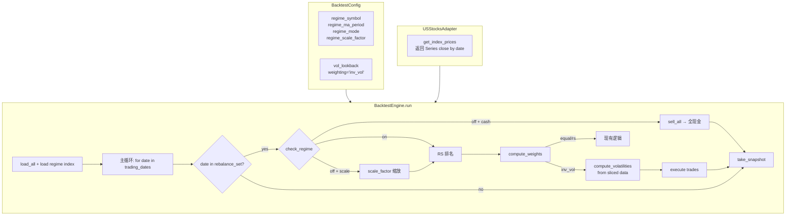
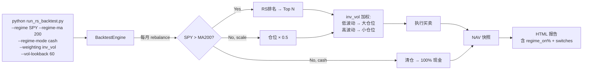

# RS 回测引擎扩展：Regime Filter + Inverse-Vol Weighting

> **For Claude:** REQUIRED SUB-SKILL: Use superpowers:executing-plans to implement this plan task-by-task.

**Confidence: 95%**
**不确定点**: 无 — brainstorming 已锁定所有设计决策
**北极星对齐**: 离线 R&D 层（回测引擎 + 因子研究框架）— 增强回测引擎的策略维度

**Goal:** 在现有 RS 回测引擎上增加 regime filter（指数 > MA 时才做多）和 inverse-vol 加权（按波动率倒数分配仓位），使回测能测试 momentum + regime + vol-targeted 组合策略。

**Tech Stack:** Python, pandas, numpy, existing backtest framework

---

## Architecture（架构图）



> 新增部分用粗箭头：Config 增加 regime + vol 参数 → Engine 在 rebalance 时先检查 regime → Rebalancer 支持 inv_vol 权重。数据流不变，只在决策层加入两个过滤器。

## Business Flow（业务流程图）



> 用户通过 CLI 传入 regime 和 weighting 参数，引擎每月检查 regime 状态，regime on 正常选股+inv_vol 定仓，regime off 按模式清仓或缩放。

## Alternatives Considered（替代方案）

| 方案 | 优势 | 劣势 | 选择理由 |
|------|------|------|----------|
| **A: 扩展现有 Engine（推荐）** | 最少代码变更，复用全部现有基建（adapter/portfolio/metrics/report） | Engine 方法变长 | 选择：改动集中在 3 个文件，无架构风险 |
| B: 新建 RegimeEngine 子类 | 隔离性好，不影响原有逻辑 | 重复代码多，维护两个引擎 | 不选：过度工程化，原 Engine 设计已支持扩展 |

## Risks & Mitigation（风险自证）

- **最大风险:** regime index (SPY) 数据在 market.db 中可能缺失或不完整 → 用 `get_benchmark_nav()` 已验证 SPY 数据可用（adapter 里有）
- **为什么不用更简单的做法:** 不能更简单了 — 3 个文件各加一个 feature，复用全部现有基建
- **回滚方案:** 所有新字段有默认值（regime_symbol=None, weighting="equal"），不传参 = 原有行为完全不变

## Acceptance Criteria（验收标准）

- [ ] `--regime SPY --regime-mode cash` 回测能跑通，regime off 期间持仓为零
- [ ] `--regime SPY --regime-mode scale --regime-scale 0.5` 回测能跑通，regime off 期间仓位减半
- [ ] `--weighting inv_vol --vol-lookback 60` 回测能跑通，低波动股票权重 > 高波动股票
- [ ] 不传 regime/inv_vol 参数时，行为和改动前完全一致
- [ ] HTML 报告显示 regime 统计（regime_on%, n_switches）
- [ ] 所有现有测试仍然通过
- [ ] 新增测试覆盖 regime cash/scale + inv_vol weighting

---

## Implementation Tasks

### Task 1: BacktestConfig 新增字段

**Files:**
- Modify: `backtest/config.py:10-26` (BacktestConfig dataclass)
- Modify: `backtest/config.py:28-42` (label method)
- Test: `tests/test_backtest/test_engine.py` (label test 已有)

**Step 1: 修改 BacktestConfig dataclass**

在 `backtest/config.py` 的 `BacktestConfig` 中，`rebalance_held` 之后、`mcap_threshold` 之前，新增字段：

```python
    # Regime filter
    regime_symbol: Optional[str] = None           # e.g. "SPY"; None = disabled
    regime_ma_period: int = 200                   # SMA period for regime check
    regime_mode: Literal["cash", "scale"] = "cash"  # cash=清仓, scale=缩放
    regime_scale_factor: float = 0.5              # scale 模式下的缩放系数
    # Vol-targeted sizing
    vol_lookback: int = 60                        # inv_vol 波动率回看天数
```

注意 `weighting` 字段已有，需扩展 Literal 类型：
```python
    weighting: Literal["equal", "rs_weighted", "inv_vol"] = "equal"
```

**Step 2: 更新 label() 方法**

在现有 `base` 字符串后追加 regime 和 vol 信息：

```python
    def label(self) -> str:
        rb = "eqw" if self.rebalance_held else "drift"
        base = (
            f"{self.market}_{self.rs_method}_top{self.top_n}"
            f"_{self.rebalance_freq}_buf{self.sell_buffer}_{rb}"
        )
        if self.weighting != "equal":
            base += f"_{self.weighting}"
            if self.weighting == "inv_vol":
                base += f"{self.vol_lookback}"
        if self.regime_symbol:
            base += f"_regime{self.regime_ma_period}_{self.regime_mode}"
        if self.mcap_threshold:
            base += f"_mcap{self.mcap_threshold:.0e}"
        return base
```

**Step 3: 写测试验证 label**

在 `tests/test_backtest/test_engine.py` 末尾添加：

```python
    def test_label_with_regime_and_invvol(self):
        config = BacktestConfig(
            market="us_stocks", rs_method="B", top_n=10,
            rebalance_freq="M", sell_buffer=5,
            weighting="inv_vol", vol_lookback=60,
            regime_symbol="SPY", regime_ma_period=200, regime_mode="cash",
        )
        label = config.label()
        assert "inv_vol60" in label
        assert "regime200_cash" in label
```

**Step 4: 运行测试**

```bash
cd "/Users/owen/CC workspace/Finance"
.venv/bin/python -m pytest tests/test_backtest/test_engine.py -v
```

Expected: 全部 PASS（含新 test）

**Step 5: Commit**

```bash
git add backtest/config.py tests/test_backtest/test_engine.py
git commit -m "feat(backtest): add regime filter + inv_vol config fields"
```

---

### Task 2: USStocksAdapter.get_index_prices()

**Files:**
- Modify: `backtest/adapters/us_stocks.py:86-104` (在 get_benchmark_nav 后添加)
- Test: `tests/test_backtest/test_adapters.py`

**Step 1: 添加 get_index_prices 方法**

在 `USStocksAdapter` 中，`get_benchmark_nav` 之后添加：

```python
    def get_index_prices(self, symbol: str = "SPY") -> pd.Series:
        """
        获取指数的收盘价 Series (用于 regime filter)

        Args:
            symbol: 指数代码 (e.g. "SPY")

        Returns:
            pd.Series, index=date_str, values=close_price
            空 Series 如果数据不可用
        """
        df = self._load_prices(symbol)
        if df is None or df.empty:
            logger.warning(f"Regime index {symbol} 数据不可用")
            return pd.Series(dtype=float)
        s = df.set_index(df["date"].astype(str))["close"].astype(float)
        return s[~s.index.duplicated(keep="last")].sort_index()
```

**Step 2: 写测试**

需要了解现有 test_adapters.py 的 mock 模式。如果 test 需要 mock market.db，参照现有 mock 模式。简单测试：

```python
def test_get_index_prices_returns_series(mock_adapter):
    """get_index_prices 返回 pd.Series"""
    # mock_adapter 已有合成数据
    series = mock_adapter.get_index_prices("SPY")
    # MockAdapter 可能没有 SPY，测试空 fallback
    assert isinstance(series, pd.Series)
```

> 注意: 如果现有 test_adapters.py 使用真实 DB，则用 `@pytest.mark.skipif` 或 mock。根据实际文件决定。

**Step 3: 运行测试**

```bash
.venv/bin/python -m pytest tests/test_backtest/test_adapters.py -v
```

**Step 4: Commit**

```bash
git add backtest/adapters/us_stocks.py tests/test_backtest/test_adapters.py
git commit -m "feat(adapter): add get_index_prices for regime filter"
```

---

### Task 3: Rebalancer.compute_weights() 支持 inv_vol

**Files:**
- Modify: `backtest/rebalancer.py:111-144` (compute_weights 方法)
- Test: `tests/test_backtest/test_rebalancer.py`

**Step 1: 写 failing test**

在 `tests/test_backtest/test_rebalancer.py` 添加：

```python
class TestInvVolWeighting:
    """Inverse-volatility 加权"""

    def test_inv_vol_basic(self):
        """低波动股票权重更高"""
        r = Rebalancer(top_n=3)
        rs = _make_rs_df([("A", 99), ("B", 90), ("C", 80)])
        action = r.compute(rs, set())

        # A=10% vol, B=20% vol, C=40% vol
        volatilities = {"A": 0.10, "B": 0.20, "C": 0.40}
        weights = r.compute_weights(action, rs, "inv_vol", volatilities=volatilities)

        assert len(weights) == 3
        assert abs(sum(weights.values()) - 1.0) < 1e-9
        # A 波动最低 → 权重最高
        assert weights["A"] > weights["B"] > weights["C"]

    def test_inv_vol_equal_vols(self):
        """等波动率 → 等权重"""
        r = Rebalancer(top_n=2)
        rs = _make_rs_df([("A", 99), ("B", 90)])
        action = r.compute(rs, set())

        volatilities = {"A": 0.20, "B": 0.20}
        weights = r.compute_weights(action, rs, "inv_vol", volatilities=volatilities)

        assert abs(weights["A"] - weights["B"]) < 1e-9

    def test_inv_vol_missing_vol_fallback(self):
        """某只股票无波动率数据 → 用等权 fallback"""
        r = Rebalancer(top_n=2)
        rs = _make_rs_df([("A", 99), ("B", 90)])
        action = r.compute(rs, set())

        # B 没有波动率数据
        volatilities = {"A": 0.20}
        weights = r.compute_weights(action, rs, "inv_vol", volatilities=volatilities)

        assert len(weights) == 2
        assert abs(sum(weights.values()) - 1.0) < 1e-9

    def test_inv_vol_zero_vol_capped(self):
        """零波动率 → 不会除零"""
        r = Rebalancer(top_n=2)
        rs = _make_rs_df([("A", 99), ("B", 90)])
        action = r.compute(rs, set())

        volatilities = {"A": 0.0, "B": 0.20}
        weights = r.compute_weights(action, rs, "inv_vol", volatilities=volatilities)

        assert len(weights) == 2
        assert abs(sum(weights.values()) - 1.0) < 1e-9
```

**Step 2: 运行确认 fail**

```bash
.venv/bin/python -m pytest tests/test_backtest/test_rebalancer.py::TestInvVolWeighting -v
```

Expected: FAIL (signature 不匹配或 branch 不存在)

**Step 3: 实现 inv_vol 分支**

修改 `backtest/rebalancer.py` 的 `compute_weights` 签名和实现：

```python
    def compute_weights(
        self,
        action: RebalanceAction,
        rs_df: pd.DataFrame,
        weighting: str = "equal",
        volatilities: Dict[str, float] | None = None,
    ) -> Dict[str, float]:
        """
        计算目标权重

        Args:
            action: RebalanceAction
            rs_df: RS 排名数据
            weighting: "equal", "rs_weighted", 或 "inv_vol"
            volatilities: {symbol: annualized_vol} — inv_vol 模式需要

        Returns:
            {symbol: target_weight} — 权重和为 1.0
        """
        target_symbols = action.to_hold + action.to_buy
        if not target_symbols:
            return {}

        if weighting == "equal":
            w = 1.0 / len(target_symbols)
            return {sym: w for sym in target_symbols}

        if weighting == "inv_vol":
            return self._inv_vol_weights(target_symbols, volatilities)

        # RS 加权: 用 rs_rank 作为权重
        rs_map = dict(zip(rs_df["symbol"], rs_df["rs_rank"]))
        raw_weights = {sym: max(rs_map.get(sym, 0), 1) for sym in target_symbols}
        total = sum(raw_weights.values())
        if total <= 0:
            w = 1.0 / len(target_symbols)
            return {sym: w for sym in target_symbols}

        return {sym: w / total for sym, w in raw_weights.items()}

    def _inv_vol_weights(
        self,
        symbols: List[str],
        volatilities: Dict[str, float] | None,
    ) -> Dict[str, float]:
        """Inverse-volatility 加权，缺失 vol 的用中位数替代"""
        if not volatilities:
            w = 1.0 / len(symbols)
            return {sym: w for sym in symbols}

        # 收集有效 vol 值
        valid_vols = {s: v for s, v in volatilities.items() if s in symbols and v > 0}

        if not valid_vols:
            w = 1.0 / len(symbols)
            return {sym: w for sym in symbols}

        # 缺失 vol 的用中位数替代
        median_vol = sorted(valid_vols.values())[len(valid_vols) // 2]
        all_vols = {}
        for sym in symbols:
            vol = valid_vols.get(sym, median_vol)
            all_vols[sym] = max(vol, 0.001)  # floor 防除零

        inv = {sym: 1.0 / v for sym, v in all_vols.items()}
        total = sum(inv.values())
        return {sym: w / total for sym, w in inv.items()}
```

**Step 4: 运行测试**

```bash
.venv/bin/python -m pytest tests/test_backtest/test_rebalancer.py -v
```

Expected: 全部 PASS

**Step 5: Commit**

```bash
git add backtest/rebalancer.py tests/test_backtest/test_rebalancer.py
git commit -m "feat(rebalancer): add inv_vol weighting with median fallback"
```

---

### Task 4: Engine — regime filter + vol computation + 调用 inv_vol

**Files:**
- Modify: `backtest/engine.py` (核心改动)
- Test: `tests/test_backtest/test_engine.py`

**Step 1: 写 failing tests**

在 `tests/test_backtest/test_engine.py` 添加：

```python
class TestRegimeFilter:
    """Regime filter 测试"""

    def _make_regime_adapter(self, regime_on_dates, regime_off_dates):
        """
        创建带 regime index 的 MockAdapter

        regime_on 期间 index=200, regime_off 期间 index=50
        (MA200=100 作为分界线)
        """
        base = MockAdapter()
        all_dates = base.get_trading_dates()

        # 构造 index 价格: 前半段 200 (regime on), 后半段 50 (regime off)
        mid = len(all_dates) // 2
        index_prices = []
        for i, d in enumerate(all_dates):
            price = 200.0 if i < mid else 50.0
            index_prices.append(price)

        import pandas as pd
        index_series = pd.Series(index_prices, index=all_dates)
        base.get_index_prices = lambda sym="SPY": index_series
        return base

    def test_regime_cash_no_holdings_when_off(self):
        """regime_mode=cash: regime off 期间持仓为零"""
        adapter = MockAdapter()
        dates = adapter.get_trading_dates()
        mid = len(dates) // 2

        # 构造 regime index: 前半高 (on), 后半低 (off)
        import pandas as pd
        index_vals = [200.0] * mid + [50.0] * (len(dates) - mid)
        index_series = pd.Series(index_vals, index=dates)
        adapter.get_index_prices = lambda sym="SPY": index_series

        config = BacktestConfig(
            market="us_stocks", rs_method="B", top_n=3,
            rebalance_freq="M", initial_capital=1_000_000,
            regime_symbol="SPY", regime_ma_period=50,  # 短周期方便测试
            regime_mode="cash",
        )
        engine = BacktestEngine(config, adapter=adapter)
        metrics = engine.run()

        # 后半段 regime off → 应该有清仓操作
        assert metrics.n_days > 0
        # 检查最后的 snapshot: 后半段应该全在现金
        late_snapshots = [s for s in engine.portfolio.snapshots
                         if s.date >= dates[mid + 60]]  # MA 需要回看期
        if late_snapshots:
            for snap in late_snapshots[-5:]:
                assert snap.n_holdings == 0, f"{snap.date}: 应该清仓但有 {snap.n_holdings} 只持仓"

    def test_regime_scale_with_drift_still_reduces(self):
        """P2 fix: regime_mode=scale + rebalance_held=False 仍然缩减已有持仓"""
        adapter = MockAdapter()
        dates = adapter.get_trading_dates()

        # regime 全程 off (index 远低于 MA)
        import pandas as pd
        index_series = pd.Series([30.0] * len(dates), index=dates)
        adapter.get_index_prices = lambda sym="SPY": index_series

        config = BacktestConfig(
            market="us_stocks", rs_method="B", top_n=3,
            rebalance_freq="M", initial_capital=1_000_000,
            regime_symbol="SPY", regime_ma_period=10,
            regime_mode="scale", regime_scale_factor=0.5,
            rebalance_held=False,  # drift mode — the edge case
        )
        engine = BacktestEngine(config, adapter=adapter)
        metrics = engine.run()

        # 如果 P2 fix 生效，portfolio 应该只用 ~50% 资金
        # 检查: 后期 snapshots 的 cash 应该 > 40% of NAV
        late = engine.portfolio.snapshots[-5:]
        for snap in late:
            cash_pct = snap.cash / snap.nav if snap.nav > 0 else 0
            assert cash_pct > 0.3, (
                f"{snap.date}: scale 0.5 但 cash 只有 {cash_pct:.1%}, "
                f"drift mode 下 to_hold 没被调整"
            )

    def test_regime_disabled_by_default(self):
        """不传 regime_symbol → 行为不变"""
        config = BacktestConfig(
            market="us_stocks", rs_method="B", top_n=3,
            rebalance_freq="M", initial_capital=1_000_000,
        )
        adapter = MockAdapter()
        engine = BacktestEngine(config, adapter=adapter)
        metrics = engine.run()
        assert metrics.n_days > 0
        assert metrics.n_trades > 0


class TestInvVolEngine:
    """Inverse-vol weighting 引擎集成测试"""

    def test_invvol_runs(self):
        """inv_vol 回测能跑通"""
        config = BacktestConfig(
            market="us_stocks", rs_method="B", top_n=3,
            rebalance_freq="M", initial_capital=1_000_000,
            weighting="inv_vol", vol_lookback=60,
        )
        adapter = MockAdapter()
        engine = BacktestEngine(config, adapter=adapter)
        metrics = engine.run()

        assert metrics.n_days > 0
        assert metrics.n_trades > 0

    def test_invvol_vs_equal_different_nav(self):
        """inv_vol 和 equal weight 产生不同的 NAV 轨迹"""
        common = dict(
            market="us_stocks", rs_method="B", top_n=3,
            rebalance_freq="M", initial_capital=1_000_000,
            transaction_cost_bps=0,
        )
        adapter = MockAdapter()

        config_eq = BacktestConfig(**common, weighting="equal")
        engine_eq = BacktestEngine(config_eq, adapter=MockAdapter())
        metrics_eq = engine_eq.run()

        config_iv = BacktestConfig(**common, weighting="inv_vol", vol_lookback=60)
        engine_iv = BacktestEngine(config_iv, adapter=MockAdapter())
        metrics_iv = engine_iv.run()

        # NAV 应该不同 (除非极端巧合)
        assert metrics_eq.total_return != metrics_iv.total_return
```

**Step 2: 运行确认 fail**

```bash
.venv/bin/python -m pytest tests/test_backtest/test_engine.py::TestRegimeFilter -v
.venv/bin/python -m pytest tests/test_backtest/test_engine.py::TestInvVolEngine -v
```

**Step 3: 实现 Engine 改动**

修改 `backtest/engine.py`:

**3a: `__init__` 中加载 regime index**

```python
    def __init__(self, config: BacktestConfig, adapter=None):
        # ... 现有代码 ...

        # Regime filter: 加载 index 价格
        self._regime_index = None
        if config.regime_symbol and hasattr(adapter, 'get_index_prices'):
            self._regime_index = adapter.get_index_prices(config.regime_symbol)
            if self._regime_index.empty:
                logger.warning(f"Regime index {config.regime_symbol} 无数据, regime filter 禁用")
                self._regime_index = None

        # Regime 统计
        self._regime_on_count = 0
        self._regime_off_count = 0
        self._regime_switches = 0
        self._last_regime_state = None
```

**3b: `_check_regime` 方法**

```python
    def _check_regime(self, date: str) -> bool:
        """
        检查 regime 状态: index close > SMA(regime_ma_period)

        Returns:
            True = regime on (做多), False = regime off
        """
        if self._regime_index is None:
            return True

        # 截取到 date 的 index 数据
        mask = self._regime_index.index <= date
        sliced = self._regime_index[mask]

        if len(sliced) < self.config.regime_ma_period:
            # 数据不足，默认 regime on
            return True

        ma = sliced.iloc[-self.config.regime_ma_period:].mean()
        current = sliced.iloc[-1]
        return current > ma
```

**3c: `_compute_volatilities` 方法**

```python
    def _compute_volatilities(
        self, sliced: dict, lookback: int
    ) -> dict:
        """
        计算各股票的年化波动率

        Args:
            sliced: {symbol: price_df} — 已截取到当日
            lookback: 回看天数

        Returns:
            {symbol: annualized_vol}
        """
        import numpy as np
        vols = {}
        for sym, df in sliced.items():
            if len(df) < lookback + 1:
                continue
            closes = df["close"].astype(float).values[-lookback:]
            returns = np.diff(closes) / closes[:-1]
            if len(returns) > 1:
                vols[sym] = float(np.std(returns, ddof=1) * np.sqrt(252))
        return vols
```

**3d: 修改 `_rebalance` 方法**

在现有 `_rebalance` 开头加入 regime 检查，在 weights 计算时传入 volatilities:

```python
    def _rebalance(self, date: str, current_prices: dict):
        """执行单次换仓"""
        self._rebalance_count += 1

        # ── Regime check ──
        regime_on = self._check_regime(date)

        # 统计
        if regime_on:
            self._regime_on_count += 1
        else:
            self._regime_off_count += 1
        if self._last_regime_state is not None and regime_on != self._last_regime_state:
            self._regime_switches += 1
        self._last_regime_state = regime_on

        if not regime_on and self.config.regime_mode == "cash":
            # 清仓所有持仓
            for sym in list(self.portfolio.holdings.keys()):
                price = current_prices.get(sym)
                if price and price > 0:
                    shares = self.portfolio.holdings.get(sym, 0)
                    if shares > 0:
                        self._turnover_notional += shares * price
                        self.portfolio.sell_all(sym, price, date)
            return

        # 防前视: 只截取到当日
        sliced = self.adapter.slice_to_date(date)

        # 计算 RS 排名
        rs_df = self._rs_func(sliced)

        if rs_df.empty:
            logger.debug(f"{date}: RS 计算无结果, 跳过换仓")
            return

        # 计算换仓操作
        current_holdings = set(self.portfolio.holdings.keys())
        action = self.rebalancer.compute(rs_df, current_holdings)

        # 计算目标权重
        volatilities = None
        if self.config.weighting == "inv_vol":
            volatilities = self._compute_volatilities(sliced, self.config.vol_lookback)

        weights = self.rebalancer.compute_weights(
            action, rs_df, self.config.weighting, volatilities=volatilities
        )

        # Regime scale 模式: 缩放权重 + 强制调整所有持仓
        regime_scale_active = not regime_on and self.config.regime_mode == "scale"
        if regime_scale_active:
            weights = {sym: w * self.config.regime_scale_factor for sym, w in weights.items()}

        # ... 以下执行卖出/买入逻辑，但 adjust_symbols 需要修改 ...
        # 原逻辑:
        #   adjust_symbols = to_hold + to_buy if rebalance_held else to_buy
        # P2 fix: regime scale 期间必须调整所有持仓（包括 to_hold），
        # 否则 drift 模式下已有持仓不会被缩减
        adjust_symbols = (
            action.to_hold + action.to_buy
            if self.config.rebalance_held or regime_scale_active
            else action.to_buy
        )
```

**Step 4: 运行测试**

```bash
.venv/bin/python -m pytest tests/test_backtest/test_engine.py -v
```

Expected: 全部 PASS

**Step 5: Commit**

```bash
git add backtest/engine.py tests/test_backtest/test_engine.py
git commit -m "feat(engine): regime filter (cash/scale) + inv_vol vol computation"
```

---

### Task 5: MockAdapter 补 get_index_prices + 引擎 regime 统计暴露

**Files:**
- Modify: `tests/test_backtest/test_engine.py` (MockAdapter 增强)
- Modify: `backtest/engine.py` (暴露 regime 统计属性)

**Step 1: MockAdapter 添加 get_index_prices**

在 `test_engine.py` 的 `MockAdapter` 中添加：

```python
    def get_index_prices(self, symbol="SPY"):
        """用第一只合成股票做 regime index"""
        import pandas as pd
        first = list(self._data.values())[0]
        return pd.Series(
            first["close"].astype(float).values,
            index=first["date"].astype(str).values,
        )
```

**Step 2: Engine 暴露 regime 统计**

在 `engine.py` 添加属性：

```python
    @property
    def regime_stats(self) -> dict:
        """Regime filter 统计"""
        total = self._regime_on_count + self._regime_off_count
        return {
            "regime_on_pct": self._regime_on_count / total if total > 0 else 1.0,
            "regime_off_pct": self._regime_off_count / total if total > 0 else 0.0,
            "n_switches": self._regime_switches,
            "n_rebalances_on": self._regime_on_count,
            "n_rebalances_off": self._regime_off_count,
        }
```

**Step 3: Commit**

```bash
git add backtest/engine.py tests/test_backtest/test_engine.py
git commit -m "feat(engine): expose regime_stats + MockAdapter.get_index_prices"
```

---

### Task 6: CLI 参数 + HTML 报告 regime 统计

**Files:**
- Modify: `scripts/run_rs_backtest.py:187-219` (argparse)
- Modify: `backtest/report.py:105-280` (HTML regime stats section)

**Step 1: CLI 参数**

在 `run_rs_backtest.py` 的 argparse 中添加：

```python
    parser.add_argument("--regime", type=str, default=None, metavar="SYMBOL",
                        help="Regime filter index symbol (e.g. SPY)")
    parser.add_argument("--regime-ma", type=int, default=200,
                        help="Regime MA period (default: 200)")
    parser.add_argument("--regime-mode", choices=["cash", "scale"], default="cash",
                        help="Regime off behavior: cash (清仓) or scale (缩放)")
    parser.add_argument("--regime-scale", type=float, default=0.5,
                        help="Scale factor when regime off (default: 0.5)")
    parser.add_argument("--vol-lookback", type=int, default=60,
                        help="Volatility lookback days for inv_vol weighting (default: 60)")
```

在 `run_single` 的 factory 调用中传入新参数：

```python
    config = factory(
        rs_method=args.method,
        top_n=args.top_n,
        rebalance_freq=args.freq,
        sell_buffer=args.buffer,
        weighting=args.weighting,
        start_date=args.start_date,
        end_date=args.end_date,
        regime_symbol=args.regime,
        regime_ma_period=args.regime_ma,
        regime_mode=args.regime_mode,
        regime_scale_factor=args.regime_scale,
        vol_lookback=args.vol_lookback,
    )
```

`--weighting` choices 需要扩展：
```python
    parser.add_argument("--weighting", choices=["equal", "rs_weighted", "inv_vol"], default="equal")
```

**Step 2: HTML 报告加 regime 统计**

在 `backtest/report.py` 的 `generate_html_report` 中：

添加参数 `regime_stats: Optional[dict] = None`

在 config div 之后、metric-grid 之前插入 regime 信息：

```python
    regime_html = ""
    if regime_stats:
        regime_html = f"""
    <div class="config">
        <strong>Regime Filter:</strong>
        {config.regime_symbol} > MA{config.regime_ma_period} |
        模式={config.regime_mode} |
        Regime On: {regime_stats['regime_on_pct']:.1%} |
        Switches: {regime_stats['n_switches']}
    </div>"""
```

**Step 3: `run_single` 传入 regime_stats**

```python
    html = generate_html_report(
        nav_series=engine.portfolio.nav_series(),
        benchmark_nav=benchmark_nav,
        metrics=metrics,
        config=config,
        regime_stats=engine.regime_stats if config.regime_symbol else None,
    )
```

**Step 4: 手动测试 CLI**

```bash
cd "/Users/owen/CC workspace/Finance"
.venv/bin/python scripts/run_rs_backtest.py \
    --market us_stocks --method B --top-n 10 --freq M \
    --regime SPY --regime-mode cash \
    --weighting inv_vol --vol-lookback 60 \
    --html
```

Expected: 正常输出指标 + 生成 HTML 报告

**Step 5: Commit**

```bash
git add scripts/run_rs_backtest.py backtest/report.py
git commit -m "feat(cli): add --regime + --vol-lookback flags, regime stats in HTML report"
```

---

### Task 7: 全量回归测试 + 无参数兼容性验证

**Step 1: 跑全量测试**

```bash
.venv/bin/python -m pytest tests/test_backtest/ -v
```

Expected: 全部 PASS

**Step 2: 无参数兼容性 — 确认原有行为不变**

```bash
# 不传任何新参数 → 应与改动前完全一致
.venv/bin/python scripts/run_rs_backtest.py --market us_stocks --method B --top-n 10 --freq M
```

**Step 3: 跑一次完整对比**

```bash
# 1) 基线: equal weight, no regime
.venv/bin/python scripts/run_rs_backtest.py --method B --top-n 10 --freq M --html

# 2) Regime cash
.venv/bin/python scripts/run_rs_backtest.py --method B --top-n 10 --freq M --regime SPY --regime-mode cash --html

# 3) Regime scale
.venv/bin/python scripts/run_rs_backtest.py --method B --top-n 10 --freq M --regime SPY --regime-mode scale --regime-scale 0.5 --html

# 4) Inv-vol + regime
.venv/bin/python scripts/run_rs_backtest.py --method B --top-n 10 --freq M --regime SPY --weighting inv_vol --vol-lookback 60 --html
```

**Step 4: Final commit**

```bash
git commit --allow-empty -m "test: regime filter + inv_vol weighting all scenarios verified"
```
