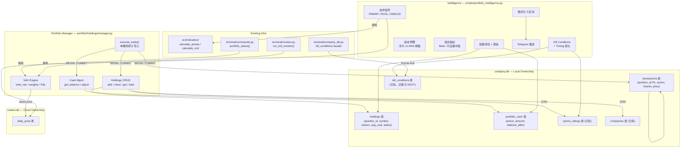

# Portfolio Intelligence 实现计划

> **For Claude:** REQUIRED SUB-SKILL: Use superpowers:executing-plans to implement this plan task-by-task.

**Confidence: 88%**
**不确定点**: Boss 初始持仓数据格式待确认（ticker/shares/avg_cost/date 列表）
**北极星对齐**: CIO 层（第四层）— 组合构建 + 行为纠偏。本 plan 实现 CIO 层的前置基础：持仓感知 + 持仓级情报推送。无真实持仓数据，CIO 层无法运作。

**Goal:** 让系统知道真实持仓，每日推送持仓级技术/基本面/风险信号到 Telegram

**Tech Stack:** Python + SQLite (company.db 新表) + 现有指标引擎 (PMARP/RVOL) + Telegram Bot API

**设计文档:** `docs/plans/2026-04-02-portfolio-intelligence-design.md`（已通过 2 轮 review）

**Review round 3 修复 (2026-04-02):**
- [P1-1] Manager 保留模块级 shim 函数，benchmark/review.py 等 Phase 2 调用方零改动
- [P1-2] 价格获取修正为 `from src.data.price_fetcher import get_price_df`
- [P1-3] auto-push 从 execute_trade() 移到 /trade skill 层（manager 不知道 sync 脚本）
- [P2-4] /trade skill 放 `.claude/commands/trade.md`（项目级，在 repo 内）
- [P2-5] cron 追加改用 dump→edit→install 安全模式

**Review round 4 修复 (2026-04-03):**
- [P1-6] `get_price_df()` 返回降序 — 最新价用 `iloc[0]` 不是 `iloc[-1]`
- [P2-7] `portfolio_status()` 必须保留 `company_db` + `analysis_freshness` section
- [P2-8] `get_portfolio_summary()` 返回 `[p.to_dict()]` 不是原始 Position 对象
- [meta] Task 1.3 集成测试需验证 `portfolio_status()` / `run_full_monitor()` 的完整输出契约

**Review round 5 修复 (2026-04-03):**
- [P1-9] shim `_fetch_latest_prices()` 保持 `max_age_days=0`，不弱化现有 refresh 语义
- [P1-10] `run_full_monitor()` 新增 `total_nav` 时，必须同步修改 `MonitorReport` dataclass + `to_dict()`
- [P2-11] Task 1.3 测试不再“模拟 terminal 输出”，而是直接调用 `terminal.commands.portfolio_status()` / `terminal.monitor.run_full_monitor()`
- [P2-12] `/trade` 与 `sync_to_cloud.sh` / `data_guardian.snapshot()` 共用统一锁语义：SQLite transaction 保证库内原子性，文件锁负责串行化 raw DB copy / push

---

## Architecture



> **一句话**：manager.py 从 JSON 迁移到 SQLite，通过 3 张新表管理持仓/交易/现金；Intelligence 脚本读已有数据基建 + 新持仓表，聚合后推 Telegram。

## Business Flow

```mermaid
flowchart TD
    subgraph "交易录入 /trade"
        A["/trade NVDA BUY 100@135"] --> B["解析 action / ticker / shares / price"]
        B --> C["查 holdings WHERE status=OPEN"]
        C --> D["计算 post-trade weight vs DNA cap"]
        D --> E["展示确认摘要<br/>(均价/仓位/NAV)"]
        E --> F{"Boss 确认?"}
        F -->|Yes| G["BEGIN TRANSACTION"]
        G --> H["INSERT transactions"]
        H --> I["UPSERT holdings<br/>(新开仓 or 更新 shares/avg_cost)"]
        I --> J["INSERT portfolio_cash<br/>(BUY→WITHDRAW / SELL→DEPOSIT)"]
        J --> K["COMMIT"]
        K --> L["auto-push company.db → 云端"]
        F -->|No| M["取消"]
    end

    subgraph "每日情报 22:00 SGT"
        N["cron 触发"] --> O["SELECT holdings WHERE OPEN"]
        O --> P["SELECT latest cash balance"]
        P --> Q["JOIN daily_price → 计算 NAV + weights + P&L"]
        Q --> R["逐只: PMARP / RVOL / EMA120"]
        R --> S["逐只: 浮亏 vs DNA 阈值"]
        S --> T["组合级: QQQ Beta + 行业集中度"]
        T --> U["查 kill_conditions + oprms timing diff"]
        U --> V["格式化 3 区块报告"]
        V --> W["Telegram 推送"]
    end
```



> **一句话**：交易通过 `/trade` 原子写入 3 表；情报脚本每日 22:00 读持仓 + 市场数据，计算信号后推 Telegram。

---

## Alternatives Considered

| 方案 | 优势 | 劣势 | 决策 |
|------|------|------|------|
| **A: SQLite 新表 in company.db（推荐）** | 复用现有 CompanyStore 连接管理 + WAL；holdings JOIN oprms/companies 高效；sync 流程已有 | 新表增加 company.db 复杂度 | **选择**：JOIN 是核心需求，JSON 做不到 |
| B: 独立 portfolio.db | 隔离，不影响现有 company.db | 新增 DB 文件 + 连接管理 + sync 脚本改动；跨库 JOIN 不可能 | 不选：JOIN companies/oprms 是硬需求 |
| **Intelligence: 编排脚本复用已有基建（推荐）** | 零新依赖，指标引擎 + Telegram 已验证 | 耦合现有脚本 | **选择**：不重复造轮子 |
| Intelligence: 独立微服务 | 解耦 | 过度工程化，一个人的交易台不需要 | 不选 |

## Risks & Mitigation

- **最大风险:** `/trade` 写入 3 表非原子 → 持仓/现金不一致。**缓解:** 单个 SQLite transaction + 失败 rollback。
- **为什么不用更简单的做法（JSON）:** holdings 需要 JOIN companies + oprms_ratings 做 enrichment，JSON 无法做 JOIN。设计文档已论证。
- **回滚方案:** 所有改动在 company.db（本地所有权）。`data_guardian.snapshot()` 可随时回滚。新表用 migration 添加，不破坏现有表。

## Acceptance Criteria

- [ ] `load_holdings()` 返回的 Position 包含正确的 OPRMS 评级、公司信息（从 companies/oprms 表 JOIN）
- [ ] 同一 ticker 清仓后再买，生成新 `position_id`，且任意时刻只有 1 行 OPEN
- [ ] `/trade` 一次提交同时更新 holdings + transactions + cash；模拟任一步失败，3 表均不变
- [ ] `portfolio_status()` / `run_full_monitor()` / Intelligence 三处的 total_NAV、cash_pct、invested_pct 一致
- [ ] `company_db.get_kill_conditions()` 返回 SQLite 数据（JSON 仍存在但不再是 SSOT）
- [ ] `sync_to_cloud.sh --push` 和 `data_guardian.snapshot()` 前自动 checkpoint company.db
- [ ] Intelligence 脚本本地运行输出 3 区块格式的 Telegram 消息（行动信号 / 组合概览 / Kill Conditions）
- [ ] 云端 22:00 SGT cron 成功推送 Telegram

---

## Phase 0: 基础设施前置

### Task 0.1: Portfolio 新表 + CompanyStore 数据访问方法

**北极星:** CIO 层前置 — 持仓数据存储

**Files:**
- Modify: `terminal/company_store.py` — _SCHEMA + migration + 新方法
- Create: `tests/test_portfolio_store.py`

**Step 1: 写测试**

```python
# tests/test_portfolio_store.py
"""Tests for portfolio tables in CompanyStore."""
import pytest
from terminal.company_store import CompanyStore


@pytest.fixture
def store(tmp_path):
    db_path = tmp_path / "test_company.db"
    s = CompanyStore(db_path=db_path)
    # Seed a company for FK
    s.upsert_company("NVDA", company_name="NVIDIA", sector="Technology")
    yield s
    s.close()


class TestHoldings:
    def test_insert_and_get(self, store):
        pid = store.insert_holding("NVDA", shares=100, avg_cost=135.0, open_date="2026-04-01")
        assert pid > 0
        h = store.get_open_holding("NVDA")
        assert h is not None
        assert h["shares"] == 100
        assert h["avg_cost"] == 135.0
        assert h["status"] == "OPEN"

    def test_no_duplicate_open(self, store):
        store.insert_holding("NVDA", shares=100, avg_cost=135.0, open_date="2026-04-01")
        with pytest.raises(Exception):  # UNIQUE constraint
            store.insert_holding("NVDA", shares=50, avg_cost=140.0, open_date="2026-04-02")

    def test_close_and_reopen(self, store):
        pid1 = store.insert_holding("NVDA", shares=100, avg_cost=135.0, open_date="2026-04-01")
        store.close_holding(pid1, close_date="2026-04-05", realized_pnl=500.0)

        # Closed — no open holding
        assert store.get_open_holding("NVDA") is None

        # Can open new position for same symbol
        pid2 = store.insert_holding("NVDA", shares=50, avg_cost=150.0, open_date="2026-04-06")
        assert pid2 != pid1
        assert store.get_open_holding("NVDA") is not None

    def test_update_holding(self, store):
        pid = store.insert_holding("NVDA", shares=100, avg_cost=135.0, open_date="2026-04-01")
        store.update_holding(pid, shares=200, avg_cost=137.5)
        h = store.get_open_holding("NVDA")
        assert h["shares"] == 200
        assert h["avg_cost"] == 137.5

    def test_get_all_open(self, store):
        store.upsert_company("AAPL", company_name="Apple", sector="Technology")
        store.insert_holding("NVDA", shares=100, avg_cost=135.0, open_date="2026-04-01")
        store.insert_holding("AAPL", shares=50, avg_cost=200.0, open_date="2026-04-01")
        holdings = store.get_all_open_holdings()
        assert len(holdings) == 2


class TestTransactions:
    def test_insert_and_query(self, store):
        pid = store.insert_holding("NVDA", shares=100, avg_cost=135.0, open_date="2026-04-01")
        store.insert_transaction(pid, "NVDA", "BUY", shares=100, price=135.0, date="2026-04-01")
        txns = store.get_transactions("NVDA")
        assert len(txns) == 1
        assert txns[0]["action"] == "BUY"
        assert txns[0]["position_id"] == pid

    def test_multiple_transactions(self, store):
        pid = store.insert_holding("NVDA", shares=100, avg_cost=135.0, open_date="2026-04-01")
        store.insert_transaction(pid, "NVDA", "BUY", shares=100, price=135.0, date="2026-04-01")
        store.insert_transaction(pid, "NVDA", "ADD", shares=50, price=140.0, date="2026-04-03")
        txns = store.get_transactions("NVDA")
        assert len(txns) == 2


class TestPortfolioCash:
    def test_set_initial(self, store):
        store.set_cash(500000.0, notes="Initial deposit")
        assert store.get_cash_balance() == 500000.0

    def test_adjust_cash(self, store):
        store.set_cash(500000.0)
        store.adjust_cash(-13500.0, action="WITHDRAW", notes="Buy NVDA 100@135")
        assert store.get_cash_balance() == pytest.approx(486500.0)

    def test_no_cash_returns_zero(self, store):
        assert store.get_cash_balance() == 0.0

    def test_audit_trail(self, store):
        store.set_cash(100000.0)
        store.adjust_cash(-5000.0, action="WITHDRAW")
        store.adjust_cash(3000.0, action="DEPOSIT")
        entries = store.get_cash_history()
        assert len(entries) == 3
        assert entries[-1]["balance_after"] == pytest.approx(98000.0)


class TestCheckpoint:
    def test_checkpoint_company_db(self, store):
        """checkpoint should not raise."""
        store.checkpoint()  # No error = pass
```

**Step 2: 运行测试确认失败**

```bash
cd "/Users/owen/CC workspace/Finance"
python -m pytest tests/test_portfolio_store.py -v 2>&1 | head -40
```

Expected: FAIL — `insert_holding`, `get_open_holding` 等方法不存在

**Step 3: 实现**

在 `terminal/company_store.py` 中：

1. **_SCHEMA 末尾追加 3 张新表**（在 `"""` 结束前）：

```sql
CREATE TABLE IF NOT EXISTS holdings (
    position_id INTEGER PRIMARY KEY AUTOINCREMENT,
    symbol TEXT NOT NULL REFERENCES companies(symbol),
    shares REAL NOT NULL,
    avg_cost REAL NOT NULL,
    open_date TEXT NOT NULL,
    close_date TEXT,
    realized_pnl REAL,
    status TEXT NOT NULL DEFAULT 'OPEN',
    last_updated TEXT NOT NULL
);

CREATE UNIQUE INDEX IF NOT EXISTS idx_holdings_open_symbol
    ON holdings(symbol) WHERE status = 'OPEN';

CREATE TABLE IF NOT EXISTS transactions (
    id INTEGER PRIMARY KEY AUTOINCREMENT,
    position_id INTEGER NOT NULL REFERENCES holdings(position_id),
    symbol TEXT NOT NULL,
    action TEXT NOT NULL,
    shares REAL NOT NULL,
    price REAL NOT NULL,
    date TEXT NOT NULL,
    notes TEXT DEFAULT '',
    created_at TEXT NOT NULL
);

CREATE INDEX IF NOT EXISTS idx_txn_symbol ON transactions(symbol);
CREATE INDEX IF NOT EXISTS idx_txn_position ON transactions(position_id);

CREATE TABLE IF NOT EXISTS portfolio_cash (
    id INTEGER PRIMARY KEY AUTOINCREMENT,
    action TEXT NOT NULL,
    amount REAL NOT NULL,
    balance_after REAL NOT NULL,
    notes TEXT DEFAULT '',
    updated_at TEXT NOT NULL
);
```

2. **_migrate_if_needed() 中追加 Migration 3**（为已有 DB 创建新表）：

```python
# --- Migration 3: Portfolio tables ---
tables = {row[0] for row in conn.execute(
    "SELECT name FROM sqlite_master WHERE type='table'"
)}
if "holdings" not in tables:
    conn.executescript("""
        CREATE TABLE IF NOT EXISTS holdings (
            position_id INTEGER PRIMARY KEY AUTOINCREMENT,
            symbol TEXT NOT NULL REFERENCES companies(symbol),
            shares REAL NOT NULL,
            avg_cost REAL NOT NULL,
            open_date TEXT NOT NULL,
            close_date TEXT,
            realized_pnl REAL,
            status TEXT NOT NULL DEFAULT 'OPEN',
            last_updated TEXT NOT NULL
        );
        CREATE UNIQUE INDEX IF NOT EXISTS idx_holdings_open_symbol
            ON holdings(symbol) WHERE status = 'OPEN';

        CREATE TABLE IF NOT EXISTS transactions (
            id INTEGER PRIMARY KEY AUTOINCREMENT,
            position_id INTEGER NOT NULL REFERENCES holdings(position_id),
            symbol TEXT NOT NULL,
            action TEXT NOT NULL,
            shares REAL NOT NULL,
            price REAL NOT NULL,
            date TEXT NOT NULL,
            notes TEXT DEFAULT '',
            created_at TEXT NOT NULL
        );
        CREATE INDEX IF NOT EXISTS idx_txn_symbol ON transactions(symbol);
        CREATE INDEX IF NOT EXISTS idx_txn_position ON transactions(position_id);

        CREATE TABLE IF NOT EXISTS portfolio_cash (
            id INTEGER PRIMARY KEY AUTOINCREMENT,
            action TEXT NOT NULL,
            amount REAL NOT NULL,
            balance_after REAL NOT NULL,
            notes TEXT DEFAULT '',
            updated_at TEXT NOT NULL
        );
    """)
```

3. **新增数据访问方法**（在 `# ---- Kill Conditions ----` section 之前）：

```python
# ---- Holdings ----

def insert_holding(self, symbol: str, shares: float, avg_cost: float,
                   open_date: str) -> int:
    symbol = symbol.upper()
    now = datetime.now().isoformat()
    conn = self._get_conn()
    cur = conn.execute(
        """INSERT INTO holdings (symbol, shares, avg_cost, open_date, status, last_updated)
           VALUES (?, ?, ?, ?, 'OPEN', ?)""",
        (symbol, shares, avg_cost, open_date, now),
    )
    conn.commit()
    return cur.lastrowid

def get_open_holding(self, symbol: str) -> Optional[Dict[str, Any]]:
    conn = self._get_conn()
    row = conn.execute(
        "SELECT * FROM holdings WHERE symbol = ? AND status = 'OPEN'",
        (symbol.upper(),),
    ).fetchone()
    return dict(row) if row else None

def get_all_open_holdings(self) -> List[Dict[str, Any]]:
    conn = self._get_conn()
    rows = conn.execute(
        "SELECT * FROM holdings WHERE status = 'OPEN' ORDER BY symbol"
    ).fetchall()
    return [dict(r) for r in rows]

def update_holding(self, position_id: int, **kwargs) -> None:
    allowed = {"shares", "avg_cost", "last_updated"}
    fields = {k: v for k, v in kwargs.items() if k in allowed}
    if not fields:
        return
    fields["last_updated"] = datetime.now().isoformat()
    set_clause = ", ".join(f"{k} = ?" for k in fields)
    conn = self._get_conn()
    conn.execute(
        f"UPDATE holdings SET {set_clause} WHERE position_id = ?",
        (*fields.values(), position_id),
    )
    conn.commit()

def close_holding(self, position_id: int, close_date: str,
                  realized_pnl: float) -> None:
    now = datetime.now().isoformat()
    conn = self._get_conn()
    conn.execute(
        """UPDATE holdings SET status = 'CLOSED', close_date = ?,
           realized_pnl = ?, last_updated = ? WHERE position_id = ?""",
        (close_date, realized_pnl, now, position_id),
    )
    conn.commit()

# ---- Transactions ----

def insert_transaction(self, position_id: int, symbol: str, action: str,
                       shares: float, price: float, date: str,
                       notes: str = "") -> int:
    now = datetime.now().isoformat()
    conn = self._get_conn()
    cur = conn.execute(
        """INSERT INTO transactions
           (position_id, symbol, action, shares, price, date, notes, created_at)
           VALUES (?, ?, ?, ?, ?, ?, ?, ?)""",
        (position_id, symbol.upper(), action, shares, price, date, notes, now),
    )
    conn.commit()
    return cur.lastrowid

def get_transactions(self, symbol: str, position_id: int = None) -> List[Dict]:
    conn = self._get_conn()
    if position_id:
        rows = conn.execute(
            "SELECT * FROM transactions WHERE position_id = ? ORDER BY date",
            (position_id,),
        ).fetchall()
    else:
        rows = conn.execute(
            "SELECT * FROM transactions WHERE symbol = ? ORDER BY date",
            (symbol.upper(),),
        ).fetchall()
    return [dict(r) for r in rows]

# ---- Portfolio Cash ----

def set_cash(self, amount: float, notes: str = "") -> None:
    now = datetime.now().isoformat()
    conn = self._get_conn()
    current = self.get_cash_balance()
    delta = amount - current
    conn.execute(
        """INSERT INTO portfolio_cash (action, amount, balance_after, notes, updated_at)
           VALUES ('SET', ?, ?, ?, ?)""",
        (delta, amount, notes, now),
    )
    conn.commit()

def adjust_cash(self, delta: float, action: str = "WITHDRAW",
                notes: str = "") -> None:
    now = datetime.now().isoformat()
    conn = self._get_conn()
    current = self.get_cash_balance()
    new_balance = current + delta
    conn.execute(
        """INSERT INTO portfolio_cash (action, amount, balance_after, notes, updated_at)
           VALUES (?, ?, ?, ?, ?)""",
        (action, delta, new_balance, notes, now),
    )
    conn.commit()

def get_cash_balance(self) -> float:
    conn = self._get_conn()
    row = conn.execute(
        "SELECT balance_after FROM portfolio_cash ORDER BY id DESC LIMIT 1"
    ).fetchone()
    return row["balance_after"] if row else 0.0

def get_cash_history(self) -> List[Dict]:
    conn = self._get_conn()
    rows = conn.execute(
        "SELECT * FROM portfolio_cash ORDER BY id"
    ).fetchall()
    return [dict(r) for r in rows]

# ---- Checkpoint ----

def checkpoint(self) -> None:
    """Flush WAL journal so raw file copy is consistent."""
    conn = self._get_conn()
    conn.execute("PRAGMA wal_checkpoint(TRUNCATE)")
```

**Step 4: 运行测试**

```bash
python -m pytest tests/test_portfolio_store.py -v
```

Expected: ALL PASS

**Step 5: 运行全量测试确认无回归**

```bash
python -m pytest tests/test_company_store.py -v
```

Expected: ALL PASS（新表不影响旧表）

**Step 6: Commit**

```bash
git add terminal/company_store.py tests/test_portfolio_store.py
git commit -m "feat(portfolio): add holdings/transactions/cash tables + CompanyStore methods"
```

---

### Task 0.2: Kill Conditions SQLite-First 迁移

**北极星:** 数据层收口 — kill_conditions 统一 SSOT

**Files:**
- Modify: `terminal/company_db.py:139-158` — SQLite-first，JSON fallback
- Test: `tests/test_portfolio_store.py` — 新增迁移测试

**Step 1: 写测试**

```python
# 追加到 tests/test_portfolio_store.py

class TestKillConditionsMigration:
    def test_save_reads_from_sqlite(self, store, tmp_path):
        """company_db facade should read from SQLite after migration."""
        from unittest.mock import patch
        import terminal.company_db as cdb

        # Seed company
        store.upsert_company("AAPL", company_name="Apple")

        # Save via CompanyStore (SQLite)
        store.save_kill_conditions("AAPL", [
            {"description": "Revenue < $90B", "source_lens": "fundamental"},
        ])

        # company_db.get_kill_conditions should return SQLite data
        with patch.object(cdb, "_get_store", return_value=store):
            conditions = cdb.get_kill_conditions("AAPL")
            assert len(conditions) >= 1
            assert any("Revenue" in c.get("description", "") for c in conditions)
```

**Step 2: 运行测试确认失败**

```bash
python -m pytest tests/test_portfolio_store.py::TestKillConditionsMigration -v
```

Expected: FAIL — `_get_store` 不存在

**Step 3: 实现**

修改 `terminal/company_db.py`：

```python
# 在文件顶部添加辅助函数
def _get_store():
    """Get CompanyStore singleton for SQLite access."""
    from terminal.company_store import get_store
    return get_store()


def save_kill_conditions(symbol: str, conditions: List[dict]) -> None:
    """Save kill conditions — SQLite-first, JSON backup."""
    # SQLite (SSOT)
    try:
        store = _get_store()
        store_conditions = []
        for c in conditions:
            store_conditions.append({
                "description": c.get("description", ""),
                "source_lens": c.get("source_lens", c.get("metric", "")),
            })
        store.save_kill_conditions(symbol, store_conditions)
    except Exception:
        pass  # SQLite failure should not block JSON write

    # JSON (backup / legacy)
    d = get_company_dir(symbol)
    data = {
        "symbol": symbol.upper(),
        "updated_at": datetime.now().isoformat(),
        "conditions": conditions,
    }
    _write_json(d / "kill_conditions.json", data)


def get_kill_conditions(symbol: str) -> List[dict]:
    """Get kill conditions — SQLite-first, JSON fallback."""
    try:
        store = _get_store()
        rows = store.get_kill_conditions(symbol.upper(), active_only=True)
        if rows:
            return [{"description": r["description"],
                     "source_lens": r.get("source_lens", ""),
                     "status": "active"} for r in rows]
    except Exception:
        pass

    # JSON fallback
    d = _COMPANIES_DIR / symbol.upper()
    data = _read_json(d / "kill_conditions.json", {})
    return data.get("conditions", [])
```

**Step 4: 运行测试**

```bash
python -m pytest tests/test_portfolio_store.py::TestKillConditionsMigration -v
```

Expected: PASS

**Step 5: 运行全量测试确认无回归**

```bash
python -m pytest tests/ -x -q 2>&1 | tail -5
```

Expected: 全部 PASS

**Step 6: Commit**

```bash
git add terminal/company_db.py tests/test_portfolio_store.py
git commit -m "feat(data): kill conditions SQLite-first with JSON fallback"
```

---

### Task 0.3: WAL Checkpoint + Sync/Guardian 集成

**北极星:** 数据完整性 — company.db 承载真实持仓后必须保证 push/snapshot 一致

**Files:**
- Modify: `sync_to_cloud.sh` — push 前 checkpoint company.db
- Modify: `src/data/data_guardian.py` — snapshot 前 checkpoint company.db

**Step 1: 修改 sync_to_cloud.sh**

在 `push_to_cloud()` 函数中、rsync company.db 之前，添加本地 checkpoint：

```bash
# 在 push company.db 之前
info "Checkpoint company.db WAL..."
"$PYTHON" -c "
import sqlite3
conn = sqlite3.connect('data/company.db')
conn.execute('PRAGMA wal_checkpoint(TRUNCATE)')
conn.close()
print('company.db WAL checkpoint OK')
"
```

**Step 2: 修改 data_guardian.py**

在 `snapshot()` 函数中，market.db checkpoint 之后，添加 company.db checkpoint：

```python
# 在 market_db checkpoint 之后添加
company_db = DATA_DIR / "company.db"
if company_db.exists():
    _checkpoint_wal(company_db)
    tar.add(str(company_db), arcname="company.db")
    files_added += 1
```

**Step 3: 验证**

```bash
# 本地测试 checkpoint 不报错
python3 -c "
import sqlite3
conn = sqlite3.connect('data/company.db')
conn.execute('PRAGMA wal_checkpoint(TRUNCATE)')
conn.close()
print('OK')
"
```

Expected: `OK`

**Step 4: Commit**

```bash
git add sync_to_cloud.sh src/data/data_guardian.py
git commit -m "fix(infra): checkpoint company.db before push and snapshot"
```

---

## Phase 1: Holdings 管理层

### Task 1.1: Position Schema 演化 + Manager SQLite 改写

**北极星:** CIO 层 — 持仓 CRUD 是所有上层的基础

**Files:**
- Modify: `portfolio/holdings/schema.py` — Position 新增字段
- Rewrite: `portfolio/holdings/manager.py` — JSON → SQLite
- Create: `tests/test_portfolio/test_manager.py`

**Step 1: 更新 Position dataclass**

在 `portfolio/holdings/schema.py` 的 Position dataclass 中添加：

```python
# 新增字段（在 entry_date 之后）
position_id: Optional[int] = None          # DB primary key
status: str = "OPEN"                        # OPEN / CLOSED
close_date: Optional[str] = None
realized_pnl: Optional[float] = None
```

**Step 2: 写测试**

```python
# tests/test_portfolio/test_manager.py
"""Tests for portfolio holdings manager (SQLite-backed)."""
import pytest
from pathlib import Path
from unittest.mock import patch, MagicMock
import pandas as pd

from terminal.company_store import CompanyStore


@pytest.fixture
def store(tmp_path):
    db_path = tmp_path / "test_company.db"
    s = CompanyStore(db_path=db_path)
    # Seed companies + OPRMS
    s.upsert_company("NVDA", company_name="NVIDIA", sector="Technology", industry="Semiconductors")
    s.upsert_company("AAPL", company_name="Apple", sector="Technology", industry="Consumer Electronics")
    s.save_oprms_rating("NVDA", dna="S", timing="A", timing_coeff=0.9)
    s.save_oprms_rating("AAPL", dna="A", timing="B", timing_coeff=0.5)
    yield s
    s.close()


@pytest.fixture
def manager(store):
    """Create a manager backed by the test store."""
    from portfolio.holdings.manager import PortfolioManager
    return PortfolioManager(store=store)


class TestLoadAndGet:
    def test_empty_portfolio(self, manager):
        positions = manager.load_holdings()
        assert positions == []

    def test_add_and_load(self, manager):
        manager.add_position("NVDA", shares=100, avg_cost=135.0, date="2026-04-01")
        positions = manager.load_holdings()
        assert len(positions) == 1
        p = positions[0]
        assert p.symbol == "NVDA"
        assert p.shares == 100
        assert p.cost_basis == 135.0
        assert p.company_name == "NVIDIA"
        assert p.sector == "Technology"
        assert p.dna_rating == "S"
        assert p.timing_rating == "A"
        assert p.status == "OPEN"

    def test_get_position(self, manager):
        manager.add_position("NVDA", shares=100, avg_cost=135.0, date="2026-04-01")
        p = manager.get_position("NVDA")
        assert p is not None
        assert p.symbol == "NVDA"

    def test_get_nonexistent(self, manager):
        assert manager.get_position("FAKE") is None


class TestClosePosition:
    def test_close_and_reopen(self, manager):
        manager.add_position("NVDA", shares=100, avg_cost=135.0, date="2026-04-01")
        manager.close_position("NVDA", sell_price=150.0, date="2026-04-05")
        assert manager.get_position("NVDA") is None

        # Reopen
        manager.add_position("NVDA", shares=50, avg_cost=160.0, date="2026-04-06")
        p = manager.get_position("NVDA")
        assert p.shares == 50

    def test_close_calculates_pnl(self, manager):
        manager.add_position("NVDA", shares=100, avg_cost=135.0, date="2026-04-01")
        manager.close_position("NVDA", sell_price=150.0, date="2026-04-05")
        # realized_pnl = (150 - 135) * 100 = 1500
        # Check via store directly
        holdings = manager._store.get_all_open_holdings()
        assert len(holdings) == 0  # No open


class TestNAV:
    def test_total_nav(self, manager):
        manager.add_position("NVDA", shares=100, avg_cost=135.0, date="2026-04-01")
        manager._store.set_cash(500000.0)
        prices = {"NVDA": 150.0}
        nav = manager.get_total_nav(prices)
        # NAV = 100 * 150 + 500000 = 515000
        assert nav == pytest.approx(515000.0)

    def test_weights(self, manager):
        manager.add_position("NVDA", shares=100, avg_cost=135.0, date="2026-04-01")
        manager.add_position("AAPL", shares=200, avg_cost=200.0, date="2026-04-01")
        manager._store.set_cash(100000.0)
        prices = {"NVDA": 150.0, "AAPL": 210.0}
        positions = manager.refresh_prices(prices)
        # NVDA: 15000, AAPL: 42000, cash: 100000, NAV: 157000
        nvda = [p for p in positions if p.symbol == "NVDA"][0]
        assert nvda.current_weight == pytest.approx(15000 / 157000, rel=1e-3)

    def test_summary(self, manager):
        manager.add_position("NVDA", shares=100, avg_cost=135.0, date="2026-04-01")
        manager._store.set_cash(500000.0)
        prices = {"NVDA": 150.0}
        summary = manager.get_portfolio_summary(prices)
        assert summary["total_nav"] == pytest.approx(515000.0)
        assert summary["invested_pct"] == pytest.approx(15000 / 515000, rel=1e-3)
        assert summary["cash_pct"] == pytest.approx(500000 / 515000, rel=1e-3)
        assert summary["total_positions"] == 1
```

**Step 3: 运行测试确认失败**

```bash
mkdir -p tests/test_portfolio && touch tests/test_portfolio/__init__.py
python -m pytest tests/test_portfolio/test_manager.py -v 2>&1 | head -30
```

Expected: FAIL — `PortfolioManager` 不存在

**Step 4: 实现 PortfolioManager**

重写 `portfolio/holdings/manager.py`：

```python
"""Portfolio holdings manager — SQLite-backed via CompanyStore."""
from __future__ import annotations

import logging
from typing import Dict, List, Optional

from portfolio.holdings.schema import Position, OPRMS_DNA_LIMITS, OPRMS_TIMING_DEFAULTS

logger = logging.getLogger(__name__)


class PortfolioManager:
    """Manages holdings, cash, and NAV — backed by company.db."""

    def __init__(self, store=None):
        if store is None:
            from terminal.company_store import get_store
            store = get_store()
        self._store = store

    # ---- Holdings CRUD ----

    def load_holdings(self) -> List[Position]:
        """Load all OPEN holdings, enriched with company + OPRMS data."""
        rows = self._store.get_all_open_holdings()
        return [self._enrich(row) for row in rows]

    def get_position(self, symbol: str) -> Optional[Position]:
        row = self._store.get_open_holding(symbol)
        if not row:
            return None
        return self._enrich(row)

    def add_position(self, symbol: str, shares: float, avg_cost: float,
                     date: str) -> Position:
        pid = self._store.insert_holding(symbol, shares=shares, avg_cost=avg_cost,
                                          open_date=date)
        self._store.insert_transaction(pid, symbol, "BUY", shares=shares,
                                        price=avg_cost, date=date)
        return self.get_position(symbol)

    def close_position(self, symbol: str, sell_price: float, date: str) -> float:
        row = self._store.get_open_holding(symbol)
        if not row:
            raise ValueError(f"No open position for {symbol}")
        pid = row["position_id"]
        realized = (sell_price - row["avg_cost"]) * row["shares"]
        self._store.insert_transaction(pid, symbol, "SELL", shares=row["shares"],
                                        price=sell_price, date=date)
        self._store.close_holding(pid, close_date=date, realized_pnl=realized)
        return realized

    # ---- NAV & Weights ----

    def get_total_nav(self, prices: Dict[str, float]) -> float:
        holdings = self._store.get_all_open_holdings()
        invested = sum(h["shares"] * prices.get(h["symbol"], 0) for h in holdings)
        cash = self._store.get_cash_balance()
        return invested + cash

    def refresh_prices(self, prices: Dict[str, float]) -> List[Position]:
        """Load holdings, apply prices, compute weights based on total_NAV."""
        positions = self.load_holdings()
        nav = self.get_total_nav(prices)
        for p in positions:
            p.current_price = prices.get(p.symbol, 0)
            p.current_weight = (p.market_value / nav) if nav > 0 else 0
        return positions

    def get_portfolio_summary(self, prices: Dict[str, float]) -> Dict:
        positions = self.refresh_prices(prices)
        cash = self._store.get_cash_balance()
        nav = self.get_total_nav(prices)
        invested = nav - cash
        total_cost = sum(p.shares * p.cost_basis for p in positions)
        total_pnl = invested - total_cost
        return {
            "total_nav": nav,
            "total_value": invested,       # 旧字段保留: 持仓市值 (不含现金)
            "total_cost": total_cost,       # 旧字段保留: 总成本
            "invested_value": invested,
            "cash": cash,
            "invested_pct": invested / nav if nav > 0 else 0,
            "cash_pct": cash / nav if nav > 0 else 0,
            "total_positions": len(positions),
            "total_pnl": total_pnl,
            "total_pnl_pct": total_pnl / total_cost if total_cost > 0 else 0,
            "by_bucket": {},               # Phase 2 才填充
            "by_dna": {},                  # Phase 2 才填充
            "positions": [p.to_dict() for p in positions],  # P2-8: 序列化为 dict
        }

    # ---- Enrichment ----

    def _enrich(self, row: Dict) -> Position:
        symbol = row["symbol"]
        company = self._store.get_company(symbol) or {}
        oprms = self._store.get_current_oprms(symbol) or {}
        kc = self._store.get_kill_conditions(symbol, active_only=True)

        return Position(
            symbol=symbol,
            company_name=company.get("company_name", ""),
            sector=company.get("sector", ""),
            industry=company.get("industry", ""),
            dna_rating=oprms.get("dna", ""),
            timing_rating=oprms.get("timing", ""),
            cost_basis=row["avg_cost"],
            shares=row["shares"],
            entry_date=row["open_date"],
            kill_conditions=[c["description"] for c in kc],
            position_id=row["position_id"],
            status=row["status"],
            close_date=row.get("close_date"),
            realized_pnl=row.get("realized_pnl"),
        )
```

> **兼容策略（P1-1 修复）**：`PortfolioManager` 是新核心，但 manager.py **保留模块级 shim 函数**，
> 使 `portfolio/holdings/__init__.py` 的 10 个导出、`terminal/commands.py`、`terminal/monitor.py`、
> `portfolio/benchmark/review.py` 等所有现有调用方**零改动**继续工作。
> Shim 函数内部委托给一个懒加载的 `_default_mgr` 单例。
> Phase 1 只改写 shim 内部实现（JSON→SQLite），Phase 2 才迁移 benchmark 调用方到类 API。

在 PortfolioManager 类定义之后，添加 shim 层：

```python
# ---------------------------------------------------------------------------
# Backward-compatible module-level API (shim layer)
# ---------------------------------------------------------------------------
# 现有调用方 (commands.py, monitor.py, benchmark/review.py, __init__.py)
# 通过这些函数继续工作，无需改 import。

_default_mgr: Optional[PortfolioManager] = None

def _get_default_mgr() -> PortfolioManager:
    global _default_mgr
    if _default_mgr is None:
        _default_mgr = PortfolioManager()
    return _default_mgr

def load_holdings() -> List[Position]:
    return _get_default_mgr().load_holdings()

def get_position(symbol: str) -> Optional[Position]:
    return _get_default_mgr().get_position(symbol)

def save_holdings(positions: List[Position]) -> None:
    """No-op: SQLite persistence is automatic. Kept for backward compat."""
    pass

def add_position(position: Position) -> None:
    _get_default_mgr().add_position(
        position.symbol, shares=position.shares,
        avg_cost=position.cost_basis, date=position.entry_date or "",
    )

def update_position(symbol: str, **kwargs) -> None:
    p = _get_default_mgr().get_position(symbol)
    if p and p.position_id:
        _get_default_mgr()._store.update_holding(p.position_id, **kwargs)

def remove_position(symbol: str) -> None:
    """Close position (shim — does not calculate realized P&L)."""
    from datetime import date
    p = _get_default_mgr().get_position(symbol)
    if p and p.position_id:
        _get_default_mgr()._store.close_holding(
            p.position_id, close_date=date.today().isoformat(), realized_pnl=0.0
        )

def _fetch_latest_prices(symbols: List[str]) -> Dict[str, float]:
    """从 get_price_df 获取最新价格。注意：返回降序，iloc[0] 是最新。"""
    from src.data.price_fetcher import get_price_df
    prices = {}
    for sym in symbols:
        try:
            # P1-9: 保持与旧 refresh_prices() 一致的 freshness 语义
            df = get_price_df(sym, days=5, max_age_days=0)
            if df is not None and not df.empty:
                prices[sym] = df["close"].iloc[0]  # P1-6: 降序，[0] = 最新
        except Exception:
            pass
    return prices

def refresh_prices(positions: List[Position]) -> List[Position]:
    """Backward-compatible: fetch prices internally, return updated positions."""
    prices = _fetch_latest_prices([p.symbol for p in positions])
    return _get_default_mgr().refresh_prices(prices)

def get_portfolio_value(positions: List[Position]) -> float:
    """Sum of market values (不含现金). Kept for benchmark compat."""
    return sum(p.market_value for p in positions)

def get_portfolio_summary(positions: List[Position]) -> Dict:
    """Backward-compatible: uses refresh_prices internally."""
    prices = _fetch_latest_prices([p.symbol for p in positions])
    return _get_default_mgr().get_portfolio_summary(prices)

def calculate_target_weight(dna_rating: str, timing_rating: str) -> float:
    """Pure calculation — no DB access needed."""
    dna_limit = OPRMS_DNA_LIMITS.get(dna_rating, 0.02)
    timing_coeff = OPRMS_TIMING_DEFAULTS.get(timing_rating, 0.3)
    return dna_limit * timing_coeff
```

这样 `portfolio/holdings/__init__.py` 的 10 个导出全部继续工作，无需改动。

**Step 5: 运行测试**

```bash
python -m pytest tests/test_portfolio/test_manager.py -v
```

Expected: ALL PASS

**Step 6: Commit**

```bash
git add portfolio/holdings/schema.py portfolio/holdings/manager.py tests/test_portfolio/
git commit -m "feat(portfolio): rewrite manager to SQLite-backed PortfolioManager"
```

---

### Task 1.2: Atomic Trade Execution

**北极星:** CIO 层 — 交易操作必须原子性，防止持仓/现金不一致

**Files:**
- Modify: `portfolio/holdings/manager.py` — 新增 `execute_trade()`
- Modify: `tests/test_portfolio/test_manager.py` — 新增交易测试

**Step 1: 写测试**

```python
# 追加到 tests/test_portfolio/test_manager.py

class TestExecuteTrade:
    def test_buy_new_position(self, manager):
        manager._store.set_cash(500000.0)
        result = manager.execute_trade("NVDA", "BUY", shares=100, price=135.0, date="2026-04-01")
        assert result["action"] == "BUY"
        assert result["new_shares"] == 100
        assert result["new_avg_cost"] == 135.0
        p = manager.get_position("NVDA")
        assert p.shares == 100
        assert manager._store.get_cash_balance() == pytest.approx(500000 - 100 * 135)

    def test_add_to_existing(self, manager):
        manager._store.set_cash(500000.0)
        manager.execute_trade("NVDA", "BUY", shares=100, price=135.0, date="2026-04-01")
        manager.execute_trade("NVDA", "ADD", shares=50, price=140.0, date="2026-04-03")
        p = manager.get_position("NVDA")
        assert p.shares == 150
        # avg_cost = (100*135 + 50*140) / 150 = 136.67
        assert p.cost_basis == pytest.approx((100 * 135 + 50 * 140) / 150, rel=1e-2)
        assert manager._store.get_cash_balance() == pytest.approx(500000 - 100 * 135 - 50 * 140)

    def test_trim(self, manager):
        manager._store.set_cash(500000.0)
        manager.execute_trade("NVDA", "BUY", shares=100, price=135.0, date="2026-04-01")
        manager.execute_trade("NVDA", "TRIM", shares=30, price=150.0, date="2026-04-05")
        p = manager.get_position("NVDA")
        assert p.shares == 70
        # Cash = 500000 - 13500 + 30*150 = 491000
        assert manager._store.get_cash_balance() == pytest.approx(500000 - 100 * 135 + 30 * 150)

    def test_sell_all_closes_position(self, manager):
        manager._store.set_cash(500000.0)
        manager.execute_trade("NVDA", "BUY", shares=100, price=135.0, date="2026-04-01")
        result = manager.execute_trade("NVDA", "SELL", shares=100, price=150.0, date="2026-04-05")
        assert result["closed"] is True
        assert result["realized_pnl"] == pytest.approx(1500.0)
        assert manager.get_position("NVDA") is None
        assert manager._store.get_cash_balance() == pytest.approx(500000 - 13500 + 15000)

    def test_atomic_rollback(self, manager):
        """If cash goes negative, entire trade should rollback."""
        manager._store.set_cash(1000.0)  # Not enough for 100 @ 135
        with pytest.raises(ValueError, match="Insufficient cash"):
            manager.execute_trade("NVDA", "BUY", shares=100, price=135.0, date="2026-04-01")
        # Nothing changed
        assert manager.get_position("NVDA") is None
        assert manager._store.get_cash_balance() == pytest.approx(1000.0)

    def test_transactions_logged(self, manager):
        manager._store.set_cash(500000.0)
        manager.execute_trade("NVDA", "BUY", shares=100, price=135.0, date="2026-04-01")
        manager.execute_trade("NVDA", "ADD", shares=50, price=140.0, date="2026-04-03")
        txns = manager._store.get_transactions("NVDA")
        assert len(txns) == 2
        assert txns[0]["action"] == "BUY"
        assert txns[1]["action"] == "ADD"
```

**Step 2: 实现 execute_trade()**

在 `portfolio/holdings/manager.py` 的 PortfolioManager 中添加：

```python
def execute_trade(self, symbol: str, action: str, shares: float,
                  price: float, date: str, notes: str = "") -> Dict:
    """
    Execute a trade as a single atomic transaction.
    Actions: BUY (new), ADD (to existing), TRIM, SELL (full close).
    Writes holdings + transactions + cash in one SQLite transaction.
    Raises ValueError if insufficient cash for buys or invalid state.
    """
    symbol = symbol.upper()
    conn = self._store._get_conn()

    try:
        conn.execute("BEGIN IMMEDIATE")

        current = conn.execute(
            "SELECT * FROM holdings WHERE symbol = ? AND status = 'OPEN'",
            (symbol,),
        ).fetchone()
        current = dict(current) if current else None
        cash = self._store.get_cash_balance()
        now = __import__("datetime").datetime.now().isoformat()

        if action in ("BUY", "ADD"):
            cost = shares * price
            if cost > cash:
                raise ValueError(f"Insufficient cash: need {cost:.2f}, have {cash:.2f}")

            if current is None:
                # New position
                cur = conn.execute(
                    """INSERT INTO holdings (symbol, shares, avg_cost, open_date, status, last_updated)
                       VALUES (?, ?, ?, ?, 'OPEN', ?)""",
                    (symbol, shares, price, date, now),
                )
                pid = cur.lastrowid
                new_shares, new_avg = shares, price
            else:
                # Add to existing
                pid = current["position_id"]
                old_shares, old_avg = current["shares"], current["avg_cost"]
                new_shares = old_shares + shares
                new_avg = (old_shares * old_avg + shares * price) / new_shares
                conn.execute(
                    "UPDATE holdings SET shares = ?, avg_cost = ?, last_updated = ? WHERE position_id = ?",
                    (new_shares, new_avg, now, pid),
                )

            conn.execute(
                """INSERT INTO transactions (position_id, symbol, action, shares, price, date, notes, created_at)
                   VALUES (?, ?, ?, ?, ?, ?, ?, ?)""",
                (pid, symbol, action, shares, price, date, notes, now),
            )
            new_balance = cash - cost
            conn.execute(
                """INSERT INTO portfolio_cash (action, amount, balance_after, notes, updated_at)
                   VALUES ('WITHDRAW', ?, ?, ?, ?)""",
                (-cost, new_balance, f"{action} {symbol} {shares}@{price}", now),
            )
            conn.commit()
            return {"action": action, "new_shares": new_shares, "new_avg_cost": new_avg, "closed": False}

        elif action in ("TRIM", "SELL"):
            if current is None:
                raise ValueError(f"No open position for {symbol}")
            pid = current["position_id"]
            old_shares = current["shares"]

            if shares > old_shares:
                raise ValueError(f"Cannot sell {shares}, only hold {old_shares}")

            proceeds = shares * price
            realized = (price - current["avg_cost"]) * shares

            conn.execute(
                """INSERT INTO transactions (position_id, symbol, action, shares, price, date, notes, created_at)
                   VALUES (?, ?, ?, ?, ?, ?, ?, ?)""",
                (pid, symbol, action, shares, price, date, notes, now),
            )

            remaining = old_shares - shares
            closed = remaining == 0 or action == "SELL" and shares == old_shares

            if closed:
                total_realized = (price - current["avg_cost"]) * old_shares if action == "SELL" else realized
                conn.execute(
                    """UPDATE holdings SET status = 'CLOSED', close_date = ?,
                       realized_pnl = ?, shares = 0, last_updated = ? WHERE position_id = ?""",
                    (date, total_realized, now, pid),
                )
            else:
                conn.execute(
                    "UPDATE holdings SET shares = ?, last_updated = ? WHERE position_id = ?",
                    (remaining, now, pid),
                )

            new_balance = cash + proceeds
            conn.execute(
                """INSERT INTO portfolio_cash (action, amount, balance_after, notes, updated_at)
                   VALUES ('DEPOSIT', ?, ?, ?, ?)""",
                (proceeds, new_balance, f"{action} {symbol} {shares}@{price}", now),
            )
            conn.commit()
            return {"action": action, "remaining_shares": remaining, "realized_pnl": realized, "closed": closed}

        else:
            raise ValueError(f"Unknown action: {action}")

    except Exception:
        conn.rollback()
        raise
```

**Step 3: 运行测试**

```bash
python -m pytest tests/test_portfolio/test_manager.py::TestExecuteTrade -v
```

Expected: ALL PASS

**Step 4: Commit**

```bash
git add portfolio/holdings/manager.py tests/test_portfolio/test_manager.py
git commit -m "feat(portfolio): atomic execute_trade with rollback"
```

---

### Task 1.3: 更新 portfolio_status() + run_full_monitor()

**北极星:** CIO 层 — 现有 Terminal 读接口必须对齐 total_NAV 口径

> **P1-1 安全保证**：Task 1.1 的 shim 层已确保 `benchmark/review.py` 等 Phase 2 调用方
> 继续通过模块级函数工作。本 Task 只改写 `commands.py` 和 `monitor.py` 两个文件
> （它们需要展示 total_NAV 含现金口径），其余调用方不动。

**Files:**
- Modify: `terminal/commands.py:172-199` — 改用 PortfolioManager 类 API
- Modify: `terminal/monitor.py:67-162` — 改用 PortfolioManager + total_NAV
- Create: `tests/test_portfolio/test_integration.py`

**Step 1: 写集成测试**

```python
# tests/test_portfolio/test_integration.py
"""Integration tests: exercise terminal entrypoints, not just PortfolioManager."""
import pytest
import pandas as pd
from types import SimpleNamespace
from unittest.mock import patch
from terminal.company_store import CompanyStore
from portfolio.holdings.manager import PortfolioManager


def _mock_price_df(latest: float) -> pd.DataFrame:
    """get_price_df() returns descending rows; row 0 is latest."""
    return pd.DataFrame({
        "date": ["2026-04-03", "2026-04-02", "2026-04-01"],
        "close": [latest, latest - 1.0, latest - 2.0],
        "volume": [1_000_000, 900_000, 800_000],
    })


class _FreshnessReport:
    def __init__(self, symbol: str, level: str = "GREEN"):
        self.symbol = symbol
        self.level = SimpleNamespace(value=level)
        self.reasons = []

    def to_dict(self):
        return {"symbol": self.symbol, "level": self.level.value, "reasons": []}


@pytest.fixture
def store(tmp_path):
    db = tmp_path / "test.db"
    s = CompanyStore(db_path=db)
    s.upsert_company("NVDA", company_name="NVIDIA", sector="Technology")
    s.save_oprms_rating("NVDA", dna="S", timing="A", timing_coeff=0.9)
    s.insert_holding("NVDA", shares=100, avg_cost=135.0, open_date="2026-04-01")
    s.set_cash(500000.0)
    s.save_kill_conditions("NVDA", [{"description": "Revenue < $90B", "source_lens": "fundamental"}])
    yield s
    s.close()


class TestSummaryContract:
    """P2-8: get_portfolio_summary 返回值必须是 JSON-serializable 的完整 payload."""

    def test_summary_has_total_nav_and_legacy_fields(self, store):
        mgr = PortfolioManager(store=store)
        prices = {"NVDA": 150.0}
        summary = mgr.get_portfolio_summary(prices)
        # 新字段
        assert "total_nav" in summary
        assert summary["total_nav"] == pytest.approx(515000.0)
        assert summary["invested_pct"] + summary["cash_pct"] == pytest.approx(1.0, rel=1e-3)
        # 旧字段保留 (terminal/commands.py 依赖)
        assert "total_value" in summary
        assert "total_cost" in summary
        assert "total_pnl" in summary
        assert "total_pnl_pct" in summary
        assert "by_bucket" in summary
        assert "by_dna" in summary

    def test_positions_are_dicts_not_objects(self, store):
        """P2-8: positions 必须序列化为 dict, 不是原始 Position 对象."""
        mgr = PortfolioManager(store=store)
        prices = {"NVDA": 150.0}
        summary = mgr.get_portfolio_summary(prices)
        assert isinstance(summary["positions"], list)
        if summary["positions"]:
            assert isinstance(summary["positions"][0], dict)
            assert "symbol" in summary["positions"][0]
        # 验证整个 summary 可 JSON 序列化
        import json
        json.dumps(summary)  # 不抛异常 = pass


class TestPortfolioStatusContract:
    """P2-7: portfolio_status() 必须返回 3 个 section: holdings, company_db, analysis_freshness."""

    def test_status_has_all_sections(self, store):
        """P2-11: 直接调用 terminal.commands.portfolio_status()."""
        with patch("terminal.company_store.get_store", return_value=store), \
             patch("src.data.price_fetcher.get_price_df", return_value=_mock_price_df(150.0)), \
             patch("terminal.commands.list_all_companies", return_value=["NVDA"]), \
             patch("terminal.freshness.check_all_freshness", return_value=[_FreshnessReport("NVDA")]):
            from portfolio.holdings import manager as hm
            hm._default_mgr = None  # 避免单例跨测试污染

            from terminal.commands import portfolio_status
            result = portfolio_status()

        assert result["has_holdings"] is True
        assert result["summary"]["total_nav"] == pytest.approx(515000.0)
        assert isinstance(result["summary"]["positions"], list)
        assert "company_db" in result
        assert "analysis_freshness" in result


class TestMonitorContract:
    def test_monitor_exposes_total_nav(self, store):
        """P1-10 + P2-11: 直接调用 terminal.monitor.run_full_monitor()."""
        with patch("terminal.company_store.get_store", return_value=store), \
             patch("src.data.price_fetcher.get_price_df", return_value=_mock_price_df(150.0)), \
             patch("terminal.freshness.check_freshness", return_value=_FreshnessReport("NVDA")):
            from portfolio.holdings import manager as hm
            hm._default_mgr = None

            from terminal.monitor import run_full_monitor
            result = run_full_monitor()

        assert result["position_count"] == 1
        assert result["total_value"] == pytest.approx(15000.0)
        assert result["total_nav"] == pytest.approx(515000.0)
        assert "summary" in result


class TestNAVConsistency:
    def test_summary_and_refresh_agree_on_weights(self, store):
        """portfolio_summary 和 refresh_prices 的权重必须一致."""
        mgr = PortfolioManager(store=store)
        prices = {"NVDA": 150.0}
        summary = mgr.get_portfolio_summary(prices)
        positions = mgr.refresh_prices(prices)
        p = positions[0]
        expected_weight = (100 * 150.0) / 515000.0
        assert p.current_weight == pytest.approx(expected_weight, rel=1e-3)
        assert summary["positions"][0]["current_weight"] == pytest.approx(expected_weight, rel=1e-3)
```

**Step 2: 运行测试**

```bash
python -m pytest tests/test_portfolio/test_integration.py -v
```

Expected: PASS（manager 已在 Task 1.1 实现）

**Step 3: 更新 terminal/commands.py**

将 `portfolio_status()` (lines 172-199) 改为使用 `PortfolioManager`：

```python
def portfolio_status() -> Dict[str, Any]:
    """Get current portfolio status with total_NAV semantics."""
    from portfolio.holdings.manager import PortfolioManager
    from src.data.price_fetcher import get_price_df

    result = {"has_holdings": False}
    mgr = PortfolioManager()
    positions = mgr.load_holdings()

    if not positions:
        result["summary"] = {"total_positions": 0, "message": "No holdings found."}
    else:
        result["has_holdings"] = True

        # Fetch latest prices — P1-6: get_price_df 返回降序, iloc[0] = 最新
        prices = {}
        for p in positions:
            try:
                df = get_price_df(p.symbol, days=5, max_age_days=0)  # P1-9: 不弱化旧 refresh 语义
                if df is not None and not df.empty:
                    prices[p.symbol] = df["close"].iloc[0]
            except Exception:
                pass

        summary = mgr.get_portfolio_summary(prices)
        result["summary"] = summary

        # Exposure alerts
        try:
            from portfolio.exposure.alerts import run_all_checks
            refreshed = mgr.refresh_prices(prices)
            alerts = run_all_checks(refreshed)
            result["alerts"] = [a.to_dict() for a in alerts]
            result["alert_counts"] = {
                "CRITICAL": sum(1 for a in alerts if a.level.value == "CRITICAL"),
                "WARNING": sum(1 for a in alerts if a.level.value == "WARNING"),
                "INFO": sum(1 for a in alerts if a.level.value == "INFO"),
            }
        except Exception as e:
            result["alerts_error"] = str(e)

    # ---- P2-7: 保留 company_db + analysis_freshness section ----
    # Company DB coverage (与持仓无关，始终输出)
    tracked = list_all_companies()
    result["company_db"] = {
        "tracked_tickers": len(tracked),
        "tickers": tracked,
    }

    # Analysis freshness summary
    try:
        from terminal.freshness import check_all_freshness
        reports = check_all_freshness()
        if reports:
            red = [r for r in reports if r.level.value == "RED"]
            yellow = [r for r in reports if r.level.value == "YELLOW"]
            green = [r for r in reports if r.level.value == "GREEN"]
            result["analysis_freshness"] = {
                "red_count": len(red),
                "yellow_count": len(yellow),
                "green_count": len(green),
                "red_tickers": [
                    {"symbol": r.symbol, "reasons": r.reasons} for r in red
                ],
                "yellow_tickers": [
                    {"symbol": r.symbol, "reasons": r.reasons} for r in yellow
                ],
            }
    except Exception as e:
        result["freshness_error"] = str(e)

    return result
```

> **P2-7 保证**: `portfolio_status()` 完整保留 3 个 section：holdings+alerts / company_db / analysis_freshness。
> 唯一变化是 holdings section 内部改用 PortfolioManager + total_NAV 口径。

**Step 4: 更新 terminal/monitor.py**

`run_full_monitor()` 的改动范围保持小，但**不能只改一行赋值**。需要同步改 4 处：

1. `MonitorReport` dataclass 新增字段：`total_nav: float = 0.0`
2. `MonitorReport.to_dict()` 新增 `"total_nav": self.total_nav`
3. `from portfolio.holdings.manager import load_holdings, refresh_prices` → 保留（shim 层已桥接）
4. 在 `positions = refresh_prices(positions)` 之后：
   - 保留 `report.total_value = sum(p.market_value for p in positions)`（旧字段 = invested value）
   - 新增 `mgr = PortfolioManager()` 和 `report.total_nav = report.total_value + mgr._store.get_cash_balance()`

> **原则**：monitor.py 继续通过 shim 层 `load_holdings()` / `refresh_prices()` 工作，
> 但 `total_nav` 必须真实出现在 dataclass 和最终返回 payload 中。Weight drift / stale reviews /
> analysis freshness 等 6 步检查全部保留。

**Step 5: 运行全量测试**

```bash
python -m pytest tests/ -x -q 2>&1 | tail -5
```

Expected: ALL PASS

**Step 6: Commit**

```bash
git add terminal/commands.py terminal/monitor.py tests/test_portfolio/test_integration.py
git commit -m "refactor(terminal): commands + monitor use PortfolioManager with total_NAV"
```

---

### Task 1.4: Initial Holdings Import

**北极星:** CIO 层 — 录入真实持仓是整个 plan 的目标之一

**Files:**
- Create: `scripts/import_holdings.py`

**Step 1: 实现导入脚本**

```python
#!/usr/bin/env python3
"""Import initial portfolio holdings from a Python dict.

Usage:
    python scripts/import_holdings.py

Edit INITIAL_HOLDINGS and INITIAL_CASH below before running.
"""
import sys
from pathlib import Path
sys.path.insert(0, str(Path(__file__).resolve().parent.parent))

from terminal.company_store import get_store

# ============================================================
# Boss: 编辑此处后运行
# ============================================================
INITIAL_CASH = 0.0  # 现金余额 (USD)

INITIAL_HOLDINGS = [
    # {"symbol": "NVDA", "shares": 100, "avg_cost": 135.00, "date": "2026-01-15"},
    # {"symbol": "AAPL", "shares": 200, "avg_cost": 198.50, "date": "2025-11-20"},
]
# ============================================================


def main():
    store = get_store()

    # Validate: no existing open holdings
    existing = store.get_all_open_holdings()
    if existing:
        print(f"⚠️  已有 {len(existing)} 个 OPEN 持仓。请先清理后再导入。")
        for h in existing:
            print(f"   {h['symbol']}: {h['shares']} shares @ {h['avg_cost']}")
        sys.exit(1)

    # Set cash
    if INITIAL_CASH > 0:
        store.set_cash(INITIAL_CASH, notes="Initial import")
        print(f"💰 现金: ${INITIAL_CASH:,.2f}")

    # Import holdings
    for h in INITIAL_HOLDINGS:
        symbol = h["symbol"].upper()
        # Ensure company exists
        company = store.get_company(symbol)
        if not company:
            store.upsert_company(symbol)
            print(f"⚠️  {symbol} 不在 companies 表中，已创建空记录（需后续补充）")

        pid = store.insert_holding(symbol, shares=h["shares"],
                                    avg_cost=h["avg_cost"], open_date=h["date"])
        store.insert_transaction(pid, symbol, "BUY", shares=h["shares"],
                                  price=h["avg_cost"], date=h["date"],
                                  notes="Initial import")
        print(f"✅ {symbol}: {h['shares']} shares @ ${h['avg_cost']:.2f} (pid={pid})")

    print(f"\n导入完成: {len(INITIAL_HOLDINGS)} 持仓, 现金 ${INITIAL_CASH:,.2f}")
    print("运行 portfolio_status() 验证。")


if __name__ == "__main__":
    main()
```

**Step 2: 验证**

> 实际导入需要 Boss 提供真实持仓数据后填入 `INITIAL_HOLDINGS` 和 `INITIAL_CASH`。

```bash
python scripts/import_holdings.py  # 空列表时应显示 "导入完成: 0 持仓"
```

**Step 3: Commit**

```bash
git add scripts/import_holdings.py
git commit -m "feat(portfolio): initial holdings import script"
```

---

## Phase 2: Portfolio Intelligence 情报引擎

### Task 2.1: 核心编排 + 技术信号

**北极星:** CIO 层 — 持仓级日频技术信号

**Files:**
- Create: `scripts/portfolio_intelligence.py`
- Create: `tests/test_portfolio/test_intelligence.py`

**Step 1: 写测试**

```python
# tests/test_portfolio/test_intelligence.py
"""Tests for Portfolio Intelligence engine."""
import pytest
import pandas as pd
import numpy as np
from datetime import datetime, timedelta


def _make_price_df(n=200, base=100.0, symbol="TEST"):
    """Generate synthetic daily price DataFrame."""
    dates = pd.date_range(end=datetime.now(), periods=n, freq="B")
    np.random.seed(42)
    close = base * np.cumprod(1 + np.random.normal(0.001, 0.02, n))
    volume = np.random.randint(1_000_000, 10_000_000, n)
    return pd.DataFrame({
        "date": dates, "close": close, "volume": volume,
        "open": close * 0.99, "high": close * 1.01, "low": close * 0.98,
    })


class TestTechnicalSignals:
    def test_ema120_below(self):
        """Detect price below EMA120."""
        from scripts.portfolio_intelligence import check_ema120
        df = _make_price_df(200)
        # Force last price below EMA120
        df.iloc[-1, df.columns.get_loc("close")] = df["close"].ewm(span=120).mean().iloc[-1] * 0.95
        result = check_ema120(df)
        assert result is not None
        assert result["signal"] == "below_ema120"

    def test_ema120_above(self):
        from scripts.portfolio_intelligence import check_ema120
        df = _make_price_df(200)
        # Force last price above EMA120
        df.iloc[-1, df.columns.get_loc("close")] = df["close"].ewm(span=120).mean().iloc[-1] * 1.10
        result = check_ema120(df)
        assert result is None  # No signal when above


class TestCostAlerts:
    def test_loss_exceeds_threshold(self):
        from scripts.portfolio_intelligence import check_cost_alert
        # DNA=A → threshold -20%
        result = check_cost_alert(
            symbol="MSFT", avg_cost=200.0, current_price=155.0, dna="A"
        )
        assert result is not None  # -22.5% > -20% threshold
        assert "浮亏" in result["message"]

    def test_no_alert_within_threshold(self):
        from scripts.portfolio_intelligence import check_cost_alert
        result = check_cost_alert(
            symbol="MSFT", avg_cost=200.0, current_price=190.0, dna="A"
        )
        assert result is None  # -5% within -20% threshold


class TestPortfolioMetrics:
    def test_sector_concentration(self):
        from scripts.portfolio_intelligence import calc_sector_concentration
        positions = [
            {"symbol": "NVDA", "sector": "Technology", "weight": 0.35},
            {"symbol": "AAPL", "sector": "Technology", "weight": 0.25},
            {"symbol": "JNJ", "sector": "Healthcare", "weight": 0.20},
            {"symbol": "JPM", "sector": "Financial", "weight": 0.20},
        ]
        result = calc_sector_concentration(positions)
        assert result["Technology"] == pytest.approx(0.60, rel=1e-2)
        assert result["_warnings"] == ["Technology 60%"]  # >40% threshold


class TestTimingChange:
    def test_detect_change(self):
        from scripts.portfolio_intelligence import detect_timing_change
        ratings = [
            {"dna": "S", "timing": "A", "created_at": "2026-04-01"},
            {"dna": "S", "timing": "B", "created_at": "2026-03-15"},
        ]
        result = detect_timing_change(ratings)
        assert result is not None
        assert result["old_timing"] == "B"
        assert result["new_timing"] == "A"

    def test_no_change(self):
        from scripts.portfolio_intelligence import detect_timing_change
        ratings = [
            {"dna": "S", "timing": "A", "created_at": "2026-04-01"},
            {"dna": "S", "timing": "A", "created_at": "2026-03-15"},
        ]
        assert detect_timing_change(ratings) is None
```

**Step 2: 运行测试确认失败**

```bash
python -m pytest tests/test_portfolio/test_intelligence.py -v 2>&1 | head -20
```

Expected: FAIL — module not found

**Step 3: 实现 portfolio_intelligence.py**

```python
#!/usr/bin/env python3
"""Portfolio Intelligence — 持仓感知情报引擎.

每日 22:00 SGT cron 运行，推送持仓级信号到 Telegram。
"""
import sys
import logging
from pathlib import Path
from datetime import datetime

sys.path.insert(0, str(Path(__file__).resolve().parent.parent))

import pandas as pd
from config.settings import TELEGRAM_BOT_TOKEN, TELEGRAM_CHAT_ID, MARKET_DB_PATH
from terminal.company_store import get_store
from src.indicators.pmarp import analyze_pmarp
from src.indicators.rvol import analyze_rvol

logger = logging.getLogger(__name__)

# ---- DNA 浮亏阈值 ----
DNA_LOSS_THRESHOLDS = {"S": -0.30, "A": -0.20, "B": -0.15, "C": -0.10}


# ---- 信号检测函数 ----

def check_ema120(df: pd.DataFrame) -> dict | None:
    """检测收盘价是否跌破 EMA120."""
    if len(df) < 120:
        return None
    ema120 = df["close"].ewm(span=120).mean().iloc[-1]
    price = df["close"].iloc[-1]
    if price < ema120:
        return {"signal": "below_ema120", "price": price, "ema120": ema120}
    return None


def check_cost_alert(symbol: str, avg_cost: float, current_price: float,
                     dna: str) -> dict | None:
    """检测浮亏是否超过 DNA 对应阈值."""
    threshold = DNA_LOSS_THRESHOLDS.get(dna, -0.10)
    pnl_pct = (current_price - avg_cost) / avg_cost if avg_cost > 0 else 0
    if pnl_pct < threshold:
        return {
            "signal": "cost_alert",
            "message": f"浮亏 {pnl_pct:.1%} (DNA={dna}, 阈值{threshold:.0%})",
            "pnl_pct": pnl_pct,
        }
    return None


def calc_sector_concentration(positions: list) -> dict:
    """计算行业集中度, >40% 标记 ⚠️."""
    sectors = {}
    for p in positions:
        s = p.get("sector", "Unknown")
        sectors[s] = sectors.get(s, 0) + p.get("weight", 0)
    warnings = [f"{s} {w:.0%}" for s, w in sectors.items() if w > 0.40]
    sectors["_warnings"] = warnings
    return sectors


def calc_qqq_beta(symbols: list, prices_map: dict, qqq_df: pd.DataFrame,
                  weights: dict, lookback: int = 60) -> float | None:
    """等效 QQQ Beta = Σ(weight_i * beta_i)."""
    if qqq_df is None or len(qqq_df) < lookback:
        return None
    qqq_ret = qqq_df["close"].pct_change().dropna().tail(lookback)
    total_beta = 0.0
    for sym in symbols:
        df = prices_map.get(sym)
        if df is None or len(df) < lookback:
            continue
        sym_ret = df["close"].pct_change().dropna().tail(lookback)
        aligned = pd.concat([sym_ret, qqq_ret], axis=1, join="inner")
        if len(aligned) < 20:
            continue
        cov = aligned.iloc[:, 0].cov(aligned.iloc[:, 1])
        var = aligned.iloc[:, 1].var()
        beta = cov / var if var > 0 else 1.0
        total_beta += weights.get(sym, 0) * beta
    return total_beta


def detect_timing_change(ratings: list) -> dict | None:
    """比较最近两条 OPRMS 记录, 检测 DNA 或 Timing 变化."""
    if len(ratings) < 2:
        return None
    new, old = ratings[0], ratings[1]
    if new.get("dna") != old.get("dna") or new.get("timing") != old.get("timing"):
        return {
            "old_dna": old.get("dna"), "new_dna": new.get("dna"),
            "old_timing": old.get("timing"), "new_timing": new.get("timing"),
        }
    return None


# ---- Telegram ----

def send_telegram(message: str, max_retries: int = 3) -> bool:
    """发送 Telegram 消息 (Markdown 格式)."""
    import requests
    token = TELEGRAM_BOT_TOKEN
    chat_id = TELEGRAM_CHAT_ID
    if not token or not chat_id:
        logger.info("[Telegram] 未配置，跳过发送")
        return False
    url = f"https://api.telegram.org/bot{token}/sendMessage"
    payload = {"chat_id": chat_id, "text": message, "parse_mode": "Markdown"}
    import time
    for attempt in range(1, max_retries + 1):
        try:
            resp = requests.post(url, json=payload, timeout=15)
            resp.raise_for_status()
            logger.info("[Telegram] 消息已发送")
            return True
        except Exception as e:
            logger.warning("[Telegram] 第%d次发送失败: %s", attempt, e)
            if attempt < max_retries:
                time.sleep(attempt * 2)
    return False


# ---- 格式化 ----

def format_report(action_signals: list, summary: dict, kill_conditions: dict) -> str:
    """格式化 3 区块 Telegram 报告."""
    lines = []

    # Block 1: 行动信号
    if action_signals:
        lines.append("🚨 *行动信号*\n")
        for sig in action_signals:
            lines.append(sig)
        lines.append("")

    # Block 2: 组合概览
    lines.append("📊 *组合概览*\n")
    lines.append(f"总资产: ${summary['total_nav']:,.0f} | "
                 f"仓位 {summary['invested_pct']:.0%} | "
                 f"现金 {summary['cash_pct']:.0%}")
    if summary.get("qqq_beta") is not None:
        lines.append(f"QQQ等效β: {summary['qqq_beta']:.2f}")
    total_pnl = summary.get("total_pnl", 0)
    total_pnl_pct = summary.get("total_pnl_pct", 0)
    lines.append(f"累计: ${total_pnl:+,.0f} ({total_pnl_pct:+.1%})")

    if summary.get("sector_warnings"):
        lines.append("\n行业集中度:")
        for sector, weight in summary.get("sectors", {}).items():
            if sector.startswith("_"):
                continue
            flag = " ⚠️" if weight > 0.40 else ""
            lines.append(f"  {sector} {weight:.0%}{flag}")

    dna_dist = summary.get("dna_distribution", "")
    if dna_dist:
        lines.append(f"\n持仓: {summary['total_positions']} 只 | {dna_dist}")
    lines.append("")

    # Block 3: Kill Conditions
    if kill_conditions:
        lines.append("📋 *退出条件审视*\n")
        for symbol, kcs in kill_conditions.items():
            dna = kcs.get("dna", "?")
            for kc in kcs.get("conditions", []):
                lines.append(f"{symbol} ({dna}): {kc}")
        lines.append("")

    return "\n".join(lines)


# ---- 主流程 ----

def run_intelligence(dry_run: bool = False) -> str:
    """运行完整 Intelligence 管道, 返回格式化报告."""
    import sqlite3
    from portfolio.holdings.manager import PortfolioManager

    store = get_store()
    mgr = PortfolioManager(store=store)
    positions = mgr.load_holdings()

    if not positions:
        msg = "📊 Portfolio Intelligence: 无持仓"
        if not dry_run:
            send_telegram(msg)
        return msg

    # Load prices from market.db
    conn = sqlite3.connect(str(MARKET_DB_PATH))
    conn.row_factory = sqlite3.Row
    prices_map = {}  # symbol → DataFrame
    price_latest = {}  # symbol → float

    for p in positions:
        rows = conn.execute(
            "SELECT date, open, high, low, close, volume FROM daily_price "
            "WHERE symbol = ? ORDER BY date DESC LIMIT 200",
            (p.symbol,),
        ).fetchall()
        if rows:
            df = pd.DataFrame([dict(r) for r in reversed(rows)])
            df["close"] = pd.to_numeric(df["close"])
            df["volume"] = pd.to_numeric(df["volume"])
            prices_map[p.symbol] = df
            price_latest[p.symbol] = df["close"].iloc[-1]
    conn.close()

    # NAV + weights
    nav = mgr.get_total_nav(price_latest)
    cash = store.get_cash_balance()
    invested = nav - cash
    positions_refreshed = mgr.refresh_prices(price_latest)

    weights = {p.symbol: p.current_weight for p in positions_refreshed}

    # ---- 信号检测 ----
    action_signals = []

    for p in positions_refreshed:
        df = prices_map.get(p.symbol)
        if df is None:
            continue

        # PMARP
        pmarp = analyze_pmarp(df)
        if pmarp and pmarp.get("current", 50) >= 98:
            action_signals.append(f"{p.symbol} | PMARP {pmarp['current']:.1f}% ⬆️ 超涨预警")
        elif pmarp and pmarp.get("current", 50) <= 2:
            action_signals.append(f"{p.symbol} | PMARP {pmarp['current']:.1f}% ⬇️ 超跌")

        # RVOL
        rvol = analyze_rvol(df)
        if rvol and rvol.get("sigma", 0) >= 2:
            chg = (df["close"].iloc[-1] / df["close"].iloc[-2] - 1) * 100 if len(df) > 1 else 0
            action_signals.append(f"{p.symbol} | RVOL {rvol['sigma']:.1f}σ 异常放量 | 当日 {chg:+.1f}%")

        # EMA120
        ema_signal = check_ema120(df)
        if ema_signal:
            action_signals.append(
                f"{p.symbol} | 跌破 EMA120 (${ema_signal['price']:.2f} < ${ema_signal['ema120']:.2f})"
            )

        # 成本预警
        cost_signal = check_cost_alert(p.symbol, p.cost_basis, price_latest.get(p.symbol, 0), p.dna_rating)
        if cost_signal:
            action_signals.append(f"{p.symbol} | {cost_signal['message']} ⚠️")

    # ---- 组合指标 ----
    sector_conc = calc_sector_concentration([
        {"sector": p.sector, "weight": p.current_weight} for p in positions_refreshed
    ])

    # QQQ Beta
    qqq_df = prices_map.get("QQQ")
    if qqq_df is None:
        # Try loading QQQ from market.db
        try:
            conn = sqlite3.connect(str(MARKET_DB_PATH))
            conn.row_factory = sqlite3.Row
            rows = conn.execute(
                "SELECT date, close FROM daily_price WHERE symbol = 'QQQ' ORDER BY date DESC LIMIT 200"
            ).fetchall()
            conn.close()
            if rows:
                qqq_df = pd.DataFrame([dict(r) for r in reversed(rows)])
                qqq_df["close"] = pd.to_numeric(qqq_df["close"])
        except Exception:
            qqq_df = None

    qqq_beta = calc_qqq_beta(
        [p.symbol for p in positions_refreshed], prices_map, qqq_df, weights
    )

    # DNA distribution
    dna_counts = {}
    for p in positions_refreshed:
        d = p.dna_rating or "?"
        dna_counts[d] = dna_counts.get(d, 0) + 1
    dna_dist = " ".join(f"{k}×{v}" for k, v in sorted(dna_counts.items()))

    # ---- Kill Conditions + Timing Changes ----
    kc_data = {}
    for p in positions_refreshed:
        kcs = store.get_kill_conditions(p.symbol, active_only=True)
        if kcs:
            kc_data[p.symbol] = {
                "dna": p.dna_rating,
                "conditions": [c["description"] for c in kcs],
            }

        # Timing change
        history = store.get_oprms_history(p.symbol)
        if len(history) >= 2:
            change = detect_timing_change(history)
            if change:
                action_signals.append(
                    f"{p.symbol} | OPRMS 变化: "
                    f"DNA {change['old_dna']}→{change['new_dna']} "
                    f"Timing {change['old_timing']}→{change['new_timing']}"
                )

    # ---- 格式化 ----
    summary = {
        "total_nav": nav,
        "invested_pct": invested / nav if nav > 0 else 0,
        "cash_pct": cash / nav if nav > 0 else 0,
        "qqq_beta": qqq_beta,
        "total_pnl": sum(p.unrealized_pnl for p in positions_refreshed),
        "total_pnl_pct": sum(p.unrealized_pnl for p in positions_refreshed) / invested if invested > 0 else 0,
        "sectors": {k: v for k, v in sector_conc.items() if not k.startswith("_")},
        "sector_warnings": sector_conc.get("_warnings", []),
        "total_positions": len(positions_refreshed),
        "dna_distribution": dna_dist,
    }

    report = format_report(action_signals, summary, kc_data)

    if not dry_run:
        send_telegram(report)

    return report


if __name__ == "__main__":
    import argparse
    parser = argparse.ArgumentParser(description="Portfolio Intelligence")
    parser.add_argument("--dry-run", action="store_true", help="Print report without sending Telegram")
    args = parser.parse_args()

    logging.basicConfig(level=logging.INFO)
    report = run_intelligence(dry_run=args.dry_run)
    print(report)
```

**Step 4: 运行测试**

```bash
python -m pytest tests/test_portfolio/test_intelligence.py -v
```

Expected: ALL PASS

**Step 5: 本地 dry-run 验证（需有持仓数据后）**

```bash
cd "/Users/owen/CC workspace/Finance"
python scripts/portfolio_intelligence.py --dry-run
```

**Step 6: Commit**

```bash
git add scripts/portfolio_intelligence.py tests/test_portfolio/test_intelligence.py
git commit -m "feat(intelligence): portfolio intelligence engine with signals + Telegram"
```

---

## Phase 3: 云端部署 + /trade Skill

### Task 3.1: /trade Skill

**北极星:** CIO 层 — 规范化交易录入 + 自动风控检查

**Files:**
- Create: `.claude/commands/trade.md` （项目级，在 Finance repo 内）

> **P2-4 修复**：skill 文件放项目 `.claude/commands/` 而非 `~/.claude/commands/`，
> 随 repo 版本控制。`/trade` 是 Finance 专属命令，不应污染全局命令空间。

**实现:**

```markdown
---
name: trade
description: 录入交易 — 解析意图、展示确认、原子写入
user-invocable: true
---

## /trade — 交易录入

解析用户交易意图并执行原子写入。

### 流程

1. **解析意图**：从用户输入提取 action (BUY/SELL/ADD/TRIM) + ticker + shares + price
   - 示例: `/trade NVDA BUY 100@135`, `/trade NVDA SELL 50@150`

2. **查询当前状态**：
   ```python
   from portfolio.holdings.manager import PortfolioManager
   mgr = PortfolioManager()
   position = mgr.get_position(symbol)
   cash = mgr._store.get_cash_balance()
   ```

3. **展示确认摘要**（必须等 Boss 确认才能执行）：
   - 当前持仓 / 无持仓
   - 交易后均价、股数、仓位占比 (基于 total_NAV)
   - OPRMS DNA 上限 vs 交易后仓位
   - 现金变化

4. **Boss 确认后执行**：
   ```python
   result = mgr.execute_trade(symbol, action, shares, price, date)
   ```

5. **交易后自动检查**（不需要 Boss 确认，直接展示）：
   - [ ] 交易后仓位是否超过 DNA 上限？→ 警告
   - [ ] 交易后行业集中度是否超标（>40%）？→ 警告
   - [ ] 该股票有没有 OPRMS 评级？→ 没有则提醒先做分析

6. **Auto-push（P1-3 修复：push 在 skill 层，不在 manager 内）**：
   交易 `execute_trade()` 返回成功后，skill 层执行：
   ```python
   # checkpoint + push — manager 不知道这件事
   mgr._store.checkpoint()
   ```
   ```bash
   ./sync_to_cloud.sh --push
   ```
   push 失败只 warning，不影响已提交的本地交易。
```

**Commit:**

```bash
git add .claude/commands/trade.md
git commit -m "feat(skill): /trade skill for portfolio transaction entry"
```

---

### Task 3.2: Sync Lock 集成

**北极星:** 数据完整性 — /trade 与 sync 不并发

**Files:**
- Modify: `sync_to_cloud.sh` — 加文件锁

> **P1-3 修复**：auto-push 不放在 `execute_trade()` 里。`PortfolioManager` 是纯数据层，
> 不知道 sync 脚本的存在。auto-push 由 `/trade` skill 在 `execute_trade()` 返回后调用
> （见 Task 3.1 的第 6 步）。这样 manager 可单独测试，不耦合部署细节。
>
> **P2-12 锁语义补充**：统一锁的职责是串行化 `sync_to_cloud.sh --push/--pull` 与任何
> `company.db` raw-file copy（如 `data_guardian.snapshot()`）；`execute_trade()` 自身的原子性
> 由 `BEGIN IMMEDIATE` 负责。也就是说：库内一致性靠 SQLite transaction，文件级一致性靠统一锁。

**Step 1: sync_to_cloud.sh 加锁**

在脚本顶部（`set -e` 之后）添加：

```bash
LOCK_FILE="/tmp/finance-companydb-sync.lock"

acquire_lock() {
    if [ -f "$LOCK_FILE" ]; then
        local pid=$(cat "$LOCK_FILE" 2>/dev/null)
        if kill -0 "$pid" 2>/dev/null; then
            error "另一个 sync 操作正在进行 (PID=$pid)，等待完成"
            exit 1
        fi
        # Stale lock — process gone
        rm -f "$LOCK_FILE"
    fi
    echo $$ > "$LOCK_FILE"
}

release_lock() {
    rm -f "$LOCK_FILE"
}

trap release_lock EXIT
acquire_lock
```

**Step 2: Commit**

```bash
git add sync_to_cloud.sh
git commit -m "feat(sync): file lock for concurrent sync protection"
```

---

### Task 3.3: 云端 Cron + E2E 验证

**北极星:** CIO 层 — 22:00 SGT 自动情报推送

**Step 1: 部署代码到云端**

```bash
ssh aliyun "cd /root/workspace/Finance && git pull"
```

**Step 2: 添加 cron（安全模式：dump → edit → install）**

> **P2-5 修复**：绝不用管道拼接 crontab。dump 到文件，编辑文件，从文件安装。
> 参考 `docs/issues/005` crontab 管道操作教训。

```bash
# 1. 备份当前 crontab
ssh aliyun "crontab -l > /tmp/cron_backup.txt && cp /tmp/cron_backup.txt /tmp/cron_edit.txt"

# 2. 检查是否已有此条目
ssh aliyun "grep -q 'portfolio_intelligence' /tmp/cron_edit.txt && echo 'ALREADY EXISTS' || echo 'NOT FOUND'"

# 3. 如果不存在，追加新行
ssh aliyun "grep -q 'portfolio_intelligence' /tmp/cron_edit.txt || echo '0 22 * * 1-5 cd /root/workspace/Finance && /root/workspace/Finance/.venv/bin/python scripts/portfolio_intelligence.py >> logs/cron_intelligence.log 2>&1' >> /tmp/cron_edit.txt"

# 4. 对比确认只多了一行
ssh aliyun "diff /tmp/cron_backup.txt /tmp/cron_edit.txt"

# 5. 确认无误后安装
ssh aliyun "crontab /tmp/cron_edit.txt"

# 6. 验证
ssh aliyun "crontab -l | grep portfolio_intelligence"
```

**Step 3: 手动测试**

```bash
ssh aliyun "cd /root/workspace/Finance && .venv/bin/python scripts/portfolio_intelligence.py --dry-run"
```

Expected: 输出 3 区块格式报告

**Step 4: 实际发送测试**

```bash
ssh aliyun "cd /root/workspace/Finance && .venv/bin/python scripts/portfolio_intelligence.py"
```

Expected: Telegram 收到推送

**Step 5: Commit cron 配置记录**

```bash
git add -A && git commit -m "deploy: portfolio intelligence cron 22:00 SGT"
```

---

## 最小验证清单（Acceptance Criteria 复查）

| # | 验证项 | 验证方法 | Phase |
|---|--------|----------|-------|
| 1 | 同一 ticker 清仓后再买，新 position_id | `test_close_and_reopen` | 0.1 |
| 2 | /trade 原子写入 3 表，失败回滚 | `test_atomic_rollback` | 1.2 |
| 3 | `portfolio_status()` / `run_full_monitor()` / Intelligence 三处 total_NAV 一致 | `TestPortfolioStatusContract` + `TestMonitorContract` + `test_nav_consistency` | 1.3 |
| 4 | kill_conditions SQLite SSOT | `test_save_reads_from_sqlite` | 0.2 |
| 5 | push/snapshot 前 checkpoint，且 sync lock 语义清晰 | 手动验证 sync + guardian | 0.3 / 3.2 |
| 6 | Intelligence 3 区块输出 | `--dry-run` 本地验证 | 2.1 |
| 7 | 云端 Telegram 推送 | 22:00 SGT 实际接收 | 3.3 |

---

## 执行顺序总结

```
Phase 0 (基础设施)
  Task 0.1: Portfolio 新表 + CompanyStore 方法
  Task 0.2: Kill Conditions SQLite-First
  Task 0.3: WAL Checkpoint + Sync/Guardian
  
Phase 1 (Holdings 管理)
  Task 1.1: Position Schema + Manager 改写
  Task 1.2: Atomic Trade Execution
  Task 1.3: 更新 commands + monitor
  Task 1.4: Initial Holdings Import
  ⏸️ Boss 提供持仓数据，运行 import

Phase 2 (Intelligence)
  Task 2.1: 核心编排 + 信号 + Telegram
  本地 --dry-run 验证

Phase 3 (部署 + Skill)
  Task 3.1: /trade Skill
  Task 3.2: Sync Lock + Auto-Push
  Task 3.3: 云端 Cron + E2E
```

**预计总工作量**: 13 tasks, ~4-5 个 checklist commit

---

## Phase 2 (后续, 不在本 plan 范围)

### Benchmark 改造
- `benchmark/engine.py` → 时间加权收益（读 transactions 时间序列）
- `benchmark/attribution.py` → Brinson 归因接入真实权重历史
- `benchmark/review.py` → 适配新数据流
