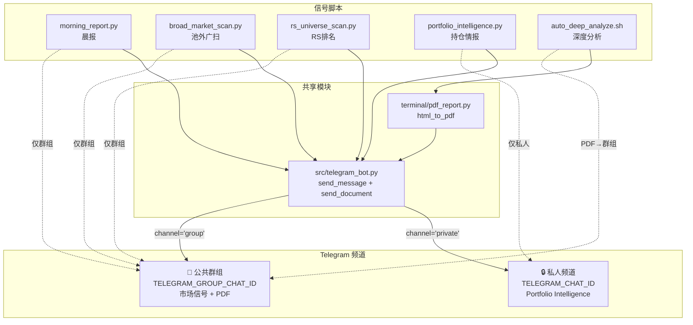
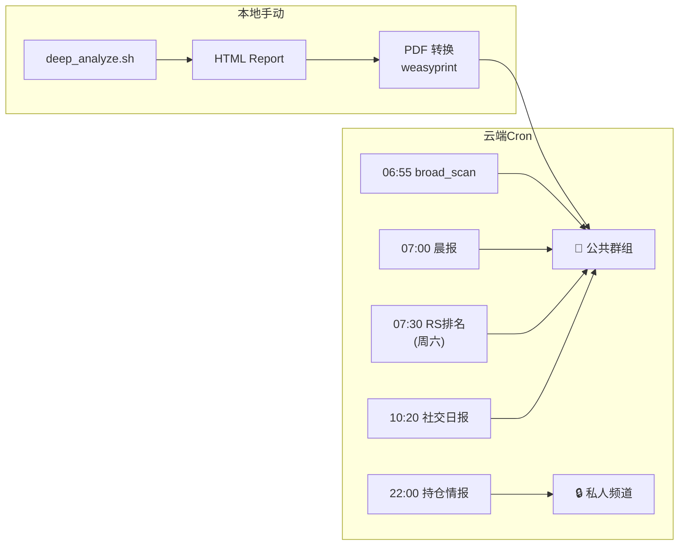

# Telegram 信号分组 + Deep Analysis PDF 推送

> **For Claude:** REQUIRED SUB-SKILL: Use superpowers:executing-plans to implement this plan task-by-task.

**Confidence: 90%**
**不确定点**: weasyprint 在云端 Linux 的系统依赖是否已预装（需 SSH 验证）
**北极星对齐**: 数据层（通知交付基础设施） + CIO 层 A（持仓诊断私有化）

**Goal:** 将 Telegram 信号拆分为私人频道（Portfolio Intelligence）和公共群组（市场信号+研报PDF），消除真实持仓泄露风险。

**Tech Stack:** Python 3.10+ / weasyprint (HTML→PDF) / Telegram Bot API (`sendMessage` + `sendDocument`)

---

## Architecture（架构图）



> 一句话：4 个信号脚本 + 深度分析统一走 `src/telegram_bot.py`，按 channel 参数路由到私人或群组。

## Business Flow（业务流程图）



> 一句话：云端 5 个 cron 按内容敏感度路由；本地深度分析产出 PDF 后自动推群组。

## Alternatives Considered（替代方案）

| 方案 | 优势 | 劣势 | 选择理由 |
|------|------|------|----------|
| **A: 共享模块 + weasyprint（推荐）** | DRY（消除 4 份重复代码）；纯 Python PDF；channel 路由清晰 | weasyprint 需安装系统依赖（cairo/pango） | 最干净的架构，一次重构解决两个需求 |
| **B: 最小改动 — 各脚本内加 chat_id 参数** | 改动最少，无新文件 | 4 份 send_telegram 仍然重复；PDF 仍需新库 | 不选：技术债不减反增 |
| **C: Playwright 做 PDF** | 渲染 100% 像浏览器 | 需下载 Chromium (~200MB)；云端部署重 | 不选：杀鸡用牛刀，weasyprint 足够 |

## Risks & Mitigation（风险自证）

- **最大风险:** weasyprint 在云端 Linux 缺系统依赖 → **缓解**: Task 4 显式检查并安装；PDF 转换失败时 graceful skip（不阻塞分析流程）
- **为什么不用更简单的做法:** 方案 B 更简单但不解决代码重复，且未来加频道（如第三个群）要改 4 个文件
- **回滚方案:** `src/telegram_bot.py` 是纯新增文件，旧脚本 import 路径改回本地函数即可 3 分钟回滚
- **隐私风险:** Portfolio Intelligence 误发群组 → **缓解**: 默认 channel 是 `"private"`，群组需显式指定；行为测试强制断言每个脚本的 channel 参数；代码审查重点检查

## Acceptance Criteria（验收标准）

- [ ] 行为测试断言 `portfolio_intelligence` 所有路径（正常 + 空持仓早退）均调用 `send_message(..., channel="private")`
- [ ] 行为测试断言 `morning_report`、`broad_market_scan`、`rs_universe_scan` 所有路径（正常 + 拆分 + 错误）均调用 `send_message(..., channel="group")`
- [ ] PDF 单元测试（mock weasyprint）全部 PASS，不依赖系统库
- [ ] 对任意 ticker 的已有 HTML report，手动冒烟 `html_to_pdf()` 产出 PDF 文件且可打开（需本地安装 weasyprint）
- [ ] `send_document(pdf_path, channel="group")` 成功发送 PDF 到群组
- [ ] `auto_deep_analyze.sh` 跑完一只股票后群组收到 PDF
- [ ] 云端 cron 全部正常（`--status` 检查）
- [ ] 所有现有测试通过（`pytest tests/ -v`）

---

## Implementation Tasks

### Task 1: 创建共享 Telegram 模块 `src/telegram_bot.py`

**Files:**
- Create: `src/telegram_bot.py`
- Modify: `config/settings.py:401-403` — 新增 `TELEGRAM_GROUP_CHAT_ID`
- Test: `tests/test_telegram_bot.py`

**Step 1: 新增配置**

在 `config/settings.py` 第 403 行后添加：

```python
TELEGRAM_GROUP_CHAT_ID = os.environ.get("TELEGRAM_GROUP_CHAT_ID", "")
```

**Step 2: 写测试**

```python
# tests/test_telegram_bot.py
"""Tests for shared Telegram bot module."""
import pytest
from unittest.mock import patch, MagicMock
from src.telegram_bot import send_message, send_document, _resolve_chat_id


class TestResolveChatId:
    """Chat ID resolution by channel name."""

    @patch("src.telegram_bot.TELEGRAM_CHAT_ID", "111")
    @patch("src.telegram_bot.TELEGRAM_GROUP_CHAT_ID", "222")
    def test_private_returns_chat_id(self):
        assert _resolve_chat_id("private") == "111"

    @patch("src.telegram_bot.TELEGRAM_CHAT_ID", "111")
    @patch("src.telegram_bot.TELEGRAM_GROUP_CHAT_ID", "222")
    def test_group_returns_group_chat_id(self):
        assert _resolve_chat_id("group") == "222"

    @patch("src.telegram_bot.TELEGRAM_CHAT_ID", "")
    def test_missing_private_returns_empty(self):
        assert _resolve_chat_id("private") == ""

    @patch("src.telegram_bot.TELEGRAM_GROUP_CHAT_ID", "")
    def test_missing_group_returns_empty(self):
        assert _resolve_chat_id("group") == ""


class TestSendMessage:
    """Text message sending with retry."""

    @patch("src.telegram_bot.TELEGRAM_BOT_TOKEN", "tok")
    @patch("src.telegram_bot.TELEGRAM_CHAT_ID", "111")
    @patch("src.telegram_bot.requests.post")
    def test_send_private(self, mock_post):
        mock_post.return_value = MagicMock(status_code=200)
        mock_post.return_value.raise_for_status = MagicMock()
        assert send_message("hello", channel="private") is True
        call_payload = mock_post.call_args[1]["json"]
        assert call_payload["chat_id"] == "111"

    @patch("src.telegram_bot.TELEGRAM_BOT_TOKEN", "tok")
    @patch("src.telegram_bot.TELEGRAM_GROUP_CHAT_ID", "222")
    @patch("src.telegram_bot.requests.post")
    def test_send_group(self, mock_post):
        mock_post.return_value = MagicMock(status_code=200)
        mock_post.return_value.raise_for_status = MagicMock()
        assert send_message("hello", channel="group") is True
        call_payload = mock_post.call_args[1]["json"]
        assert call_payload["chat_id"] == "222"

    @patch("src.telegram_bot.TELEGRAM_BOT_TOKEN", "")
    def test_skip_when_no_token(self):
        assert send_message("hello") is False

    @patch("src.telegram_bot.TELEGRAM_BOT_TOKEN", "tok")
    @patch("src.telegram_bot.TELEGRAM_CHAT_ID", "111")
    @patch("src.telegram_bot.requests.post", side_effect=Exception("net"))
    def test_retry_on_failure(self, mock_post):
        assert send_message("hello", max_retries=2) is False
        assert mock_post.call_count == 2


class TestSendDocument:
    """File (PDF) sending."""

    @patch("src.telegram_bot.TELEGRAM_BOT_TOKEN", "tok")
    @patch("src.telegram_bot.TELEGRAM_GROUP_CHAT_ID", "222")
    @patch("src.telegram_bot.requests.post")
    def test_send_pdf(self, mock_post, tmp_path):
        pdf = tmp_path / "report.pdf"
        pdf.write_bytes(b"%PDF-fake")
        mock_post.return_value = MagicMock(status_code=200)
        mock_post.return_value.raise_for_status = MagicMock()
        assert send_document(str(pdf), caption="Test", channel="group") is True

    def test_missing_file_returns_false(self):
        assert send_document("/nonexistent.pdf") is False
```

**Step 3: 运行测试确认失败**

```bash
pytest tests/test_telegram_bot.py -v
```

Expected: FAIL — `src.telegram_bot` 不存在

**Step 4: 实现模块**

```python
# src/telegram_bot.py
"""Shared Telegram Bot — 支持私人频道和公共群组双通道推送."""
import logging
import time
from pathlib import Path

import requests

from config.settings import (
    TELEGRAM_BOT_TOKEN,
    TELEGRAM_CHAT_ID,
    TELEGRAM_GROUP_CHAT_ID,
)

logger = logging.getLogger(__name__)

API_BASE = "https://api.telegram.org/bot{}"


def _resolve_chat_id(channel: str) -> str:
    """将 channel 名称解析为实际 chat_id."""
    if channel == "group":
        return TELEGRAM_GROUP_CHAT_ID
    return TELEGRAM_CHAT_ID  # "private" 或其他默认走私人


def send_message(
    text: str,
    channel: str = "private",
    max_retries: int = 3,
) -> bool:
    """发送文本消息到指定频道.

    Args:
        text: 消息内容 (Markdown 格式)
        channel: "private" (个人) 或 "group" (公共群组)
        max_retries: 失败重试次数
    """
    token = TELEGRAM_BOT_TOKEN
    chat_id = _resolve_chat_id(channel)

    if not token or not chat_id:
        logger.info("[Telegram] 未配置 (%s)，跳过发送", channel)
        return False

    url = API_BASE.format(token) + "/sendMessage"
    payload = {
        "chat_id": chat_id,
        "text": text,
        "parse_mode": "Markdown",
    }

    for attempt in range(1, max_retries + 1):
        try:
            resp = requests.post(url, json=payload, timeout=15)
            resp.raise_for_status()
            logger.info("[Telegram] 消息已发送 → %s", channel)
            return True
        except Exception as e:
            logger.warning("[Telegram] 第%d次发送失败 (%s): %s", attempt, channel, e)
            if attempt < max_retries:
                time.sleep(attempt * 2)

    return False


def send_document(
    file_path: str,
    caption: str = "",
    channel: str = "group",
    max_retries: int = 3,
) -> bool:
    """发送文件（PDF 等）到指定频道.

    Args:
        file_path: 文件绝对路径
        caption: 文件说明 (Markdown)
        channel: "private" 或 "group"
        max_retries: 失败重试次数
    """
    path = Path(file_path)
    if not path.exists():
        logger.warning("[Telegram] 文件不存在: %s", file_path)
        return False

    token = TELEGRAM_BOT_TOKEN
    chat_id = _resolve_chat_id(channel)

    if not token or not chat_id:
        logger.info("[Telegram] 未配置 (%s)，跳过发送", channel)
        return False

    url = API_BASE.format(token) + "/sendDocument"

    for attempt in range(1, max_retries + 1):
        try:
            with open(path, "rb") as f:
                data = {"chat_id": chat_id, "parse_mode": "Markdown"}
                if caption:
                    data["caption"] = caption
                resp = requests.post(
                    url, data=data, files={"document": f}, timeout=60
                )
                resp.raise_for_status()
            logger.info("[Telegram] 文件已发送 → %s: %s", channel, path.name)
            return True
        except Exception as e:
            logger.warning("[Telegram] 文件发送第%d次失败 (%s): %s", attempt, channel, e)
            if attempt < max_retries:
                time.sleep(attempt * 2)

    return False
```

**Step 5: 运行测试确认通过**

```bash
pytest tests/test_telegram_bot.py -v
```

Expected: 全部 PASS

**Step 6: Commit**

```bash
git add src/telegram_bot.py tests/test_telegram_bot.py config/settings.py
git commit -m "feat(telegram): shared bot module with private/group channel routing"
```

---

### Task 2: 迁移 4 个脚本到共享模块

**Files:**
- Modify: `scripts/morning_report.py` — 删除本地 `send_telegram()`，用 `send_message(channel="group")`
- Modify: `scripts/broad_market_scan.py` — 同上
- Modify: `scripts/rs_universe_scan.py` — 同上
- Modify: `scripts/portfolio_intelligence.py` — 用 `send_message(channel="private")`
- Test: `tests/test_telegram_routing.py`

**Step 1: 写行为测试（channel 路由断言）**

这些测试 mock `src.telegram_bot.send_message`，运行各脚本的发送逻辑，断言 **每个 call site 使用了正确的 channel 参数**。这是隐私保护的最后一道防线。

```python
# tests/test_telegram_routing.py
"""Behavioral tests: verify each script routes to the correct Telegram channel.

Privacy-critical: portfolio_intelligence must NEVER send to 'group'.
"""
import ast
import pytest
from pathlib import Path
from unittest.mock import patch, MagicMock, call


# ── Part A: Structural guards ──────────────────────────

SCRIPTS = [
    "scripts/morning_report.py",
    "scripts/broad_market_scan.py",
    "scripts/rs_universe_scan.py",
    "scripts/portfolio_intelligence.py",
]


@pytest.mark.parametrize("script", SCRIPTS)
def test_no_local_send_telegram_definition(script):
    """No script may define its own send_telegram — must use shared module."""
    source = Path(script).read_text()
    tree = ast.parse(source)
    local_defs = [
        node.name for node in ast.walk(tree)
        if isinstance(node, ast.FunctionDef) and node.name == "send_telegram"
    ]
    assert local_defs == [], f"{script} still defines local send_telegram()"


# ── Part B: Portfolio Intelligence → PRIVATE only ──────

class TestPortfolioIntelligenceRouting:
    """Every send path in portfolio_intelligence must use channel='private'."""

    @patch("scripts.portfolio_intelligence.send_message", return_value=True)
    def test_normal_report_sends_private(self, mock_send):
        """Main report (with holdings) → private."""
        from scripts.portfolio_intelligence import run_intelligence
        # Mock enough dependencies so run_intelligence can execute
        with patch("scripts.portfolio_intelligence.get_store") as mock_store, \
             patch("scripts.portfolio_intelligence.PortfolioManager") as mock_mgr, \
             patch("scripts.portfolio_intelligence.sqlite3"):
            # Setup: at least one holding so it doesn't early-exit
            mock_mgr_inst = MagicMock()
            mock_mgr_inst.load_holdings.return_value = [MagicMock(
                symbol="AAPL", shares=100, avg_cost=150.0, dna="A",
                unrealized_pnl=500.0,
            )]
            mock_mgr.return_value = mock_mgr_inst
            mock_store.return_value.get_open_option_positions.return_value = []
            mock_store.return_value.get_cash_balance.return_value = 10000
            mock_store.return_value.get_kill_conditions.return_value = []

            run_intelligence(dry_run=False)

        # Assert: every call used channel="private"
        for c in mock_send.call_args_list:
            _, kwargs = c
            channel = kwargs.get("channel", c[0][1] if len(c[0]) > 1 else "private")
            assert channel == "private", \
                f"Portfolio Intelligence sent to '{channel}' — PRIVACY VIOLATION"

    @patch("scripts.portfolio_intelligence.send_message", return_value=True)
    def test_empty_portfolio_sends_private(self, mock_send):
        """Early-exit path (no holdings) → still private."""
        from scripts.portfolio_intelligence import run_intelligence
        with patch("scripts.portfolio_intelligence.get_store") as mock_store, \
             patch("scripts.portfolio_intelligence.PortfolioManager") as mock_mgr:
            mock_mgr.return_value.load_holdings.return_value = []
            mock_store.return_value.get_open_option_positions.return_value = []
            mock_store.return_value.get_cash_balance.return_value = 0

            run_intelligence(dry_run=False)

        assert mock_send.called, "Expected send_message to be called for empty portfolio"
        for c in mock_send.call_args_list:
            _, kwargs = c
            channel = kwargs.get("channel", "private")
            assert channel == "private", \
                f"Empty-portfolio path sent to '{channel}' — PRIVACY VIOLATION"

    def test_no_group_channel_in_source(self):
        """Hardcoded guard: the string 'channel="group"' must not appear in the file."""
        source = Path("scripts/portfolio_intelligence.py").read_text()
        assert 'channel="group"' not in source, \
            "portfolio_intelligence.py contains channel='group' — PRIVACY VIOLATION"
        assert "channel='group'" not in source, \
            "portfolio_intelligence.py contains channel='group' — PRIVACY VIOLATION"


# ── Part C: Market signal scripts → GROUP only ─────────

class TestMorningReportRouting:
    """All morning_report send paths must use channel='group'."""

    def test_all_send_calls_use_group(self):
        """Static check: every send_message() call in the file uses channel='group'."""
        source = Path("scripts/morning_report.py").read_text()
        tree = ast.parse(source)
        for node in ast.walk(tree):
            if isinstance(node, ast.Call):
                func = node.func
                # Match send_message(...) calls
                if isinstance(func, ast.Name) and func.id == "send_message":
                    channels = [
                        kw.value for kw in node.keywords if kw.arg == "channel"
                    ]
                    for ch in channels:
                        if isinstance(ch, ast.Constant):
                            assert ch.value == "group", \
                                f"morning_report.py line {node.lineno}: channel='{ch.value}', expected 'group'"
                    # If no channel kwarg, it defaults to "private" which is wrong
                    if not channels:
                        pytest.fail(
                            f"morning_report.py line {node.lineno}: send_message() "
                            f"missing channel='group' (defaults to private)"
                        )


class TestBroadMarketScanRouting:
    """All broad_market_scan send paths must use channel='group'."""

    def test_all_send_calls_use_group(self):
        source = Path("scripts/broad_market_scan.py").read_text()
        tree = ast.parse(source)
        for node in ast.walk(tree):
            if isinstance(node, ast.Call):
                func = node.func
                if isinstance(func, ast.Name) and func.id == "send_message":
                    channels = [
                        kw.value for kw in node.keywords if kw.arg == "channel"
                    ]
                    for ch in channels:
                        if isinstance(ch, ast.Constant):
                            assert ch.value == "group", \
                                f"broad_market_scan.py line {node.lineno}: channel='{ch.value}'"
                    if not channels:
                        pytest.fail(
                            f"broad_market_scan.py line {node.lineno}: send_message() "
                            f"missing channel='group'"
                        )


class TestRsUniverseScanRouting:
    """All rs_universe_scan send paths must use channel='group'."""

    def test_all_send_calls_use_group(self):
        source = Path("scripts/rs_universe_scan.py").read_text()
        tree = ast.parse(source)
        for node in ast.walk(tree):
            if isinstance(node, ast.Call):
                func = node.func
                if isinstance(func, ast.Name) and func.id == "send_message":
                    channels = [
                        kw.value for kw in node.keywords if kw.arg == "channel"
                    ]
                    for ch in channels:
                        if isinstance(ch, ast.Constant):
                            assert ch.value == "group", \
                                f"rs_universe_scan.py line {node.lineno}: channel='{ch.value}'"
                    if not channels:
                        pytest.fail(
                            f"rs_universe_scan.py line {node.lineno}: send_message() "
                            f"missing channel='group'"
                        )
```

**Step 2: 运行测试确认失败**

```bash
pytest tests/test_telegram_routing.py -v
```

Expected: FAIL — 脚本仍有本地 `send_telegram` 定义，且无 `send_message` 调用

**Step 3: 逐个迁移**

**morning_report.py** — 发群组（7 处调用）：

1. 删除第 52-79 行的 `send_telegram()` 函数定义
2. 在文件顶部 import 区新增: `from src.telegram_bot import send_message`
3. 替换全部 7 处 `send_telegram(...)` → `send_message(..., channel="group")`
   - 533: 社交日报正常发送
   - 539: 社交日报错误通知
   - 657, 658: 晨报拆分发送
   - 660: 晨报 fallback 拆分
   - 662: 晨报正常发送
   - 673: 晨报错误通知
4. `grep -n send_telegram scripts/morning_report.py` 确认 0 结果

**broad_market_scan.py** — 发群组（6 处调用）：

1. 删除第 60-87 行的 `send_telegram()` 函数定义
2. 顶部新增: `from src.telegram_bot import send_message`
3. 替换全部 6 处 `send_telegram(...)` → `send_message(..., channel="group")`
   - 605, 606: 拆分发送
   - 608, 609: fallback 拆分
   - 611: 正常发送
   - 620: 错误通知
4. `grep -n send_telegram scripts/broad_market_scan.py` 确认 0 结果

**rs_universe_scan.py** — 发群组（5 处调用）：

1. 删除第 48-77 行的 `send_telegram()` 函数定义
2. 顶部新增: `from src.telegram_bot import send_message`
3. 替换全部 5 处 `send_telegram(...)` → `send_message(..., channel="group")`
   - 284, 285: 拆分发送
   - 287: fallback
   - 289: 正常发送
   - 298: 错误通知
4. `grep -n send_telegram scripts/rs_universe_scan.py` 确认 0 结果

**portfolio_intelligence.py** — 发私人（⚠️ 隐私关键，2 处调用）：

1. 删除第 250-271 行的 `send_telegram()` 函数定义
2. 顶部新增: `from src.telegram_bot import send_message`
3. 替换全部 2 处：
   - 339: `send_telegram(msg)` → `send_message(msg, channel="private")`（空持仓早退）
   - 512: `send_telegram(report)` → `send_message(report, channel="private")`（正常报告）
4. **双重确认**:
   - `grep -n send_telegram scripts/portfolio_intelligence.py` → 0 结果
   - `grep -n 'channel="group"' scripts/portfolio_intelligence.py` → 0 结果

**Step 4: 运行测试确认通过**

```bash
pytest tests/test_telegram_routing.py -v
pytest tests/ -v --timeout=60  # 全量回归
```

Expected: 全部 PASS

**Step 5: Commit**

```bash
git add scripts/morning_report.py scripts/broad_market_scan.py \
  scripts/rs_universe_scan.py scripts/portfolio_intelligence.py \
  tests/test_telegram_routing.py
git commit -m "refactor(telegram): migrate 4 scripts to shared telegram_bot module"
```

---

### Task 3: 创建 PDF 转换模块 `terminal/pdf_report.py`

**Files:**
- Create: `terminal/pdf_report.py`
- Test: `tests/test_pdf_report.py`

**Step 1: 安装 weasyprint**

```bash
# macOS 本地
brew install cairo pango gdk-pixbuf libffi  # 系统依赖
pip install weasyprint

# 云端 Linux（如果需要在云端生成 PDF）
ssh aliyun "apt-get install -y libcairo2 libpango-1.0-0 libgdk-pixbuf2.0-0 libffi-dev && \
  cd /root/workspace/Finance && .venv/bin/pip install weasyprint"
```

将 `weasyprint` 添加到 `requirements.txt`（如有）。

**Step 2: 写单元测试（mock weasyprint，不依赖系统库）**

```python
# tests/test_pdf_report.py
"""Tests for HTML-to-PDF conversion (mocked — no system deps required)."""
import pytest
from pathlib import Path
from unittest.mock import patch, MagicMock


@pytest.fixture
def sample_html(tmp_path):
    """Create a minimal HTML file for testing."""
    html = tmp_path / "report.html"
    html.write_text(
        "<html><body><h1>Test Report</h1><p>Content</p></body></html>",
        encoding="utf-8",
    )
    return html


class TestHtmlToPdf:
    """Unit tests — mock weasyprint so tests run without system deps."""

    @patch("terminal.pdf_report.HTML")
    def test_converts_html_to_pdf(self, mock_html_cls, sample_html):
        """html_to_pdf calls weasyprint.HTML and writes a .pdf file."""
        from terminal.pdf_report import html_to_pdf

        # Make write_pdf actually create the file so path checks work
        def fake_write_pdf(path):
            Path(path).write_bytes(b"%PDF-fake")
        mock_html_cls.return_value.write_pdf.side_effect = fake_write_pdf

        result = html_to_pdf(sample_html)
        assert result is not None
        assert result.suffix == ".pdf"
        assert result.stem == sample_html.stem
        assert result.parent == sample_html.parent
        mock_html_cls.assert_called_once_with(filename=str(sample_html))

    def test_nonexistent_file_returns_none(self):
        from terminal.pdf_report import html_to_pdf
        result = html_to_pdf(Path("/nonexistent/report.html"))
        assert result is None

    @patch("terminal.pdf_report.HTML", side_effect=ImportError("no weasyprint"))
    def test_missing_weasyprint_returns_none(self, mock_html_cls, sample_html):
        """Graceful degradation when weasyprint is not installed."""
        from terminal.pdf_report import html_to_pdf
        result = html_to_pdf(sample_html)
        assert result is None

    @patch("terminal.pdf_report.HTML")
    def test_conversion_error_returns_none(self, mock_html_cls, sample_html):
        """Graceful degradation on conversion error."""
        from terminal.pdf_report import html_to_pdf
        mock_html_cls.return_value.write_pdf.side_effect = Exception("render fail")
        result = html_to_pdf(sample_html)
        assert result is None
```

> **冒烟测试**（手动，需 weasyprint 已安装）：见 Task 6 Step 3 的手动验证命令。
> 不放入 `pytest tests/` 自动套件，避免系统依赖导致 CI 红灯。

**Step 3: 运行测试确认失败**

```bash
pytest tests/test_pdf_report.py -v
```

**Step 4: 实现**

```python
# terminal/pdf_report.py
"""HTML → PDF 转换 — 基于 weasyprint."""
import logging
from pathlib import Path
from typing import Optional

logger = logging.getLogger(__name__)

# Lazy import: weasyprint 可能未安装（系统依赖重）
# 在函数内部 import 以便 mock 和 graceful degradation
try:
    from weasyprint import HTML
except ImportError:
    HTML = None  # type: ignore


def html_to_pdf(html_path: Path) -> Optional[Path]:
    """将 HTML 报告转换为 PDF.

    Args:
        html_path: HTML 文件路径

    Returns:
        PDF 文件路径，失败返回 None
    """
    html_path = Path(html_path)
    if not html_path.exists():
        logger.warning("[PDF] HTML 文件不存在: %s", html_path)
        return None

    if HTML is None:
        logger.warning("[PDF] weasyprint 未安装，跳过 PDF 转换")
        return None

    pdf_path = html_path.with_suffix(".pdf")

    try:
        HTML(filename=str(html_path)).write_pdf(str(pdf_path))
        logger.info("[PDF] 转换完成: %s (%.1f KB)", pdf_path.name, pdf_path.stat().st_size / 1024)
        return pdf_path
    except Exception as e:
        logger.error("[PDF] 转换失败: %s", e)
        return None
```

**Step 5: 运行测试确认通过**

```bash
pytest tests/test_pdf_report.py -v
```

Expected: 全部 PASS（无需 weasyprint 系统依赖，全部 mocked）

**Step 6: Commit**

```bash
git add terminal/pdf_report.py tests/test_pdf_report.py
git commit -m "feat(pdf): HTML-to-PDF conversion module via weasyprint"
```

---

### Task 4: Deep Analysis 集成 — PDF 生成 + 群组推送

**Files:**
- Modify: `terminal/deep_pipeline.py:1057-1064` — HTML 生成后追加 PDF 转换
- Modify: `scripts/auto_deep_analyze.sh:~660` — Phase 4d: 发送 PDF 到群组
- Test: 手动验证（对已有 HTML report 跑 PDF 转换 + 发送）

**Step 1: 修改 `deep_pipeline.py`**

在第 1064 行（HTML 生成成功后）追加 PDF 转换：

```python
    # 现有代码 (1057-1064):
    # html_path = None
    # try:
    #     from terminal.html_report import compile_html_report
    #     html_path = compile_html_report(symbol, research_dir, date=date)
    #     logger.info(f"Compiled HTML report: {html_path}")
    # except Exception as e:
    #     logger.warning(f"HTML report generation failed: {e}")

    # ---- 新增: PDF 转换 ----
    pdf_path = None
    if html_path:
        try:
            from terminal.pdf_report import html_to_pdf
            pdf_path = html_to_pdf(html_path)
            if pdf_path:
                logger.info(f"Compiled PDF report: {pdf_path}")
        except Exception as e:
            logger.warning(f"PDF report generation failed: {e}")
```

> **注意**: 不持久化 `pdf_report_path` 到 `company.db`。`analyses` 表 schema 只有 `report_path` 和 `html_report_path` 两列，加新列需要 schema 迁移。YAGNI — PDF 可随时从已持久化的 HTML 重新生成。

**Step 2: 在 `auto_deep_analyze.sh` 添加 Phase 4d**

在 Phase 4b（DB save）之后、Summary 之前（约第 659 行），添加：

```bash
    # ─── Phase 4d: 发送 PDF 到 Telegram 群组 ─────────
    local html_file
    html_file=$(find "$rd" -name "full_report_*.html" -type f | head -1)
    if [[ -n "$html_file" ]]; then
        log "  [$ticker] Phase 4d: PDF → Telegram 群组..."
        "$VENV_PYTHON" -c "
import sys
sys.path.insert(0, '$PROJECT_DIR')
from terminal.pdf_report import html_to_pdf
from src.telegram_bot import send_document
from pathlib import Path

html = Path('$html_file')
pdf = html_to_pdf(html)
if pdf:
    send_document(str(pdf), caption='*${ticker}* 深度分析报告', channel='group')
    print('OK: ' + str(pdf))
else:
    print('SKIP: PDF conversion failed')
" 2>>"$ticker_log"
        log "  [$ticker] Phase 4d 完成"
    else
        log "  [$ticker] ⚠️ 无 HTML 报告，跳过 PDF 发送"
    fi
```

**Step 3: 手动验证**

```bash
# 用已有的 HTML 报告测试
python3 -c "
from terminal.pdf_report import html_to_pdf
from src.telegram_bot import send_document
from pathlib import Path
import glob

# 找一份已有 HTML 报告
htmls = glob.glob('data/companies/*/research/*/full_report_*.html')
if htmls:
    html = Path(htmls[0])
    pdf = html_to_pdf(html)
    print(f'PDF: {pdf}')
    if pdf:
        send_document(str(pdf), caption='*TEST* PDF delivery', channel='group')
        print('Sent!')
else:
    print('No HTML reports found')
"
```

Expected: 群组收到 PDF 文件

**Step 4: Commit**

```bash
git add terminal/deep_pipeline.py scripts/auto_deep_analyze.sh
git commit -m "feat(deep-analysis): auto-generate PDF and send to Telegram group"
```

---

### Task 5: 环境变量部署 + 云端同步

**Files:**
- Modify: 本地 `.env` — 新增 `TELEGRAM_GROUP_CHAT_ID`
- Modify: 云端 `/root/workspace/Finance/.env` — 同上
- No code changes

**Step 1: Boss 创建 Telegram 群组并获取 Chat ID**

> ⚠️ 需要 Boss 操作：
> 1. 在 Telegram 创建新群组
> 2. 将 Bot 加入群组
> 3. 获取群组 Chat ID（可发一条消息后调用 `getUpdates` API）
>
> ```bash
> curl "https://api.telegram.org/bot<TOKEN>/getUpdates" | python3 -m json.tool | grep -A2 '"chat"'
> ```
>
> 群组 Chat ID 通常是负数，如 `-1001234567890`

**Step 2: 更新本地 .env**

```bash
echo 'export TELEGRAM_GROUP_CHAT_ID="-100XXXXXXXXXX"' >> .env
```

**Step 3: 更新云端 .env**

```bash
ssh aliyun 'echo "export TELEGRAM_GROUP_CHAT_ID=\"-100XXXXXXXXXX\"" >> /root/workspace/Finance/.env'
```

**Step 4: 安装云端 weasyprint（如果需要在云端生成 PDF）**

```bash
ssh aliyun "apt-get install -y libcairo2 libpango-1.0-0 libgdk-pixbuf2.0-0 libffi-dev && \
  cd /root/workspace/Finance && source .venv/bin/activate && pip install weasyprint"
```

> 注意：`auto_deep_analyze.sh` 目前只在本地跑，云端不需要 weasyprint。但预装不影响。

**Step 5: 验证云端 cron**

```bash
# 代码部署到云端（等自动 git pull 或手动触发）
ssh aliyun "cd /root/workspace/Finance && git pull"

# 验证环境变量加载
ssh aliyun "source /root/workspace/Finance/.env && echo PRIVATE=\$TELEGRAM_CHAT_ID GROUP=\$TELEGRAM_GROUP_CHAT_ID"

# 手动触发测试
ssh aliyun "cd /root/workspace/Finance && source .env && python3 -c \"
from src.telegram_bot import send_message
send_message('✅ 公共群组测试', channel='group')
send_message('✅ 私人频道测试', channel='private')
\""
```

Expected: 两个频道分别收到测试消息

**Step 6: Commit .env.example（可选）**

如项目有 `.env.example`，添加新变量说明。

---

### Task 6: 回归测试 + 清理

**Step 1: 全量测试**

```bash
cd /Users/owen/CC\ workspace/Finance
source .venv/bin/activate
pytest tests/ -v --timeout=120
```

Expected: 全部 PASS（含新增的 telegram_bot + pdf_report 测试）

**Step 2: 检查无残留的本地 send_telegram**

```bash
grep -rn "def send_telegram" scripts/ src/ terminal/
```

Expected: 0 结果（所有定义已迁移到 `src/telegram_bot.py` 的 `send_message`）

**Step 3: 端到端冒烟测试**

```bash
# 晨报 dry-run
python3 scripts/morning_report.py --no-telegram

# Portfolio Intelligence dry-run
python3 scripts/portfolio_intelligence.py --dry-run

# PDF 转换对已有报告
python3 -c "
from terminal.pdf_report import html_to_pdf
from pathlib import Path
import glob
for h in glob.glob('data/companies/*/research/*/full_report_*.html')[:1]:
    print(html_to_pdf(Path(h)))
"
```

**Step 4: 最终 Commit**

```bash
git commit -m "chore: cleanup and verify telegram split + PDF delivery"
```

---

## Checklist 总览

- [ ] Task 1: `src/telegram_bot.py` 共享模块 + `TELEGRAM_GROUP_CHAT_ID` 配置
- [ ] Task 2: 4 个脚本迁移到共享模块（晨报/广扫/RS→群组, 持仓→私人）
- [ ] Task 3: `terminal/pdf_report.py` HTML→PDF 转换
- [ ] Task 4: Deep Analysis 集成（PDF 生成 + 群组推送）
- [ ] Task 5: 环境变量部署（本地 + 云端）+ 云端验证
- [ ] Task 6: 回归测试 + 清理
