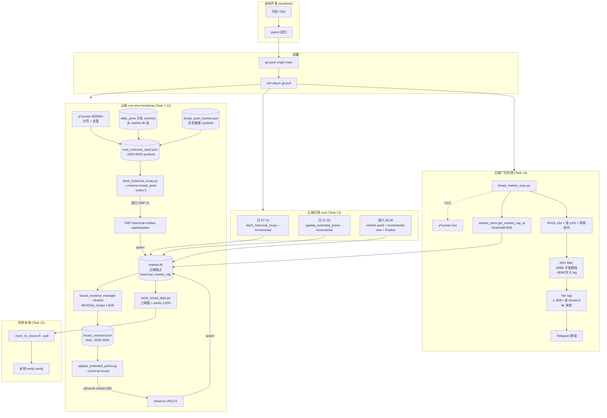
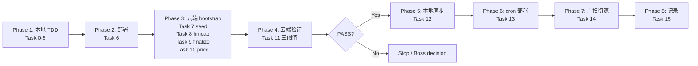

# Broad Universe Historical Data Backfill — Implementation Plan (v3)

> ## 📋 v3 决策锁定（2026-04-23 Session）
>
> **Boss 决策（本次 session 一次性对齐完成）**：
>
> 1. **Universe 下限从 $5B 下放到 $1B**，历史市值曾 ≥$1B 即入 final universe（reconstitution 宽容）
> 2. **broad_market_scan.py 切源** — universe 从 yf.screen 实时拉 $5B+ 改为 `market_store.get_market_cap_at(date, $1B+)`，并入本 plan（不拆独立 plan）
> 3. **广扫 Telegram 流量方案 α** — ADV<$3M 不发群组（只入 log），发群组的分两档：🔥 = $5B+ 或 streak≥3 / 📊 = 其他
> 4. **时间窗保持 2021-02-01**，不扩到更早
> 5. **Bootstrap 流程保持**（Boss v2 P1-E 批注）：Seed = `yf.screen($500M+)` ∪ 现有 daily_price symbols ∪ broad_scan_hits → 拉 hist_mcap → filter `MAX(mcap) ≥ $1B` → final
> 6. **本地 dry-run 完全删除**（Boss v2 P1-F），云端单只 smoke test 替代
> 7. **Verify partial_cap gate** 加入（Boss v2 P1-G），默认 partial≤5%
> 8. **Probe 去重**（Boss v2 P2-H）
> 9. **验收阈值收紧**（Boss v2 Q2）：
>    - hist_mcap full≥92% / partial≤5% / missing≤3%
>    - daily_price full≥95% / partial≤3% / missing≤2%
>    - sanity 容差 ±10%
> 10. **IPO 宽容规则保留**（first_date > 2021-06-01 但 ≤ today-365d 且 row_count ≥ min×0.6 算 full）
> 11. **一次性 backfill + 日常 cron 编排合并在本 plan**，新增 Task 13（cron 部署）+ Task 14（广扫切源）
>
> **下次会话入口**：本 v3 plan body 已完整重写。走 Boss review 批注循环（不自动进执行）。
>
> ---
>
> ## 📋 v3 Review #1 修复（2026-04-23 Boss review 回合）
>
> Boss 给出 5 条 findings (3 P1 + 2 P2) + 3 条额外建议，全部技术验证后成立，本轮一并修入：
>
> 1. **[P1] Rollout order** — Task 6 只部署 Task 1-5；Task 14 Step 5.5 新增**强制部署 gate**（git push + ssh pull + import 断言）在 Step 6/7 云端验证之前；Task 13 Step 2 也改走 git 部署 wrapper（不 scp）
> 2. **[P1] `get_symbols_with_market_cap_at` SQL 语义错** — 改为 window function 取每 symbol ≤ date 最近一条记录 + `freshness_days=90` 参数防 stale；新增三个测试 cover as-of snapshot / freshness floor / latest-record-wins
> 3. **[P1] Weekly cron 接错 + `\|\| true` 吞错** — wrapper 改用 `set -euo pipefail` + `run_step` 函数显式捕获 rc；weekly_refresh 拆成 5 步（refresh_seed → hmcap_new_seed → finalize → hmcap_new_final → price_new_final），不再用 `--full-backfill`；配套给 `update_extended_prices.py` 新增 `--incremental-new-symbols` 模式
> 4. **[P2] Smoke test 绕开 resolver** — Task 8 Step 1 改为"先写 1-symbol seed JSON + 不带 `--symbols` 跑 `--universe broad_seed`"，真正走 resolver；跑完恢复真 seed
> 5. **[P2] Tier 传 dict** — `classify_tier(hit)` 只读一个参数，内部 `hit.get('consecutive_days', 1)` fallback
> 6. **[Extra] `_conn` → `_get_conn`**（market_store 485 API）
> 7. **[Extra] 测试路径** — 平铺到 `tests/test_*.py`，不嵌套 `tests/data/` / `tests/scripts/`
> 8. **[Extra] 常量职责分离** — `BROAD_UNIVERSE_MIN_MCAP_USD`（稳定 universe 定义）vs `BROAD_SCAN_GROUP_ALERT_MIN_MCAP`（独立群发阈值），Task 14 Step 1 `fetch_universe_symbols` 用前者，Step 3 群发过滤用后者
>
> ---
>
> ## 📋 v3 Review #2 修复（2026-04-23 后半段）
>
> Boss Review #2 给出 3 条收尾 finding (2 P2 + 1 P3)，全部验证成立：
>
> 1. **[P2] `--dry-run-send` 未定义** — Task 14 Step 7 替换为两阶段 E2E：Stage 1 本地 Python snippet 打印消息格式预览（不发 Telegram，只验证 tier + 字段拼接），Stage 2 云端真跑 `broad_market_scan.py`（无 dry flag，现有 scanner 不支持）并关注群组消息
> 2. **[P2] 字段/函数名混乱** — 对齐现有 scanner 真实 API（验证 `scripts/broad_market_scan.py` 源码）：`marketCap`（驼峰，line 153/363/469）替代 `market_cap`、`return_pct`（line 362）替代 `pct`、`_send_group_message`（line 60）替代不存在的 `send_telegram_group`、`_format_market_cap`（line 104）复用；Task 14 Step 3/4 pseudo-code + Step 5 测试里所有字段名统一；新增 `test_tier_missing_mcap_defaults_zero` 覆盖 `marketCap=None` fallback
> 3. **[P3] `tests/scripts/__init__.py` 残留** — Task 4 Step 3 commit 命令删除这个不存在路径

---

> **For agentic workers:** REQUIRED SUB-SKILL: Use superpowers:subagent-driven-development (recommended) or superpowers:executing-plans to implement this plan task-by-task. Steps use checkbox (`- [ ]`) syntax for tracking.

**Confidence: 94%**（v3 吸收 Boss v2 review 4 个 blocker + 4 个方向回答 + 本次 session $1B/流量方案/时间窗三问）
**版本**：v3（2026-04-23），替代 v2
**北极星对齐**：离线 R&D 层（数据基建）+ 实时扫描层 — 为 PMARP 2%/广度因子研究提供 reconstitution-safe 数据底座，同时把 broad_market_scan.py 的 universe 源统一到本地 market.db。

**Goal:**
1. **一次性 bootstrap**：云端 aliyun 构建 2021-02-01 至今、**历史市值曾 ≥$1B** 的 Broad Universe（预估 ~2500-3500 只美股）完整 hist_mcap + daily_price 数据集，落到云端 canonical market.db
2. **日常 cron 编排**：daily 增量（hist_mcap / daily_price）+ weekly 新 symbol 全量补历史
3. **broad_market_scan.py 切源**：从 yf.screen 实时拉 $5B+ 改为 `market_store.get_market_cap_at(date, threshold=1e9)`；Telegram 流量分层（方案 α：ADV<$3M 剔除群组 + 🔥/📊 tier 标签）

**Architecture:** Bootstrap filter（over-inclusive seed → historical-mcap 过滤 → final universe）。代码本地 worktree TDD + git push + ssh pull 部署；所有数据写入 + verify 在云端执行以遵守 P3 所有权规则；本地仅 pull 同步。广扫改用本地 DB 时点过滤 + ADV/tier 过滤后发 Telegram。

**Tech Stack:** Python + yfinance（universe + OHLCV） + FMP API（`historical-market-capitalization`） + SQLite（market.db） + ssh aliyun + 现有 fmp_client / market_store / extended_price_fetcher / broad_market_scan.

---

## Scope 声明（诚实边界）

**本 plan 修正范围：**
- ✅ **Reconstitution bias**（回测/研究按时点市值过滤）
- ✅ **Present-biased bias**（over-inclusive seed bootstrap 覆盖曾 $1B+ 后跌破的 meme 股/失败案例）
- ✅ **Universe 下限从 $5B 扩到 $1B**（覆盖 small-mid cap 参与度）
- ✅ 数据时间窗一致性（统一 2021-02-01）
- ✅ 数据所有权合规（market.db 写入严格云端）
- ✅ 覆盖率验收严谨性（per-symbol 三阈值 + partial_cap gate）
- ✅ **广扫 universe 统一**（从 yf.screen 实时切到 market.db 时点过滤）
- ✅ **广扫 Telegram 流量分层**（ADV 门卫 + tier 标签，降低群组脱敏风险）
- ✅ **日常 cron 编排**（增量 + 新 symbol 补全）

**本 plan 不修正范围：**
- ❌ **Survivorship bias 残余**：从 $1B+ 跌到 <$500M 且从未在 daily_price / broad_scan_hits / yf.screen($500M+) 出现的"最惨案例"（破产、退市后完全消失）仍漏，估计 2-5%，研究报告中诚实标注
- ❌ Pre-2021 历史（时间窗锁定 2021-02-01）
- ❌ **Consumer wiring**（`run_factor_study.py` / `backtest/adapters/us_stocks.py` 加 `--universe broad` / `--mcap-threshold` 参数）→ 拆到下一个 plan
- ❌ 行业排除规则（研究 universe 保留全量，不应用 `EXCLUDED_SECTORS` / `PERMANENTLY_EXCLUDED`）
- ❌ **Broad scan alerting 业务规则**（告警条件 RVOL≥3σ + 涨≥3% + 排除池内 保持，只换数据源 + 加 ADV/tier 过滤）
- ❌ **PMARP 2% / 广度因子 study 本身** → 后续独立 plan

---

## v2 → v3 关键变化对照

| # | v2 | **v3** |
|---|---|---|
| Universe 下限 | $5B | **$1B** |
| Seed 策略 | `yf.screen($5B+)` 直接即 final | **Bootstrap**：`yf.screen($500M+)` ∪ daily_price 现有 ∪ broad_scan_hits → hist_mcap → filter `MAX(mcap)≥$1B` → final |
| 预估 final 规模 | 800-1500 | **2500-3500** |
| 本地 dry-run | Task 2 Step 2/3 有 | **完全删除**，云端单只 smoke test 替代 |
| hist_mcap verify gate | full≥85% / missing≤5% / partial 无上限 | full≥**92%** / **partial≤5%**（新） / missing≤**3%** |
| daily_price verify gate | full≥90% | full≥**95%** / partial≤**3%** / missing≤**2%** |
| yf.screen probe | 不去重 | **按 symbol 去重** |
| Completeness 门卫 | count ∈ [800, 1500] | count ∈ **[2500, 4000]**（final） + seed ∈ [2000, 6000] |
| Sanity 容差 | ±15% | **±10%** |
| Cron 部署 | 不在 scope | **新增 Task 13**（daily 07:15/07:20 + weekly 周六 08:30） |
| 广扫切源 | 保持 yf.screen 不动 | **新增 Task 14**（切 market.db + 流量分层 α） |
| Task 数量 | 13（Task 0-12） | **16**（Task 0-15，含 3.5 incremental） |

---

## Architecture（架构图）



---

## Business Flow（业务流程图）



---

## Alternatives Considered（替代方案）

| 方案 | 优势 | 劣势 | 选择理由 |
|---|---|---|---|
| **A（v3 采用）：Bootstrap + $1B + cron + 广扫切源** | reconstitution + present-bias 修复；$1B 覆盖 small-mid 参与度；广扫统一 DB；日常自动维护 | bootstrap 一次性 ~2-3h；广扫告警 3×（用方案 α 缓解） | Boss 明确决策 |
| B：v2 保持 $5B + 不 bootstrap | 最省事 | Boss v2 P1-E 已否决 present-biased | **否决** |
| C：$1B 但直接 `yf.screen($1B+)` 不做 bootstrap | 简化 | 仍然 present-biased（跌破 $1B 的曾经龙头缺席） | **否决**（P1-E 同因） |
| D：bootstrap 但门槛 $500M | 更 inclusive | 规模翻倍（5000+）、<$1B 噪音过重、FMP backfill 破表（>3h） | **否决**，Boss 选 $1B |
| E：广扫保持 yf.screen | 零切换成本 | 和本地 DB universe 不一致，飘移；yf.screen 偶发不稳 | **否决**，Boss 要求切 |
| F：广扫切源但不做 ADV/tier 过滤 | 简化 Task 14 | 群组每日 30-50 条快速脱敏 | **否决**（Boss 选方案 α） |
| G：Consumer wiring（run_factor_study）也并入本 plan | 一次完成 | 耦合过重，本 plan 失焦 | **否决**，拆下一个 plan |

---

## Risks & Mitigation（风险自证）

- **最大风险 1：bootstrap 耗时 >3h**
  - Seed 预估 2000-6000 → FMP hmcap 2s × N = 60-200 分钟 + retry
  - **缓解**：`fetch_historical_mcap.py` 已有 `--skip-existing` 支持断点续传；Task 8 后台 nohup 启动，15 分钟查一次进度；允许分 2 天跑
  - **降级**：超过 4 小时未完成 → Boss 决策是否切到隔夜跑

- **最大风险 2：云端 cron 时段冲突锁 market.db**
  - 现有云端 cron：06:25 (git pull), 06:30 (price), 06:45 (DV), 06:50 (IV), 06:55 (social), 08:00 (pool), 10:00 (fundamental), 10:30 (forward)
  - **v3 新增 cron**：07:15 (hmcap incr), 07:20 (price incr)——夹在 06:55 和 08:00 之间，25 分钟的 price incr 刚好收尾前
  - **缓解**：Task 13 部署后第一次自然 cron 执行要监控 log，若超过 30 分钟未完成，调整时间
  - **Bootstrap 执行窗口**：14:00-20:00 或 22:00-次日 06:00 北京时间，避开所有 cron

- **最大风险 3：广扫切源后 RVOL 告警 3×，群组脱敏**
  - $1B+ 全扫预期日命中 30-50（vs 现在 $5B+ 5-10）
  - **缓解**：方案 α 已设计 ADV<$3M 剔除群组 + 🔥/📊 分级。部署后先观察 1 周
  - **降级**：Task 14 提供 feature flag `BROAD_SCAN_GROUP_ALERT_MIN_MCAP`（默认 $1B），可随时调回 $5B 直到找到合适阈值

- **最大风险 4：`--incremental` mode 漏掉新 symbol 的全量历史**
  - `--incremental --days N` 对 existing symbol 只拉最近 N 天；新 symbol 需要全量
  - **缓解**：Task 3.5 明确区分 `--incremental`（仅 existing 最近 N 天） vs `--incremental-new-symbols`（对 broad_universe 但 daily_price/hmcap 空的 symbol 补全量）
  - **降级**：Task 13 weekly cron 专门做 new symbol 全量补

- **最大风险 5：delisted/illiquid symbols 进 seed 导致 FMP hmcap 失败率升高**
  - 新增的 $1-5B 区间包含更多 SPAC、ETF-adjacent、退市股
  - **缓解**：fmp_client 已有 retry；Task 8 允许 partial coverage，由 Task 11 verify 阶段裁决
  - **降级**：verify 失败时 `broad_universe.json` 加 `unverifiable_symbols` 字段，factor study 下游明确排除

- **最大风险 6：广扫切源后和现状 universe 重合度低**
  - 本地 market.db 的 $1B+ 时点过滤 vs yf.screen live $5B+ 可能 universe 差异大
  - **缓解**：Task 14 Step 3 dry-run 对比，要求重合度 ≥90%（对 $5B+ 子集）
  - **降级**：重合度 <90% → Boss review，可能需要调整 hist_mcap 新鲜度或门槛

- **为什么不用更简单的做法：**
  - 保持 $5B = Boss 明确要求扩容
  - 不做 bootstrap = P1-E 已否决
  - 本地执行 = P3 所有权违反

- **回滚方案：**
  - 代码：`git revert Task 1-5 commits`
  - 云端数据：`DELETE FROM historical_market_cap WHERE symbol NOT IN (SELECT symbol FROM extended_universe)` + `DELETE FROM daily_price WHERE ...` + 删 `broad_universe.json`
  - Cron：`ssh aliyun crontab -l | grep -v broad | crontab -`
  - 广扫：feature flag `BROAD_SCAN_UNIVERSE_SOURCE = "yf_screen"` 一键回退

---

## Acceptance Criteria（验收标准）

**Phase 3 Universe（Task 9 finalize 验收）**：
- [ ] 云端 `broad_universe.json` 含 **≥2500 且 ≤4000** symbols（final 规模门卫）
- [ ] Seed 规模 ∈ [2000, 6000]（bootstrap 起始门卫）
- [ ] 每个 final symbol 有 `max_hist_mcap_usd ≥ 1e9` 字段（可追溯证明）
- [ ] Metadata 含 `bootstrap_seed_size` / `filter_threshold_usd` / `source_breakdown`（yfscreen / existing / broadscan 三源各自贡献）

**Phase 4 Historical market cap（Task 11 验收）**：
- [ ] **full coverage ≥ 92%**
  - 定义：row_count ≥ 900 AND first_date ≤ 2021-06-01 AND last_date ≥ 2026-03-01
- [ ] **partial coverage ≤ 5%**（row_count ≥ 300 但未达 full）
- [ ] **missing ≤ 3%**（row_count < 300 或无数据）
- [ ] IPO 宽容规则：first_date > 2021-06-01 但 first_date ≤ today-365d 且 row_count ≥ min×0.6 算 full

**Phase 4 Daily price（Task 11 验收）**：
- [ ] **full coverage ≥ 95%**
  - 定义：row_count ≥ 1000 AND first_date ≤ 2021-06-01 AND last_date ≥ 2026-03-01
- [ ] **partial ≤ 3%** / **missing ≤ 2%**

**Sanity checks（Task 11，容差 ±10%）**：
- [ ] `AAPL` 2021-02-03 market cap ∈ [$1.98T, $2.42T]（$2.2T ±10%）
- [ ] `MSFT` 2023-03-01 market cap ∈ [$1.62T, $1.98T]
- [ ] `NVDA` 2024-01-02 market cap ∈ [$1.08T, $1.32T]
- [ ] `AAPL` 2026-04-08 daily_price close 存在
- [ ] `SIVB` 2023-03-09 market cap 存在（退市股 reconstitution）
- [ ] **新增**：universe 分层统计：$1-5B ≥ 1500 只、$5-10B ≥ 300 只、$10-50B ≥ 400 只、$50B+ ≥ 100 只

**Phase 6 Cron deployment（Task 13 验收）**：
- [ ] `ssh aliyun crontab -l` 显示三行新 cron（07:15 / 07:20 / 周六 08:30）
- [ ] 第一次自然 cron 执行后 log 文件生成，exit=0
- [ ] 增量运行一天后 broad universe 行数只增不减

**Phase 7 Broad scan switch（Task 14 验收）**：
- [ ] `broad_market_scan.py` universe 源已切换，dry-run 对比同日 yf.screen($5B+) 结果重合度 ≥ 90%
- [ ] ADV<$3M 命中不发 Telegram 群组（仅入 scan log）
- [ ] Telegram 消息含 🔥/📊 tier 标签
- [ ] Feature flag `BROAD_SCAN_UNIVERSE_SOURCE` 存在且默认 `market_db`
- [ ] E2E：手动触发一次发送，群组确实收到带 tier 标签消息

**本地同步（Task 12）**：
- [ ] `./sync_to_cloud.sh --pull` 成功，无 50% 安全门卫触发
- [ ] 本地 market.db hmcap + daily_price 计数与云端一致
- [ ] 本地 verify 重跑 PASS

**代码质量**：
- [ ] 所有新单元测试 PASS（预计 +25 tests，基线 1512 → ≥1537）
- [ ] 全量 pytest 零回归

**文档**：
- [ ] MEMORY.md 新增 project memory，含实测 final 数量 + 分层分布 + full coverage 数字
- [ ] ongoing.md 记录完成状态

---

## File Structure

**Create:**
- `src/data/broad_universe_manager.py` — bootstrap 三函数 (build_over_inclusive_seed / filter_universe_by_historical_mcap / finalize_broad_universe) + get_broad_symbols
- `tests/test_broad_universe_manager.py`（平铺，和现有 `tests/test_market_store.py` 同层）
- `scripts/verify_broad_data.py` — 三阈值 + partial_cap gate + sanity
- `tests/test_verify_broad_data.py`
- `tests/test_broad_scan_tier.py` — Task 14 新加的 classify_tier + ADV filter 测试（现有 `tests/test_broad_market_scan.py` 可能已占用，所以加 tier 后缀）
- `scripts/broad_universe_cron_wrapper.sh` — cron 用 shell wrapper（日志切分）

**Modify:**
- `config/settings.py` — BROAD_UNIVERSE 配置块（阈值、路径、cron 时间）
- `scripts/fetch_historical_mcap.py` — `--universe broad_seed` / `broad` + `--incremental` / `--incremental-new-symbols` 参数
- `scripts/update_extended_prices.py` — `--universe broad` + `--incremental`
- `scripts/broad_market_scan.py` — universe 源切到 market.db + ADV/tier 过滤 + feature flag
- `.gitignore` — `data/pool/broad_universe.json` + `data/pool/broad_universe_seed.json`

**Do NOT modify:**
- `src/data/extended_universe_manager.py`（$10B+ 保持不变，RS backtest 依赖）
- `data/pool/extended_universe.json`
- `backtest/engine.py`, `run_factor_study.py`, `backtest/adapters/us_stocks.py`（consumer wiring 下一个 plan）
- `src/data/market_store.py`（已有 `get_market_cap_at` + `upsert_historical_market_cap` + `upsert_daily_prices_df`）
- `src/data/fmp_client.py`（已有 `get_historical_market_cap`）

---

## Implementation Tasks

### Task 0: 本地可行性探针（纯只读，本地跑）

**Files:** 无，临时脚本

**目的**：投入开发前验证三个假设
1. `yf.screen($500M+)` 分页（**去重**后）规模 ∈ [2000, 5000]
2. 三源合并后（yfscreen $500M+ ∪ daily_price 现有 ∪ broad_scan_hits）唯一 symbol 总数 ∈ [2000, 6000]
3. yfinance 对 $1-5B 小中市值股 5 年 OHLCV 完整率 ≥ 80%

- [ ] **Step 1：yf.screen $500M+ 规模探针（本地，去重）**

```bash
cd "/Users/owen/CC workspace/Finance"
.venv/bin/python << 'EOF'
import yfinance as yf

def fetch_all_dedup(min_mcap):
    query = yf.EquityQuery("and", [
        yf.EquityQuery("gte", ["intradaymarketcap", min_mcap]),
        yf.EquityQuery("is-in", ["exchange", "NMS", "NYQ"]),
    ])
    seen = {}  # 去重关键
    offset = 0
    max_iter = 50
    for _ in range(max_iter):
        result = yf.screen(query, offset=offset, size=250,
                           sortField="intradaymarketcap", sortAsc=False)
        quotes = result.get("quotes", [])
        if not quotes:
            break
        for q in quotes:
            sym = q.get("symbol")
            if sym and sym not in seen and (not q.get("quoteType") or q.get("quoteType") == "EQUITY"):
                seen[sym] = q
        offset += len(quotes)
        total = result.get("total")
        if total is not None and offset >= total:
            break
    return seen

for threshold, label in [(int(5e8), "$500M+"), (int(1e9), "$1B+"), (int(5e9), "$5B+")]:
    syms = fetch_all_dedup(threshold)
    print(f"{label}: {len(syms)} unique symbols")
EOF
```

Expected: `$500M+` ∈ [2000, 5000]，`$1B+` ∈ [1500, 3500]，`$5B+` ∈ [800, 1500]

- [ ] **Step 2：三源合并探针（本地，去重）**

```bash
.venv/bin/python << 'EOF'
import sqlite3
import json
from pathlib import Path

# Source 1: yf.screen $500M+（Step 1 重跑，略）
import yfinance as yf
query = yf.EquityQuery("and", [
    yf.EquityQuery("gte", ["intradaymarketcap", int(5e8)]),
    yf.EquityQuery("is-in", ["exchange", "NMS", "NYQ"]),
])
yfscreen_syms = set()
offset = 0
for _ in range(50):
    r = yf.screen(query, offset=offset, size=250,
                  sortField="intradaymarketcap", sortAsc=False)
    q = r.get("quotes", [])
    if not q: break
    for x in q:
        sym = x.get("symbol")
        if sym and (not x.get("quoteType") or x.get("quoteType") == "EQUITY"):
            yfscreen_syms.add(sym)
    offset += len(q)
    if r.get("total") and offset >= r["total"]:
        break

# Source 2: daily_price 现有（本地 market.db 已有的）
conn = sqlite3.connect("data/market.db")
price_syms = {r[0] for r in conn.execute(
    "SELECT DISTINCT symbol FROM daily_price WHERE date >= '2021-02-01'"
).fetchall()}
conn.close()

# Source 3: broad_scan_hits
tracker_path = Path("data/scans/broad_scan_tracker.json")
scan_syms = set()
if tracker_path.exists():
    tracker = json.load(open(tracker_path))
    scan_syms = set(tracker.keys()) if isinstance(tracker, dict) else set()

merged = yfscreen_syms | price_syms | scan_syms
print(f"Source yfscreen $500M+: {len(yfscreen_syms)}")
print(f"Source daily_price existing: {len(price_syms)}")
print(f"Source broad_scan_hits: {len(scan_syms)}")
print(f"Merged unique: {len(merged)}")
print(f"yfscreen ∩ existing: {len(yfscreen_syms & price_syms)}")
print(f"existing only (not in yfscreen): {len(price_syms - yfscreen_syms)}")  # meme/delisted candidates
print(f"broadscan only: {len(scan_syms - yfscreen_syms - price_syms)}")
EOF
```

Expected: merged ∈ [2500, 6000]

- [ ] **Step 3：$1-5B OHLCV 完整率探针（本地，随机 20 只）**

```bash
.venv/bin/python << 'EOF'
import yfinance as yf
import random

# Get $1B+ but not $5B+
def fetch_tier(min_mcap):
    query = yf.EquityQuery("and", [
        yf.EquityQuery("gte", ["intradaymarketcap", min_mcap]),
        yf.EquityQuery("is-in", ["exchange", "NMS", "NYQ"]),
    ])
    seen = {}
    offset = 0
    for _ in range(50):
        r = yf.screen(query, offset=offset, size=250,
                      sortField="intradaymarketcap", sortAsc=False)
        q = r.get("quotes", [])
        if not q: break
        for x in q:
            sym = x.get("symbol")
            if sym and sym not in seen and (not x.get("quoteType") or x.get("quoteType") == "EQUITY"):
                seen[sym] = x
        offset += len(q)
        if r.get("total") and offset >= r["total"]:
            break
    return seen

s1b = set(fetch_tier(int(1e9)).keys())
s5b = set(fetch_tier(int(5e9)).keys())
mid_caps = sorted(s1b - s5b)
print(f"$1B-5B: {len(mid_caps)} stocks")
sample = random.sample(mid_caps, min(20, len(mid_caps)))

complete = partial = missing = 0
for sym in sample:
    try:
        df = yf.download(sym, start="2021-02-01", end="2026-04-01",
                         progress=False, auto_adjust=False)
        if df is None or df.empty:
            print(f"  {sym}: MISSING"); missing += 1
        elif len(df) > 1000:
            print(f"  {sym}: ✅ {len(df)} rows"); complete += 1
        else:
            print(f"  {sym}: PARTIAL {len(df)}"); partial += 1
    except Exception as e:
        print(f"  {sym}: ERROR {str(e)[:60]}"); missing += 1
print(f"\n完整率: {complete/len(sample)*100:.1f}%")
EOF
```

Expected: 完整率 ≥ 80%

- [ ] **Step 4：决策点**

IF Step 1 返回 yf.screen $500M+ ∈ [2000, 5000] AND Step 2 merged ∈ [2500, 6000] AND Step 3 完整率 ≥80% → 继续 Task 1
ELSE → 停，把实测结果贴 Boss 讨论

---

### Task 1: BroadUniverseManager（bootstrap 三函数 + 配置 + 测试）

**Files:**
- Modify: `config/settings.py`
- Create: `src/data/broad_universe_manager.py`
- Create: `tests/test_broad_universe_manager.py`

- [ ] **Step 1：编写失败测试**

```python
# tests/test_broad_universe_manager.py
"""BroadUniverseManager (v3 bootstrap) unit tests."""
import json
from pathlib import Path
from unittest.mock import patch, MagicMock

import pytest


@pytest.fixture
def tmp_files(tmp_path, monkeypatch):
    seed = tmp_path / "broad_universe_seed.json"
    final = tmp_path / "broad_universe.json"
    import src.data.broad_universe_manager as bum
    monkeypatch.setattr(bum, "BROAD_UNIVERSE_SEED_FILE", seed)
    monkeypatch.setattr(bum, "BROAD_UNIVERSE_FILE", final)
    return seed, final


def _mock_yfscreen_pages(symbols):
    pages = []
    for i in range(0, len(symbols), 250):
        chunk = symbols[i:i + 250]
        pages.append({
            "quotes": [{"symbol": s, "quoteType": "EQUITY",
                        "marketCap": 1e9 + idx * 1e6,
                        "shortName": f"{s} Inc",
                        "exchange": "NMS"}
                       for idx, s in enumerate(chunk)],
            "total": len(symbols),
        })
    pages.append({"quotes": [], "total": len(symbols)})
    return pages


def test_build_seed_dedupes_across_sources(tmp_files, monkeypatch):
    """三源 seed 合并：yfscreen ∪ existing daily_price ∪ broadscan，按 symbol 去重"""
    from src.data import broad_universe_manager as bum

    # Mock yf.screen with 2500 symbols
    yfscreen_syms = [f"YF{i:04d}" for i in range(2500)]
    mock_screen = MagicMock(side_effect=_mock_yfscreen_pages(yfscreen_syms))
    monkeypatch.setattr("yfinance.screen", mock_screen)

    # Mock existing daily_price (overlapping 500 + unique 300)
    existing = set(yfscreen_syms[:500]) | {f"EX{i}" for i in range(300)}
    monkeypatch.setattr(bum, "_load_existing_price_symbols", lambda: existing)

    # Mock broadscan_hits (overlapping 200 + unique 100)
    scan = set(yfscreen_syms[2400:2500]) | {f"SC{i}" for i in range(100)}
    monkeypatch.setattr(bum, "_load_broadscan_symbols", lambda: scan)

    seed = bum.build_over_inclusive_seed()
    # Unique union: 2500 + 300 + 100 = 2900 (overlapping 500 and 200 absorbed)
    assert len(seed) == 2900
    assert bum.BROAD_UNIVERSE_SEED_FILE.exists()
    payload = json.loads(bum.BROAD_UNIVERSE_SEED_FILE.read_text())
    assert payload["count"] == 2900
    assert payload["source_breakdown"]["yfscreen"] == 2500
    assert payload["source_breakdown"]["existing_price"] == 300  # unique to existing
    assert payload["source_breakdown"]["broadscan"] == 100


def test_build_seed_raises_below_minimum(tmp_files, monkeypatch):
    """Seed count < MIN_SEED (2000) 必须 raise 不写 cache"""
    from src.data import broad_universe_manager as bum
    mock_screen = MagicMock(side_effect=_mock_yfscreen_pages([f"S{i}" for i in range(1000)]))
    monkeypatch.setattr("yfinance.screen", mock_screen)
    monkeypatch.setattr(bum, "_load_existing_price_symbols", lambda: set())
    monkeypatch.setattr(bum, "_load_broadscan_symbols", lambda: set())

    with pytest.raises(RuntimeError, match="seed.*below minimum"):
        bum.build_over_inclusive_seed()
    assert not bum.BROAD_UNIVERSE_SEED_FILE.exists()


def test_finalize_filters_by_historical_mcap(tmp_files, monkeypatch):
    """finalize 按 MAX(historical_mcap) ≥ $1B 过滤 seed"""
    from src.data import broad_universe_manager as bum

    seed_syms = [f"S{i:04d}" for i in range(100)]
    payload = {"count": 100, "symbols": seed_syms, "source_breakdown": {}}
    bum.BROAD_UNIVERSE_SEED_FILE.write_text(json.dumps(payload))

    # Mock: 70 股曾 ≥$1B, 30 股没有
    max_mcaps = {s: (2e9 if i < 70 else 5e8) for i, s in enumerate(seed_syms)}
    monkeypatch.setattr(bum, "_query_max_historical_mcap",
                        lambda syms, threshold_usd=0: {s: max_mcaps[s] for s in syms})

    result = bum.finalize_broad_universe(min_mcap_usd=int(1e9))
    assert len(result["symbols"]) == 70
    assert all(s.startswith("S00") and int(s[1:]) < 70 for s in result["symbols"])
    # Metadata 包含追溯
    assert result["filter_threshold_usd"] == int(1e9)
    assert result["bootstrap_seed_size"] == 100


def test_finalize_raises_below_final_minimum(tmp_files, monkeypatch):
    """Final count < MIN_FINAL (2500) raise 不写 cache"""
    from src.data import broad_universe_manager as bum

    seed_syms = [f"S{i:04d}" for i in range(3000)]
    bum.BROAD_UNIVERSE_SEED_FILE.write_text(json.dumps({"count": 3000, "symbols": seed_syms, "source_breakdown": {}}))

    # 只有 1000 股过滤后通过
    monkeypatch.setattr(bum, "_query_max_historical_mcap",
                        lambda syms, threshold_usd=0: {s: (2e9 if i < 1000 else 5e8)
                                                      for i, s in enumerate(seed_syms)})

    with pytest.raises(RuntimeError, match="final.*below minimum"):
        bum.finalize_broad_universe(min_mcap_usd=int(1e9))
    assert not bum.BROAD_UNIVERSE_FILE.exists()


def test_finalize_raises_above_final_maximum(tmp_files, monkeypatch):
    """Final count > MAX_FINAL (4000) raise"""
    from src.data import broad_universe_manager as bum

    seed_syms = [f"S{i:04d}" for i in range(5000)]
    bum.BROAD_UNIVERSE_SEED_FILE.write_text(json.dumps({"count": 5000, "symbols": seed_syms, "source_breakdown": {}}))
    monkeypatch.setattr(bum, "_query_max_historical_mcap",
                        lambda syms, threshold_usd=0: {s: 2e9 for s in syms})

    with pytest.raises(RuntimeError, match="final.*above maximum"):
        bum.finalize_broad_universe(min_mcap_usd=int(1e9))


def test_get_broad_symbols_reads_final_cache(tmp_files):
    from src.data import broad_universe_manager as bum
    bum.BROAD_UNIVERSE_FILE.write_text(json.dumps({
        "count": 2, "symbols": ["AAPL", "MSFT"],
        "filter_threshold_usd": 1e9, "bootstrap_seed_size": 100,
    }))
    assert bum.get_broad_symbols() == ["AAPL", "MSFT"]


def test_no_present_biased_helper_exported(tmp_files):
    """禁止 get_broad_symbols_by_mcap (present-biased)"""
    from src.data import broad_universe_manager as bum
    assert not hasattr(bum, "get_broad_symbols_by_mcap")


def test_refresh_seed_filters_non_equity(tmp_files, monkeypatch):
    """ETF/Fund 过滤"""
    from src.data import broad_universe_manager as bum

    quotes = [{"symbol": f"STOCK{i}", "quoteType": "EQUITY", "marketCap": 1e9}
              for i in range(2500)] + \
             [{"symbol": f"ETF{i}", "quoteType": "ETF", "marketCap": 1e9}
              for i in range(500)]
    mock_screen = MagicMock(side_effect=[
        {"quotes": quotes, "total": len(quotes)},
        {"quotes": [], "total": len(quotes)},
    ])
    monkeypatch.setattr("yfinance.screen", mock_screen)
    monkeypatch.setattr(bum, "_load_existing_price_symbols", lambda: set())
    monkeypatch.setattr(bum, "_load_broadscan_symbols", lambda: set())

    seed = bum.build_over_inclusive_seed()
    assert len(seed) == 2500
    assert all(s.startswith("STOCK") for s in seed)
```

- [ ] **Step 2：运行测试确认失败**

```bash
.venv/bin/python -m pytest tests/test_broad_universe_manager.py -v 2>&1 | tail -20
```

Expected: 全 FAIL（ModuleNotFoundError 或 AttributeError）

- [ ] **Step 3：添加配置到 `config/settings.py`**

在 extended universe 配置之后新增：

```python
# ============ Broad Universe ($1B+ 研究全量，v3 bootstrap) ============
# Bootstrap: yf.screen($500M+) ∪ daily_price existing ∪ broad_scan_hits
#   → hist_mcap backfill → filter MAX(mcap)≥$1B → final
# 不应用 PERMANENTLY_EXCLUDED / EXCLUDED_SECTORS

BROAD_UNIVERSE_SEED_FILE = POOL_DIR / "broad_universe_seed.json"
BROAD_UNIVERSE_FILE = POOL_DIR / "broad_universe.json"

BROAD_UNIVERSE_SEED_MIN_MCAP_USD = int(5e8)   # $500M seed 门槛
BROAD_UNIVERSE_MIN_MCAP_USD = int(1e9)        # $1B final 门槛
BROAD_UNIVERSE_SEED_MIN_COUNT = 2000          # seed 下限
BROAD_UNIVERSE_SEED_MAX_COUNT = 6000          # seed 上限
BROAD_UNIVERSE_MIN_COUNT = 2500               # final 下限
BROAD_UNIVERSE_MAX_COUNT = 4000               # final 上限
BROAD_UNIVERSE_PAGE_SIZE = 250                # yf.screen page
BROAD_PRICE_BACKFILL_START = "2021-02-01"

# Broad scan switch
# v3 职责分离（Boss review Extra-3）：
#   - BROAD_UNIVERSE_MIN_MCAP_USD ($1B) 决定 universe（稳定：改它会改整个研究底座）
#   - BROAD_SCAN_GROUP_ALERT_MIN_MCAP 独立决定"发群组的最低 mcap"（可随时调参降噪，不影响 universe/log）
BROAD_SCAN_UNIVERSE_SOURCE = "market_db"      # "market_db" | "yf_screen"（feature flag）
BROAD_SCAN_GROUP_ALERT_MIN_MCAP = int(1e9)    # 群发阈值：< 此值的命中仅入 log（独立于 universe 阈值）
BROAD_SCAN_GROUP_ALERT_MIN_ADV = 3_000_000    # ADV (20d) 下限，低于此仅入 log
BROAD_SCAN_HIGH_TIER_MCAP = int(5e9)          # 🔥 tier 门槛：hist_mcap ≥ 此值
BROAD_SCAN_HIGH_TIER_STREAK = 3               # 🔥 tier 门槛：streak ≥ 此值
```

- [ ] **Step 4：实现 `src/data/broad_universe_manager.py`**

```python
"""
Broad Universe Manager (v3 bootstrap)

Three-source seed → historical-mcap filter → final universe.
Avoids present-biased selection (v2 P1-E fix).

Functions:
    build_over_inclusive_seed()        → write seed json
    finalize_broad_universe()          → filter seed by hist_mcap, write final json
    get_broad_symbols()                → read final
    get_broad_seed_symbols()           → read seed
    load_broad_universe()              → full cache with metadata
"""
import json
import logging
import sqlite3
from datetime import date
from pathlib import Path
from typing import Dict, List, Optional, Set

logger = logging.getLogger(__name__)

try:
    from config.settings import (
        BROAD_UNIVERSE_SEED_FILE, BROAD_UNIVERSE_FILE,
        BROAD_UNIVERSE_SEED_MIN_MCAP_USD, BROAD_UNIVERSE_MIN_MCAP_USD,
        BROAD_UNIVERSE_SEED_MIN_COUNT, BROAD_UNIVERSE_SEED_MAX_COUNT,
        BROAD_UNIVERSE_MIN_COUNT, BROAD_UNIVERSE_MAX_COUNT,
        BROAD_UNIVERSE_PAGE_SIZE, MARKET_DB_PATH,
    )
except ImportError:
    _ROOT = Path(__file__).parent.parent.parent
    BROAD_UNIVERSE_SEED_FILE = _ROOT / "data" / "pool" / "broad_universe_seed.json"
    BROAD_UNIVERSE_FILE = _ROOT / "data" / "pool" / "broad_universe.json"
    BROAD_UNIVERSE_SEED_MIN_MCAP_USD = int(5e8)
    BROAD_UNIVERSE_MIN_MCAP_USD = int(1e9)
    BROAD_UNIVERSE_SEED_MIN_COUNT = 2000
    BROAD_UNIVERSE_SEED_MAX_COUNT = 6000
    BROAD_UNIVERSE_MIN_COUNT = 2500
    BROAD_UNIVERSE_MAX_COUNT = 4000
    BROAD_UNIVERSE_PAGE_SIZE = 250
    MARKET_DB_PATH = _ROOT / "data" / "market.db"


def _fetch_yfscreen_dedup(min_mcap_usd: int) -> Set[str]:
    import yfinance as yf
    query = yf.EquityQuery("and", [
        yf.EquityQuery("gte", ["intradaymarketcap", min_mcap_usd]),
        yf.EquityQuery("is-in", ["exchange", "NMS", "NYQ"]),
    ])
    seen: Dict[str, Dict] = {}
    offset = 0
    for _ in range(60):
        r = yf.screen(query, offset=offset, size=BROAD_UNIVERSE_PAGE_SIZE,
                      sortField="intradaymarketcap", sortAsc=False)
        quotes = r.get("quotes", [])
        if not quotes:
            break
        for q in quotes:
            sym = q.get("symbol")
            qt = q.get("quoteType")
            if sym and sym not in seen and (not qt or qt == "EQUITY"):
                seen[sym] = q
        offset += len(quotes)
        total = r.get("total")
        logger.info("yfscreen page offset=%d got=%d total=%s unique=%d",
                    offset - len(quotes), len(quotes), total, len(seen))
        if total is not None and offset >= total:
            break
    return set(seen.keys())


def _load_existing_price_symbols() -> Set[str]:
    """Symbols already in market.db daily_price with >=2021-02-01 data."""
    if not Path(MARKET_DB_PATH).exists():
        return set()
    conn = sqlite3.connect(str(MARKET_DB_PATH))
    try:
        rows = conn.execute(
            "SELECT DISTINCT symbol FROM daily_price WHERE date >= '2021-02-01'"
        ).fetchall()
        return {r[0] for r in rows}
    finally:
        conn.close()


def _load_broadscan_symbols() -> Set[str]:
    """Symbols in broad_scan_tracker.json (historical RVOL hits)."""
    try:
        from config.settings import SCANS_DIR
        tracker = SCANS_DIR / "broad_scan_tracker.json"
    except ImportError:
        tracker = Path(__file__).parent.parent.parent / "data" / "scans" / "broad_scan_tracker.json"
    if not Path(tracker).exists():
        return set()
    data = json.load(open(tracker))
    if isinstance(data, dict):
        return set(data.keys())
    return set()


def build_over_inclusive_seed() -> List[str]:
    """三源合并生成 over-inclusive seed，去重后写 seed json。

    Raises:
        RuntimeError if seed count not in [MIN_SEED, MAX_SEED].
    """
    yfscreen = _fetch_yfscreen_dedup(BROAD_UNIVERSE_SEED_MIN_MCAP_USD)
    existing = _load_existing_price_symbols()
    scan = _load_broadscan_symbols()

    merged = yfscreen | existing | scan
    count = len(merged)

    if count < BROAD_UNIVERSE_SEED_MIN_COUNT:
        raise RuntimeError(
            f"broad universe seed count {count} below minimum "
            f"{BROAD_UNIVERSE_SEED_MIN_COUNT}. Sources: "
            f"yfscreen={len(yfscreen)}, existing={len(existing)}, scan={len(scan)}"
        )
    if count > BROAD_UNIVERSE_SEED_MAX_COUNT:
        raise RuntimeError(
            f"broad universe seed count {count} above maximum "
            f"{BROAD_UNIVERSE_SEED_MAX_COUNT}. Review source breakdown."
        )

    payload = {
        "updated": date.today().isoformat(),
        "seed_min_mcap_usd": BROAD_UNIVERSE_SEED_MIN_MCAP_USD,
        "count": count,
        "symbols": sorted(merged),
        "source_breakdown": {
            "yfscreen": len(yfscreen),
            "existing_price": len(existing - yfscreen),  # unique to existing
            "broadscan": len(scan - yfscreen - existing),  # unique to broadscan
        },
        "overlaps": {
            "yfscreen_and_existing": len(yfscreen & existing),
            "yfscreen_and_scan": len(yfscreen & scan),
            "existing_and_scan": len(existing & scan),
        },
    }
    BROAD_UNIVERSE_SEED_FILE.parent.mkdir(parents=True, exist_ok=True)
    BROAD_UNIVERSE_SEED_FILE.write_text(json.dumps(payload, indent=2))
    logger.info("Built seed: %d symbols (yfscreen=%d, existing+=%d, scan+=%d)",
                count, len(yfscreen),
                payload["source_breakdown"]["existing_price"],
                payload["source_breakdown"]["broadscan"])
    return sorted(merged)


def _query_max_historical_mcap(symbols: List[str], threshold_usd: int = 0) -> Dict[str, float]:
    """Query MAX(market_cap) per symbol from market.db historical_market_cap."""
    if not Path(MARKET_DB_PATH).exists():
        return {}
    conn = sqlite3.connect(str(MARKET_DB_PATH))
    try:
        placeholders = ",".join("?" * len(symbols))
        rows = conn.execute(
            f"SELECT symbol, MAX(market_cap) FROM historical_market_cap "
            f"WHERE symbol IN ({placeholders}) GROUP BY symbol",
            symbols,
        ).fetchall()
        return {r[0]: r[1] or 0 for r in rows}
    finally:
        conn.close()


def finalize_broad_universe(min_mcap_usd: Optional[int] = None) -> Dict:
    """对 seed 按 MAX(hist_mcap) ≥ min_mcap_usd 过滤，写 final json。"""
    if min_mcap_usd is None:
        min_mcap_usd = BROAD_UNIVERSE_MIN_MCAP_USD

    if not BROAD_UNIVERSE_SEED_FILE.exists():
        raise RuntimeError(
            "broad_universe_seed.json missing. Run build_over_inclusive_seed() first."
        )
    seed_data = json.loads(BROAD_UNIVERSE_SEED_FILE.read_text())
    seed_symbols = seed_data["symbols"]

    max_mcaps = _query_max_historical_mcap(seed_symbols)
    filtered = [s for s in seed_symbols if max_mcaps.get(s, 0) >= min_mcap_usd]
    count = len(filtered)

    if count < BROAD_UNIVERSE_MIN_COUNT:
        raise RuntimeError(
            f"broad universe final count {count} below minimum {BROAD_UNIVERSE_MIN_COUNT}. "
            f"Possible: hist_mcap backfill incomplete or threshold too strict."
        )
    if count > BROAD_UNIVERSE_MAX_COUNT:
        raise RuntimeError(
            f"broad universe final count {count} above maximum {BROAD_UNIVERSE_MAX_COUNT}. "
            f"Threshold may be too loose."
        )

    result = {
        "updated": date.today().isoformat(),
        "filter_threshold_usd": min_mcap_usd,
        "bootstrap_seed_size": seed_data["count"],
        "source_breakdown": seed_data.get("source_breakdown", {}),
        "count": count,
        "symbols": sorted(filtered),
        "metadata": {s: {"max_hist_mcap_usd": max_mcaps.get(s, 0)} for s in filtered},
    }
    BROAD_UNIVERSE_FILE.parent.mkdir(parents=True, exist_ok=True)
    BROAD_UNIVERSE_FILE.write_text(json.dumps(result, indent=2))
    logger.info("Finalized broad universe: %d symbols (from seed %d, threshold $%dB)",
                count, seed_data["count"], min_mcap_usd // int(1e9))
    return result


def get_broad_symbols() -> List[str]:
    if not BROAD_UNIVERSE_FILE.exists():
        return []
    return json.loads(BROAD_UNIVERSE_FILE.read_text()).get("symbols", [])


def get_broad_seed_symbols() -> List[str]:
    if not BROAD_UNIVERSE_SEED_FILE.exists():
        return []
    return json.loads(BROAD_UNIVERSE_SEED_FILE.read_text()).get("symbols", [])


def load_broad_universe() -> Dict:
    if not BROAD_UNIVERSE_FILE.exists():
        return {}
    return json.loads(BROAD_UNIVERSE_FILE.read_text())


def get_new_symbols_vs_price() -> List[str]:
    """broad_universe 里但 daily_price 没有数据的 symbol（用于 incremental-new-symbols cron）"""
    broad = set(get_broad_symbols())
    existing = _load_existing_price_symbols()
    return sorted(broad - existing)


if __name__ == "__main__":
    import argparse
    logging.basicConfig(level=logging.INFO,
                        format="%(asctime)s %(levelname)s %(message)s")
    parser = argparse.ArgumentParser()
    parser.add_argument("--refresh-seed", action="store_true")
    parser.add_argument("--finalize", action="store_true")
    parser.add_argument("--show", action="store_true")
    parser.add_argument("--min-mcap-usd", type=int, default=None)
    args = parser.parse_args()

    if args.refresh_seed:
        syms = build_over_inclusive_seed()
        print(f"Seed built: {len(syms)} symbols")
    elif args.finalize:
        result = finalize_broad_universe(min_mcap_usd=args.min_mcap_usd)
        print(f"Final universe: {result['count']} symbols")
    elif args.show:
        data = load_broad_universe()
        print(f"Updated: {data.get('updated')}")
        print(f"Count: {data.get('count')}")
        print(f"Threshold: ${data.get('filter_threshold_usd', 0) / 1e9:.1f}B")
        print(f"Source breakdown: {data.get('source_breakdown')}")
    else:
        parser.print_help()
```

- [ ] **Step 5：运行测试确认通过**

```bash
.venv/bin/python -m pytest tests/test_broad_universe_manager.py -v 2>&1 | tail -20
```

Expected: 8 tests all PASS

- [ ] **Step 6：gitignore + commit**

```bash
grep "broad_universe" .gitignore || cat >> .gitignore <<'EOF'
data/pool/broad_universe.json
data/pool/broad_universe_seed.json
EOF

git add config/settings.py src/data/broad_universe_manager.py \
        tests/test_broad_universe_manager.py .gitignore
git commit -m "feat(data): BroadUniverseManager v3 bootstrap (\$1B+)

Three-source seed (yfscreen \$500M+ ∪ existing price ∪ broadscan)
→ historical_market_cap filter → final universe ≥\$1B.

Fixes v2 P1-E (present-biased seed). No get_broad_symbols_by_mcap
(use market_store.get_market_cap_at for time-point filtering).

Final gates: count ∈ [2500, 4000], seed ∈ [2000, 6000]."
```

---

### Task 2: fetch_historical_mcap.py 支持 --universe broad_seed / broad

**Files:** Modify `scripts/fetch_historical_mcap.py`

> **v2 P1-F 修复**：完全删除本地 dry-run（原 Task 2 Step 2/3）。云端 smoke test 放到 Task 8 Step 1。

- [ ] **Step 1：修改 --universe choices**

找到 argparse 定义，替换 `--universe` 为：

```python
parser.add_argument(
    "--universe",
    choices=["pool", "extended", "broad_seed", "broad"],
    default="extended",
    help="股票池 (pool=166/extended=\$10B+/broad_seed=bootstrap seed/broad=\$1B+ final)",
)
```

- [ ] **Step 2：修改 universe resolver**

```python
if args.symbols:
    symbols = args.symbols
elif args.universe == "pool":
    symbols = get_pool_symbols()
elif args.universe == "broad_seed":
    from src.data.broad_universe_manager import get_broad_seed_symbols
    symbols = get_broad_seed_symbols()
    if not symbols:
        logger.error("broad_universe_seed.json missing. Run:\n"
                     "  .venv/bin/python -m src.data.broad_universe_manager --refresh-seed")
        return
elif args.universe == "broad":
    from src.data.broad_universe_manager import get_broad_symbols
    symbols = get_broad_symbols()
    if not symbols:
        logger.error("broad_universe.json missing. Run --finalize first")
        return
else:
    symbols = get_extended_symbols()
```

- [ ] **Step 3：Commit（无本地测试；云端 smoke 在 Task 8）**

```bash
git add scripts/fetch_historical_mcap.py
git commit -m "feat(scripts): fetch_historical_mcap --universe broad_seed/broad"
```

---

### Task 3: update_extended_prices.py 支持 --universe broad

**Files:** Modify `scripts/update_extended_prices.py`

- [ ] **Step 1：先读现有结构**

```bash
.venv/bin/python -c "print(open('scripts/update_extended_prices.py').read())" | head -80
```

记录 argparse 和 universe resolver 位置。

- [ ] **Step 2：加 --universe broad + --incremental**

```python
parser.add_argument("--universe", choices=["extended", "broad"],
                    default="extended")
parser.add_argument("--full-backfill", action="store_true")
parser.add_argument("--incremental", action="store_true",
                    help="已有 symbols 只拉最近 N 天")
parser.add_argument("--incremental-days", type=int, default=7)
parser.add_argument("--incremental-new-symbols", action="store_true",
                    help="对 universe 里但 daily_price 无数据的 symbol 跑全量（weekly cron 用）")

# resolver
if args.universe == "broad":
    from src.data.broad_universe_manager import get_broad_symbols, get_new_symbols_vs_price
    from src.data.pool_manager import get_symbols as get_pool_symbols
    if args.incremental_new_symbols:
        # universe ∩ daily_price 空 的子集
        symbols = sorted(set(get_new_symbols_vs_price()) - set(get_pool_symbols()))
        if not symbols:
            logger.info("No new broad symbols to backfill; weekly refresh noop")
            return
        logger.info(f"Incremental-new-symbols: {len(symbols)} to backfill full history")
        result = update_extended_prices(full_backfill=True, symbols=symbols)
        print(result)
        return
    broad = set(get_broad_symbols())
    if not broad:
        logger.error("broad_universe.json missing, run broad_universe_manager --finalize")
        return
    pool = set(get_pool_symbols())
    symbols = sorted(broad - pool)  # 池内走 FMP path
else:
    from src.data.extended_universe_manager import get_extended_only_symbols
    symbols = get_extended_only_symbols()

# Incremental path (existing symbols, last N days)
if args.incremental:
    from datetime import date, timedelta
    start_date = (date.today() - timedelta(days=args.incremental_days)).isoformat()
    # 下游 update_extended_prices 需要支持 start_date 参数；若不支持则 fallback full_backfill=False
    result = update_extended_prices(start_date=start_date, symbols=symbols)
else:
    result = update_extended_prices(full_backfill=args.full_backfill, symbols=symbols)
```

- [ ] **Step 3：检查 extended_price_fetcher 支持 start_date**

如果 `update_extended_prices(start_date=...)` 不支持，要在 `src/data/extended_price_fetcher.py` 中加参数（通过 `yf.download(start=start_date)` 转发）。若现有实现已经通过 "最后日期 + 1" 做增量，则 `--incremental` 可以等价于缺省增量行为。

```bash
.venv/bin/python -c "
import inspect
from src.data.extended_price_fetcher import update_extended_prices
print(inspect.signature(update_extended_prices))
"
```

按实际签名调整。

- [ ] **Step 4：Commit**

```bash
git add scripts/update_extended_prices.py src/data/extended_price_fetcher.py
git commit -m "feat(scripts): update_extended_prices --universe broad + --incremental"
```

---

### Task 3.5: fetch_historical_mcap.py 增量模式（新增）

**Files:** Modify `scripts/fetch_historical_mcap.py`

- [ ] **Step 1：加 `--incremental` 和 `--incremental-new-symbols`**

```python
parser.add_argument("--incremental", action="store_true",
                    help="只拉 existing symbols 最近 N 天的 hist_mcap")
parser.add_argument("--incremental-days", type=int, default=7)
parser.add_argument("--incremental-new-symbols", action="store_true",
                    help="对 universe 里但 hist_mcap 表缺失的 symbol 跑全量")
```

- [ ] **Step 2：实现 incremental 路径**

```python
if args.incremental_new_symbols:
    # 对 broad_universe 里但 hist_mcap 空的 symbol 跑全量
    from src.data.broad_universe_manager import get_broad_symbols
    from src.data.market_store import MarketStore
    broad = set(get_broad_symbols())
    store = MarketStore()
    existing = set(store.list_symbols_in_historical_market_cap())
    new_syms = sorted(broad - existing)
    if not new_syms:
        logger.info("No new symbols to backfill")
        return
    logger.info(f"Full backfill for {len(new_syms)} new symbols")
    symbols = new_syms
    years = args.years  # full range

elif args.incremental:
    from datetime import date, timedelta
    cutoff = (date.today() - timedelta(days=args.incremental_days)).isoformat()
    # 所有 universe symbols 但只拉 cutoff 之后的 hist_mcap
    # FMP get_historical_market_cap 支持 from=date param
    # 下游 fetcher 已有这个能力
    logger.info(f"Incremental mode: fetch from {cutoff}")
    start_date = cutoff
else:
    start_date = None  # 走原有 --years 逻辑
```

需要在 `fmp_client.get_historical_market_cap(symbol, from_date=None)` 补 `from_date` 参数（如果没有），并在 `fetch_historical_mcap.py` 核心循环中传入。

- [ ] **Step 3：补 market_store helper**（Boss review Extra-1 修复：用 `_get_conn`）

在 `src/data/market_store.py` 加：

```python
def list_symbols_in_historical_market_cap(self) -> List[str]:
    """Return symbols that have ANY hist_mcap row."""
    conn = self._get_conn()  # 既有 API 是 _get_conn（line 483），不是 _conn
    rows = conn.execute(
        "SELECT DISTINCT symbol FROM historical_market_cap"
    ).fetchall()
    return [r[0] for r in rows]
```

加对应测试到 `tests/test_market_store.py`。

- [ ] **Step 4：跑单元测试 + Commit**

```bash
.venv/bin/python -m pytest tests/test_market_store.py -v 2>&1 | tail -10
git add scripts/fetch_historical_mcap.py src/data/market_store.py tests/test_market_store.py src/data/fmp_client.py
git commit -m "feat(scripts): fetch_historical_mcap --incremental modes"
```

---

### Task 4: verify_broad_data.py（三阈值 + partial_cap gate）

**Files:**
- Create: `scripts/verify_broad_data.py`
- Create: `tests/test_verify_broad_data.py`

关键变化（v2 → v3）：
- 新增 `partial_cap` 一等 gate（Boss v2 P1-G 修复）
- 阈值收紧（full 92/95%、partial 5/3%、missing 3/2%）
- Sanity 容差 ±10%

- [ ] **Step 1：编写失败测试**

测试文件结构参考 v2，但：
- 新增 `test_aggregate_fail_on_partial_dominance` — 验证 partial_cap gate
- 新增 `test_classify_with_tighter_thresholds`
- Sanity 测试用 ±10%

（具体 test body 参考 v2 Task 4 Step 1，但 `aggregate_report` 多一个 `partial_cap` 参数 + assertion。测试代码按此扩展。）

- [ ] **Step 2：实现**

关键实现差异（vs v2）：

```python
MCAP_MIN_ROWS = 900
PRICE_MIN_ROWS = 1000
EARLIEST_FIRST = "2021-06-01"
LATEST_LAST = "2026-03-01"
MCAP_FULL_THRESHOLD = 0.92   # v3: was 0.85
MCAP_PARTIAL_CAP = 0.05      # v3: new
MCAP_MISSING_CAP = 0.03      # v3: was 0.05
PRICE_FULL_THRESHOLD = 0.95  # v3: was 0.90
PRICE_PARTIAL_CAP = 0.03
PRICE_MISSING_CAP = 0.02
SANITY_TOLERANCE = 0.10      # v3: was 0.15
IPO_GRACE_DAYS = 365

def aggregate_report(
    universe, coverages, min_rows, earliest_first, latest_last,
    full_threshold, partial_cap, missing_cap,
    today=None, table="",
):
    # ... classify loop (same as v2) ...
    # Gate
    if report.full_ratio < full_threshold:
        report.failure_reasons.append(f"full coverage {...} < {full_threshold*100:.0f}%")
    if report.partial_count / report.universe_size > partial_cap:
        report.failure_reasons.append(f"partial ratio {...} > {partial_cap*100:.0f}%")
    if report.missing_ratio > missing_cap:
        report.failure_reasons.append(f"missing ratio {...} > {missing_cap*100:.0f}%")
    report.passed = len(report.failure_reasons) == 0
    return report
```

Sanity 检查和 `load_symbol_coverage` / `run_sanity_checks` 函数照 v2 Task 4 Step 3 实现，但：
- `SANITY_CHECKS` 第 4 个 tuple（tolerance_pct）统一为 0.10（SIVB 保持 0.40 因小盘退市股特殊）
- main() 里三个 gate 参数都传入

- [ ] **Step 3：测试通过 + Commit**

```bash
.venv/bin/python -m pytest tests/test_verify_broad_data.py -v 2>&1 | tail -15
git add scripts/verify_broad_data.py tests/test_verify_broad_data.py
git commit -m "feat(scripts): verify_broad_data v3 with partial_cap gate + tighter thresholds"
```

---

### Task 5: 本地全量回归

```bash
.venv/bin/python -m pytest tests/ -q --timeout=60 2>&1 | tail -15
```

Expected: 1512 基线 + ~25 新增，零 failure

---

### Task 6: 部署到云端（Phase 1 only — Task 1-5 的代码）

> **Boss review P1-1 修复**：本 Task 只部署 Task 1-5（manager、resolver、verify、回归测试）。Task 13（cron wrapper）和 Task 14（broad_market_scan + market_store 切源）**各自有独立的 Step 0 部署步骤**，不在本 Task 内完成。理由：避免云端验证跑到 stale scanner 代码。

- [ ] **Step 1：合并 + push**

```bash
git checkout main
git pull origin main
git merge --no-ff research/broad-universe-v3 -m "feat: broad universe v3 infra (\$1B bootstrap + cron + broad scan switch)"
git push origin main
```

- [ ] **Step 2：云端 pull + 依赖**

```bash
ssh aliyun "cd /root/workspace/Finance && git pull origin main && git log --oneline -3"
ssh aliyun "cd /root/workspace/Finance && .venv/bin/python -c \"
from src.data.broad_universe_manager import build_over_inclusive_seed, finalize_broad_universe
from scripts.verify_broad_data import aggregate_report
print('imports ok')
\""
```

- [ ] **Step 3：云端跑新测试**

```bash
ssh aliyun "cd /root/workspace/Finance && .venv/bin/python -m pytest tests/test_broad_universe_manager.py tests/test_verify_broad_data.py -v 2>&1 | tail -20"
```

---

### Task 7: 【云端】构建 over-inclusive seed

**执行窗口**：14:00-20:00 或 22:00-次日 06:00 北京时间

- [ ] **Step 1：执行时间确认**

```bash
ssh aliyun "date '+%H:%M %Z'"
```

- [ ] **Step 2：云端 refresh-seed**

```bash
ssh aliyun "cd /root/workspace/Finance && .venv/bin/python -m src.data.broad_universe_manager --refresh-seed 2>&1 | tee logs/broad_seed_\$(date +%Y%m%d_%H%M).log"
```

Expected:
- 多页 `yfscreen page offset=...`
- 结尾 `Built seed: N symbols (yfscreen=A, existing+=B, scan+=C)`
- N ∈ [2000, 6000]

- [ ] **Step 3：验证 seed JSON**

```bash
ssh aliyun "cd /root/workspace/Finance && .venv/bin/python -c \"
import json
d = json.load(open('data/pool/broad_universe_seed.json'))
print(f'Count: {d[\\\"count\\\"]}')
print(f'Source breakdown: {d[\\\"source_breakdown\\\"]}')
print(f'Overlaps: {d[\\\"overlaps\\\"]}')
\""
```

---

### Task 8: 【云端】seed 的 historical_market_cap backfill

- [ ] **Step 1：云端单只 smoke test**（v3 P1-F 取代本地 dry-run；Boss review P2-1 修复）

> v2 写法 `--universe broad_seed --symbols AAPL` 会被 resolver 的 `if args.symbols:` 短路，根本不测 seed 加载。v3 改为：**先写一个只有 AAPL 的 mini seed JSON，然后不带 --symbols 跑 broad_seed**，真正走 resolver 分支。

```bash
# 云端先备份真实 seed（如果已存在），写入 mini seed，跑完立刻恢复
ssh aliyun "cd /root/workspace/Finance && .venv/bin/python -c \"
import json
from pathlib import Path
seed_path = Path('data/pool/broad_universe_seed.json')
backup = Path('/tmp/broad_seed_backup.json')
if seed_path.exists():
    backup.write_text(seed_path.read_text())
    print(f'Backed up existing seed to {backup}')
seed_path.parent.mkdir(parents=True, exist_ok=True)
seed_path.write_text(json.dumps({
    'updated': '2026-04-23',
    'seed_min_mcap_usd': int(5e8),
    'count': 1,
    'symbols': ['AAPL'],
    'source_breakdown': {'yfscreen': 1, 'existing_price': 0, 'broadscan': 0},
    'overlaps': {},
}))
print('Mini seed written (AAPL only)')
\""

# 真正走 resolver（不传 --symbols）
ssh aliyun "cd /root/workspace/Finance && .venv/bin/python scripts/fetch_historical_mcap.py --universe broad_seed --years 1 2>&1 | tail -20"

# 恢复真 seed（如果 Step 1 前就有真 seed，现在 Task 7 已经跑过，应该有真 seed）
# 注意：Step 7 是先 refresh-seed 再到本 Task 8，所以这里恢复完整 seed
ssh aliyun "cd /root/workspace/Finance && .venv/bin/python -c \"
from pathlib import Path
backup = Path('/tmp/broad_seed_backup.json')
seed = Path('data/pool/broad_universe_seed.json')
if backup.exists():
    seed.write_text(backup.read_text())
    print('Restored original seed from backup')
else:
    print('No backup found — real refresh-seed needed before Task 8 Step 2')
\""
```

Expected:
- Resolver 真正加载 seed JSON，confirm logging `Loaded N symbols from broad_universe_seed.json`
- AAPL 写入 hist_mcap 1 年数据，无 resolver regression（比如 seed 不存在 → friendly error）
- 恢复后 real seed 完整

> **如果本地 Task 0-5 跑完才到这里，Task 7 Step 2 的 refresh-seed 应该已经在云端跑过，这里恢复完的 seed 就是真实的 2000-6000 只**。如果恢复后 seed count 异常，停下来 debug。

- [ ] **Step 2：云端启动全量 backfill**

```bash
ssh aliyun "cd /root/workspace/Finance && mkdir -p logs && nohup .venv/bin/python scripts/fetch_historical_mcap.py --universe broad_seed --years 5 --skip-existing > logs/broad_hmcap_\$(date +%Y%m%d_%H%M).log 2>&1 & echo \$!"
```

Expected PID，~2000-6000 只 × 2s ≈ 60-200 min

- [ ] **Step 3：进度轮询（每 15 分钟）**

```bash
ssh aliyun "cd /root/workspace/Finance && ls -t logs/broad_hmcap_*.log | head -1 | xargs tail -20"
```

- [ ] **Step 4：完成后抽查**

```bash
ssh aliyun "cd /root/workspace/Finance && .venv/bin/python -c \"
import sqlite3
c = sqlite3.connect('data/market.db').cursor()
c.execute('SELECT COUNT(*), COUNT(DISTINCT symbol), MIN(date), MAX(date) FROM historical_market_cap')
print('hmcap:', c.fetchone())
c.execute('SELECT COUNT(*) FROM historical_market_cap WHERE symbol = \\\"AAPL\\\"')
print('AAPL rows:', c.fetchone())
\""
```

---

### Task 9: 【云端】finalize broad universe（按 MAX mcap ≥ $1B 过滤）

- [ ] **Step 1：执行 finalize**

```bash
ssh aliyun "cd /root/workspace/Finance && .venv/bin/python -m src.data.broad_universe_manager --finalize 2>&1 | tee logs/broad_finalize_\$(date +%Y%m%d_%H%M).log"
```

Expected: `Final universe: N symbols`, N ∈ [2500, 4000]

- [ ] **Step 2：验证分层分布**

```bash
ssh aliyun "cd /root/workspace/Finance && .venv/bin/python -c \"
import json
d = json.load(open('data/pool/broad_universe.json'))
meta = d['metadata']
buckets = {'1-5B': 0, '5-10B': 0, '10-50B': 0, '50B+': 0}
for sym, m in meta.items():
    mcap = m['max_hist_mcap_usd']
    if mcap < 5e9: buckets['1-5B'] += 1
    elif mcap < 10e9: buckets['5-10B'] += 1
    elif mcap < 50e9: buckets['10-50B'] += 1
    else: buckets['50B+'] += 1
print(f'Total: {d[\\\"count\\\"]}')
for b, c in buckets.items():
    print(f'  {b}: {c}')
\""
```

Expected 分层: $1-5B ≥ 1500, $5-10B ≥ 300, $10-50B ≥ 400, $50B+ ≥ 100

---

### Task 10: 【云端】daily_price backfill for final universe

- [ ] **Step 1：启动**

```bash
ssh aliyun "cd /root/workspace/Finance && nohup .venv/bin/python scripts/update_extended_prices.py --universe broad --full-backfill > logs/broad_price_\$(date +%Y%m%d_%H%M).log 2>&1 & echo \$!"
```

Expected ~30-60 min（yfinance chunk=200，~15 chunks）

- [ ] **Step 2-4：追踪 + 完成验证**

参考 v2 Task 9，检查 success/total >95%

---

### Task 11: 【云端】verify（三阈值 + sanity ±10%）

- [ ] **Step 1：全量 verify**

```bash
ssh aliyun "cd /root/workspace/Finance && .venv/bin/python scripts/verify_broad_data.py --table both 2>&1 | tee logs/broad_verify_\$(date +%Y%m%d_%H%M).log; echo exit=\$?"
```

Expected:
- hmcap: full≥92% / partial≤5% / missing≤3%
- price: full≥95% / partial≤3% / missing≤2%
- sanity: AAPL/MSFT/NVDA/SIVB 全 PASS
- exit=0

- [ ] **Step 2：若 fail**

记录 partial/missing symbols → Boss 决策是否接受或重跑 Task 8/10

---

### Task 12: 【本地】sync pull + 本地 verify

```bash
cd "/Users/owen/CC workspace/Finance"
./sync_to_cloud.sh --pull 2>&1 | tee /tmp/broad_pull.log

# broad_universe.json 不走 sync（它在 pool/，需要 scp）
scp aliyun:/root/workspace/Finance/data/pool/broad_universe.json data/pool/
scp aliyun:/root/workspace/Finance/data/pool/broad_universe_seed.json data/pool/

.venv/bin/python scripts/verify_broad_data.py --table both 2>&1 | tail -20
```

Expected: 本地 verify PASS（与云端一致）

---

### Task 13: 【云端】部署 daily + weekly cron（新增）

**Files:** Create `scripts/broad_universe_cron_wrapper.sh`; modify `crontab`

> **铁律提醒**：crontab 修改**只用覆盖写入**（`crontab <file>`），绝不 `crontab -r` 或 `sed | crontab -`（docs/issues/005）

- [ ] **Step 1：创建 wrapper 脚本**

```bash
# scripts/broad_universe_cron_wrapper.sh
#!/bin/bash
# Boss review P1-3 修复：
#   - set -e（失败立刻停，不靠 || true 吞错）
#   - weekly_refresh Step 4/5 拆清楚：hmcap new-symbols + price new-symbols，
#     不用 --full-backfill（避免每周重拉整个 universe 5 年）
#   - 每步记录 exit code 到 log 尾部，便于监控
set -euo pipefail
cd /root/workspace/Finance
. .venv/bin/activate

MODE="${1:-unknown}"
LOG_DIR=logs
mkdir -p "$LOG_DIR"
LOG="$LOG_DIR/cron_broad_${MODE}_$(date +%Y%m%d).log"

log() { echo "=== $(date '+%F %T') $* ===" >> "$LOG"; }
run_step() {
    local name="$1"; shift
    log "BEGIN $name"
    if "$@" >> "$LOG" 2>&1; then
        log "OK $name"
    else
        local rc=$?
        log "FAIL $name rc=$rc"
        exit "$rc"  # 不吞错，让 cron 邮件/监控捕获
    fi
}

log "broad_universe cron MODE=$MODE"

case "$MODE" in
  daily_hmcap)
    run_step "daily_hmcap" python scripts/fetch_historical_mcap.py \
        --universe broad --incremental --incremental-days 7
    ;;
  daily_price)
    run_step "daily_price" python scripts/update_extended_prices.py \
        --universe broad --incremental --incremental-days 7
    ;;
  weekly_refresh)
    # 语义：本周新进 $500M+ seed 的 / 本周新进 final universe 的 symbol 补全历史
    # NOT full rebuild — 日频 cron 已覆盖 existing symbols 的增量
    run_step "refresh_seed" \
        python -m src.data.broad_universe_manager --refresh-seed
    run_step "hmcap_new_seed" \
        python scripts/fetch_historical_mcap.py --universe broad_seed \
               --years 5 --skip-existing
    run_step "finalize" \
        python -m src.data.broad_universe_manager --finalize
    # 这两步才是"new final symbols only"：只对 broad ∩ 当前 DB 为空 的 symbol 跑全量
    run_step "hmcap_new_final" \
        python scripts/fetch_historical_mcap.py --universe broad \
               --incremental-new-symbols
    run_step "price_new_final" \
        python scripts/update_extended_prices.py --universe broad \
               --incremental-new-symbols
    ;;
  *)
    echo "Unknown mode: $MODE" >&2
    exit 2
    ;;
esac
log "DONE MODE=$MODE"
```

- [ ] **Step 2：部署 wrapper 到云端**（Boss review P1-1 修复：走 git，不用 scp）

> 避免云端脚本和 main 分支漂移。用 git push + ssh pull 保持 canonical。

```bash
# 本地 commit
chmod +x scripts/broad_universe_cron_wrapper.sh
git add scripts/broad_universe_cron_wrapper.sh
git commit -m "feat(cron): broad_universe wrapper (daily+weekly maintenance)"
git push origin main

# 云端 pull
ssh aliyun "cd /root/workspace/Finance && git pull origin main && ls -la scripts/broad_universe_cron_wrapper.sh"
```

Expected: 云端文件存在且 executable（git 保留 +x bit）。若 executable bit 丢失，ssh 补一次：
```bash
ssh aliyun "chmod +x /root/workspace/Finance/scripts/broad_universe_cron_wrapper.sh"
```

- [ ] **Step 3：生成新 crontab 文件（覆盖写入）**

```bash
ssh aliyun "crontab -l" > /tmp/cron_current.txt
# 检查是否已有 broad 相关行
grep -c broad /tmp/cron_current.txt || echo "0"

# 追加三行新 cron 到文件
cat /tmp/cron_current.txt > /tmp/cron_new.txt
cat >> /tmp/cron_new.txt <<'EOF'

# === Broad Universe maintenance (v3) ===
15 7 * * 2-6 /root/workspace/Finance/scripts/broad_universe_cron_wrapper.sh daily_hmcap
20 7 * * 2-6 /root/workspace/Finance/scripts/broad_universe_cron_wrapper.sh daily_price
30 8 * * 6 /root/workspace/Finance/scripts/broad_universe_cron_wrapper.sh weekly_refresh
EOF

# 看一下 diff
diff /tmp/cron_current.txt /tmp/cron_new.txt

# 覆盖写入云端
scp /tmp/cron_new.txt aliyun:/tmp/cron_new.txt
ssh aliyun "crontab /tmp/cron_new.txt && crontab -l | tail -10"
```

- [ ] **Step 4：等第一次自然 cron 执行（或手动触发 dry-run）**

```bash
# 手动触发一次 daily_hmcap 看 log
ssh aliyun "/root/workspace/Finance/scripts/broad_universe_cron_wrapper.sh daily_hmcap && tail -20 /root/workspace/Finance/logs/cron_broad_daily_hmcap_\$(date +%Y%m%d).log"
```

Expected: 无 error，exit 0

- [ ] **Step 5：Commit wrapper 脚本**

```bash
git add scripts/broad_universe_cron_wrapper.sh
git commit -m "feat(cron): broad universe daily+weekly maintenance wrapper"
```

---

### Task 14: broad_market_scan.py 切源 + Telegram 流量分层（新增）

**Files:** Modify `scripts/broad_market_scan.py`

当前状态（需先读）：

```bash
.venv/bin/python -c "print(open('scripts/broad_market_scan.py').read())" | head -100
```

记录：
- 现有 universe 源（`yf.screen(...)` 调用位置）
- 现有 Telegram 发送逻辑（`send_telegram` 调用）
- Streak tracker 读取位置

> **Boss review P1-1 修复**：本 Task 改动 `broad_market_scan.py` + `market_store.py`，Step 6/7 的云端 dry-run + E2E 必须跑在**新代码**上。**Step 5.5 是强制部署 gate，不能跳过**；Step 6-7 在云端跑前，git commit/push/pull 必须先完成，否则验证失真。

- [ ] **Step 1：加 universe 源 feature flag**

> **常量职责分离**（Boss review Extra-3）：
> - `BROAD_UNIVERSE_MIN_MCAP_USD`（$1B）= universe 定义，稳定常量，改它等于重建底座
> - `BROAD_SCAN_GROUP_ALERT_MIN_MCAP` = 群发阈值，独立可调参数（未来想只给 $5B+ 发群组不用动 universe）

```python
from config.settings import (
    BROAD_SCAN_UNIVERSE_SOURCE,         # "market_db" | "yf_screen"
    BROAD_UNIVERSE_MIN_MCAP_USD,        # $1B — universe 定义
    BROAD_SCAN_GROUP_ALERT_MIN_MCAP,    # 群发阈值（独立）
    BROAD_SCAN_GROUP_ALERT_MIN_ADV,     # $3M
    BROAD_SCAN_HIGH_TIER_MCAP,          # $5B
    BROAD_SCAN_HIGH_TIER_STREAK,        # 3
)

def fetch_universe_symbols(as_of_date):
    """v3: 支持 market_db / yf_screen 两种源。

    Universe = 历史 ≥ $1B（BROAD_UNIVERSE_MIN_MCAP_USD），不是群发阈值。
    群发阈值在后续 ADV/tier 过滤阶段独立处理。
    """
    if BROAD_SCAN_UNIVERSE_SOURCE == "market_db":
        from src.data.market_store import MarketStore
        store = MarketStore()
        return store.get_symbols_with_market_cap_at(
            date=as_of_date,
            threshold_usd=BROAD_UNIVERSE_MIN_MCAP_USD,  # universe 定义，不是群发阈值
            freshness_days=90,
        )
    else:
        return _legacy_yf_screen_universe()
```

- [ ] **Step 2：在 market_store 加 get_symbols_with_market_cap_at**（Boss review P1-2 修复）

> v2 草案的 SQL 是 "90 天内 MAX(mcap) ≥ threshold"，语义错：把过去曾经 $1B+ 但已跌破的股票也留在 universe。
> v3 正确语义：**每 symbol 取 ≤ date 最近一条**，要求该记录 (a) 在 `freshness_days` 内（防 delisted）+ (b) market_cap ≥ threshold。

```python
def get_symbols_with_market_cap_at(
    self, date: str, threshold_usd: int, freshness_days: int = 90,
) -> List[str]:
    """Return symbols whose most-recent historical_market_cap record
    at-or-before `date` is:
      (a) dated within `freshness_days` of `date` (prevents stale/delisted
          from sticking around), and
      (b) >= threshold_usd.

    This is a TRUE as-of snapshot — not a rolling-window peak.
    """
    conn = self._get_conn()  # Boss review Extra-1: _get_conn, not _conn
    rows = conn.execute(
        """
        WITH latest AS (
            SELECT symbol, market_cap, date,
                   ROW_NUMBER() OVER (
                       PARTITION BY symbol ORDER BY date DESC
                   ) AS rn
            FROM historical_market_cap
            WHERE date <= ?
        )
        SELECT symbol
        FROM latest
        WHERE rn = 1
          AND date >= date(?, ?)
          AND market_cap >= ?
        """,
        (date, date, f"-{freshness_days} days", threshold_usd),
    ).fetchall()
    return sorted(r[0] for r in rows)
```

加测试到 `tests/test_market_store.py`：
- `test_as_of_snapshot_excludes_fallen_mcap` — 插 AAPL 2024-01 $3T + 2024-06 $500M，查 2024-07 $1B+，AAPL 应**不在**结果里（v2 SQL 会错误包含）
- `test_freshness_floor_excludes_stale` — 插 XYZ 2020-01 $10B 之后无记录，查 2024-01 $1B+ freshness=90d，XYZ 应**不在**结果里
- `test_latest_record_wins_over_earlier` — 多条记录按时间取最近那条

- [ ] **Step 3：加 ADV + 群发 mcap 双过滤**

```python
def compute_adv_20d(df_prices):
    """Dollar volume 20-day average."""
    if df_prices is None or len(df_prices) < 20:
        return 0
    dv = df_prices['close'] * df_prices['volume']
    return dv.tail(20).mean()

# 在 scan loop 里（字段名对齐现有 scanner：marketCap 驼峰、return_pct，line 362-363/469）
for sym in candidates:
    price_df = get_price_history(sym, days=130)
    adv = compute_adv_20d(price_df)
    hit_meta['adv_20d'] = adv
    # 命中 RVOL/涨幅判定照原逻辑（保持 enrichment 格式，后续 tier 直接读 hit['consecutive_days']）
    if hit:
        mcap = hit_meta.get('marketCap') or 0  # scanner 内部字段是 marketCap (driveby line 153/363)
        # 双门卫：ADV 和群发 mcap 各自独立
        if adv < BROAD_SCAN_GROUP_ALERT_MIN_ADV:
            hits_log_only.append(hit_meta)  # ADV 不足，仅 log
        elif mcap < BROAD_SCAN_GROUP_ALERT_MIN_MCAP:
            hits_log_only.append(hit_meta)  # 群发 mcap 阈值不足（可能未来改到 $5B），仅 log
        else:
            hits_for_group.append(hit_meta)
```

- [ ] **Step 4：加 tier 标签**（Boss review P2-2 修复 + Review #2 字段名修正）

> `broad_market_scan.py:434` 已把 `consecutive_days` 字段注入 enriched hit；不要再从 tracker dict 取（那是 record dict 不是 int）。
> 字段名严格对齐现有 scanner：`marketCap` 驼峰（line 153/363/469），`return_pct`（line 362），发送函数 `_send_group_message` / `_send_group_report`（line 60/65）。

```python
def classify_tier(hit_meta) -> str:
    """Tier 分类，完全基于 enriched hit 字段，不传额外 streak 参数。"""
    mcap = hit_meta.get('marketCap') or 0  # 驼峰，匹配现有 scanner
    streak = hit_meta.get('consecutive_days', 1)
    if mcap >= BROAD_SCAN_HIGH_TIER_MCAP or streak >= BROAD_SCAN_HIGH_TIER_STREAK:
        return "🔥"
    return "📊"

# 发 Telegram 时（复用现有 _send_group_message，不新建 send_telegram_group）
for hit in hits_for_group:
    tier = classify_tier(hit)  # 不再 streak_tracker.get(...) — 会返回 dict 错类型
    message = (
        f"{tier} {hit['symbol']} "
        f"{_format_market_cap(hit.get('marketCap'))} "  # 复用现有 _format_market_cap line 104
        f"RVOL {hit['rvol']:.1f}σ +{hit['return_pct']:.1f}% "  # return_pct 已经是百分数（line 357）
        f"(streak {hit.get('consecutive_days', 1)})"
    )
    _send_group_message(message)  # 现有 API，line 60
```

- [ ] **Step 5：加单元测试 + 回归**

```python
# tests/test_broad_scan_tier.py (new)
# 现有 tests/test_broad_market_scan.py 已存在（扫描主逻辑测试），
# tier/ADV 相关测试单独开新文件避免冲突
from scripts.broad_market_scan import classify_tier

def test_tier_high_by_mcap():
    hit = {"marketCap": 6e9, "consecutive_days": 1}
    assert classify_tier(hit) == "🔥"

def test_tier_high_by_streak():
    hit = {"marketCap": 2e9, "consecutive_days": 3}
    assert classify_tier(hit) == "🔥"

def test_tier_normal():
    hit = {"marketCap": 2e9, "consecutive_days": 1}
    assert classify_tier(hit) == "📊"

def test_tier_missing_streak_defaults_1():
    """enrichment 漏注入 consecutive_days 时必须 fallback，不报错"""
    hit = {"marketCap": 2e9}  # 无 consecutive_days
    assert classify_tier(hit) == "📊"

def test_tier_missing_mcap_defaults_zero():
    """marketCap 缺失或 None 时 fallback 到 0，不爆 TypeError"""
    hit = {"consecutive_days": 1}
    assert classify_tier(hit) == "📊"
    hit2 = {"marketCap": None, "consecutive_days": 1}
    assert classify_tier(hit2) == "📊"

def test_adv_filter_blocks_low_liquidity():
    # 模拟 scan loop 判定逻辑
    hit = {"marketCap": 2e9, "adv_20d": 1e6, "consecutive_days": 1}
    # adv_20d < 3e6 → 不进群组
    assert hit["adv_20d"] < 3e6

def test_group_alert_mcap_filter_independent_from_universe():
    """群发 mcap 阈值与 universe 阈值独立 — 改前者不影响后者"""
    hit = {"marketCap": 1.5e9, "adv_20d": 5e6, "consecutive_days": 1}
    # 若 BROAD_SCAN_GROUP_ALERT_MIN_MCAP=5e9，则 $1.5B 不进群组
    # universe 仍包含这只（定义稳定 $1B+）
    # 此测试主要是 document 语义，真实逻辑在 main scan loop
    assert hit["marketCap"] >= 1e9  # in universe
    assert hit["marketCap"] < 5e9   # below hypothetical new group threshold
```

本地回归 + commit：

```bash
.venv/bin/python -m pytest tests/test_broad_scan_tier.py tests/test_market_store.py tests/test_broad_market_scan.py -v 2>&1 | tail -20
.venv/bin/python -m pytest tests/ -q --timeout=60 2>&1 | tail -10  # 全量无回归
git add scripts/broad_market_scan.py src/data/market_store.py \
        tests/test_broad_scan_tier.py tests/test_market_store.py \
        config/settings.py  # 常量拆分 also in settings
git commit -m "feat(scan): broad_market_scan switch to market.db + ADV/tier filters

- Universe source: market_store.get_symbols_with_market_cap_at (as-of snapshot + 90d freshness)
- Feature flag BROAD_SCAN_UNIVERSE_SOURCE for rollback
- ADV<\$3M and mcap<GROUP_ALERT threshold: log-only
- Tier from enriched hit.consecutive_days (not tracker dict)
- Split constants: UNIVERSE_MIN_MCAP (stable) vs GROUP_ALERT_MIN_MCAP (tunable)"
```

- [ ] **Step 5.5：强制部署 gate**（Boss review P1-1 修复）

> 本 Step 是 hard gate — Step 6/7 云端验证必须跑新代码。

```bash
git push origin main
ssh aliyun "cd /root/workspace/Finance && git pull origin main && git log --oneline -3"

# 依赖检查（新方法 + 新函数必须可 import）
ssh aliyun "cd /root/workspace/Finance && .venv/bin/python -c \"
from src.data.market_store import MarketStore
s = MarketStore()
assert hasattr(s, 'get_symbols_with_market_cap_at'), 'new method missing'
from scripts.broad_market_scan import classify_tier
h = {'market_cap': 6e9, 'consecutive_days': 1}
assert classify_tier(h) == '🔥', 'classify_tier regression'
print('deploy gate OK')
\""
```

Expected: 云端 git log 最新 commit = 本地 HEAD；两个 assert 通过；`deploy gate OK` 打印。

IF 任一 assert fail → 停，修代码后重走 Step 5.5。不能跳到 Step 6。

- [ ] **Step 6：Dry run 对比两种 universe 源重合度**

```bash
ssh aliyun "cd /root/workspace/Finance && .venv/bin/python -c \"
from src.data.market_store import MarketStore
import sys, yfinance as yf
from datetime import date
today = date.today().isoformat()

# 本地 DB 源（\$1B+）
store = MarketStore()
db_syms = set(store.get_symbols_with_market_cap_at(today, int(1e9)))

# yf.screen 源（\$5B+，现有 broad scan 用的）
query = yf.EquityQuery('and', [
    yf.EquityQuery('gte', ['intradaymarketcap', int(5e9)]),
    yf.EquityQuery('is-in', ['exchange', 'NMS', 'NYQ']),
])
yf_syms = set()
offset = 0
for _ in range(30):
    r = yf.screen(query, offset=offset, size=250)
    q = r.get('quotes', [])
    if not q: break
    yf_syms.update(x.get('symbol') for x in q if x.get('symbol'))
    offset += len(q)
    if r.get('total') and offset >= r['total']: break

# DB source 里 \$5B+ 子集
db_5b = set(s for s in db_syms if store.get_market_cap_at(s, today) >= 5e9)
overlap = db_5b & yf_syms
print(f'DB \$5B+: {len(db_5b)}')
print(f'yf.screen \$5B+: {len(yf_syms)}')
print(f'Overlap: {len(overlap)}')
print(f'DB-only: {len(db_5b - yf_syms)} (可能含本周内 yfscreen 漏掉的)')
print(f'yf-only: {len(yf_syms - db_5b)} (可能 hist_mcap backfill 未 fresh)')
print(f'Agreement ratio: {len(overlap)/max(len(db_5b), len(yf_syms))*100:.1f}%')
\""
```

Expected: Agreement ≥ 90%

IF agreement <90% → 调查差异，可能 hist_mcap 增量未覆盖最近几天 → Task 13 cron 调频

- [ ] **Step 7：E2E 手动触发一次广扫，确认群组收到 tier 标签**（Boss review #2 修复）

> v2 草案用 `--dry-run-send` flag 但从未实现。现有 scanner 没有 dry-run 模式。v3 改成**两阶段验证**：先本地模拟生成消息字符串并打印（不发），再云端真跑一次（真发到群组）。

**Stage 1：本地消息格式预览**（不发 Telegram，只看 tier/字段是否拼对）

```bash
ssh aliyun "cd /root/workspace/Finance && .venv/bin/python -c \"
from scripts.broad_market_scan import classify_tier, _format_market_cap
# 模拟 3 个典型 hit 样本
samples = [
    {'symbol': 'AAPL', 'marketCap': 3e12, 'rvol': 3.2, 'return_pct': 4.1, 'consecutive_days': 1, 'adv_20d': 5e9},   # 🔥 by mcap
    {'symbol': 'ABCD', 'marketCap': 2e9, 'rvol': 4.5, 'return_pct': 6.0, 'consecutive_days': 3, 'adv_20d': 8e6},    # 🔥 by streak
    {'symbol': 'XYZ',  'marketCap': 1.5e9, 'rvol': 3.1, 'return_pct': 3.3, 'consecutive_days': 1, 'adv_20d': 5e6},  # 📊 normal
]
for h in samples:
    tier = classify_tier(h)
    msg = (
        f'{tier} {h[\\\"symbol\\\"]} '
        f'{_format_market_cap(h.get(\\\"marketCap\\\"))} '
        f'RVOL {h[\\\"rvol\\\"]:.1f}σ +{h[\\\"return_pct\\\"]:.1f}% '
        f'(streak {h.get(\\\"consecutive_days\\\", 1)})'
    )
    print(msg)
\""
```

Expected 输出三行，前两行 🔥，第三行 📊，字段全部拼对不 KeyError。

**Stage 2：云端真跑一次**（真发到群组，提前提示 Boss 关注 Telegram）

> 执行前告知 Boss：下一条 Telegram 群组消息是 E2E 验证，关注 tier 标签 + ADV 过滤是否生效。

```bash
ssh aliyun "cd /root/workspace/Finance && .venv/bin/python scripts/broad_market_scan.py 2>&1 | tee logs/broad_scan_e2e_\$(date +%Y%m%d_%H%M).log | tail -40"
```

Expected:
- log 里看到 "hits_for_group: N / hits_log_only: M" 日志（新增的分流日志）
- 群组收到 🔥/📊 标签消息，ADV<$3M 命中只在 log 不在群组
- 若本日无任何命中，log 显示 "no hits today"，此时手动插一条 debug 记录到临时 json 重测

> commit 已在 Step 5 完成，部署在 Step 5.5。本 Task 无额外 commit。

---

### Task 15: memory + 文档 + ongoing.md 收尾

- [ ] **Step 1：创建 project memory**（`~/.claude/projects/-Users-owen-CC-workspace-Finance/memory/project_broad_universe_data.md`）

基于 Task 11 实测数字填充：

```markdown
---
name: Broad Universe 历史数据底座 v3 ($1B+)
description: $1B+ 曾经市值 ~N 只美股 2021-02 至今的 hist_mcap + daily_price 数据集（云端独占 + daily/weekly cron 维护）+ broad_market_scan 切源 + Telegram α 流量分层
type: project
---

Broad Universe 历史数据底座 2026-04-XX 完成（云端）：

**数据规模**
- `broad_universe.json`：N 只曾 ≥$1B 美股（bootstrap filter，$1-5B ≥X / $5-10B ≥Y / $10-50B ≥Z / $50B+ ≥W）
- `historical_market_cap`：XX 万行，full=XX.X%
- `daily_price` (2021+)：XX 万行，full=XX.X%
- 数据所有权：云端独占写入；本地 `./sync_to_cloud.sh --pull` 同步

**Why:** 为广度指标（%>MA200、A-D、McClellan、分市值 basket）+ PMARP 2% 重跑 + 未来多因子研究提供 reconstitution-safe 底座。$1B 选取覆盖 small-mid cap 参与度。

**How to apply:**
- 研究取 universe: `broad_universe_manager.get_broad_symbols()`
- 时点过滤：`market_store.get_market_cap_at(symbol, date)` 或 `get_symbols_with_market_cap_at(date, threshold)`
- 禁止：应用 `PERMANENTLY_EXCLUDED` / `EXCLUDED_SECTORS`（研究 universe 保留全量）
- 禁止：使用 present-biased `broad_universe.json.metadata` 的当前 max_hist_mcap 做时点判断
- Backfill 只在云端：`ssh aliyun` + `broad_universe_manager --refresh-seed`

**Scope 限制：**
- ❌ Survivorship bias 2-5% 残余（最惨退市股仍漏）
- ❌ 不含 pre-2021 历史
- ❌ Consumer wiring（run_factor_study / us_stocks adapter）未接 → 下一个 plan

**Cron 维护（北京时间）**：
- 日频 07:15 / 07:20 增量 hmcap + price
- 周六 08:30 刷新 seed + 新 symbol 补全 + finalize

**broad_market_scan v3 切源**：
- Universe 源：market.db 时点过滤 $1B+
- ADV<$3M 命中仅入 log，不发 Telegram 群组
- Tier：🔥 ($5B+ or streak≥3) / 📊
- Feature flag `BROAD_SCAN_UNIVERSE_SOURCE` 一键回退
```

- [ ] **Step 2：更新 MEMORY.md 索引 + ongoing.md**

MEMORY.md `## Project Memories`：

```markdown
- [Broad Universe 历史数据底座 v3](memory/project_broad_universe_data.md) — $1B+ ~N 只 2021-02~, 分层 X/Y/Z/W, full XX%, cron daily+weekly 自维护, 广扫已切源 + tier α (2026-04-XX)
```

ongoing.md "最近完成"：

```markdown
### Broad Universe 数据底座 v3 + 广扫切源 - 2026-04-XX

$1B+ historical bootstrap 完成：N 只，full mcap XX% / price XX%。Cron 日+周已部署。broad_market_scan 切到 market.db + ADV/tier 过滤。下一个 plan：PMARP 2% 广扫 universe 重跑 + 广度指标 engine。
```

- [ ] **Step 3：最终 commit + push + 云端 pull**

```bash
git add .claude/ongoing.md docs/plans/2026-04-10-broad-universe-historical-data-backfill.md
# memory 文件在 ~/.claude/projects/... 不在 git
git commit -m "docs: broad universe v3 complete (\$1B bootstrap + cron + scan switch)"
git push origin main
ssh aliyun "cd /root/workspace/Finance && git pull origin main"
```

---

## 云端执行时间估算

| Phase | Task | 预估 |
|---|---|---|
| 1 本地开发 | 0-5 | ~3 小时 |
| 2 部署 | 6 | 10 分钟 |
| 3 云端 bootstrap | 7 | 3 分钟 |
| 3 云端 bootstrap | 8 | **60-180 分钟**（最大不确定性） |
| 3 云端 bootstrap | 9 | 1 分钟 |
| 3 云端 bootstrap | 10 | 30-60 分钟 |
| 4 云端验证 | 11 | 5 分钟 |
| 5 本地同步 | 12 | 5 分钟 |
| 6 Cron 部署 | 13 | 15 分钟 |
| 7 广扫切源 | 14 | ~1.5 小时（含测试 + dry-run） |
| 8 记录 | 15 | 15 分钟 |

**总计**：~7-10 小时跨度（代码 3h + 云端 ~3-4h + 切源 1.5h + 杂项 1h）

**关键约束**：Task 7-11 bootstrap 阶段必须云端 cron 空闲窗口（14:00-20:00 或 22:00-次日 06:00 北京）

---

## Self-Review

- [x] **Spec coverage**：所有 acceptance criteria 都有对应 task
  - ✅ Universe（seed + final）→ Task 7 + 9
  - ✅ hist_mcap 三阈值 → Task 11
  - ✅ daily_price 三阈值 → Task 11
  - ✅ Sanity ±10% → Task 11
  - ✅ 分层统计 → Task 9 + 11
  - ✅ Cron 部署 + 第一次执行 → Task 13
  - ✅ broad_scan 切源 + 流量分层 → Task 14
  - ✅ 本地同步 → Task 12
  - ✅ 零回归 → Task 5
  - ✅ 文档 → Task 15

- [x] **v2 blocker 覆盖**：
  - P1-E (present-biased seed) → Task 1 `build_over_inclusive_seed` + Task 9 `finalize`
  - P1-F (本地 dry-run 删除) → Task 2 删除 Step 2/3 + Task 8 Step 1 云端 smoke
  - P1-G (partial_cap gate) → Task 4 `aggregate_report(partial_cap=...)` + 测试 `test_aggregate_fail_on_partial_dominance`
  - P2-H (probe 去重) → Task 0 Step 1/2 + Task 1 `_fetch_yfscreen_dedup`

- [x] **Boss 本次 session 三问覆盖**：
  - Q1 (cron + scan 切源合并本 plan) → Task 13 + 14
  - Q2 (Telegram α) → Task 14 Step 3/4 (ADV + tier)
  - Q3 (时间窗 2021-02-01) → acceptance + config

- [x] **回滚可行**：代码 git revert + 数据 DELETE + feature flag 回退（`BROAD_SCAN_UNIVERSE_SOURCE`）

- [x] **Placeholder**：Memory 文件的 `N / XX / X/Y/Z/W` 是实测占位符，Task 15 明确要求填入

- [x] **铁律遵守**：crontab 覆盖写入（Task 13 Step 3）、云端独占写入（Task 7-11 全 ssh）、`.venv/bin/python` 绝对路径

---

## Boss 审批 Checklist（请在本文档 inline 批注，或直接回复）

- [ ] **$1B 门槛 + bootstrap 架构** 确认
- [ ] **Task 13 cron 三行时间**（07:15 / 07:20 / 周六 08:30）合适，还是想调整？
- [ ] **Task 14 方案 α 参数**：ADV ≥$3M, 🔥=$5B+ or streak≥3, 📊=其他 — OK？
- [ ] **验收阈值 v3 收紧**（hmcap 92/5/3%，price 95/3/2%，sanity ±10%）接受？
- [ ] **执行粒度**：Task 0-5 一次跑完 OK？Task 7-11 bootstrap 一口气跑，还是每个 Task 之间 checkpoint review？
- [ ] **worktree 命名** `research/broad-universe-v3` 可以？
- [ ] **切分**：consumer wiring（run_factor_study + us_stocks adapter）确认不在本 plan？广度指标 engine 也另开 plan？
- [ ] **feature flag 默认**：`BROAD_SCAN_UNIVERSE_SOURCE="market_db"` 上线即切，还是先 yf_screen 观察几天？
