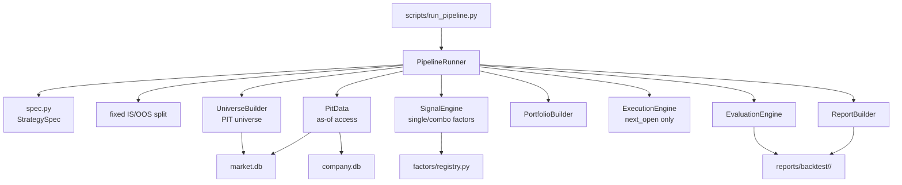

# Backtest Factor Validation V3 Implementation Plan

> **For Claude:** REQUIRED SUB-SKILL: Use superpowers:executing-plans to implement this plan task-by-task.
> **Status:** V3 draft, narrowed from `2026-04-11-backtest-pipeline-design.md`
> **Supersedes:** the original 12-phase universal pipeline design for initial implementation scope

**Confidence: 92%**
**不确定点**: `historical_market_cap` 的实际覆盖边界需要实现前再核验；`backtest/engine.py` 中哪些逻辑应原样复用、哪些应提炼为 primitive，需要在 Task 4 时以测试结果为准。

**Goal:** 构建一条聚焦的因子验证流水线，只服务于美股横截面单因子和 2-3 因子组合策略的有效性验证。

**Tech Stack:** Python, Pandas, Pydantic, SQLite, pytest, existing `backtest/` modules

---

## Architecture（架构图）



> 一句话解释：V3 只保留一条从 `spec` 到 `report` 的最小研究闭环，不追求“一统所有策略类型”，只追求把简单因子验证做干净。

## Business Flow（业务流程图）


> 一句话解释：用户只需要定义“因子、组合方式、调仓规则、时间段”，系统负责完成一整套规范化验证。

## Alternatives Considered（替代方案）

| 方案 | 优势 | 劣势 | 选择理由 |
|------|------|------|----------|
| A. 聚焦型 V3 流水线（推荐） | 正好覆盖单因子/2-3 因子组合；实现成本低；最容易先跑通 | 暂不支持 timing/event-driven/ledger/DB 血缘 | 最贴合当前目标 |
| B. 原版 12-phase 大一统平台 | 未来扩展空间大；治理能力完整 | 明显过度设计；实现周期长；容易把研究问题工程化 | 不是当前最短路径 |
| C. 继续补丁现有 `run_rs_backtest.py` + `run_factor_study.py` | 改动最小 | 入口继续分裂；组合因子表达差；报告格式继续不统一 | 只能拖延，不会真正解决凌乱问题 |

## Risks & Mitigation（风险自证）

- **最大风险:** 过度简化后把方法学纪律一起删掉，最后“更顺手了，但更不可信”。
- **为什么不用更简单的做法:** 继续在旧脚本上叠 patch 看似更快，但你现在要解决的核心问题就是入口、spec、报告、组合逻辑分散。没有一条统一路径，这个问题不会自己消失。
- **为什么不用更复杂的做法:** 你当前目标不是建基金内部研究平台，而是验证简单因子和小规模因子组合。先把 80% 价值的 20% 系统搭出来，再考虑 ledger / lineage / Forge bridge。
- **回滚方案:** V3 初期不移动旧模块、不删旧脚本。新路径独立存在，验证稳定前不替换旧入口。

## Acceptance Criteria（验收标准）

- [ ] 一个 YAML spec 能表达单因子策略
- [ ] 一个 YAML spec 能表达 2-3 因子组合策略
- [ ] 流水线严格先切 IS/OOS；V3 的 `rank_pct` / `zscore` 明确为横截面 per-rebalance-date 变换
- [ ] 默认只支持 `next_open` 执行，不允许 `same_close`
- [ ] 输出统一产物：`signals_is.parquet`、`signals_oos.parquet`、`nav_is.parquet`、`nav_oos.parquet`、`metrics.json`、`report.md`、`report.html`
- [ ] 至少 2 个真实样例 spec 可跑通：`rs_126d` 单因子、`rs_126d + pmarp + attention_zscore` 三因子组合
- [ ] `tests/pipeline/` 全绿，且现有旧测试无回归

---

## 1. V3 Scope（范围重定义）

### 1.1 支持什么

V3 只支持以下研究问题：

1. 美股横截面单因子是否有预测力
2. 美股横截面 2-3 因子组合是否优于单因子
3. 这些因子在简单选股策略里，扣成本后是否还有可接受表现

### 1.2 明确不做什么

以下内容全部移出 V3 首版范围：

- `time_series` 策略
- `event_driven` 策略
- 基本面因子（如 ROE / leverage / revision）；这类因子要先解决 `filing_date` vs `restated` 的 PIT 口径
- holdout ledger 消耗预算系统
- SQLite `runs.db` 血缘归档
- Forge → Pipeline 自动桥接
- Obsidian 自动同步
- phase class hierarchy / `Phase` ABC
- 自动 `SUPPORT / PAPER_TRADE / REJECT` 机器裁决
- 批量迁移 legacy 文件

### 1.3 V3 的核心原则

1. **先切分，再拟合**：IS/OOS split 在任何标准化、组合、调参之前完成
2. **只做横截面**：避免一套 spec 同时兼容三种策略族
3. **组合是一等公民**：组合 2-3 因子不是“外面手搓”，而是 spec 原生能力
4. **只保留必要治理**：保留 PIT、防前视、excess return、IS/OOS；暂缓 ledger / lineage / anti-rerun
5. **旧路径不动**：新路径稳定前，不做 mass move

---

## 2. V3 Runtime Design（运行设计）

### 2.1 简化为 6 个固定步骤

V3 不再实现 12 个 phase class，而是 `PipelineRunner.run()` 顺序调用 6 个步骤函数：

1. `load_and_validate_spec()`
2. `build_period_split()`
3. `build_universe_and_data()`
4. `compute_signals()`
5. `run_backtests()`
6. `evaluate_and_report()`

这样做的目的很简单：现在还不需要 phase 框架，先把研究协议跑通。

### 2.2 运行产物目录

每次运行只写文件，不写数据库：

```text
reports/backtest/<run_id>/
├── spec.yaml
├── split.json
├── universe.parquet
├── signals_is.parquet
├── signals_oos.parquet
├── target_positions_is.parquet
├── target_positions_oos.parquet
├── nav_is.parquet
├── nav_oos.parquet
├── trades_is.parquet
├── trades_oos.parquet
├── metrics.json
├── report.md
└── report.html
```

### 2.3 决策方式

V3 不输出自动 `SUPPORT / REJECT`。

V3 只输出一组清晰的 gate，最终判断由 Boss 做：

- OOS Sharpe 是否为正
- OOS 是否明显弱于 IS
- Top-bottom spread 是否稳定为正
- turnover 是否在可接受范围
- 扣成本后 alpha/excess return 是否仍存在

理由：你现在需要的是“看懂有效性”，不是把判断交给一个脆弱的启发式裁决器。

---

## 3. Spec Design（Spec 设计）

### 3.1 Spec Schema

文件：`backtest/pipeline/spec.py`

```python
class FactorInput(BaseModel):
    name: str
    params: dict = {}
    transform: Literal["raw", "rank_pct", "zscore"]
    weight: float = 1.0
    direction: Literal["higher_is_better", "lower_is_better"] = "higher_is_better"

class ComboSpec(BaseModel):
    method: Literal["single", "weighted_sum", "rank_average"]

class UniverseSpec(BaseModel):
    market_cap_min_usd: float
    exclude_sectors: list[str] = []
    min_names: int = 20

class PortfolioSpec(BaseModel):
    selection: Literal["top_n", "threshold"]
    top_n: int | None = None
    threshold: float | None = None
    rebalance: Literal["weekly", "monthly_first_trading_day"]
    weighting: Literal["equal", "inv_vol"]
    vol_lookback_days: int = 60
    max_position_weight: float
    max_annual_turnover: float | None = None

class ExecutionSpec(BaseModel):
    timing: Literal["next_open"] = "next_open"
    transaction_cost_bps: float
    spread_bps: float = 0.0

class EvaluationSpec(BaseModel):
    newey_west_lag_days: int | None = None

class PeriodSpec(BaseModel):
    start: date
    train_end: date
    test_end: date

class StrategySpec(BaseModel):
    spec_id: str
    benchmark: str
    universe: UniverseSpec
    factors: list[FactorInput]   # 1 to 3 only
    combo: ComboSpec
    portfolio: PortfolioSpec
    execution: ExecutionSpec
    evaluation: EvaluationSpec = EvaluationSpec()
    period: PeriodSpec
    notes: str | None = None
```

### 3.2 关键约束

- `factors` 数量限制为 `1 <= n <= 3`
- `timing` 只允许 `next_open`
- `train_end < test_end`
- `top_n` 和 `threshold` 二选一
- `combo.method == "single"` 时，`factors` 必须正好 1 个
- `weighting == "inv_vol"` 时，`vol_lookback_days > 0`
- `evaluation.newey_west_lag_days is None` 时，默认按 rebalance cadence 推断：`weekly -> 5`, `monthly_first_trading_day -> 21`

### 3.3 YAML 示例

```yaml
spec_id: "us_large_combo_v1"
benchmark: "SPY"

universe:
  market_cap_min_usd: 10000000000
  exclude_sectors: ["Energy", "Utilities", "Real Estate"]
  min_names: 30

factors:
  - name: "rs_126d"
    params: {lookback_days: 126}
    transform: "rank_pct"
    weight: 0.5
    direction: "higher_is_better"
  - name: "pmarp_20_150"
    params: {}
    transform: "zscore"
    weight: 0.3
    direction: "higher_is_better"
  - name: "attention_zscore"
    params: {}
    transform: "zscore"
    weight: 0.2
    direction: "higher_is_better"

combo:
  method: "weighted_sum"

portfolio:
  selection: "top_n"
  top_n: 10
  rebalance: "monthly_first_trading_day"
  weighting: "inv_vol"
  vol_lookback_days: 60
  max_position_weight: 0.15
  max_annual_turnover: 6.0

execution:
  timing: "next_open"
  transaction_cost_bps: 5.0
  spread_bps: 5.0

evaluation:
  newey_west_lag_days: null

period:
  start: "2015-01-01"
  train_end: "2023-12-31"
  test_end: "2025-12-31"
```

---

## 4. Module Layout（模块布局）

### 4.1 新目录结构

```text
backtest/pipeline/
├── __init__.py
├── spec.py
├── runner.py
├── types.py
├── report.py
├── factors/
│   ├── _base.py
│   ├── registry.py
│   └── {factor files}
└── primitives/
    ├── pit_data.py
    ├── universe_builder.py
    ├── signal_engine.py
    ├── portfolio_builder.py
    ├── execution.py
    └── evaluation.py

scripts/
└── run_pipeline.py

tests/pipeline/
├── test_spec.py
├── test_runner.py
├── test_pit_data.py
├── test_universe_builder.py
├── test_signal_engine.py
├── test_portfolio_builder.py
├── test_execution.py
├── test_evaluation.py
└── test_e2e_pipeline.py
```

### 4.2 Legacy 处理原则

V3 首版不移动这些文件：

- `backtest/engine.py`
- `backtest/factor_study/*`
- `backtest/timing/*`
- `scripts/run_rs_backtest.py`
- `scripts/run_factor_study.py`
- `scripts/run_timing_study.py`

只允许“读取和复用逻辑”，不做 mass rename。等 V3 稳定后再讨论 legacy 收口。

---

## 5. Core Components（核心组件）

### 5.1 `PitData`

职责：

- 提供 `as_of()` / `window()` 只读接口
- 禁止直接返回全量原始 dataframe
- 所有因子计算都必须通过它读数据

V3 只保留运行时防前视，不做 AST 静态审计。原因：当前目标是先把主路径跑通，静态审计可放到后续版本。

### 5.2 `UniverseBuilder`

职责：

- 基于 `historical_market_cap` 按 rebalance date 重建 PIT 股票池
- 输出 `universe_df = {date, symbol, market_cap, sector}`

V3 只支持按 rebalance day 重建，不支持日频动态进出池。

覆盖边界和 `min_names` 的行为在 V3 中明确如下：

- **完全覆盖**：正常运行
- **样本头部部分缺失**：将有效起点顺延到“第一个满足覆盖要求的 rebalance date”，写入 `split.json` 和报告 warning
- **样本中间有断裂或完全无覆盖**：abort
- **某个 rebalance date 的股票数 < `min_names`**：跳过该调仓日并记录 warning
- **若被跳过的调仓日 > 全部计划调仓日的 10%**：abort

### 5.3 `SignalEngine`

职责：

1. 按 rebalance date 对 universe 内股票计算每个 factor
2. 对每个 rebalance date 横截面做 `rank_pct` / `zscore`
3. 组合成 `combo_signal`
4. 输出单因子与组合因子的中间结果，供报告使用

组合方式只支持：

- `single`
- `weighted_sum`
- `rank_average`

V3 里 `rank_pct` 和 `zscore` 都明确是 **横截面 per-rebalance-date** 变换：

- `rank_pct`：当天 universe 内按因子值做百分位排名
- `zscore`：当天 universe 内按因子值做横截面 z-score

因此，V3 的这两种 transform **不涉及时间序列 fit/transform 分离**。先切 IS/OOS 的原因，是为了给未来有状态的 transform 留出清晰协议边界，也避免实现者误把时间序列拟合塞进当前版本。

### 5.4 `PortfolioBuilder`

职责：

- 把 `combo_signal` 转成 `target_positions`
- 支持 `top_n` 或 `threshold`
- 支持 `equal` / `inv_vol`
- `inv_vol` 使用 `portfolio.vol_lookback_days`

### 5.5 `ExecutionEngine`

职责：

- 读取 `target_positions`
- 用 `next_open` 模拟调仓
- 计算简单成本：`transaction_cost_bps + spread_bps`
- 输出 `nav`, `trades`, `positions_daily`

V3 不做：

- market impact model
- liquidity gate
- same-close execution

这些以后可以加，但不是“简单因子验证”必需品。

### 5.6 `EvaluationEngine`

V3 评估分两层：

**因子层**
- IC mean
- IC t-stat（Newey-West 调整）
- 分组收益 / top-bottom spread
- IC decay
- excess return vs benchmark

**策略层**
- CAGR
- annualized vol
- Sharpe
- max drawdown
- annual turnover
- excess CAGR / information ratio vs benchmark

V3 只保留你现在真正会看的指标，不追求“指标百科全书”。

Newey-West 的 lag 规则在 V3 中固定如下：

- 若 `evaluation.newey_west_lag_days` 显式提供，则使用该值
- 若未提供，则按 rebalance cadence 推断：`weekly -> 5`, `monthly_first_trading_day -> 21`

---

## 6. IS/OOS Protocol（研究纪律）

### 6.1 关键规则

V3 必须遵守下面这条协议：

1. 先按 `train_end` 切出 IS / OOS
2. V3 的 `rank_pct` / `zscore` 都是横截面 per-rebalance-date 计算，每个调仓日独立完成
3. 当前版本不允许引入需要时间序列拟合参数的 transform
4. 若后续加入历史分位数、rolling zscore 等有状态 transform，必须单独实现“fit on IS / apply on OOS”或严格的 rolling point-in-time 版本
5. 因子组合权重来自 spec，不能在回测时搜索

### 6.2 为什么不用 holdout ledger

原因不是“不重要”，而是“现在太早”：

- 你当前主要矛盾是研究路径混乱，不是多人协作滥用 holdout
- ledger 会显著增加实现复杂度和测试复杂度
- 单用户本地研究先用固定 OOS 就够

V3 先把协议做对，V4 再考虑 holdout governance。

---

## 7. Report Design（报告设计）

### 7.1 报告结构

1. Strategy summary
2. Spec snapshot
3. Universe summary
4. Factor metrics
5. Combo signal metrics
6. IS backtest
7. OOS backtest
8. IS vs OOS comparison
9. Key gates

### 7.2 Key Gates

报告首页显示 5 个 gate：

- `OOS Sharpe > 0`
- `OOS excess CAGR > 0`
- `OOS top-bottom spread > 0`
- `OOS / IS Sharpe >= 0.5`
- `Annual turnover <= portfolio.max_annual_turnover`（若 spec 提供）

只展示，不自动下 verdict。

---

## 8. Implementation Tasks（实施任务）

### Task 1: Spec + Runner Skeleton

**Files:**
- Create: `backtest/pipeline/spec.py`
- Create: `backtest/pipeline/types.py`
- Create: `backtest/pipeline/runner.py`
- Create: `scripts/run_pipeline.py`
- Test: `tests/pipeline/test_spec.py`
- Test: `tests/pipeline/test_runner.py`

**Steps:**
- [ ] 定义 `StrategySpec`
- [ ] 写 spec 校验测试
- [ ] 搭出 `PipelineRunner.run()` 六步骨架
- [ ] 实现 CLI 参数：`python scripts/run_pipeline.py <spec.yaml>`
- [ ] 跑 `pytest tests/pipeline/test_spec.py tests/pipeline/test_runner.py -v`

### Task 2: PIT Data + Universe

**Files:**
- Create: `backtest/pipeline/primitives/pit_data.py`
- Create: `backtest/pipeline/primitives/universe_builder.py`
- Test: `tests/pipeline/test_pit_data.py`
- Test: `tests/pipeline/test_universe_builder.py`

**Steps:**
- [ ] 实现 `PitData.as_of()` / `window()`
- [ ] 实现按 rebalance date 的 universe 重建
- [ ] 明确实现 `historical_market_cap` 头部缺失顺延、内部断裂 abort、`min_names` skip+warn 的规则
- [ ] 写 fixture 验证 PIT 行为
- [ ] 跑 `pytest tests/pipeline/test_pit_data.py tests/pipeline/test_universe_builder.py -v`

### Task 3: Factors + Combination

**Files:**
- Create: `backtest/pipeline/factors/_base.py`
- Create: `backtest/pipeline/factors/registry.py`
- Create: `backtest/pipeline/primitives/signal_engine.py`
- Modify or wrap: existing factor logic for `rs_126d`, `pmarp_20_150`, `attention_zscore`
- Test: `tests/pipeline/test_signal_engine.py`

**Steps:**
- [ ] 定义统一 factor interface
- [ ] 注册首批 3 个真实因子：`rs_126d`、`pmarp_20_150`、`attention_zscore`
- [ ] 实现 `single / weighted_sum / rank_average`
- [ ] 验证 `rank_pct` / `zscore` 的横截面 per-date 语义
- [ ] 跑 `pytest tests/pipeline/test_signal_engine.py -v`

### Task 4: Portfolio + Execution

**Files:**
- Create: `backtest/pipeline/primitives/portfolio_builder.py`
- Create: `backtest/pipeline/primitives/execution.py`
- Test: `tests/pipeline/test_portfolio_builder.py`
- Test: `tests/pipeline/test_execution.py`

**Steps:**
- [ ] 抽出最小 `target_positions` 生成逻辑
- [ ] 从现有 `backtest/engine.py` 复用或提炼 NAV loop
- [ ] 固定 `next_open`
- [ ] 加入简单成本模型
- [ ] 跑 `pytest tests/pipeline/test_portfolio_builder.py tests/pipeline/test_execution.py -v`

### Task 5: Evaluation + Report

**Files:**
- Create: `backtest/pipeline/primitives/evaluation.py`
- Create: `backtest/pipeline/report.py`
- Test: `tests/pipeline/test_evaluation.py`

**Steps:**
- [ ] 复用现有因子研究中的 excess return / IC 逻辑
- [ ] 把 IC t-stat 升级为 Newey-West 调整，并实现 lag 默认推断逻辑
- [ ] 输出 IS / OOS 对比指标
- [ ] 生成 Markdown 和 HTML 报告
- [ ] 跑 `pytest tests/pipeline/test_evaluation.py -v`

### Task 6: End-to-End + Sample Specs

**Files:**
- Create: `tests/pipeline/test_e2e_pipeline.py`
- Create: `backtest/specs/rs_126d_single.yaml`
- Create: `backtest/specs/rs_pmarp_attention_combo.yaml`

**Steps:**
- [ ] 写单因子 E2E
- [ ] 写三因子组合 E2E
- [ ] 验证产物目录完整
- [ ] 验证旧测试不回归
- [ ] 跑 `pytest tests/pipeline/test_e2e_pipeline.py -v`

---

## 9. Validation Commands（验证命令）

```bash
.venv/bin/python -m pytest tests/pipeline/test_spec.py -v
.venv/bin/python -m pytest tests/pipeline/test_pit_data.py tests/pipeline/test_universe_builder.py -v
.venv/bin/python -m pytest tests/pipeline/test_signal_engine.py -v
.venv/bin/python -m pytest tests/pipeline/test_portfolio_builder.py tests/pipeline/test_execution.py -v
.venv/bin/python -m pytest tests/pipeline/test_evaluation.py -v
.venv/bin/python -m pytest tests/pipeline/test_e2e_pipeline.py -v
.venv/bin/python -m pytest tests/test_backtest tests/test_factor_study -v
```

---

## 10. Success Definition（成功定义）

V3 成功，不是因为它“架构优雅”，而是因为它做到下面三件事：

1. Boss 写一个 spec，就能验证单因子或 2-3 因子组合
2. 研究协议是可信的，不靠研究员自觉防前视
3. 输出结果统一，旧的“回测一套、因子研究一套、报告又一套”的混乱状态结束

---

Plan 已写好，请查看架构图和流程图是否符合预期。您可以直接在文件中加批注，我会逐条处理。如果不想批注也可以直接告诉我哪里要改。
