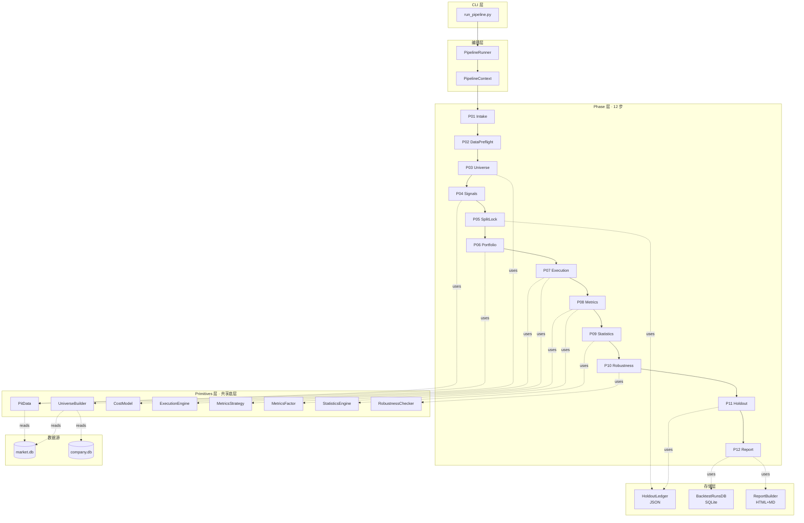
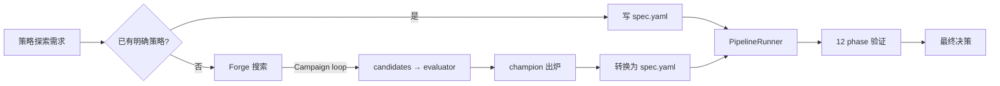

# 回测流水线架构设计

> **状态**：设计草稿，待 Boss / Codex 审查
> **日期**：2026-04-11
> **类型**：工程架构文档（不讨论"为什么"，只讨论"怎么建"）
> **对齐**：北极星 — 离线 R&D 实验室 / Backtest Desk

---

## 0. 文档定位

这是一份**工程架构文档**。目标读者是写代码的人：Claude 自己实施时需要照着做，Codex 评审时需要判断是否合理。

文档不讨论"历史数据回测为什么天然不可靠"这类原理问题——那些假定读者已知。如果需要背景说明，见附录 A。

### 0.1 设计目标（5 条不变式）

整条流水线是围绕这 5 条不变式展开的：

1. **Spec 驱动**：唯一入口是 `run_pipeline.py <spec.yaml>`。所有回测参数必须在 spec 里显式声明，代码不做任何"默认补全"
2. **Phase 固化**：12 个 phase 按固定顺序执行。每个 phase 是一个独立的 class，有明确的输入输出契约
3. **保留区物理隔离**：通过 `PitData` 包装器在代码层面物理切断对保留区数据的访问，不依赖研究员自觉
4. **同 spec 不复跑**：spec 通过 hash 指纹追踪；同一个 hash 第二次跑要显式加 `--allow-rerun`
5. **结构化输出**：每个 run 输出 HTML + Markdown 报告 + SQLite 归档条目，格式固定

### 0.2 现有模块问题陈述

| 现有模块 | 问题 |
|---|---|
| `backtest/engine.py` | RS 专用，包含 regime filter / inv_vol weighting 等通用逻辑但和 RS 强耦合，无法被其他策略类型复用 |
| `backtest/factor_study/` | 有 Factor ABC 接口但仅用注释约定"不得访问未来数据"，代码层无强制 |
| `backtest/timing/` | 时间序列择时和横截面因子研究走两条完全不同的代码路径，无共享底层 |
| `backtest/config.py` | `BacktestConfig` 和 `FactorStudyConfig` 是两个独立的 dataclass，反映出"没有统一 spec"的历史 |
| `scripts/run_rs_backtest.py` / `run_factor_study.py` / `run_timing_study.py` | 三个 CLI 入口，每个有自己的参数格式和报告输出 |

这份重构把上述问题统一解决：**一条流水线 + 一个 spec 格式 + 一套 primitive + 一份报告**。

---

## 1. 系统总览

### 1.1 架构分层



### 1.2 运行模型

```
YAML spec
  │
  ▼
PipelineRunner
  │
  ├─── Phase 1: validate spec  ──┐
  ├─── Phase 2: pre-flight data ─┤
  ├─── ...                       ├── each phase reads/writes
  └─── Phase 12: report          ┘   PipelineContext
        │
        ▼
  artifacts/
    ├── report.html
    ├── report.md
    ├── metrics.json
    ├── nav.parquet
    ├── positions.parquet
    └── spec.yaml (snapshot)

  data/backtest_runs.db  ←  index row inserted
  backtest/pipeline/storage/holdout_ledger.json  ←  consumption updated
```

---

## 2. 核心接口契约

以下四个接口定义了整条流水线的 API 边界。它们定死后，每个 phase 和 primitive 的实现者都只需要遵守接口，不需要了解其他模块细节。

### 2.1 `StrategyConfig` — 策略说明书 Pydantic Schema

位置：`backtest/pipeline/spec.py`

```python
from pydantic import BaseModel, Field, field_validator
from typing import Literal
from datetime import date

class UniverseSpec(BaseModel):
    method: Literal["pit_marketcap"]
    market_cap_min_usd: float
    exclude_sectors: list[str] = []
    accept_survivorship_haircut: bool = False

class SignalSpec(BaseModel):
    factor_name: str                      # maps to registered factor class
    params: dict                          # factor-specific params
    direction: Literal["higher_is_better", "lower_is_better"]

class PortfolioRules(BaseModel):
    selection: Literal["top_n", "threshold", "signal_based"]
    n: int | None = None
    threshold: float | None = None
    rebalance: Literal["daily", "weekly", "monthly_first_trading_day", "event_driven"]
    weighting: Literal["equal", "rank", "inv_vol", "signal_weighted"]
    max_position_weight: float
    max_sector_weight: float | None = None

class ExecutionRules(BaseModel):
    timing: Literal["next_open", "same_close"]
    liquidity_gate_adv_pct: float = 0.20

class CostModel(BaseModel):
    commission_per_share_usd: float
    spread_bps_by_cap: dict[str, float]   # {"large": 5, "mid": 10, "small": 20}
    market_impact_coef: float

class Period(BaseModel):
    start: date
    train_end: date
    holdout_end: date

    @field_validator("holdout_end")
    def holdout_after_train(cls, v, info):
        if v <= info.data["train_end"]:
            raise ValueError("holdout_end must be after train_end")
        return v

class StrategyConfig(BaseModel):
    # Metadata
    spec_version: str = "1.0"
    spec_id: str
    parent_spec_hash: str | None = None

    # Required explanation fields
    hypothesis: str = Field(..., min_length=20)
    economic_rationale: str = Field(..., min_length=30)
    expected_holding_period_days: int
    expected_capacity_usd: float

    # Strategy structure
    strategy_type: Literal["cross_sectional", "time_series", "event_driven"]
    universe_spec: UniverseSpec
    signal_spec: SignalSpec
    portfolio_rules: PortfolioRules
    execution_rules: ExecutionRules
    cost_model: CostModel
    benchmark: str                        # e.g. "SPY"
    period: Period
    tags: list[str] = []

    def compute_hash(self) -> str:
        """SHA-256 of serialized spec (sorted keys), used as spec_hash."""
        ...
```

完整 YAML 示例见附录 B。

### 2.2 `Phase` — Phase 基类

位置：`backtest/pipeline/phases/_base.py`

```python
from abc import ABC, abstractmethod
from dataclasses import dataclass
from typing import Any

@dataclass
class PhaseResult:
    status: Literal["ok", "warning", "abort"]
    message: str                          # human-readable summary
    artifacts: dict[str, Any]             # phase-specific outputs
    metrics: dict[str, float] = None      # optional numeric outputs

class Phase(ABC):
    name: str                             # e.g. "P04_Signals"
    phase_id: int                         # 1-12

    @abstractmethod
    def run(self, ctx: "PipelineContext") -> PhaseResult:
        """Execute this phase. Read from and write to ctx."""
        ...

    def validate_preconditions(self, ctx: "PipelineContext") -> None:
        """Check that previous phases produced what this phase needs.
        Raises PreconditionError on failure."""
        ...
```

**中止语义**：`PhaseResult.status == "abort"` 会让 `PipelineRunner` 立即停止流水线并把已完成的 artifact 归档为 "aborted run"。

**错误处理**：
- `abort` — 遇到无法继续的问题（数据缺失、代码 bug、spec 不合法）
- `warning` — 可以继续但需要在最终报告标红（如 forward test Sharpe 比率 < 0.7）
- `ok` — 正常完成

### 2.3 `PipelineContext` — 运行时状态容器

位置：`backtest/pipeline/runner.py`

```python
@dataclass
class PipelineContext:
    # Immutable configuration
    spec: StrategyConfig
    spec_hash: str
    run_id: str                           # UUID for this run
    artifact_dir: Path                    # where this run writes output

    # Phase outputs (filled in as phases run)
    universe_trajectory: pd.DataFrame | None = None       # {date, symbol} membership
    pit_data: PitData | None = None                        # signal access wrapper
    signals: pd.DataFrame | None = None                   # {date, symbol, value}
    positions: pd.DataFrame | None = None                 # {date, symbol, weight}
    nav: pd.DataFrame | None = None                       # {date, nav, cash, holdings_value}
    trades: pd.DataFrame | None = None                    # execution log

    metrics_strategy: dict[str, float] = field(default_factory=dict)
    metrics_factor: dict[str, Any] = field(default_factory=dict)
    statistics: dict[str, Any] = field(default_factory=dict)
    robustness: dict[str, Any] = field(default_factory=dict)
    holdout_results: dict[str, Any] | None = None

    # Accumulated status from phases
    warnings: list[str] = field(default_factory=list)
```

Context 是唯一的跨 phase 通信通道。phase 之间不直接通过函数返回值通信——所有产物写到 context，下游 phase 从 context 读。

### 2.4 `PipelineRunner` — 编排器

位置：`backtest/pipeline/runner.py`

```python
class PipelineRunner:
    def __init__(self, spec_path: Path, allow_rerun: bool = False):
        self.spec = StrategyConfig.from_yaml(spec_path)
        self.spec_hash = self.spec.compute_hash()
        self.allow_rerun = allow_rerun

    def run(self) -> RunResult:
        ctx = self._init_context()
        phases: list[Phase] = [
            P01_Intake(), P02_DataPreflight(), P03_Universe(),
            P04_Signals(), P05_SplitLock(), P06_Portfolio(),
            P07_Execution(), P08_Metrics(), P09_Statistics(),
            P10_Robustness(), P11_Holdout(), P12_Report(),
        ]

        for phase in phases:
            result = phase.run(ctx)
            self._persist_phase_output(phase, result)

            if result.status == "abort":
                self._handle_abort(phase, result)
                return RunResult(status="aborted", ctx=ctx)

            if result.status == "warning":
                ctx.warnings.append(f"{phase.name}: {result.message}")

        return RunResult(status="completed", ctx=ctx)
```

---

## 3. 模块组织

### 3.1 新目录结构

```
backtest/
├── pipeline/                          # 【新】主流水线，唯一 production 路径
│   ├── __init__.py
│   ├── spec.py                        # StrategyConfig Pydantic schema
│   ├── runner.py                      # PipelineRunner + PipelineContext
│   ├── exceptions.py                  # PreconditionError, AbortError
│   ├── phases/
│   │   ├── _base.py                   # Phase ABC + PhaseResult
│   │   ├── p01_intake.py
│   │   ├── p02_data_preflight.py
│   │   ├── p03_universe.py
│   │   ├── p04_signals.py
│   │   ├── p05_split_lock.py
│   │   ├── p06_portfolio.py
│   │   ├── p07_execution.py
│   │   ├── p08_metrics.py
│   │   ├── p09_statistics.py
│   │   ├── p10_robustness.py
│   │   ├── p11_holdout.py
│   │   └── p12_report.py
│   ├── primitives/
│   │   ├── pit_data.py                # PitData wrapper (see §5.1)
│   │   ├── universe_builder.py
│   │   ├── cost_model.py
│   │   ├── execution.py
│   │   ├── metrics_strategy.py
│   │   ├── metrics_factor.py
│   │   ├── statistics.py
│   │   └── robustness.py
│   ├── factors/                       # factor registry
│   │   ├── _base.py                   # Factor ABC (migrated from factor_study/protocol.py)
│   │   ├── registry.py                # name → class
│   │   └── {concrete factors...}
│   └── storage/
│       ├── holdout_ledger.py          # §6.1
│       ├── runs_db.py                 # §6.2
│       └── report_builder.py          # §6.3
│
├── legacy/                            # 【新】现有模块降级区
│   ├── engine.py                      # from backtest/engine.py
│   ├── factor_study/                  # from backtest/factor_study/
│   ├── timing/                        # from backtest/timing/
│   ├── adapters/                      # from backtest/adapters/
│   ├── metrics.py                     # from backtest/metrics.py
│   ├── portfolio.py                   # from backtest/portfolio.py
│   └── rebalancer.py                  # from backtest/rebalancer.py
│
└── README.md                          # Points to pipeline/ as entry

scripts/
├── run_pipeline.py                    # 【新】唯一 production CLI
└── legacy/
    ├── run_rs_backtest.py             # moved, marked "exploratory only"
    ├── run_factor_study.py
    └── run_timing_study.py
```

### 3.2 模块职责矩阵

| 模块 | 职责 | 不做什么 |
|---|---|---|
| `pipeline/spec.py` | Spec schema、YAML 加载、hash 计算 | 不执行任何业务逻辑 |
| `pipeline/runner.py` | Phase 编排、context 管理、错误处理 | 不知道具体 phase 在做什么 |
| `pipeline/phases/*.py` | 单个 phase 的业务流程 | 不直接访问数据库（通过 primitive） |
| `pipeline/primitives/*.py` | 纯函数/纯类，可独立单元测试 | 不依赖 context 或 spec 结构 |
| `pipeline/factors/*.py` | 因子注册与实现 | 不知道 pipeline 是什么 |
| `pipeline/storage/*.py` | 持久化（账本、数据库、报告） | 不做业务计算 |
| `legacy/` | 保留旧代码用于向后兼容 | 不被新 production 路径调用 |

### 3.3 依赖方向

```
CLI → runner → phases → primitives → data sources
                │
                └→ storage

factors 被 phases (P04) 和 primitives (metrics_factor) 共用。

严禁反向依赖：primitives 不依赖 phases，phases 不依赖 runner。
```

---

## 4. Phase 规格表

按固定顺序 P01 → P12。每个 phase 的字段含义：

- **Input**：从 `ctx` 读什么
- **Primitives**：用到哪些共享底层
- **Output**：往 `ctx` 写什么 + 落盘什么
- **Abort 条件**：什么情况返回 `status="abort"`

### P01 · Intake（策略说明书验收）

| 项 | 内容 |
|---|---|
| Input | `spec`（原始 YAML 解析后）、`allow_rerun` flag |
| Primitives | 无（纯校验） |
| Output | `ctx.spec_hash`、`ctx.artifact_dir`（创建目录）；落盘 `spec.yaml` snapshot |
| Abort 条件 | Pydantic 校验失败 / `economic_rationale` 关键词黑名单命中 / spec_hash 已存在且未 `--allow-rerun` |

### P02 · DataPreflight（数据体检）

| 项 | 内容 |
|---|---|
| Input | `spec.period`, `spec.universe_spec`, `spec.benchmark` |
| Primitives | 无（直接查 `market.db` / `company.db`） |
| Output | `preflight_report`（四项检查的结果）落盘到 `artifact_dir/preflight.json` |
| 检查项 | (1) 历史市值覆盖率 (2) 基本面 PIT 一致性 (3) 价格复权一致性 (4) 基准数据覆盖 |
| Abort 条件 | 任一检查红灯（除非 spec 显式 `accept_survivorship_haircut: true`） |

### P03 · Universe（股票池按时点重建）

| 项 | 内容 |
|---|---|
| Input | `spec.universe_spec`, `spec.period` |
| Primitives | `UniverseBuilder` |
| Output | `ctx.universe_trajectory` (DataFrame: `{date, symbol, market_cap, sector, in_pool}`)；落盘 `universe_trajectory.parquet` + `universe_summary.json`（每月进出统计） |
| Abort 条件 | 历史市值数据不足且未声明 haircut 接受 / 任意月份池成员 < 20 |

### P04 · Signals（因子计算 + 时点审计）

| 项 | 内容 |
|---|---|
| Input | `spec.signal_spec`, `ctx.universe_trajectory` |
| Primitives | `PitData`, `FactorRegistry` |
| Output | `ctx.signals` (DataFrame: `{date, symbol, signal_value, signal_ts}`)；`ctx.pit_data`（供下游只读访问）；落盘 `signals.parquet` |
| Abort 条件 | 因子函数绕过 `PitData` / first-bar NaN 断言失败 / signal timestamp 晚于 trading date |

### P05 · SplitLock（主体/保留区物理切分）

| 项 | 内容 |
|---|---|
| Input | `ctx.spec.period`, `ctx.spec_hash` |
| Primitives | `HoldoutLedger` |
| Output | 把 `ctx.pit_data` 切成 `in_sample_pit` + `holdout_pit`（后者被 lock，只有 P11 能解锁）；落盘 `split_manifest.json` |
| Abort 条件 | 保留区账本已消耗 ≥ 3 次 / 保留区时段 < 60 trading days |

### P06 · Portfolio（组合构建）

| 项 | 内容 |
|---|---|
| Input | `ctx.signals`, `ctx.universe_trajectory`, `ctx.spec.portfolio_rules` |
| Primitives | 按 `strategy_type` 分派：`CrossSectionalBuilder` / `TimeSeriesBuilder` / `EventDrivenBuilder`（均位于 `primitives/portfolio.py`） |
| Output | `ctx.target_positions` (DataFrame: `{rebalance_date, symbol, target_weight}`)；落盘 `target_positions.parquet` |
| Self-check | 比对实际 turnover / concentration / 换手 vs spec 声明，偏离 >20% 产生 warning |
| Abort 条件 | 偏离 >50% |

### P07 · Execution（模拟成交）

| 项 | 内容 |
|---|---|
| Input | `ctx.target_positions`, `ctx.pit_data.in_sample`, `spec.execution_rules`, `spec.cost_model` |
| Primitives | `ExecutionEngine`, `CostModel` |
| Output | `ctx.nav`, `ctx.trades`, `ctx.positions_daily`；落盘 `nav.parquet`, `trades.parquet`, `positions_daily.parquet` |
| Abort 条件 | NaN 价格 / 流动性门槛导致 > 30% 的调仓单被跳过 |

### P08 · Metrics（策略层 + 因子层指标）

| 项 | 内容 |
|---|---|
| Input | `ctx.nav`, `ctx.trades`, `ctx.signals`, `ctx.universe_trajectory`, `spec.benchmark` |
| Primitives | `MetricsStrategy`, `MetricsFactor`（仅 `cross_sectional` / `event_driven` 启用 factor 层） |
| Output | `ctx.metrics_strategy`（CAGR/Sharpe/MDD/turnover/win_rate）、`ctx.metrics_factor`（IC 时间序列、十分组单调性、衰减曲线、去因子 alpha）；落盘 `metrics.json` |
| Abort 条件 | 无（只算数字） |

### P09 · Statistics（显著性检验）

| 项 | 内容 |
|---|---|
| Input | `ctx.nav`, `ctx.metrics_strategy`, `spec.expected_holding_period_days` |
| Primitives | `StatisticsEngine` |
| Output | `ctx.statistics`（Sharpe 置信区间 / 环境分段 t-stat / 最近 12m t-stat）；落盘 `statistics.json` |
| Abort 条件 | 无 |

### P10 · Robustness（硬稳健测试）

| 项 | 内容 |
|---|---|
| Input | `ctx.pit_data.in_sample`, `ctx.signals`, `ctx.universe_trajectory`, `spec` |
| Primitives | `RobustnessChecker` |
| Output | `ctx.robustness`（三条硬检验结果 + 参数扰动附录）；落盘 `robustness.json` |
| Warning 条件 | 60/40 前向测试 Sharpe 比率 < 0.7 / 子采样 Sharpe std > 0.3 / 任一行业去除后 Sharpe 降 > 50% |
| Abort 条件 | 无（都是 warning） |

### P11 · Holdout（保留区一次性验证）

| 项 | 内容 |
|---|---|
| Input | `ctx.holdout_pit`, `ctx.spec`, `HoldoutLedger` |
| Primitives | `ExecutionEngine`（复用 P07 的 primitive，但走 holdout_pit） |
| Output | `ctx.holdout_results`（holdout Sharpe / in-sample Sharpe 比率等）；落盘 `holdout.json`；**更新 `holdout_ledger.json`** |
| Warning 条件 | holdout/in-sample Sharpe 比率 ∈ [0.5, 0.7)（黄灯） |
| Abort 条件 | 比率 < 0.5（红灯） |

### P12 · Report（结构化报告 + 归档）

| 项 | 内容 |
|---|---|
| Input | `ctx` 所有字段 |
| Primitives | `ReportBuilder`, `BacktestRunsDB` |
| Output | 落盘 `report.html`, `report.md`；`BacktestRunsDB` 插入 run 记录；Obsidian 同步（若决策 ∈ {SUPPORT, PAPER_TRADE}） |
| 决策逻辑 | 见 §6.3 "杀手 5 问" |
| Abort 条件 | 无 |

---

## 5. 核心 Primitive 设计

每个 primitive 都是一个可独立单元测试的模块，不依赖 `PipelineContext` 或 `StrategyConfig`。接口稳定后允许多个 phase 共享。

### 5.1 `PitData` — 时点数据包装器（核心防作弊组件）

位置：`backtest/pipeline/primitives/pit_data.py`

这是整条流水线最核心的一个组件。它的唯一职责：**从代码层面保证任何因子/执行函数都无法访问超过当前查询日期的数据**。

```python
class PitData:
    """
    Point-in-time data accessor. Wraps market.db / company.db to enforce
    that all reads are strictly by as-of date. Raw DataFrames are not
    exposed — callers must use as_of() / window() methods.
    """

    def __init__(
        self,
        market_db: Path,
        company_db: Path,
        cutoff_date: date | None = None,      # holdout lock: no access past this
    ):
        self._market_conn = sqlite3.connect(market_db, check_same_thread=False)
        self._company_conn = sqlite3.connect(company_db, check_same_thread=False)
        self._cutoff = cutoff_date
        # Raw DataFrames are NOT cached here. Every call goes through queries.

    def as_of(self, symbol: str, date: date) -> PitSnapshot:
        """Return all data for a symbol strictly before `date`.
        Raises PitViolationError if date > cutoff."""
        self._check_cutoff(date)
        return PitSnapshot(
            prices=self._query_prices(symbol, end=date, exclusive=True),
            fundamentals=self._query_fundamentals(symbol, end=date, exclusive=True),
            # fundamentals uses filing_date (as-of), not restated values
        )

    def window(
        self, symbol: str, end_date: date, lookback_days: int,
    ) -> PitSnapshot:
        """Return lookback_days ending at end_date (exclusive).
        Equivalent to as_of(end_date) limited to last N rows."""
        self._check_cutoff(end_date)
        ...

    def universe_at(self, date: date) -> list[str]:
        """Return list of symbols in the PIT-reconstituted universe at `date`.
        Reads from universe_trajectory that was populated in P03."""
        self._check_cutoff(date)
        ...

    def _check_cutoff(self, date: date) -> None:
        if self._cutoff is not None and date > self._cutoff:
            raise PitViolationError(
                f"Access to {date} blocked by cutoff {self._cutoff} "
                f"(holdout locked until P11)"
            )

    def lock_holdout(self, cutoff: date) -> "PitData":
        """Return a new PitData instance with cutoff set — for use in P05."""
        return PitData(self._market_db, self._company_db, cutoff_date=cutoff)

    def unlock_holdout(self, authorization: str) -> "PitData":
        """Return a fresh unlocked PitData — only callable with
        authorization token issued by HoldoutLedger after consumption is recorded.
        Used only by P11."""
        ...


@dataclass(frozen=True)
class PitSnapshot:
    """Read-only snapshot of data valid as-of a certain date."""
    prices: pd.DataFrame        # columns: date, open, high, low, close, volume
    fundamentals: pd.DataFrame  # columns: filing_date, metric_name, value
    # DataFrames are frozen (read-only) via pd.DataFrame.style.hide or similar
```

#### 5.1.1 如何防止因子函数绕过

两层防御：

1. **运行时检查**：`PitData.as_of()` 和 `window()` 在返回 snapshot 前先验证 date ≤ cutoff，违规抛 `PitViolationError`
2. **静态检查**：P04 启动前对 `spec.signal_spec.factor_name` 对应的因子类源码做 AST 扫描，检查是否：
   - 直接 import `market.db` / `company.db` 路径
   - 直接调用 `sqlite3.connect(...)`
   - 直接 import `src.data.market_store`（应用层数据访问）
   
   违反其一就 abort，禁止该因子进入流水线

静态检查的位置：`backtest/pipeline/phases/p04_signals.py`，调用：

```python
from ast import parse, walk, Import, ImportFrom, Call

def audit_factor_source(source_path: Path) -> list[str]:
    violations = []
    tree = parse(source_path.read_text())
    FORBIDDEN_IMPORTS = {
        "sqlite3", "src.data.market_store", "src.data.company_store",
        "pandas_datareader",
    }
    for node in walk(tree):
        if isinstance(node, (Import, ImportFrom)):
            if any(name in FORBIDDEN_IMPORTS for name in _names_of(node)):
                violations.append(f"forbidden import: {_names_of(node)}")
    return violations
```

#### 5.1.2 First-bar NaN 断言

P04 在因子计算完成后自动做这个检查：

```python
def assert_first_bar_nan(signals: pd.DataFrame, min_lookback: int) -> None:
    first_date = signals.index.get_level_values("date").min()
    first_bar = signals.loc[first_date]
    # If any non-NaN signal appears on the very first date,
    # the factor must have used lookahead data.
    non_nan = first_bar.dropna()
    if len(non_nan) > 0:
        raise FirstBarViolationError(
            f"Factor emitted {len(non_nan)} non-NaN values on first date. "
            f"Expected warmup of {min_lookback} bars."
        )
```

### 5.2 `UniverseBuilder`

位置：`backtest/pipeline/primitives/universe_builder.py`

```python
class UniverseBuilder:
    def __init__(self, market_db: Path, company_db: Path):
        ...

    def build_pit_marketcap(
        self,
        period: Period,
        market_cap_min_usd: float,
        exclude_sectors: list[str],
        rebalance_freq: str = "monthly_first",  # 月初重建池
    ) -> pd.DataFrame:
        """
        Returns DataFrame with columns:
          date, symbol, market_cap, sector, in_pool (bool)

        Reads historical_market_cap table (646K rows) to reconstitute
        the pool at each rebalance date without survivorship bias.
        """
        ...

    def generate_trajectory_summary(
        self, trajectory: pd.DataFrame,
    ) -> dict:
        """Returns monthly in/out counts for the report."""
        ...
```

**数据源**：`market.db.historical_market_cap` 表（646K 行，由 `scripts/fetch_historical_mcap.py` 维护）。

### 5.3 `CostModel`

位置：`backtest/pipeline/primitives/cost_model.py`

```python
class CostModel:
    def __init__(self, config: CostModelConfig):
        self.commission_per_share = config.commission_per_share_usd
        self.spread_by_cap = config.spread_bps_by_cap
        self.impact_coef = config.market_impact_coef

    def compute_trade_cost(
        self,
        symbol: str,
        shares: float,
        price: float,
        adv_20d: float,                  # 20-day average dollar volume
        market_cap: float,
    ) -> float:
        """Returns total cost in USD for this trade."""
        notional = shares * price

        # 1. Commission
        commission = shares * self.commission_per_share

        # 2. Spread
        cap_bucket = self._bucket(market_cap)
        spread_cost = notional * (self.spread_by_cap[cap_bucket] / 10_000)

        # 3. Market impact (linear model)
        participation = notional / adv_20d if adv_20d > 0 else 1.0
        impact_cost = notional * self.impact_coef * participation

        return commission + spread_cost + impact_cost

    def is_liquidity_blocked(
        self, notional: float, adv_20d: float, gate_pct: float,
    ) -> bool:
        return notional > adv_20d * gate_pct
```

### 5.4 `ExecutionEngine`

位置：`backtest/pipeline/primitives/execution.py`

这是从 `backtest/engine.py` 迁移出来的核心 NAV 计算循环，剥离了 RS-specific 逻辑。接口：

```python
class ExecutionEngine:
    def __init__(
        self,
        pit_data: PitData,
        cost_model: CostModel,
        execution_rules: ExecutionRules,
    ):
        ...

    def run(
        self,
        target_positions: pd.DataFrame,       # from P06
        initial_capital: float,
        benchmark: str,
        calendar: pd.DatetimeIndex,           # trading days within period
    ) -> ExecutionResult:
        """
        Walks the trading calendar day by day:
          for each day:
            1. Mark-to-market current positions
            2. If today is a rebalance day (from target_positions):
                 a. Compute delta vs current holdings
                 b. For each delta: check liquidity gate → compute cost → execute
                 c. Apply T+1 open price for execution
            3. Record nav, positions, trades
        """
        ...

@dataclass
class ExecutionResult:
    nav: pd.DataFrame                         # daily NAV series
    positions_daily: pd.DataFrame             # daily holdings
    trades: pd.DataFrame                      # execution log
    total_cost: float
    skipped_trades: list[SkippedTrade]        # blocked by liquidity gate
```

**被谁用**：P07（主体期）和 P11（保留区）都复用同一个 `ExecutionEngine`，只是传入的 `pit_data` 不同。

### 5.5 `MetricsStrategy` + `MetricsFactor`

位置：`backtest/pipeline/primitives/metrics_strategy.py`, `metrics_factor.py`

**MetricsStrategy**（策略层，所有 strategy_type 共用）：
```python
def compute_strategy_metrics(
    nav: pd.DataFrame,
    benchmark_nav: pd.DataFrame,
    trades: pd.DataFrame,
) -> dict:
    return {
        "cagr": ...,
        "annualized_vol": ...,
        "sharpe": ...,
        "sortino": ...,
        "max_drawdown": ...,
        "calmar": ...,
        "annual_turnover": ...,
        "hit_rate": ...,
        "alpha_vs_benchmark": ...,
        "beta_vs_benchmark": ...,
        "information_ratio": ...,
    }
```

**MetricsFactor**（因子层，仅 cross_sectional / event_driven 启用）：
```python
def compute_factor_metrics(
    signals: pd.DataFrame,                 # from P04
    universe: pd.DataFrame,                # from P03
    pit_data: PitData,
    horizons: list[int] = [1, 5, 10, 20, 60, 252],
) -> dict:
    return {
        "ic_time_series": ...,             # pd.Series of daily/weekly IC
        "icir": ...,                       # IC mean / IC std
        "decile_monotonicity": {           # top 10% to bottom 10% spread
            "deciles": [d1_ret, d2_ret, ..., d10_ret],
            "is_monotone": True/False,
            "top_bottom_spread": float,
        },
        "ic_decay_curve": [                # IC at various horizons
            (1, 0.05), (5, 0.04), (10, 0.03), ...
        ],
        "alpha_after_orthogonalization": {  # residual after removing known factors
            "vs_momentum": float,
            "vs_quality": float,
            "vs_low_vol": float,
        },
    }
```

`MetricsFactor` 吸收 `backtest/factor_study/ic_analysis.py` / `event_study.py` / `forward_returns.py` 里的现有逻辑。

### 5.6 `StatisticsEngine`

位置：`backtest/pipeline/primitives/statistics.py`

```python
class StatisticsEngine:
    def sharpe_bootstrap_ci(
        self,
        daily_returns: pd.Series,
        holding_period_days: int,
        n_boot: int = 1000,
        ci: float = 0.95,
    ) -> tuple[float, float, float]:
        """Block bootstrap. Block size = holding_period_days.
        Returns (sharpe, ci_low, ci_high)."""
        ...

    def regime_decomposed_sharpe(
        self, nav: pd.DataFrame, spy_prices: pd.DataFrame,
    ) -> dict:
        """Split into bull/bear/range by SPY 200-day MA.
        Returns per-regime Sharpe + t-stat."""
        ...

    def recent_12m_tstat(
        self, nav: pd.DataFrame,
    ) -> dict:
        """Compare last 12 months Sharpe to full-period Sharpe."""
        ...
```

### 5.7 `RobustnessChecker`

位置：`backtest/pipeline/primitives/robustness.py`

```python
class RobustnessChecker:
    def __init__(
        self,
        execution_engine_factory: Callable[[PitData], ExecutionEngine],
        portfolio_builder: PortfolioBuilder,
    ):
        ...

    def hard_forward_test(
        self, signals, universe, period, train_ratio=0.6,
    ) -> dict:
        """Split in-sample into 60/40. Report Sharpe ratio."""
        ...

    def universe_sub_sampling(
        self, signals, universe, period, sample_ratio=0.8, n_runs=20,
    ) -> dict:
        """Random 80% universe × 20 runs. Report Sharpe distribution."""
        ...

    def sector_ablation(
        self, signals, universe, period,
    ) -> dict:
        """Leave-one-sector-out. Report Sharpe sensitivity."""
        ...
```

---

## 6. 存储层

### 6.1 `HoldoutLedger` — 保留区账本

文件位置：`backtest/pipeline/storage/holdout_ledger.json`

Schema：

```json
{
  "version": "1.0",
  "ledger": {
    "2024-01-01__2025-12-31": {
      "segment_start": "2024-01-01",
      "segment_end": "2025-12-31",
      "consumption_count": 2,
      "max_allowed": 3,
      "consumed_by": [
        {
          "spec_hash": "ab12cd34ef56",
          "spec_id": "rs_top10_v1",
          "timestamp": "2026-03-15T10:00:00Z",
          "decision": "reject",
          "sharpe_ratio_holdout_to_insample": 0.42
        },
        {
          "spec_hash": "98fedcba7654",
          "spec_id": "rs_top10_v2",
          "timestamp": "2026-03-20T14:00:00Z",
          "decision": "support",
          "sharpe_ratio_holdout_to_insample": 0.81
        }
      ]
    }
  }
}
```

API：

```python
class HoldoutLedger:
    def __init__(self, path: Path):
        self.path = path

    def check_available(self, segment: tuple[date, date]) -> bool:
        """Returns True if this segment has remaining consumption budget."""
        ...

    def record_consumption(
        self,
        segment: tuple[date, date],
        spec_hash: str,
        spec_id: str,
        decision: str,
        sharpe_ratio: float,
    ) -> None:
        """Atomically append a consumption record."""
        # Uses file lock + temp write + rename for atomicity
        ...

    def reset_segment(self, segment: tuple[date, date]) -> None:
        """Admin-only. Requires explicit confirmation."""
        ...
```

**并发安全**：用 `fcntl.flock` 做文件级锁，防止多个流水线同时写同一个 ledger。

### 6.2 `BacktestRunsDB` — SQLite 归档

文件位置：`data/backtest_runs.db`

Schema：

```sql
CREATE TABLE runs (
    run_id TEXT PRIMARY KEY,              -- UUID
    spec_hash TEXT NOT NULL,
    spec_id TEXT NOT NULL,
    parent_spec_hash TEXT,                -- for lineage tracking
    spec_yaml TEXT NOT NULL,              -- full YAML for reproducibility
    strategy_type TEXT NOT NULL,
    tags TEXT,                            -- JSON array

    -- Timing
    started_at TIMESTAMP NOT NULL,
    completed_at TIMESTAMP,
    status TEXT NOT NULL,                 -- running / completed / aborted
    abort_phase TEXT,                     -- which phase aborted
    abort_reason TEXT,

    -- Period
    period_start DATE NOT NULL,
    period_train_end DATE NOT NULL,
    period_holdout_end DATE NOT NULL,

    -- Top-line metrics (strategy layer)
    insample_cagr REAL,
    insample_sharpe REAL,
    insample_max_drawdown REAL,
    insample_annual_turnover REAL,

    holdout_sharpe REAL,
    holdout_to_insample_ratio REAL,

    -- Robustness
    forward_test_ratio REAL,              -- 60/40 Sharpe ratio
    sub_sampling_sharpe_std REAL,

    -- Decision
    killer_questions_passed INTEGER,      -- 0-5
    final_decision TEXT,                  -- SUPPORT / PAPER_TRADE / REJECT

    -- Artifacts
    artifact_dir TEXT NOT NULL,
    report_html_path TEXT,
    report_md_path TEXT
);

CREATE INDEX idx_runs_spec_hash ON runs(spec_hash);
CREATE INDEX idx_runs_decision ON runs(final_decision);
CREATE INDEX idx_runs_completed ON runs(completed_at);

CREATE TABLE run_warnings (
    run_id TEXT NOT NULL REFERENCES runs(run_id),
    phase TEXT NOT NULL,
    message TEXT NOT NULL,
    PRIMARY KEY (run_id, phase, message)
);
```

查询例子：

```sql
-- 半年内 kill 了多少假因子
SELECT COUNT(*) FROM runs
WHERE final_decision = 'REJECT'
  AND completed_at > datetime('now', '-6 months');

-- 某个 spec 的血缘树
WITH RECURSIVE lineage AS (
  SELECT * FROM runs WHERE spec_hash = ?
  UNION ALL
  SELECT r.* FROM runs r JOIN lineage l ON r.spec_hash = l.parent_spec_hash
)
SELECT * FROM lineage;
```

### 6.3 `ReportBuilder` — 报告生成器

位置：`backtest/pipeline/storage/report_builder.py`

产出两种格式：HTML（给人看）+ Markdown（给 Obsidian/Codex/AI 读）。

**报告结构**（两种格式相同）：

```
1. 首页（Executive Summary）
   - Hypothesis 原文
   - Economic rationale 原文
   - 杀手 5 问结果表
   - 最终决策 (SUPPORT / PAPER_TRADE / REJECT) + 配色
2. 净值曲线 vs 基准
3. 策略层指标表
4. 因子层指标表（仅 cross_sectional / event_driven）
5. 显著性检验
   - Bootstrap CI
   - 环境分段
   - 最近 12m
6. 稳健性检验
   - 60/40 硬前向
   - 股票池子采样
   - 行业去除
7. 主体期 vs 保留区对比
8. 附录
   - Spec 原文
   - 数据体检结果
   - 参数扰动（nice-to-have）
```

**杀手 5 问决策逻辑**：

```python
def compute_decision(ctx: PipelineContext) -> tuple[str, list[bool]]:
    answers = [
        # Q1: 能用一句话解释为什么 work？
        ctx.spec.economic_rationale is not None
        and len(ctx.spec.economic_rationale) >= 30,

        # Q2: 保留区 Sharpe 比率 > 0.7
        ctx.holdout_results["sharpe_ratio_holdout_to_insample"] > 0.7,

        # Q3: 扣成本 Sharpe > 1
        ctx.metrics_strategy["sharpe"] > 1.0,

        # Q4: 换手率可承受 (spec 声明的容忍范围内)
        ctx.metrics_strategy["annual_turnover"] < ctx.spec.tags_max_turnover,

        # Q5: capacity 够
        ctx.metrics_strategy["capacity_check_passed"],
    ]
    n_passed = sum(answers)

    if n_passed == 5 and not ctx.has_red_warnings:
        return "SUPPORT", answers
    if n_passed >= 4:
        return "PAPER_TRADE", answers
    return "REJECT", answers
```

### 6.4 每个 Run 的产物目录

```
reports/backtest/{run_id}/
├── spec.yaml                    # frozen snapshot
├── preflight.json               # P02
├── universe_trajectory.parquet  # P03
├── universe_summary.json        # P03
├── signals.parquet              # P04
├── split_manifest.json          # P05
├── target_positions.parquet     # P06
├── nav.parquet                  # P07
├── positions_daily.parquet      # P07
├── trades.parquet               # P07
├── metrics.json                 # P08
├── statistics.json              # P09
├── robustness.json              # P10
├── holdout.json                 # P11
├── report.html                  # P12
├── report.md                    # P12
└── pipeline.log                 # full execution log
```

---

## 7. 重构迁移

### 7.1 现有模块处置矩阵

| 现有文件 | 处置 | 迁移目标 |
|---|---|---|
| `backtest/engine.py` | 核心 NAV 循环迁移 → 留 thin wrapper | `pipeline/primitives/execution.py` |
| `backtest/config.py :: BacktestConfig` | 废弃 | 被 `pipeline/spec.py :: StrategyConfig` 取代 |
| `backtest/config.py :: FactorStudyConfig` | 废弃 | 同上 |
| `backtest/metrics.py` | 核心函数迁移 | `pipeline/primitives/metrics_strategy.py` |
| `backtest/portfolio.py` | 迁移为 `PortfolioState` class | `pipeline/primitives/execution.py` (private helper) |
| `backtest/rebalancer.py` | 迁移 | `pipeline/primitives/portfolio_builders/cross_sectional.py` |
| `backtest/adapters/us_stocks.py` | 保留但移动 | `legacy/adapters/us_stocks.py`（pipeline 直接读 market.db，不走 adapter） |
| `backtest/adapters/crypto*.py` | 保留但移动 | `legacy/adapters/` |
| `backtest/factor_study/protocol.py :: Factor` | 迁移 | `pipeline/factors/_base.py` |
| `backtest/factor_study/factors.py` | 迁移 | `pipeline/factors/{specific}.py`，每个因子一个文件 |
| `backtest/factor_study/ic_analysis.py` | 吸收到 primitive | `pipeline/primitives/metrics_factor.py` |
| `backtest/factor_study/event_study.py` | 吸收到 primitive | `pipeline/primitives/metrics_factor.py` |
| `backtest/factor_study/forward_returns.py` | 吸收到 primitive | `pipeline/primitives/metrics_factor.py` |
| `backtest/factor_study/runner.py` | 废弃 | 功能被 `PipelineRunner` 取代 |
| `backtest/factor_study/report.py` | 吸收到 storage | `pipeline/storage/report_builder.py` |
| `backtest/timing/engine.py` | 迁移 | `pipeline/primitives/execution.py` (time_series 分支) |
| `backtest/timing/continuous_engine.py` | 保留原位 | Forge 仍在用，pipeline 也调用但不迁移 |
| `backtest/timing/runner.py` / `report.py` | 废弃 | 被 Pipeline + ReportBuilder 取代 |
| `backtest/timing/signals.py` | 迁移 | `pipeline/factors/timing/` |
| `backtest/sweep.py` / `backtest/optimizer.py` | 移到 legacy/ | 参数扫描是探索性，不进 pipeline |
| `forge/` | **不动** | 见 §7.2 |
| `scripts/run_rs_backtest.py` | 移 `scripts/legacy/` | 保留作为 exploratory CLI |
| `scripts/run_factor_study.py` | 移 `scripts/legacy/` | 同上 |
| `scripts/run_timing_study.py` | 移 `scripts/legacy/` | 同上 |
| `scripts/run_pipeline.py` | **新增** | 唯一 production 入口 |

### 7.2 Forge 与 Pipeline 的边界



**分工规则**：

1. Forge 负责 **搜索**（search）：在参数空间里快速跑很多次找好看的。Forge 内部的回测引擎是 `backtest/timing/continuous_engine.py`，速度优先
2. Pipeline 负责 **验证**（validate）：对一个具体策略做最严格的一次性检验
3. Forge 的 `champion` 产物必须转换为 `StrategyConfig` 才能进入 Pipeline
4. Forge 不受 "同 spec 警告" / "holdout ledger" 约束（Forge 本来就是有意反复试）
5. Forge 找出的 champion 一旦走完 Pipeline，就被 Pipeline 的所有防作弊规则约束

**转换桥梁**：新建 `forge/to_spec.py`，提供 `champion_to_spec(champion_params, strategy_name) -> StrategyConfig` 函数。

### 7.3 向后兼容策略

1. **旧脚本不删**：`scripts/legacy/run_*.py` 仍然可以运行，依赖 `backtest/legacy/` 下的旧模块
2. **旧模块不删**：`backtest/legacy/` 保留完整，只是**不被** `pipeline/` 调用
3. **旧测试不删**：`tests/` 下针对旧模块的 1285 个测试全部保留运行（确保旧功能不退化）
4. **弃用标记**：旧脚本和旧模块在 docstring 顶部加 `# DEPRECATED: use backtest/pipeline/ for new work`
5. **六个月后再考虑删除**：先确保新 pipeline 跑通、Boss 在新路径稳定工作 3 个月、没有需要回滚的情况，再考虑删 legacy

### 7.4 迁移顺序（按依赖关系）

必须按这个顺序构建，每一步都能独立测试：

```
1. spec.py (StrategyConfig schema) — 最底层，无依赖
2. exceptions.py — 所有错误类型
3. factors/_base.py + factors/registry.py — 因子接口
4. primitives/pit_data.py — 核心防作弊组件（最早必须就绪）
5. primitives/universe_builder.py — 依赖 market.db
6. primitives/cost_model.py — 纯函数
7. primitives/execution.py — 依赖 pit_data + cost_model
8. primitives/metrics_strategy.py + metrics_factor.py — 依赖 nav + signals
9. primitives/statistics.py — 依赖 nav
10. primitives/robustness.py — 依赖 execution + portfolio builders
11. storage/holdout_ledger.py — 独立模块
12. storage/runs_db.py — 独立模块
13. storage/report_builder.py — 依赖 ctx
14. runner.py (PipelineRunner + PipelineContext) — 编排层
15. phases/_base.py — Phase 基类
16. phases/p01..p12.py — 每个 phase（顺序构建）
17. scripts/run_pipeline.py — CLI 入口
18. Migrate existing factors to pipeline/factors/*
19. Move legacy files
```

每步完成后跑单元测试 + 之前步骤的回归测试。

---

## 8. 测试策略

### 8.1 Primitive 单元测试

每个 primitive 独立测试，覆盖：

| Primitive | 测试重点 |
|---|---|
| `PitData` | cutoff 越界抛错、静态检查捕获违规 import、first-bar NaN 断言 |
| `UniverseBuilder` | PIT 重建结果和手工 fixture 对齐、边界月份处理 |
| `CostModel` | 三种成本组件独立验证、liquidity gate 判断 |
| `ExecutionEngine` | T+1 成交、停牌跳过、流动性门槛、NAV 计算正确性 |
| `MetricsStrategy` | 已知 NAV 曲线对齐标准答案 |
| `MetricsFactor` | 用合成数据（纯噪音 / 完美因子）验证 IC 计算 |
| `StatisticsEngine` | Bootstrap 覆盖率在理论值附近 |
| `RobustnessChecker` | 已知过拟合因子 60/40 测试结果 |
| `HoldoutLedger` | 并发写安全、3 次消耗上限 |

### 8.2 Phase 集成测试

每个 phase 独立跑：给它一个手工构造的 `PipelineContext`，验证产出符合契约。

```python
def test_p03_universe_happy_path(fixture_market_db):
    ctx = PipelineContext(spec=sample_spec(), spec_hash="test")
    result = P03_Universe().run(ctx)
    assert result.status == "ok"
    assert ctx.universe_trajectory is not None
    assert len(ctx.universe_trajectory) > 0
```

### 8.3 端到端测试

4 个代表性 spec 的完整 12 phase 运行：

| E2E 测试 | spec 特征 |
|---|---|
| `test_e2e_rs_momentum` | 横截面 RS top-10 月度再平衡（Boss 现有 RS 策略的 spec 版本） |
| `test_e2e_pmarp_upcross` | 事件驱动（PMARP 98% 上穿） |
| `test_e2e_btc_dual_engine` | 时间序列连续仓位（Boss 的 BTC 双引擎） |
| `test_e2e_forge_champion` | Forge 导出的 dual_ema_champion 转 spec |

每个 E2E 跑完后检查：
- 产物目录包含所有期望文件
- `runs.db` 插入了一条记录
- `holdout_ledger.json` 被更新了一次
- 最终决策字段非空

### 8.4 验收测试集（对抗"纸老虎"的硬测试）

位置：`tests/pipeline/acceptance/`

#### 假因子测试集（10 个）

| 类别 | 数量 | 构造方式 | 期望结果 |
|---|---|---|---|
| 纯噪音 | 3 | `np.random.randn()` 作为因子值 | REJECT |
| 未来泄漏 | 3 | 故意用 `df.shift(-5)` 作为因子 | **P04 abort** |
| 幸存者偏差 | 3 | 用当前池当作股票池 | REJECT + 红字警告 |
| 环境依赖 | 1 | 只在 2015–2019 牛市 work | REJECT |

#### 真因子测试集（3 个）

| 类别 | 构造 | 期望结果 |
|---|---|---|
| 动量 | 学术经典 126d 动量 | SUPPORT 或 PAPER_TRADE |
| 质量 | ROE + 负债率 | SUPPORT 或 PAPER_TRADE |
| 低波 | 60d 波动率倒数 | SUPPORT 或 PAPER_TRADE |

验收目标：假因子 ≥ 8/10 被拦截，真因子 ≥ 2/3 通过。

---

## 9. 验收标准

| 指标 | 定义 | 目标 |
|---|---|---|
| **可重复性** | 同一 spec 跑两次，所有输出文件 `diff` 为空 | 必须通过（bit-level） |
| **假因子识别率** | 10 个假因子测试集被拦截的比例 | ≥ 8/10 |
| **真因子通过率** | 3 个真因子被标为 SUPPORT / PAPER_TRADE 的比例 | ≥ 2/3 |
| **端到端运行时间** | 美股大市值 10 年月频策略完整 12 phase 挂钟时间 | < 10 分钟 |
| **回归测试通过率** | 现有 1285 个 `tests/` 测试 | 100% 通过 |

---

## 10. 与北极星对齐

北极星（`docs/design/north-star.md`）把"回测引擎 + 因子研究"定位为**离线 R&D 实验室**：

> 离线 R&D：回测引擎 + 因子研究
> - 回测引擎：策略级验证（"这个策略赚钱吗？"）
> - 因子研究：因子级验证（"这个因子有预测力吗？"）
> - 产出：经验证的因子 → 纳入技术分析或情绪分析层

本 pipeline 同时覆盖两个角色——通过 `strategy_type` 分派 + 双层指标（策略层 + 因子层）合并为一条路径。

### 上游对应关系

分析层当前状态：

| 子层 | 完成度 | 缺口 | Pipeline 的角色 |
|---|---|---|---|
| 基本面 | ~90% | 基本齐备 | 无 |
| 技术 | ~20% | 需更多经验证指标 | **唯一毕业通道** |
| 情绪 | ~15% | 缺因子定义 | **唯一毕业通道** |

**毕业流程**：任何一个新因子（技术或情绪），要进入分析层必须先在 Pipeline 走完 12 phase 并得到 SUPPORT 或 PAPER_TRADE 决策。REJECT 的因子不允许接入生产。

### 不越界

- 不涉及 CIO-A（组合管理/行为纠偏）
- 不涉及 CIO-B（组合构建）— 在分析层成熟前不建设
- 不涉及实盘交易执行层 — pipeline 只做离线验证

---

## 11. 下一步

1. **Boss 审阅本文档**，inline 批注（`<!-- Boss: ... -->`）
2. **Codex 独立评审**
3. Claude 消化批注 → v2
4. v2 批准后写**实施计划** `docs/plans/2026-04-11-backtest-pipeline-impl-plan.md`
   - 细粒度 checklist，按 §7.4 迁移顺序拆分
   - 每个 primitive / phase 对应一个 PR
5. 建 worktree `codex/backtest-pipeline-refactor`
6. 机械执行实施计划

---

## 附录 A：8 个坑 → Phase 防御矩阵

| 坑 | 描述 | 主防 | 辅防 |
|---|---|---|---|
| 1 | 幸存者偏差 | P03 PIT 重建 | P02 体检 |
| 2 | 未来数据泄漏 | P04 PitData + 静态检查 | P02 体检 |
| 3 | 过度拟合 | P10 60/40 硬前向 | P11 holdout 比率 |
| 4 | 选择性报告 | P12 全量归档（含失败） | P01 spec hash |
| 5 | 偷看保留区 | P05 物理切分 + P11 账本 | — |
| 6 | 成本低估 | P07 CostModel + liquidity gate | P06 self-check |
| 7 | 假稳健 | P10 硬稳健三件套（非参数扰动） | — |
| 8 | 环境依赖 | P09 环境分段 t-stat | P08 基准调整指标 |

---

## 附录 B：完整 StrategyConfig YAML 示例

```yaml
# ====================================================
# Strategy Spec — US Large Cap 126d Momentum Top-10
# ====================================================
spec_version: "1.0"
spec_id: "us_large_momentum_top10_v1"
parent_spec_hash: null

# Required explanation (Pydantic min_length enforced)
hypothesis: "美股大市值 126 日动量 top-10 月度再平衡跑赢 SPY"
economic_rationale: "动量因子在中期持有期有预测力，来源是行为金融的锚定效应和羊群效应—投资者对新信息反应缓慢，趋势延续"
expected_holding_period_days: 21
expected_capacity_usd: 10_000_000

strategy_type: "cross_sectional"

universe_spec:
  method: "pit_marketcap"
  market_cap_min_usd: 10_000_000_000
  exclude_sectors: ["Energy", "Utilities", "Real Estate"]
  accept_survivorship_haircut: false

signal_spec:
  factor_name: "rs_126d"
  params:
    lookback_days: 126
  direction: "higher_is_better"

portfolio_rules:
  selection: "top_n"
  n: 10
  rebalance: "monthly_first_trading_day"
  weighting: "inv_vol"
  max_position_weight: 0.15
  max_sector_weight: 0.35

execution_rules:
  timing: "next_open"
  liquidity_gate_adv_pct: 0.20

cost_model:
  commission_per_share_usd: 0.005
  spread_bps_by_cap:
    large: 5
    mid: 10
    small: 20
  market_impact_coef: 0.001

benchmark: "SPY"

period:
  start: "2015-01-01"
  train_end: "2023-12-31"
  holdout_end: "2025-12-31"

tags: ["momentum", "us_equity", "cross_sectional", "monthly_rebalance"]
```
