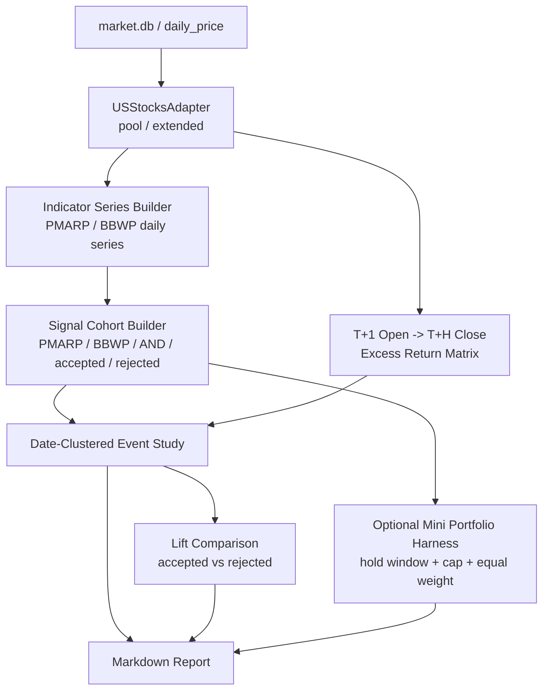

# PMARP + BBWP Daily Backtest Implementation Plan

> **For Claude:** REQUIRED SUB-SKILL: Use superpowers:executing-plans to implement this plan task-by-task.
> **For Codex:** Do not implement code before Boss approves the signal semantics and research scope below.

**Confidence: 90%**
**不确定点**: `BBWP downcross 98%` 是否按严格 `cross below 98` 执行，还是按现有系统更常用的 `high-zone turn down`（仍在 >98 区间内开始回落）执行。两者不是一回事，样本量和结论都会明显不同。
**北极星对齐**: `docs/design/north-star.md` 的“离线 R&D: 回测引擎 + 因子研究框架”层，目标是验证技术分析层可纳入的新指标/过滤器，而不是直接跳到策略层/CIO 层。

**Goal:** 用日频、`pool`/`extended` 两个 universe，严谨验证 `PMARP upcross 2%` 与 `BBWP` 组合后是否真的提升信号质量，并回答 “BBWP 本身是否有效、作为 PMARP filter 是否有效”。

**Tech Stack:** `USStocksAdapter` + `src/indicators/pmarp.py` + `src/indicators/bbwp.py` + `backtest/factor_study/event_study.py` + 新的 `T+1 open -> T+H close` 收益矩阵 helper + Markdown report

---

## Research Snapshot

### 已确认的现状

- `PMARP upcross 2%` 已经在本仓库里被反复研究过，而且日频 `T+1 open` 口径在 `pool` / `extended` 上都成立，核心兑现窗口仍然是 `30d/60d`。
- `BBWP` 已有指标实现：`src/indicators/bbwp.py` 当前定义是 `BBW` 的 rolling percentile，参数默认为 `bb_period=13`, `bb_std=1.0`, `lookback=252`。
- 现有 `factor_study` 框架天然适合“单因子分数 -> 扫 threshold/cross”研究，不适合直接表达 “PMARP cross_up AND BBWP cross_down” 这类双事件交集。
- `pipeline v3` 虽然支持 `next_open` 执行，但它当前是横截面打分/组合选股框架，不是事件触发型信号框架。

### 我刚做的只读 exploratory（当前 universe，全样本，非最终版）

#### 样本量探针

严格“同日 `PMARP upcross 2% AND BBWP downcross 98%`”非常稀：

| Universe | PMARP up2 raw | BBWP down98 raw | Same-day intersection raw | Intersection / PMARP |
|------|------:|------:|------:|------:|
| `pool` | 2409 | 811 | 42 | 1.74% |
| `extended` | 8529 | 2618 | 121 | 1.42% |

如果把 `BBWP` 语义改成当前系统里更常见的 `high-zone turn down`（上一期 `>98` 且本期回落，但未必跌破 98），交集样本会变大一些，但仍然不算宽：

| Universe | PMARP up2 raw | BBWP high-turn raw | Same-day intersection raw | Intersection / PMARP |
|------|------:|------:|------:|------:|
| `pool` | 2409 | 2108 | 164 | 6.81% |
| `extended` | 8529 | 6577 | 494 | 5.79% |

结论：

- 如果 Boss 坚持严格 `cross below 98`，这次研究必须把“统计功效不足”当成核心风险，而不是事后惊讶样本太少。
- 如果目标其实是“恐慌波动率开始拐头”，那应把 primary spec 明确改成 `high-zone turn down`，因为这才更贴近当前 `BBWP` 在系统内的使用语义。

#### 非最终版 exploratory 收益（当前 universe，全样本，`T+1 open -> T+30/60 close`，vs SPY）

严格 `BBWP downcross 98`：

| Universe | Signal | Horizon | Neff | Mean Excess | p-value | 初步判断 |
|------|------|------:|------:|------:|------:|------|
| `pool` | `BBWP down98` | 30 | 412 | +1.40% | 0.0829 | 弱 |
| `pool` | `BBWP down98` | 60 | 393 | +4.89% | 0.0022 | 单看有东西 |
| `pool` | `PMARP ∩ BBWP down98` | 60 | 26 | +31.20% | 0.0594 | 极稀疏，低功效，不能直接信 |
| `extended` | `BBWP down98` | 30 | 675 | +0.34% | 0.3084 | 基本没东西 |
| `extended` | `BBWP down98` | 60 | 648 | +1.32% | 0.0551 | 边缘 |
| `extended` | `PMARP ∩ BBWP down98` | 60 | 56 | +4.72% | 0.2975 | 没证明比 PMARP 更强 |

`high-zone turn down` 语义：

| Universe | Signal | Horizon | Neff | Mean Excess | p-value | 初步判断 |
|------|------|------:|------:|------:|------:|------|
| `pool` | `BBWP high-turn` | 60 | 603 | +6.48% | 6.58e-05 | 单看挺强 |
| `pool` | `PMARP ∩ BBWP high-turn` | 60 | 61 | +16.30% | 0.0275 | 有潜力，但样本仍小 |
| `extended` | `BBWP high-turn` | 60 | 801 | +1.92% | 0.0023 | 单看成立 |
| `extended` | `PMARP ∩ BBWP high-turn` | 60 | 133 | +2.49% | 0.2791 | 没显示出对 PMARP 的增量 |

**当前判断**：

1. `BBWP` 作为“单独事件”并非完全没东西，尤其在 `60d` 上。
2. 但 **“BBWP 能否提升 PMARP upcross 2%” 目前没有被 exploratory 明确证明**，尤其在 `extended` 上。
3. 所以正式回测的核心问题不是 “BBWP 自己好不好”，而是：
   - `BBWP` 是独立 alpha？
   - 还是只是另一个有点 edge 的事件？
   - 更关键：它对 `PMARP upcross 2%` 有没有 **conditional lift**？

---

## Architecture（架构图）

> 一句话解释：推荐方案不是硬改现有大框架，而是复用现有 adapter / indicator / 统计模块，补一层事件 cohort 和 `next_open` 收益语义。

## Business Flow（业务流程图）

> 一句话解释：先回答“BBWP 有没有用”，再回答“它能不能改善 PMARP”，最后才值得做策略级 backtest。

## Alternatives Considered（替代方案）

| 方案 | 优势 | 劣势 | 选择理由 |
|------|------|------|----------|
| 方案 A: 直接往 `factor_study` 里加 `BBWPFactor`，分别扫 `cross_down_98` | 改动最少，复用现有 CLI | 只能优雅研究单因子；`PMARP AND BBWP` 需要硬拼事件；现有 `forward_returns.py` 默认是 `close[t] -> close[t+h]`，不是你要的 `T+1 open` | 不选。会把“语义错误”包装成“代码复用” |
| 方案 B: 直接用 `pipeline v3` 把 PMARP 和 BBWP 当两个 factor 合成 | 已有 `next_open`、成本、组合回测能力 | V3 是横截面排名/选股框架，不是离散事件 AND 触发；会把问题从“BBWP 是否提升 PMARP 事件质量”偷换成“分数加权后组合收益如何” | 不选。研究问题被改掉了 |
| 方案 C: 新建一个最小 daily event combo harness，复用 adapter/indicator/event-study/execution 组件 | 语义正确；能同时回答 baseline、单指标、交集、accepted/rejected、再到 mini portfolio；最容易写出干净报告 | 需要补一个新收益矩阵 helper 和 cohort builder | **推荐**。这是最短且最不自欺的路径 |

## Risks & Mitigation（风险自证）

- **最大风险:** `BBWP downcross 98` 的事件太稀，导致 “大收益 + 不显著” 或 “看起来很肥但其实是 20 几个日期的幸运样本”。
- **为什么不用更简单的做法:** 因为最简单的两种做法都在偷换问题。
  `factor_study` 会错过 `T+1 open` 语义，`pipeline v3` 会把离散事件研究改成横截面打分策略。
- **回滚方案:** 本计划优先采用新增脚本/模块，不动现有核心回测路径；回滚就是删除新增文件。
- **额外风险 1:** `BBWP downcross 98` 与 `high-zone turn down` 语义混淆。
  解决：把 primary / secondary spec 在文档头部写死，不允许边跑边改。
- **额外风险 2:** extended 当前 universe 仍有 survivorship / reconstitution 偏差。
  解决：先用当前 universe 做 exploratory / design freeze；正式版再加 partial PIT 或明确写成 “current-universe daily study”。
- **额外风险 3:** 交集事件过稀时，单纯比较 `PMARP AND BBWP` vs 0 会高估滤波器价值。
  解决：正式报告把 **accepted vs rejected PMARP** 作为主问题，而不是只看交集事件均值。

## Acceptance Criteria（验收标准）

- [ ] 文档头部明确写死 `BBWP` 的 primary 语义，避免跑完后再改定义。
- [ ] `pool` 和 `extended` 两个 universe 都能输出同一套结果表。
- [ ] 至少有 4 组核心 cohort：`PMARP`、`BBWP`、`PMARP AND BBWP`、`PMARP accepted vs rejected by BBWP`。
- [ ] 收益口径明确是 `signal on T -> buy T+1 open -> sell T+H close`，并与 `close-to-close` 旧框架分开。
- [ ] 统计口径保留 date-clustered `Neff`，并对多 horizon / 多 cohort 做 BH-FDR。
- [ ] 最终报告能明确回答这三个问题：
  1. `BBWP` 单独是否有效？
  2. `BBWP` 对 `PMARP upcross 2%` 是否有增量？
  3. 若有，增量是在 `pool`、`extended` 还是两者都成立？

---

## Recommended Experimental Design

### Primary Spec（推荐主规格）

- `Universe`: `pool`, `extended`
- `Frequency`: daily
- `Signal A`: `PMARP upcross 2.0`
- `Signal B (primary)`: `BBWP downcross 98.0` 严格定义为 `prev >= 98 and curr < 98`
- `Signal B (secondary robustness)`: `BBWP high-zone turn down` 定义为 `prev > 98 and curr < prev`
- `Execution semantics`: 信号日 `T` 触发，`T+1 open` 买入，`T+30/60 close` 卖出
- `Benchmark`: `SPY`
- `Statistics`: date-clustered t-test + BH-FDR
- `Primary comparison`: `PMARP accepted by BBWP` vs `PMARP rejected by BBWP`

### Why This Design

- 你真正关心的是 “`BBWP` 能不能提高 `PMARP` 的质量”，不是 “两个指标同时亮灯时平均收益多少”。
- 所以 `accepted vs rejected PMARP` 才是主问题，`AND` 交集只能算补充视角。
- 因为 strict `downcross 98` 非常稀，必须把 `high-zone turn down` 当 robustness check，否则你可能在测一个定义上就过窄的信号。

---

## Task Breakdown

### Task 1: 冻结信号语义与实验协议

**Files:**
- Create: `docs/research/2026-04-22-pmarp-bbwp-daily-study-protocol.md`

**Step 1: 写死 primary / secondary 规格**

- Primary: `PMARP upcross 2.0` + `BBWP downcross 98.0`
- Secondary: `PMARP upcross 2.0` + `BBWP high-zone turn down`
- Horizons: `30`, `60`
- Universes: `pool`, `extended`

**Step 2: 写死主问题**

- `BBWP` standalone efficacy
- `BBWP` conditional lift on PMARP
- `accepted vs rejected PMARP` as primary inference

**Step 3: 写死“禁止边看边改”的条款**

- 不因样本太小临时改阈值
- 不因 extended 不好看就切回 pool 讲故事
- `high-turn` 只能作为 robustness，不得回头替代 primary 结论

### Task 2: 建立日频 `T+1 open -> T+H close` 收益 helper

**Files:**
- Create: `backtest/research/daily_event_returns.py`
- Test: `tests/test_backtest/test_daily_event_returns.py`

**Step 1: 复用 `forward_returns.py` 的索引思路，但改 entry/exit 语义**

- entry = `open[t+1]`
- exit = `close[t+h]`
- excess = stock return - SPY return

**Step 2: 补边界测试**

- 最后几天 horizon 不足返回 `NaN`
- 缺 `open` / `close` 返回 `NaN`
- benchmark 对齐失败返回 `NaN`

### Task 3: 建立组合事件 cohort builder

**Files:**
- Create: `backtest/research/pmarp_bbwp_cohorts.py`
- Test: `tests/test_backtest/test_pmarp_bbwp_cohorts.py`

**Step 1: 生成 5 类 cohort**

- `PMARP_up2`
- `BBWP_down98`
- `BBWP_highturn`
- `PMARP_AND_BBWP`
- `PMARP_ACCEPTED` / `PMARP_REJECTED`

**Step 2: 支持 lookback window robustness（可选）**

- 仅作为 robustness: `BBWP` 在 `T-3 ~ T` 发生是否也算 accepted
- 这项默认关闭，除非 Boss 批准进 secondary table

**Step 3: 对齐现有统计接口**

- 输出格式尽量兼容 `run_event_study()` 消费的 `{symbol: [event_date, ...]}` 或 date-bucket 结构

### Task 4: 事件研究 + accepted/rejected 对比

**Files:**
- Create: `backtest/research/daily_combo_event_study.py`
- Test: `tests/test_backtest/test_daily_combo_event_study.py`

**Step 1: 复用 `event_study.py` 的 date-cluster 逻辑**

- 对 standalone / AND cohort 跑 one-sample vs 0

**Step 2: 新增 accepted vs rejected 比较**

- group A = PMARP accepted by BBWP
- group B = PMARP rejected by BBWP
- Welch t-test on date-cluster means

**Step 3: 做 BH-FDR**

- 维度至少包括：`universe × signal cohort × horizon`

### Task 5: 生成正式研究脚本和报告

**Files:**
- Create: `scripts/run_pmarp_bbwp_daily_study.py`
- Create: `docs/research/2026-04-22-pmarp-bbwp-daily-study.md`

**Step 1: 脚本输出两层结果**

- Layer A: event-study tables
- Layer B: accepted vs rejected lift tables

**Step 2: 报告必须明确区分三类结论**

- `BBWP standalone`
- `BBWP as PMARP filter`
- `strict downcross` vs `high-turn` robustness

**Step 3: 在结论里强制回答**

- “如果只允许保留一个版本，保留哪一个？”
- “如果 extended 不成立、pool 成立，是否可视为真实 edge？”

### Task 6: 只有事件层通过后，再做最小组合回测

**Files:**
- Create: `backtest/research/daily_event_portfolio.py`
- Test: `tests/test_backtest/test_daily_event_portfolio.py`
- Optional report: `docs/research/2026-04-22-pmarp-bbwp-mini-portfolio.md`

**Step 1: 组合规则最小化**

- `T+1 open` 入场
- 固定持有 `60d`
- equal weight
- 同日并发信号等权
- `max_positions` cap（如 20 / 50）

**Step 2: 只在事件层值得做时执行**

- 如果 `BBWP` 对 `PMARP` 没有 lift，停止在事件研究，不进入组合回测

**Step 3: 不要过度工程化**

- 这一步的目标只是验证“事件 edge 串成组合后还剩多少”
- 不是马上把它塞进 `pipeline v3`

---

## Recommendation to Boss

如果现在就让我拍板下一步，我建议：

1. **先别直接做 full portfolio backtest。**
   先做一个最小 daily combo event study，把 `BBWP` 的 standalone 和 conditional lift 说清楚。
2. **primary spec 用你原话的 strict `BBWP downcross 98`。**
   但我会强烈要求把 `high-zone turn down` 作为 secondary robustness 一起写死，因为两者差异太大。
3. **主判断标准不要用 `PMARP AND BBWP` 的均值，而要用 accepted vs rejected。**
   不然你最后只能得到一句“组合事件均值还行/不行”，但回答不了 “BBWP 到底有没有用”。

Plan 写好了后，不应直接写代码。先由 Boss 决定：

- `BBWP` primary spec 是否坚持 strict `cross below 98`
- 是否同意把 `high-zone turn down` 作为 secondary robustness
- 是否只先做事件研究，暂不进入组合回测

Plan 已写好，请先看 `Research Snapshot` 和 `Recommended Experimental Design`。如果这两个判断方向对了，我再按这个 plan 落代码。
