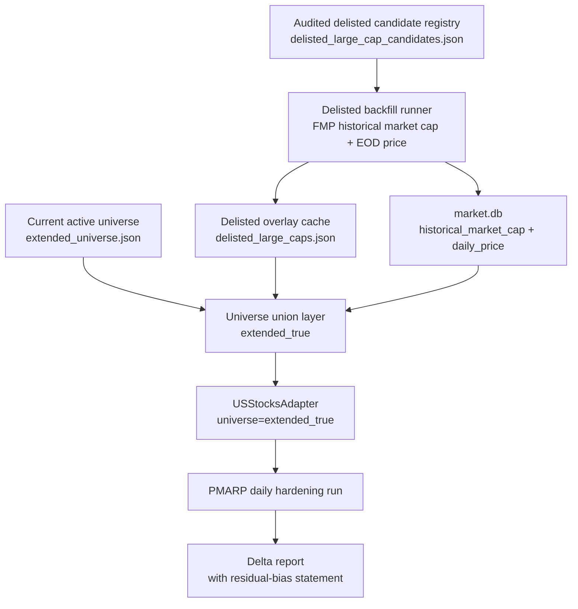
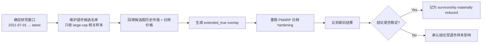

# PMARP True Survivorship Remediation Plan

> **For agentic workers:** REQUIRED SUB-SKILL: Use superpowers:executing-plans to implement this plan task-by-task.

**Confidence: 86%**
**不确定点**:
- FMP Starter 在本地实测下 `delisted-companies?page=0` 可用，但翻页到 `page=1` 即返回 `402`；是否存在别的免费分页/日期过滤路径，当前未证实。
- FMP `historical-sp500-constituent` 文档存在，但当前权限实测返回 `402`；不能把它当成当前可执行方案的主数据源。
- 因此，在不升级数据权限的前提下，最现实的目标是“把 large-cap delisted overlay 做到可审计、可复跑、显著缩小 survivorship bias”，而不是宣称已经达到 CRSP 级全覆盖。
**北极星对齐**: `docs/design/north-star.md` 的数据层可信度 + 离线 R&D/因子研究层。该 plan 不新增交易逻辑，只提升 PMARP 日频研究的样本完整性。

**Goal:** 为 `PMARP cross_up 2%` 的日频 hardening 增加可审计的退市/被收购 large-cap overlay，使 `extended` universe 不再只包含今天还活着的股票。

**Tech Stack:** Python, SQLite (`market.db`), FMP stable APIs, existing `USStocksAdapter` / `factor_study`, JSON cache files, pytest

---

## Architecture（架构图）



> 一句话解释：保留现有 `extended` 活名单不动，单独补一层“退市 large-cap overlay”，再在研究入口做 union。

## Business Flow（业务流程图）



> 一句话解释：不是先写结论，而是先补样本，再看结论是否还站得住。

## Alternatives Considered（替代方案）

| 方案 | 优势 | 劣势 | 选择理由 |
|------|------|------|----------|
| **A. `extended_true` overlay（推荐）** | 不污染现有 active universe；改动面小；可复用于 factor study / RS / V3 universe builder | 仍依赖退市候选发现质量 | 最符合当前代码结构，也最诚实 |
| B. 直接把退市股写进 `extended_universe.json` | 表面最简单 | 会污染 active scan 语义；`update_extended_prices.py`/cron 会把死股当活股处理 | 不选，active cache 和 research overlay 必须分层 |
| C. 依赖 FMP `historical-sp500-constituent` 自动补全 | 如果能用，会很干净 | 当前权限实测 `402`；且 S&P 也不等于全部 `$10B+` universe | 当前不可执行 |
| D. 先不做任何工程，直接升级到 CRSP/Norgate/更高 FMP 套餐 | 数据最彻底 | 现在就停工；成本和切换都更高 | 作为 Phase 2 备选，不是当前最短路径 |

## Risks & Mitigation（风险自证）

- **最大风险:** 候选发现不完整，最后做成“看起来很像 true survivorship，实际上只是手工补洞”。
  - **缓解:** 明确区分两个口径：
    - `extended_true_partial`: 现权限下的 large-cap delisted overlay，目标是显著缩小偏差。
    - `extended_true_full`: 只有拿到可完整分页的 delisting / historical constituent 数据后才允许使用的称呼。
  - 所有研究文档必须写明当前属于哪一级。

- **为什么不用更简单的做法:** 只手工补 `TWTR/VMW/ATVI/FRC/SIVB/SBNY` 六只虽然能过 smoke test，但这不是方法论修复，只是补最显眼的洞，仍然无法给 PMARP 因子“彻底夯实”的结论。

- **为什么不用 yfinance 补退市价格:** 当前已实测 FMP `historical-price-eod/full` 对 `TWTR` 可返回完整退市前 EOD；同一供应商补 `market_cap + price` 更一致，且比 yfinance 的退市符号兼容性更可控。

- **回滚方案:** 删除 overlay 文件与对应 DB rows，不动现有 active universe。
  - `data/pool/delisted_large_caps.json`
  - `data/pool/delisted_large_cap_candidates.json`
  - `DELETE FROM historical_market_cap WHERE symbol IN (...)`
  - `DELETE FROM daily_price WHERE symbol IN (...)`

## Acceptance Criteria（验收标准）

- [ ] 新增独立 overlay 口径，不污染现有 `extended_universe.json`
- [ ] 至少已知关键样本 `TWTR/VMW/ATVI/FRC/SIVB/SBNY` 在 `historical_market_cap` 与 `daily_price` 中都可查询
- [ ] `USStocksAdapter` 支持加载 `extended_true`（或等价显式口径），并能在研究入口中复用
- [ ] 日频 PMARP hardening 能在 `extended_true` 上完整重跑，产出新 artifact
- [ ] 新报告必须包含“旧结果 vs overlay 结果”的 delta 表，以及残余偏差声明
- [ ] 若当前权限无法形成完整退市候选全集，文档必须明确写明“partial overlay, not full true survivorship”

---

## Upstream Reality Check（上游现实检查）

这是 2026-04-22 本地实测得到的，不是纸面假设：

- `FMP /stable/delisted-companies?page=0&limit=100`：**200**
- `FMP /stable/delisted-companies?page=1&limit=100`：**402**
- `FMP /stable/historical-sp500-constituent`：**402**
- `FMP /stable/historical-market-capitalization?symbol=TWTR`：**200**，可返回 459 行
- `FMP /stable/historical-price-eod/full?symbol=TWTR`：**200**，可返回 459 行
- `FMP /stable/historical-market-capitalization?symbol=ATVI/FRC`：**200**

结论很直接：

1. **单股历史市值/价格回填链路是通的。**
2. **完整退市名单发现链路在当前套餐下不完整。**
3. 所以当前最佳方案不是“全自动全覆盖”，而是“audited overlay + 明确 coverage 等级”。

## Scope Freeze（范围冻结）

本 plan 只解决 PMARP 日频 hardening 需要的 true survivorship 问题，不顺手做这些：

- 不重构整个 broad universe v3 plan
- 不把 RS backtest / V3 pipeline / factor study 全部同时切到新口径
- 不引入新的商业数据供应商
- 不在这一步追求 Russell 3000 / CRSP 级别的完备历史成分库

## Recommended Implementation Shape（推荐实现形态）

### 核心决策

引入一个新的研究口径 `extended_true`：

- `extended`: 现有 active `$10B+` universe，只有今天还活着的股票
- `extended_true`: `extended ∪ delisted_large_caps_overlay`

### Overlay 分两层

1. `delisted_large_cap_candidates.json`
   - 审计输入层
   - 每个 symbol 带 `source`, `reason`, `delisted_date`, `confidence`
   - 允许人工维护，因为当前自动发现源不完整

2. `delisted_large_caps.json`
   - 回填成功后的可执行 overlay
   - 只保留通过条件的 symbol：
     - 在研究窗口内有可用 `historical_market_cap`
     - `MAX(market_cap) >= 10e9`
     - 有足够 `daily_price` 行数

### 为什么要分两层

因为“候选发现”和“数据回填成功”是两回事。分层后能回答两个问题：

- 我们**打算**纳入哪些退市大票？
- 哪些符号**真的已经**进入可执行 universe？

## Task 1: Delisted Overlay 数据模型

**Files:**
- Create: `src/data/delisted_universe_manager.py`
- Create: `tests/test_delisted_universe_manager.py`
- Create: `data/pool/delisted_large_cap_candidates.json`
- Create: `data/pool/delisted_large_caps.json` (generated artifact; 初始可为空)

**Step 1: 写 failing tests**

测试至少覆盖：
- 空 overlay 时 `get_extended_true_symbols()` 退化为当前 `extended`
- overlay 与 active universe union 后去重且排序
- malformed JSON / 缺字段时给出明确错误，而不是静默吞掉

Run:

```bash
pytest tests/test_delisted_universe_manager.py -v
```

Expected: FAIL

**Step 2: 实现最小 manager**

职责只做三件事：
- 读候选输入
- 读已生效 overlay
- 返回 `extended_true` union

不要把 FMP 网络调用塞进 manager。

**Step 3: 跑测试**

```bash
pytest tests/test_delisted_universe_manager.py -v
```

Expected: PASS

**Step 4: Commit**

```bash
git add src/data/delisted_universe_manager.py tests/test_delisted_universe_manager.py data/pool/delisted_large_cap_candidates.json
git commit -m "feat(data): add delisted overlay manager for survivorship studies"
```

## Task 2: Delisted 回填脚本

**Files:**
- Modify: `src/data/fmp_client.py`
- Create: `scripts/backfill_delisted_large_caps.py`
- Create: `tests/test_fmp_client_delisted.py`
- Create: `tests/test_backfill_delisted_large_caps.py`

**Step 1: 给 FMP client 增加最小 helper**

只加当前确定能用的接口：
- `get_delisted_companies(page=0, limit=100)`：作为 recent discovery helper
- 复用现有 `get_historical_market_cap`
- 复用现有 `get_historical_price_range`

不要在这里实现“自动翻完整个退市历史”，因为当前权限并不支持这个假设。

**Step 2: 写 backfill runner**

脚本输入：
- `--symbols TWTR VMW ...` 或默认读取 `delisted_large_cap_candidates.json`
- `--from-date 2021-07-01`
- `--to-date <today>`
- `--mcap-threshold 10e9`
- `--dry-run`

脚本输出：
- 对每个候选回填 `historical_market_cap`
- 用 FMP EOD 回填 `daily_price`
- 若 `MAX(market_cap) >= threshold`，写入 `delisted_large_caps.json`
- 生成覆盖报告（success / failed / below-threshold / no-price）

**Step 3: 测试**

Run:

```bash
pytest tests/test_fmp_client_delisted.py tests/test_backfill_delisted_large_caps.py -v
```

Expected: PASS

**Step 4: Commit**

```bash
git add src/data/fmp_client.py scripts/backfill_delisted_large_caps.py tests/test_fmp_client_delisted.py tests/test_backfill_delisted_large_caps.py
git commit -m "feat(data): add delisted large-cap backfill runner"
```

## Task 3: 审计候选名单

**Files:**
- Modify: `data/pool/delisted_large_cap_candidates.json`
- Create: `docs/research/2026-04-22-pmarp-delisted-overlay-audit.md`

**Step 1: 先写最小可辩护名单**

第一批不要追求“大而全”，先覆盖对 PMARP 结论最敏感的已知 large-cap delisted names：

- `TWTR`
- `VMW`
- `ATVI`
- `SIVB`
- `SBNY`
- `FRC`

然后再补 2021-07 以来的其他明确 large-cap delisted / acquired names。

每条至少记录：
- `symbol`
- `company_name`
- `source`
- `reason`（acquired / failed / privatized / merged）
- `delisted_date`
- `why_relevant`

**Step 2: 输出 audit 文档**

文档必须说明：
- 哪些是已纳入
- 哪些因 current provider entitlement 未能系统发现
- 当前结果属于 `partial overlay`

**Step 3: Commit**

```bash
git add data/pool/delisted_large_cap_candidates.json docs/research/2026-04-22-pmarp-delisted-overlay-audit.md
git commit -m "docs(research): audit delisted large-cap candidate overlay"
```

## Task 4: 研究入口接入 `extended_true`

**Files:**
- Modify: `backtest/adapters/us_stocks.py`
- Modify: `scripts/run_factor_study.py`
- Modify: `scripts/run_pmarp_crossup_hardening.py`
- Modify: `tests/test_us_stocks_reconstitution.py`
- Create: `tests/test_delisted_overlay_integration.py`

**Step 1: adapter 增加新 universe 口径**

新增：
- `universe="extended_true"`

行为：
- 从 `extended_universe.json` 读活名单
- 从 `delisted_large_caps.json` 读 overlay
- union 后按现有 `slice_to_date` + `mcap_threshold` 逻辑过滤

**Step 2: CLI 暴露**

`scripts/run_factor_study.py` 与专用 hardening runner 都支持这个新 universe。

**Step 3: 集成测试**

测试至少覆盖：
- delisted symbol 不在 active cache 中，但在 `extended_true` 中可被发现
- 若 symbol 缺价格或缺 mcap，不会被误纳入可执行 overlay
- `extended` 与 `extended_true` 的 symbol count 差异可观测

Run:

```bash
pytest tests/test_us_stocks_reconstitution.py tests/test_delisted_overlay_integration.py -v
```

Expected: PASS

**Step 4: Commit**

```bash
git add backtest/adapters/us_stocks.py scripts/run_factor_study.py scripts/run_pmarp_crossup_hardening.py tests/test_us_stocks_reconstitution.py tests/test_delisted_overlay_integration.py
git commit -m "feat(backtest): add extended_true universe with delisted overlay"
```

## Task 5: 真实数据回填 + PMARP 重跑

**Files:**
- Modify: `data/pool/delisted_large_caps.json` (generated)
- Create: `backtest/new/pmarp_crossup_hardening_true_survivorship_<date>/`
- Create: `docs/research/2026-04-22-pmarp-true-survivorship-delta.md`

**Step 1: 先跑已知样本 smoke test**

```bash
python scripts/backfill_delisted_large_caps.py --symbols TWTR VMW ATVI FRC SIVB SBNY --from-date 2021-07-01
```

Expected:
- 关键样本成功写入 `historical_market_cap`
- 至少 `TWTR/ATVI/FRC` 产生有效行

**Step 2: 扩展到审计名单**

```bash
python scripts/backfill_delisted_large_caps.py --from-date 2021-07-01
```

**Step 3: 重跑日频 hardening**

```bash
python scripts/run_pmarp_crossup_hardening.py --universe extended_true --oos-start 2025-01-01
```

**Step 4: 输出 delta 报告**

必须包含：
- 事件数变化
- `7d/30d/60d` full / IS / OOS 变化
- `60d` 是否仍过预注册门槛
- 当前 coverage 级别：`partial overlay` or `full`

**Step 5: Commit**

```bash
git add data/pool/delisted_large_caps.json backtest/new/pmarp_crossup_hardening_true_survivorship_* docs/research/2026-04-22-pmarp-true-survivorship-delta.md
git commit -m "docs(research): rerun PMARP hardening with delisted overlay"
```

## Task 6: Full-Closure Decision Gate（是否升级到真正 full true survivorship）

**Goal:** 不把 partial fix 误报成终局。

**Decision Rule:**

- 如果 `partial overlay` 重跑后，`60d OOS` 仍显著为正，且 delta 没有推翻结论：
  - 可以把 PMARP 定位为“**日频 OOS 已过，survivorship materially reduced but not fully closed**”
- 如果 Boss 要求“彻底清白 / 可以对外声称 true survivorship fixed”：
  - 必须升级 discovery 源，再做 `extended_true_full`

**可选升级源:**
- 更高权限的 FMP historical constituent / full delisted feed
- CRSP / Norgate 级历史退市库
- 其他可完整枚举 2021-2026 US delisted universe 的正式数据源

在这一步之前，**禁止**把 `partial overlay` 文案写成 “true survivorship 已彻底修复”。

