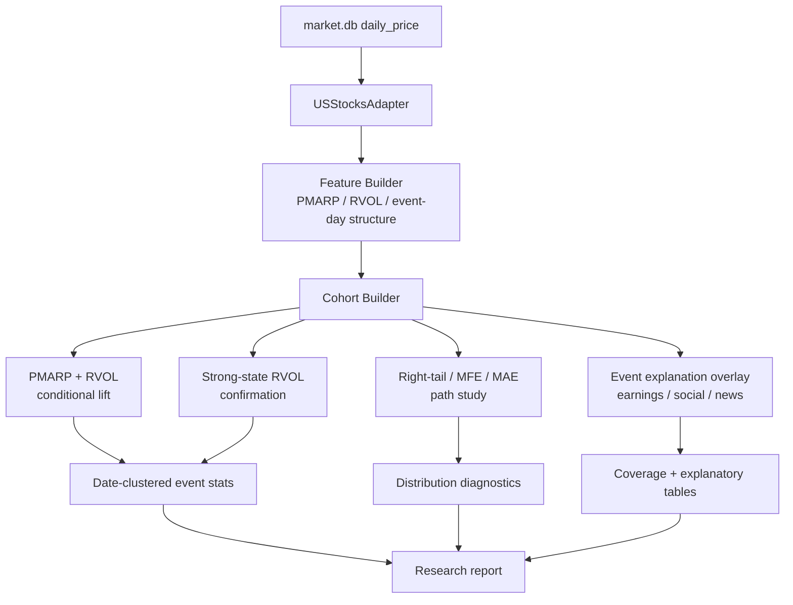
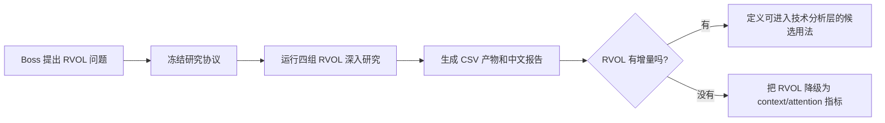

# RVOL Deep Research Implementation Plan

> **For Claude:** REQUIRED SUB-SKILL: Use superpowers:executing-plans to implement this plan task-by-task.

**Confidence: 88%**  
**不确定点**: 财报事件覆盖可能可用，但社交数据只覆盖约 2025-12-13 至 2026-04-22；全历史 RVOL 事件的社交覆盖率预期只有约 7-8%，因此社交分支预先降级为 2025-12 以后子样本探索，不用于全历史结论。  
**北极星对齐**: 对齐 `docs/design/north-star.md` 的“离线 R&D：回测引擎 + 因子研究”与“分析层 — 技术分析（日频）”。目标是判断 RVOL 是否能作为经验证的技术指标进入技术分析层；不直接进入策略层/CIO 层。  

**Goal:** 把 RVOL 从“独立买入信号”重新定位为条件变量、确认变量、右尾事件变量，系统验证它是否能提高 PMARP 或强势状态信号质量。  

**Tech Stack:** Python, pandas, scipy, SQLite market.db, `USStocksAdapter`, existing `backtest/research/*` event-study helpers, pytest, CSV/Markdown research artifacts.

---

## Architecture（架构图）



> 一句话解释：数据先统一生成 PMARP、RVOL 和事件日结构特征，再分成四条研究线，最后汇总成一个 RVOL 深入研究报告。

## Business Flow（业务流程图）



> 一句话解释：这轮不是为了证明 RVOL 有用，而是为了决定它应该被升级为技术因子，还是降级为解释性上下文。

## Alternatives Considered（替代方案）

| 方案 | 优势 | 劣势 | 选择理由 |
|------|------|------|----------|
| 方案 A：继续扫 RVOL 阈值和 horizon | 改动最少，能快速产出更多表 | 胜率已接近硬币，继续网格搜索容易 p-hacking | 不选。问题已经不是阈值，而是 RVOL 的角色定位 |
| 方案 B：直接做 RVOL 策略级回测 | 更接近交易结果 | 仓位、并发、成本、排序会污染对信号本体的理解 | 不选。还没证明 RVOL 应该作为交易信号 |
| 方案 C：RVOL 作为条件/确认/右尾变量深入研究（推荐） | 正面对齐当前发现：胜率弱、均值靠右尾、强势桶更干净 | 工作量更大，需要新增 cohort 和路径统计 | 选择。它回答“RVOL 到底该怎么用” |
| 方案 D：先接新闻/财报/社交解释层 | 语义最丰富 | 数据覆盖和对齐不确定，容易把核心统计问题拖复杂 | 只做第四优先级附录，不挡主线 |

## Risks & Mitigation（风险自证）

- **最大风险:** 把 RVOL 研究做成新的多重检验迷宫，最后找到一个看似漂亮但不可复现的桶。
- **缓解:** 先冻结 3 条主问题：PMARP lift、强势确认、右尾路径；所有参数只用少数预注册值，不做大规模阈值搜索。
- **为什么不用更简单的做法:** 只看当前 `PMARP <30 / 30-60 / >=60` 表已经不够，因为它只说明 RVOL 单独胜率弱，不能回答 RVOL 对 PMARP 或强势状态是否有增量。
- **回滚方案:** 所有新增代码和产物在独立 worktree/branch；若结果无价值，只保留中文研究报告作为负结果，不并入生产管线。

## Acceptance Criteria（验收标准）

- [ ] 产出一个中文研究报告，明确回答 RVOL 的三个候选定位：PMARP 过滤器、强势确认、右尾事件变量。
- [ ] 产出机器可复现的 CSV：cohort counts、event stats、conditional lift、tail diagnostics。
- [ ] 每个核心结论同时看 `pool` 和 `extended`，同时看 raw 与 SPY excess。
- [ ] 统计口径继续保留 same-symbol horizon de-overlap、date-clustered t-test、BH-FDR。
- [ ] 执行前验证 `extended` universe 的 `volume` 非空率；若低于 95%，`extended` 分支先降级并在报告中标红。
- [ ] 不因为单个漂亮桶就升级 RVOL；升级标准必须包含 OOS/extended/超额收益中的至少两个维度支持。
- [ ] 如果 RVOL 无增量，报告要明确建议降级为 context/attention factor，而不是模糊保留。

---

## Research Protocol（冻结研究协议）

### 核心问题

1. **RVOL 能不能提升 PMARP upcross 2%？**  
   这是最高优先级。PMARP 是已有 alpha candidate，RVOL 如果有价值，最可能是做 PMARP 的条件过滤器。

2. **RVOL 是否是强势状态确认信号？**  
   当前 `PMARP >= 60` 桶比中间桶干净，需要进一步用事件日价格结构确认它是否是“放量确认/趋势加速”。

3. **RVOL 的均值 edge 是否来自少数右尾？**  
   如果胜率接近 50%，但均值为正，必须量化 top decile、MFE/MAE 和 skew，判断是否适合小仓位事件因子。

4. **RVOL spike 背后的事件是什么？**  
   只做附录，不挡主线：财报、社交 attention、新闻覆盖能否解释不同 RVOL 桶。

### 预注册参数

- RVOL: `lookback=150`, `cross_up threshold=2.0`，单位是 **2σ z-score**，对应 `RVOLSignalStatsConfig.rvol_threshold`；不是“2 倍成交量”
- PMARP: `ema_period=20`, `lookback=150`
- PMARP 主信号: `upcross 2.0`
- RVOL recent window: `same_day`, `recent_3d`, `recent_5d`
- 强势状态: `PMARP >= 60`
- 弱势状态: `PMARP < 30`
- 事件日涨跌: `sign_neg < -1%`, `flat [-1%, +1%]`, `sign_pos > +1%`
- Close location: `close_location = (close - low) / (high - low)`，分 `near_low < 0.25`, `middle`, `near_high > 0.75`
- Horizons: `5 / 10 / 20 / 40 / 60`
- Universes: `pool`, `extended`
- Returns: raw close-to-close, excess vs SPY

### 多重检验校正规则

- `event_stats.csv`: FDR family = `universe + return_type + research_block`，在同一 research block 下跨所有 cohort 和 horizon 校正。
- `conditional_lift.csv`: FDR family = `universe + return_type + sample + research_block`，在同一 PMARP lift block 下跨所有 accepted/rejected comparison 和 horizon 校正；**不按单个 comparison 分开校正**。
- `tail_diagnostics.csv`: 主要是描述性分布诊断，不用 p-value 做升级判断；若后续增加检验，也按 `universe + cohort_group` 校正。

## Task Checklist（细粒度任务）

### Task 0: Plan Approval

**Files:**
- Review only: `docs/plans/2026-04-24-rvol-deep-research-plan.md`

**Step 1: Boss review**

请 Boss 重点看三个判断：

- 是否同意不再把 RVOL 当独立买入信号挖。
- 是否同意优先测 `PMARP upcross 2% accepted/rejected by RVOL`。
- 是否同意事件解释层只做附录，不挡主线。

**Step 2: Update plan after comments**

按 Boss 批注修改计划，不写实现代码。

### Task 1: Build Shared RVOL Deep Feature Frame

**Files:**
- Modify: `backtest/research/rvol_signal_stats.py`
- Create: `tests/test_backtest/test_rvol_deep_research.py`

**Goal:** 在现有 RVOL feature frame 上补齐后续研究共用字段。

**复用字段:**

- `pmarp`
- `rvol`
- `rvol_up2`
- `pmarp_up2`
- `pmarp_bucket_30_60`

**新增字段:**

- `event_day_return`
- `event_day_sign`
- `close_location`
- `close_location_bucket`
- `rvol_recent_3d`
- `rvol_recent_5d`

**Step 0: Data sanity check**

执行前先验证 `pool` 和 `extended` 的字段覆盖：

- `close` 非空率
- `volume` 非空率
- `high/low` 非空率

如果 `extended` 的 `volume` 非空率低于 95%，不要继续解释 extended RVOL 结果；先在产物里标记 `extended_volume_coverage_failed=true`。

**Step 1: Write tests**

测试点：

- `PMARP < 30 / 30-60 / >=60` 边界正确。
- `close_location` 在 high == low 时返回 `None`，避免除零。
- `rvol_recent_3d` 和 `rvol_recent_5d` 不看未来。

**Step 2: Implement minimal helper**

优先复用现有 `build_rvol_feature_frames()`，不要另写一套完整指标计算。

**Step 3: Validate**

Run:

```bash
/Users/owen/CC\ workspace/Finance/.venv/bin/python -m pytest tests/test_backtest/test_rvol_signal_stats.py tests/test_backtest/test_rvol_deep_research.py -q
```

Expected: all pass.

### Task 2: PMARP + RVOL Conditional Lift Study

**Files:**
- Create: `backtest/research/rvol_deep_research.py`
- Modify: `scripts/run_rvol_deep_research.py`
- Test: `tests/test_backtest/test_rvol_deep_research.py`

**Goal:** 测 RVOL 能不能提高 PMARP upcross 2% 的质量。

**Cohorts:**

- `pmarp_up2_base`
- `pmarp_up2_accept_rvol_same_day`
- `pmarp_up2_reject_rvol_same_day`
- `pmarp_up2_accept_rvol_recent3`
- `pmarp_up2_reject_rvol_recent3`
- `pmarp_up2_accept_rvol_recent5`
- `pmarp_up2_reject_rvol_recent5`

**Main comparison:**

- accepted vs rejected 的 mean return 差异
- accepted vs rejected 的 hit rate 差异
- date-clustered two-sample comparison

**Step 1: Write cohort tests**

构造一个 6 行 toy dataframe，确认：

- same-day 只接受同日 RVOL。
- recent3 只接受 `T-2, T-1, T` 内 RVOL，不看 `T+1`。
- rejected = base - accepted。

**Step 2: Implement cohort builder**

函数建议：

```python
build_pmarp_rvol_lift_cohorts(feature_frames, config) -> dict[str, dict[str, list[str]]]
```

**Step 3: Implement comparison output**

输出 `conditional_lift.csv`：

- `universe`
- `return_type`
- `sample`
- `comparison`
- `horizon`
- `accepted_events`
- `rejected_events`
- `accepted_mean`
- `rejected_mean`
- `mean_diff`
- `accepted_hit_rate`
- `rejected_hit_rate`
- `hit_rate_diff`
- `p_value`
- `p_fdr`

**Step 4: Validate**

Run:

```bash
/Users/owen/CC\ workspace/Finance/.venv/bin/python -m pytest tests/test_backtest/test_rvol_deep_research.py -q
```

Expected: pass.

### Task 3: Strong-State Confirmation Study

**Files:**
- Modify: `backtest/research/rvol_deep_research.py`
- Modify: `scripts/run_rvol_deep_research.py`
- Test: `tests/test_backtest/test_rvol_deep_research.py`

**Goal:** 判断 RVOL 在强势状态里是否是趋势确认，而不是随机放量。

**Cohorts:**

- `rvol_up2_pmarp_gte60`
- `rvol_up2_pmarp_gte60_sign_pos`
- `rvol_up2_pmarp_gte60_close_near_high`
- `rvol_up2_pmarp_gte60_sign_pos_close_near_high`
- `rvol_up2_pmarp_lt30_sign_neg`
- `rvol_up2_pmarp_lt30_close_near_low`

**Step 1: Write tests for close location buckets**

Toy data:

- `high=110, low=100, close=108` -> near_high
- `close=102` -> near_low
- `close=105` -> middle

**Step 2: Implement strong-state cohorts**

Keep cohorts few and interpretable. No threshold grid search.

**Step 3: Output**

Append these cohorts to `event_stats.csv` with same schema as RVOL event stats.

**Step 4: Validate**

Run:

```bash
/Users/owen/CC\ workspace/Finance/.venv/bin/python -m pytest tests/test_backtest/test_rvol_deep_research.py -q
```

Expected: pass.

### Task 4: Right-Tail / MFE / MAE Path Study

**Files:**
- Create: `backtest/research/event_path_diagnostics.py`
- Test: `tests/test_backtest/test_event_path_diagnostics.py`
- Modify: `scripts/run_rvol_deep_research.py`

**Goal:** 量化 RVOL 的均值 edge 是否由右尾贡献。

**Path price rule:**

- MFE/MAE 使用日内 `high/low` 计算，而不是只用 close。
- Entry price 为事件日 `close[T]`，forward path 为 `T+1 ... T+H` 的 high/low。
- 若某个 symbol 缺少 high/low，则该事件从 MFE/MAE 统计中剔除，并在 coverage 字段里记录；不要 silent fallback 到 close。

**Metrics:**

- `mean_return`
- `median_return`
- `p10 / p25 / p75 / p90`
- `top_10pct_contribution`
- `bottom_10pct_contribution`
- `mfe_mean`
- `mae_mean`
- `mfe_to_mae_ratio`
- `right_tail_ratio = p90 / abs(p10)`

**Step 1: Write path diagnostic tests**

Toy price path:

- Entry price = 100
- Future highs = `[102, 110, 106]`
- Future lows = `[95, 99, 101]`
- Expected MFE = +10%
- Expected MAE = -5%

**Step 2: Implement path diagnostics**

Use event date T and forward path `T+1 ... T+H`; keep output event-level first, then aggregate by cohort.

**Step 3: Output**

Write `tail_diagnostics.csv`:

- `universe`
- `cohort`
- `horizon`
- `n_events`
- `mean`
- `median`
- `top_10pct_contribution`
- `mfe_mean`
- `mae_mean`
- `right_tail_ratio`

**Step 4: Validate**

Run:

```bash
/Users/owen/CC\ workspace/Finance/.venv/bin/python -m pytest tests/test_backtest/test_event_path_diagnostics.py -q
```

Expected: pass.

### Task 5: Event Explanation Overlay（附录）

**Files:**
- Create: `backtest/research/rvol_event_explainers.py`
- Test: `tests/test_backtest/test_rvol_event_explainers.py`
- Modify: `scripts/run_rvol_deep_research.py`

**Goal:** 尝试解释 RVOL spike 背后是什么事件，但不让这条线阻塞主研究。

**Candidate overlays:**

- Earnings proximity: `abs(event_date - earnings_date) <= 3 trading days`
- Social attention: `attention_zscore >= 2`，只对 `2025-12-13` 以后子样本做覆盖率和探索性统计，不对 2021-2026 全历史下结论
- Market-wide social regime: available market sentiment date，同样只对社交数据覆盖期做子样本探索
- News count: if available from FMP cache/API, only use cached/offline data first

**Step 1: Add coverage-first reporting**

不要先做结论，先输出覆盖率：

- `events_total`
- `events_with_earnings_info`
- `events_near_earnings`
- `events_with_social_info`
- `events_social_spike`
- `events_after_social_start`
- `events_with_social_info_after_social_start`

**Step 2: Only analyze if coverage is enough**

- Earnings branch: if full-history coverage < 60%, mark exploratory.
- Social branch: full-history coverage is expected to be <10%; do not use it for full-history inference. Only evaluate post-2025-12 subset coverage. If post-2025-12 coverage < 60%, mark social section as exploratory-only.

**Step 3: Output**

Write `event_explainers.csv`.

### Task 6: Runner + Artifacts

**Files:**
- Create: `scripts/run_rvol_deep_research.py`
- Create output dir: `backtest/new/rvol_deep_research_20260424/`

**Goal:** 一条命令复现全部研究。

**Command:**

```bash
/Users/owen/CC\ workspace/Finance/.venv/bin/python scripts/run_rvol_deep_research.py --report-date 2026-04-24
```

**Expected artifacts:**

- `universe_summary.csv`
- `cohort_counts.csv`
- `event_stats.csv`
- `conditional_lift.csv`
- `tail_diagnostics.csv`
- `event_explainers.csv`（始终输出 coverage；coverage 足够时才写结论）
- `README.md`

**Validation:**

```bash
/Users/owen/CC\ workspace/Finance/.venv/bin/python -m py_compile \
  backtest/research/rvol_deep_research.py \
  backtest/research/event_path_diagnostics.py \
  backtest/research/rvol_event_explainers.py \
  scripts/run_rvol_deep_research.py
```

Expected: no output, exit code 0.

### Task 7: Chinese Research Report

**Files:**
- Create: `docs/research/2026-04-24-rvol-deep-research-study.md`

**Required sections:**

1. 一句话结论
2. 方法论冻结
3. PMARP + RVOL 条件提升结果
4. 强势状态确认结果
5. 右尾/MFE/MAE 路径诊断
6. 事件解释层覆盖率
7. 是否升级 RVOL 的判断
8. 下一步建议

**Decision table:**

| 判断项 | 升级 RVOL | 降级 RVOL |
|---|---|---|
| PMARP lift | accepted 明显强于 rejected | 无 lift |
| Strong-state confirmation | `PMARP>=60 + close near high` 过 excess FDR | 只有 raw return |
| Tail profile | 右尾可被结构过滤捕捉 | 纯随机右尾 |
| Extended support | extended 仍有证据 | 只在 pool 成立 |

### Task 8: Final Verification

**Files:**
- All files touched in this plan

**Commands:**

```bash
/Users/owen/CC\ workspace/Finance/.venv/bin/python -m pytest \
  tests/test_backtest/test_rvol_signal_stats.py \
  tests/test_backtest/test_rvol_deep_research.py \
  tests/test_backtest/test_event_path_diagnostics.py \
  tests/test_backtest/test_rvol_event_explainers.py \
  -q

/Users/owen/CC\ workspace/Finance/.venv/bin/python scripts/run_rvol_deep_research.py --report-date 2026-04-24
```

**Expected:**

- Tests pass.
- Runner completes for `pool` and `extended`.
- Markdown report cites artifact paths.
- Report ends with a clear upgrade/downgrade recommendation.

## Decision Gates（研究升级门槛）

### Gate A: PMARP conditional lift

RVOL 才能作为 PMARP 过滤器继续推进，如果：

- `accepted_rvol_recent3` 的 60d 或 40d excess mean 明显高于 rejected；
- 且 accepted hit rate 不低于 rejected；
- 且至少在 `pool` 显著，`extended` 不反向。

### Gate B: Strong-state confirmation

RVOL 才能作为强势确认变量继续推进，如果：

- `PMARP >= 60 + sign_pos / close_near_high` 在 excess 口径下优于 `PMARP >= 60` base；
- 且不是只靠 raw beta。

### Gate C: Tail-event usage

RVOL 才能作为右尾事件变量继续推进，如果：

- top 10% 贡献很高；
- 但 MFE/MAE 显示有可管理入场/止损空间；
- 否则只是不可交易的随机右尾。

## Out of Scope（明确不做）

- 不做大规模 RVOL threshold sweep。
- 不直接做组合回测。
- 不把 RVOL 结果写入生产 Portfolio Intelligence。
- 不做自动仓位建议。
- 不接在线 API 拉新数据；本轮优先使用本地缓存。

## Execution Handoff

Plan complete and saved to `docs/plans/2026-04-24-rvol-deep-research-plan.md`.

执行前需要 Boss 批准。批准后有两种方式：

1. **本 session 执行**：按 Task 1-8 小步实现，每个阶段跑测试和产物。
2. **单独 session 执行**：开新 session 指向本 worktree，按本 plan 批量推进。
