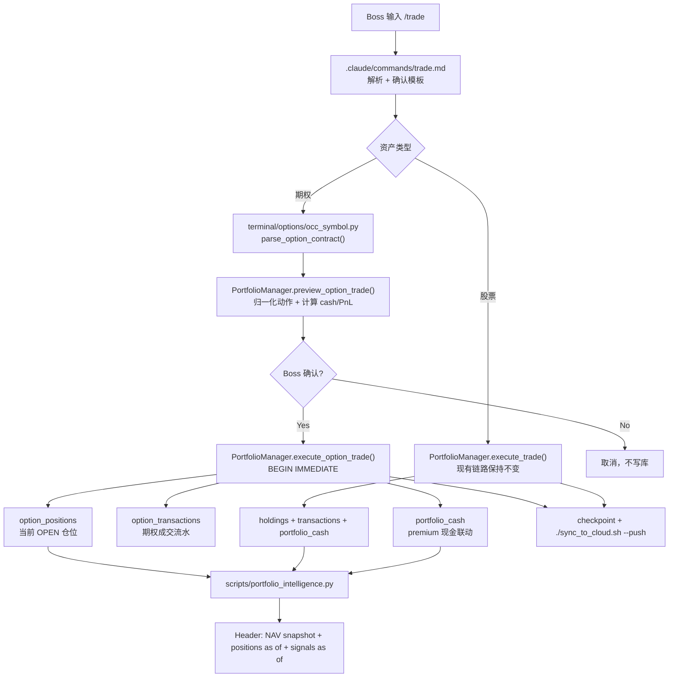
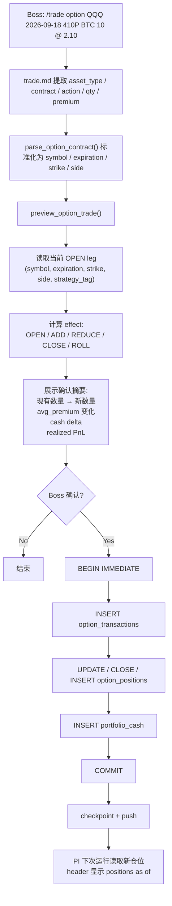

# /trade Option Lifecycle Hardening Implementation Plan

> **For Claude:** REQUIRED SUB-SKILL: Use superpowers:executing-plans to implement this plan task-by-task.

**Confidence: 91%**
**不确定点**: `.claude/commands/trade.md` 没有独立自动化 harness，命令层验收要靠 Python helper 测试 + 手工 dry-run；Boss 是否要把期权用户语法强制收紧为 `BTO/STO/BTC/STC`，还是允许自然语言别名后再归一化，可在批注里拍板。
**北极星对齐**: `docs/design/north-star.md` 第四层 CIO-A（组合管理 / 当前真实持仓纪律）。本 plan 只修 `/trade` 的真实仓位维护能力，不越界到 CIO-B 的建仓建议；north-star 无显式 R 编号。

**Goal:** 保持股票 `/trade` 原子链路不动，把期权 `/trade` 升级为原子、可审计、现金联动的仓位状态机，并在 PI 报文里显式暴露 `positions as of`，避免再次静默读旧 option book。

**Tech Stack:** Python + SQLite (`company.db`) + `PortfolioManager` / `CompanyStore` + `.claude/commands/trade.md`

---

## Architecture（架构图）



> 一句话解释：股票继续走现有 `execute_trade()`，期权新增一条可测试的 manager/store 链路，负责 contract 归一化、仓位状态迁移、现金联动、流水审计和 PI 可见性。

## Business Flow（业务流程图）



> 一句话解释：期权交易先算清楚“这笔到底是在开仓、加仓、减仓还是平仓”，确认后一次性写入流水、当前仓位和现金三处，最后把这次仓位更新时间带到 PI 头部。

## Alternatives Considered（替代方案）

| 方案 | 优势 | 劣势 | 选择理由 |
|------|------|------|----------|
| 方案 A：只改 `.claude/commands/trade.md`，继续直接 `insert_option_position()` | 改动最小，几乎不动 Python | 逻辑分散在 prompt 里、不可测、无法可靠做减仓/平仓/现金联动，迟早再次 drift | 不选。根因就是“命令文案有了，状态机没有” |
| 方案 B：`option_positions` 保留 current-state，新增 `option_transactions` ledger，并由 `PortfolioManager` 执行期权交易（推荐） | 原子、可测试、能算现金和 realized PnL、可支持 roll、与现有 stock manager 模式一致 | 需要 schema migration 和一轮 targeted tests | 选择。复杂度最低且能真正闭环 |
| 方案 C：直接做券商持仓导入 / reconcile 作为 SSOT | 最终最强，彻底消灭人工录入漂移 | scope 明显过大，要接 broker/export/import/reconcile 流程 | 不选。本轮先把 `/trade` 修成“只要按它录，就不漂” |

## Risks & Mitigation（风险自证）

- **最大风险:** 历史期权仓位是人工补录的，无法从旧 `option_positions` 反推出完整历史现金流。  
  缓解：本轮不追历史回补，继续以当前 `portfolio_cash` 为现金 SSOT；从新 `/trade` 上线后的期权成交开始保证现金闭环。
- **为什么不用更简单的做法:** 只维护 `option_positions` 不维护流水和 cash delta，看起来省代码，但 NAV 会继续在“仓位对了、现金错了”或“现金对了、仓位错了”之间静默漂移，和这次事故同源。
- **回滚方案:** 所有 schema 变更都做成 additive migration（新表 / 新列 / 新索引）；如果 option engine 回归，回滚代码即可，原有 stock path 不受影响，旧数据仍可读。

## Acceptance Criteria（验收标准）

- [ ] 股票 `/trade` 现有测试不回归，仍然走 `PortfolioManager.execute_trade()`
- [ ] 期权 `BTO/STO/BTC/STC` 四种动作都能正确更新 `option_positions`、`option_transactions`、`portfolio_cash`
- [ ] 期权 partial reduce / full close 能正确累计 realized PnL，remaining leg 的 `avg_premium` 不乱跳
- [ ] `ROLL` 在单个 SQLite transaction 内完成“关旧腿 + 开新腿 + 更新现金”；任一子步骤失败则全回滚
- [ ] 同一 `(symbol, expiration, strike, side, strategy_tag)` 任意时刻最多只有 1 行 OPEN
- [ ] `/trade` 的确认摘要能明确展示 `现有数量 -> 新数量`、`cash delta`、`realized PnL`、`strategy_tag`
- [ ] PI 报文 header 新增 `positions as of YYYY-MM-DD`，不会再把仓位源时间藏起来
- [ ] targeted tests 全绿，且至少完成一次本地 dry-run（不改生产 cron / checkout）

## Scope Boundaries（范围边界）

- **In scope**
  - 股票路径保持不变，只补期权路径
  - 单腿期权开仓 / 加仓 / 减仓 / 平仓
  - 1-out-1-in 的显式 `ROLL`
  - 期权 premium 对现金余额的联动
  - PI header 的 `positions as of`

- **Out of scope**
  - broker 自动导入 / 自动 reconcile
  - 多腿 spread 一次命令批量录入
  - assignment / exercise / expiration auto-close
  - 生产 cron / 生产 checkout 修改

---

## Core Rules（关键规则，先写死）

### 1. 期权 contract identity

期权当前仓位以这 5 个字段唯一标识：

```python
(symbol, expiration, strike, side, strategy_tag)
```

- `strategy_tag` 允许为空字符串
- 如果同一合约存在多条不同 `strategy_tag` 的 OPEN 仓位，而用户没给 tag，`/trade` 必须追问，禁止猜

### 2. 用户动作与内部语义

推荐把期权用户动作归一化为 broker-style 四类：

| 用户动作 | quantity_delta | cash_delta | 语义 |
|----------|----------------|------------|------|
| `BTO` | `+qty` | `-(qty * premium * 100)` | 买入开多 |
| `STC` | `-qty` | `+(qty * premium * 100)` | 卖出平多 |
| `STO` | `-qty` | `+(qty * premium * 100)` | 卖出开空 |
| `BTC` | `+qty` | `-(qty * premium * 100)` | 买入平空 |

内部 lifecycle effect 由现有仓位推导：

- `OPEN`: 当前无 OPEN leg，新建一条
- `ADD`: 同方向增加绝对仓位，重算 `avg_premium`
- `REDUCE`: 同方向减少但未清零，累计 `realized_pnl`
- `CLOSE`: 减到 0，标记 `CLOSED`
- `ROLL`: 在一个 transaction 内先 `CLOSE/REDUCE` 旧腿，再 `OPEN/ADD` 新腿

### 3. realized PnL 公式

- Long leg 平仓：`(close_premium - avg_premium) * closed_qty * 100`
- Short leg 回补：`(avg_premium - buyback_premium) * closed_qty * 100`

### 4. avg_premium 规则

- 同方向加仓时，按绝对张数加权平均
- 减仓 / 平仓时，剩余仓位保留原 `avg_premium`
- 禁止一次交易把仓位从 long 直接翻成 short 或从 short 直接翻成 long；必须拆成 `CLOSE + OPEN`，或显式 `ROLL`

---

## Task 1: Harden CompanyStore Schema For Option Lifecycle

**Files:**
- Modify: `terminal/company_store.py`
- Test: `tests/test_portfolio_store.py`

**Step 1: Write the failing tests**

新增这些测试，先让它们红：

```python
def test_get_open_option_position_exact_contract(store): ...
def test_insert_and_list_option_transactions(store): ...
def test_option_position_realized_pnl_defaults_zero(store): ...
def test_reject_duplicate_open_option_contract_same_strategy(store): ...
```

关键断言：

- 能按 `(symbol, expiration, strike, side, strategy_tag)` 精确拿到 OPEN leg
- `option_transactions` 能按时间顺序读回
- 新 OPEN option row 的 `realized_pnl == 0`
- 相同 contract key 的第二条 OPEN row 会被唯一索引拒绝

**Step 2: Implement additive migration in `terminal/company_store.py`**

目标是“老库能升级，新库一次到位”：

```sql
ALTER TABLE option_positions ADD COLUMN realized_pnl REAL DEFAULT 0;

CREATE TABLE IF NOT EXISTS option_transactions (
    id INTEGER PRIMARY KEY AUTOINCREMENT,
    option_position_id INTEGER REFERENCES option_positions(id),
    symbol TEXT NOT NULL,
    expiration TEXT NOT NULL,
    strike REAL NOT NULL,
    side TEXT NOT NULL,
    action TEXT NOT NULL,
    quantity INTEGER NOT NULL,
    premium REAL NOT NULL,
    date TEXT NOT NULL,
    strategy_tag TEXT DEFAULT '',
    notes TEXT DEFAULT '',
    created_at TEXT NOT NULL
);

CREATE UNIQUE INDEX IF NOT EXISTS idx_option_pos_open_contract
    ON option_positions(symbol, expiration, strike, side, strategy_tag)
    WHERE status = 'OPEN';
```

**Step 3: Add store methods**

最低需要这些 API：

```python
def get_open_option_position(self, symbol, expiration, strike, side, strategy_tag="") -> dict | None
def insert_option_transaction(self, *, option_position_id, symbol, expiration, strike, side,
                              action, quantity, premium, date, strategy_tag="", notes="") -> int
def get_option_transactions(self, symbol: str | None = None, option_position_id: int | None = None) -> list[dict]
```

不要把期权生命周期逻辑堆进 `CompanyStore`；store 只负责 CRUD 和 migration。

**Step 4: Run the tests**

Run:

```bash
pytest tests/test_portfolio_store.py -q
```

Expected:

- 新增 option lifecycle 测试 PASS
- 旧 `holdings / option_positions / checkpoint` 测试不回归

**Step 5: Commit**

```bash
git add terminal/company_store.py tests/test_portfolio_store.py
git commit -m "feat: add option trade ledger schema"
```

---

## Task 2: Add Option Contract Parsing And Normalization

**Files:**
- Modify: `terminal/options/occ_symbol.py`
- Test: `tests/terminal/options/test_occ_symbol.py`

**Step 1: Write the failing tests**

补这几类输入格式：

```python
def test_parse_standard_contract():
    result = parse_option_contract("QQQ 2026-09-18 410P")
    assert result == {
        "symbol": "QQQ",
        "expiration": "2026-09-18",
        "strike": 410.0,
        "side": "PUT",
    }

def test_parse_compact_date_contract():
    result = parse_option_contract("QQQ 260918 410P")
    assert result["expiration"] == "2026-09-18"

def test_parse_occ_symbol():
    result = parse_option_contract("QQQ260918P00410000")
    assert result["strike"] == 410.0

def test_invalid_contract_raises():
    with pytest.raises(ValueError):
        parse_option_contract("QQQ 410 maybe")
```

**Step 2: Implement `parse_option_contract()`**

建议签名：

```python
def parse_option_contract(text: str) -> dict:
    """Accepts:
    - QQQ 2026-09-18 410P
    - QQQ 260918 410P
    - QQQ260918P00410000
    Returns: {symbol, expiration, strike, side}
    """
```

实现要求：

- 统一输出 `expiration="YYYY-MM-DD"`、`side in {"CALL", "PUT"}`、`strike=float`
- 只做“合约识别”，不在这里推导 `BTO/BTC/...`
- 错误信息要可读，方便 `trade.md` 追问用户

**Step 3: Run the tests**

Run:

```bash
pytest tests/terminal/options/test_occ_symbol.py -q
```

Expected:

- 旧 `build_occ_symbol()` 测试继续 PASS
- 新 parser 覆盖三种输入格式

**Step 4: Commit**

```bash
git add terminal/options/occ_symbol.py tests/terminal/options/test_occ_symbol.py
git commit -m "feat: add option contract parser for trade skill"
```

---

## Task 3: Implement Atomic Option Trade Engine In PortfolioManager

**Files:**
- Modify: `portfolio/holdings/manager.py`
- Test: `tests/test_portfolio/test_manager.py`

**Step 1: Write the failing tests**

新增一组 option trade engine 测试：

```python
def test_bto_opens_long_and_debits_cash(manager): ...
def test_bto_adds_to_existing_long_and_reprices_avg(manager): ...
def test_stc_partially_closes_long_and_realizes_pnl(manager): ...
def test_sto_opens_short_and_credits_cash(manager): ...
def test_btc_partially_closes_short_and_realizes_pnl(manager): ...
def test_reject_over_close_for_option_leg(manager): ...
def test_roll_is_atomic_close_then_open(manager): ...
def test_option_trade_rollback_restores_cash_and_positions(manager): ...
```

关键断言：

- `option_positions.quantity` 和 `avg_premium` 更新正确
- `portfolio_cash` 正确进出
- `option_transactions` 记录完整
- `realized_pnl` 对 long / short 都正确
- roll 任一步失败则库内状态回到交易前

**Step 2: Add preview API before execute**

先写 preview，再写 execute。建议签名：

```python
def preview_option_trade(
    self,
    *,
    symbol: str,
    expiration: str,
    strike: float,
    side: str,
    action: str,
    quantity: int,
    premium: float,
    date: str,
    strategy_tag: str = "",
    notes: str = "",
) -> dict: ...
```

preview 返回至少这些字段，供 `trade.md` 直接展示：

```python
{
    "contract": "QQQ 2026-09-18 410P",
    "action": "BTC",
    "effect": "CLOSE",
    "current_quantity": -10,
    "new_quantity": 0,
    "current_avg_premium": 4.78,
    "new_avg_premium": None,
    "cash_delta": -2100.0,
    "realized_pnl_this_trade": 2680.0,
    "strategy_tag": "tail_hedge",
}
```

**Step 3: Implement `execute_option_trade()`**

建议签名：

```python
def execute_option_trade(...same args...) -> dict: ...
```

内部纪律：

1. `BEGIN IMMEDIATE`
2. 读取 exact OPEN leg
3. 用和 preview 同一套推导逻辑得到 `effect / quantity_delta / cash_delta / realized_pnl`
4. 写 `option_transactions`
5. 更新或关闭 `option_positions`
6. 写 `portfolio_cash`
7. `COMMIT`

禁止两套逻辑分叉：`execute_option_trade()` 必须直接复用 preview 的推导结果。

**Step 4: Implement `execute_option_roll()`**

建议签名：

```python
def execute_option_roll(self, *, close_leg: dict, open_leg: dict, date: str, notes: str = "") -> dict: ...
```

规则：

- 一个 roll = 同一 transaction 里的 `close_leg` + `open_leg`
- cash 记净额，但 `option_transactions` 分两条写
- `notes` 里带统一 roll 标记，例如 `ROLL QQQ 260618 520P -> 260918 490P`

**Step 5: Run the tests**

Run:

```bash
pytest tests/test_portfolio/test_manager.py -q
```

Expected:

- stock `execute_trade()` 原有测试继续 PASS
- 新 option engine 测试 PASS

**Step 6: Commit**

```bash
git add portfolio/holdings/manager.py tests/test_portfolio/test_manager.py
git commit -m "feat: add atomic option trade engine"
```

---

## Task 4: Rewrite `/trade` Command To Use The New Option Engine

**Files:**
- Modify: `.claude/commands/trade.md`

**Step 1: Preserve stock path verbatim**

股票部分继续：

```python
result = mgr.execute_trade(symbol, action, shares, price, date)
```

不要为了“统一抽象”而重写 stock path。

**Step 2: Replace the current option section**

把现在这段：

```python
store.insert_option_position(...)
```

改成：

```python
contract = parse_option_contract(...)
preview = mgr.preview_option_trade(...)
# 展示确认
result = mgr.execute_option_trade(...)
```

roll 路径：

```python
preview_close = mgr.preview_option_trade(...)
preview_open = mgr.preview_option_trade(...)
result = mgr.execute_option_roll(...)
```

**Step 3: Tighten user-facing grammar**

推荐文案：

- 股票仍然用 `BUY / ADD / TRIM / SELL`
- 期权默认教用户用 `BTO / STO / BTC / STC`
- 自然语言别名可以允许，但必须先归一化后再进入 preview / execute

必须写清楚这三条追问规则：

1. 合约解析失败 -> 追问 exact contract
2. 需要 `CLOSE` 但找不到 OPEN leg -> 追问或拒绝，不得自动新建
3. 命中多条不同 `strategy_tag` 的 OPEN leg -> 要求用户补 tag

**Step 4: Upgrade the confirmation template**

期权确认模板至少包含：

```text
📝 期权交易确认
QQQ 2026-09-18 410P BTC 10 @ $2.10

当前: -10 张 @ $4.78 (tail_hedge)
交易后: 0 张 (平仓)
现金: $837,000.00 -> $834,900.00
本次 realized PnL: +$2,680.00

确认执行？
```

**Step 5: Keep post-commit behavior unchanged**

成功后仍然：

```python
store.checkpoint()
```

```bash
./sync_to_cloud.sh --push
```

**Step 6: Manual dry-run smoke**

至少手工走 4 个脚本内示例：

1. `BTO` 新开 long put
2. `STO` 新开 short put
3. `BTC` 平 short put
4. `ROLL` 旧腿换新腿

验收标准不是“模型回答好看”，而是确认模板里 before/after quantity、cash delta、PnL 都合理。

**Step 7: Commit**

```bash
git add .claude/commands/trade.md
git commit -m "docs: harden trade command option workflow"
```

---

## Task 5: Surface `positions as of` In Portfolio Intelligence Header

**Files:**
- Modify: `scripts/portfolio_intelligence.py`
- Test: `tests/test_portfolio/test_intelligence.py`

**Step 1: Write the failing tests**

新增两个断言：

```python
def test_snapshot_line_includes_positions_as_of():
    report = format_report(
        [],
        summary,
        {},
        snapshot_line="📍 NAV 快照 ET 2026-04-24 10:05 | positions as of 2026-04-23 | signals as of 2026-04-24",
    )
    assert "positions as of 2026-04-23" in report.splitlines()[0]

def test_get_positions_as_of_prefers_latest_book_timestamp():
    assert get_positions_as_of(store) == "2026-04-23"
```

**Step 2: Implement a small helper**

建议：

```python
def get_positions_as_of(store) -> str | None:
    """Return max date across:
    - holdings.last_updated for OPEN holdings
    - option_positions.last_updated for OPEN option legs
    - portfolio_cash.updated_at latest row
    """
```

注意：

- 这是“仓位源时间”，不是价格时间，也不是 signals 时间
- 只暴露事实，不做“stale / fresh”主观判断

**Step 3: Thread it into the snapshot header**

把 header 片段升级成：

```text
📍 NAV 快照 ET 2026-04-24 10:05 | positions as of 2026-04-23 | live 11/11 | signals as of 2026-04-24 | opt 7/7 | credit header unavailable
```

**Step 4: Run the tests**

Run:

```bash
pytest tests/test_portfolio/test_intelligence.py -q
```

Expected:

- 旧 live NAV header 测试继续 PASS
- 新 `positions as of` 断言 PASS

**Step 5: Commit**

```bash
git add scripts/portfolio_intelligence.py tests/test_portfolio/test_intelligence.py
git commit -m "feat: expose positions timestamp in PI header"
```

---

## Task 6: Final Verification And Docs

**Files:**
- Create: `docs/issues/011-option-book-drift-without-lifecycle.md`
- Modify: `.claude/ongoing.md`（实现完成后再更新）

**Step 1: Document the pitfall**

新增 issue 文档，核心结论写明：

- 只插 `option_positions` 不维护 lifecycle，会导致 PI 按旧腿估值
- 期权 premium 不进 `portfolio_cash`，总 NAV 会慢慢漂
- `positions as of` 是必要的可见性保护，不是 cosmetic 文案

**Step 2: Run the targeted suite**

Run:

```bash
pytest \
  tests/test_portfolio_store.py \
  tests/terminal/options/test_occ_symbol.py \
  tests/test_portfolio/test_manager.py \
  tests/test_portfolio/test_intelligence.py -q
```

Expected:

- 全绿

**Step 3: Local smoke with temp DB**

最少跑一次脚本级 smoke：

1. 用 temp DB `set_cash(837000)`
2. 录一笔 `STO`
3. 再录一笔 `BTC`
4. 跑一次 `portfolio_intelligence.py --dry-run --allow-local`
5. 确认 header 有 `positions as of`，option count 正确，NAV 没双重计入 premium

**Step 4: Commit**

```bash
git add docs/issues/011-option-book-drift-without-lifecycle.md .claude/ongoing.md
git commit -m "docs: record option trade lifecycle pitfall"
```

---

## Recommended Commit Order

1. `feat: add option trade ledger schema`
2. `feat: add option contract parser for trade skill`
3. `feat: add atomic option trade engine`
4. `docs: harden trade command option workflow`
5. `feat: expose positions timestamp in PI header`
6. `docs: record option trade lifecycle pitfall`

## Execution Notes For CC

- 先做 schema 和 manager，再改 `trade.md`；反过来做会先把 prompt 接到不存在的 API 上
- 不要重构 stock path
- 不要在这一轮顺手做 broker import
- 不要改生产 cron / checkout
- 如果在 migration 时发现现有 `option_positions` 存在 duplicate OPEN contract key，先停下并把冲突行列给 Boss，看要人工合并还是补 `strategy_tag`

## Review Focus For Boss

- 看 `Alternatives Considered`：我选的是“加最小 ledger + current-state”，不是 broker import
- 看 `Core Rules`：期权 cash delta 和 realized PnL 公式是否符合你的记账口径
- 看 `Task 4`：期权用户语法要不要强制 `BTO/STO/BTC/STC`
- 看 `Task 5`：PI header 加 `positions as of` 是否是你想要的透明度

