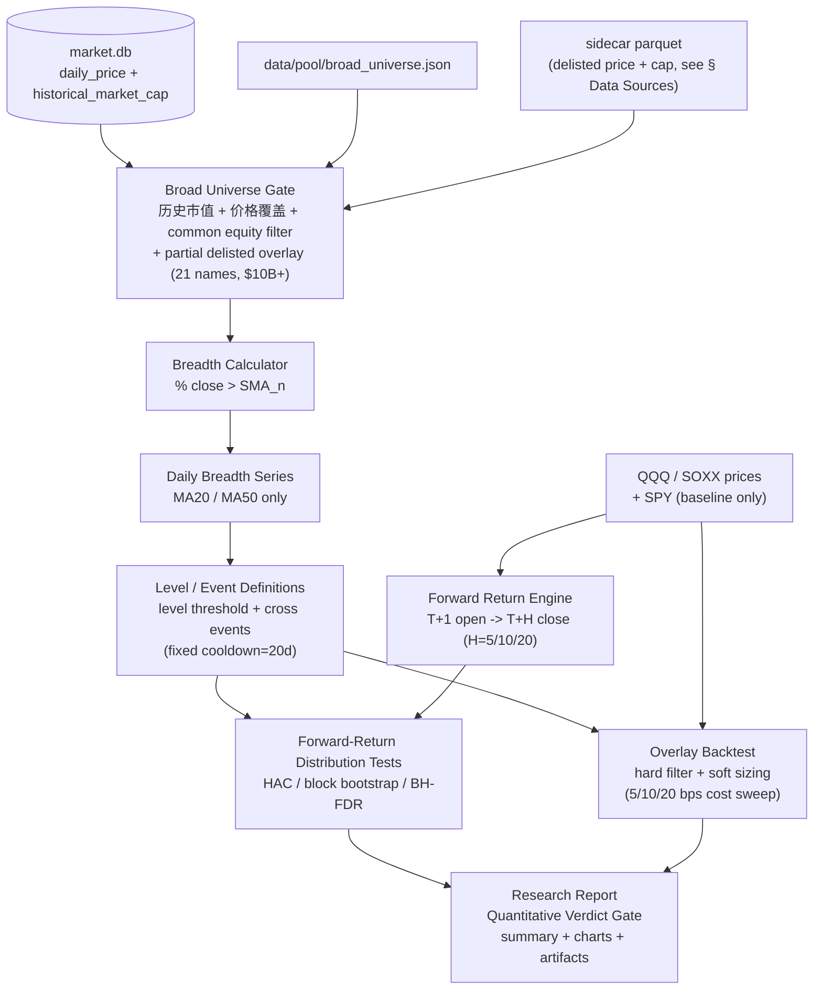
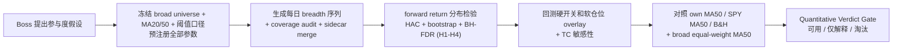

# Broad Breadth Participation Signal Study — QQQ/SOXX (Mid-Short-Term, MA20/50)

**Confidence: 94%**（v6，已合并第五轮 codex review：双 FDR 防 supportive cell 污染 + p-value sidedness 全局冻结 one-sided）

**Scope reframe（v4 重大调整）**:
本研究**不再做长期 regime 信号研究**。基于现有 market.db 仅 2021-02 起的样本（QQQ/SOXX/SPY ~5 calendar years），**主测窗口收窄为 MA20 + MA50**，删除 MA120/MA200。
研究问题改为："broad universe 中短期参与度（% above MA20/50）对 QQQ/SOXX 未来 5-20 天收益的预测力，是否显著优于 QQQ/SOXX 自身 MA50 信号。"

---

## Reviewer Onboarding（外部审阅者必读）

**这是什么**：一份**研究计划**（不是代码 PR、不是策略实盘），目的是检验 broad universe 中短期参与度对 QQQ/SOXX 的择时预测力。研究产物是 CSV + Markdown 报告，不会修改交易逻辑。

**项目背景速览**:
- 主仓库：未来资本 AI 交易台（个人千万美元组合的研究基础设施）
- 数据：本地 `market.db`（云端独占写入；daily_price 起点 2021-02-01；historical_market_cap 起点 2021-04-13）+ broad universe（FMP screener 维护的 $1B+ 全市场池）
- 历史教训：过往 RS 回测做 historical market cap 过滤后 Sharpe 1.54→1.26（-18%），survivorship bias 已知风险；过往 timing 研究 10 信号 + 12 参数全部跑输 buy-and-hold——本 plan 在协议设计上吸取了这些教训
- 北极星：本研究只研究中短期参与度信号，**不产生交易建议、不触碰个股 OPRMS**

**v4 关键约束（来自 codex review + Boss 决策）**:
- 样本仅 ~5 calendar years（4 effective years after MA50 burn-in），**强制收窄为中短期信号研究**——不研究长期 regime
- Survivorship overlay 是 **partial only**（21 只 $10B+ 退市样本），主 universe $1B+ 大部分退市样本未覆盖；结论措辞强制使用"偏差缩小"而非"完成"
- 业务门槛（CAGR +2pp / Sharpe +0.2 / 10 bps TC）保留，但**不靠 20 年统计样本背书**——是机构因子研究的常用业务参考线，结合本样本可作为筛选门槛而非显著性证明
- Primary FDR family 仅包含 forward-return 分布检验（H1-H4 全部同质化为可复现统计量），不再混入 regime overlay 比较

**审阅时请重点挑战**:
1. **统计协议是否会被自相关 / 多重检验 / 重叠 horizon 默默作弊**——见 `Statistical Protocol` 节
2. **样本仅 5 年是否足以支撑任何统计推断**——本计划承认 power 受限，是否应进一步收窄假设数量？
3. **Verdict gate 三标尺（CAGR +2pp / Sharpe +0.2 / 10 bps TC）在 5 年样本下是否过严或过松**——见 `Quantitative Verdict Gate § Why these thresholds`
4. **预注册参数是否真的覆盖所有自由度**——`30/50/70` 阈值、cooldown 20d、horizon `10/20`、universe 门槛 `$1B/$3B/$10B`、TC `5/10/20 bps`，还有哪个隐藏自由度没锁？
5. **baseline 是否公平**——必须证明 breadth 比 own MA50 / SPY MA50 / buy-and-hold 多提供信息

**不需要审的**：代码实现、工程基础设施、报告美观度。

**审阅输出建议格式**：每条意见标注严重度（RED 必须改 / ORANGE 强烈建议 / YELLOW 可选），引用 plan 章节名。

---

**仍待 Boss 确认的口径选择**:
- `$1B+ broad universe` 主口径 vs `$10B+ large/liquid subset` 主口径。我的建议（已写入 plan）：`$10B+` 做主口径（survivorship 较干净），`$1B+/$3B+` 做稳健性切片。
- `SMA` vs `EMA`。我的建议（已写入 plan）：主口径用 `SMA`，EMA 只作为敏感性检查。
- 最终落地是硬开关、软仓位系数，还是只进入晨报/PI 的 regime 解释层。**研究阶段不拍板**。

**Boss 已确认**:
- ✅ Survivorship 双口径强制：active-only vs with-delisted_partial 方向不一致 → 结论降级"未确认"
- ✅ Verdict gate 三标尺：CAGR +2pp / Sharpe +0.2 / 10 bps TC，全部同时满足才算"可用"
- ✅ 删除 MA200/MA120，主测窗口收窄为 MA20/MA50

**北极星对齐**: 对齐 `docs/design/north-star.md` 的"宏观/Regime"侧翼与"离线 R&D: 回测引擎 + 因子研究"。本计划只做 QQQ/SOXX 中短期参与度信号研究，不触碰个股 OPRMS、不产生交易建议。

**Goal:** 检验 broad universe 中短期参与度（`% above MA20`、`% above MA50`）对 QQQ/SOXX 未来 5-20 天收益的预测力，**并证明它比 QQQ/SOXX 自身 MA50 或 buy-and-hold 提供更多信息**。

**Tech Stack:** Python, pandas, numpy/scipy/statsmodels, SQLite `market.db`, existing broad universe data, existing timing/backtest conventions

**研究纪律前置声明（不可在执行中改）**:
- 所有阈值（`30/50/70`）、horizon（`10/20`）、cooldown（20d）、universe 门槛（$1B/$3B/$10B）均为**先验参数**，**禁止在 IS 上调优后回写本 plan**。
- 主假设 freeze 后任何参数调整一律降级为 exploratory，结论分线写。
- 如果先验参数在 IS 全部失效，结论是"该参数族无效"，**不允许搜索新参数族再做主假设**。

---

## Architecture（架构图）



> 一句话解释：breadth 每天只有一个市场状态值（MA20/MA50 两条），用它解释 QQQ/SOXX 未来 5-20 天收益分布，对照 own MA50 baseline 看是否有 incremental info。

## Business Flow（业务流程图）



> 一句话解释：先证明这个指标是否真的比指数自身 MA50 更有用，再决定是否进入日常 regime 解释层。

## Alternatives Considered（替代方案）

| 方案 | 优势 | 劣势 | 选择理由 |
|------|------|------|----------|
| **A. MA20/50 短中期参与度 study（推荐）** | 样本支撑足；统计单位清楚；适合 QQQ/SOXX 短中期择时 | 不能回答长期 regime 问题；event N 仍偏少 | v3→v4 reframe 后选择，匹配现有数据局限 |
| B. 原 plan v3 含 MA200 长期 regime | 完整 regime 框架 | 5 年样本下 MA200 burn-in 后 IS 仅 ~3.7y，FDR power 极弱 | 已弃，等数据扩展后另起 plan |
| C. 直接做策略回测，不做统计研究 | 最快看到 CAGR/Sharpe | 容易过拟合，不知道 edge 来自哪里 | 不选，先研究预测意义再谈策略 |
| D. 数据扩展（yfinance + FMP 历史回填到 2003）后再做 | 20 年样本支撑严格统计 | 启动延后 1-2 周；historical_market_cap 回填工作量大 | 推迟到本研究有 v4 信号后再启动 |

## Core Definitions（核心定义）

### 1. Breadth 指标

对每个交易日 `t`、每个均线窗口 `n`：

```text
breadth_n(t) = count(close_i(t) > SMA_n_i(t)) / count(eligible_i(t))
```

主测窗口：
- `MA50`: 中期参与度，第一优先。
- `MA20`: 短期参与度，第二优先。

派生序列：
- `breadth_n_raw`: 原始百分比。
- `breadth_n_sma5`: 5 日平滑，避免单日跳动。
- `breadth_n_slope10`: `breadth_n_sma5 - breadth_n_sma5.shift(10)`，衡量参与度改善/恶化（v3 是 slope20，v4 缩短匹配中短期）。

均线类型：主口径 `SMA`。`EMA` 只在 robustness 节做敏感性，不写入 primary。

**MA200 / MA120 / 长期 regime 信号一律不在本 plan 范围内**——等数据扩展到 ≥10 年后另起 plan。

### 2. Universe Eligibility（含 survivorship 处理 — partial overlay）

主口径：
- 使用 broad universe。
- 每天只统计当日有足够历史价格、且事件日之前最近可得历史市值达标的股票。
- **主门槛改为 `>= $10B`**（v3 是 $1B+；改 $10B+ 是因为现有 delisted overlay 仅覆盖 $10B+ tier，匹配后 survivorship 偏差最小）。
- 排除 ETF/指数产品；QQQ/SOXX 本身不进入 breadth 分母。
- 排除 dual-class 重复 ticker（同一公司只算一次）。

**Survivorship 处理（partial overlay - codex P1.2 修订）**:
- 主口径分母使用 **`extended_true_partial` universe**：当前 active universe + `delisted_large_caps.json` overlay (21 只 $10B+ 退市样本，覆盖区间 2021-02-03 ~ 2026-04-22)。
- **诚实命名**：这是 **partial overlay**，不是 full survivorship correction。21 只样本只覆盖 $10B+ tier 的部分退市公司，$1B-$10B 区间退市样本未覆盖；本 plan 主口径选择 $10B+ 是为了让 overlay 覆盖率尽量高。
- `coverage_audit.csv` 输出 `eligible_count_active` 和 `eligible_count_with_delisted_partial` 两列 + `delisted_overlay_coverage_ratio` = (overlay 内当日满足条件 ticker 数) / (理论上应有的 $10B+ 退市公司数估计)，让 partial 程度可见。
- **如果 active-only 与 with-delisted_partial 两口径在 H1-H4 上结论方向不一致，结论降级为"未确认"**——无论哪一口径显著都不算 primary。
- Verdict gate 措辞：**"两口径方向一致" = "偏差缩小"**，**不等于"survivorship 处理完成"**。

稳健性切片（exploratory only）：
- `$1B+`、`$3B+`：探索更宽 universe 是否改变结论方向（注意：这两个 tier 的 delisted overlay 覆盖率更低，survivorship 风险更高，结论仅供参考）。
- NASDAQ-only / Tech+Communication / Semiconductor-related subset。

必须输出 `coverage audit`：
- 每日 eligible count（active vs with-delisted_partial 两列）。
- 每年平均 eligible count。
- MA20 / MA50 可用起始日期（考虑 burn-in）。
- QQQ/SOXX target price coverage。
- **Effective sample window**：扣除 MA50 burn-in 与 historical_market_cap 起点后的真实有效起点终点，明确写在 audit 第一行。
- delisted_overlay_coverage_ratio 时间序列（让 partial 缺口可见）。

### 3. Target Returns

目标资产：
- **Primary targets**：`QQQ`, `SOXX`（进入 H1-H4 + FDR family）
- **Baseline only**：`SPY`（仅做对照，**不进入 primary FDR family**，不跑 H1-H4 显著性测试）

收益口径：
- 信号观察：`T close`。
- 执行假设：`T+1 open` 入场。
- 出场：`T+H close`。
- **Primary horizons**：`10 / 20` trading days（v3 是 5/10/20/60；v4 缩短匹配中短期信号）。
- **Supplementary horizons**：`5 / 60` trading days（仅观察，**不进 FDR**）。

报告同时输出：
- raw forward return。
- excess vs SPY。
- SOXX excess vs QQQ。

---

## Hypotheses（预注册假设）

### Primary Hypotheses（freeze 后不可改 — 全部为 forward-return 分布检验，可复现）

每条假设的 null hypothesis、test statistic、p-value 来源全部明确：

**P-value sidedness 全局冻结（codex P2-2 修订）**:
> H1-H4 全部 **one-sided**，方向按预注册先验：H1/H2/H3 测 forward return **更高**（upper-tailed），H4 测 forward return **更低**（lower-tailed）。HAC t-stat 与 bootstrap empirical p 均按预注册方向单侧计算。**禁止执行时切换到 two-sided**——这是常见的事后 p-hacking 路径。如果实际方向与预注册相反（例如 H1 显示 breadth_50 > 50% 时 forward return **更低**），primary 结论是"假设被拒绝且方向反转"，**不允许翻转方向后再算 two-sided p**。

1. **H1 — MA50 level effect**:
   - **Null**: `E[forward_return | breadth_50_sma5 > 50%] <= E[forward_return | breadth_50_sma5 <= 50%]`
   - **Pre-registered direction**: upper-tailed（breadth > 50% 时 forward return 更高）
   - **Test stat**: HAC-adjusted t-stat on mean difference (Newey-West, lag = horizon), **one-sided upper**
   - **Bootstrap**: block bootstrap (block=20d, 1000 resamples) → empirical p-value, **one-sided upper**
   - **Reject if**: BH-FDR-adjusted q < 0.1 (HAC-based) **AND** bootstrap p < 0.1（双门槛，全部 one-sided）

2. **H2 — MA20 level effect**:
   - **Null**: `E[forward_return | breadth_20_sma5 > 50%] <= E[forward_return | breadth_20_sma5 <= 50%]`
   - **Pre-registered direction**: upper-tailed（同 H1 方向）
   - **Test stat / bootstrap**: 同 H1（one-sided upper）
   - 注：H2 与 H1 高度相关（MA20 和 MA50 信号有重叠），BH-FDR 在 dependent tests 上仍 valid，但 power 会被惩罚。

3. **H3 — MA50 recovery event**:
   - **Event**: `breadth_50_sma5` 从 `<30%` 回升并上穿 `>=50%`（cooldown 20d）
   - **Null**: `E[forward_return after recovery event] <= E[forward_return | random day in same year]`
   - **Pre-registered direction**: upper-tailed（recovery 后 forward return 改善/上行）
   - **Test stat**: HAC t-stat（重叠 event window 用 cluster-robust SE）, **one-sided upper**
   - **Bootstrap**: block bootstrap on null distribution → empirical p-value, **one-sided upper**
   - **Reject if**: BH-FDR q < 0.1 AND bootstrap p < 0.1 AND event N >= 15（全部 one-sided）

4. **H4 — MA50 deterioration event**:
   - **Event**: `breadth_50_sma5` 从 `>70%` 下穿 `<50%`（cooldown 20d）
   - **Null**: `E[forward_return after deterioration event] >= E[forward_return | random day in same year]`
   - **Pre-registered direction**: lower-tailed（deterioration 后 forward return 下行）
   - **Test stat / bootstrap**: 同 H3，但 **one-sided lower**
   - **Reject if**: BH-FDR q < 0.1 AND bootstrap p < 0.1 AND event N >= 15（全部 one-sided lower）

**为什么 v4 删除了 v3 的 H2（MA200 regime overlay 比较）**:
v3 H2 是"breadth_200_sma5 > 50% 比 own_MA200 更能降低回撤"，这是 regime overlay backtest 比较，**没有单一 null hypothesis 和 p-value**（codex P1.1 指出）。v4 把此类比较移入 Overlay Backtest 章节作为 supplementary metric，**不进入 primary FDR family**。

**阈值预注册声明**:
> `30/50/70` 是先验三段切点（基于交易直觉的对称结构），**freeze 后禁止在 IS 上调优**。如果 50% 在 IS 上效果差，结论是"该阈值族无效"，不允许回头试 45%/55%/40%。任何替代阈值的尝试一律降为 exploratory，结论分线写，不与 H1-H4 主结论混述。

### Exploratory Hypotheses（可探索，结论不写入 primary）

- breadth slope 是否比 level 更有预测力。
- `$1B+/$3B+` universe 是否改变结论方向（survivorship 风险更高）。
- EMA 替代 SMA 是否改变结论方向。
- `breadth_20_sma5 > 50% AND breadth_50_sma5 > 50%` 双重确认信号（v3 hard filter 之一）。
- 60d horizon（supplementary horizon 转 exploratory）。
- 行业切片（NASDAQ-only / Tech / Semi）。

---

## Statistical Protocol（统计协议）

### 1. 样本切分

- Full sample: broad universe 数据可用起点至最新（按 MA50 burn-in 截断；预计 effective start 约 2021-07）。
- OOS split: 默认 `2025-01-01`，与 PMARP hardening 研究保持可比。
- 预计 IS 约 3.5 年 / OOS 约 1.3 年。
- 报告至少分三段：Full / IS / OOS。
- **不做 rolling yearly split**（v3 有；v4 删——5 年样本切年度后每段太短无意义）。

### 2. 检验方式

State tests（H1-H2）：
- 按 breadth state 分组：`<20`, `20-30`, `30-50`, `50-70`, `>70`。
- 对每个 state 输出 QQQ/SOXX 的 forward return mean/median/hit rate/drawdown proxy。
- 用 HAC/Newey-West t-test 处理重叠 horizon 的自相关（lag = horizon）。

Event tests（H3-H4）:
- recovery: `<30% -> >=50%`。
- deterioration: `>70% -> <50%`。
- event 触发后按 horizon 做 forward return。
- **Cooldown 固定 20 个交易日**（不再随 horizon 滑动）。
- **Event N 下限**：每个 (target × event_type × horizon) cell 在 IS 中 N >= 15 才能进 primary 结论；N 在 [10, 15) 降级为 supportive，<10 归为不可用。
  - **样本警示**：5 年样本 + 20d cooldown 下，每年大概率只有 0-2 个 event；预计 IS 内 H3+H4 event N 各 ~5-10 个。Plan **承认 power 严重受限**，acceptance criteria 把 N<10 的 cell 强制不可用作为兜底。

Multiple testing：
- Primary family: `target(2: QQQ/SOXX) × horizon(2: 10d/20d) × hypothesis(4: H1-H4)` = **16 个测试**。**Family 大小固定为 16**，不因 N 不足而收缩——这是预注册的全部检验。
- 对 primary family 做 BH-FDR，q < 0.1 才算显著。
- HAC-based p AND bootstrap-based p **双门槛**——任何一边 p >= 0.1 都不算显著（防御 5 年样本下单一 SE 估计的不稳定）。
- exploratory（slope / $1B+/$3B+ / EMA / 双重确认 / 60d / 行业切片 / SPY / supplementary horizons）全部不进 FDR family。

**Low-N cell 处理（codex 第四轮 + 第五轮修订 — 冻结规则不留自由度）**:
预注册 16 个 cell 全部固定输出到 `state_forward_returns.csv` / `event_forward_returns.csv`，但执行时 event N 可能不足。统一处理规则如下，**不允许执行者临场决定**：

| Cell N（IS 内）| **Verdict FDR 输入** | Audit FDR 输入（旁路展示）| Verdict gate 资格 | 报告标记 |
|--------------|--------------------|------------------------|------------------|---------|
| N >= 15 | 实际计算的 HAC p 与 bootstrap p | 同左 | 可作为 H1-H4 至少一项 q < 0.1 的依据 | `tested` |
| 10 <= N < 15 | **强制 p = 1.0** | 实际计算的 p 值（旁路）| **不能**作为 verdict gate 显著性依据（仅 supportive，分线写） | `supportive` |
| N < 10 | **强制 p = 1.0** | 实际 p 值（如可计算）或 NaN | 不可用 | `not_tested` |

**双 FDR 方案（codex P2-1 修订）**:
- **Verdict FDR**（主结论用）：family=16，仅 N>=15 的 cell 用实际 p，其余 cell 一律 p=1.0。这是 verdict gate 唯一可引用的 q-value。
- **Audit FDR**（透明度用）：family=16，N>=10 的 cell 用实际 p。**仅展示，不影响 verdict**。在报告 Robustness 节披露，让 reviewer 看到"如果放宽 N 门槛会怎样"。
- 输出列：CSV 同时给 `verdict_p`, `verdict_q`, `audit_p`, `audit_q` 四列；verdict gate 严格只看 verdict_q。

**理由**：
- Family 大小固定 = 16，避免"剔除 N 不足 cell 后 family 变小、剩余 cell q-value 偏小"的隐性放宽
- supportive cell 用实际 p 进 verdict FDR 会污染 BH 排名（小 p supportive cell 会拉低其他 eligible cell 的 q），所以 verdict FDR 必须 p=1.0
- audit FDR 用实际 p 是给 reviewer 的透明度，让"低 N 但 p 很小的现象是否值得后续扩样本验证"可见，但不允许直接当主结论
- N < 10 强制 p=1 是 BH-FDR 标准保守处理（Benjamini-Hochberg 1995 原始论文允许）
- 执行者 **不允许**用其他规则（剔除、降级 family 大小、p<0.5 fallback 等）

**State test cell（H1/H2）的 N**：state test 不存在 N 不足问题（每个 state 有几百个 daily observation），仅 event test cell（H3/H4）适用上表。

Robustness：
- block bootstrap，固定 20 个交易日 block，1000 次重抽样。
- 和三类 baseline 比较：
  - `QQQ/SOXX > own MA50`（**核心 baseline**）
  - `SPY > SPY MA50`
  - broad equal-weight index `> MA50`
  - buy-and-hold（额外 baseline）
- Active-only vs with-delisted_partial universe 双口径必须方向一致。

### 3. 策略 Overlay 回测

只做最小可解释版本，**不做参数优化**。

Baseline：
- Buy and hold QQQ。
- Buy and hold SOXX。
- `QQQ > QQQ_MA50` filter（**核心 baseline**）。
- `SOXX > SOXX_MA50` filter。
- `SPY > SPY_MA50` filter。

Hard filter（breadth-driven）:
- `in_market = breadth_50_sma5 > 50%`
- `in_market = breadth_20_sma5 > 50%`
- `in_market = breadth_50_sma5 > 50% AND breadth_20_sma5 > 50%`（双重确认）

Soft sizing:

```text
weight = clip((breadth_50_sma5 - 30%) / (70% - 30%), w_min, 1.0)
```

主口径 `w_min = 0.0`（无下限护盘，纯信号驱动）。
作为 robustness：`w_min = 0.25`（最小风控仓位先验，仅展示，不进入 verdict gate）。

Execution:
- Signal at `T close`。
- Position change at `T+1 open`。
- **Transaction cost sweep**：`5 / 10 / 20 bps` one-way 三档全部跑出来。verdict gate 用 `10 bps` 作为标尺。
- No leverage。
- Cash return initially set to 0；可选 robustness 使用 3M T-bill proxy。

Metrics:
- CAGR, annual vol, Sharpe, Sortino, max drawdown, Calmar。
- Exposure, turnover, number of trades。
- Excess CAGR vs buy-and-hold。
- Excess CAGR vs `QQQ/SOXX own MA50`（**核心 baseline**）。
- Worst 5 drawdown windows with dates。

---

## Quantitative Verdict Gate

**目的**：避免最终报告 verdict 写成"看心情"。每只 target 独立判定。

| Verdict | 全部门槛必须同时满足 |
|---------|---------------------|
| **可用（Production-ready）** | (1) primary FDR 后 q < 0.1（H1-H4 至少一项），HAC AND bootstrap 双 p < 0.1；(2) 任一 hard-filter 或 soft-sizing overlay 在 OOS 上 CAGR 比 `QQQ/SOXX own MA50` baseline 多 ≥ 2pp；(3) Sharpe 提升 ≥ 0.2；(4) IS/OOS 方向一致；(5) active-only 与 with-delisted_partial 双 universe 方向一致；(6) 在 10 bps TC 下仍满足 (2)(3)。 |
| **仅解释（Explanatory only）** | primary FDR q < 0.1 但 overlay 跑不赢 own MA50 baseline，或 OOS 显著但 IS 反向，或两 universe 口径冲突。仅作为晨报/PI 解释层使用，不进仓位逻辑。 |
| **淘汰（Discard）** | primary FDR q ≥ 0.1，或 IS+OOS 都跑不赢 own MA50，或主假设 event N 全部 < 10。 |

报告必须明确写出每只 target 落在哪一档，**禁止用模糊措辞绕过 gate**。

### Why these thresholds（门槛数字推理）

每个数字都是**业务先验门槛**，**不依赖样本量统计推导**——5 年样本下没有 power 提供严格统计背书。这些数字的角色是"factor research 行业惯例参考线"，用于过滤"看起来不错但不值得部署"的边缘信号。

#### ① 年化收益（CAGR）比 own MA50 多 **≥ 2pp**

- **意义**：QQQ/SOXX 自己用 `> own_MA50` 已经能跑出一个简单 timing 策略。breadth 必须**至少多 2 个百分点年化**，才能证明它不是"换皮 MA50"。
- **为什么是 2pp**：1pp 在 5 年样本里基本无法和噪音区分；5pp 是顶级因子级别的 alpha，要求过严会让任何真实但温和的信号都被误杀；**2pp 是机构因子研究里"明显但不离谱"的常见业务门槛**（不是统计显著性门槛）。
- **样例**：own MA50 跑出 10% CAGR → breadth overlay 必须 ≥ 12% 才通过；breadth 跑出 10.8% = 不通过（仅解释）。

#### ② Sharpe 比 own MA50 高 **≥ 0.2**

- **意义**：光看 CAGR 不够。如果 breadth 多赚 2pp 但波动也放大很多，相当于加了杠杆而非真正改善。Sharpe 把波动惩罚进去。
- **为什么是 0.2**：**0.2 对应"波动差不多、CAGR 多几个点"的典型好信号画像**——是业务参考线，不是 5 年样本下的统计显著阈值（5 年样本 Sharpe 估计 SE ~0.45，0.2 远在 SE 内，所以这不是在声称统计显著）。
- **样例**：own MA50 Sharpe = 0.7 → breadth overlay 必须 Sharpe ≥ 0.9。

#### ③ 用 **10 bps one-way TC** 作为评分标尺

- **意义**：bps = 万分之一。10 bps = 0.1%。代表每次买进/卖出的真实隐性成本（点差 + 滑点 + 佣金），决定 turnover 高的策略会不会被成本吃光。
- **为什么是 10 bps**：QQQ/SOXX 流动性极好、机构盘可以拿到 5 bps，但 5 bps 评分过于乐观，**对个人投资者的真实可达成本而言 10 bps 更保守也更现实**；20 bps 给小盘 ETF 用合适，QQQ/SOXX 不至于。
- **如果策略 turnover > 20 次/年**：必须额外展示 20 bps 下的衰减。

#### ④ 三个门槛**全部同时满足**才算"可用"

- 任何一个不过 = 降级"仅解释"或"淘汰"
- 这是有意设计的高门槛——避免 "CAGR 高但 Sharpe 一般"、"5 bps 下漂亮但 10 bps 下崩溃" 这类边缘策略被包装成结论
- 5 年样本 + verdict gate 高门槛的组合**预期大概率落"仅解释"或"淘汰"**——这是 acceptable outcome；如果落"可用"，必须配合数据扩展（路径 A）做 hardening study 才能进生产

**审查者可挑战的点**：
- 5 年样本下三标尺是否过严（Sharpe +0.2 在 SE ~0.45 下基本是噪音内）？
- 是否应该换成相对百分比（"比 baseline 高 25%"）？
- 是否应该补 Calmar（CAGR/MDD）作为第四个标尺？
- 是否应该明确"5 年样本 verdict 'production-ready' 不直接进生产，必须二次 hardening"？

---

## Data Sources & Sidecar Spec（codex P2.2 修订）

**目的**：明确 delisted overlay 数据如何与 market.db 合并；防止执行时变成一次性脚本拼接。

### 数据源优先级

```text
For each (symbol, date) lookup:
  1. market.db.daily_price / historical_market_cap (primary)
  2. sidecar parquet (fallback for delisted overlay symbols only)
  3. NaN / drop (if neither has data)
```

**铁律（来自 L2 反模式）**: **禁止把研究数据写入本地 market.db**——market.db 是 P3 所有权模型下的云端独占写入；研究产生的退市/实验数据走 sidecar parquet，不污染主库。

### Sidecar Parquet Schema

路径：`data/breadth_study/sidecar/`

文件 1: `delisted_prices.parquet`
```
columns:
  symbol      str    (退市 ticker)
  date        date   (交易日)
  open        float
  high        float
  low         float
  close       float
  volume      int64
  source      str    ('fmp_historical' [primary] / 'yfinance' [fallback] / 'manual')
  fetched_at  timestamp
```

**Price source 优先级（codex P2 修订 — 与既有 PMARP true-survivorship plan 保持一致）**:
- **Primary**: FMP `/stable/historical-price-eod/full?symbol=XXX`（同供应商保持 price + market_cap 一致性；TWTR/ATVI/FRC 实测可用，详见 `docs/plans/2026-04-22-pmarp-true-survivorship-remediation-plan.md`）
- **Fallback only**: yfinance（仅当 FMP historical 对该 ticker 返回空/失败时使用；yfinance 的退市符号兼容性已知较差，不作为主源）
- **Manual**: 极少数边缘情况（ticker 改名、被收购合并）允许人工填入并标 `source='manual'`，但必须在 sidecar 注释或 README 中记录来源

文件 2: `delisted_market_cap.parquet`
```
columns:
  symbol      str
  date        date   (历史市值生效日)
  market_cap  float  (USD)
  source      str    ('fmp_stable' / 'manual')
  fetched_at  timestamp
```
- **Primary**: FMP `/stable/historical-market-capitalization?symbol=XXX`（已实测 TWTR/ATVI/FRC 可返回完整退市前序列）
- **No yfinance fallback for market_cap**: yfinance 不提供历史市值序列，缺失只能走 manual 或放弃该 ticker

### Loader 合并规则（PIT 严格修复 — codex P1 修订）

**关键修复**：v4 初版伪代码 `WHERE date <= t AND market_cap >= 10e9` 会把"历史上任意一天 ≥ $10B 的 ticker 在之后所有日期永久纳入"——形成 once-large-forever-eligible 偏差。正确逻辑必须先取**每个 symbol 在 t 之前最新一笔** market_cap，再用该 latest cap 判断门槛。

```python
MAX_STALENESS_DAYS = 90  # latest cap 距离 t 超过 90 天则该 symbol 视为不可用（避免长期停牌/数据缺口被误纳入）
MIN_CAP = 10e9

def load_universe_eligible_for_date(t: date) -> pd.DataFrame:
    """
    Point-in-time eligibility:
      - 对每个 symbol，取 historical_market_cap 中 date <= t 的最新一笔 latest_cap
      - 仅当 latest_cap >= $10B AND (t - latest_cap_date).days <= MAX_STALENESS_DAYS 时纳入
      - 禁止使用未来值；禁止 once-large-forever-eligible
    """
    # 1. Active universe: 每个 symbol 取 t 之前最新一笔 market_cap
    sql_active = """
    SELECT symbol, market_cap AS latest_cap, date AS latest_cap_date
    FROM (
        SELECT symbol, market_cap, date,
               ROW_NUMBER() OVER (PARTITION BY symbol ORDER BY date DESC) AS rn
        FROM historical_market_cap
        WHERE date <= ?
    ) ranked
    WHERE rn = 1
    """
    active_latest = market_db.query(sql_active, t)
    active = active_latest[
        (active_latest.latest_cap >= MIN_CAP) &
        ((pd.to_datetime(t) - pd.to_datetime(active_latest.latest_cap_date)).dt.days <= MAX_STALENESS_DAYS)
    ]

    # 2. Delisted overlay: sidecar parquet 同样取 latest-per-symbol
    sql_delisted = """
    SELECT symbol, market_cap AS latest_cap, date AS latest_cap_date
    FROM (
        SELECT symbol, market_cap, date,
               ROW_NUMBER() OVER (PARTITION BY symbol ORDER BY date DESC) AS rn
        FROM sidecar_market_cap
        WHERE date <= ? AND symbol IN delisted_overlay_symbols
    ) ranked
    WHERE rn = 1
    """
    delisted_latest = sidecar_market_cap.query(sql_delisted, t)
    delisted = delisted_latest[
        (delisted_latest.latest_cap >= MIN_CAP) &
        ((pd.to_datetime(t) - pd.to_datetime(delisted_latest.latest_cap_date)).dt.days <= MAX_STALENESS_DAYS)
    ]

    # 3. Concat, dedup (active 优先), drop ETFs/dual-class
    eligible = pd.concat([active, delisted]).drop_duplicates(subset='symbol', keep='first')
    eligible = eligible[~eligible.symbol.isin(EXCLUDED_TICKERS)]

    return eligible

def get_close_price(symbol: str, t: date) -> float:
    # market.db first, sidecar fallback
    px = market_db.get_close(symbol, t)
    if px is None and symbol in delisted_overlay_symbols:
        px = sidecar_prices.get_close(symbol, t)
    return px
```

**校验测试（必须在 Task 2 单元测试中显式覆盖）**:
- 退市 ticker 退市后超过 `MAX_STALENESS_DAYS` 天的日期不应进入 eligible
- 一只 2022 年达到 $20B、2024 年跌到 $2B 的 ticker，2025 年应**不在** eligible 内
- 一只新上市 IPO ticker，IPO 前的日期不应进入 eligible（latest cap 不存在）
- coverage_audit 输出 `pit_excluded_due_to_staleness_count` 列，让该规则的影响可见

### Coverage Audit `source` 列

`coverage_audit.csv` 加 `delisted_source_breakdown` JSON 列，每行记录当日来自 sidecar 的 ticker 数 by source：
```json
{"yfinance": 12, "fmp_historical": 5, "manual": 4}
```

让 reviewer 一眼看到 sidecar 数据的可信度分布。

---

## Risks & Mitigation（风险自证）

- **R0（最大风险） — 样本量不足**: 仅 ~5 calendar years，effective ~4 years（扣 MA50 burn-in），event N 极少。
  - 缓解：删除 MA200/MA120 长期信号，收窄为中短期参与度研究；event N 下限三档（15/10/<10）；HAC + bootstrap 双 p 双门槛；verdict gate **预期大概率落"仅解释"**，是 acceptable outcome；如果落"可用"必须配合数据扩展二次 hardening。
- **R1 — Survivorship bias (partial coverage only)**: delisted overlay 仅覆盖 21 只 $10B+，$1B-$10B 退市样本未覆盖。
  - 缓解：主 universe 改为 $10B+（让 overlay 覆盖率最大化）；coverage_audit 输出 `delisted_overlay_coverage_ratio` 让 partial 缺口可见；verdict gate 措辞"偏差缩小"而非"完成"；$1B+/$3B+ tier 仅 exploratory。
- **R2 — 与 own MA50 同源**: breadth 与 QQQ/SOXX 本身趋势高度同源，最后只是换皮的 MA50。
  - 缓解：必须和 `QQQ/SOXX own MA50`、`SPY MA50`、broad equal-weight MA50 做对照；verdict gate 强制要求 overlay 跑赢 own MA50 ≥ 2pp。
- **R3 — Coverage bias**: broad universe 历史不是 CRSP 级真全市场。
  - 缓解：输出 coverage audit；主口径用 historical market cap gate；用 `$3B/$1B` 切片做 exploratory robustness。
- **R4 — 参数过拟合**: 阈值 `30/50/70` 在 IS 上看起来"合适"是因为后视。
  - 缓解：阈值预注册声明；任何调整降为 exploratory；event N 下限防止小样本噪音被包装成信号。
- **R5 — Cooldown vs horizon 耦合**: 原 plan v1 cooldown 滑动会在长 horizon 下杀死 power。
  - 缓解：cooldown 固定 20d；event N 下限作为兜底。
- **R6 — Transaction cost 乐观**: 5 bps 在高频翻面下不够保守。
  - 缓解：`5/10/20 bps` 三档 sweep；verdict gate 用 10 bps 标尺。
- **为什么不用更简单的做法:** 直接画 `% above MA50` 和 QQQ 叠图只能产生直觉，不能回答它是否比指数自身均线更有择时价值。
- **回滚方案:** 如果 verdict 是"仅解释"或"淘汰"，只把 breadth 作为晨报解释性 market health chart，不进入仓位/择时逻辑；如果是"可用"，启动数据扩展项目做 hardening study。

---

## Acceptance Criteria（验收标准）

- [ ] 生成 `daily_breadth.csv`，包含 `date`, `eligible_count_active`, `eligible_count_with_delisted_partial`, `breadth_20/50`, smoothing 与 slope 字段。
- [ ] 生成 `coverage_audit.csv`，包含双 eligible_count 列、`delisted_overlay_coverage_ratio`、`delisted_source_breakdown` JSON、`delisted_price_missing_ratio`、`pit_excluded_due_to_staleness_count`、effective sample window first row。
- [ ] Sidecar loader 单元测试通过：(a) 历史 $20B 后跌至 $2B 的 ticker 当前不在 eligible；(b) 退市后超 90 天不在 eligible；(c) IPO 前不在 eligible。
- [ ] 16 个 primary cell 全部出现在 forward-return CSV，N<10 的 cell 标 `not_tested` 且 FDR 输入 p=1.0；N∈[10,15) 的 cell 标 `supportive` 不进 verdict gate。
- [ ] Sidecar 价格优先级证据：`sidecar_coverage_report.md` 显示 FMP historical 是 primary source，yfinance 仅在 FMP 缺失时使用；该比例必须显式列出。
- [ ] 生成 `state_forward_returns.csv`，按 state 输出 QQQ/SOXX forward return + HAC t-stat + bootstrap CI。
- [ ] 生成 `event_forward_returns.csv`，覆盖 recovery/deterioration event；每个 cell 标注 N，N < 10 标红强制不可用。
- [ ] 生成 `overlay_backtest.csv`，覆盖 QQQ/SOXX buy-and-hold、own MA50、SPY MA50、equal-weight MA50、breadth hard filter (3 组)、breadth soft sizing；每个策略 × `5/10/20 bps` TC 三档。
- [ ] 报告明确回答：breadth 是否在 10 bps TC 下仍优于 `QQQ/SOXX own MA50` 和 `SPY MA50`。
- [ ] 报告明确区分 primary conclusion 与 exploratory observation；exploratory 不允许出现在 Executive Summary。
- [ ] 任何进入结论的结果必须同时展示 Full / IS / OOS。
- [ ] 如果 OOS 与 IS 方向相反，结论只能是"观察"，不能写成"有效"。
- [ ] 如果 active-only 与 with-delisted_partial universe 结论方向不一致，结论降级为"未确认"。
- [ ] 每只 target 必须落入 Quantitative Verdict Gate 三档之一，不允许模糊措辞。
- [ ] Hard filter overlay 如果 turnover > 20 次/年，必须在报告里点名并展示 20 bps TC 下的衰减。
- [ ] Sidecar parquet 文件按 § Data Sources & Sidecar Spec 定义的 schema 存在；coverage_audit 含 source breakdown 列。
- [ ] H1-H4 每条假设报告同时展示 HAC p-value 和 bootstrap p-value，缺一不可。

---

## Research Output（研究产物）

建议产物路径（**全部 untracked**，仅供本地研究）：

- `docs/research/2026-04-28-broad-breadth-qqq-soxx-study.md`（**git tracked**，最终报告）
- `data/breadth_study/.gitkeep`（git tracked 占位）
- `data/breadth_study/daily_breadth.csv`（untracked）
- `data/breadth_study/coverage_audit.csv`（untracked）
- `data/breadth_study/state_forward_returns.csv`（untracked）
- `data/breadth_study/event_forward_returns.csv`（untracked）
- `data/breadth_study/overlay_backtest.csv`（untracked）
- `data/breadth_study/charts/*.png|html`（untracked）
- `data/breadth_study/sidecar/delisted_prices.parquet`（untracked）
- `data/breadth_study/sidecar/delisted_market_cap.parquet`（untracked）

需要在 `.gitignore` 中追加：
```
data/breadth_study/*.csv
data/breadth_study/charts/
data/breadth_study/sidecar/
!data/breadth_study/.gitkeep
```

报告结构：

1. Executive Summary：结论先行（每只 target 的 verdict gate 落档）。
2. Study Protocol：universe、target、execution、stats、预注册参数清单、样本量警示。
3. Coverage Audit：数据是否可信；双 universe 口径；effective sample window；delisted overlay coverage ratio。
4. Breadth Anatomy：MA20/50 的历史形态。
5. Forward Return Tests：state + event；HAC + bootstrap + BH-FDR（H1-H4）。
6. Overlay Backtest：QQQ/SOXX 策略结果；TC 三档对比。
7. Baseline Comparison：own MA50 / SPY MA50 / equal-weight MA50 / buy-and-hold。
8. Robustness：market cap slices ($1B/$3B exploratory)、IS/OOS、bootstrap、active-vs-delisted_partial、SMA-vs-EMA。
9. Verdict：每只 target 独立落档；落档理由引用 verdict gate 条款；如果"可用"必须明确建议数据扩展二次 hardening。

---

## Task Checklist（研究执行清单）

### Task 1: Freeze Protocol

- [ ] 确认主 universe：broad `$10B+`，`extended_true_partial` (active + 21-name $10B+ delisted overlay)。
- [ ] 确认 primary MA：`MA20/MA50`（**MA200/MA120 已删**）。
- [ ] 确认 primary thresholds：`30/50/70`（先验，禁止 IS 调优）。
- [ ] 确认 targets：`QQQ/SOXX`（primary），`SPY` 仅作为 baseline 对照。
- [ ] 确认 OOS start：`2025-01-01`。
- [ ] 确认 cooldown：固定 20 交易日。
- [ ] 确认 event N 下限：15 / 10 / <10 三档。
- [ ] 确认 TC sweep：`5/10/20 bps`，verdict 标尺为 10 bps。
- [ ] 确认 soft sizing 主口径：`w_min = 0.0`；`w_min = 0.25` 仅 robustness。
- [ ] 确认 primary horizons：10d / 20d；supplementary：5d / 60d。
- [ ] 确认 sidecar parquet schema 与 loader merge 规则。
- [ ] **Boss sign-off：阈值/横位/参数全部冻结，进 Task 2 后不可改。**

### Task 2: Build Sidecar + Daily Breadth Series

- [ ] 从 `delisted_large_caps.json` 读取 21 只 $10B+ 退市 ticker 列表。
- [ ] **Primary price source**: 用 FMP `/stable/historical-price-eod/full?symbol=XXX` 串行拉取每只退市 ticker 的 OHLCV 历史（间隔 2s 防限流），存入 `sidecar/delisted_prices.parquet` 并标 `source='fmp_historical'`。
- [ ] **Fallback price source**: 仅当 FMP 对某 ticker 返回空/失败时，用 yfinance 单只 `Ticker.history()` 补齐，标 `source='yfinance'` 并在 coverage_audit 中点名。
- [ ] **Market cap source**: 用 FMP `/stable/historical-market-capitalization?symbol=XXX` 拉取每只退市 ticker 的历史市值，存入 `sidecar/delisted_market_cap.parquet` 并标 `source='fmp_stable'`。yfinance 不提供历史市值，缺失只能走 manual。**禁止写入 market.db**。
- [ ] 输出 sidecar coverage 报告：每只 ticker 的 price/market_cap 起止日期 + source + missing days；放入 `data/breadth_study/sidecar/sidecar_coverage_report.md`。
- [ ] 实现 universe loader：按 § Data Sources & Sidecar Spec 定义的 PIT 严格 SQL（每 symbol latest-cap + max staleness），严禁 once-large-forever-eligible。
- [ ] **Loader 单元测试**（必跑）:
  - 退市 ticker 退市后超过 90 天的日期不进 eligible
  - 一只历史 $20B 但当前 $2B 的 ticker，当前不进 eligible
  - IPO 前的日期不进 eligible
- [ ] 从 `market.db.daily_price` 读取 broad universe (active) OHLCV。
- [ ] 计算 `SMA20/SMA50`。
- [ ] 输出 daily breadth + coverage audit（双 eligible_count 列 + delisted_overlay_coverage_ratio + delisted_source_breakdown + delisted_price_missing_ratio + pit_excluded_due_to_staleness_count + effective sample window）。
- [ ] 手工检查 eligible count 时间序列无异常断崖。

### Task 3: Forward Return Study

- [ ] 读取 QQQ/SOXX/SPY OHLC。
- [ ] 计算 `T+1 open -> T+H close` forward returns（H = 5/10/20/60）。
- [ ] 跑 H1+H2 state tests（HAC t-stat + bootstrap CI；双 p-value 报告）。
- [ ] 跑 H3+H4 recovery/deterioration event tests（cooldown=20d，标注 N，N<10 强制不可用）。
- [ ] 输出 BH-FDR 结果 (primary family = 16 tests)，q < 0.1 的 cell 标记。
- [ ] **Active-only vs with-delisted_partial 双口径并行**，方向不一致的 cell 标黄。
- [ ] supplementary horizons (5d/60d) 单独输出，不进 FDR。

### Task 4: Overlay Backtest

- [ ] 实现 hard filter 三组（MA50 / MA20 / 双重确认）。
- [ ] 实现 soft sizing 一组（w_min=0 主 + w_min=0.25 robustness）。
- [ ] TC 三档 sweep：5/10/20 bps。
- [ ] 输出 metrics 和 worst drawdown windows。
- [ ] 与 buy-and-hold、own MA50、SPY MA50、equal-weight MA50 对比。
- [ ] turnover > 20 次/年 的策略点名展示 20 bps 衰减。

### Task 5: Write Verdict Report

- [ ] 先写每只 target 的 verdict gate 落档结果。
- [ ] 再写细节。
- [ ] 标注 primary vs exploratory，exploratory 不进 Executive Summary。
- [ ] 对 QQQ 和 SOXX 分别给 verdict（独立判定）。
- [ ] 明确是否建议进入生产晨报/PI/regime 解释层。
- [ ] 如果 verdict 是"可用"，必须明确建议数据扩展二次 hardening（不能直接进生产）。
- [ ] 报告 freeze 后不可基于"再调一调"重写。

---

## CC Review Focus（请 CC 重点审）

1. **统计单位是否干净:** breadth 是 market-date 序列，不应被误塞进 symbol-date event study。
2. **是否存在前视:** universe eligibility（point-in-time historical_market_cap）、SMA、signal timing、forward return 都必须只用 `T close` 前已知信息。
3. **自相关处理是否足够:** daily state + overlapping forward returns 不能用普通 iid t-test；HAC lag 必须等于 horizon。
4. **多重检验是否被控制:** primary family 锁 16 个测试 + BH-FDR + 双 p-value 双门槛；exploratory 不得包装成主结论。
5. **baseline 是否公平:** 必须证明 breadth 比 QQQ/SOXX 自己的 MA50 或 SPY MA50 多提供信息（10 bps TC 下）。
6. **Survivorship 是否处理:** active-only vs with-delisted_partial 双口径方向一致才进 primary；overlay coverage ratio 必须可见。
7. **Sidecar 数据完整性:** 每个退市 ticker 的价格/市值数据是否完整覆盖其 active 期；source 来源可信度是否在 audit 体现。
8. **是否过度工程化:** 第一版只需要研究产物，不需要 runs DB、生产 cron、dashboard wiring。

## Boss Review Focus（请 Boss 重点看）

1. `$10B+` 主口径是否符合你心里的"参与度"，还是想保留 `$1B+` 但接受更高 survivorship 风险。（我的建议：$10B+ 主，$1B+/$3B+ 作 exploratory）
2. `30/50/70` 阈值是否符合你的交易直觉。（freeze 后不可再改）
3. 第一版只研究 QQQ/SOXX，不扩到 SPY/IWM。（SPY 仅 baseline）
4. 最终更想要硬开关还是软系数。（研究阶段两条都跑）
5. 5 年样本下 verdict gate 大概率落"仅解释"或"淘汰"，是否接受这是 acceptable outcome。如果你期待"必须出可用结论"，则需要先启动数据扩展项目（路径 A）。
6. Verdict gate 数字（+2pp / +0.2 / 10 bps）你已确认；是否还想加 Calmar 作为第四标尺？

---

## Changelog

- **v1 (2026-04-28 早)**: 初稿。
- **v2 (2026-04-28 当日修订, 一轮 CC review)**: 合并 R1-R3 + O1-O3 + Y1-Y3 修订（survivorship/cooldown/threshold preregistration/SOXX start date/soft sizing 自由度/TC sweep/git ignore/verdict gate/SPY 角色）。
- **v3 (2026-04-28 当日修订, 二轮)**: Boss 确认 verdict gate 三标尺；加 Reviewer Onboarding 节；Verdict Gate 加 "Why these thresholds" 子节。
- **v6 (2026-04-28 当日修订, 五轮 codex review)**: 合并 codex 2 点。新增/修订：
  - **codex P2-1 修复 (Supportive cell 污染 verdict q)**: 双 FDR 方案：Verdict FDR 仅 N>=15 的 cell 用实际 p，N<15 全部强制 p=1.0；Audit FDR family=16 N>=10 用实际 p 仅作透明度展示，不影响 verdict gate；CSV 同时给 `verdict_p`/`verdict_q`/`audit_p`/`audit_q` 四列
  - **codex P2-2 修复 (p-value sidedness 自由度)**: 全局冻结 one-sided：H1/H2/H3 upper-tailed（预注册方向 forward return 更高），H4 lower-tailed（预注册方向 forward return 更低）；显式禁止执行时翻转方向算 two-sided；如果实际方向与预注册相反，结论是"假设被拒绝且方向反转"
- **v5 (2026-04-28 当日修订, 四轮 codex review)**: 合并 codex 3 点。新增/修订：
  - **codex P1 修复 (PIT loader bug)**: v4 初版 SQL `WHERE date <= t AND market_cap >= 10e9` 会把曾经达标的 ticker 永久纳入；改为每 symbol latest-per-(date<=t) cap + 90 天 staleness 上限；加 3 条单元测试覆盖（一只历史 $20B 当前 $2B 不在 eligible / 退市超 90 天不在 / IPO 前不在）；coverage_audit 加 `pit_excluded_due_to_staleness_count` 列
  - **codex P2 修复 (Low-N FDR treatment)**: family 大小固定 16；N>=15 实际 p、N∈[10,15) supportive、N<10 强制 p=1.0；明确表格冻结规则不留自由度
  - **codex P2 修复 (price source 与既有经验冲突)**: 主价格源改为 FMP `/stable/historical-price-eod/full`（与 PMARP true-survivorship plan 已记录的"yfinance 退市符号兼容性差"经验对齐），yfinance 降为 fallback；market_cap 主源 FMP `/stable/historical-market-capitalization`（无 yfinance fallback）；sidecar coverage 报告必须列 source breakdown 与 missing ratio
- **v4 (2026-04-28 当日修订, 三轮 codex review + Boss 决策)**: 合并 codex 4 点 + Boss "删 MA200，看中短期 MA"决策。新增/修订：
  - **Scope reframe**: Regime study → Mid-Short-Term Participation Signal Study；删除 MA200/MA120
  - **codex P1.1 修复**: H1-H4 全部改为 forward-return 分布检验，明确 null/test stat/p-value；删除 v3 H2 (MA200 regime overlay 比较)；新 H2 = MA20 level effect
  - **codex P1.2 修复**: 主 universe $1B+ → $10B+（匹配 overlay 覆盖率）；命名 `extended_true` → `extended_true_partial`；verdict gate 措辞"完成"→"偏差缩小"
  - **codex P2.1 修复**: 删除所有"20 年样本"背书措辞；门槛保留为业务先验，明确不依赖样本量统计推导
  - **codex P2.2 修复**: 新增 `Data Sources & Sidecar Spec` 章节，定义 parquet schema + loader merge 规则 + coverage audit source breakdown
  - **样本量警示**: 全文加入 power 受限声明；event N 下限 15/10/<10；HAC + bootstrap 双 p-value 双门槛；verdict 预期大概率落"仅解释"作为 acceptable outcome；如落"可用"必须配合数据扩展二次 hardening
  - **Horizon 收窄**: 5/10/20/60/120 → primary 10/20，supplementary 5/60
  - **Baseline 改 own MA50**: v3 全部 own MA200 → v4 全部 own MA50
  - **slope 窗口**: slope20 → slope10（匹配中短期）
  - **Rolling yearly split 删除**: 5 年样本切年度无意义
