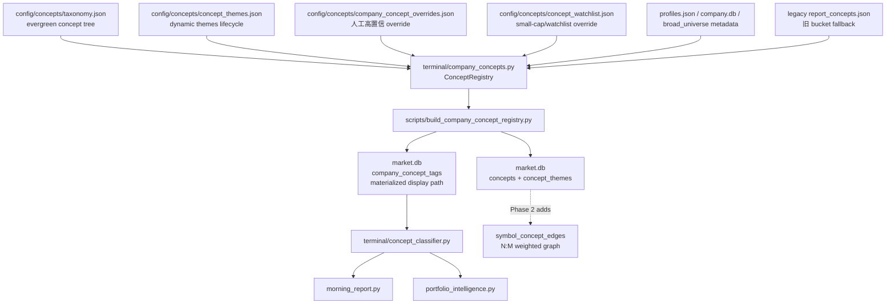
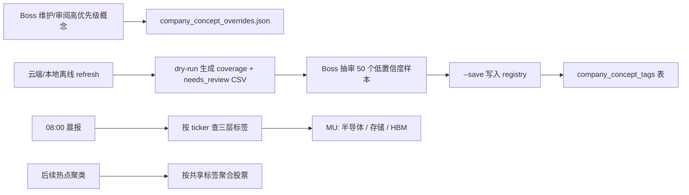

# Company Concept Registry Phase 1 Implementation Plan

> **For Claude:** REQUIRED SUB-SKILL: Use superpowers:executing-plans to implement this plan task-by-task.

**Version: v4 (2026-04-29)**
**Confidence: 92%** (post-review hardening)
**不确定点**: POET 的精确 tertiary 需要实现前用公司 profile/官方描述核实；默认不再写死为“硅光”，先按 `通信/网络设备 / 光通信 / InP光接口` 处理。Boss 已确认 `MU = 半导体 / 存储 / HBM` 的展示语义、Phase 1 直接覆盖 broad 全量；标签语言采用中文主标签 + 行业标准英文缩写（HBM/DRAM/NAND/EUV/GPU/ETF/InP 等）。
**北极星对齐**: `docs/design/north-star.md` 的数据层 + 宏观/Regime 侧翼里的“热点/主题”。本阶段只建设标签底座，不输出买卖建议，不进入 CIO-B。

**v4 Changelog（review hardening, no scope change）**:
- `_KEYWORD_RULES` 重排：所有 catch-all 下沉到列表底部，subcategory 优先；修复 NVDA-class profile 含 "Semiconductors" + "GPU" 时被误打成 semiconductor catch-all 的潜在 bug
- Soft-warning review CSV：confidence < 0.7 的 rule/legacy 行也写入 review CSV（带 `review_reason=soft_low_confidence` 列），但**不影响 gate** — gate 仍按 `needs_review=1` 计算 tail rate；目的是给 Boss 一个 keyword-match 风险的抽查队列
- `symbol_concept_edges` (Phase 2 N:M graph 表) 在 Phase 1 schema 一次性创建，避免 Phase 2 再做 schema migration；Phase 1 不写入
- Cron 频率定为**周频**（与 Boss 确认）：build 脚本不进 daily morning report 路径，避免 build 失败 block 报告；新 symbol 进入 broad top 100 时最多延迟 7 天
- E2E 覆盖补足：现有 `store_with_registry` fixture 已跑通 build → DB → classifier 链路；v4 新增 rule path / fallback path 的 e2e round-trip 验证

**Goal:** Build a stable company concept registry so broad/pool/portfolio symbols can display concept labels like `MU = 半导体 / 存储 / HBM`, while preserving a path to future N:M concept graph clustering.

**Tech Stack:** Python, SQLite `market.db`, JSON config, existing `MarketStore`, existing `terminal.concept_classifier`, pytest.

---

## Scope（阶段边界）

Phase 1 只做概念标签底座：

- 新增 evergreen `concepts` 树表和三层标签 taxonomy。
- 新增 manual overrides 源文件。
- 新增 `market.db.company_concept_tags` materialized display 表，字段使用 `concept_id` 外键而不是裸字符串。
- 预留动态主题 `concept_themes`，把 HBM/液冷/硅光这类 12-18 个月生命周期的热点从 evergreen 行业树里拆出来。
- 新增离线 build/refresh 脚本，把 overrides + profile keyword fallback 写入表。
- 让晨报/PI classifier 优先读取 registry，读不到再 fallback 现有 JSON classifier。
- 直接覆盖 broad 全量 universe + watchlist overrides，并产出覆盖率报告：多少 symbol 有三层标签、多少低置信度、多少 fallback。

Phase 1 不做：

- 不设计 hotness score。
- 不做热点聚类排序。
- 不引入 LLM 批量分类。
- 不把 `company_concept_tags` 当作 Phase 2 最终聚类图结构；它只是 Phase 1 的展示/查询 materialized layer。
- 不承诺 broad 3000 全部高质量人工准确；全量写入时用 `confidence` + `needs_review` 标出低置信度名字，先保证高优先级名字稳定。

---

## Architecture（架构图）



> 一句话解释：taxonomy 和人工 override 是可审源头，Phase 1 生成稳定展示标签；Phase 2 真聚类时加 N:M edge graph，不需要推翻概念树。

## Business Flow（业务流程图）



> 一句话解释：先 review 覆盖率和噪声，再写 DB；每天报告读取已经沉淀好的标签，未来聚类复用 concept graph。

## Alternatives Considered（替代方案）

| 方案 | 优势 | 劣势 | 选择理由 |
|------|------|------|----------|
| A. Concept tree + materialized registry + JSON overrides（推荐） | 运行稳定；可审计；云端 cron 不依赖模型；适合 3000 symbols 查询；未来可扩 N:M edges | 需要一次 schema + builder | 是未来热点聚类的正确底座 |
| B. 继续扩 `report_concepts.json` | 最快；无需 DB migration | 只能粗 bucket；三层标签和覆盖率难维护；3000 公司 JSON 会失控 | 不选，已经接近上限 |
| C. 晨报运行时调用 LLM 分类 | 看起来智能；冷启动快 | cron 不稳定、成本高、输出漂移、不可回测 | 不选，LLM 可后续离线辅助，不进生产晨报 |
| D. 只用 FMP sector/industry | 免费且现成 | 太粗，无法区分 `MU=存储/HBM`、`POET=光通信/InP光接口` | 只能作为 fallback evidence |

## Risks & Mitigation（风险自证）

- **最大风险:** taxonomy 设计不稳，后续一边用一边改导致历史标签不可比。
  - **缓解:** Phase 1 只定义 20-40 个常用 L1/L2/L3 标签；新增标签必须进 taxonomy，不允许脚本自由造词；标签语言采用中文主标签 + 行业标准英文缩写。
- **最大风险:** 单行三层标签锁死 Phase 2 聚类，无法表达 `TSLA=电动车+自动驾驶+机器人` 这类多主线公司。
  - **缓解:** `company_concept_tags` 只作为 Phase 1 materialized display path；底层先建 `concepts(concept_id, level, parent_id)`，Phase 2 增加 `symbol_concept_edges(symbol, concept_id, weight)` 即可，不改 concept id 或 display 表语义。
- **最大风险:** 把 HBM/液冷/硅光等动态热点塞进 evergreen taxonomy，导致每次热点变化都要改固定行业表。
  - **缓解:** evergreen `concepts` 只放长期行业/业务分类；动态热点进入 `concept_themes`，带 lifecycle/status。晨报可展示 dynamic theme，但不把它当永久行业子类。
- **最大风险:** profile metadata 太薄，规则误分。
  - **缓解:** manual override 优先级最高；低置信度标记为 `needs_review=true`，不假装准确。
- **最大风险:** broad 全量 `needs_review` 比例过高，污染后续热点聚类。
  - **缓解:** 采用分层 gate：S/A 池（portfolio + watchlist + broad top 100）必须 100% 高置信覆盖；broad 长尾允许 `needs_review_rate < 30%` 后默认 save；超门槛时只允许 Boss 显式批准 `--force-save`。
- **为什么不用更简单的做法:** 单纯扩 ticker override 只能解决显示，不会形成可聚类的数据资产；未来热点聚类需要每只股票可被多层标签聚合。
- **最大风险（v4 新增）:** rule 命中 confidence=0.6 但 `needs_review=0`，60-80% 的 broad 标签靠 keyword 匹配但没有审查机制。
  - **缓解:** v4 引入 soft-warning review CSV — 所有 confidence<0.7 的 rule/legacy 行会写入 review CSV 带 `review_reason=soft_low_confidence`，**不影响 gate** 但给 Boss 一个抽查队列；rule 误分时通过 manual override 就地覆盖，不需要改代码。
- **最大风险（v4 新增）:** `_KEYWORD_RULES` 顺序敏感，catch-all 在 specific rule 之前会让 GPU 公司被误打成 semiconductor。
  - **缓解:** v4 重排 rule list — 所有 subcategory rule 在前，所有 catch-all 在后；新增 4 个测试守住该顺序契约（`tests/test_company_concepts.py::test_rule_*_beats_*_catchall`）。
- **回滚方案:** 仅删除 `company_concept_tags` 表，保留 `concepts` / `concept_themes` / `symbol_concept_edges`（Phase 2 概念底座复用，不重建）；同时让 classifier fallback 现有 `report_concepts.json`。不影响价格、基本面、持仓等核心表。

## Phase 2 Query Shape（聚类查询形态）

Phase 2 不应该只做 `GROUP BY primary_concept_id`。那会把多主线公司压扁，例如 `TSLA` 同时属于电动车、自动驾驶、机器人；`NVDA` 同时属于 GPU、AI 加速器、云基础设施；`POET` 可能既属于光通信，也被 AI 推理算力链带动。

Phase 2 的正确形态是 concept graph：

```sql
-- Future table; Phase 1 不依赖它，但 schema 必须为它预留 concept_id。
CREATE TABLE symbol_concept_edges (
    symbol TEXT NOT NULL,
    concept_id TEXT NOT NULL REFERENCES concepts(concept_id),
    weight REAL NOT NULL DEFAULT 1.0,
    edge_type TEXT NOT NULL DEFAULT 'business_exposure',
    confidence REAL NOT NULL DEFAULT 0,
    source TEXT NOT NULL DEFAULT 'unknown',
    updated_at TEXT NOT NULL,
    PRIMARY KEY (symbol, concept_id, edge_type)
);
```

Hotspot clustering later will query:

```text
量价候选股票
→ join symbol_concept_edges
→ 按 concept_id / parent_id 聚合 weighted heat
→ graph similarity 找同链条共振
```

Phase 1 的 `company_concept_tags` 是给晨报和 PI 用的 materialized display shortcut；它保留一个主展示路径，但不宣称这是股票的完整概念图。

## Acceptance Criteria（验收标准）

- [ ] `market.db` 自动创建 `concepts`、`concept_themes`、`company_concept_tags` 表，不破坏现有数据。
- [ ] `company_concept_tags` 使用 `primary_concept_id / secondary_concept_id / tertiary_concept_id` 外键到 `concepts`，不把裸字符串作为长期 schema。
- [ ] `secondary_concept_id` / `tertiary_concept_id` 可空；无真实语义时不硬凑三层，展示时自动省略空层。
- [ ] `MU` 展示返回 `半导体 / 存储 / HBM`，business role 为 `DRAM/HBM存储`；其中 HBM 作为 dynamic theme 或 display overlay，不污染 evergreen tree。
- [ ] `POET` manual override 先按 `通信/网络设备 / 光通信 / InP光接口` 处理；实现前必须用 profile/官方描述核实，不再默认写死“硅光”。
- [ ] `NVDA`、`COHR`、`VRT`、`TSLA`、`SOXX` 有稳定 display tags；是否三层取决于真实语义，不强填 tertiary。
- [ ] Manual override seed 覆盖 60-80 个高优先级名字：portfolio 持仓、watchlist、小盘热点、现有 broad 头部 100 中最常出现的信号名。
- [ ] `--dry-run` 强制输出 `needs_review` CSV；`--save` 默认执行分层 gate：`priority_coverage == 100%`（priority_list = portfolio holdings ∪ watchlist ∪ broad top 100 by 30d ADV）且 `tail_needs_review_rate < 30%`。
- [ ] 超过分层 gate 时 `--save` 失败并提示补 overrides；只有 Boss 显式批准时才允许 `--force-save`。
- [ ] `--rebuild-display` 跳过 manual override 自带的 `display_tags` 行；输出摘要打印 `manual_display_tags_preserved` 计数。
- [ ] `POET` 即使不在 broad universe，也通过 watchlist override 进入 registry。
- [ ] 晨报/PI 对有 registry 的 symbol 展示三层标签；没有 registry 时继续 fallback 旧 classifier，不报错。
- [ ] Build 脚本输出覆盖率摘要，包括 `total / tagged / manual / rule / fallback / needs_review (hard) / soft_review (low_conf)`。
- [ ] Review CSV 包含两列队列：`review_reason=hard_needs_review`（fallback rows，gate 阻塞）与 `review_reason=soft_low_confidence`（rule/legacy confidence<0.7 rows，仅抽查不阻塞 gate）。
- [ ] `_KEYWORD_RULES` 顺序契约：所有 subcategory rule 在 catch-all 之前；4 个测试守住该契约（GPU/AI server/optical 命中 specific rule 而非 catch-all；纯 fabless 仍命中 catch-all）。
- [ ] `symbol_concept_edges` 表在 Phase 1 schema 已创建（Phase 2 reservation），FK 指向 `concepts(concept_id)`；Phase 1 build 脚本不写入。
- [ ] Targeted tests pass: `tests/test_company_concepts.py`, `tests/test_market_store_concepts.py`, `tests/test_concept_classifier.py`, `tests/test_morning_report.py`, `tests/test_portfolio/test_intelligence.py`, `tests/test_build_concept_registry.py`。

---

## Data Model（数据模型）

### Table: `concepts`

Evergreen 行业/业务分类树。这里放 3-5 年内相对稳定的概念，不放 HBM、液冷、硅光这类热点生命周期主题。

```sql
CREATE TABLE IF NOT EXISTS concepts (
    concept_id TEXT PRIMARY KEY,
    label TEXT NOT NULL,
    level INTEGER NOT NULL CHECK(level IN (1, 2, 3)),
    parent_id TEXT REFERENCES concepts(concept_id),
    concept_type TEXT NOT NULL DEFAULT 'evergreen',
    status TEXT NOT NULL DEFAULT 'active',
    created_at TEXT NOT NULL,
    updated_at TEXT NOT NULL
);

CREATE INDEX IF NOT EXISTS idx_concepts_parent ON concepts(parent_id);
CREATE INDEX IF NOT EXISTS idx_concepts_level ON concepts(level);
```

### Table: `concept_themes`

动态主题表。这里放 HBM、液冷、硅光、AI PC、核电重估等热点，带生命周期。Phase 1 只支持 manual theme overlay，不做热点发现。

```sql
CREATE TABLE IF NOT EXISTS concept_themes (
    theme_id TEXT PRIMARY KEY,
    label TEXT NOT NULL,
    parent_concept_id TEXT REFERENCES concepts(concept_id),
    lifecycle_state TEXT NOT NULL DEFAULT 'watch',
    active_from TEXT,
    active_to TEXT,
    source TEXT NOT NULL DEFAULT 'manual',
    evidence TEXT DEFAULT '',
    created_at TEXT NOT NULL,
    updated_at TEXT NOT NULL
);

CREATE INDEX IF NOT EXISTS idx_themes_parent ON concept_themes(parent_concept_id);
CREATE INDEX IF NOT EXISTS idx_themes_state ON concept_themes(lifecycle_state);
```

### Table: `company_concept_tags`

Phase 1 的 materialized display path。每只股票仍有一个主展示路径，方便晨报和 PI 查询；但字段是 concept id 外键，未来可无损扩展到 `symbol_concept_edges`。
`secondary_concept_id` 和 `tertiary_concept_id` 可空；无意义的第三层不硬填，展示层只拼接非空标签。
`display_tags` 是反规范化缓存，用于晨报快速展示；如果 `concepts.label` 改名，必须通过 builder 重建 display，不能手改 DB。

```sql
CREATE TABLE IF NOT EXISTS company_concept_tags (
    symbol TEXT PRIMARY KEY,
    primary_concept_id TEXT NOT NULL REFERENCES concepts(concept_id),
    secondary_concept_id TEXT REFERENCES concepts(concept_id),
    tertiary_concept_id TEXT REFERENCES concepts(concept_id),
    theme_ids TEXT DEFAULT '[]',
    display_tags TEXT DEFAULT '',
    business_role TEXT DEFAULT '',
    confidence REAL NOT NULL DEFAULT 0,
    source TEXT NOT NULL DEFAULT 'unknown',
    evidence TEXT DEFAULT '',
    needs_review INTEGER NOT NULL DEFAULT 0,
    updated_at TEXT NOT NULL
);

CREATE INDEX IF NOT EXISTS idx_cct_primary ON company_concept_tags(primary_concept_id);
CREATE INDEX IF NOT EXISTS idx_cct_secondary ON company_concept_tags(secondary_concept_id);
CREATE INDEX IF NOT EXISTS idx_cct_tertiary ON company_concept_tags(tertiary_concept_id);
```

### Source JSON: `config/concepts/company_concept_overrides.json`

```json
{
  "version": "2026-04-28",
  "symbols": {
    "MU": {
      "primary_concept_id": "semiconductor",
      "secondary_concept_id": "memory",
      "tertiary_concept_id": "memory_chips",
      "theme_ids": ["hbm"],
      "display_tags": ["半导体", "存储", "HBM"],
      "business_role": "DRAM/HBM存储",
      "confidence": 0.98,
      "evidence": "Manual override: DRAM/NAND/HBM supplier"
    },
    "POET": {
      "primary_concept_id": "network_equipment",
      "secondary_concept_id": "optical_communications",
      "tertiary_concept_id": "inp_optical_interface",
      "theme_ids": [],
      "display_tags": ["通信/网络设备", "光通信", "InP光接口"],
      "business_role": "光通信/光器件",
      "confidence": 0.95,
      "evidence": "Manual override; verify POET profile before freezing"
    }
  }
}
```

### Taxonomy JSON: `config/concepts/taxonomy.json`

```json
{
  "concepts": [
    {"concept_id": "semiconductor", "label": "半导体", "level": 1, "parent_id": null},
    {"concept_id": "memory", "label": "存储", "level": 2, "parent_id": "semiconductor"},
    {"concept_id": "memory_chips", "label": "存储芯片", "level": 3, "parent_id": "memory"},
    {"concept_id": "network_equipment", "label": "通信/网络设备", "level": 1, "parent_id": null},
    {"concept_id": "optical_communications", "label": "光通信", "level": 2, "parent_id": "network_equipment"},
    {"concept_id": "inp_optical_interface", "label": "InP光接口", "level": 3, "parent_id": "optical_communications"}
  ],
  "themes": [
    {"theme_id": "hbm", "label": "HBM", "parent_concept_id": "memory", "lifecycle_state": "active"}
  ]
}
```

---

## Implementation Checklist（细粒度任务）

### Task 1: Add Concept Store Schema

**Files:**
- Modify: `src/data/market_store.py`
- Test: `tests/test_market_store_concepts.py`

**Step 1: Write failing tests**

- Test a fresh `MarketStore(tmp_path / "market.db")` creates `concepts`, `concept_themes`, and `company_concept_tags`.
- Test `upsert_concepts()` inserts concept tree rows and preserves parent links.
- Test `upsert_concept_themes()` inserts dynamic theme rows.
- Test `upsert_company_concepts()` inserts and updates `MU` with concept ids + theme ids.
- Test `get_company_concepts(["MU", "POET"])` returns dict keyed by symbol.

**Step 2: Run failing tests**

```bash
/Users/owen/CC\ workspace/Finance/.venv/bin/python -m pytest tests/test_market_store_concepts.py -q
```

Expected: fail because tables/methods do not exist.

**Step 3: Implement minimal schema + methods**

- Add table DDL to `_SCHEMA`.
- Add `"concepts"`, `"concept_themes"`, and `"company_concept_tags"` to `_VALID_TABLES`.
- Add:
  - `upsert_concepts(rows: list[dict]) -> int`
  - `upsert_concept_themes(rows: list[dict]) -> int`
  - `upsert_company_concepts(rows: list[dict]) -> int`
  - `get_company_concepts(symbols: list[str]) -> dict[str, dict]`
  - `get_company_concept_coverage() -> dict`

**Step 4: Run tests**

Expected: `tests/test_market_store_concepts.py` passes.

### Task 2: Add Taxonomy And Manual Overrides

**Files:**
- Create: `config/concepts/taxonomy.json`
- Create: `config/concepts/concept_themes.json`
- Create: `config/concepts/company_concept_overrides.json`
- Create: `config/concepts/concept_watchlist.json`
- Test: `tests/test_company_concepts.py`

**Manual override seed symbols for Phase 1:**

- Portfolio/pool core: `MU`, `NVDA`, `MSFT`, `GOOG`, `AMZN`, `TSM`, `ASML`, `META`, `TSLA`, `PDD`, `DXYZ`, `SOXX`
- Current theme examples: `POET`, `COHR`, `VRT`, `OKLO`, `SMCI`, `AVGO`, `AMD`, `WDC`, `STX`, `LITE`, `CIEN`, `GLW`
- Expand manual overrides to 60-80 symbols before rollout, fully covering the `priority_list` defined in Task 4: portfolio holdings ∪ watchlist small caps ∪ broad top 100 by trailing 30-day dollar volume. Top recurring broad signal names with weak profile rules can be added beyond the 80 cap if needed.
- Build target: broad universe 全量。上述 seed 只是 manual override 的优先名单，不限制 registry 覆盖范围。

**Step 1: Write tests**

- Validate every override concept id exists in taxonomy.
- Validate every theme id exists in `concept_themes.json`.
- Validate no symbol has empty `primary_concept_id`.
- Validate confidence is between 0 and 1.
- Validate watchlist symbols are included even if absent from broad universe.

**Step 2: Run tests**

Expected: fail until files and validation helper exist.

### Task 3: Build Company Concept Registry Module

**Files:**
- Create: `terminal/company_concepts.py`
- Test: `tests/test_company_concepts.py`

**Behavior:**

1. Load taxonomy.
2. Load manual overrides.
3. Convert a profile dict into a candidate concept:
   - manual override first
   - keyword rules second
   - legacy `report_concepts.json` bucket fallback third
   - `其他 / '' / ''` fallback last
   - tertiary can be `None`; display omits missing levels instead of inventing a weak label
4. Return:

```python
{
    "symbol": "MU",
    "primary_concept_id": "semiconductor",
    "secondary_concept_id": "memory",
    "tertiary_concept_id": "memory_chips",
    "theme_ids": ["hbm"],
    "display_tags": "半导体 / 存储 / HBM",
    "business_role": "DRAM/HBM存储",
    "confidence": 0.98,
    "source": "manual",
    "evidence": "...",
    "needs_review": 0,
}
```

**Step 1: Write tests**

- `MU` returns manual tags.
- `POET` returns manual `InP光接口` optics tags even if profile says `Semiconductors`.
- Unknown software profile returns rule-based `软件/SaaS`.
- Unknown thin profile returns `其他` with `needs_review=1`.
- Profile with no meaningful tertiary returns empty `tertiary_concept_id` and a two-level `display_tags` string.

### Task 4: Add Build/Refresh Script

**Files:**
- Create: `scripts/build_company_concept_registry.py`
- Test: `tests/test_company_concepts.py`

**CLI:**

```bash
python scripts/build_company_concept_registry.py --symbols broad --dry-run
python scripts/build_company_concept_registry.py --symbols broad --save
python scripts/build_company_concept_registry.py --symbols broad --save --force-save
python scripts/build_company_concept_registry.py --rebuild-display
```

**Data inputs:**

- `config/concepts/taxonomy.json`
- `config/concepts/concept_themes.json`
- `config/concepts/company_concept_overrides.json`
- `config/concepts/concept_watchlist.json`
- `data/fundamental/profiles.json`
- `data/pool/universe.json`
- `data/scans/broad_universe.json` or existing broad universe metadata path
- optional `company.db.companies`

**Execution order:**

1. Load and validate `taxonomy.json`.
2. `upsert_concepts(taxonomy["concepts"])`.
3. Load and validate `concept_themes.json`.
4. `upsert_concept_themes(themes)`.
5. Load broad universe + watchlist symbols.
6. Compute `priority_list` (see definition below).
7. Build company concept rows from manual overrides, profiles, and fallback rules.
8. Write review CSV and coverage summary.
9. Only after review gate passes, `upsert_company_concepts(rows)`.

This order is mandatory because `company_concept_tags.*_concept_id` references `concepts(concept_id)`, and `theme_ids` must resolve against `concept_themes` before company rows are saved.

**Priority list 定义（gate 判定基准）:**

```
priority_list = portfolio_holdings
              ∪ concept_watchlist.json symbols
              ∪ broad universe top 100 by trailing 30-day dollar volume
```

- `portfolio_holdings` 来自 `company.db.holdings`（当前持仓 symbol set）。
- `concept_watchlist.json` 是手工维护的小盘热点名单。
- `broad universe top 100`：从 `data/scans/broad_universe.json` 取 trailing 30-day dollar volume 排前 100。市值或单日成交都不稳，30 天 ADV 平滑后更能代表"市场实际关注"的名字。
- `priority_coverage` = priority_list 中 `needs_review=0` 的占比；gate 要求 100%。
- `tail_needs_review_rate` = `(broad universe \ priority_list)` 中 `needs_review=1` 的占比；gate 要求 < 30%。

**Display tags 缓存优先级（`--rebuild-display`）:**

- 如果某 symbol 在 `company_concept_overrides.json` 提供了 `display_tags` 字段（manual override 的手写串），rebuild **跳过该行**——手写的更准，不被自动拼接覆盖。
- 仅对 `source ∈ {rule, fallback, legacy}` 的行用 `concepts.label + active concept_themes.label` 重新拼接 `display_tags`。
- Builder 必须把 `manual_display_tags_preserved` 计数打进输出摘要，方便 Boss 验证。

**Output:**

```text
Company Concept Registry
symbols: 2769
watchlist_added: 12
priority_list_size: 178   # portfolio + watchlist + broad top 100 ADV (含去重)
priority_coverage: 100.0% # priority_list 中非 needs_review 占比
tagged: 2769
manual: 72
rule: 2290
fallback: 407
needs_review: 407
tail_needs_review_rate: 14.7%   # 长尾（broad \ priority）中 needs_review 占比
review_csv: reports/concept_registry/needs_review_2026-04-28.csv
saved: no
```

**Step 1: Write script tests with tmp files**

- dry-run does not write DB.
- dry-run always writes a `needs_review` CSV.
- dry-run validates that all referenced concept/theme ids exist before save is allowed.
- `priority_list` resolves to portfolio holdings ∪ watchlist symbols ∪ broad top 100 by trailing 30-day dollar volume; test injects fixtures for all three sources and asserts the resulting set.
- save writes expected rows only when the layered gate passes: `priority_coverage == 100%` and `tail_needs_review_rate < 30%`.
- save fails with a clear message when `priority_coverage < 100%` or `tail_needs_review_rate >= 30%`.
- `--force-save` bypasses the layered gate only when explicitly passed, and logs `forced_save=true` in output.
- `--rebuild-display` recomputes `display_tags` from `concepts.label` + active theme labels for `source ∈ {rule, fallback, legacy}` rows; manual override rows that carry their own `display_tags` are preserved verbatim and counted in `manual_display_tags_preserved`.
- missing profile still writes manual overrides.
- watchlist symbols are included even when absent from broad universe.
- save test verifies concepts/themes are inserted before company rows so first-run foreign keys do not fail.

### Task 5: Wire Runtime Classifier To Registry

**Files:**
- Modify: `terminal/concept_classifier.py`
- Modify: `scripts/morning_report.py`
- Modify: `scripts/portfolio_intelligence.py` only if needed
- Test: `tests/test_concept_classifier.py`, `tests/test_morning_report.py`, `tests/test_portfolio/test_intelligence.py`

**Behavior:**

- `ConceptClassifier.classify(item)` keeps returning one coarse bucket for backwards compatibility.
- Add `ConceptClassifier.concept_tags(item) -> list[str]`.
- Add `ConceptClassifier.display_tags(item) -> str`, e.g. `半导体 / 存储 / HBM`.
- For registry-hit symbols, display tags come from `market.db.company_concept_tags` joined/resolved through `concepts` + optional `concept_themes`.
- For registry-miss symbols, fallback to current JSON classifier.
- Existing tests must not break.

**Step 1: Tests**

- Registry hit: `MU` displays `半导体 / 存储 / HBM`.
- Registry hit: `POET` displays `通信/网络设备 / 光通信 / InP光接口`.
- Registry hit with empty tertiary displays two levels, e.g. `半导体 / 晶圆代工`, without a trailing slash or placeholder.
- Registry miss: existing `NVDA` fallback bucket still works if DB unavailable.
- DB unavailable does not crash morning report.

### Task 6: Report Formatting Upgrade

**Files:**
- Modify: `scripts/morning_report.py`
- Test: `tests/test_morning_report.py`

**Behavior:**

- Existing bucket grouping remains by `primary_concept_id` display label when registry exists. This is display grouping only, not Phase 2 graph clustering.
- Row display adds three tags:

```text
MU Micron | 半导体/存储/HBM | DRAM/HBM存储 | +4.2% | 3.1σ | $160B
```

- If only old classifier exists:

```text
MU Micron | 半导体链 | DRAM/HBM存储 | ...
```

**Step 1: Tests**

- Sample market signal with `concept_tags` renders all three tags.
- Missing registry keeps current output and does not show `Unclassified`.

### Task 7: Verification And Rollout

**Commands:**

```bash
/Users/owen/CC\ workspace/Finance/.venv/bin/python -m compileall src/data/market_store.py terminal/company_concepts.py terminal/concept_classifier.py scripts/build_company_concept_registry.py scripts/morning_report.py

/Users/owen/CC\ workspace/Finance/.venv/bin/python -m pytest \
  tests/test_market_store_concepts.py \
  tests/test_company_concepts.py \
  tests/test_concept_classifier.py \
  tests/test_morning_report.py \
  tests/test_portfolio/test_intelligence.py
```

**Optional local smoke:**

```bash
/Users/owen/CC\ workspace/Finance/.venv/bin/python scripts/build_company_concept_registry.py --symbols broad --dry-run
```

Expected:

- prints priority coverage and long-tail `needs_review_rate`
- writes `reports/concept_registry/needs_review_YYYY-MM-DD.csv`
- does not write DB unless `--save` is passed and the layered gate passes

**Cloud rollout later, not in implementation PR unless Boss approves:**

1. Merge code.
2. Cloud `git pull`.
3. Run `python3 scripts/build_company_concept_registry.py --symbols broad --dry-run`.
4. Review CSV: Boss samples 50 `needs_review` rows before first save.
5. Add/adjust manual overrides until `priority_coverage == 100%` (priority_list = portfolio holdings ∪ watchlist ∪ broad top 100 by 30d ADV) and `tail_needs_review_rate < 30%`.
6. Run `python3 scripts/build_company_concept_registry.py --symbols broad --save`.
7. Verify table count and sample rows.
8. Only then wire into 08:00 report cron.

---

## Boss Decisions Applied

1. **POET 标签修正:** 不再默认写 `硅光`；先按 `通信/网络设备 / 光通信 / InP光接口` 处理，并在实现前核实 profile/官方描述。
2. **MU 展示语义确认:** 报告展示使用 `半导体 / 存储 / HBM`；数据模型中 HBM 作为 dynamic theme/display overlay，不污染 evergreen tree。
3. **Phase 1 覆盖范围:** 直接跑 broad 全量，低置信度标 `needs_review`。
4. **标签语言:** 采用中文主标签；保留行业标准英文缩写（HBM/DRAM/NAND/EUV/GPU/ETF/InP 等），因为这些词在交易语境里比中文翻译更短、更稳定。
5. **架构修正:** Phase 1 schema 必须为 Phase 2 N:M concept graph 预留 `concept_id`，不能用裸字符串三标签锁死未来。v4 进一步在 Phase 1 一次性创建 `symbol_concept_edges` 空表，Phase 2 直接写入即可。
6. **Save gate:** 采用分层 gate。`priority_list = portfolio holdings ∪ concept_watchlist.json ∪ broad top 100 by trailing 30-day dollar volume`，必须 100% 高置信覆盖；broad 长尾 `needs_review_rate < 30%` 可 save；`--force-save` 仅在 Boss 显式批准时作为逃生口。
7. **Display tags 优先级:** Manual override 自带 `display_tags` 时 rebuild 不覆盖（手写更准）；rule/fallback/legacy 行才走自动拼接。
8. **回滚边界:** 仅删 `company_concept_tags`；`concepts` / `concept_themes` / `symbol_concept_edges` 是 Phase 2 复用底座，不一起删。
9. **(v4) Soft-warning review queue:** rule confidence=0.6 不进 gate denominator，但写入 review CSV 带 `review_reason=soft_low_confidence`，给 Boss 抽查 keyword-match 风险；不引入新的硬阈值。
10. **(v4) Cron 频率：周频。** Concept registry build 不进 daily morning report 路径，避免 build 失败 block 报告；与 broad universe weekly refresh / pool refresh 同档期跑（周六 cron），新 symbol 进入 broad top 100 时最多延迟 7 天进 registry。Manual override 改动后可手动跑一次 rebuild，不必等周频。
