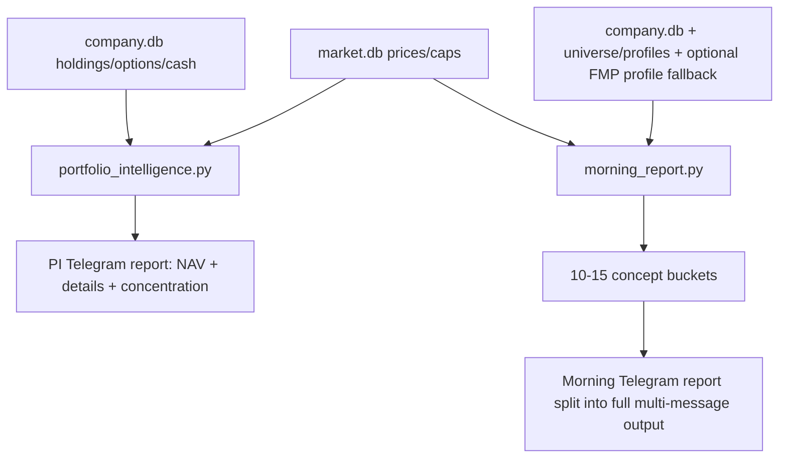
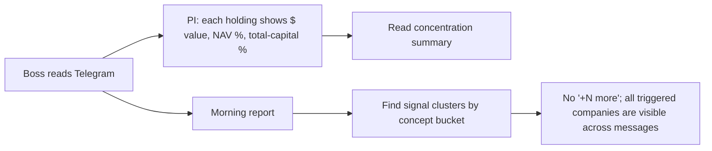

# PI + Morning Report UpgradeB Implementation Plan

> **For Claude:** REQUIRED SUB-SKILL: Use superpowers:executing-plans to implement this plan task-by-task.

**Confidence: 90%**
**不确定点**: 无；Boss 已确认 PI 双口径、晨报 10-15 个 bucket、Telegram 多条完整推送。
**北极星对齐**: `docs/design/north-star.md` 的 CIO-A（组合管理/诊断）+ 宏观/热点/主题侧翼。本次只回答"现状如何"与"今日信号在哪里"，不触及 CIO-B 的建仓建议。

**Goal:** Upgrade Portfolio Intelligence and Morning Report so positions and daily signals are readable at portfolio and concept-bucket level without dropping companies behind `more`.

**Tech Stack:** Python scripts, SQLite-backed stores, existing Telegram helper, pytest.

---

## Architecture（架构图）

> 一句话解释：PI 只增强持仓与风险展示；晨报把信号公司补齐 metadata 后按粗概念 bucket 输出，并允许 Telegram 多段完整发送。

## Business Flow（业务流程图）

> 一句话解释：Boss 不需要从 ticker 列表反查公司，能直接看到组合仓位和当天信号集中在哪些概念。

## Alternatives Considered（替代方案）

| 方案 | 优势 | 劣势 | 选择理由 |
|------|------|------|----------|
| A. 直接在现有两个脚本内增强格式和 metadata（推荐） | 改动小；不新增表；不影响 cron；测试面清晰 | bucket 规则是启发式，不是长期知识图谱 | 符合当前需求，最快修复可读性 |
| B. 新建主题分类服务/数据库表 | 长期可维护性更高 | 过度工程；需要迁移和维护 taxonomy | 这次只是晨报展示升级，不需要新子系统 |
| C. Telegram 摘要 + 文件完整报告 | Telegram 更短 | Boss 明确选择多条完整推送 | 不选 |

## Risks & Mitigation（风险自证）

- **最大风险:** broad universe metadata 缺公司名/行业，导致 bucket 只能退回 ticker。
- **缓解:** 先合并 company.db、pool universe、profiles cache；仅对触发信号但 metadata 缺失的 ticker 做 FMP profile fallback。
- **为什么不用更简单的做法:** 只把 limit 从 8 调大不能解决“ticker 不可读”和“概念不聚合”；需要 metadata + bucket 两步。
- **回滚方案:** 回滚 `scripts/portfolio_intelligence.py`、`scripts/morning_report.py` 与对应测试即可，不涉及数据迁移。

## Acceptance Criteria（验收标准）

- [ ] PI 报告显示硬编码总资本 `$5,000,000` 口径，并为每个股票/期权腿显示金额、追踪 NAV 占比、总资本占比。
- [ ] PI 报告显示组合集中度摘要：最大单票、Top5、最大行业。
- [ ] 晨报每个技术信号 section 按 10-15 个粗概念 bucket 分组，而不是 Pool/Extend/Broad 分层。
- [ ] 晨报每个公司行包含 ticker、公司短名、行业/分类、指标、市值。
- [ ] 晨报不再输出 `... +N more`，所有触发公司完整进入 Telegram 多段消息。
- [ ] Targeted tests pass: `tests/test_portfolio/test_intelligence.py`, `tests/test_morning_report.py`, `tests/test_telegram_bot.py`, `tests/test_telegram_routing.py`.

---

## Checklist

- [x] Add PI capital constants, detail builders, and concentration summary.
- [x] Render PI position/option detail sections while keeping old report paths compatible.
- [x] Add morning-report metadata hydration helpers.
- [x] Add concept bucket classifier and replace layered formatters with grouped full output.
- [x] Keep Telegram multi-message delivery complete by removing formatter truncation and relying on existing split delivery.
- [x] Update and add focused tests.
- [x] Run targeted tests and syntax checks.
