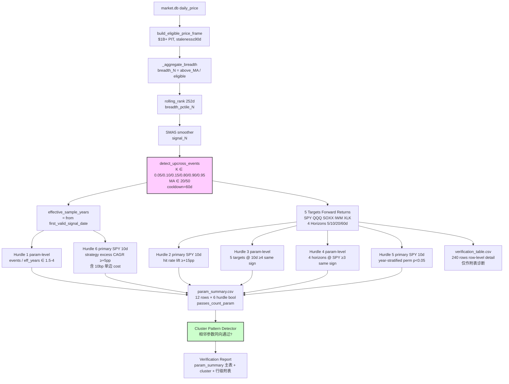
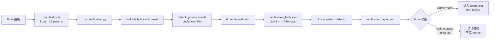

# Breadth Percentile Upcross Verification Implementation Plan

> **For Claude:** REQUIRED SUB-SKILL: Use superpowers:executing-plans to implement this plan task-by-task.

**Confidence: 92%**（v1.2 — 已吸收 5 条 P1/P2 批注 + 4 条小决策）

**v1.2 修订摘要**（v1.1 → v1.2）:
1. **加 QQQ 10d sensitivity 附表**：H2/H5/H6 的 primary cell 在保留 SPY 10d 主表的同时，**额外**生成 QQQ 10d 副表，用于检测"QQQ-only fluke vs SPY+QQQ 双通过"。
2. **H6 加 bootstrap CI**：strategy excess CAGR 除布尔 hurdle 外，再报告 500 次重抽事件的 95% CI，避免"差 0.8pp 就 fail"的二元误判。
3. **H5 加失败率监控 + 极端 fallback**：max_attempts=50 起跑，记录每参数 trial 成功率；< 30% 自动 fallback 到 sequential sampling。
4. **H4 改方案 C**：H4 hurdle 缩为"3 短 horizon (5/10/20d) 同向 ≥ 2"，60d 单独作为 `long_horizon_diff` informational column 列在 param_summary，**不计入 passes_count**。

**v1.1 修订摘要**（v1.0 → v1.1）:
1. **[P1] H1/H6 改用 effective sample years**（约 3.8 年，从 first_valid_signal_date 开始算），不再用数据起点 4.8 年。
2. **[P1] 重新设计粒度**: 引入 12 行 `param_summary.csv` 作为唯一 verdict 表；240 行 `verification_table.csv` 降级为附表诊断。passes_count 只在 param-level 计算。
3. **[P1] H5 改 year-stratified permutation**：抽样时保持各年事件数与真实 events 相同，避免 regime 混淆。
4. **[P2] H6 改 event-driven strategy excess CAGR**：模拟"触发后持有 H 天回现金、含 10bp 单边 cost"的策略，对比 B&H SPY，excess CAGR ≥ 5pp。
5. **[P2] 集成测试改 schema/hash/复现性检查**，移除"passes_count 分布合理"这种会惩罚合法 all-fail 的断言。

**已通过 v1.0 review 解决的不确定点**:
- ~~Percentile rank lookback~~: 锁定 **252**。
- ~~Permutation 抽样结构~~: 改 **year-stratified**（同时施加 cooldown 约束做 rejection sampling，给一个上限 trial budget 防止死循环）。
- ~~Trigger frequency 上下限~~: 锁定 **[1.5, 4.0]/yr**，但分母改 effective sample years。
- ~~Target 池~~: 锁定 **SPY/QQQ/SOXX/IWM/XLK 5 个**，不加 SMH（与 SOXX/XLK 高度共线性）。

**北极星对齐**: 对应 `docs/design/factor-backtest-north-star.md` 的 Backtest Desk → Factor Study (Phase 1A)，因子族 = 宽度/参与度，遵循 R1-R5 统计纪律（IC 用 excess return、参数预注册、IS/OOS 不再分割因 N 太小、事件 cooldown ≥ horizon、再平衡逻辑明确）。

**Goal:** 在 4.8 年美股 `$1B+` PIT broad universe 上，对预注册的 12 个 breadth percentile upcross 参数组合执行 6 维一致性验证（trigger 频率 / hit rate / 跨 target 一致性 / 跨 horizon 一致性 / permutation p-value / economic alpha），输出 cluster pattern 判定，最终给出"信号是否值得作为 QQQ/SOXX timing gate"的明确结论。

**Tech Stack:** Python 3.12+ / pandas / numpy / scipy / SQLite (market.db) / 现有 `backtest/breadth_study/core.py` 的 PIT breadth pipeline。

---

## 核心设计哲学

**这不是 sweep，是 verification。**

参数空间一旦写进 manifest 就 frozen，结果出来后**不允许回去调参数挑赢家**。这是上一轮 16,896 行 sweep 全军覆没的根本教训：低频 timing 因子的样本天然不够，多重检验+大搜索空间永远会把 raw signal 淹掉。

**判定规则**（基于 12 行 param_summary 表）：
- 单参数 `passes_count >= 4/6` → "孤立通过"，几乎肯定 fluke
- 相邻 2-3 个参数同时 `passes_count >= 4/6` 且方向一致 → "cluster pattern"，是真信号的最强证据
- 12 参数全部 `passes_count < 4` → "effective sample (~3.8y) 下无法验证"，不再 retune，等数据扩展或换 hypothesis

**Primary cell 约定（用于行级 hurdle）**: H2 / H5 / H6 在固定的 `(target=SPY, horizon=10d)` 上做单点判定。SPY 是 5 个 target 中最 neutral 的代表，10d 是 short 组里 N 最稳定的 horizon。H3/H4 借用同一组 events 在多 target / 多 horizon 上做一致性聚合。这样 6 hurdle 全部输出 param-level boolean，passes_count 唯一定义。

---

## Architecture（架构图）



> 一句话解释：核心是从 PIT broad universe → percentile-rank breadth → 12 参数预注册 upcross 事件 → 6 hurdle 全部输出 param-level boolean → 12 行 param_summary 是唯一 verdict 表，240 行 verification_table 仅作附表 → cluster pattern 判定。

## Business Flow（业务流程图）



> 一句话解释：Boss 锁定参数 → 一键跑完整 verification → 看 cluster pattern → 决定 promote 或归档，**全程禁止 retune**。

## Alternatives Considered（替代方案）

| 方案 | 优势 | 劣势 | 选择理由 |
|------|------|------|----------|
| **A. 12 参数 × 6 hurdle multi-dim verification（推荐）** | 搜索空间小（FDR 还有救）、低频 timing 因子的物理含义被尊重、判定基于 cross-target/horizon consistency 而非 t-test power | 需要预注册纪律、4.8 年可能依然不够 | 唯一同时尊重"低频 timing"物理含义和"防 sweep 后挑赢"统计纪律的设计 |
| B. 继续 recovery sweep，扩参数到 50+ × 改阈值 | 改动小 | 上一轮已证明失败，搜索空间膨胀 = FDR 必死 | 不选，证伪重复 |
| C. 切 cross-section（sector/industry breadth） | 凑出大 N，能用经典 t-test/FDR | 破坏"全市场 timing gate"物理含义，Boss 已否决 | 不选 |
| D. 扩展数据集（2007-至今 + 完整 survivorship） | 真正解决 power 问题 | Boss 已明确不扩数据 | 不选 |
| E. 仅做 hit rate + 视觉判定，不做统计 | 实战派 | 没有 falsification 标准，等于回到拍脑袋 | 不选 |

## Risks & Mitigation（风险自证）

- **最大风险 1：12 参数全部 < 4/6 hurdle，结论是"无法验证"。**
  - 这本来就是可能的 outcome，不是失败。诚实归档比 retune 更有价值。
  - 缓解：报告必须明确写"4.8 年样本不足以验证"而非"信号无效"。

- **最大风险 2：cluster pattern 出现但是是 fluke。**
  - 4.8 年内出现 cluster 但跨市场失败，是真实存在的概率事件。
  - 缓解：Promotion 必须 gated on 跨市场（A股、港股 / Boss 朋友独立验证），单美股 cluster 不直接上线。

- **最大风险 3：cooldown=60d 让 60d horizon 事件数太少（每参数可能 < 5 次）。**
  - 60d horizon 必须用 cooldown=60d 才不违反独立性，但这会让事件数严重缩水。
  - 缓解（已落实在 manifest）：horizons 分两组——`5/10/20d` 用 cooldown=20d (`events_short`)，`60d` 用 cooldown=60d (`events_long`)，两组独立检测、独立计算 mean_diff。
  - param_summary 中 `event_n_short` / `event_n_long` 分别报告。

- **为什么不用更简单的做法**：
  - "更简单"意味着回到 t-test/FDR 单 metric 决策，已被上一轮证伪。
  - 6 hurdle 看似复杂，但**每一项都是为了对冲 N=15 的统计 power 缺陷**——少任何一项都会回到上一轮的失败模式。

- **回滚方案**：
  - 完全独立模块（`backtest/breadth_study/percentile_upcross.py`），不修改 `core.py` 现有逻辑。
  - 不改任何生产 cron/pipeline，纯研究脚本，结果只写 `data/breadth_study_1b/percentile_verification/`。
  - 失败直接 `rm -rf` 输出目录 + 删除新加文件即可。

## Acceptance Criteria（验收标准 v1.2）

- [ ] **预注册 manifest**: `manifests/breadth_pctile_v1.json` 版本 **v1.2**，包含 12 参数 + 6 hurdle 阈值 + primary cell + sensitivity cell + cooldown 短/长拆分 + permutation 分层 + sequential fallback + strategy cost + bootstrap CI 配置，文件 SHA256 写入报告头部
- [ ] **Effective sample years 实测**: 报告头部明确标出 `first_valid_signal_date` 和 `effective_years`，H1/H6 用此值
- [ ] **主 verdict 表**: `param_summary.csv` 包含 **12 行** (primary_cell=SPY_10d)，含 `passes_count_param ∈ [0,6]`、6 个 hurdle 布尔列、`long_horizon_diff` informational 列、`excess_cagr_ci_low/high/share_negative` 三列、`perm_sampling_method/success_rate` 两列
- [ ] **Sensitivity 副表**: `param_summary_qqq10d.csv` 包含 12 行 (primary_cell=QQQ_10d)，schema 与主表完全一致
- [ ] **行级诊断附表**: `verification_table.csv` 包含 240 行（12 × 5 × 4），仅作诊断，不参与 verdict
- [ ] **Cluster 判定**: 报告里有 `Top-Level Verdict` 节，明确标出"主表 cluster / 副表 cluster / 双通过 cluster"
- [ ] **Sensitivity 对比表**: 报告里有 `Sensitivity Comparison` 节，12 行 4 列对比 SPY-primary vs QQQ-primary 的 passes_count + 联合判定
- [ ] **跨 target 一致性细节**: param_summary 中 `target_same_sign_count` + `target_same_sign_targets`
- [ ] **Permutation null 分布图**: 每参数 primary cell 一张 ASCII histogram + sampling_method 标注（rejection / sequential）
- [ ] **Strategy CAGR + bootstrap CI 表**: param_summary 中 `strategy_cagr_pp` / `bnh_cagr_pp` / `excess_cagr_pp` / `excess_cagr_ci_[low|high]` / `excess_cagr_share_negative` / `n_trades` / `exposure_pct`
- [ ] **Permutation 失败率监控**: param_summary 中 `perm_success_rate < 0.7` 的参数在报告里明确标 warning
- [ ] **可观测验证**: Boss 只看 `verification_report.md` 的 `Top-Level Verdict` + `Sensitivity Comparison` + `param_summary` 表即可判断
- [ ] **测试**: 42+ 单元测试 + 3 集成 test，全 pass；集成测试只验证 schema/hash/复现性，不断言 passes_count 分布
- [ ] **不污染 market.db**: 所有写入仅限 `data/breadth_study_1b/percentile_verification/`，不动生产数据
- [ ] **Reproducibility**: 同 seed 下两次运行输出 byte-identical（含 permutation null + bootstrap CI）

---

## Pre-Registered Parameters（必须 frozen，不可事后调）

```json
{
  "version": "v1.2",
  "frozen_at": "2026-04-30",
  "ma_windows": [20, 50],
  "thresholds": {
    "low_recovery": [0.05, 0.10, 0.15],
    "high_strength": [0.80, 0.90, 0.95]
  },
  "percentile_lookback": 252,
  "signal_smoother": "SMA5",
  "cooldown_short_horizon": 20,
  "cooldown_long_horizon": 60,
  "targets": ["SPY", "QQQ", "SOXX", "IWM", "XLK"],
  "primary_target": "SPY",
  "primary_horizon": 10,
  "sensitivity_target": "QQQ",
  "sensitivity_horizon": 10,
  "horizons_short": [5, 10, 20],
  "horizons_long": [60],
  "min_market_cap": 1000000000,
  "max_staleness_days": 90,
  "from_date": "2021-02-01",
  "permutation": {
    "trials": 1000,
    "seed": 20260429,
    "stratify_by": "year",
    "respect_cooldown": true,
    "rejection_max_attempts_per_event": 50,
    "fallback_to_sequential_below": 0.30,
    "warning_threshold": 0.70
  },
  "strategy_costs": {
    "one_way_bps": 10,
    "round_trip_bps": 20
  },
  "strategy_bootstrap": {
    "trials": 500,
    "seed": 20260430,
    "ci_lower_pct": 2.5,
    "ci_upper_pct": 97.5
  },
  "hurdle_thresholds": {
    "h1_trigger_freq_min_per_year": 1.5,
    "h1_trigger_freq_max_per_year": 4.0,
    "h2_hit_rate_lift_pp": 15,
    "h3_target_same_sign_min": 4,
    "h4_short_horizon_same_sign_min": 2,
    "h4_short_horizons": [5, 10, 20],
    "h5_permutation_p_max": 0.05,
    "h6_strategy_excess_cagr_pp": 5
  },
  "pass_threshold": 4
}
```

**关于 effective sample years**（v1.1 新增）：

```
effective_sample_years = (last_date − first_valid_signal_date) / 252
first_valid_signal_date = max date such that SMA5(rolling_rank(breadth_N, 252)) is non-NaN
```

预估 first_valid_signal_date ≈ 2022-06（数据起 2021-02，加 252d lookback + 5d smoother + breadth_N 自身 N=50 的 SMA），effective ≈ 2022-06 → 2026-04-28 ≈ 3.8 年。**实际值由 verification 脚本计算并写进 manifest snapshot 与报告头部**，不预先 hardcode。

H1 分母 = effective_sample_years
H6 strategy CAGR 计算窗口 = [first_valid_signal_date, last_date]
H6 vs B&H 对比期 = 同窗口（fair comparison）

> **Boss 在批注阶段可改任何数值，但一旦执行就不可再改。**

---

## Tasks

### Task 1: Manifest schema + freeze utility (TDD)

**Files:**
- Create: `backtest/breadth_study/manifests/breadth_pctile_v1.json`
- Create: `backtest/breadth_study/percentile_manifest.py`
- Test: `tests/test_breadth_pctile_manifest.py`

**Step 1: Write failing test**

```python
# tests/test_breadth_pctile_manifest.py
import json
from pathlib import Path
import pytest
from backtest.breadth_study.percentile_manifest import (
    load_manifest, manifest_sha256, ManifestSchemaError
)

MANIFEST_PATH = Path("backtest/breadth_study/manifests/breadth_pctile_v1.json")

def test_manifest_loads_with_required_keys():
    m = load_manifest(MANIFEST_PATH)
    assert m["version"] == "v1"
    assert m["ma_windows"] == [20, 50]
    assert len(m["thresholds"]["low_recovery"]) == 3
    assert len(m["thresholds"]["high_strength"]) == 3
    assert m["percentile_lookback"] == 252
    assert m["cooldown_long_horizon"] == 60
    assert "h1_trigger_freq_min_per_year" in m["hurdle_thresholds"]

def test_sha256_stable():
    h1 = manifest_sha256(MANIFEST_PATH)
    h2 = manifest_sha256(MANIFEST_PATH)
    assert h1 == h2 and len(h1) == 64

def test_manifest_rejects_missing_keys(tmp_path):
    bad = tmp_path / "bad.json"
    bad.write_text(json.dumps({"version": "v1"}))
    with pytest.raises(ManifestSchemaError):
        load_manifest(bad)
```

**Step 2: Run test to verify FAIL**

`pytest tests/test_breadth_pctile_manifest.py -v` → FAIL (module not exist)

**Step 3: Implement**

- 写 `breadth_pctile_v1.json` 内容用上面 frozen 块。
- `percentile_manifest.py` 实现 `load_manifest` / `manifest_sha256` / `ManifestSchemaError`。

**Step 4: Run test PASS**

**Step 5: Commit**

```bash
git add backtest/breadth_study/manifests/ backtest/breadth_study/percentile_manifest.py tests/test_breadth_pctile_manifest.py
git commit -m "feat(breadth): pre-register percentile upcross manifest v1"
```

---

### Task 2: Percentile rank + SMA5 signal builder (TDD)

**Files:**
- Create: `backtest/breadth_study/percentile_signal.py`
- Test: `tests/test_breadth_pctile_signal.py`

**Step 1: Write failing test**

```python
import numpy as np
import pandas as pd
from backtest.breadth_study.percentile_signal import build_percentile_signal

def test_percentile_rank_uses_lookback_window():
    breadth = pd.Series(np.linspace(0.3, 0.7, 300))  # 300 days
    out = build_percentile_signal(breadth, lookback=252, smoother_window=5)
    assert out.iloc[:251].isna().all()  # 前 251 天应该是 NaN
    assert out.iloc[256] == pytest.approx(...)  # 最后一天百分位接近 1.0

def test_no_lookahead():
    breadth = pd.Series([0.1] * 252 + [0.9])  # 第 252 天突然飙
    out = build_percentile_signal(breadth, lookback=252, smoother_window=5)
    # 第 252 天的 percentile rank 应该用 t-251..t 的窗口，不能用 t+1
    assert not out.iloc[252].isna()  # 但 SMA5 还要再等 4 天
    assert out.iloc[256] is not None  # SMA5 在第 256 天才有

def test_signal_is_smoothed():
    rng = np.random.default_rng(42)
    breadth = pd.Series(rng.uniform(0, 1, 500))
    raw_pctile = breadth.rolling(252).rank(pct=True)
    signal = build_percentile_signal(breadth, lookback=252, smoother_window=5)
    # signal 应等于 raw_pctile.rolling(5).mean()
    pd.testing.assert_series_equal(
        signal.dropna(),
        raw_pctile.rolling(5).mean().dropna(),
        check_names=False,
    )
```

**Step 2: Run FAIL → Step 3: Implement → Step 4: PASS → Step 5: Commit**

```python
# percentile_signal.py
def build_percentile_signal(breadth: pd.Series, lookback: int, smoother_window: int) -> pd.Series:
    raw_pctile = breadth.rolling(lookback, min_periods=lookback).rank(pct=True)
    return raw_pctile.rolling(smoother_window, min_periods=smoother_window).mean()
```

```bash
git commit -m "feat(breadth): add percentile rank + SMA5 signal builder"
```

---

### Task 3: Upcross event detector with adaptive cooldown (TDD)

**Files:**
- Create: `backtest/breadth_study/percentile_events.py`
- Test: `tests/test_breadth_pctile_events.py`

**Critical detail**: 短 horizon (5/10/20d) 用 cooldown=20d，长 horizon (60d) 用 cooldown=60d。**这是修正上一轮 cooldown < horizon 的独立性违反**。

**Step 1: Write failing tests**

```python
def test_upcross_basic_detection():
    signal = pd.Series([0.5, 0.5, 0.04, 0.06, 0.12, 0.20])  # K=0.10 上穿在 idx=4
    events = detect_upcross_events(signal, threshold=0.10, cooldown_days=20)
    assert len(events) == 1
    assert events[0]["index"] == 4

def test_cooldown_blocks_repeat():
    signal = pd.Series([0.05, 0.15, 0.05, 0.15] * 10)  # 反复上穿
    events_short = detect_upcross_events(signal, threshold=0.10, cooldown_days=20)
    events_long = detect_upcross_events(signal, threshold=0.10, cooldown_days=60)
    assert len(events_short) > len(events_long)

def test_no_event_if_starts_above_threshold():
    signal = pd.Series([0.5, 0.6, 0.7])  # 一直在阈值之上，没上穿
    events = detect_upcross_events(signal, threshold=0.10, cooldown_days=20)
    assert events == []

def test_adaptive_cooldown_per_horizon_group():
    signal = pd.Series([0.05, 0.15] + [0.5] * 30 + [0.05, 0.15])
    short = detect_upcross_events(signal, threshold=0.10, cooldown_days=20)
    long = detect_upcross_events(signal, threshold=0.10, cooldown_days=60)
    # 间隔 ~30 天，short 应有 2 个，long 应有 1 个
    assert len(short) == 2 and len(long) == 1
```

**Step 3: Implement** — 简单循环 + cooldown 计数即可。

```bash
git commit -m "feat(breadth): upcross detector with adaptive cooldown"
```

---

### Task 4: Hurdle 1 - Trigger frequency check (TDD) — v1.1

**v1.1 修订**: 分母改为 `effective_sample_years`（从 first_valid_signal_date 起算），不再用 4.8 年。

**Files:**
- Create: `backtest/breadth_study/percentile_hurdles.py`
- Test: `tests/test_breadth_pctile_hurdles.py`

**effective_sample_years helper**（作为 Task 4 的一部分实现）：

```python
def compute_effective_sample_years(signal: pd.Series, dates: pd.Series) -> Tuple[pd.Timestamp, pd.Timestamp, float]:
    """
    Returns (first_valid_signal_date, last_date, effective_years).
    effective_years = trading days between (first_valid, last) / 252.
    """
    valid = signal.notna()
    if not valid.any():
        raise ValueError("signal has no valid (non-NaN) values")
    first_idx = valid.idxmax()
    last_idx = valid[::-1].idxmax()
    first_date = dates.iloc[first_idx]
    last_date = dates.iloc[last_idx]
    n_days = int(valid.iloc[first_idx:last_idx + 1].sum())
    return first_date, last_date, n_days / 252.0
```

**Tests**:

```python
def test_effective_years_excludes_warmup():
    dates = pd.date_range("2021-02-01", periods=1300, freq="B")
    signal = pd.Series([np.nan] * 257 + list(np.linspace(0.1, 0.9, 1043)))
    first, last, years = compute_effective_sample_years(signal, pd.Series(dates))
    assert first == dates[257]
    assert years == pytest.approx(1043 / 252.0, abs=0.01)

def test_h1_uses_effective_years():
    # effective = 3.8 yrs, events=12 → 3.16/yr → pass [1.5, 4.0]
    assert check_h1_trigger_frequency(events_count=12, effective_years=3.8, lo=1.5, hi=4.0) is True

def test_h1_too_rare():
    # effective = 3.8 yrs, events=5 → 1.32/yr → fail
    assert check_h1_trigger_frequency(events_count=5, effective_years=3.8, lo=1.5, hi=4.0) is False

def test_h1_too_frequent():
    # effective = 3.8 yrs, events=20 → 5.26/yr → fail
    assert check_h1_trigger_frequency(events_count=20, effective_years=3.8, lo=1.5, hi=4.0) is False
```

**Implementation**:
```python
def check_h1_trigger_frequency(events_count: int, effective_years: float, lo: float, hi: float) -> bool:
    rate = events_count / effective_years if effective_years > 0 else 0.0
    return lo <= rate <= hi
```

```bash
git commit -m "feat(breadth): hurdle 1 trigger frequency w/ effective sample years"
```

---

### Task 5: Hurdle 2 - Hit rate lift on primary cell (TDD) — v1.1

**v1.1 修订**: 在 primary cell `(target=SPY, horizon=10d)` 上做单点判定。比较"事件后 SPY 10d return"的 hit rate vs "非事件日 SPY 10d return"的 hit rate（同 effective_sample 期内）。

```python
def test_h2_hit_rate_lift_primary():
    event_returns = np.array([0.03, 0.02, -0.01, 0.04, 0.01])  # hit=4/5=80%
    non_event_returns = np.array([0.01]*60 + [-0.01]*40)  # baseline hit=60%
    # lift = 80-60 = 20pp ≥ 15pp threshold
    assert check_h2_hit_rate_lift(event_returns, non_event_returns, min_lift_pp=15) is True

def test_h2_uses_non_event_dates_in_effective_window():
    """baseline 必须从 [first_valid, last] 之间的非事件日抽，不能用全样本"""
    # ...
```

**实现**：
```python
def check_h2_hit_rate_lift(event_rets, non_event_rets, min_lift_pp):
    """
    event_rets: forward returns on event dates at primary cell (SPY, 10d)
    non_event_rets: forward returns on non-event dates within effective window
    """
    event_hit = (event_rets > 0).mean() * 100
    baseline_hit = (non_event_rets > 0).mean() * 100
    return (event_hit - baseline_hit) >= min_lift_pp
```

```bash
git commit -m "feat(breadth): hurdle 2 hit rate lift on primary SPY 10d cell"
```

---

### Task 6: Hurdle 3 - Cross-target consistency at primary horizon (TDD) — v1.1

**v1.1 明确**: 同一组 events 下，看 5 个 target 在 `primary_horizon=10d` 上的 mean_diff（vs 各 target 同年份非事件日 baseline），至少 4 个同向（与 expected_sign=+1 一致）。这是 param-level boolean。

```python
def test_h3_cross_target_same_sign():
    target_diffs_at_10d = {"SPY": 0.02, "QQQ": 0.03, "SOXX": 0.04, "IWM": -0.01, "XLK": 0.025}
    # 4/5 positive, expected sign=positive
    assert check_h3_target_consistency(target_diffs_at_10d, expected_sign=+1, min_count=4) is True

def test_h3_fails_when_only_3_match():
    target_diffs_at_10d = {"SPY": 0.02, "QQQ": -0.01, "SOXX": 0.04, "IWM": -0.01, "XLK": 0.025}
    assert check_h3_target_consistency(target_diffs_at_10d, expected_sign=+1, min_count=4) is False
```

**Note**: `expected_sign` 来自 hypothesis：low recovery (K=0.05/0.10/0.15) → 期望正向；high strength (K=0.80/0.90/0.95) → 也期望正向（强势确认 follow-through）。所以两类都是 +1。

```bash
git commit -m "feat(breadth): hurdle 3 cross-target consistency at primary horizon"
```

---

### Task 7: Hurdle 4 - Cross-short-horizon consistency on primary target (TDD) — v1.2 方案 C

**v1.2 修订**: H4 缩为"3 短 horizon (5/10/20d) 同向 ≥ 2"，全部基于 events_short 同一组事件（cooldown=20d）。**60d 不进入 H4**，而是作为 informational column `long_horizon_diff` 列在 param_summary，**不计入 passes_count**。

理由：
- 5/10/20d 用同一组 events，样本一致性 OK
- 60d 用 events_long（cooldown=60d，子集），跟短组维度不一致，混进同一 hurdle 会污染统计含义
- 60d 数据不丢，仍然展示给 Boss 看，只是不参与 verdict

```python
def test_h4_short_horizons_same_sign_pass():
    horizon_diffs_spy_short = {5: 0.015, 10: 0.022, 20: 0.018}
    # 3/3 positive ≥ 2
    assert check_h4_short_horizon_consistency(
        horizon_diffs_spy_short, expected_sign=+1, min_count=2
    ) is True

def test_h4_two_out_of_three_pass():
    horizon_diffs_spy_short = {5: 0.015, 10: 0.022, 20: -0.005}
    # 2/3 positive ≥ 2
    assert check_h4_short_horizon_consistency(
        horizon_diffs_spy_short, expected_sign=+1, min_count=2
    ) is True

def test_h4_only_one_pass_fails():
    horizon_diffs_spy_short = {5: 0.015, 10: -0.022, 20: -0.005}
    assert check_h4_short_horizon_consistency(
        horizon_diffs_spy_short, expected_sign=+1, min_count=2
    ) is False
```

**实现**：
```python
def check_h4_short_horizon_consistency(
    horizon_diffs: Dict[int, float], expected_sign: int, min_count: int
) -> bool:
    same_sign = sum(1 for v in horizon_diffs.values()
                    if (v > 0 and expected_sign > 0) or (v < 0 and expected_sign < 0))
    return same_sign >= min_count
```

**注意**：long_horizon_diff (60d) 在 Task 10 orchestrator 里单独计算并写入 param_summary，但不调用此 check 函数。

```bash
git commit -m "feat(breadth): hurdle 4 short-horizon consistency, 60d as info-only"
```

---

### Task 8: Hurdle 5 - Year-stratified permutation p-value (TDD) — v1.1

**v1.1 重大修订**: simple random 抽样会被 regime 混淆（事件天然集中在特定年份）。改成 **year-stratified permutation**：抽样时保持每年事件数与真实 events 相同，并用 cooldown 约束做 rejection sampling。

**核心实现**：

```python
def year_stratified_permutation_p(
    event_dates: List[pd.Timestamp],
    forward_returns_panel: pd.DataFrame,
    target: str, horizon: int,
    cooldown_days: int,
    trials: int, seed: int,
    rejection_max_attempts_per_event: int = 50,
    fallback_to_sequential_below: float = 0.30,
    warning_threshold: float = 0.70,
) -> Tuple[float, np.ndarray, Dict[str, Any]]:
    """
    H0: event 后的 mean_diff 与"按年保留事件分布、且满足 cooldown 的随机抽 N 天"无差异。
    
    抽样策略 (v1.2):
      Phase 1: rejection sampling，每事件最多 max_attempts 次
      Phase 2 (探针): 跑 50 trials 测算成功率
        - 成功率 >= warning_threshold (0.7): 继续 rejection
        - 成功率 in [fallback_below, warning) (0.3, 0.7): 继续 rejection 但 warning
        - 成功率 < fallback_below (0.3): 切换到 sequential sampling
    
    返回 (p_value, null_distribution, diagnostics)
    diagnostics 含: rejection_success_rate, sampling_method_used, n_trials_succeeded
    """
    rng = np.random.default_rng(seed)
    panel = forward_returns_panel.dropna(subset=[f"{target}_fwd_{horizon}d"]).copy()
    panel["year"] = panel["date"].dt.year
    
    real_diff = compute_event_diff(event_dates, panel, target, horizon)
    
    events_per_year = pd.Series(event_dates).dt.year.value_counts().to_dict()
    dates_by_year = {y: g["date"].tolist() for y, g in panel.groupby("year")}
    
    # Phase 2 探针
    probe_n = min(50, trials // 10)
    probe_success = 0
    for _ in range(probe_n):
        if _try_one_rejection_trial(events_per_year, dates_by_year,
                                      cooldown_days, rng,
                                      rejection_max_attempts_per_event) is not None:
            probe_success += 1
    probe_rate = probe_success / probe_n if probe_n > 0 else 0.0
    
    if probe_rate < fallback_to_sequential_below:
        sampling_method = "sequential"
        sampler = lambda: _sample_sequential(events_per_year, dates_by_year,
                                              cooldown_days, rng)
    else:
        sampling_method = "rejection"
        sampler = lambda: _try_one_rejection_trial(
            events_per_year, dates_by_year, cooldown_days, rng,
            rejection_max_attempts_per_event,
        )
    
    null = []
    for _ in range(trials):
        fake_dates = sampler()
        if fake_dates is None:
            continue
        null.append(compute_event_diff(fake_dates, panel, target, horizon))
    
    success_rate = len(null) / trials
    if success_rate < warning_threshold:
        logger.warning(
            f"Permutation: success_rate={success_rate:.2f}, "
            f"method={sampling_method}, target={target}, horizon={horizon}"
        )
    
    null = np.asarray(null)
    p = (np.sum(null >= real_diff) + 1) / (len(null) + 1) if len(null) > 0 else 1.0
    diagnostics = {
        "rejection_probe_rate": probe_rate,
        "sampling_method_used": sampling_method,
        "n_trials_succeeded": len(null),
        "n_trials_attempted": trials,
        "success_rate": success_rate,
    }
    return float(p), null, diagnostics


def _try_one_rejection_trial(events_per_year, dates_by_year, cooldown_days, rng, max_attempts):
    """单次 rejection trial，失败返回 None"""
    fake_dates = []
    for year, n in events_per_year.items():
        pool = dates_by_year.get(year, [])
        if len(pool) < n:
            return None
        picked = _sample_with_cooldown(pool, n, cooldown_days, rng, max_attempts)
        if picked is None:
            return None
        fake_dates.extend(picked)
    return fake_dates


def _sample_with_cooldown(pool, n, cooldown_days, rng, max_attempts):
    """rejection sampling: 抽 n 个日期，两两间隔 >= cooldown_days"""
    pool_sorted = sorted(pool)
    for _ in range(max_attempts):
        idxs = sorted(rng.choice(len(pool_sorted), size=n, replace=False))
        ok = all((idxs[i+1] - idxs[i]) >= cooldown_days for i in range(n-1))
        if ok:
            return [pool_sorted[i] for i in idxs]
    return None


def _sample_sequential(events_per_year, dates_by_year, cooldown_days, rng):
    """
    Sequential sampling fallback: 100% 成功率
    每年内: 抽第 1 个 → 排除 [t-cooldown, t+cooldown] → 抽第 2 个 → ...
    若中途某轮 pool 为空，整个 trial 失败 (理论上罕见)
    """
    fake_dates = []
    for year, n in events_per_year.items():
        pool_sorted = sorted(dates_by_year.get(year, []))
        if len(pool_sorted) < n:
            return None
        picked_idxs = []
        available = list(range(len(pool_sorted)))
        for _ in range(n):
            if not available:
                return None
            choice = rng.choice(available)
            picked_idxs.append(choice)
            # 排除 [choice - cooldown, choice + cooldown]
            available = [i for i in available
                          if abs(i - choice) >= cooldown_days]
        fake_dates.extend(pool_sorted[i] for i in sorted(picked_idxs))
    return fake_dates


def check_h5_permutation(p_value, max_p=0.05):
    return p_value < max_p
```

**Tests**:

```python
def test_permutation_null_distribution_centered_for_random_events():
    rng = np.random.default_rng(0)
    panel = pd.DataFrame({
        "date": pd.date_range("2021-01-01", periods=1000, freq="B"),
        "SPY_fwd_10d": rng.normal(0, 0.02, 1000),
    })
    # 模拟真实事件分布: 2022 年 6 个, 2023 年 4 个, 2024 年 5 个
    fake_events = (
        panel[panel["date"].dt.year == 2022].sample(6, random_state=1)["date"].tolist()
        + panel[panel["date"].dt.year == 2023].sample(4, random_state=2)["date"].tolist()
        + panel[panel["date"].dt.year == 2024].sample(5, random_state=3)["date"].tolist()
    )
    p, null = year_stratified_permutation_p(fake_events, panel, "SPY", 10, 20, 1000, 42)
    assert 0.2 < p < 0.8  # 随机事件不显著

def test_permutation_preserves_year_distribution():
    """验证 null 抽样确实保持了每年事件数"""
    # 不能直接观测 null 的内部抽样，但可通过 panel 上 mean_diff 的方差来 sanity check
    pass

def test_permutation_falls_back_to_sequential_when_dense():
    """构造密集年（cooldown=60d 的极端情况），应触发 sequential fallback"""
    # 一年只有 252 天，但要抽 5 个间隔 ≥ 60d → rejection 命中率极低
    dates = pd.bdate_range("2022-01-01", periods=252)
    panel = pd.DataFrame({
        "date": dates,
        "SPY_fwd_10d": np.random.default_rng(0).normal(0, 0.02, 252),
    })
    fake_events = dates[[10, 80, 150, 200, 230]].tolist()  # 5 个 events
    p, null, diag = year_stratified_permutation_p(
        fake_events, panel, "SPY", 10, cooldown_days=60,
        trials=100, seed=42,
        rejection_max_attempts_per_event=50,
        fallback_to_sequential_below=0.30,
    )
    assert diag["sampling_method_used"] == "sequential"
    assert diag["success_rate"] >= 0.95  # sequential 几乎 100%

def test_permutation_uses_rejection_when_sparse():
    """事件稀疏时 rejection 应足够"""
    dates = pd.bdate_range("2022-01-01", periods=252)
    panel = pd.DataFrame({"date": dates, "SPY_fwd_10d": np.zeros(252)})
    fake_events = dates[[10, 100]].tolist()  # 仅 2 events
    _, _, diag = year_stratified_permutation_p(
        fake_events, panel, "SPY", 10, cooldown_days=20,
        trials=100, seed=42,
    )
    assert diag["sampling_method_used"] == "rejection"

def test_permutation_detects_strong_signal():
    panel = _create_panel_with_strong_event_signal()
    event_dates = ...
    p, _, _ = year_stratified_permutation_p(
        event_dates, panel, "SPY", 10, 20, 1000, 42,
    )
    assert p < 0.01
```

```bash
git commit -m "feat(breadth): hurdle 5 year-stratified perm w/ rate monitor + sequential fallback"
```

---

### Task 9: Hurdle 6 - Event-driven strategy excess CAGR (TDD) — v1.1

**v1.1 重大修订**: 抛弃 `diff_per_event × events_per_year` 简化公式（不处理 holding overlap、cost、不同 horizon 不可比）。改成 **event-driven strategy CAGR vs B&H CAGR**，含 10bp 单边 cost。

**Strategy 定义**（在 primary cell `(target=SPY, horizon=10d)` 上跑）：
- 信号触发日 T，在 T+1 open 买入 SPY，T+10 close 平仓回 cash
- 平仓后再次触发才再开仓
- cooldown=20d 已保证不会重叠开仓
- 每次开仓+平仓应用 20bp roundtrip cost（10bp × 2）

**B&H baseline**: 在 effective sample 期内 buy-and-hold SPY，同样窗口 [first_valid_signal_date, last_date]。

**Hurdle**: `strategy_cagr - bnh_cagr ≥ 5pp`

**核心实现**：

```python
def event_strategy_cagr(
    event_dates: List[pd.Timestamp],
    target_prices: pd.DataFrame,  # date / open / close for primary target
    target: str,
    horizon: int,
    first_valid_date: pd.Timestamp,
    last_date: pd.Timestamp,
    one_way_bps: float,
) -> Dict[str, float]:
    """
    模拟 event-driven strategy:
      - 触发日 T → T+1 open 买入 → T+horizon close 平仓
      - 出场后持现金（无利息），下次触发再入场
    返回 {strategy_cagr, bnh_cagr, excess_cagr, n_trades, exposure_pct}
    """
    prices = target_prices[
        (target_prices["date"] >= first_valid_date)
        & (target_prices["date"] <= last_date)
    ].sort_values("date").reset_index(drop=True)
    
    # 把日期映射到 index
    date_to_idx = {d: i for i, d in enumerate(prices["date"])}
    
    capital = 1.0
    bars_in_market = 0
    n_trades = 0
    cost_factor = 1.0 - one_way_bps / 10000.0
    
    for ev_date in sorted(event_dates):
        if ev_date not in date_to_idx:
            continue
        entry_idx = date_to_idx[ev_date] + 1  # T+1 open
        exit_idx = entry_idx + horizon - 1     # T+horizon close (relative to T+1)
        if exit_idx >= len(prices):
            continue  # 不够 horizon 收尾，跳过
        entry_price = prices["open"].iloc[entry_idx]
        exit_price = prices["close"].iloc[exit_idx]
        # 净收益 = exit/entry - 1，扣双边 cost
        gross = exit_price / entry_price
        net = gross * cost_factor * cost_factor  # entry 和 exit 各一次 cost
        capital *= net
        bars_in_market += (exit_idx - entry_idx + 1)
        n_trades += 1
    
    n_total_bars = len(prices)
    years = n_total_bars / 252.0
    strategy_cagr = (capital ** (1 / years) - 1) * 100  # in pp
    
    bnh_capital = prices["close"].iloc[-1] / prices["close"].iloc[0]
    bnh_cagr = (bnh_capital ** (1 / years) - 1) * 100
    
    return {
        "strategy_cagr": strategy_cagr,
        "bnh_cagr": bnh_cagr,
        "excess_cagr": strategy_cagr - bnh_cagr,
        "n_trades": n_trades,
        "exposure_pct": bars_in_market / n_total_bars * 100,
    }


def check_h6_strategy_excess_cagr(excess_cagr_pp: float, min_pp: float = 5) -> bool:
    return excess_cagr_pp >= min_pp


def event_strategy_bootstrap_ci(
    event_dates: List[pd.Timestamp],
    target_prices: pd.DataFrame,
    target: str,
    horizon: int,
    first_valid_date: pd.Timestamp,
    last_date: pd.Timestamp,
    one_way_bps: float,
    trials: int = 500,
    seed: int = 20260430,
    ci_lower_pct: float = 2.5,
    ci_upper_pct: float = 97.5,
) -> Dict[str, float]:
    """
    Bootstrap CI for excess_cagr (v1.2 新增):
      重抽 events with replacement，每次重新计算 strategy_cagr - bnh_cagr
      返回 (excess_cagr_point_estimate, ci_low, ci_high, n_below_zero_ratio)
    
    用途：即使 H6 hurdle fail (e.g. excess=4.2pp < 5pp)，CI 仍能告诉 Boss
    "真值 95% 概率落在 [-2pp, +9pp]" 这种诚实信息。
    """
    rng = np.random.default_rng(seed)
    point = event_strategy_cagr(event_dates, target_prices, target, horizon,
                                  first_valid_date, last_date, one_way_bps)
    excess_samples = []
    n = len(event_dates)
    for _ in range(trials):
        resampled = list(rng.choice(event_dates, size=n, replace=True))
        result = event_strategy_cagr(resampled, target_prices, target, horizon,
                                      first_valid_date, last_date, one_way_bps)
        excess_samples.append(result["excess_cagr"])
    arr = np.asarray(excess_samples)
    return {
        "excess_cagr_point": point["excess_cagr"],
        "excess_cagr_ci_low": float(np.percentile(arr, ci_lower_pct)),
        "excess_cagr_ci_high": float(np.percentile(arr, ci_upper_pct)),
        "excess_cagr_share_negative": float((arr < 0).mean()),
    }
```

**Tests**:

```python
def test_strategy_cagr_no_events_equals_zero_strategy():
    prices = _make_synthetic_prices(years=4)
    result = event_strategy_cagr([], prices, "SPY", 10,
                                  first_valid=prices["date"].iloc[0],
                                  last_date=prices["date"].iloc[-1],
                                  one_way_bps=10)
    assert result["strategy_cagr"] == 0.0  # 全程持现金
    assert result["n_trades"] == 0
    assert result["exposure_pct"] == 0.0

def test_strategy_cagr_perfect_signal_beats_bnh():
    prices, perfect_events = _make_synthetic_prices_with_perfect_dips()
    result = event_strategy_cagr(perfect_events, prices, "SPY", 10, ...)
    assert result["excess_cagr"] > 5

def test_strategy_cagr_random_events_underperform_bnh():
    """随机抽事件 + 出场后持现金 → 减少 exposure → CAGR 应该 < B&H"""
    prices = _make_synthetic_prices(years=4, drift=0.10)  # 趋势市
    rng = np.random.default_rng(42)
    random_events = rng.choice(prices["date"], size=10, replace=False)
    result = event_strategy_cagr(random_events, prices, "SPY", 10, ...)
    assert result["excess_cagr"] < 0  # 趋势市里减仓，惩罚

def test_strategy_cagr_includes_costs():
    """同样的触发，one_way_bps 越高 strategy_cagr 越低"""
    cheap = event_strategy_cagr(events, prices, "SPY", 10, ..., one_way_bps=0)
    expensive = event_strategy_cagr(events, prices, "SPY", 10, ..., one_way_bps=50)
    assert cheap["strategy_cagr"] > expensive["strategy_cagr"]

def test_bootstrap_ci_brackets_point_estimate():
    """v1.2: bootstrap CI 应包含点估计（高概率）"""
    panel, events = _make_synthetic_with_known_excess(target_excess=4.0)
    ci = event_strategy_bootstrap_ci(events, panel, "SPY", 10, ...,
                                      trials=500, seed=42)
    assert ci["excess_cagr_ci_low"] <= ci["excess_cagr_point"] <= ci["excess_cagr_ci_high"]

def test_bootstrap_ci_widens_with_fewer_events():
    """事件越少 CI 越宽"""
    ci_few = event_strategy_bootstrap_ci(events_5, ..., trials=500, seed=42)
    ci_many = event_strategy_bootstrap_ci(events_20, ..., trials=500, seed=42)
    width_few = ci_few["excess_cagr_ci_high"] - ci_few["excess_cagr_ci_low"]
    width_many = ci_many["excess_cagr_ci_high"] - ci_many["excess_cagr_ci_low"]
    assert width_few > width_many
```

```bash
git commit -m "feat(breadth): hurdle 6 strategy excess CAGR + bootstrap CI"
```

---

### Task 10: Verification orchestrator + dual-table + sensitivity (TDD) — v1.2

**v1.2 修订**: 输出**三张表**：

1. **`param_summary.csv`**（12 行）— **主 verdict 表**, primary cell = SPY 10d
2. **`param_summary_qqq10d.csv`**（12 行）— **sensitivity 副表**, primary cell = QQQ 10d，schema 完全对齐主表
3. **`verification_table.csv`**（240 行）— 行级附表诊断

**v1.1 → v1.2 列变化**:
- `param_summary` 加 `long_horizon_diff_spy` (60d 在 SPY 上的 mean_diff，informational, 不进 passes_count)
- `param_summary` 加 `excess_cagr_ci_low` / `excess_cagr_ci_high` / `excess_cagr_share_negative` (bootstrap CI)
- `param_summary` 加 `perm_sampling_method` / `perm_success_rate` (诊断)

**Files:**
- Create: `backtest/breadth_study/percentile_verifier.py`
- Test: `tests/test_breadth_pctile_verifier.py`

#### `param_summary.csv` schema (12 rows, v1.2)

每行一个参数 (ma, K, event_type)：

```
# Identifier
ma_window | threshold | event_type | primary_cell |

# Sample
event_n_short | event_n_long |
first_valid_date | last_date | effective_years | events_per_year |

# H2 (primary cell, e.g. SPY 10d)
event_hit | baseline_hit | hit_lift_pp |

# H5 (primary cell)
perm_p | perm_sampling_method | perm_success_rate |

# H6 (primary cell, w/ bootstrap CI v1.2 加)
strategy_cagr_pp | bnh_cagr_pp | excess_cagr_pp |
excess_cagr_ci_low | excess_cagr_ci_high | excess_cagr_share_negative |
n_trades | exposure_pct |

# H3 (5-target, primary horizon)
target_same_sign_count | target_same_sign_targets |

# H4 (3 short horizons, primary target) — v1.2 改
short_horizon_same_sign_count | short_horizon_same_sign_horizons |

# Informational (60d on primary target, 不进 passes) — v1.2 加
long_horizon_diff |

# Hurdles (booleans)
h1_freq_pass | h2_hit_pass | h3_target_pass |
h4_short_horizon_pass | h5_perm_pass | h6_strategy_pass |
passes_count_param
```

`param_summary_qqq10d.csv` schema 完全相同，只是 `primary_cell="QQQ_10d"` 且 H2/H5/H6 在 QQQ 10d 上算。

#### `verification_table.csv` schema (240 rows)

行级诊断，**不参与 verdict**：

```
ma_window | threshold | event_type | target | horizon | event_n |
event_mean | non_event_mean | mean_diff | hit_rate | non_event_hit_rate
```

#### Orchestrator 流程 (v1.2)

```python
def run_verification(manifest, daily_breadth, target_prices_dict, target_returns):
    """
    返回 (param_summary_primary_df, param_summary_sensitivity_df, verification_table_df)
    
    param_summary_primary: primary_cell = SPY 10d
    param_summary_sensitivity: primary_cell = QQQ 10d
    verification_table: 240 行行级诊断（与 primary cell 选择无关）
    """
    # 主表
    summary_primary = _build_param_summary(
        manifest, daily_breadth, target_prices_dict, target_returns,
        primary_target=manifest["primary_target"],
        primary_horizon=manifest["primary_horizon"],
    )
    # 副表 (sensitivity)
    summary_sensitivity = _build_param_summary(
        manifest, daily_breadth, target_prices_dict, target_returns,
        primary_target=manifest["sensitivity_target"],
        primary_horizon=manifest["sensitivity_horizon"],
    )
    # 240 行诊断
    table = _build_verification_table(manifest, daily_breadth, target_returns)
    return summary_primary, summary_sensitivity, table


def _build_param_summary(manifest, daily_breadth, target_prices_dict, target_returns,
                          primary_target, primary_horizon):
    """对每个 (ma, K) 计算 6 hurdle + long_horizon_diff informational"""
    param_rows = []
    table_rows = []
    
    for ma in manifest["ma_windows"]:
        for K in manifest["thresholds"]["low_recovery"] + manifest["thresholds"]["high_strength"]:
            event_type = "low_recovery" if K < 0.5 else "high_strength"
            
            # Step 1: build signal + compute effective sample years
            signal = build_percentile_signal(
                breadth=daily_breadth[f"breadth_{ma}"],
                lookback=manifest["percentile_lookback"],
                smoother_window=5,
            )
            first_valid, last, effective_years = compute_effective_sample_years(
                signal, daily_breadth["date"]
            )
            
            # Step 2: detect events with both cooldowns
            events_short = detect_upcross_events(signal, K, manifest["cooldown_short_horizon"])
            events_long  = detect_upcross_events(signal, K, manifest["cooldown_long_horizon"])
            
            # Step 3: row-level metrics for verification_table
            for tgt in manifest["targets"]:
                for h in manifest["horizons_short"]:
                    row = _compute_row_metrics(events_short, target_returns, tgt, h, first_valid, last)
                    table_rows.append({"ma_window": ma, "threshold": K, "event_type": event_type,
                                        "target": tgt, "horizon": h, **row})
                for h in manifest["horizons_long"]:
                    row = _compute_row_metrics(events_long, target_returns, tgt, h, first_valid, last)
                    table_rows.append({"ma_window": ma, "threshold": K, "event_type": event_type,
                                        "target": tgt, "horizon": h, **row})
            
            # Step 4: param-level hurdles
            primary_h = manifest["primary_horizon"]
            primary_t = manifest["primary_target"]
            primary_events = events_short if primary_h in manifest["horizons_short"] else events_long
            
            # H1
            h1 = check_h1_trigger_frequency(len(primary_events), effective_years, ...)
            # H2 (primary cell)
            h2 = check_h2_hit_rate_lift(...)
            # H3 (param-level: 5 targets @ primary_horizon, mean_diff sign count)
            target_diffs_at_primary = {tgt: _get_mean_diff(...) for tgt in manifest["targets"]}
            h3 = check_h3_target_consistency(target_diffs_at_primary, +1, 4)
            # H4 v1.2 改：3 短 horizon 同向 ≥ 2，全用 events_short
            short_horizon_diffs = {
                h: _get_mean_diff(events_short, target_returns, primary_t, h)
                for h in manifest["hurdle_thresholds"]["h4_short_horizons"]  # [5, 10, 20]
            }
            h4 = check_h4_short_horizon_consistency(
                short_horizon_diffs, +1,
                manifest["hurdle_thresholds"]["h4_short_horizon_same_sign_min"],
            )
            # 60d informational (不进 passes_count) v1.2 加
            long_horizon_diff = _get_mean_diff(events_long, target_returns, primary_t, 60)
            
            # H5 (primary cell)
            h5_p, _, h5_diag = year_stratified_permutation_p(
                primary_events, target_returns, primary_t, primary_h,
                manifest["cooldown_short_horizon"],
                manifest["permutation"]["trials"], manifest["permutation"]["seed"],
                rejection_max_attempts_per_event=manifest["permutation"]["rejection_max_attempts_per_event"],
                fallback_to_sequential_below=manifest["permutation"]["fallback_to_sequential_below"],
                warning_threshold=manifest["permutation"]["warning_threshold"],
            )
            h5 = check_h5_permutation(h5_p, manifest["hurdle_thresholds"]["h5_permutation_p_max"])
            
            # H6 (primary cell) + bootstrap CI v1.2 加
            strat = event_strategy_cagr(
                primary_events, target_prices_dict[primary_t], primary_t, primary_h,
                first_valid, last, one_way_bps=manifest["strategy_costs"]["one_way_bps"],
            )
            h6 = check_h6_strategy_excess_cagr(
                strat["excess_cagr"], manifest["hurdle_thresholds"]["h6_strategy_excess_cagr_pp"],
            )
            ci = event_strategy_bootstrap_ci(
                primary_events, target_prices_dict[primary_t], primary_t, primary_h,
                first_valid, last,
                one_way_bps=manifest["strategy_costs"]["one_way_bps"],
                trials=manifest["strategy_bootstrap"]["trials"],
                seed=manifest["strategy_bootstrap"]["seed"],
            )
            
            passes = sum([h1, h2, h3, h4, h5, h6])
            param_rows.append({
                # ...all fields per schema...
                "primary_cell": f"{primary_t}_{primary_h}d",
                "long_horizon_diff": long_horizon_diff,
                "perm_sampling_method": h5_diag["sampling_method_used"],
                "perm_success_rate": h5_diag["success_rate"],
                "excess_cagr_ci_low": ci["excess_cagr_ci_low"],
                "excess_cagr_ci_high": ci["excess_cagr_ci_high"],
                "excess_cagr_share_negative": ci["excess_cagr_share_negative"],
                "passes_count_param": passes,
            })
    
    return pd.DataFrame(param_rows)
```

**Tests** (v1.2):

```python
def test_verification_outputs_three_tables():
    primary, sensitivity, table = run_verification(
        manifest, daily_breadth, prices_dict, returns_df
    )
    assert len(primary) == 12
    assert len(sensitivity) == 12
    assert len(table) == 240

def test_primary_and_sensitivity_share_schema():
    primary, sensitivity, _ = run_verification(...)
    assert list(primary.columns) == list(sensitivity.columns)
    assert (primary["primary_cell"] == "SPY_10d").all()
    assert (sensitivity["primary_cell"] == "QQQ_10d").all()

def test_param_summary_passes_count_in_range_0_to_6():
    primary, sensitivity, _ = run_verification(...)
    assert primary["passes_count_param"].between(0, 6).all()
    assert sensitivity["passes_count_param"].between(0, 6).all()

def test_long_horizon_diff_is_informational_not_in_passes():
    """60d 在 SPY 上的 mean_diff 不应影响 passes_count_param"""
    primary, _, _ = run_verification(...)
    assert "long_horizon_diff" in primary.columns
    # 这一列变化不应改 passes_count（通过手动构造 fixture 验证）
```

```bash
git commit -m "feat(breadth): orchestrator w/ primary + sensitivity + 240-row diagnostic"
```

---

### Task 11: Cluster pattern detector — operates on param_summary (TDD) — v1.1

**v1.1 修订**: 输入是 12 行 `param_summary_df`，不是 240 行 verification_table。

```python
def detect_cluster_patterns(param_summary: pd.DataFrame, pass_threshold: int = 4) -> List[Dict]:
    """
    定义 cluster: 同 ma_window + 相邻 threshold (±0.05) + 同 event_type，
    至少 2 个参数 passes_count_param >= pass_threshold。
    
    输入: param_summary_df (12 行)
    输出: List[{ma, event_type, thresholds: [...], passes_per_param: {...}, summary}]
    """
```

测试：
- 12 行全部 passes < 4 → 返回 []
- (MA20, K=0.05) + (MA20, K=0.10) 都 ≥ 4 → 1 cluster
- (MA20, K=0.05) + (MA50, K=0.10) 都过 → 跨 MA，不算同一个 cluster
- (MA20, K=0.05) + (MA20, K=0.95) 都过 → 不相邻（不同 event_type），不算 cluster
- 单参数过 → "isolated pass"，不算 cluster

```bash
git commit -m "feat(breadth): cluster pattern detector on param_summary"
```

---

### Task 12: Verification report generator — param_summary as primary (TDD) — v1.1

**v1.1 修订**: 报告头部明确写出 effective_sample_years（实际计算值），param_summary 是主表，verification_table 240 行降级为附表（可折叠）。

**Files:**
- Create: `backtest/breadth_study/percentile_report.py`
- Test: `tests/test_breadth_pctile_report.py`

报告结构 (v1.2)：

```markdown
# Breadth Percentile Upcross Verification — v1.2

**Manifest version**: v1.2
**Manifest SHA256**: <hash>
**Frozen at**: 2026-04-30
**Data sample**: 2021-02-01 → 2026-04-28 (5.2 raw years)
**Effective sample**: <first_valid_signal_date> → 2026-04-28 (<effective_years> effective years)
**Universe**: $1B+ PIT, with_delisted_partial overlay
**Primary cell (主)**: SPY 10d
**Sensitivity cell (副)**: QQQ 10d
**Strategy costs**: 10bp one-way (20bp roundtrip)

## Top-Level Verdict
- **Cluster passes (主表)**: <count>
- **Cluster passes (副表 QQQ)**: <count>
- **SPY+QQQ 双通过 cluster**: <count> ← 最强证据
- **Isolated passes (主表)**: <count>
- **Verdict**: PROMOTE_TO_HARDENING / ISOLATED_HINT_ONLY / REJECT_NO_SIGNAL

## Sensitivity Comparison (v1.2 加)
[12 行 × 4 列对比表：参数 | passes_count(SPY 10d) | passes_count(QQQ 10d) | 联合判定]

判读：
- 双过：强证据
- 仅 QQQ 过：警示，可能是 AI bull leg fit
- 仅 SPY 过：breadth 对全市场有效但 QQQ 特异性弱
- 都不过：4.8y 内无法验证

## Param Summary - Primary (SPY 10d)
[完整 param_summary.csv 渲染，含 excess_cagr_ci_low/high/share_negative 三列]

## Param Summary - Sensitivity (QQQ 10d)
[完整 param_summary_qqq10d.csv 渲染]

## Passes Grid
[2 张 2 MA × 6 K 的 passes_count_param 热力图：主表 + 副表]

## Cluster Pattern Detail
[每个 cluster 一节: 参数、effective_years、5-target diff @ 10d、3-short-horizon diff @ primary、long_horizon_diff @ primary (informational)、perm p + sampling method、strategy excess CAGR + 95% CI]

## Bootstrap CI for Excess CAGR (v1.2 加)
[12 参数一张表：excess_cagr 点估计 | CI [低, 高] | share_negative]
明确标注"H6 fail 但 CI 包含 5pp 的参数"作为 borderline 提示

## Permutation Diagnostics (v1.2 加)
[12 参数一张表：sampling_method | success_rate | warning?]
对 success_rate < 0.7 的参数明确标 warning

## Isolated Pass Detail
[每个孤立通过参数一节，明确标注"高 fluke 风险，不可单独上线"]

## Permutation Null Distributions (primary cell only)
[每参数一张 ASCII histogram, 实线标真实 mean_diff, 虚线标 5% / 95% 分位]

## Diagnostic: 240-row Verification Table (collapsible)
[行级附表，<details> 折叠]

## Reproduction
- Manifest path
- Manifest SHA256
- Git commit
- 完整命令
```

```bash
git commit -m "feat(breadth): verification report w/ param_summary as primary verdict"
```

---

### Task 13: CLI orchestrator + integration test

**Files:**
- Create: `scripts/run_breadth_pctile_verification.py`
- Test: `tests/test_breadth_pctile_integration.py` (smoke test, 用真实 market.db, ~2min)

```python
#!/usr/bin/env python
import argparse
from pathlib import Path

def main():
    parser = argparse.ArgumentParser()
    parser.add_argument("--manifest", default="backtest/breadth_study/manifests/breadth_pctile_v1.json")
    parser.add_argument("--market-db", default="data/market.db")
    parser.add_argument("--output-dir", default="data/breadth_study_1b/percentile_verification")
    parser.add_argument("--report-path", default="docs/research/2026-04-29-breadth-pctile-verification.md")
    args = parser.parse_args()
    
    manifest = load_manifest(Path(args.manifest))
    daily_breadth = build_daily_breadth(...)  # 复用 core.py
    target_returns = build_forward_returns(...)
    table = run_verification(manifest, daily_breadth, target_returns)
    clusters = detect_cluster_patterns(table)
    write_report(args.report_path, manifest, table, clusters)
    table.to_csv(Path(args.output_dir) / "verification_table.csv", index=False)

if __name__ == "__main__":
    main()
```

集成测试（v1.1 修订 — 不再断言 passes_count 分布）：

只验证：
- `param_summary.csv` 行数 == 12，schema 完整
- `verification_table.csv` 行数 == 240，schema 完整
- manifest SHA256 出现在报告头部
- 报告 effective_sample_years 字段有数值且 > 0
- 关键列无 NaN 爆炸：`event_n_short`, `event_n_long`, `effective_years` 不为 NaN
- 重复运行（同 seed）输出 byte-identical（reproducibility）

**不做**的断言：
- ❌ `passes_count` 不应全 0（这会惩罚合法 all-fail outcome）
- ❌ `passes_count` 不应全 6（同样不合理）
- ❌ `mean_diff` 必须为正（这等于在测试里编码 hypothesis）

```python
def test_integration_smoke():
    summary, table = run_full_pipeline(...)
    assert len(summary) == 12
    assert len(table) == 240
    assert {"ma_window", "threshold", "passes_count_param"}.issubset(summary.columns)
    assert summary["effective_years"].notna().all()
    assert summary["effective_years"].iloc[0] > 0

def test_reproducibility():
    s1, t1 = run_full_pipeline(seed=42)
    s2, t2 = run_full_pipeline(seed=42)
    pd.testing.assert_frame_equal(s1, s2)
    pd.testing.assert_frame_equal(t1, t2)

def test_report_contains_manifest_sha256():
    report = generate_report(...)
    assert "Manifest SHA256" in report
    assert re.search(r"[0-9a-f]{64}", report)
```

```bash
git commit -m "feat(breadth): CLI + integration tests (schema/hash/repro only)"
```

---

### Task 14: Run verification + freeze report

**Step 1**: 跑一次完整 verification

```bash
"/Users/owen/CC workspace/Finance/.venv/bin/python" \
  scripts/run_breadth_pctile_verification.py \
  --market-db "/Users/owen/CC workspace/Finance/data/market.db" \
  --output-dir data/breadth_study_1b/percentile_verification \
  --report-path docs/research/2026-04-29-breadth-pctile-verification.md
```

**Step 2**: 检查 manifest sha256 是否正确写入报告头

**Step 3**: 输出 cluster 判定 + 5 个最高 passes_count 参数 + 全表

**Step 4**: Boss review → 给最终 verdict

**Step 5**: Commit + push 到 worktree 分支

```bash
git add data/breadth_study_1b/percentile_verification/ docs/research/2026-04-29-breadth-pctile-verification.md
git commit -m "research(breadth): pctile upcross v1 verification result"
```

---

## 测试矩阵 (v1.2)

| Task | Unit Tests | Integration | Total | Notes |
|------|------------|-------------|-------|-------|
| 1 Manifest | 3 | - | 3 | |
| 2 Signal | 3 | - | 3 | |
| 3 Events | 4 | - | 4 | |
| 4 H1 + effective years | 4 | - | 4 | |
| 5 H2 (primary cell) | 2 | - | 2 | |
| 6 H3 (param-level) | 2 | - | 2 | |
| 7 H4 (3 short horizons, v1.2) | 3 | - | 3 | 改为 ≥2/3 |
| 8 H5 (year-stratified perm + fallback v1.2) | 5 | - | 5 | +1 sequential fallback |
| 9 H6 (strategy CAGR + bootstrap CI v1.2) | 6 | - | 6 | +2 bootstrap CI |
| 10 Orchestrator (3 tables v1.2) | 4 | - | 4 | +1 sensitivity schema |
| 11 Cluster (param_summary) | 5 | - | 5 | |
| 12 Report (含 sensitivity v1.2) | 3 | - | 3 | +1 对比表 |
| 13 CLI (schema/hash/repro) | - | 3 | 3 | |
| **Total** | **44** | **3** | **47** | |

---

## 反幻觉 Checklist（每个 Task 实现前必读）

- `core.py:build_eligible_price_frame` 签名:`(prices, caps, min_market_cap, max_staleness_days, ma_windows)` — 返回 long-format eligible DataFrame，**不**返回 daily breadth
- `core.py:_aggregate_breadth` 签名: `(eligible, suffix, ma_windows)` — 返回 daily breadth wide-format
- `core.py:build_forward_returns` 签名: `(target_prices, horizons)` — 返回 wide-format
- `core.py:read_daily_prices` 签名: `(market_db, from_date, to_date, exclude_symbols)`
- `core.py:read_historical_market_caps` 签名: `(market_db, from_date, to_date)`
- 所有 SQL 路径用 `Path` 不用 str
- 不要碰 `recovery_sweep.py` 的任何函数（独立模块）
- **v1.1 新增**:
  - target prices 在 H6 strategy 计算中需要 `open` + `close` 两列（不只 close），从 `read_daily_prices` 取
  - effective_sample_years 必须从 SMA5(percentile_rank(breadth_N, 252)) 的非 NaN 起点算，**不是**从 manifest `from_date` 算
  - H4 中"60d 用 events_long、5/10/20d 用 events_short" — 同一参数下 H4 内部要混用两组 events，这是有意为之，不是 bug

---

## Boss 审批后续 (v1.2 final round)

v1.2 已吸收：
- v1.0 → v1.1: 5 条 P1/P2 批注
- v1.1 → v1.2: 4 条小决策（按 Boss 同意的建议落实）

**所有审批问题已 resolve**，plan 进入 ready-to-execute 状态。

最后请确认：
- [ ] manifest v1.2 frozen 配置全部接受
- [ ] 14 tasks 顺序 OK（Tasks 1-13 是 TDD 实现，Task 14 是跑 verification + 归档报告）
- [ ] 选执行模式（见下方 Execution Handoff）

可以直接在文件里加 inline 批注，我会逐条处理。如果不想批注也可以直接说哪里要改。

---

## Execution Handoff（Boss 批准后）

两种执行选项：

1. **Subagent-Driven (本 session)** — 每个 task 派 fresh subagent，task 间 review，快速迭代
2. **Parallel Session** — 在 worktree 开新 session 用 `executing-plans`，批量执行 + 检查点

哪种方式？
