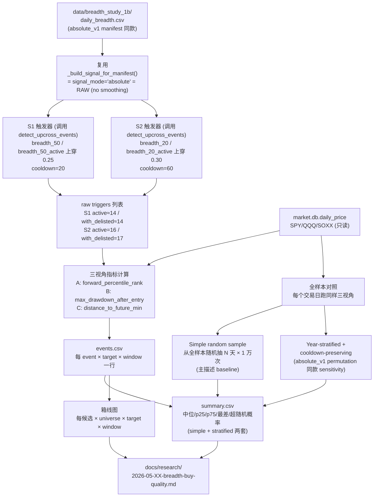
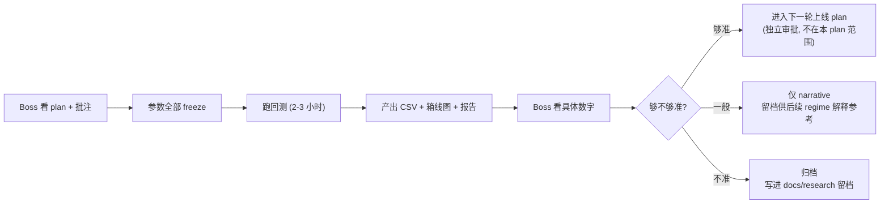

# Breadth 加仓信号 Hardening 实施计划

> **For Claude:** REQUIRED SUB-SKILL: Use superpowers:executing-plans to implement this plan task-by-task.

**Confidence: 76%**（v1 90% → v2 85% → v3 80% → v4 78% → v5 76%；Boss 四轮抓出 NaN row skip + per-year 测试 copy-paste bug + Acceptance 残留 14-15。Boss 表示 v5 修完可以 freeze 进执行）

**不确定点**:
- 看完描述结果后，"进下一轮上线 plan / 仅 narrative / 归档" 门槛具体怎么拍——设计上有意延后，先描述后回填
- S1 与 S2 cooldown 不一致 (S1=20 / S2=60) 是否被 Boss 接受——这是 event-validity report 表里两个候选的原始 cooldown 不同，不是本研究新引入的自由度
- S1 active 的 raw trigger 数 (Boss v1 批注只确认 S1 with_delisted=14 raw；S1 active 数尚未由 Boss 实跑确认) — Task 5 实跑后写死 snapshot

**北极星对齐**: 对应 `docs/design/north-star.md` 的"侧翼：宏观/Regime"层，作为 Regime 输入端的 broad-breadth 加仓信号研究；**本 plan 不触碰**分析层/策略层/CIO 层、**不产生交易建议**、**不修改 PI/晨报/cron 任何已上线代码**——研究产物仅 CSV + 图 + 一份描述报告。

**Goal:** 客观回答一个问题——broad-breadth 上穿 25%（MA50）和 30%（MA20）这两个候选信号，事后回头看，**信号触发日真的是大盘相对低点吗？**

**Tech Stack:** Python + pandas + numpy + 复用现有 `backtest/breadth_study/` 模块 + `market.db` (daily_price 只读) + 已有 `absolute_v1` manifest 数据

**Plan Changelog:**
- **v1 (2026-05-01 早)**：初稿
- **v2 (2026-05-01 晚, Boss 一轮批注修订)**: 处理 4 条 P1/P2 + 2 小点
  - **P1.1 修复**: 信号口径改为 `absolute_v1` 默认的 **RAW**（删除 SMA5 平滑），与 `breadth_absolute_v1.json:11 "signal_smoother": "RAW"` + `percentile_verifier.py:140-141 absolute mode` 对齐
  - **P1.2 修复**: 列名写死 column map：`active → breadth_50_active / breadth_20_active`；`with_delisted_partial → breadth_50 / breadth_20` (无后缀 = `daily_breadth.csv` 默认主口径)；Task 5 测试改成 snapshot 真实事件日期前 3/后 3 而不是只断言 count
  - **P2.1 修复**: Business Flow 终点改"进入下一轮上线 plan / 仅 narrative / 归档"，删除"PI/晨报触发自动 alert + 加仓提示"——本 plan 不承诺任何上线动作
  - **P2.2 修复**: 随机对照保留 simple random 作为主描述 baseline，**新增 year-stratified + cooldown-preserving sensitivity** 与 `absolute_v1` permutation 配置 (`stratify_by: year, respect_cooldown: true`) 一致；报告须明示 simple random 是描述性 baseline 不是严格显著性检验
  - **额外发现**: `absolute_v1` 的 `cooldown_short_horizon=20 / cooldown_long_horizon=60` 是 **horizon-dependent**——event-validity report 表里 S1 的 14 events 来自 cooldown=20，S2 的 15 events 来自 cooldown=60。本 plan 显式按 **S1 cooldown=20 / S2 cooldown=60** 各自复用 manifest 默认值，确保事件数与上一轮候选对齐
  - **小点 1**: 所有 pytest 命令改 venv 绝对路径 `/Users/owen/CC workspace/Finance/.venv/bin/python`（裸 `python3` 在某些环境下没有 pandas）
  - **小点 2**: Task 5 测试改 snapshot exact event dates
- **v3 (2026-05-01 晚, Boss 二轮批注修订)**: 处理 3 条新执行级问题
  - **P1 修复 (S2 event count 不对齐)**: v2 把 S2 active/with_delisted 都写成 15 events 是错的——15/16 是 event-validity report cell-level event_n（按 60d horizon target return 可用性过滤后），**不是 `load_event_dates()` raw trigger count**。Boss 实跑 cooldown=60: S2 active=16 raw triggers, with_delisted=17 raw triggers。本 plan 显式区分两个口径：(a) `load_event_dates()` 返回 **raw triggers** (信号上穿 + cooldown 去重)；(b) cell-level `event_n` = raw triggers 经过 (target × window) target close 可用性过滤后的可观测样本数，自然 ≤ raw triggers。Snapshot 测试用 raw triggers 写死
  - **P2 修复 (强制复用 `detect_upcross_events()`)**: v2 Task 5 伪代码手写了 prev/curr/cooldown 循环，违反"复用现有触发器"纪律。已确认 `backtest.breadth_study.percentile_events.detect_upcross_events(signal, threshold, cooldown_days)` 签名兼容（返回 `[{"index": int, "label": date}]`）。改成强制 `import` 直接调用，**禁止手写上穿循环**
  - **P3 修复 (cooldown 测试用日历日错语义)**: v2 Task 8 测试 `(b - a).days >= 20` 是日历日，但 `detect_upcross_events()` 的 cooldown_days 是 **positional spacing in series-index steps**（即整数索引 step，等价 trading days）。改成在 `all_dates` 里取 integer position gap `>= cooldown`
- **v4 (2026-05-01 晚, Boss 三轮批注修订)**: 处理 3 条新点
  - **P1 修复 (target prices 未按 frozen sample 裁剪)**: v3 `load_target_closes()` 直接读 daily_price 全部历史，未来重跑会吸收新数据导致 late-event 指标 + all-days baseline 漂移破坏 freeze。新增 `SAMPLE_START = "2021-02-01"` (= manifest `from_date`) + `SAMPLE_END = "2026-04-28"` (= daily_breadth.csv max date) 常量；`load_target_closes()` SQL 加 `WHERE date BETWEEN ? AND ?`；新增测试断言 `max(closes.index) <= SAMPLE_END`
  - **P2 修复 (报告模板残留 14-15 旧口径)**: 报告骨架"14-15 个事件每个一行"改成 raw trigger 视角，明确 4 组 raw trigger 数 (S1 active≈14 + S1 with_delisted≈14 + S2 active=16 + S2 with_delisted=17 ≈ 61 triggers)，长窗口不可观测的 trigger 标 NaN/不可观测
  - **P3 修复 (Stratified cooldown 口径选定)**: v3 测试用全局 positional gap 与现有 `percentile_perm.py:71/99` per-year 实现不一致。grep 核实现有 `_try_one_rejection_trial` + `_sample_sequential` 都是 **per-year 独立采样 + per-year 内 cooldown 强制 + 不检查跨年 gap**——这是 absolute_v1 manifest `respect_cooldown=true` 的真实语义。本 plan 选 **复刻现有 per-year 口径**（直接调用 `year_stratified_permutation_p` 或复刻其逻辑），不升级成全局 cooldown-preserving。测试改成 per-year positional gap；文案/实现/测试同一口径
- **v5 (2026-05-01 夜, Boss 四轮批注修订)**: 处理 3 条 freeze-前最后修订
  - **P1 修复 (缺 target 数据时 NaN 行不能 skip)**: v4 Task 6 `if ev_date not in closes.index: continue` 整批跳过 5 个 window 行，违反"events.csv 保留全部 raw trigger × target × window 行"约束。具体 case：SOXX 数据从 2021-04-26 才开始，S2 with_delisted 有 2021-03-10 raw trigger——会漏 5 行。改成：缺 target close 时仍 append 5 行 (signal_close/rank_pct/max_dd/dist_to_min 全 NaN)，summary 阶段 `.dropna()` 自然过滤
  - **P2 修复 (per-year cooldown 测试 copy-paste bug)**: v4 测试字典推导 `if d.year == d.year` 永远 true（同一 d 自己比自己），导致每个 year key 拿到全部 sampled positions，实际仍在测全局 gap。改成 `for year in sorted({d.year for d in sampled}): positions = sorted(all_days_dates.get_loc(d) for d in sampled if d.year == year)`
  - **P3 修复 (Acceptance Criteria 残留 14-15)**: v4 报告主体已改 raw trigger 但 Acceptance Criteria 仍写 "14-15 个事件每一次单独点名" — 执行 agent 以验收标准为准会漏 S2。改成 "每个 raw trigger 单独点名；不可观测窗口标 NaN/不可观测"

---

## Architecture（架构图）



> 一句话解释：左边复用 absolute_v1 RAW 信号触发上穿事件 → 中间算三视角指标 + 两层全样本对照 → 右边产出 CSV + 图 + 描述报告交给 Boss 拍门槛。

## Business Flow（业务流程图）



> 一句话解释：Boss 看完 plan 后冻结参数 → CC 跑回测出数字 → Boss 看数字拍三档之一。**本 plan 不承诺任何 PI/晨报/cron 上线动作**——"够准"的话另起 plan 走上线审批。

## Alternatives Considered（替代方案）

| 方案 | 优势 | 劣势 | 选择理由 |
|------|------|------|----------|
| **A. 描述型（推荐）** — 先把"是否相对低点"的所有数字摆出来，Boss 看完拍 | 5 年 14-15 events 没 power 设严门槛；数字摆出来后 Boss 凭直觉拍最贴合 use case | 需要 Boss 二次决策 | 5 年样本下任何预设门槛都是拍脑袋；先描述能避开过拟合预设 |
| B. 决策型 — plan 里预设"中位排位 < 30% 算准"等门槛 | 自动落档 | 5 年 14-15 events 没 power 撑这种门槛；预设容易拍歪 | 不选，违反"不预判"纪律 |
| C. 不做 hardening，直接上 PI alert | 最快 | 14-15 events 是不是真"低点"还是"运气" 完全没验证；上线后翻车风险高 | 不选 |

## Risks & Mitigation（风险自证）

- **最大风险**：5 年样本 + 14-15 events 是统计学硬上限，hardening 能给的最多是"在已有事件上看清楚"，给不了"未来一定也准"。**回测产出的所有数字都要贴上"基于 5 年 14-15 events"的免责标签**。
- **次要风险（winner's curse）**：候选阈值（25%/30%）已经是上一轮 event-validity 表里 perm/bootstrap 表现最好的——所谓 "winner's curse"。这次 hardening **故意不再调阈值/平滑/cooldown**，就是为了不再过拟合一遍。
- **特别风险（cooldown 不一致）**：S1=20 / S2=60 不一致，理由是各自来自 absolute_v1 manifest horizon-dependent cooldown，匹配 event-validity report 表里两个候选的原始 N。Plan 里显式标注，避免后续审阅误读为"调参"。
- **为什么不用更简单的做法**：直接把 14-15 个事件画在 SPY 走势图上肉眼看也能给直觉，但 Boss 想要"客观判断 准不准"——必须有量化指标 + 随机日对照分布做参照。
- **回滚方案**：如果三个候选 × 三个 target 全部跑出"和随机日没差"，结论就是"信号没用"，归档；不影响任何已有代码、cron、PI。

## Acceptance Criteria（验收标准）

- [ ] 复用 `_build_signal_for_manifest()` + `detect_upcross_events()` + absolute_v1 manifest 跑出全部 S1/S2 raw triggers；S1≈14 (active+with_delisted), S2 active=16 / with_delisted=17。**Raw trigger 数与 event-validity report 表里 cell-level event_n 不同**——cell-level event_n 是 raw triggers 经过 (target × window) target return 可用性过滤后的可观测样本，自然 ≤ raw triggers。S2 在 60d window 下 cell-level 降到 ~15-16 是预期的
- [ ] 每个事件 × 每个 target (SPY/QQQ/SOXX) × 每个评价窗口 (5/20/60/120/180 天) 都给出三视角指标值（A 排位 / B 最大回撤 / C 离最低距离）
- [ ] 随机抽 N 天 × 1 万次的对照分布跑完两套：(1) simple random，(2) year-stratified + cooldown-preserving；每候选 × target × 窗口出"超随机概率"两个百分数
- [ ] active-only / with_delisted_partial 两个数据口径都跑，事件触发日列表对比展示
- [ ] CSV (events + summary) + 箱线图 (每候选 × universe × target × 窗口一张) + 最终报告 全部产出
- [ ] 报告里**每个 raw trigger 单独点名**（4 组共 ~61 trigger：S1 active ≈14 + S1 with_delisted ≈14 + S2 active=16 + S2 with_delisted=17）；不可观测窗口标 NaN/不可观测；最差 1-2 次画 K 线特写
- [ ] 报告末尾 Boss 拍三档之一：进入下一轮上线 plan / 仅 narrative / 归档
- [ ] 全套 `/Users/owen/CC workspace/Finance/.venv/bin/python -m pytest tests/ -v` 不破

---

## 候选信号（Freeze）

> 全部沿用 `backtest/breadth_study/manifests/breadth_absolute_v1.json` 配置，**不引入任何新参数**。

| 编号 | 信号定义 | Cooldown | Raw triggers (本 plan `load_event_dates` 返回) | event-validity report cell-level `event_n` |
|---|---|---|---|---|
| **S1** | broad-universe `% close > MA50` (RAW, no smoothing) **从 0.25 以下首次上穿到 0.25 以上** | **20** trading-day positional steps (`cooldown_short_horizon`) | active ≈14 / with_delisted ≈14 (Task 5 实跑确认) | 表 #1 horizon=5/20 行 N=14 (cooldown=20，target return 可用性过滤后) |
| **S2** | broad-universe `% close > MA20` (RAW, no smoothing) **从 0.30 以下首次上穿到 0.30 以上** | **60** trading-day positional steps (`cooldown_long_horizon`) | active=16 / with_delisted=17 (Boss 实跑确认) | 表 #2 horizon=60 行 N=15-16 (cooldown=60，target return 可用性过滤后) |

> **关键概念区分**：
> - **Raw triggers** = `detect_upcross_events()` 的返回数 = 信号上穿日 + cooldown 去重，**不依赖 target 也不依赖评价窗口**
> - **Cell-level event_n** = raw triggers 经过特定 (target × evaluation_window) 的 future_close 可用性过滤后剩下的可观测样本 ≤ raw triggers
> - 样本末端 raw trigger 在长评价窗口（120d/180d）下会失去 future_close 而 NaN，自然降级为不可观测；但 raw trigger 列表本身固定
> - Task 5 snapshot 用 **raw triggers** 写死；Task 6 events.csv 把所有 raw trigger × target × window 都展开成行（NaN 行也保留），cell-level 过滤在 Task 8 summary 阶段做

**Freeze 项**：
- Signal mode: **`absolute` (RAW, no smoothing)** — 等价 `_build_signal_for_manifest()` 在 `signal_mode='absolute'` 分支走的 `pd.to_numeric(daily_breadth[breadth_col])` 路径
- 阈值: 25% / 30%
- Cooldown: S1=20 / S2=60 (horizon-dependent，复用 absolute_v1 manifest)
- Universe: `$1B+ PIT` 双口径 (active + with_delisted_partial overlay)
- Sample: 2021-02-01 → 2026-04-28
- **全部不允许调整**

## Sample Window（Freeze）

> 防止未来重跑吸收新数据导致 freeze 漂移。**所有数据查询都必须按这两个常量裁剪**。

```python
SAMPLE_START = "2021-02-01"  # = breadth_absolute_v1.json "from_date"
SAMPLE_END   = "2026-04-28"  # = daily_breadth.csv 最后一行 date (Boss 实跑确认)
```

裁剪点：
- `load_target_closes()` SQL `WHERE date BETWEEN ? AND ?`
- 任何 manifest-derived `panel`、`daily_breadth` 切片、target return 计算都要确认上界 ≤ SAMPLE_END
- 单元测试必须断言每个 target close series 的 `max(closes.index) <= SAMPLE_END`

> **未来扩样本是另一份 plan**：本 plan 数据 freeze 在 2026-04-28 当晚的 daily_price + daily_breadth 状态。如果 4 个月后想用更新数据再跑，必须重新冻结 manifest + 重写 plan，不允许在本 plan 实现里 silently 把 SAMPLE_END 改大。

---

## Column Map（Freeze）

> `daily_breadth.csv` 真实列名（已 grep 核对 csv header）。**伪代码不允许写 `f"breadth_{ma}_{universe}"` 这种动态拼接**——必须用下表写死。

| Universe | MA20 列 | MA50 列 |
|---|---|---|
| **active** | `breadth_20_active` | `breadth_50_active` |
| **with_delisted_partial** (主口径) | `breadth_20` | `breadth_50` |

注：`with_delisted_partial` 是 `daily_breadth.csv` 默认主口径列，**没有后缀**；`active` 才有 `_active` 后缀。这跟 `percentile_verifier.py:166 breadth_col = f"breadth_{ma}"` 一致。

## 三视角指标（Freeze）

每个事件触发日 `t`、每个评价窗口 `N`、每个 target，计算三个数字：

| 视角 | 名字 | 怎么算 | 越好越什么 |
|---|---|---|---|
| **A (Primary)** | Forward Percentile Rank | 把信号日 close 和未来 N 个交易日的 close 一起排序，看信号日排第几分位 | **越低越好**（0% = 信号日就是 N 天最低 close） |
| **B (辅)** | Max Drawdown After Entry | `min(future_N_close) / signal_close − 1` | **越接近 0 越好**（=加仓后被套深度小） |
| **C (辅)** | Distance to Future Min | `(signal_close − min(future_N_close)) / min(future_N_close)`，若 signal_close 本身就是最低则 = 0 | **越接近 0 越好**（=信号日离事后真底差距小） |

## 评价窗口（Freeze）

5 档：**5 / 20 / 60 / 120 / 180 个交易日**。180 天窗口下样本末端 ~1 个事件不可观察，剩 13-14 个；5/20/60 与 plan v1.2 一致便于跨研究对比。

## Targets（Freeze）

**SPY / QQQ / SOXX** 三 target 各自独立计算。同一组事件触发日（基于 broad universe），三 target 不强制方向一致。

## 数据口径（Freeze，沿用 absolute_v1 manifest）

每个候选都跑两遍：
- **active-only**：只用当下还活着的股票算广度（用 `breadth_NN_active` 列）
- **with_delisted_partial**：把 21 只 $10B+ 退市股票补回去算广度（用 `breadth_NN` 主列）

报告里展示两口径触发日是否一致。

## 参照系（Freeze）

每个候选 × 每个 target × 每个窗口，跟两层参照对比：

**层 1（图）**：把 N 个事件触发日的指标值，画在"全样本所有交易日同样指标分布"上 — 箱线图直接看事件落在哪。

**层 2（数字）**：随机抽样对照——**两套都跑**，互为 sensitivity：

| 版本 | 抽样方式 | 对应 absolute_v1 manifest 配置 | 用途 |
|---|---|---|---|
| **2a. Simple random** | 从全 ~1300 个交易日 i.i.d. 抽 N 天 (`replace=False`) × 1 万次 | 无（本研究主描述 baseline） | 主图、主结论："超随机概率" 头数 |
| **2b. Year-stratified + per-year cooldown-preserving** | 抽样时强制每年抽到的样本数 = 真实事件每年出现数；**同一年内**任两个抽样日 positional gap ≥ cooldown (S1=20, S2=60)；**跨年 Dec/Jan gap 不检查**（与现有 `percentile_perm.py` 实现一致） | `permutation.stratify_by=year` + `respect_cooldown=true` | sensitivity；如果 2a 显著但 2b 不显著 → 说明 2a 的"显著"靠的是年份/cooldown 结构而不是 buy quality 本身 |

> **2b 实现路径（Freeze）**：优先调用 `backtest.breadth_study.percentile_perm.year_stratified_permutation_p` 直接拿 p-value；若签名不能直接对应（buy_quality 是 metric-based 不是 forward-return-based），则复刻其内部的 `_try_one_rejection_trial` + `_sample_sequential` 逻辑（**per-year**, 不分叉到全局 cooldown）。**不允许引入全局跨年 cooldown 检查**——那是另一种口径，与 absolute_v1 manifest 不一致。

**报告必须明示**：simple random (2a) 是**描述性 baseline 不是严格显著性检验**；只有 2b 显著才是"buy quality 真比随机好"的有力证据。如果 2a 显著但 2b 不显著，结论降级。

输出："超随机概率" = 1 万次随机抽样里，比真实事件中位还差的次数 / 1 万。
- 越接近 100% 越好；50% 左右 = 跟随机没差。
- 每个 cell 报告 2 个百分数：`p_simple` / `p_stratified`。

---

## 不允许做的事（防过拟合纪律）

> 5 年样本 + 14-15 events 下，任何"再调一调"都会变成噪音上的过拟合。这一节是这次 hardening 最关键的纪律。

- ❌ **不允许调阈值**：S1 = 25%、S2 = 30% 全部 freeze。看完结果不能回头试 24%/26%/29%/31%
- ❌ **不允许加候选**：只测 S1 + S2 两个，不允许临时补 MA50@20% / MA20@25% / MA20@40% 等新信号
- ❌ **不允许调窗口**：5/20/60/120/180 全部 freeze。不允许补 30/90/150/240
- ❌ **不允许调冷静期**：S1=20 / S2=60 全部 freeze（来自 absolute_v1 manifest horizon-dependent cooldown）。不允许统一成 20 或 60，也不允许试 10/40/90
- ❌ **不允许换指标**：三视角 (A/B/C) 全部 freeze。不允许看完结果觉得"换 Sharpe / hit rate 更好看"再换一组
- ❌ **不允许引入信号平滑**：absolute_v1 manifest 已 freeze 为 RAW；引入 SMA5 等价于新建 absolute_v2 = 新研究，不在本 plan 范围
- ✅ **允许的**：发现实现 bug 修 bug；发现指标公式表达不清就在报告里说清楚；发现某个 target 在某个窗口下数据缺失就标注。**这些都不算"调参"**。

如果数字不够好——结论就是 **"不够好"**，**不允许换姿势再算一次找好看的版本写报告**。

---

## Implementation Tasks

> Pytest 命令统一用 venv 绝对路径：`/Users/owen/CC\ workspace/Finance/.venv/bin/python`。后续 task 简写为 `$VENV_PY`。

### Task 1: 起 worktree + 创建模块骨架

**Files:**
- 新 worktree: `.worktrees/breadth-buy-quality/`（branch: `feature/breadth-buy-quality`，based on main）
- Create: `backtest/breadth_study/buy_quality.py`（三视角指标 + 全样本对照 + 随机抽样）
- Create: `scripts/run_breadth_buy_quality.py`（CLI 入口）
- Create: `tests/test_breadth_buy_quality.py`（单元测试）
- Create: `data/breadth_buy_quality/` (本地结果目录, .gitignore 加规则)
- Create: `docs/research/2026-05-XX-breadth-buy-quality.md`（最终报告）

**Step 1: 起 worktree**

```bash
cd "/Users/owen/CC workspace/Finance"
git worktree add .worktrees/breadth-buy-quality -b feature/breadth-buy-quality main
cd .worktrees/breadth-buy-quality
```

**Step 2: .gitignore 加规则（避免本地大 CSV 进 git）**

把以下加到 `.gitignore`：
```
data/breadth_buy_quality/*.csv
data/breadth_buy_quality/charts/
!data/breadth_buy_quality/.gitkeep
```

并 `mkdir -p data/breadth_buy_quality && touch data/breadth_buy_quality/.gitkeep`。

**Step 3: Commit**

```bash
git add .gitignore data/breadth_buy_quality/.gitkeep
git commit -m "chore(breadth): scaffold buy-quality study workspace"
```

---

### Task 2: 写 Forward Percentile Rank 单测 + 实现（视角 A）

**Files:**
- Create test in: `tests/test_breadth_buy_quality.py`
- Create impl in: `backtest/breadth_study/buy_quality.py`

**Step 1: 写失败测试**

```python
import pandas as pd
import numpy as np
import pytest
from backtest.breadth_study.buy_quality import forward_percentile_rank

def test_forward_percentile_rank_signal_is_minimum():
    """信号日 close 就是未来 N 天最低 close → 排位 = 0%"""
    closes = pd.Series([100.0, 110, 115, 120, 130], index=pd.date_range("2025-01-01", periods=5))
    rank = forward_percentile_rank(closes, signal_idx=0, window=4)
    assert rank == 0.0

def test_forward_percentile_rank_signal_is_maximum():
    """信号日 close 就是未来 N 天最高 close → 排位 = 100%"""
    closes = pd.Series([130.0, 110, 105, 100, 95], index=pd.date_range("2025-01-01", periods=5))
    rank = forward_percentile_rank(closes, signal_idx=0, window=4)
    assert rank == 1.0

def test_forward_percentile_rank_window_truncated():
    """样本末端窗口不足 → 返回 NaN"""
    closes = pd.Series([100.0, 110], index=pd.date_range("2025-01-01", periods=2))
    rank = forward_percentile_rank(closes, signal_idx=0, window=5)
    assert pd.isna(rank)
```

**Step 2: Run** `$VENV_PY -m pytest tests/test_breadth_buy_quality.py::test_forward_percentile_rank_signal_is_minimum -v`
Expected: FAIL with `ModuleNotFoundError`

**Step 3: 写最小实现**

```python
import pandas as pd

def forward_percentile_rank(closes: pd.Series, signal_idx: int, window: int) -> float:
    """
    把 signal_idx 处的 close 和后续 window 个 close 一起排序,
    返回 signal close 在这 (window+1) 个数里的分位 (0.0 = 最低, 1.0 = 最高).
    若样本不足返回 NaN.
    """
    end_idx = signal_idx + window
    if end_idx >= len(closes):
        return float("nan")
    forward_window = closes.iloc[signal_idx : end_idx + 1].values
    signal_close = forward_window[0]
    rank = (forward_window < signal_close).sum() / window
    return float(rank)
```

**Step 4: Run** `$VENV_PY -m pytest tests/test_breadth_buy_quality.py -v`
Expected: 3 passed

**Step 5: Commit**

```bash
git add backtest/breadth_study/buy_quality.py tests/test_breadth_buy_quality.py
git commit -m "feat(breadth): add forward percentile rank metric (view A)"
```

---

### Task 3: 写 Max Drawdown After Entry 单测 + 实现（视角 B）

**Files:**
- Modify test: `tests/test_breadth_buy_quality.py`
- Modify impl: `backtest/breadth_study/buy_quality.py`

**Step 1: 写失败测试**

```python
from backtest.breadth_study.buy_quality import max_drawdown_after_entry

def test_max_drawdown_no_drop():
    """信号日后单调上涨 → 回撤 = 0"""
    closes = pd.Series([100.0, 105, 110, 120], index=pd.date_range("2025-01-01", periods=4))
    dd = max_drawdown_after_entry(closes, signal_idx=0, window=3)
    assert dd == 0.0

def test_max_drawdown_simple():
    """信号日 close=100, 未来最低 90 → 回撤 = -10%"""
    closes = pd.Series([100.0, 95, 90, 105], index=pd.date_range("2025-01-01", periods=4))
    dd = max_drawdown_after_entry(closes, signal_idx=0, window=3)
    assert dd == pytest.approx(-0.10)
```

**Step 2: Run** → FAIL `ImportError`

**Step 3: 实现**

```python
def max_drawdown_after_entry(closes: pd.Series, signal_idx: int, window: int) -> float:
    """
    信号日后 window 个交易日的最大回撤:
    min(future_N_close) / signal_close - 1
    若没有比信号日更低的 close, 返回 0.0 (没回撤).
    若样本不足返回 NaN.
    """
    end_idx = signal_idx + window
    if end_idx >= len(closes):
        return float("nan")
    signal_close = closes.iloc[signal_idx]
    future_min = closes.iloc[signal_idx + 1 : end_idx + 1].min()
    if future_min >= signal_close:
        return 0.0
    return float(future_min / signal_close - 1.0)
```

**Step 4: Run** `$VENV_PY -m pytest tests/test_breadth_buy_quality.py -v` → 5 passed

**Step 5: Commit**

```bash
git commit -am "feat(breadth): add max drawdown after entry metric (view B)"
```

---

### Task 4: 写 Distance to Future Min 单测 + 实现（视角 C）

**Files:**
- Modify test: `tests/test_breadth_buy_quality.py`
- Modify impl: `backtest/breadth_study/buy_quality.py`

**Step 1: 写失败测试**

```python
from backtest.breadth_study.buy_quality import distance_to_future_min

def test_distance_signal_is_min():
    """信号日就是未来最低 → 距离 = 0"""
    closes = pd.Series([100.0, 110, 120], index=pd.date_range("2025-01-01", periods=3))
    d = distance_to_future_min(closes, signal_idx=0, window=2)
    assert d == 0.0

def test_distance_simple():
    """信号日 100, 未来最低 90 → 距离 = (100-90)/90 = 11.11%"""
    closes = pd.Series([100.0, 95, 90, 105], index=pd.date_range("2025-01-01", periods=4))
    d = distance_to_future_min(closes, signal_idx=0, window=3)
    assert d == pytest.approx(10/90)
```

**Step 2: Run** `$VENV_PY -m pytest tests/test_breadth_buy_quality.py -v` → FAIL

**Step 3: 实现**

```python
def distance_to_future_min(closes: pd.Series, signal_idx: int, window: int) -> float:
    """
    信号日离 N 天内最低 close 的相对距离.
    若 signal_close <= future_min: 返回 0.0 (信号日本身就是最低或更低).
    若样本不足返回 NaN.
    """
    end_idx = signal_idx + window
    if end_idx >= len(closes):
        return float("nan")
    signal_close = closes.iloc[signal_idx]
    future_min = closes.iloc[signal_idx + 1 : end_idx + 1].min()
    if signal_close <= future_min:
        return 0.0
    return float((signal_close - future_min) / future_min)
```

**Step 4: Run** `$VENV_PY -m pytest tests/test_breadth_buy_quality.py -v` → 7 passed

**Step 5: Commit**

```bash
git commit -am "feat(breadth): add distance to future min metric (view C)"
```

---

### Task 5: 复用 absolute_v1 触发器拿到事件触发日（含 column map + cooldown 拆分）

**Files:**
- Create: `scripts/run_breadth_buy_quality.py`（CLI runner，分阶段实现）
- Read: `backtest/breadth_study/percentile_verifier.py:122` 的 `_build_signal_for_manifest()`
- Read: `backtest/breadth_study/manifests/breadth_absolute_v1.json`
- Read: `data/breadth_study_1b/daily_breadth.csv`

**Step 1: 写 column map 常量**

```python
# scripts/run_breadth_buy_quality.py 顶部
SIGNAL_COLUMNS = {
    ("S1", "active"):                  ("breadth_50_active", 0.25, 20),
    ("S1", "with_delisted_partial"):   ("breadth_50",         0.25, 20),
    ("S2", "active"):                  ("breadth_20_active", 0.30, 60),
    ("S2", "with_delisted_partial"):   ("breadth_20",         0.30, 60),
}
# (breadth_column, threshold, cooldown_days)
```

**Step 2: 写 `load_event_dates()` 实现 — 强制直接 import `detect_upcross_events()`**

```python
import json
import pandas as pd
from pathlib import Path
from backtest.breadth_study.percentile_verifier import _build_signal_for_manifest
from backtest.breadth_study.percentile_events import detect_upcross_events

DAILY_BREADTH_PATH = Path("data/breadth_study_1b/daily_breadth.csv")
MANIFEST_PATH = Path("backtest/breadth_study/manifests/breadth_absolute_v1.json")

def load_event_dates(signal: str, universe: str) -> list[pd.Timestamp]:
    """返回 RAW triggers (信号上穿 + cooldown 去重), 不做 target return 可用性过滤.
    强制复用 detect_upcross_events()——禁止手写 prev/curr 循环."""
    column, threshold, cooldown = SIGNAL_COLUMNS[(signal, universe)]
    daily = pd.read_csv(DAILY_BREADTH_PATH, parse_dates=["date"])
    manifest = json.loads(MANIFEST_PATH.read_text())
    # _build_signal_for_manifest signal_mode='absolute' returns RAW breadth (no smoothing)
    signal_series = _build_signal_for_manifest(manifest, daily, column)
    # daily['date'] 与 signal_series 索引对齐 — 把 daily.date 设为 signal index
    signal_series.index = daily["date"]
    events = detect_upcross_events(signal_series, threshold=threshold, cooldown_days=cooldown)
    # detect_upcross_events 返回 [{"index": int, "label": Timestamp}]; 取 label 即触发日
    return [ev["label"] for ev in events]
```

> **不允许**：手写 `for i in range(...): if prev < threshold and curr >= threshold:` 循环。如果未来上游 `detect_upcross_events()` 修 bug，buy_quality 必须自动跟随，不分叉。

**Step 3: 写 snapshot 测试 — 留 placeholder 等 Step 4 回填**

```python
# tests/test_breadth_buy_quality.py
from scripts.run_breadth_buy_quality import load_event_dates

# 这些 expected len 与 dates 在 Step 4 实跑后回填 — 必须 snapshot exact, 不允许只断言 count range

def test_load_event_dates_s1_active_snapshot():
    events = load_event_dates(signal="S1", universe="active")
    assert len(events) == ___  # filled in Step 4 (~14)
    assert events[:3] == [
        pd.Timestamp("____-__-__"),  # filled in Step 4
        pd.Timestamp("____-__-__"),
        pd.Timestamp("____-__-__"),
    ]
    assert events[-3:] == [
        pd.Timestamp("____-__-__"),  # filled in Step 4 (后 3 个也写死)
        pd.Timestamp("____-__-__"),
        pd.Timestamp("____-__-__"),
    ]

def test_load_event_dates_s1_with_delisted_snapshot():
    events = load_event_dates(signal="S1", universe="with_delisted_partial")
    assert len(events) == ___  # filled in Step 4 (Boss v1 批注确认 = 14)
    assert events[:3] == [...]  # filled in Step 4
    assert events[-3:] == [...]

def test_load_event_dates_s2_active_snapshot():
    events = load_event_dates(signal="S2", universe="active")
    assert len(events) == 16  # Boss v3 批注确认
    assert events[:3] == [...]  # filled in Step 4
    assert events[-3:] == [...]

def test_load_event_dates_s2_with_delisted_snapshot():
    events = load_event_dates(signal="S2", universe="with_delisted_partial")
    assert len(events) == 17  # Boss v3 批注确认
    assert events[:3] == [...]  # filled in Step 4
    assert events[-3:] == [...]
```

**Step 4: 实跑 + snapshot 回填**

```bash
$VENV_PY -c "
from scripts.run_breadth_buy_quality import load_event_dates
for sig in ['S1', 'S2']:
    for uni in ['active', 'with_delisted_partial']:
        ev = load_event_dates(sig, uni)
        print(f'{sig} {uni}: len={len(ev)}, first3={[d.date() for d in ev[:3]]}, last3={[d.date() for d in ev[-3:]]}')
"
```

把打印出的真实 `len` 与日期填回 4 个测试的 placeholder。**这是测试通过的硬条件**——以后任何上游数据变化都必须显式更新 snapshot，不允许悄悄漂移。

**Step 5: Run** `$VENV_PY -m pytest tests/test_breadth_buy_quality.py -v` → 11 passed

**关键事实核对**（raw triggers，不是 cell-level event_n）：
- S1 active / with_delisted: 应该 ~14 raw triggers（cooldown=20）
- S2 active: **必须 = 16 raw triggers**（cooldown=60，Boss v3 实跑确认）
- S2 with_delisted_partial: **必须 = 17 raw triggers**（cooldown=60，Boss v3 实跑确认）

**如果数字对不上**：
- S2 ≠ 16/17 → 停下来调查根因（很可能 `_build_signal_for_manifest` 调用方式或 cooldown 传值出错），**不允许"调参对齐"**
- S1 ≠ 14 ± 1 → 同样停下来；与 Boss v1 确认的 with_delisted=14 raw 偏差 >1 必须调查

**与 event-validity report 表的关系**：报告里 S2 horizon=60 行写 N=15 不是与本 plan 矛盾——那是 cell-level event_n（raw triggers 经过 60d window target close 可用性过滤后剩余可观测样本）。raw triggers 17 - 末端不可观测 ~1-2 = cell-level ~15。这跟 `events.csv` 行数无关；events.csv 保留全部 raw trigger × target × window 行，NaN 行也保留。

**Step 6: Commit**

```bash
git commit -am "feat(breadth): reuse absolute_v1 RAW signal + detect_upcross_events with horizon-dependent cooldown"
```

---

### Task 6: 写主 runner — 三视角 × 三 target × 五窗口 × 双口径

**Files:**
- Modify: `scripts/run_breadth_buy_quality.py`
- Modify: `tests/test_breadth_buy_quality.py`
- Output: `data/breadth_buy_quality/events.csv`

**Step 1: 写失败测试**

```python
def test_events_csv_columns_and_rows(tmp_path):
    """确认 events.csv 输出列和行数 (含 NaN 行)."""
    out = tmp_path / "events.csv"
    run_buy_quality_pipeline(output_dir=tmp_path)
    df = pd.read_csv(out)
    expected_cols = {
        "signal", "universe", "event_date", "target", "window_days",
        "signal_close", "rank_pct", "max_dd", "dist_to_min",
    }
    assert expected_cols.issubset(df.columns)
    # raw triggers: S1 active≈14 + S1 with_delisted≈14 + S2 active=16 + S2 with_delisted=17
    # = ~61 events × 3 targets × 5 windows ≈ 915 行 (含 NaN, 行不丢)
    assert 850 <= len(df) <= 1000

def test_load_target_closes_respects_sample_window():
    """target close 严格裁剪到 [SAMPLE_START, SAMPLE_END], 防止未来重跑漂移."""
    from scripts.run_breadth_buy_quality import load_target_closes, SAMPLE_START, SAMPLE_END
    closes = load_target_closes(["SPY"])["SPY"]
    assert closes.index.min() >= pd.Timestamp(SAMPLE_START)
    assert closes.index.max() <= pd.Timestamp(SAMPLE_END), (
        f"SPY close max date {closes.index.max()} > SAMPLE_END {SAMPLE_END}; "
        "未来重跑会破坏 freeze——必须 SQL 加 BETWEEN 裁剪"
    )
```

**Step 2: Run** → FAIL

**Step 3: 实现 main pipeline**

```python
SIGNALS = ["S1", "S2"]
UNIVERSES = ["active", "with_delisted_partial"]
TARGETS = ["SPY", "QQQ", "SOXX"]
WINDOWS = [5, 20, 60, 120, 180]

SAMPLE_START = "2021-02-01"
SAMPLE_END   = "2026-04-28"

def load_target_closes(targets: list[str]) -> dict[str, pd.Series]:
    """从 market.db 只读拉每个 target 的 daily close, 严格裁剪到 [SAMPLE_START, SAMPLE_END]."""
    import sqlite3
    conn = sqlite3.connect("data/market.db")
    out = {}
    for tgt in targets:
        df = pd.read_sql(
            "SELECT date, close FROM daily_price "
            "WHERE symbol = ? AND date BETWEEN ? AND ? ORDER BY date",
            conn, params=(tgt, SAMPLE_START, SAMPLE_END),
            parse_dates=["date"],
        ).set_index("date")
        out[tgt] = df["close"]
    conn.close()
    return out

def run_buy_quality_pipeline(output_dir: Path) -> pd.DataFrame:
    """
    保留每个 raw trigger × target × window 一行, 即使 target 数据缺失也 append NaN 行
    (summary 阶段 dropna). 案例: SOXX 起点 2021-04-26 < S2 with_delisted 2021-03-10 trigger
    -> 5 个 window 行 signal_close/rank/dd/dist 全 NaN, 行不丢.
    """
    rows = []
    target_closes = load_target_closes(TARGETS)
    for sig in SIGNALS:
        for uni in UNIVERSES:
            events = load_event_dates(signal=sig, universe=uni)
            for ev_date in events:
                for tgt in TARGETS:
                    closes = target_closes[tgt]
                    if ev_date in closes.index:
                        sig_idx = closes.index.get_loc(ev_date)
                        sig_close = float(closes.iloc[sig_idx])
                        for w in WINDOWS:
                            rows.append({
                                "signal": sig, "universe": uni, "event_date": ev_date,
                                "target": tgt, "window_days": w, "signal_close": sig_close,
                                "rank_pct":    forward_percentile_rank(closes, sig_idx, w),
                                "max_dd":      max_drawdown_after_entry(closes, sig_idx, w),
                                "dist_to_min": distance_to_future_min(closes, sig_idx, w),
                            })
                    else:
                        # target close 在 ev_date 不存在 (target 数据起点晚于 trigger)
                        # 仍 append 5 个 NaN 行, 不丢"每 trigger × target × window"行
                        for w in WINDOWS:
                            rows.append({
                                "signal": sig, "universe": uni, "event_date": ev_date,
                                "target": tgt, "window_days": w, "signal_close": float("nan"),
                                "rank_pct": float("nan"),
                                "max_dd": float("nan"),
                                "dist_to_min": float("nan"),
                            })
    df = pd.DataFrame(rows)
    output_dir.mkdir(parents=True, exist_ok=True)
    df.to_csv(output_dir / "events.csv", index=False)
    return df
```

**Step 4: Run** `$VENV_PY -m pytest tests/test_breadth_buy_quality.py -v` → PASS

**Step 5: 实跑 + 抽样核对**

```bash
$VENV_PY scripts/run_breadth_buy_quality.py --output data/breadth_buy_quality/
```

抽 1 个事件人肉核对：从 events.csv 取一行 (比如 S1 active 第 1 个事件 SPY 60d window)，到 daily_price 表里查那个日期 SPY close + 后续 60 个 close，手算 rank/dd/dist 跟 csv 对得上才算过。

**Step 6: Commit**

```bash
git commit -am "feat(breadth): main pipeline producing events.csv"
```

---

### Task 7: 全样本对照分布（每个交易日跑同样三视角）

**Files:**
- Modify: `backtest/breadth_study/buy_quality.py`
- Modify: `scripts/run_breadth_buy_quality.py`
- Output: `data/breadth_buy_quality/all_days_baseline.csv`

**Step 1: 写失败测试**

```python
def test_all_days_baseline_shape():
    baseline = compute_all_days_baseline(targets=["SPY"], windows=[60])
    assert "rank_pct" in baseline.columns
    # SPY 在 2021-02-01..2026-04-28 ~1300 trading days, 60d 窗口截掉末尾 60 天
    assert 1200 <= len(baseline) <= 1300
```

**Step 2: Run** → FAIL

**Step 3: 实现**

```python
def compute_all_days_baseline(targets: list[str], windows: list[int]) -> pd.DataFrame:
    rows = []
    target_closes = load_target_closes(targets)
    for tgt, closes in target_closes.items():
        for w in windows:
            for i in range(len(closes)):
                if i + w >= len(closes):
                    break
                rows.append({
                    "target": tgt, "window_days": w, "date": closes.index[i],
                    "rank_pct":    forward_percentile_rank(closes, i, w),
                    "max_dd":      max_drawdown_after_entry(closes, i, w),
                    "dist_to_min": distance_to_future_min(closes, i, w),
                })
    return pd.DataFrame(rows)
```

**Step 4: Run** `$VENV_PY -m pytest tests/test_breadth_buy_quality.py -v` → PASS

**Step 5: 实跑** 写到 `data/breadth_buy_quality/all_days_baseline.csv`

**Step 6: Commit**

```bash
git commit -am "feat(breadth): all-days baseline distribution"
```

---

### Task 8: 随机抽样对照——双版本（simple + stratified+cooldown）

**Files:**
- Modify: `backtest/breadth_study/buy_quality.py`
- Modify: `scripts/run_breadth_buy_quality.py`
- Output: `data/breadth_buy_quality/summary.csv`

**Step 1: 写失败测试**

```python
def test_random_sample_simple_signal_clearly_better():
    np.random.seed(42)
    all_days_metric = pd.Series(np.random.uniform(0, 1, 1300))
    event_metric = pd.Series([0.05, 0.08, 0.12, 0.15, 0.10] * 3)  # 14 个低分位事件
    p = compute_better_than_random_pct_simple(event_metric, all_days_metric, n_iter=10000, lower_is_better=True)
    assert p >= 0.95

def test_random_sample_stratified_respects_per_year_cooldown():
    """stratified 版本必须保证: 每次抽样里 *同一年内* 任两个采样日的 positional gap >= cooldown.
    跨年 (Dec/Jan) gap 不检查 — 与现有 percentile_perm.py:71/99 per-year 实现一致.
    cooldown 是 positional spacing in series-index steps (per percentile_events.py:29).
    """
    rng = np.random.default_rng(42)
    all_days_dates = pd.DatetimeIndex(pd.date_range("2021-02-01", periods=1300, freq="B"))
    real_event_dates = [
        pd.Timestamp("2022-03-15"), pd.Timestamp("2022-09-01"),
        pd.Timestamp("2023-04-01"), pd.Timestamp("2023-10-15"),
    ]
    sampled = sample_dates_stratified_cooldown(
        all_days_dates, real_event_dates, cooldown=20, rng=rng,
    )
    # 按 year 分组, 检查每年内任两个采样日 positional gap >= cooldown.
    # 注意: 字典推导用 `d.year == year` (外层 year), 不能写 `d.year == d.year` 那永远 true.
    years = sorted({d.year for d in sampled})
    for year in years:
        positions = sorted(
            all_days_dates.get_loc(d) for d in sampled if d.year == year
        )
        for a, b in zip(positions[:-1], positions[1:]):
            assert b - a >= 20, f"year {year}: positional gap {b-a} < cooldown 20"
    # 不检查跨年 gap (Dec-Jan)
```

**Step 2: Run** → FAIL

**Step 3: 实现两个版本**

```python
def compute_better_than_random_pct_simple(
    event_metric: pd.Series,
    all_days_metric: pd.Series,
    n_iter: int = 10000,
    lower_is_better: bool = True,
    seed: int = 42,
) -> float:
    """从 all_days_metric pool i.i.d. 抽 N 个值无放回, 算中位, 重复 n_iter 次."""
    rng = np.random.default_rng(seed)
    event_med = event_metric.dropna().median()
    n = len(event_metric.dropna())
    pool = all_days_metric.dropna().values
    random_meds = np.array([
        np.median(rng.choice(pool, size=n, replace=False)) for _ in range(n_iter)
    ])
    if lower_is_better:
        return float((random_meds > event_med).sum() / n_iter)
    return float((random_meds < event_med).sum() / n_iter)


def sample_dates_stratified_cooldown(
    all_days_dates: pd.DatetimeIndex,
    real_event_dates: list[pd.Timestamp],
    cooldown: int,
    rng: np.random.Generator,
    max_attempts: int = 50,
) -> list[pd.Timestamp]:
    """复刻 absolute_v1 permutation 的 stratify_by=year + respect_cooldown=true (per-year).
    对每年抽 = 真实事件该年出现数 个日子, *同年内* 任两个 positional gap >= cooldown.
    跨年 gap 不检查 (与 percentile_perm.py:71/99 一致).
    若 max_attempts 内拿不到合法样本, fallback 到 sequential.

    实现路径: 直接调用或复刻 percentile_perm.py 的:
      - _try_one_rejection_trial (line 63)
      - _sample_sequential       (line 85, fallback)
      - _sample_with_rejection   (line 40)
    优先 import 现有函数; 若签名不匹配 (buy_quality 不需要 forward returns) 则
    复刻其 per-year 逻辑——不允许引入全局跨年 cooldown 检查.
    """
    ...


def compute_better_than_random_pct_stratified(
    event_metric_with_dates: pd.DataFrame,  # cols: date, metric_value
    all_days_metric_with_dates: pd.DataFrame,  # cols: date, metric_value
    cooldown: int,
    n_iter: int = 10000,
    lower_is_better: bool = True,
    seed: int = 42,
) -> float:
    rng = np.random.default_rng(seed)
    event_med = event_metric_with_dates["metric_value"].dropna().median()
    real_event_dates = list(event_metric_with_dates["date"])
    all_dates = pd.DatetimeIndex(all_days_metric_with_dates["date"])
    metric_lookup = dict(zip(all_days_metric_with_dates["date"], all_days_metric_with_dates["metric_value"]))

    random_meds = []
    for _ in range(n_iter):
        sampled = sample_dates_stratified_cooldown(all_dates, real_event_dates, cooldown, rng)
        vals = [metric_lookup[d] for d in sampled if d in metric_lookup and not pd.isna(metric_lookup[d])]
        if len(vals) >= len(real_event_dates) // 2:  # 至少一半样本可用
            random_meds.append(np.median(vals))
    random_meds = np.array(random_meds)
    if lower_is_better:
        return float((random_meds > event_med).sum() / len(random_meds))
    return float((random_meds < event_med).sum() / len(random_meds))
```

**关键**：`sample_dates_stratified_cooldown` 优先复用 `backtest/breadth_study/percentile_perm.py` 已有 stratified+cooldown 实现。先 grep `percentile_perm.py` 看现有函数签名，能复用就 import；不能复用就照搬其逻辑写新函数（不分叉）。

**Step 4: 实现 summary 汇总**

```python
def build_summary(events_df, baseline_df) -> pd.DataFrame:
    rows = []
    for (sig, uni, tgt, w), grp in events_df.groupby(["signal", "universe", "target", "window_days"]):
        cooldown = 20 if sig == "S1" else 60
        for metric in ["rank_pct", "max_dd", "dist_to_min"]:
            event_vals = grp[metric].dropna()
            event_dates = grp.loc[grp[metric].notna(), "event_date"]
            baseline_vals = baseline_df[
                (baseline_df.target == tgt) & (baseline_df.window_days == w)
            ][[metric, "date"]].dropna()
            lower_is_better = (metric != "max_dd")
            p_simple = compute_better_than_random_pct_simple(
                event_vals, baseline_vals[metric], lower_is_better=lower_is_better,
            )
            event_with_dates = pd.DataFrame({"date": event_dates.values, "metric_value": event_vals.values})
            baseline_with_dates = baseline_vals.rename(columns={metric: "metric_value"})
            p_stratified = compute_better_than_random_pct_stratified(
                event_with_dates, baseline_with_dates,
                cooldown=cooldown, lower_is_better=lower_is_better,
            )
            rows.append({
                "signal": sig, "universe": uni, "target": tgt, "window_days": w,
                "metric": metric, "n_events": len(event_vals),
                "event_median": event_vals.median(),
                "event_p25": event_vals.quantile(0.25),
                "event_p75": event_vals.quantile(0.75),
                "event_worst": event_vals.max() if lower_is_better else event_vals.min(),
                "all_days_median": baseline_vals[metric].median(),
                "p_simple": p_simple,
                "p_stratified": p_stratified,
            })
    return pd.DataFrame(rows)
```

**Step 5: Run** → PASS, 实跑

**Step 6: Commit**

```bash
git commit -am "feat(breadth): random-sample baseline (simple + stratified+cooldown) + summary"
```

---

### Task 9: 箱线图（每候选 × universe × target × 窗口一张）

**Files:**
- Modify: `scripts/run_breadth_buy_quality.py`
- Output: `data/breadth_buy_quality/charts/*.png`

**Step 1: 实现 boxplot 函数**

```python
import matplotlib.pyplot as plt

def plot_event_vs_baseline_box(
    events_df, baseline_df, signal, universe, target, window, metric, output_path,
):
    fig, ax = plt.subplots(figsize=(7, 5))
    event_vals = events_df[
        (events_df.signal==signal) & (events_df.universe==universe)
        & (events_df.target==target) & (events_df.window_days==window)
    ][metric].dropna()
    baseline_vals = baseline_df[
        (baseline_df.target==target) & (baseline_df.window_days==window)
    ][metric].dropna()
    ax.boxplot([baseline_vals, event_vals], labels=["全样本所有日", f"{signal} 事件 (n={len(event_vals)})"])
    ax.set_title(f"{signal} ({universe}) | {target} | {window}d | {metric}")
    ax.set_ylabel(metric)
    fig.tight_layout()
    fig.savefig(output_path, dpi=120)
    plt.close(fig)
```

**Step 2: 跑全套**

每候选 × universe × target × 窗口 × 三视角 = 2 × 2 × 3 × 5 × 3 = 180 张图。文件命名 `{signal}_{universe}_{target}_{window}d_{metric}.png`。

**Step 3: Commit**

```bash
git commit -am "feat(breadth): boxplot charts events vs baseline"
```

---

### Task 10: 写最终报告（描述型）

**Files:**
- Create: `docs/research/2026-05-XX-breadth-buy-quality.md`（实施时改实际日期）

**Step 1: 报告骨架**

```markdown
# Broad Breadth 加仓信号 Hardening — Buy Quality 描述报告

**Date frozen**: 2026-05-XX
**Confidence**: 85%
**Sample**: 2021-02-01 → 2026-04-28 (~5.2 年, ~1300 交易日)
**Signal mode**: absolute_v1 RAW (no smoothing)
**Raw triggers**: S1 active≈14 / with_delisted≈14, S2 active=16 / with_delisted=17 (cooldown 后去重，未做 target return 可用性过滤)
**Cell-level event_n** (按 (target × window) target close 可用性过滤后): 长窗口下会比 raw triggers 少 1-2 个，summary.csv `n_events` 列展示
**Cooldown**: S1=20 (短 horizon) / S2=60 (长 horizon) trading-day positional steps, 来自 absolute_v1 manifest
**Random sample baseline**: simple (主) + year-stratified+cooldown-preserving (sensitivity)

> **重要**: simple random 是描述性 baseline 不是严格显著性检验; 仅当 stratified 也显著时才能称"buy quality 真比随机好"

## 一句话结论

| 候选 | universe | SPY | QQQ | SOXX |
|------|----------|-----|-----|------|
| **S1 (MA50 上穿 25%)** | active | ?? | ?? | ?? |
| **S1 (MA50 上穿 25%)** | with_delisted | ?? | ?? | ?? |
| **S2 (MA20 上穿 30%)** | active | ?? | ?? | ?? |
| **S2 (MA20 上穿 30%)** | with_delisted | ?? | ?? | ?? |

> "??" 写报告时填: "准 / 一般 / 不准" + 一句话量化依据 (event_median + p_simple + p_stratified)

## 三视角总表

[贴 summary.csv 的 markdown 版本, 关键列: event_median / all_days_median / p_simple / p_stratified]

## 每次事件单挑

按 raw trigger 视角列出（4 组共 ~61 trigger）:
- **S1 active** (~14 triggers): 每个 trigger 一行 = 触发日 / 当时市场环境一句话 / 三视角值 (60d 窗口；长窗口 NaN 标"不可观测")
- **S1 with_delisted** (~14 triggers): 同上
- **S2 active** (16 triggers): 同上
- **S2 with_delisted** (17 triggers): 同上

> 不要写"14-15 个事件每个一行"——那是上一轮 cell-level event_n 旧口径，会漏 S2。raw trigger 比 cell-level 多 1-2 个，需要原样列出含末端不可观测的 trigger。

## 最糟糕事件特写 (1-2 个)

[每个候选挑最差 1-2 个事件画 K 线图, 标注信号触发日 + 后续 60/120 日走势]

## 双数据口径对比

[active vs with-delisted_partial 触发日列表对比, 结论: 一致 / 偏差小 / 偏差大]

## 决策门槛回填

> 看完上面数字, Boss 拍三档之一:
- [ ] 进入下一轮上线 plan (PI/晨报集成等独立审批, 不在本研究范围)
- [ ] 仅 narrative (留档供后续 regime 解释参考, 不上线任何动作)
- [ ] 归档 (留档不上线)

理由: ...
```

**Step 2: Commit (空骨架)**

```bash
git add docs/research/2026-05-XX-breadth-buy-quality.md
git commit -m "docs(breadth): buy-quality report skeleton"
```

**Step 3: 跑完所有数据后填报告内容 + 最终 commit**

---

### Task 11: 全套测试 + 主 pytest 不破

**Files:** 整个 `tests/` 目录

**Step 1**: `/Users/owen/CC\ workspace/Finance/.venv/bin/python -m pytest tests/ -v`

期望: 1873 → 1873 + N (N = 本次新增 buy_quality 测试数, 大约 12-18 个) 全过

**Step 2**: 任何回归立即修；不允许跳过/skip 已有测试

**Step 3: Final Commit**

```bash
git commit -am "test(breadth): final test pass for buy-quality study"
```

---

### Task 12: 交 Boss 看数字 + 决策回填

- 把 `data/breadth_buy_quality/summary.csv` + `docs/research/2026-05-XX-breadth-buy-quality.md` 整理出来给 Boss
- Boss 看完数字后口述/批注落档 (进入下一轮上线 plan / 仅 narrative / 归档)
- CC 把决策填进报告末尾 "决策门槛回填" section
- 更新 `.claude/ongoing.md`: 把"下一轮 hardening" 任务标完成, 备注落档

**Step 1: Commit 决策**

```bash
git commit -am "docs(breadth): finalize buy-quality study verdict"
```

**Step 2**: 按 `superpowers:finishing-a-development-branch` 决定 merge 路径 (PR / squash / 暂留)

---

## CC Review Focus（请 CC 重点审）

1. **信号口径正确**：S1/S2 都用 `_build_signal_for_manifest()` 走 `signal_mode='absolute'` = RAW，**不允许引入 SMA5 或任何平滑**
2. **Column map 写死**：必须按 § Column Map 表使用 `breadth_50_active` / `breadth_20_active` / `breadth_50` / `breadth_20`，**不允许动态拼接**
3. **Cooldown 拆分**：S1=20 / S2=60 trading-day positional steps，必须按 § 候选信号 freeze 表写死
4. **强制直接 import `detect_upcross_events()`**：`from backtest.breadth_study.percentile_events import detect_upcross_events` 直接调用，**不允许手写 prev/curr/cooldown 循环**——避免上游修 bug 时 buy_quality 分叉
5. **Raw triggers vs cell-level event_n 区分**：`load_event_dates()` 必须返回 raw triggers（S2 active=16, with_delisted=17 cooldown=60 后），cell-level 过滤在 summary 阶段做；不要在触发器里偷偷做 target close 可用性过滤
6. **Cooldown 测试用 positional gap**：所有 cooldown 相关测试断言必须用 `position_b - position_a >= cooldown`，**不允许用 `(date_b - date_a).days`** —— 20 个交易日 ≈ 28 自然日，长假更偏
7. **随机抽样双版本**：simple + stratified+cooldown 都要跑，summary.csv 给 `p_simple` + `p_stratified` 两列
8. **守住"不允许做的事"纪律**：阈值/窗口/cooldown/信号模式 全部 freeze
9. **数据保护铁律**：market.db 只读；研究产物全部进 `data/breadth_buy_quality/` (gitignored)；不污染主库
10. **Pytest 命令统一 venv 绝对路径**：所有 task command 都用 `/Users/owen/CC\ workspace/Finance/.venv/bin/python -m pytest`，禁用裸 `python3`
11. **Sample window freeze**：所有 daily_price/breadth 查询都必须 `WHERE date BETWEEN SAMPLE_START AND SAMPLE_END` 裁剪，**不允许吃未来数据**——Task 6 必须有 `test_load_target_closes_respects_sample_window` 测试断言 `max(closes.index) <= SAMPLE_END`
12. **Stratified permutation = per-year，不是全局**：实现优先 import `percentile_perm.py:_try_one_rejection_trial / _sample_sequential`；若签名不匹配则复刻其 per-year 逻辑，**禁止引入全局跨年 cooldown 检查**——那是另一种口径，与 absolute_v1 manifest `respect_cooldown=true` 真实语义不一致

## Boss Review Focus（请 Boss 重点看）

1. **架构图 + 业务流程图** 是否符合你的预期（看不懂图 = plan 没写好）
2. **三视角公式 (A/B/C)** 是否真的对应你心里"准不准"的语义
3. **不允许做的事** 列表是否合理——这是这次 hardening 最关键的纪律
4. **决策门槛延后** 是否接受——plan 里不预设"中位 < 30% 算准"等门槛，看完数字后再回填
5. **报告结构** 是否符合你想看的呈现顺序（一句话结论 → 总表 → 每事件 → 最糟特写 → 决策回填）
6. **S1 cooldown=20 / S2 cooldown=60 不一致** 是否接受——理由是各自来自 absolute_v1 manifest horizon-dependent cooldown，匹配 event-validity report 表里两个候选的原始 N
7. **本 plan 终点收紧到"研究决策"** 是否接受——plan 不承诺任何 PI/晨报/cron 上线动作，"够准"的话另起 plan 走上线审批
