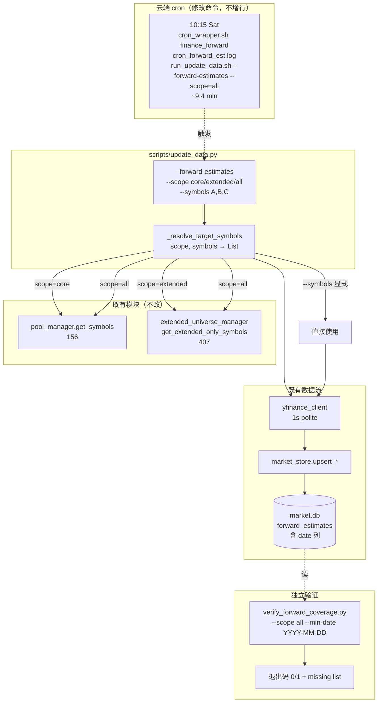
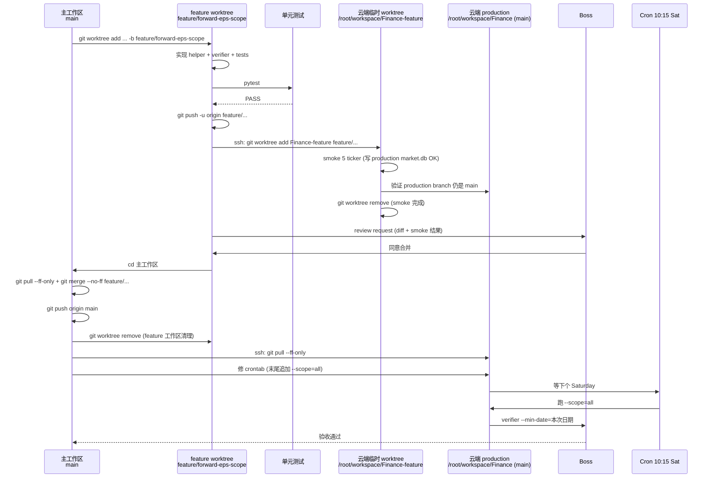

# Forward EPS 扩展池覆盖 Implementation Plan (v4 — codex round-3 applied)

> **For agentic workers:** REQUIRED SUB-SKILL: Use superpowers:subagent-driven-development (recommended) or superpowers:executing-plans to implement this plan task-by-task. Steps use checkbox (`- [ ]`) syntax for tracking.

**Goal:** 把 `forward_estimates` / `forward_metadata` 表覆盖从核心池 156 只扩展到完整可投资 universe（核心 ∪ 扩展池差集 = 563 只 unique），让 CIO-B 在 FMP $10B+ 全集上做相对估值比较。

**Architecture:** 给 `scripts/update_data.py` 现有 `--forward-estimates` flag 增加 `--scope` 参数（`core` / `extended` / `all`，default=`core`）；symbol 路由抽到独立 helper `_resolve_target_symbols()` 便于单测。云端 cron 复用现有 10:15 Sat 任务行，**仅在命令末尾追加 `--scope=all`**（不新增 cron 行 → 锁竞争归零）。开发流程严守：feature worktree 只做实现/测试，合并/推送在主工作区执行；云端 smoke 在临时 worktree 跑，production 目录始终保持 main。

**Tech Stack:** Python 3.10（云端约束）+ yfinance + sqlite3 + 既有 `yfinance_client` / `market_store` 模块；测试 pytest。

---

## Codex Review Disposition

### v1 → v2 处理（已闭环）

| Review item | Severity | 处理 |
|-------------|----------|------|
| 直接 `git push origin main` 违反 worktree 纪律 | P1 | Task 0 + Task 5 全流程 worktree |
| 单测 patch 目标错误（函数内 import） | P1 | Task 1 抽 `_resolve_target_symbols()` helper，单测 helper |
| cron 缺共享锁 | P1 | Task 6 合并为单 cron `--scope=all`，不新增行 |
| `health_check` 不检查 forward_estimates 覆盖 | P2 | Task 2 独立 verifier 取代 |
| scope 数字口径错（重叠 126，extended_only=407） | P2 | scope 重新定义：core=156 / extended=407(only) / all=563 |
| 本地 dry-run 写 `market.db` | minor | smoke 全部移到云端 |
| Task 4 `git add Finance/CLAUDE.md` 路径 + 缺 push | minor | 改成 `CLAUDE.md`；push 集中到 Task 5 |

### v2 → v3 处理（已闭环）

| Review item | Severity | 处理 |
|-------------|----------|------|
| Feature worktree 内 `git checkout main` 会失败 | P1 | Task 5 改为回主工作区合并 |
| 云端在 production 目录 checkout feature 会污染 cron | P1 | Task 3 改用云端临时 worktree `/root/workspace/Finance-feature` |
| Verifier `SELECT DISTINCT symbol` 不区分新旧数据 | P2 | Task 2 verifier 加 `--min-date` 参数 |
| Cron 日志文件名不匹配现状 | P2 | 全文统一 `cron_forward_est.log` |

### v3 → v4 处理（codex round-3 反馈）

| Review item | Severity | 处理 |
|-------------|----------|------|
| 临时 worktree 不会自动共享 production `data/` 和 `.env`（`/data/*` 第 23 行 + `.env` 第 43 行均 gitignored，git worktree 不复制；smoke 会读不到 `data/pool/extended_universe.json`、`load_dotenv` 找不到 `.env`、write 落到 worktree 内的空 `data/market.db`） | P1 | Task 3 在 worktree 创建后显式 `ln -s /root/workspace/Finance/data data` + `ln -s /root/workspace/Finance/.env .env`，并在 `git worktree remove` 之前先 `rm` 这两个 symlink |
| 云端无 `sqlite3` CLI（实测 `command not found`），但 python3 3.37.2 内置 `sqlite3` module 可用 | P2 | Task 3 Step 验证 DB 写入改用 `python3 -c` inline 查询，不再 ssh `sqlite3 ...` |

### v4 → v4 (post-implementation cleanup) 处理 — Task 1 / Task 2 code-quality review 反馈

| Review item | Severity | 处理 |
|-------------|----------|------|
| Task 1 helper docstring 承诺"List of unique uppercase symbols"，但 `core` / `extended` 分支只是转发上游列表，没有去重也没有大写化；只有 `all` 分支真去重 | Important | Task 1 Step 3 docstring 收紧：明确只有 `scope='all'` 去重 + 排序，其他分支按上游原样返回；并补充说明 explicit `symbols` 路径绕过 scope 校验 |
| Task 1 `test_scope_core_uses_pool` / `test_scope_extended_uses_extended_only` 用 `set(result) == {...}` 比对，会忽略顺序与重复，测不到 docstring "preserve source order" 的承诺 | Important | Task 1 Step 1 把这两条断言改成精确列表比对 `result == [...]`，跟 `test_scope_all` 的 `result == sorted({...})` 对齐严格度 |
| Task 2 verifier 用 `sqlite3.connect(db_path)` 默认读写模式；`market.db` 是 P3 cron-writer 独占资源，verifier 是只读消费者，应跟 `morning_report.py:410` 项目惯例一致用 `?mode=ro` URI 防误写 | Important | Task 2 Step 4 verifier 的 `_covered_symbols` 改为 `sqlite3.connect(f"file:{db_path}?mode=ro", uri=True)` |
| Task 2 `--min-date` 没格式校验；malformed 字符串如 `"2026-13-01"` 会按文本比对静默匹配零行，verifier 整个反 stale 安全网失效 | Important | Task 2 Step 4 加 `_valid_iso_date(s)` argparse type；invalid 输入触发 `argparse.ArgumentTypeError` 退出码 2 |
| Task 3 Step 4 假设 worktree 内 `data/` 不存在，但 `.gitignore` line 24-27 反 ignore 了 `data/breadth_buy_quality/.gitkeep`，`git worktree add` 自动建出该目录；直接 `ln -s` 嵌套到已存在 `data/` 里变成 `data/data → Finance/data` 而不是替代 | P1 (实战发现) | Step 4 增加 `rm -rf data` 前置；Step 11 增加 `git checkout HEAD -- data/` 还原 tracked `.gitkeep` 后再 `git worktree remove`，避免 dirty working tree |
| Task 3 实战验证：smoke 5 ticker (A/ABEV/ABNB/ACGL/ADM) 全部 `4 periods` 写入；core baseline 155/156（缺 SOXX，ETF 无 forward estimates）；extended_only 实际数 416 (plan 估 ~407，extended pool 自然增长) | 信息 | 不需修改 plan，记录用 |
| Task 2 `_bucket_report` 在 `expected_set` 为空时返回 `pct=100.0, ok=True`，导致 `data/pool/universe.json` 缺失 / symlink 断了 / 上游 loader bug 时 verifier 静默通过 `0/0 OK`，整个安全网失效（Boss merge review 抓到，confidence 0.95） | P2 | Task 2 Step 4 `_bucket_report` empty-expected 分支返回 `ok=False, pct=0.0`；新增 `test_empty_expected_fails_fast` 单测覆盖 |

### 关键事实补充（v4 verified 2026-05-07）

| 事实 | 值 |
|------|----|
| 云端 sqlite3 CLI | **不存在**（必须走 python3 inline）|
| 云端 python3 sqlite3 module | 3.37.2，可用 |
| `.gitignore` 中 `/data/*` 行号 | 23 |
| `.gitignore` 中 `.env` 行号 | 43 |
| `config/settings.py:12` | `load_dotenv(PROJECT_ROOT / ".env")` —— PROJECT_ROOT 为当前 worktree 根 |
| Production data 目录 size | `market.db` ~793 MB（不可 copy，必须 symlink） |
| smoke 是否需要 API key | **不需要**（yfinance 不要 key）；但 `.env` symlink 仍做，避免 settings 加载边界 case |

---

## 关键事实（已 verified 2026-05-07）

| 事实 | 值 | 用途 |
|------|----|------|
| 核心池大小 | 156 | scope=core 目标数 |
| 扩展池总数 | 533 | 仅参考 |
| extended_only 差集 | 407 | scope=extended 目标数 |
| core ∪ extended_only | 563 | scope=all 目标数 |
| forward_estimates schema 时间列 | `date` (TEXT, PK 含 date, 已索引 idx_fe_date) | verifier `--min-date` 过滤 |
| 云端 cron 当前命令 | `cron_wrapper.sh finance_forward cron_forward_est.log run_update_data.sh --forward-estimates` | Task 6 仅末尾追加 ` --scope=all` |
| 云端 git 版本 | 2.34.1，支持 `git worktree add` | Task 3 临时 worktree smoke |
| `flock -n` 行为 | non-blocking，同 JOB_NAME 第二任务 SKIP | 不能简单错峰错开两个 cron |

---

## 北极星对齐

实现**数据层 forward-looking 数据广度扩展**，对应 `docs/design/north-star.md`：
- **第一层（数据层）**：forward estimates 覆盖从 OPRMS 工作集 156 → 全可投资 universe 563
- **第三层（CIO-B 副轨支撑）**：CIO-B 在更广池子里做 forward P/E、增长率、revision momentum 比较

不在范围内：S&P 500 / Nasdaq 100 成分股表、forward EPS 历史回填、broad universe 全集（2782）、把 forward_estimates 检查并入 `data_health.py`。

---

## 文件结构

| 文件 | 改动 |
|------|------|
| `scripts/update_data.py` | 加 helper + `--scope` 参数 + forward_estimates 分支调用 helper |
| `tests/test_update_data_scope.py` | 新建，4 用例覆盖 scope 路由 |
| `scripts/verify_forward_coverage.py` | 新建，按 scope + 时间窗双过滤 |
| `tests/test_verify_forward_coverage.py` | 新建，4 用例（含 `--min-date` 过滤） |
| `ARCHITECTURE.md` | cron 表 + forward_estimates 表 stale 注释 |
| `CLAUDE.md`（Finance 工作区根） | Data Desk 速查 yfinance 行 |
| 云端 crontab | 现有 10:15 Sat 行末尾追加 ` --scope=all`（不新增行）|

---

## 架构图



## 业务流程图（开发到部署全链）



---

## 替代方案对比

### 方案 1：CLI scope 接口

| 方案 | 优 | 劣 | 选 |
|------|----|----|----|
| **A：`--scope=core/extended/all`** | 接口统一；helper 单测干净 | 现有 cron 显式追加 `--scope=all` | ✅ |
| B：新 flag `--extended-forward-estimates` | 老命令零改 | 标志爆炸 | ❌ |
| C：默认跑 union | 一行修改 | 破坏向后兼容 | ❌ |

### 方案 2：cron 部署（解决 P1 锁问题）

| 方案 | 优 | 劣 | 选 |
|------|----|----|----|
| D：新增 10:30 cron | 监控粒度细 | flock -n 让第二任务 SKIP；并发写 DB | ❌ |
| E：双 cron 共享 JOB_NAME | 互斥 | flock -n SKIP 而非排队，丢一周数据 | ❌ |
| **F：合并单 cron `--scope=all`** | 串行无锁竞争；不新增行 | 失败粒度损失（用 verifier 分桶补回） | ✅ |

### 方案 3：覆盖率验证

| 方案 | 优 | 劣 | 选 |
|------|----|----|----|
| G：扩 data_health.py | 一站式 | 改公共组件 | ❌ |
| **H：独立 verifier + --min-date** | 关注分离；时间窗过滤排除旧数据 | 多一个脚本 | ✅ |
| I：临时 SQL | 零代码 | 不可重复；旧数据误判 | ❌ |

### 方案 4：云端 smoke 隔离

| 方案 | 优 | 劣 | 选 |
|------|----|----|----|
| J：production 目录 checkout feature | 简单 | review 期间 cron 在 feature 上跑 | ❌ |
| **K：临时 worktree `/root/workspace/Finance-feature`** | production 目录始终 main；smoke 用同一 market.db 不用搬数据 | 多一个清理步骤 | ✅ |
| L：临时 clone 全新 repo | 完全隔离 | 配置 .env / market.db 路径复杂 | ❌ |

### 方案 5：合并到 main

| 方案 | 优 | 劣 | 选 |
|------|----|----|----|
| M：feature worktree 内 checkout main + merge | 单一目录操作 | **会失败**：main 已被主工作区占用 | ❌ |
| **N：回主工作区合并** | 符合 git worktree 模型；feature worktree 只做实现 | 需要 cd 切换 | ✅ |

---

## 风险自证

**风险 1：yfinance 长尾返回空 / stale**
- 缓解：现有 try/except 捕获并 failed list；verifier missing list 监控；超 5%（28 只）容忍线起 issue
- 不做：单 ticker retry——下周 cron 再补

**风险 2：yfinance rate limit**
- 缓解：1s/ticker polite delay；总 ~9.4 min 在维护窗口；遇 429 起 issue
- 不做：batch API（yfinance 不支持）

**风险 3：market.db 退池标的残留 + verifier 旧数据误判**
- 缓解：本 plan 不做 stale cleanup（研究保留 history）；verifier 用 `--min-date` 过滤本次刷新时间窗，不被旧 row 蒙混过关
- 文档化：ARCHITECTURE.md 注明 stale 策略

**风险 4：合并 cron 后失败粒度损失**
- 缓解：verifier 按 core / extended_only / all 分桶报覆盖率定位
- 未来：失败模式频繁再考虑改 `flock` 为 blocking + 拆 cron

**风险 5：云端 review 期间 production 误用 feature 分支**
- 缓解：smoke 用临时 worktree `/root/workspace/Finance-feature`，**所有 smoke 命令 cd 到该路径**；production `/root/workspace/Finance` 全程保持 main；smoke 完成立即 `git worktree remove`
- 验证：Task 3 显式 `git -C /root/workspace/Finance branch --show-current` 验证 main

**风险 6：worktree 误操作**
- 缓解：feature worktree 不允许 checkout main（git 会报错）；合并步骤明确 `cd` 到主工作区；worktree skill 创建时记录主工作区路径
- 不做：用 `git stash` 等技巧绕过——硬约束直接遵守

**为什么不简单做**：所有"简单"做法（直接 push main / production checkout feature / verifier 不带时间过滤）都被 codex 两轮指出问题；接受复杂性是正确决策。

---

## 验收标准

1. **接口验证**：`python scripts/update_data.py --forward-estimates --help` 显示 `--scope` 选项；不带 `--scope` 默认 `core`
2. **Helper 测试**：`pytest tests/test_update_data_scope.py -v` 全 PASS
3. **Verifier 测试**：`pytest tests/test_verify_forward_coverage.py -v` 全 PASS（含 `--min-date` 过滤用例）
4. **数据验证（本次刷新窗口内）**：`python scripts/verify_forward_coverage.py --scope all --min-date <本次cron当天>` 退出码 0；core ≥ 99%；extended ≥ 95%
5. **覆盖断言**：`SELECT COUNT(DISTINCT symbol) FROM forward_estimates WHERE date >= '<本次cron日期>'` ≥ 540
6. **云端运行**：连续两个 Saturday 10:15 任务 OK，日志在 `/root/workspace/Finance/logs/cron_forward_est.log` 出现 `OK duration=...s`，无 telegram alert
7. **既有 health_check 不退化**：无新 FAIL
8. **文档**：ARCHITECTURE.md cron 表 + Data Desk 速查 + stale 注释三处更新
9. **流程合规**：feature 分支单测 PASS → 云端 worktree smoke OK → Boss 审核 → 主工作区合并 → 云端 main pull → cron 修改；production `/root/workspace/Finance` 全程在 main

---

## Tasks

### Task 0: 创建 worktree + feature 分支

**Files:** 仅环境

- [ ] **Step 1: 调用 superpowers:using-git-worktrees skill 创建 worktree**

按 skill 创建 feature worktree（建议路径 `~/CC worktrees/finance-forward-eps-scope`），分支 `feature/forward-eps-scope`。**记下主工作区路径**：`/Users/owen/CC workspace/Finance`。

- [ ] **Step 2: 验证 worktree 状态**

Run（在 feature worktree 目录）:
```bash
git status
git branch --show-current
git worktree list
```
Expected:
- branch = `feature/forward-eps-scope`
- worktree list 显示主工作区在 `main`，feature 在 `feature/forward-eps-scope`

- [ ] **Step 3: 验证 .venv 路径**

```bash
ls -la /Users/owen/CC\ workspace/Finance/.venv/bin/python
```
Expected: 文件存在。**所有 python 命令必须用绝对路径** `/Users/owen/CC workspace/Finance/.venv/bin/python`（worktree .venv 不共享）。

---

### Task 1: 抽 `_resolve_target_symbols()` helper + `--scope`

**Files:**
- Modify: `scripts/update_data.py`
- Create: `tests/test_update_data_scope.py`

- [ ] **Step 1: 写失败的单元测试**

`tests/test_update_data_scope.py`：

```python
"""Test _resolve_target_symbols helper for --forward-estimates scope routing."""
from unittest.mock import patch
import pytest


@patch("src.data.extended_universe_manager.get_extended_only_symbols")
@patch("src.data.pool_manager.get_symbols")
def test_explicit_symbols_bypass_scope(mock_pool, mock_ext):
    from scripts.update_data import _resolve_target_symbols
    result = _resolve_target_symbols(scope="extended", symbols=["AAPL", "MSFT"])
    assert result == ["AAPL", "MSFT"]
    assert not mock_pool.called
    assert not mock_ext.called


@patch("src.data.extended_universe_manager.get_extended_only_symbols")
@patch("src.data.pool_manager.get_symbols")
def test_scope_core_uses_pool(mock_pool, mock_ext):
    from scripts.update_data import _resolve_target_symbols
    mock_pool.return_value = ["AAPL", "NVDA"]
    result = _resolve_target_symbols(scope="core", symbols=None)
    assert result == ["AAPL", "NVDA"]
    assert mock_pool.called
    assert not mock_ext.called


@patch("src.data.extended_universe_manager.get_extended_only_symbols")
@patch("src.data.pool_manager.get_symbols")
def test_scope_extended_uses_extended_only(mock_pool, mock_ext):
    from scripts.update_data import _resolve_target_symbols
    mock_ext.return_value = ["EXT1", "EXT2", "EXT3"]
    result = _resolve_target_symbols(scope="extended", symbols=None)
    assert result == ["EXT1", "EXT2", "EXT3"]
    assert not mock_pool.called
    assert mock_ext.called


@patch("src.data.extended_universe_manager.get_extended_only_symbols")
@patch("src.data.pool_manager.get_symbols")
def test_scope_all_returns_union_no_duplicates(mock_pool, mock_ext):
    from scripts.update_data import _resolve_target_symbols
    mock_pool.return_value = ["AAPL", "NVDA", "SHARED"]
    mock_ext.return_value = ["SHARED", "EXT1", "EXT2"]
    result = _resolve_target_symbols(scope="all", symbols=None)
    assert result == sorted({"AAPL", "NVDA", "SHARED", "EXT1", "EXT2"})


def test_invalid_scope_raises():
    from scripts.update_data import _resolve_target_symbols
    with pytest.raises(ValueError, match="scope"):
        _resolve_target_symbols(scope="garbage", symbols=None)
```

- [ ] **Step 2: 跑测试确认失败**

```bash
cd "<feature worktree path>"
/Users/owen/CC\ workspace/Finance/.venv/bin/python -m pytest tests/test_update_data_scope.py -v
```
Expected: 5 FAIL with `ImportError`

- [ ] **Step 3: 添加 helper 到 `scripts/update_data.py`**

在所有顶部 import 之后（`from config.settings import ...` 之后）插入：

```python
def _resolve_target_symbols(scope: str, symbols):
    """Resolve target symbols for --forward-estimates based on scope.

    Args:
        scope: "core" / "extended" / "all"
        symbols: explicit symbol list (overrides scope) or None/empty

    Returns:
        List of symbols. scope='all' returns deduped + sorted union; 'core' /
        'extended' return the source list as-is (no dedup or normalization);
        explicit ``symbols`` arg is returned as a shallow copy unchanged.

    Raises:
        ValueError: scope not in {"core","extended","all"} when symbols is empty
            (validation is bypassed when explicit symbols are supplied).
    """
    if symbols:
        return list(symbols)

    if scope == "core":
        from src.data.pool_manager import get_symbols
        return get_symbols()

    if scope == "extended":
        from src.data.extended_universe_manager import get_extended_only_symbols
        return get_extended_only_symbols()

    if scope == "all":
        from src.data.pool_manager import get_symbols
        from src.data.extended_universe_manager import get_extended_only_symbols
        return sorted(set(get_symbols()) | set(get_extended_only_symbols()))

    raise ValueError(f"unknown scope={scope!r} (expected core/extended/all)")
```

- [ ] **Step 4: 加 `--scope` argparse 参数**

argparse 区域（`--check` 之前）：

```python
    parser.add_argument(
        "--scope",
        choices=["core", "extended", "all"],
        default="core",
        help="Symbol scope for --forward-estimates: core=pool 156 (default), "
             "extended=$10B+ ex-pool ~407, all=union ~563",
    )
```

- [ ] **Step 5: 改 forward_estimates 分支用 helper**

把现有 `target_symbols = symbols or get_symbols()` 改为：

```python
        target_symbols = _resolve_target_symbols(args.scope, symbols)
        print(f"Scope: {args.scope}, target {len(target_symbols)} symbols")
```

- [ ] **Step 6: 跑测试确认 PASS**

```bash
/Users/owen/CC\ workspace/Finance/.venv/bin/python -m pytest tests/test_update_data_scope.py -v
```
Expected: 5 PASS

- [ ] **Step 7: 跑既有测试不退化**

```bash
/Users/owen/CC\ workspace/Finance/.venv/bin/python -m pytest tests/ -k "update_data or pool_manager" -v
```
Expected: 全 PASS

- [ ] **Step 8: Commit (feature 分支)**

```bash
git add scripts/update_data.py tests/test_update_data_scope.py
git commit -m "feat(data): add --scope param + helper for forward-estimates routing

Routes --forward-estimates to pool_manager (core, default), extended_universe_manager
(extended_only, ~407), or sorted union (all, ~563). Default=core preserves backward
compat. Routing extracted into testable _resolve_target_symbols() helper."
```

---

### Task 2: 写 `verify_forward_coverage.py` + 单测（带 `--min-date` 时间窗）

**Files:**
- Create: `scripts/verify_forward_coverage.py`
- Create: `tests/test_verify_forward_coverage.py`

- [ ] **Step 1: 写失败的单测**

`tests/test_verify_forward_coverage.py`：

```python
"""Tests for forward_estimates coverage verifier (with --min-date filter)."""
import sqlite3
import pytest


@pytest.fixture
def temp_db(tmp_path):
    """Minimal market.db with forward_estimates schema (含 date 列)."""
    db = tmp_path / "market.db"
    con = sqlite3.connect(db)
    con.execute("""
        CREATE TABLE forward_estimates (
            symbol TEXT NOT NULL,
            date TEXT NOT NULL,
            period TEXT NOT NULL,
            eps_avg REAL,
            PRIMARY KEY (symbol, date, period)
        )
    """)
    con.commit()
    return db, con


def _patch_loaders(monkeypatch, db, pool, ext):
    monkeypatch.setattr("scripts.verify_forward_coverage.MARKET_DB", db)
    monkeypatch.setattr("scripts.verify_forward_coverage.get_pool_symbols", lambda: pool)
    monkeypatch.setattr("scripts.verify_forward_coverage.get_extended_only_symbols", lambda: ext)


def test_full_coverage_within_date_window(temp_db, monkeypatch):
    db, con = temp_db
    for sym in ["AAPL", "NVDA", "EXT1", "EXT2"]:
        con.execute("INSERT INTO forward_estimates VALUES (?, '2026-05-09', '0y', 1.0)", (sym,))
    con.commit()
    _patch_loaders(monkeypatch, db, ["AAPL", "NVDA"], ["EXT1", "EXT2"])

    from scripts.verify_forward_coverage import run
    rc, report = run(scope="all", min_core_pct=99, min_extended_pct=95, min_date="2026-05-01")
    assert rc == 0
    assert report["core"]["covered"] == 2
    assert report["extended"]["covered"] == 2


def test_old_data_excluded_by_min_date(temp_db, monkeypatch):
    """旧 row 不应被算作覆盖（防止 stale 误判）。"""
    db, con = temp_db
    # 旧数据
    con.execute("INSERT INTO forward_estimates VALUES ('AAPL', '2026-03-01', '0y', 1.0)")
    con.execute("INSERT INTO forward_estimates VALUES ('NVDA', '2026-03-01', '0y', 1.0)")
    # 本次只有 AAPL
    con.execute("INSERT INTO forward_estimates VALUES ('AAPL', '2026-05-09', '0y', 1.0)")
    con.commit()
    _patch_loaders(monkeypatch, db, ["AAPL", "NVDA"], [])

    from scripts.verify_forward_coverage import run
    rc, report = run(scope="core", min_core_pct=99, min_extended_pct=95, min_date="2026-05-01")
    assert rc == 1  # NVDA 在窗口内缺失
    assert "NVDA" in report["core"]["missing"]


def test_no_min_date_counts_all(temp_db, monkeypatch):
    """min_date=None 时不过滤时间，回退到全表 distinct（兼容场景）。"""
    db, con = temp_db
    con.execute("INSERT INTO forward_estimates VALUES ('AAPL', '2026-03-01', '0y', 1.0)")
    con.execute("INSERT INTO forward_estimates VALUES ('NVDA', '2026-03-01', '0y', 1.0)")
    con.commit()
    _patch_loaders(monkeypatch, db, ["AAPL", "NVDA"], [])

    from scripts.verify_forward_coverage import run
    rc, report = run(scope="core", min_core_pct=99, min_extended_pct=95, min_date=None)
    assert rc == 0


def test_scope_core_skips_extended(temp_db, monkeypatch):
    db, con = temp_db
    con.execute("INSERT INTO forward_estimates VALUES ('AAPL', '2026-05-09', '0y', 1.0)")
    con.execute("INSERT INTO forward_estimates VALUES ('NVDA', '2026-05-09', '0y', 1.0)")
    con.commit()
    _patch_loaders(monkeypatch, db, ["AAPL", "NVDA"], ["EXT1"])

    from scripts.verify_forward_coverage import run
    rc, report = run(scope="core", min_core_pct=99, min_extended_pct=95, min_date="2026-05-01")
    assert rc == 0
    assert "extended" not in report
```

- [ ] **Step 2: 跑测试确认失败**

```bash
/Users/owen/CC\ workspace/Finance/.venv/bin/python -m pytest tests/test_verify_forward_coverage.py -v
```
Expected: 4 FAIL with import error

- [ ] **Step 3: 写 verifier 实现**

`scripts/verify_forward_coverage.py`：

```python
"""Verify forward_estimates coverage in market.db (with optional date window).

Usage:
    python scripts/verify_forward_coverage.py --scope all --min-date 2026-05-09
    python scripts/verify_forward_coverage.py --scope core --min-core-pct 99

Exit 0 if all checked scopes meet thresholds, 1 otherwise.
--min-date filters out rows with date < min_date so stale rows don't mask
the verification of the most recent cron run.
"""
import argparse
import datetime
import sqlite3
import sys
from pathlib import Path

PROJECT_ROOT = Path(__file__).parent.parent
sys.path.insert(0, str(PROJECT_ROOT))

# settings.py 里实际的 market.db path 常量名按既有命名（grep 验证）
from config.settings import MARKET_DB_PATH as MARKET_DB  # noqa: E402
from src.data.pool_manager import get_symbols as get_pool_symbols  # noqa: E402
from src.data.extended_universe_manager import get_extended_only_symbols  # noqa: E402


def _valid_iso_date(s: str) -> str:
    """argparse type for --min-date: ensure ISO YYYY-MM-DD."""
    try:
        datetime.date.fromisoformat(s)
    except ValueError:
        raise argparse.ArgumentTypeError(
            f"--min-date must be ISO YYYY-MM-DD, got {s!r}"
        )
    return s


def _covered_symbols(db_path, min_date) -> set:
    con = sqlite3.connect(f"file:{db_path}?mode=ro", uri=True)
    try:
        if min_date:
            rows = con.execute(
                "SELECT DISTINCT symbol FROM forward_estimates WHERE date >= ?",
                (min_date,),
            ).fetchall()
        else:
            rows = con.execute(
                "SELECT DISTINCT symbol FROM forward_estimates"
            ).fetchall()
    finally:
        con.close()
    return {r[0] for r in rows}


def _bucket_report(name: str, expected: list, covered: set, min_pct: float) -> dict:
    expected_set = set(expected)
    if not expected_set:
        # Empty expected universe = loader returned nothing = data path / symlink /
        # pool file is broken. Fail fast rather than silently reporting "0/0 OK".
        return {
            "name": name,
            "expected": 0,
            "covered": 0,
            "pct": 0.0,
            "min_pct": min_pct,
            "ok": False,
            "missing": [],
        }
    hit = expected_set & covered
    miss = sorted(expected_set - covered)
    pct = len(hit) / len(expected_set) * 100
    return {
        "name": name,
        "expected": len(expected_set),
        "covered": len(hit),
        "pct": round(pct, 2),
        "min_pct": min_pct,
        "ok": pct >= min_pct,
        "missing": miss,
    }


def run(scope: str, min_core_pct: float, min_extended_pct: float,
        min_date) -> tuple:
    """Run verification. Returns (exit_code, report)."""
    covered = _covered_symbols(MARKET_DB, min_date)
    report = {}
    if scope in ("core", "all"):
        report["core"] = _bucket_report("core", get_pool_symbols(), covered, min_core_pct)
    if scope in ("extended", "all"):
        report["extended"] = _bucket_report(
            "extended", get_extended_only_symbols(), covered, min_extended_pct
        )
    rc = 0 if all(b["ok"] for b in report.values()) else 1
    return rc, report


def _print_report(report: dict, min_date) -> None:
    if min_date:
        print(f"Coverage filter: date >= {min_date}")
    for name, b in report.items():
        marker = "OK" if b["ok"] else "FAIL"
        print(f"[{marker}] {name}: {b['covered']}/{b['expected']} "
              f"({b['pct']}%, threshold {b['min_pct']}%)")
        if b["missing"]:
            print(f"   missing (top 20): {b['missing'][:20]}")
            if len(b["missing"]) > 20:
                print(f"   ... and {len(b['missing']) - 20} more")


def main():
    parser = argparse.ArgumentParser()
    parser.add_argument("--scope", choices=["core", "extended", "all"], default="all")
    parser.add_argument("--min-core-pct", type=float, default=99.0)
    parser.add_argument("--min-extended-pct", type=float, default=95.0)
    parser.add_argument(
        "--min-date",
        type=_valid_iso_date,
        default=None,
        help="ISO date (YYYY-MM-DD); only rows with date>=this count as covered. "
             "Without it, all-time data counts (旧数据可能误判为通过)。"
    )
    args = parser.parse_args()
    rc, report = run(args.scope, args.min_core_pct, args.min_extended_pct, args.min_date)
    _print_report(report, args.min_date)
    sys.exit(rc)


if __name__ == "__main__":
    main()
```

- [ ] **Step 4: 验证 settings.py 的 MARKET_DB 常量名**

```bash
cd "<feature worktree>"
grep -n "MARKET_DB" config/settings.py | head -5
```
Expected: 看到 `MARKET_DB_PATH = ...` 之类。如果常量名不同，调整 verifier 顶部 import。

- [ ] **Step 5: 跑测试确认 PASS**

```bash
/Users/owen/CC\ workspace/Finance/.venv/bin/python -m pytest tests/test_verify_forward_coverage.py -v
```
Expected: 4 PASS

- [ ] **Step 6: Commit**

```bash
git add scripts/verify_forward_coverage.py tests/test_verify_forward_coverage.py
git commit -m "feat(data): add forward_estimates coverage verifier with date-window filter

Verifier reports core / extended_only coverage in market.db, scoped (core/extended/all),
threshold-driven. --min-date filter prevents stale rows from masking failed cron runs
(plan keeps stale cleanup off, so date filter is required for honest verification)."
```

---

### Task 3: 云端临时 worktree smoke test

**Files:** 无代码改动；运行时创建 / 清理两个 symlink

**Why 云端临时 worktree**：production `/root/workspace/Finance` 跑着各种 cron（daily 06:25 git pull / 06:30 数据更新 / 22:00 PI 推送等）。如果 production 目录 checkout 到 feature 分支，review 等待期间任何 cron 触发都会跑 feature 代码。临时 worktree `/root/workspace/Finance-feature` 与 production 隔离。

**关键限制（v4 修正）**：git worktree **不会**复制 gitignored 文件——`/data/*` 和 `.env` 都被 ignore。新建 worktree 里 `data/` 不存在，`config/settings.py:12` 的 `load_dotenv(PROJECT_ROOT / ".env")` 会找不到 .env，`MARKET_DB_PATH` 会指向 worktree 内不存在的路径。**必须显式 symlink** 这两个目录到 production 副本，smoke 才能读到 `extended_universe.json` 并写到正确的 production market.db。

**关于写 production market.db**：5 ticker 的 forward estimates 是有意写入 production——这是 smoke 验证的目标（端到端），同时也是 yfinance 真实数据无副作用。

- [ ] **Step 1: push feature 分支到 origin**

Run（feature worktree 内）:
```bash
git push -u origin feature/forward-eps-scope
```

- [ ] **Step 2: 云端创建临时 worktree**

```bash
ssh aliyun "cd /root/workspace/Finance && git fetch origin && git worktree add /root/workspace/Finance-feature feature/forward-eps-scope"
ssh aliyun "git -C /root/workspace/Finance-feature log -1 --oneline"
ssh aliyun "git -C /root/workspace/Finance-feature branch --show-current"
ssh aliyun "git -C /root/workspace/Finance worktree list"
```
Expected:
- log 输出最新 feature commit
- branch 显示 `feature/forward-eps-scope`
- worktree list 显示两个 worktree（main + feature）

- [ ] **Step 3: 验证 production 目录仍在 main**

```bash
ssh aliyun "git -C /root/workspace/Finance branch --show-current"
ssh aliyun "git -C /root/workspace/Finance status --short"
```
Expected: branch=`main`，working tree clean。**这步必须确认 main**，否则停止后续操作。

- [ ] **Step 4: 创建 symlink 让 worktree 共享 production data + .env**

> **⚠ Plan v4 实战修正 (2026-05-08)**：worktree 不是完全空的——`.gitignore` line 24-27 反 ignore 了 `data/breadth_buy_quality/.gitkeep`（tracked file），所以 `git worktree add` 会自动建出 `data/breadth_buy_quality/.gitkeep`。直接 `ln -s /root/workspace/Finance/data /root/workspace/Finance-feature/data` 会把 symlink **嵌套**进已存在的 `data/` 里（变成 `data/data -> Finance/data`），不是替代。**正确做法是先 `rm -rf data/`** 再 `ln -s`。`.env` 不受影响（无反 ignore，worktree 里确实不存在）。

```bash
ssh aliyun "ls /root/workspace/Finance-feature/data /root/workspace/Finance-feature/.env 2>&1 | head -5"
```
Expected: `data/` 已存在（含 tracked `breadth_buy_quality/.gitkeep`）；`.env` 不存在

```bash
# 必须先 rm 才能正确 symlink（v4 修正）
ssh aliyun "rm -rf /root/workspace/Finance-feature/data"
ssh aliyun "ln -s /root/workspace/Finance/data /root/workspace/Finance-feature/data"
ssh aliyun "ln -s /root/workspace/Finance/.env /root/workspace/Finance-feature/.env"
ssh aliyun "ls -la /root/workspace/Finance-feature/data /root/workspace/Finance-feature/.env"
```
Expected: 两条 symlink 都建立，`->` 指向 production 路径

```bash
ssh aliyun "ls /root/workspace/Finance-feature/data/pool/extended_universe.json"
ssh aliyun "ls -la /root/workspace/Finance-feature/data/market.db | awk '{print \$5,\$9}'"
```
Expected:
- extended_universe.json 可见（说明 symlink 工作）
- market.db ~793 MB（确认是 production 文件）

- [ ] **Step 5: 云端 worktree 跑 verifier 看基线**

```bash
ssh aliyun "cd /root/workspace/Finance-feature && python3 scripts/verify_forward_coverage.py --scope all --min-date 2026-04-01" || true
```
Expected:
- core ≥ 99%（既有 155/156 在 2026-03-09+ 都有数据）
- extended 大量缺失（基线状态符合预期）
- 退出码 1（extended 不达标）—— **基线对，证明 verifier + symlink 都工作**

- [ ] **Step 6: 选 5 个扩展池 symbol**

```bash
ssh aliyun "cd /root/workspace/Finance-feature && python3 -c '
from src.data.extended_universe_manager import get_extended_only_symbols
print(\",\".join(get_extended_only_symbols()[:5]))
'"
```
记下输出的 5 ticker（下文用 `<S1>,<S2>,<S3>,<S4>,<S5>` 代指）。

- [ ] **Step 7: 跑 smoke**

```bash
ssh aliyun "cd /root/workspace/Finance-feature && python3 scripts/update_data.py --forward-estimates --symbols=<S1>,<S2>,<S3>,<S4>,<S5>"
```
Expected: 末尾 `✅ 成功: 5`，无报错

- [ ] **Step 8: 验证 DB 写入（python3 inline；云端无 sqlite3 CLI）**

```bash
ssh aliyun "python3 - <<'PY'
import sqlite3
con = sqlite3.connect('/root/workspace/Finance/data/market.db')
syms = ['<S1>', '<S2>', '<S3>', '<S4>', '<S5>']
placeholders = ','.join(['?']*len(syms))
rows = con.execute(
    f'SELECT symbol, date, period, eps_avg FROM forward_estimates '
    f'WHERE symbol IN ({placeholders}) ORDER BY date DESC LIMIT 20',
    syms,
).fetchall()
for r in rows:
    print(r)
print(f'total rows: {len(rows)}')
PY"
```
（实际把 `<S1>...<S5>` 替换成 Step 6 拿到的真实 ticker）
Expected:
- ≥ 10 行（每 symbol 至少 2 个 period）
- 最新 date 是今天
- `total rows: ...`

- [ ] **Step 9: 跑 verifier 锁今日窗口验证 5 ticker 进了**

```bash
ssh aliyun "cd /root/workspace/Finance-feature && python3 scripts/verify_forward_coverage.py --scope core --min-date \$(date +%F)" || true
```
Expected: core 报"今日新写入"覆盖率（应包含 5 ticker 中跟核心池有交集的部分；多数情况是 0，因为 extended_only 跟 core 不交）。重点是 verifier 跑通不报错。

- [ ] **Step 10: 清理 symlink（git worktree remove 不会删 untracked symlink）**

```bash
ssh aliyun "rm /root/workspace/Finance-feature/data /root/workspace/Finance-feature/.env"
ssh aliyun "ls /root/workspace/Finance-feature/data /root/workspace/Finance-feature/.env 2>&1 | head -3"
```
Expected: 两个 symlink 都已删除（`No such file or directory`）

**安全确认**：`rm <symlink>` 只删 symlink 自身，**不会**递归删 production data 目录。验证：
```bash
ssh aliyun "ls -la /root/workspace/Finance/data/market.db | awk '{print \$5,\$9}'"
```
Expected: market.db 仍然 ~793 MB 在 production（没动）

- [ ] **Step 11: 清理云端临时 worktree**

> **⚠ Plan v4 实战修正 (2026-05-08)**：rm `data` symlink 后，worktree 里 tracked `data/breadth_buy_quality/.gitkeep` 缺失，`git status` 报 `D data/breadth_buy_quality/.gitkeep`。`git worktree remove` 不喜欢 dirty working tree，必须先 `git checkout HEAD -- data/` 把 tracked 内容还原（注意：此时 production `data/` 是真实目录，feature worktree `data/` 是空的；checkout 会从 git index 重建该子目录的 tracked 文件——只有 `.gitkeep` 这一个空文件，几 byte，无副作用）。

```bash
# v4 修正：先还原 tracked data/，再 remove
ssh aliyun "git -C /root/workspace/Finance-feature checkout HEAD -- data/"
ssh aliyun "git -C /root/workspace/Finance-feature status --short"
ssh aliyun "git -C /root/workspace/Finance worktree remove /root/workspace/Finance-feature"
ssh aliyun "git -C /root/workspace/Finance worktree list"
```
Expected: status clean；`worktree list` 只剩 production main

- [ ] **Step 12: 再次确认 production 在 main + 数据完整**

```bash
ssh aliyun "git -C /root/workspace/Finance branch --show-current"
ssh aliyun "ls /root/workspace/Finance/data/pool/extended_universe.json /root/workspace/Finance/.env"
ssh aliyun "ls -la /root/workspace/Finance/data/market.db | awk '{print \$5}'"
```
Expected: branch=`main`；data 文件齐全；market.db 仍然 ~793 MB

---

### Task 4: 文档更新（feature 分支内）

**Files:**
- Modify: `ARCHITECTURE.md`
- Modify: `CLAUDE.md`（feature worktree 根目录）

- [ ] **Step 1: 更新 ARCHITECTURE.md cron 表**

把第 190 行（10:15 Sat 行）：

```
| 10:15 | Sat | 前瞻预期更新（`run_update_data.sh --forward-estimates`） |
```

替换为：

```
| 10:15 | Sat | 前瞻预期更新（核心 + 扩展池 ~563 unique，`run_update_data.sh --forward-estimates --scope=all`，~9.4 min，日志 `cron_forward_est.log`） |
```

- [ ] **Step 2: 在 ARCHITECTURE.md 加 forward_estimates stale 注释**

```bash
grep -n "forward_estimates" ARCHITECTURE.md
```

在合适位置（cron 表下方或 known traps）插入：

```markdown
> **forward_estimates 表 stale 策略**：跟随核心 + 扩展池 weekly 刷新；退池标的**不做** stale cleanup——保留 history 作研究材料。覆盖率验证用 `scripts/verify_forward_coverage.py --min-date <本次 cron 日期>`，避免旧 row 误判。
```

- [ ] **Step 3: 更新 Finance/CLAUDE.md Data Desk 速查**

**注意**：在 feature worktree 根目录下文件名是 `CLAUDE.md`（不是 `Finance/CLAUDE.md`）。

```bash
grep -n "yfinance" CLAUDE.md | head
```

把 yfinance 行用途从：
```
Forward estimates (6 datasets) + 扩展池 batch 价格
```
改为：
```
Forward estimates (6 datasets, 核心 + 扩展池 ~563) + 扩展池 batch 价格
```

- [ ] **Step 4: Commit 文档**

```bash
git add ARCHITECTURE.md CLAUDE.md
git commit -m "docs(data): forward-estimates expanded to core+extended (~563)

Updates ARCHITECTURE.md cron table to single 10:15 Sat job covering core+extended
via --scope=all (~9.4 min, log cron_forward_est.log). Notes stale-cleanup policy
and verifier --min-date usage. Updates Data Desk reference in CLAUDE.md."
```

---

### Task 5: Boss 审核 + 主工作区合并 main

**Files:** 无代码改动；流程

**核心约束**：feature worktree **不能** checkout main（会 fail：main 已被主工作区占用）。所有合并操作 cd 到主工作区 `/Users/owen/CC workspace/Finance` 执行。

- [ ] **Step 1: push feature 分支最新 commits**

Run（feature worktree 内）:
```bash
git push origin feature/forward-eps-scope
```

- [ ] **Step 2: 列出本分支变更**

```bash
git log main..HEAD --oneline
git diff main --stat
```
Expected:
- 3 个 commit（Task 1 / Task 2 / Task 4）
- 改动文件：`scripts/update_data.py` / `tests/test_update_data_scope.py` / `scripts/verify_forward_coverage.py` / `tests/test_verify_forward_coverage.py` / `ARCHITECTURE.md` / `CLAUDE.md`

- [ ] **Step 3: 向 Boss 提交 review**

附上：
1. 分支名 + 主工作区路径
2. diff stat
3. 单测结果
4. Task 3 云端 smoke 5 ticker DB 记录
5. 云端 production 已恢复 main 的验证截图

**等待 Boss 审核**。Boss 同意前不进入 Step 4。

- [ ] **Step 4: 主工作区合并 main（仅 Boss 同意后）**

Run:
```bash
cd "/Users/owen/CC workspace/Finance"
git pull --ff-only origin main
git merge --no-ff feature/forward-eps-scope -m "merge: feat(data) forward-estimates scope expansion (#feature/forward-eps-scope)"
git push origin main
git log -3 --oneline
```
Expected:
- 主工作区 fast-forward pull 成功
- merge commit 创建（`--no-ff` 保留分支信息）
- push 成功
- log 显示 merge commit 在 HEAD

- [ ] **Step 5: 清理 feature worktree**

回到主工作区继续：
```bash
git worktree list
git worktree remove "<feature worktree path>"
git branch -d feature/forward-eps-scope  # 已合并，本地 branch 可删
git worktree list
```
Expected: worktree list 只剩主工作区；本地 feature branch 已删（远程 origin 仍保留作历史）

---

### Task 6: 云端 deploy + 修改 cron 命令

**Files:** 云端 crontab（修改现有 10:15 Sat 行）

- [ ] **Step 1: 云端 production pull main**

Run:
```bash
ssh aliyun "cd /root/workspace/Finance && git pull --ff-only origin main && git log -1 --oneline"
ssh aliyun "git -C /root/workspace/Finance branch --show-current"
```
Expected: 最新 commit 是 merge commit；branch=`main`

- [ ] **Step 2: 备份当前 crontab**

```bash
ssh aliyun "crontab -l > /tmp/crontab.bak.\$(date +%Y%m%d_%H%M)"
ssh aliyun "ls -la /tmp/crontab.bak.* | tail -3"
```

- [ ] **Step 3: 看现有 forward 行内容**

```bash
ssh aliyun "crontab -l | grep -n forward"
```
Expected (按 v3 起草时 verified 的实际行)：
```
15 10 * * 6 /root/workspace/Finance/scripts/cron_wrapper.sh finance_forward cron_forward_est.log /root/workspace/Finance/scripts/run_update_data.sh --forward-estimates
```

- [ ] **Step 4: 用 sed 编辑临时文件（不 pipe 到 crontab）**

```bash
ssh aliyun "crontab -l > /tmp/crontab.new"
ssh aliyun "sed -i 's|run_update_data.sh --forward-estimates\$|run_update_data.sh --forward-estimates --scope=all|' /tmp/crontab.new"
```

注意：`\$` 是命令行 escape，传到 sed 是 `$` 表示行尾，确保只匹配末尾的 `--forward-estimates`，不会误改其他位置。

- [ ] **Step 5: diff 验证编辑结果**

```bash
ssh aliyun "diff <(crontab -l) /tmp/crontab.new"
```
Expected: **只有一行**变化，且变化处是末尾追加 ` --scope=all`。如果 diff 看到其他变化或多行变化，**停止**，回看上一步。

- [ ] **Step 6: 应用新 crontab**

```bash
ssh aliyun "crontab /tmp/crontab.new"
ssh aliyun "crontab -l | grep forward"
```
Expected: 看到 `--scope=all` 已生效，整行其他部分未变

- [ ] **Step 7: 不需 commit**（cron 不进 repo）

记到 `.claude/ongoing.md`：「2026-05-XX 云端 cron 已修改，等下个 Saturday 10:15 首跑 `--scope=all`，本次 cron 验收用 verifier `--min-date` 锁定该日期」。

---

### Task 7: 首次 cron 运行后验收（带 `--min-date` 锁本次窗口）

**Files:** 无代码改动

- [ ] **Step 1: 等下个 Saturday 10:15 + 完成（约 ~10 min 后）**

记录预期日期到 `.claude/ongoing.md`，下面统称 `<run_date>`（YYYY-MM-DD）。

- [ ] **Step 2: 检查云端 cron 日志**

```bash
ssh aliyun "tail -150 /root/workspace/Finance/logs/cron_forward_est.log"
```
Expected:
- `BEGIN command=...--forward-estimates --scope=all`
- `Scope: all, target N symbols`，N ≈ 563
- 末尾 `OK duration=...s`（约 500-700s）
- 无 telegram alert

- [ ] **Step 3: 云端跑 verifier，锁本次日期窗口**

```bash
ssh aliyun "cd /root/workspace/Finance && python3 scripts/verify_forward_coverage.py --scope all --min-date <run_date>"
echo "exit code: $?"
```
Expected:
- core 在 `<run_date>` 当天 ≥ 99%
- extended 在 `<run_date>` 当天 ≥ 95%
- 退出码 0

- [ ] **Step 4: 本地 sync pull 后再次验证**

```bash
cd "/Users/owen/CC workspace/Finance"
./sync_to_cloud.sh --pull
/Users/owen/CC\ workspace/Finance/.venv/bin/python scripts/verify_forward_coverage.py --scope all --min-date <run_date>
```
Expected: 退出码 0

- [ ] **Step 5: 逐项打勾验收标准**

回到 plan 文档"验收标准"section，逐项标记。如有不达标项，新增 Task 8 处理。

- [ ] **Step 6: 写 journal 收尾**

调用 `/journal` skill 记录"forward EPS 扩展池覆盖上线"，关联 plan 路径。

---

## Self-Review

按 writing-plans skill 自检 + codex 双轮 review 关闭：

**1. Spec coverage**
- 扩展 forward_estimates 到 563 → Task 1 + Task 6
- worktree 纪律（feature worktree + 主工作区合并）→ Task 0 + Task 5
- 单测 patch 正确（helper 路径）→ Task 1
- 共享锁 / 并发写 → Task 6 单 cron
- 验证不被旧数据骗 → Task 2 `--min-date` + Task 7 锁日期窗
- scope 数字 → 全文统一 156/407/563
- 云端 production 不污染 → Task 3 临时 worktree
- 主工作区合并不冲突 → Task 5 `cd` 切换
- 日志文件名匹配现状 → 全文 `cron_forward_est.log`

**2. Placeholder scan**
- 无 "TBD" / "implement later" / "similar to Task N"
- 所有 step 都有具体命令或代码块

**3. Type consistency**
- helper 名 `_resolve_target_symbols` 跨 Task / 测试 / 调用一致
- scope choices `core/extended/all` 跨 helper / argparse / verifier / 文档全程一致
- `min_date` 参数命名跨 verifier / 测试 / 验收一致
- 日志文件名 `cron_forward_est.log` 跨 Task 4 / Task 6 / Task 7 一致
- JOB_NAME `finance_forward` 不变（不在本 plan 改动范围）

**4. Codex round-2 review 闭环**
- P1 worktree checkout main → Task 5 cd 主工作区 ✅
- P1 云端 production 污染 → Task 3 临时 worktree + production 验证 main ✅
- P2 verifier 旧数据 → Task 2 `--min-date` + Task 7 锁本次日期 ✅
- P2 日志文件名 → 全文统一 cron_forward_est.log ✅

**5. Codex round-3 review 闭环**
- P1 worktree 不共享 production data + .env → Task 3 Step 4 显式 `ln -s data` + `ln -s .env`，Step 10 清理 symlink ✅
- P2 云端无 sqlite3 CLI → Task 3 Step 8 改 `python3 - <<'PY'` heredoc inline 查询 ✅

---

## Execution Handoff

**Plan v4 (codex round-3 applied) saved to `docs/plans/2026-05-07-forward-estimates-extended-pool.md`. Two execution options:**

**1. Subagent-Driven (recommended)** - Dispatch fresh subagent per task, review between tasks, fast iteration

**2. Inline Execution** - Execute tasks in this session using executing-plans, batch execution with checkpoints

**Which approach?**
