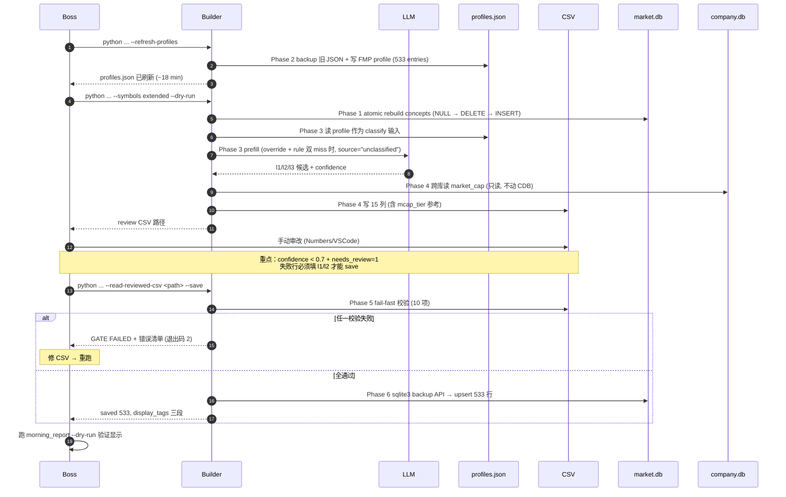

# Concept Taxonomy v2 — Implementation Plan

> **For agentic workers:** REQUIRED SUB-SKILL: Use `superpowers:subagent-driven-development` (recommended) or `superpowers:executing-plans` to implement this plan task-by-task. Steps use checkbox (`- [ ]`) syntax for tracking. Every task ends with a test + commit step — no skipping.

**Goal:** 把 extend pool 533 只美股从 14-bucket 单层粗分类升级到 4 维 (L1 板块 / L2 赛道 / L3 主题 / L4 市值) 标签体系，把现有 `scripts/build_company_concept_registry.py` 升级为唯一入口，CSV 经 Boss 审改后回写 `market.db.company_concept_tags`。

**Architecture:** 单一 SSOT (`concept_taxonomy_v2.json`) → builder 5 阶段流水线（taxonomy 固化 + FMP profile 刷新 + classify chain + CSV 输出 + 回读校验回写）→ DB-canonical display_tags 经 `ConceptClassifier` 流到晨报和下游。LLM prefill 走项目已有的 `claude -p` CLI 模式（与 `forge/runner.py` 对齐，不引入新依赖）。

**Tech Stack:** Python 3.12, SQLite (`market.db` + `company.db`，FK 开启), pytest, claude-code CLI（LLM transport），FMP client (existing)。

**Upstream constraint:** [`docs/design/concept_taxonomy_v2_spec.md`](../design/concept_taxonomy_v2_spec.md) Rev 3。本 plan 的每个 task 必须可追溯到 spec 的对应 §。

---

## 0. 北极星对齐

| 北极星层 | 本 plan 贡献 |
|---|---|
| **Data layer**（金字塔底座） | 给 extended pool (533 只) 上更精细的 metadata，从 14 bucket 单层 → 4 维标签 |
| **Analysis layer** | 不直接动；但为后续的"L1 板块估值切片 / L3 主题动量聚合"提供数据基础 |
| **Strategy/Execution** | 不动 |

本期**不做**估值/动量聚合脚本（spec §8.3 已明确 future work）；plan 范围 = builder + 写库 + 晨报渲染对齐，不含下游聚合 UI。

---

## 1. 架构图

```mermaid
flowchart TB
  subgraph SSOT["SSOT (config/concepts/)"]
    JSON_v2[concept_taxonomy_v2.json<br/>11 L1 + 60 L2 + 42 L3]
    Overrides[company_concept_overrides.json]
  end

  subgraph ProfilesCache["data/fundamental/profiles.json (本期 builder 写)"]
    PJSON[FMP profile 缓存<br/>name / sector / industry / description]
  end

  subgraph CompanyDB["company.db (本期只读)"]
    MCAP[companies.market_cap<br/>(其他 pipeline 维护)]
  end

  subgraph MarketDB["market.db (云写, 本地读 via 同步)"]
    Concepts[concepts<br/>113 行]
    OldThemes[concept_themes<br/>5 条快照 parent=NULL]
    CCT[company_concept_tags<br/>533 行]
  end

  FMP[FMP /profile API] -->|Phase 2 拉取 + WAL-safe backup| PJSON
  JSON_v2 -->|Phase 1 atomic rebuild| Concepts
  Concepts -.切 FK.-> OldThemes

  PJSON -->|Phase 3 classify 输入| Builder[scripts/build_company_concept_registry.py]
  JSON_v2 --> Builder
  Overrides --> Builder
  LLM[claude -p CLI] -->|prefill rule miss| Builder
  MCAP -->|Phase 4 跨库读填 mcap_tier 参考列| Builder

  Builder -->|Phase 4 写 15 列| CSV[reports/concept_registry/<br/>extended_pool_tags_YYYY-MM-DD.csv]
  CSV -->|Boss 手动审改| CSVReviewed[审改后 CSV]
  CSVReviewed -->|Phase 5 --read-reviewed-csv 校验| Builder
  Builder -->|Phase 6 sqlite3 backup API + upsert| CCT

  CCT -->|registry hit| Classifier[ConceptClassifier.display_tags]
  Classifier --> Report[scripts/morning_report.py<br/>+ PI + Dashboard]
```

---

## 2. 业务流程图（Boss 视角端到端）



---

## 3. 替代方案对比

| 方案 | 入口 | 复杂度 | 优点 | 缺点 | 决策 |
|---|---|---|---|---|---|
| **A. 升级现有 builder（推荐）** | `scripts/build_company_concept_registry.py` + `--read-reviewed-csv` | 中 | 单一入口；现有 5 阶段架构 + gate 逻辑可复用；测试覆盖已有 | classify 返回值要扩展；keyword rules 全部重写 | ✅ 采用（spec §7 Rev 2 明确要求） |
| B. 新建 `import_concept_tags.py` | 两个脚本 | 高 | 隔离风险 | 双入口持续漂移；display_tags 拼接和 gate 逻辑要复制 | ❌ Boss 第 1 轮 review 已否（spec §7 Rev 2 必改项 #3） |
| C. 全手工填 533 行 CSV | 无 LLM | 低 | 100% Boss 控制 | 一人一天填不完；keyword rule 已有现成的 | ❌ ROI 太低，LLM prefill + Boss 审改是合理分工 |

---

## 4. 风险自证

**最大风险：LLM prefill 准确度。** 533 只里若 LLM 错分 30%+ 会让 Boss 审改成本爆炸。

**Mitigation：**
1. 三级流水线 (override → keyword rule → LLM)，让确定性 rule 先吃掉大部分（核心 86 只 sector/industry 已知）
2. Phase 3 dry-run 5 只验证 prompt 效果，不满意先调 prompt 再跑全量
3. `needs_review=1` 高亮 + confidence 排序，Boss 优先看低 confidence 行
4. Phase 5 fail-fast 拒掉 missing l1/l2 — LLM 失败行进 CSV 不进 DB，Boss 必须手动填

**为什么不用更简单做法？**
- "不要 L3 主题，只做 L1/L2" → 失去跨行业聚合（NVDA + AMZN + GOOGL 同走 AI 算力）
- "L1/L2/L3 都用 keyword rule 不用 LLM" → 多元化公司主链路判断（AMZN 走 cloud 不走 retail）规则覆盖不全
- "保留 14 bucket 不动" → 现状问题 (§1.2) 不解决，下游聚合永远做不出来

**核心不变量（任何 task 不能破）：**
1. PRAGMA foreign_keys=ON，Phase 1 必须先切 `concept_themes.parent_concept_id=NULL` 再 DELETE concepts
2. 533 行 save 前 l1/l2 必须全合法（`company_concept_tags.primary_concept_id NOT NULL`）
3. theme_ids 元素必须是 `concepts.concept_id` 且 `level=3`（不是旧 `concept_themes.theme_id`）
4. CSV 单一权威：Boss 改 CSV → builder 回读，不容许其他写路径

---

## 5. 文件清单

| 状态 | 路径 | 责任 |
|---|---|---|
| 新建 | `config/concepts/concept_taxonomy_v2.json` | SSOT — 11+60+42 节点 + keyword rules + multi-segment anchor overrides |
| 新建 | `terminal/llm_concept_prefill.py` | Claude CLI prefill wrapper（输入 profile dict + taxonomy → 返回候选 dict） |
| 新建 | `tests/test_concept_taxonomy_v2_json.py` | SSOT 完整性测试 |
| 新建 | `tests/test_llm_concept_prefill.py` | LLM wrapper 单测（mock CLI） |
| 新建 | `tests/test_concept_v2_integration.py` | 端到端：3-stock fixture 跑全 pipeline |
| 修改 | `scripts/build_company_concept_registry.py` | 5 阶段升级 + `--read-reviewed-csv` 子流程 + `--refresh-profiles` 子流程 |
| 修改 | `terminal/company_concepts.py` | ConceptRegistry 加载 v2 JSON；classify 返回 l3_list；keyword rules 重写 |
| 修改 | `terminal/concept_classifier.py` | `_CONCEPT_TO_LEGACY_BUCKET` 重映射；display_tags 直返 DB canonical |
| 修改 | `src/data/market_store.py` | 新增 `rebuild_concept_tree()` 原子事务；`upsert_concept_themes` 加 @deprecated；`upsert_company_concepts` 加 theme_ids level=3 校验 |
| 修改 | `tests/test_build_concept_registry.py` | classify 三元组断言；旧 keyword rule 测试改新 11/60 L1/L2 |
| 修改 | `tests/test_company_concepts.py` | 同上 |
| 修改 | `tests/test_concept_classifier.py` | display_tags 三段串接断言 |
| 修改 | `tests/test_market_store_concepts.py` | 加 rebuild_concept_tree 测试；FK 迁移顺序 |
| 不动 | `scripts/morning_report.py` | 通过 `clf.display_tags()` 接口透明升级 |
| 保留废弃 | `config/concepts/taxonomy.json` + `concept_themes.json` | 不删，但 builder 不再加载（旧路径自然失活） |

---

## 6. 任务拆解（TDD）

### Task 0: 创建 worktree + branch（开发管理基线）

**遵循 Finance CLAUDE.md 第 3 条铁律**：所有涉及开发代码的任务，一律用 git + worktree。

**Files:** 不动文件。仅做仓库状态准备。

- [ ] **Step 1: 确认 main 干净 + 同步远程**

```bash
cd "/Users/owen/CC workspace/Finance"
git status            # 期望 nothing to commit
git fetch origin
git log --oneline origin/main..main  # 期望空（本地无未推送）
```

如有 uncommitted 改动，先 stash / commit / 询问 Boss，**绝不**直接覆盖。

- [ ] **Step 2: 创建 worktree**

```bash
git worktree add -b codex/concept-taxonomy-v2 \
    "/Users/owen/CC workspace/Finance-concept-taxonomy-v2" main
```

期望输出：`Preparing worktree (new branch 'codex/concept-taxonomy-v2')`。

- [ ] **Step 3: 切到 worktree 并验证**

```bash
cd "/Users/owen/CC workspace/Finance-concept-taxonomy-v2"
git status            # 期望 On branch codex/concept-taxonomy-v2 / nothing to commit
git branch --show-current  # → codex/concept-taxonomy-v2
ls scripts/build_company_concept_registry.py  # 期望存在（与 main 同步）
```

- [ ] **Step 4: 验证 venv 路径**

worktree 默认**不共享** .venv。后续所有 python 命令必须用主仓库的绝对路径：

```bash
/Users/owen/CC\ workspace/Finance/.venv/bin/python -V  # 期望 3.12.x
```

后续 task 中所有 `pytest`/`python` 命令都用此绝对路径，**不要** `.venv/bin/python`（相对路径在 worktree 里指空）。

- [ ] **Step 5: 提示进入 worktree 工作**

后续 Task 1-N 的所有 `git add` / `git commit` / 文件操作都在 worktree (`Finance-concept-taxonomy-v2`) 里跑。回到主仓库前一律 `git status` 确认 worktree 已清理。

**结束 commit**：本 task 不产生 commit（worktree 创建是 git 操作，非内容变更）。

---

### Task 0.5: Spec 同步前置检查（gates 所有后续 task）

**Why this exists:** Plan §10 中列出的 spec amendment（profiles.json 路径 + WAL-safe backup）已经写进 spec Rev 3.1 changelog 条目里，但仍是**未 commit 的工作树修改**。如果 worktree (Task 0) 从未带这些 spec 改动的 `main` 创建出来，CC 在执行时就会发现 plan 与 spec 矛盾。本 task 是硬前置：在 Task 1 启动前，spec Rev 3.1 必须落进 main 且 worktree 已含有。

**Files:**
- Verify: `docs/design/concept_taxonomy_v2_spec.md` (Rev 3.1 changelog 行存在)
- Verify: `docs/plans/2026-05-13-concept-taxonomy-v2-impl.md`（本文件）已经 commit 到 main

- [ ] **Step 1: 验证 spec Rev 3.1 在 worktree 里**

```bash
cd "/Users/owen/CC workspace/Finance-concept-taxonomy-v2"
grep -q "Rev 3.1" docs/design/concept_taxonomy_v2_spec.md && echo "✓ Rev 3.1 已合入" || echo "✗ MISSING"
grep -q "data/fundamental/profiles.json" docs/design/concept_taxonomy_v2_spec.md && echo "✓ §7.2 已改" || echo "✗ MISSING"
grep -q "sqlite3 backup API\|WAL" docs/design/concept_taxonomy_v2_spec.md && echo "✓ §9.1 已改" || echo "✗ MISSING"
```

任一行出 ✗ → 回到 main 仓库把 spec + plan commit 后 rebase worktree，**不要**继续 Task 1。

- [ ] **Step 2: 验证 plan 自身在 worktree 里也是最新版**

```bash
grep -q "data/fundamental/profiles.json" docs/plans/2026-05-13-concept-taxonomy-v2-impl.md && echo "✓ plan 已对齐"
grep -q "source=\"unclassified\"" docs/plans/2026-05-13-concept-taxonomy-v2-impl.md && echo "✓ unclassified 已明确"
```

- [ ] **Step 3: 如果 Step 1/2 任一缺，先 commit 后再开工**

在主仓库（不在 worktree 里）：

```bash
cd "/Users/owen/CC workspace/Finance"
git add docs/design/concept_taxonomy_v2_spec.md docs/plans/2026-05-13-concept-taxonomy-v2-impl.md
git commit -m "docs(concept): spec Rev 3.1 + impl plan v2 (profiles.json + WAL-safe backup)"
# 然后回到 worktree 取最新 main
cd "/Users/owen/CC workspace/Finance-concept-taxonomy-v2"
git fetch
git merge origin/main --no-edit  # 或 rebase, 取决于 Boss 偏好
```

> 注：如果 spec + plan 已经被 Boss commit 到 main，本 task Step 3 可直接跳过。

- [ ] **Step 4: 本 task 不产生 commit**（验证性 task）。

---

### Task 1: SSOT JSON 固化

**Files:**
- Create: `config/concepts/concept_taxonomy_v2.json`
- Create: `tests/test_concept_taxonomy_v2_json.py`

**Spec ref:** §3.1 §3.2 §3.3 §3.4

- [ ] **Step 1: Write the failing test**

```python
# tests/test_concept_taxonomy_v2_json.py
"""SSOT 完整性测试 — 不依赖 DB/registry，只验 JSON 结构。"""
import json
from pathlib import Path

TAXONOMY_PATH = Path(__file__).resolve().parent.parent / "config" / "concepts" / "concept_taxonomy_v2.json"


def _load():
    return json.loads(TAXONOMY_PATH.read_text(encoding="utf-8"))


def test_taxonomy_has_11_l1_60_l2_42_l3():
    data = _load()
    levels = {1: [], 2: [], 3: []}
    for c in data["concepts"]:
        levels[c["level"]].append(c)
    assert len(levels[1]) == 11
    assert len(levels[2]) == 60
    assert len(levels[3]) == 42


def test_l2_parent_strictly_under_l1():
    data = _load()
    l1_ids = {c["concept_id"] for c in data["concepts"] if c["level"] == 1}
    for c in data["concepts"]:
        if c["level"] == 2:
            assert c.get("parent_id") in l1_ids, f"{c['concept_id']} parent missing"


def test_l3_independent_axis_no_parent():
    data = _load()
    for c in data["concepts"]:
        if c["level"] == 3:
            assert c.get("parent_id") in (None, ""), f"{c['concept_id']} should have no parent"
            assert c.get("concept_type") == "theme"


def test_concept_ids_globally_unique():
    data = _load()
    ids = [c["concept_id"] for c in data["concepts"]]
    assert len(ids) == len(set(ids)), f"duplicate concept_id: {ids}"


def test_l3_aliases_map_back_to_id():
    data = _load()
    alias_to_id = {}
    for c in data["concepts"]:
        if c["level"] == 3:
            for alias in c.get("aliases", []):
                assert alias not in alias_to_id or alias_to_id[alias] == c["concept_id"], \
                    f"alias '{alias}' collides between {alias_to_id.get(alias)} and {c['concept_id']}"
                alias_to_id[alias] = c["concept_id"]
            assert c["label"] in alias_to_id, f"L3 {c['concept_id']} label not in aliases"


def test_anchor_l3_ids_all_in_pool():
    data = _load()
    l3_ids = {c["concept_id"] for c in data["concepts"] if c["level"] == 3}
    for anchor in data.get("multi_segment_anchors", []):
        for tid in anchor.get("theme_ids", []):
            assert tid in l3_ids, f"anchor {anchor['symbol']} references unknown L3 {tid}"
```

- [ ] **Step 2: Run test to verify it fails**

```bash
/Users/owen/CC\ workspace/Finance/.venv/bin/python -m pytest tests/test_concept_taxonomy_v2_json.py -v
```

Expected: FAIL with `FileNotFoundError: ...concept_taxonomy_v2.json`

- [ ] **Step 3: Write the SSOT JSON**

`config/concepts/concept_taxonomy_v2.json` 顶层结构：

```json
{
  "version": "v2.0",
  "updated": "2026-05-13",
  "concepts": [
    {"concept_id": "ai_compute_cloud", "label": "AI算力与云", "level": 1, "concept_type": "evergreen", "status": "active"},
    /* ... 10 more L1 ... */
    {"concept_id": "hyperscaler", "label": "超大规模云", "level": 2, "parent_id": "ai_compute_cloud", "concept_type": "evergreen", "status": "active"},
    /* ... 59 more L2 ... */
    {"concept_id": "ai_compute", "label": "AI算力", "level": 3, "parent_id": null, "concept_type": "theme", "status": "active", "aliases": ["AI算力", "AI 算力"]},
    /* ... 41 more L3 (with aliases) ... */
  ],
  "keyword_rules": [
    /* FMP industry/sector 字符串 → (l1, l2) 直推规则。例： */
    {"keywords": ["semiconductor equipment", "lithography"], "l1": "semiconductor", "l2": "semi_equipment", "business_role": "半导体设备", "confidence": 0.7},
    {"keywords": ["gpu", "ai accelerator"], "l1": "semiconductor", "l2": "gpu_accelerator", "business_role": "GPU/AI加速器", "confidence": 0.7}
    /* ... 完整规则从 spec §3 + 现有 terminal/company_concepts._KEYWORD_RULES 迁移 ... */
  ],
  "multi_segment_anchors": [
    {"symbol": "AMZN", "l1": "ai_compute_cloud", "l2": "hyperscaler", "theme_ids": ["ai_compute"], "business_role": "AWS + 零售 + 广告"},
    {"symbol": "MSFT", "l1": "ai_compute_cloud", "l2": "hyperscaler", "theme_ids": ["ai_compute", "ai_application_layer", "edge_ai"], "business_role": "Azure + M365"},
    {"symbol": "GOOGL", "l1": "internet_software", "l2": "search_engine", "theme_ids": ["ai_compute", "inhouse_chip", "antitrust_risk"], "business_role": "搜索 + YouTube + Cloud"},
    {"symbol": "AAPL", "l1": "consumer_retail", "l2": "consumer_electronics_brand", "theme_ids": ["edge_ai", "china_exposure", "antitrust_risk"], "business_role": "iPhone + Services"},
    {"symbol": "TSLA", "l1": "autonomy_robotics", "l2": "ev_oem", "theme_ids": ["autonomy_fsd", "humanoid_robotics", "energy_storage"], "business_role": "EV + FSD + Optimus"},
    {"symbol": "AVGO", "l1": "semiconductor", "l2": "ip_eda_fabless", "theme_ids": ["ai_compute", "ai_infra_material"], "business_role": "半导体 + VMware"},
    {"symbol": "BRK.B", "l1": "finance", "l2": "insurance", "theme_ids": ["defensive_stock", "rate_sensitive"], "business_role": "保险 + 控股"}
  ]
}
```

**完整版**写入时严格按 spec §3.1（11 L1）、§3.2（60 L2，按 L1 分组）、§3.3（42 L3 stable ID 表 6 簇）逐条录入。keyword_rules 从 `terminal/company_concepts.py:49-122` 现有规则迁移并按新 L1/L2 重映射（旧 `network_equipment` 不再是 L1，并入 `ai_compute_cloud.datacenter_network` 或独立判断）。

- [ ] **Step 4: Run test to verify it passes**

```bash
.venv/bin/python -m pytest tests/test_concept_taxonomy_v2_json.py -v
```

Expected: 6/6 PASS

- [ ] **Step 5: Commit**

```bash
git add config/concepts/concept_taxonomy_v2.json tests/test_concept_taxonomy_v2_json.py
git commit -m "feat(concept): add v2 SSOT JSON with 11/60/42 taxonomy + anchors"
```

---

### Task 2: market_store 原子迁移方法

**Files:**
- Modify: `src/data/market_store.py` (add `rebuild_concept_tree()` after `upsert_concepts()`)
- Modify: `tests/test_market_store_concepts.py` (add 3 tests)

**Spec ref:** §5.1 §7.1 (FK 迁移顺序)

- [ ] **Step 1: Write the failing test**

加到 `tests/test_market_store_concepts.py`：

```python
def test_rebuild_concept_tree_atomic_with_fk_themes_present(tmp_path):
    """FK 风险用例：concept_themes 5 条历史快照引用旧 concepts。
    rebuild_concept_tree 必须先 NULL parent_concept_id 再 DELETE concepts，否则 FK 失败。
    """
    db = tmp_path / "market.db"
    store = MarketStore(db_path=db)
    # 种子：旧 concepts + 旧 concept_themes 引用 (FK 必然存在)
    store.upsert_concepts([{"concept_id": "old_semi", "label": "旧半导体", "level": 1}])
    store.upsert_concept_themes([{"theme_id": "hbm", "label": "HBM", "parent_concept_id": "old_semi"}])

    new_concepts = [
        {"concept_id": "semiconductor", "label": "半导体", "level": 1},
        {"concept_id": "gpu_accelerator", "label": "GPU加速器", "level": 2, "parent_id": "semiconductor"},
        {"concept_id": "ai_compute", "label": "AI算力", "level": 3, "concept_type": "theme"},
    ]
    inserted = store.rebuild_concept_tree(new_concepts)
    assert inserted == 3
    # 旧 concepts 必须清空
    conn = store._get_conn()
    rows = conn.execute("SELECT concept_id FROM concepts ORDER BY concept_id").fetchall()
    assert [r[0] for r in rows] == ["ai_compute", "gpu_accelerator", "semiconductor"]
    # 旧 concept_themes 行保留但 parent_concept_id 已切到 NULL
    themes = conn.execute("SELECT theme_id, parent_concept_id FROM concept_themes").fetchall()
    assert themes == [("hbm", None)]


def test_rebuild_concept_tree_clears_company_concept_tags(tmp_path):
    """concepts 重建必须先清 company_concept_tags（FK references concepts）。"""
    db = tmp_path / "market.db"
    store = MarketStore(db_path=db)
    store.upsert_concepts([{"concept_id": "old", "label": "old", "level": 1}])
    store.upsert_company_concepts([{"symbol": "FOO", "primary_concept_id": "old", "confidence": 0.5}])

    store.rebuild_concept_tree([{"concept_id": "new", "label": "new", "level": 1}])

    conn = store._get_conn()
    cct_rows = conn.execute("SELECT symbol FROM company_concept_tags").fetchall()
    assert cct_rows == []  # 清空 — Boss 审改后重新 upsert


def test_rebuild_concept_tree_rollback_on_error(tmp_path):
    """事务内任一 INSERT 失败必须整体回滚。"""
    db = tmp_path / "market.db"
    store = MarketStore(db_path=db)
    store.upsert_concepts([{"concept_id": "keep", "label": "保留", "level": 1}])

    bad_rows = [
        {"concept_id": "new1", "label": "new1", "level": 1},
        {"concept_id": "new2", "level": 2},  # missing label → INSERT raises
    ]
    with pytest.raises(Exception):
        store.rebuild_concept_tree(bad_rows)

    # 旧数据必须仍在
    conn = store._get_conn()
    rows = conn.execute("SELECT concept_id FROM concepts").fetchall()
    assert [r[0] for r in rows] == ["keep"]
```

- [ ] **Step 2: Run test to verify it fails**

```bash
.venv/bin/python -m pytest tests/test_market_store_concepts.py::test_rebuild_concept_tree_atomic_with_fk_themes_present -v
```

Expected: FAIL with `AttributeError: 'MarketStore' object has no attribute 'rebuild_concept_tree'`

- [ ] **Step 3: Write the implementation**

加到 `src/data/market_store.py` (位置：紧跟 `upsert_concepts()` 后)：

```python
def rebuild_concept_tree(self, rows: List[Dict[str, Any]]) -> int:
    """Atomic rebuild of the concepts tree (v2 migration).

    Order (must execute in one transaction with FK on):
        1. UPDATE concept_themes SET parent_concept_id=NULL  (cut FK refs)
        2. DELETE FROM company_concept_tags                  (FK references concepts)
        3. DELETE FROM symbol_concept_edges                  (FK references concepts)
        4. DELETE FROM concepts                              (now safe)
        5. INSERT new concepts ordered by level (L1 before L2 to satisfy parent_id FK)
    """
    if not rows:
        return 0
    # Order by level so L1 INSERT precedes L2 parent_id ref
    ordered = sorted(rows, key=lambda r: int(r["level"]))
    conn = self._get_conn()
    now = self._utc_now_iso()
    with conn:
        conn.execute("UPDATE concept_themes SET parent_concept_id = NULL")
        conn.execute("DELETE FROM company_concept_tags")
        conn.execute("DELETE FROM symbol_concept_edges")
        conn.execute("DELETE FROM concepts")
        count = 0
        for row in ordered:
            conn.execute(
                """INSERT INTO concepts
                (concept_id, label, level, parent_id, concept_type, status,
                 created_at, updated_at)
                VALUES (?, ?, ?, ?, ?, ?, ?, ?)""",
                (
                    row["concept_id"],
                    row["label"],
                    int(row["level"]),
                    row.get("parent_id"),
                    row.get("concept_type", "evergreen"),
                    row.get("status", "active"),
                    now, now,
                ),
            )
            count += 1
    return count
```

- [ ] **Step 4: Run test to verify it passes**

```bash
.venv/bin/python -m pytest tests/test_market_store_concepts.py -v
```

Expected: all rebuild tests PASS, existing tests still PASS.

- [ ] **Step 5: Commit**

```bash
git add src/data/market_store.py tests/test_market_store_concepts.py
git commit -m "feat(market_store): add rebuild_concept_tree() atomic migration with FK safety"
```

---

### Task 3: ConceptRegistry v2 升级

**Files:**
- Modify: `terminal/company_concepts.py`
- Modify: `tests/test_company_concepts.py`

**Spec ref:** §7.3 (classify chain), §3.3 (L3 aliases)

- [ ] **Step 1: Write the failing test**

加到 `tests/test_company_concepts.py`：

```python
def test_v2_classify_returns_l3_list_and_business_role(tmp_path):
    reg = ConceptRegistry(
        taxonomy_path=PROJECT_ROOT / "config/concepts/concept_taxonomy_v2.json",
        overrides_path=PROJECT_ROOT / "config/concepts/company_concept_overrides.json",
        watchlist_path=PROJECT_ROOT / "config/concepts/concept_watchlist.json",
    )
    result = reg.classify({
        "symbol": "NVDA",
        "industry": "Semiconductors",
        "description": "GPU and AI accelerator",
    })
    assert result["l1"] == "semiconductor"
    assert result["l2"] == "gpu_accelerator"
    assert isinstance(result["l3_themes"], list)
    assert result["source"] == "rule"
    assert result["confidence"] >= 0.6


def test_v2_anchor_override_takes_priority(tmp_path):
    reg = ConceptRegistry(...)
    result = reg.classify({"symbol": "AMZN", "industry": "Internet Retail"})
    assert result["l1"] == "ai_compute_cloud"   # 主链路 AWS, 不是 consumer_retail
    assert result["l2"] == "hyperscaler"
    assert "ai_compute" in result["l3_themes"]
    assert result["source"] == "manual"


def test_v2_resolve_l3_alias_maps_chinese_label_to_id():
    reg = ConceptRegistry(...)
    assert reg.resolve_l3_alias("AI算力") == "ai_compute"
    assert reg.resolve_l3_alias("液冷") == "datacenter_cooling"
    assert reg.resolve_l3_alias("foo_unknown") is None


def test_v2_classify_returns_unclassified_when_override_and_rule_both_miss(tmp_path):
    """v2 不再有 legacy bucket fallback。override + rule 双 miss → source='unclassified'，
    l1/l2 = None，needs_review=1。**registry.classify 内不调用 LLM**（LLM 是 builder 编排层职责）。"""
    reg = ConceptRegistry(
        taxonomy_path=PROJECT_ROOT / "config/concepts/concept_taxonomy_v2.json",
        overrides_path=PROJECT_ROOT / "config/concepts/company_concept_overrides.json",
        watchlist_path=PROJECT_ROOT / "config/concepts/concept_watchlist.json",
    )
    result = reg.classify({"symbol": "OBSCURE",
                           "industry": "Completely Unknown Sector",
                           "description": "Mystery company"})
    assert result["source"] == "unclassified"
    assert result["l1"] is None
    assert result["l2"] is None
    assert result["l3_themes"] == []
    assert result["needs_review"] == 1
    assert result["confidence"] == 0.0
```

- [ ] **Step 2: Run test to verify it fails**

```bash
.venv/bin/python -m pytest tests/test_company_concepts.py::test_v2_classify_returns_l3_list_and_business_role -v
```

Expected: FAIL with `KeyError: 'l1'`（旧 classify 返回 `primary_concept_id`）

- [ ] **Step 3: Write the implementation**

重写 `terminal/company_concepts.py::ConceptRegistry`：

1. **构造函数签名变更**：只接受单一 `taxonomy_path`（不再分别接 `themes_path`），同时仍接 overrides + watchlist。
2. **classify 返回结构**改为：
```python
{
    "symbol": "NVDA",
    "l1": "semiconductor",
    "l2": "gpu_accelerator",
    "l3_themes": [],          # list of concept_id (level=3)
    "business_role": "GPU/AI加速器",
    "confidence": 0.6,
    "source": "rule",          # manual | rule | unclassified  ← registry 只产生这三种
    "evidence": "keyword: gpu",
    "needs_review": 0,
}
```
3. **source 枚举边界（关键，与 Task 4b 配套）**：
   - `manual`：override 命中 → l1/l2/l3 全填，needs_review=0
   - `rule`：keyword rule 命中 → l1/l2 填，l3_themes=[]，needs_review=0
   - `unclassified`：override + rule 双 miss → l1=l2=None，l3_themes=[]，confidence=0.0，needs_review=1
   - **registry 永远不返回** `llm` / `llm_failed` / `llm_fallback`——这些是 builder 编排层在 Task 4b 调用 `prefill_one()` 后写入的 source 值
4. **删除** legacy bucket fallback 路径（v2 不要 14-bucket fallback；registry miss 直接 `unclassified`，编排层接力）。
5. **新增方法** `resolve_l3_alias(label_or_id: str) -> Optional[str]`：先看是否是 `concept_id`（直返），否则在 `aliases` 表查中文 label，未命中返 None。
6. **keyword_rules 改为从 JSON 读**：不再硬编码在模块里，迁移到 `concept_taxonomy_v2.json::keyword_rules` 数组（Task 1 已加）。

- [ ] **Step 4: Run test to verify it passes**

```bash
.venv/bin/python -m pytest tests/test_company_concepts.py -v
```

Expected: 新 v2 测试 PASS；旧测试需要在 Step 3 同步改（断言 `l1` 而非 `primary_concept_id`）。

- [ ] **Step 5: Commit**

```bash
git add terminal/company_concepts.py tests/test_company_concepts.py
git commit -m "refactor(concept): ConceptRegistry v2 — classify returns (l1,l2,l3_list,...) + alias resolver"
```

---

### Task 4: LLM prefill 模块

**Files:**
- Create: `terminal/llm_concept_prefill.py`
- Create: `tests/test_llm_concept_prefill.py`

**Spec ref:** §7.3 priority 3-5

- [ ] **Step 1: Write the failing test**

```python
# tests/test_llm_concept_prefill.py
"""LLM prefill 单测 — mock claude CLI，不实际调用。"""
from unittest.mock import patch
from terminal.llm_concept_prefill import prefill_one, LLMResult


def test_prefill_parses_json_response():
    fake_cli_stdout = '{"l1":"semiconductor","l2":"gpu_accelerator","l3_themes":["ai_compute"],"business_role":"GPU","confidence":0.85}'
    with patch("terminal.llm_concept_prefill._run_claude_cli", return_value=fake_cli_stdout):
        result = prefill_one(
            symbol="NVDA",
            profile={"description": "GPU", "industry": "Semi"},
            taxonomy={"concepts": [{"concept_id": "semiconductor", "level": 1}, {"concept_id": "gpu_accelerator", "level": 2, "parent_id": "semiconductor"}, {"concept_id": "ai_compute", "level": 3}]},
        )
    assert result.source == "llm"
    assert result.l1 == "semiconductor"
    assert result.confidence == 0.85


def test_prefill_cli_failure_returns_failed_marker():
    with patch("terminal.llm_concept_prefill._run_claude_cli", side_effect=RuntimeError("timeout")):
        result = prefill_one(symbol="FOO", profile={}, taxonomy={"concepts": []})
    assert result.source == "llm_failed"
    assert result.l1 is None
    assert result.confidence == 0.0
    assert result.needs_review == 1


def test_prefill_unparseable_label_returns_fallback():
    fake_cli_stdout = '{"l1":"not_in_taxonomy","l2":"also_invalid","l3_themes":[],"business_role":"foo","confidence":0.5}'
    with patch("terminal.llm_concept_prefill._run_claude_cli", return_value=fake_cli_stdout):
        result = prefill_one(symbol="BAR", profile={}, taxonomy={"concepts": [{"concept_id": "semiconductor", "level": 1}]})
    assert result.source == "llm_fallback"
    assert result.confidence == 0.1
    assert result.needs_review == 1
```

- [ ] **Step 2: Run test to verify it fails**

```bash
.venv/bin/python -m pytest tests/test_llm_concept_prefill.py -v
```

Expected: FAIL with `ModuleNotFoundError`

- [ ] **Step 3: Write the implementation**

```python
# terminal/llm_concept_prefill.py
"""Claude CLI prefill for L1/L2/L3 candidates when override + keyword rule both miss.

Transport: subprocess to `claude -p <prompt> --output-format json` (matches forge/runner.py).
We don't add the anthropic SDK as a dependency — the CLI is already on PATH.
"""
from __future__ import annotations

import json
import logging
import subprocess
from dataclasses import dataclass
from typing import Any, Optional

logger = logging.getLogger(__name__)

PROMPT_TEMPLATE = """\
You are a stock-tagger for {symbol}. Map this company to a 3-level taxonomy.

Company profile:
- name: {name}
- sector: {sector}
- industry: {industry}
- description: {description}

L1 candidates (pick exactly one concept_id):
{l1_list}

L2 candidates (must be parent={{l1_chosen}}):
{l2_list}

L3 themes (pick 0-4, only if they meaningfully impact valuation or momentum):
{l3_list}

Output JSON ONLY (no commentary, no markdown fence):
{{"l1":"...","l2":"...","l3_themes":[...],"business_role":"<one Chinese sentence>","confidence":0.0-1.0}}
"""


@dataclass
class LLMResult:
    l1: Optional[str]
    l2: Optional[str]
    l3_themes: list[str]
    business_role: str
    confidence: float
    source: str  # llm | llm_failed | llm_fallback
    evidence: str
    needs_review: int


def _run_claude_cli(prompt: str, timeout: int = 60) -> str:
    completed = subprocess.run(
        ["claude", "-p", prompt, "--output-format", "json"],
        capture_output=True, text=True, timeout=timeout, check=False,
    )
    if completed.returncode != 0:
        raise RuntimeError(f"claude CLI failed: {completed.stderr}")
    return completed.stdout


def prefill_one(symbol: str, profile: dict, taxonomy: dict) -> LLMResult:
    l1_concepts = [c for c in taxonomy.get("concepts", []) if c.get("level") == 1]
    l2_concepts = [c for c in taxonomy.get("concepts", []) if c.get("level") == 2]
    l3_concepts = [c for c in taxonomy.get("concepts", []) if c.get("level") == 3]

    valid_l1 = {c["concept_id"] for c in l1_concepts}
    valid_l2_to_parent = {c["concept_id"]: c.get("parent_id") for c in l2_concepts}
    valid_l3 = {c["concept_id"] for c in l3_concepts}

    prompt = PROMPT_TEMPLATE.format(
        symbol=symbol,
        name=profile.get("companyName", ""),
        sector=profile.get("sector", ""),
        industry=profile.get("industry", ""),
        description=(profile.get("description", "") or "")[:500],
        l1_list="\n".join(f"- {c['concept_id']} ({c['label']})" for c in l1_concepts),
        l2_list="\n".join(f"- {c['concept_id']} (parent={c['parent_id']}, {c['label']})" for c in l2_concepts),
        l3_list="\n".join(f"- {c['concept_id']} ({c['label']})" for c in l3_concepts),
    )

    try:
        stdout = _run_claude_cli(prompt)
    except Exception as exc:
        logger.warning("LLM CLI failed for %s: %s", symbol, exc)
        return LLMResult(None, None, [], "", 0.0, "llm_failed", str(exc), 1)

    # Parse — claude CLI in json mode wraps the model output; strip that envelope first.
    try:
        envelope = json.loads(stdout)
        # forge/runner.py shows the result is nested under 'result' field; try both shapes
        payload_text = envelope.get("result") if isinstance(envelope, dict) else None
        if payload_text is None:
            payload_text = stdout
        candidate = json.loads(payload_text) if isinstance(payload_text, str) else payload_text
    except (json.JSONDecodeError, AttributeError) as exc:
        logger.warning("LLM output parse failed for %s: %s", symbol, exc)
        return LLMResult(None, None, [], "", 0.0, "llm_failed", f"parse: {exc}", 1)

    # Strict validation against taxonomy
    l1 = candidate.get("l1")
    l2 = candidate.get("l2")
    if l1 not in valid_l1 or l2 not in valid_l2_to_parent or valid_l2_to_parent[l2] != l1:
        return LLMResult(None, None, [], candidate.get("business_role", ""), 0.1,
                         "llm_fallback", "l1/l2 not in taxonomy or parent mismatch", 1)

    l3_themes = [t for t in candidate.get("l3_themes", []) if t in valid_l3]
    return LLMResult(
        l1=l1, l2=l2, l3_themes=l3_themes,
        business_role=str(candidate.get("business_role", "")),
        confidence=float(candidate.get("confidence", 0.5)),
        source="llm",
        evidence="claude prefill",
        needs_review=0,
    )
```

- [ ] **Step 4: Run test to verify it passes**

```bash
.venv/bin/python -m pytest tests/test_llm_concept_prefill.py -v
```

Expected: 3/3 PASS

- [ ] **Step 5: Commit**

```bash
git add terminal/llm_concept_prefill.py tests/test_llm_concept_prefill.py
git commit -m "feat(concept): LLM prefill via claude CLI with strict taxonomy validation"
```

---

### Task 4b: 把 LLM prefill 接入 build_registry classify chain

**Files:**
- Modify: `scripts/build_company_concept_registry.py` (build_registry loop + classify call)
- Modify: `tests/test_build_concept_registry.py`

**Spec ref:** §7.3 priority 1-5（manual → rule → llm → llm_failed / llm_fallback）

**Why this exists:** Task 4 只造了 `prefill_one()` 模块，但当前 `build_registry()` 主循环（`scripts/build_company_concept_registry.py:153-158`）只 `rows.append(registry.classify(profile))`，永不调用 LLM。这一步把链路接上：classify 返回 `source="unclassified"`（即 override + rule 双 miss，Task 3 §3.3 已定义）时，自动调 `prefill_one`，把结果合回 row。**关键不变量**：registry 只产 manual/rule/unclassified，LLM 三种 source (`llm` / `llm_failed` / `llm_fallback`) 全由本 wrapper 写入。

- [ ] **Step 1: Write the failing test**

加到 `tests/test_build_concept_registry.py`：

```python
from unittest.mock import patch
from terminal.llm_concept_prefill import LLMResult


def test_build_registry_calls_llm_on_rule_miss(tmp_path):
    """没有 override 也没有 rule 命中时，build_registry 必须调用 prefill_one。"""
    store = _bootstrap_v2_store(tmp_path)
    registry = _v2_registry()
    profiles = {
        "NVDA": {"symbol": "NVDA", "industry": "Semiconductors",
                 "description": "GPU and AI accelerator"},   # rule 命中
        "OBSCURE": {"symbol": "OBSCURE", "industry": "Unknown Sector",
                    "description": "Mystery company"},        # rule miss
    }
    fake_llm = LLMResult(
        l1="industrial_aerospace", l2="engineering_construction",
        l3_themes=[], business_role="工程建筑", confidence=0.75,
        source="llm", evidence="claude", needs_review=0,
    )
    with patch("scripts.build_company_concept_registry.prefill_one",
               return_value=fake_llm) as mocked:
        result = build_registry(
            store=store, registry=registry,
            universe_symbols=["NVDA", "OBSCURE"], profiles=profiles,
            portfolio_holdings=[], broad_top_symbols=["NVDA", "OBSCURE"],
            review_csv_path=tmp_path / "out.csv",
            save=False, force_save=False,
        )
    # OBSCURE 必须被 LLM 处理过（NVDA 走 rule 不调）
    assert mocked.call_count == 1
    called_symbol = mocked.call_args_list[0].kwargs.get("symbol") or mocked.call_args_list[0].args[0]
    assert called_symbol == "OBSCURE"


def test_build_registry_llm_failed_keeps_row_with_blank_l1(tmp_path):
    """LLM 失败时 row 进 CSV 但 primary/secondary 留空，source='llm_failed', needs_review=1。"""
    store = _bootstrap_v2_store(tmp_path)
    registry = _v2_registry()
    profiles = {"OBSCURE": {"symbol": "OBSCURE", "industry": "Unknown",
                            "description": "x"}}
    failed = LLMResult(None, None, [], "", 0.0, "llm_failed", "timeout", 1)
    with patch("scripts.build_company_concept_registry.prefill_one",
               return_value=failed):
        result = build_registry(
            store=store, registry=registry,
            universe_symbols=["OBSCURE"], profiles=profiles,
            portfolio_holdings=[], broad_top_symbols=["OBSCURE"],
            review_csv_path=tmp_path / "out.csv",
            save=False, force_save=False,
        )
    # CSV 里有这行，但 l1/l2 为空
    import csv as _csv
    rows = list(_csv.DictReader((tmp_path / "out.csv").open()))
    obscure = next(r for r in rows if r["symbol"] == "OBSCURE")
    assert obscure["l1"] == ""
    assert obscure["l2"] == ""
    assert obscure["prefill_source"] == "llm_failed"
    assert obscure["needs_review"] == "1"


def test_build_registry_skips_llm_when_rule_hits(tmp_path):
    """rule 命中后绝不调 LLM（节省 533 次中能省的尽量省）。"""
    store = _bootstrap_v2_store(tmp_path)
    registry = _v2_registry()
    profiles = {"NVDA": {"symbol": "NVDA", "industry": "Semiconductors",
                         "description": "GPU and AI accelerator"}}
    with patch("scripts.build_company_concept_registry.prefill_one") as mocked:
        build_registry(
            store=store, registry=registry,
            universe_symbols=["NVDA"], profiles=profiles,
            portfolio_holdings=[], broad_top_symbols=["NVDA"],
            review_csv_path=tmp_path / "out.csv",
            save=False, force_save=False,
        )
    assert mocked.call_count == 0
```

- [ ] **Step 2: Run test to verify it fails**

```bash
/Users/owen/CC\ workspace/Finance/.venv/bin/python -m pytest \
    tests/test_build_concept_registry.py -v -k "llm"
```

Expected: 3/3 FAIL (build_registry 当前不调用 prefill_one；CSV 无 prefill_source 列直到 Task 6 实现)。

> 注：本 task 的测试依赖 Task 6 CSV 15 列结构。如果按 task 顺序执行尚未完成 Task 6，可将本 task 测试中的 CSV 断言降级为"检查 `rows` 列表里 OBSCURE 那行 `l1` 为 None / source 为 llm_failed"。Task 6 完成后回填 CSV 断言。

- [ ] **Step 3: Write the implementation**

修改 `scripts/build_company_concept_registry.py:153-158` 的 classify 循环：

```python
from terminal.llm_concept_prefill import prefill_one, LLMResult

# v2 source enum:
#   manual / rule  ← deterministic, no LLM needed
#   unclassified   ← registry miss → THIS wrapper calls prefill_one
#   llm / llm_failed / llm_fallback ← only produced by this wrapper (never by registry)


def _classify_v2(registry: ConceptRegistry, profile: dict, taxonomy: dict) -> dict:
    """Drop-in replacement for registry.classify() with LLM fallback wiring."""
    row = registry.classify(profile)
    # Deterministic hits: short-circuit.
    if row.get("source") in ("manual", "rule"):
        return row
    # registry must have returned source="unclassified" — anything else is a bug.
    assert row.get("source") == "unclassified", (
        f"registry returned unexpected source={row.get('source')}; "
        "v2 invariant: registry only emits manual|rule|unclassified"
    )
    symbol = (profile.get("symbol") or "").upper()
    llm = prefill_one(symbol=symbol, profile=profile, taxonomy=taxonomy)
    # Merge LLM result back into the registry row shape
    row["l1"] = llm.l1
    row["l2"] = llm.l2
    row["l3_themes"] = llm.l3_themes
    row["business_role"] = llm.business_role or row.get("business_role", "")
    row["confidence"] = llm.confidence
    row["source"] = llm.source            # llm | llm_failed | llm_fallback
    row["evidence"] = llm.evidence
    row["needs_review"] = llm.needs_review
    return row


# In build_registry(), replace:
#     rows.append(registry.classify(profile))
# with:
#     rows.append(_classify_v2(registry, profile, registry._taxonomy))
```

- [ ] **Step 4: Run test to verify it passes**

```bash
/Users/owen/CC\ workspace/Finance/.venv/bin/python -m pytest \
    tests/test_build_concept_registry.py -v -k "llm"
```

Expected: 3/3 PASS

- [ ] **Step 5: Commit**

```bash
git add scripts/build_company_concept_registry.py tests/test_build_concept_registry.py
git commit -m "feat(builder): wire LLM prefill into classify chain (rule miss → prefill_one)"
```

---

### Task 5: Builder Phase 2 — FMP profile 刷新（写 profiles.json）

**Files:**
- Modify: `scripts/build_company_concept_registry.py` (add `--refresh-profiles` subcommand)
- Modify: `tests/test_build_concept_registry.py`

**Spec ref:** §7.2 (revised — see plan §11 spec amendment), §9.1 (backup)

**重要决策（对齐 spec amendment）**：
- profile 数据（包括 `description`）落 `data/fundamental/profiles.json`，**不写 company.db**
- 理由 1：`company.db.companies` schema 没有 description 列（[`terminal/company_store.py:49-60`](/Users/owen/CC workspace/Finance/terminal/company_store.py#L49-L60)），无需在本期加列做 migration
- 理由 2：profiles.json 是现有 builder 的 input pattern（`scripts/build_company_concept_registry.py:451`），延续即可
- 理由 3：`market_cap` 已经被其他 pipeline 写进 `company.db`，CSV 跨库读 market_cap 即可（详 Task 6）
- 因此 **本 task 不需要 backup `company.db`**（不写它），只需 backup `data/fundamental/profiles.json`（如果存在）

- [ ] **Step 1: Write the failing test**

加到 `tests/test_build_concept_registry.py`（用真实 JSON 文件断言内容，不用 monkeypatch 假名）：

```python
def test_refresh_profiles_writes_json_for_each_symbol(tmp_path, monkeypatch):
    """profiles.json 必须包含每个 symbol 的 description/sector/industry/companyName。
    弱断言（只看 backup 存在）会通过 'do nothing' 实现，所以这里查内容。"""
    profiles_path = tmp_path / "profiles.json"

    fake_fmp = {
        "AAPL": {"symbol": "AAPL", "companyName": "Apple Inc.", "sector": "Tech",
                 "industry": "Consumer Electronics", "description": "iPhone maker"},
        "MSFT": {"symbol": "MSFT", "companyName": "Microsoft Corp.", "sector": "Tech",
                 "industry": "Software", "description": "Azure + Office"},
    }
    monkeypatch.setattr("scripts.build_company_concept_registry._fetch_fmp_profile",
                        lambda sym: fake_fmp[sym])

    from scripts.build_company_concept_registry import refresh_profiles
    refresh_profiles(symbols=["AAPL", "MSFT"], profiles_path=profiles_path)

    assert profiles_path.exists()
    data = json.loads(profiles_path.read_text(encoding="utf-8"))
    # Format follows existing _load_profiles: dict keyed by symbol OR list with symbol field
    by_sym = data if isinstance(data, dict) else {p["symbol"]: p for p in data}
    assert by_sym["AAPL"]["description"] == "iPhone maker"
    assert by_sym["MSFT"]["industry"] == "Software"
    assert by_sym["AAPL"]["sector"] == "Tech"


def test_refresh_profiles_backs_up_existing_json(tmp_path, monkeypatch):
    """如果 profiles.json 已存在，先备份再覆盖。"""
    profiles_path = tmp_path / "profiles.json"
    profiles_path.write_text(json.dumps({"OLD": {"symbol": "OLD"}}))

    monkeypatch.setattr("scripts.build_company_concept_registry._fetch_fmp_profile",
                        lambda sym: {"symbol": sym, "description": "new"})

    from scripts.build_company_concept_registry import refresh_profiles
    refresh_profiles(symbols=["AAPL"], profiles_path=profiles_path)

    backups = list(tmp_path.glob("profiles.json.backup-*"))
    assert len(backups) == 1
    # 旧内容保留在 backup
    old = json.loads(backups[0].read_text(encoding="utf-8"))
    assert "OLD" in old
```

- [ ] **Step 2: Run test to verify it fails**

```bash
/Users/owen/CC\ workspace/Finance/.venv/bin/python -m pytest \
    tests/test_build_concept_registry.py -v -k "refresh_profiles"
```

Expected: 2/2 FAIL (`refresh_profiles` 不存在)

- [ ] **Step 3: Write the implementation**

加到 `scripts/build_company_concept_registry.py`：

```python
import shutil
import time
from datetime import datetime, timezone

PROFILES_PATH = PROJECT_ROOT / "data" / "fundamental" / "profiles.json"


def _backup_file(path: Path, label: str) -> Path | None:
    """Backup any file with .backup-<ts>-<label> suffix. Returns backup path or None
    if source doesn't exist. Used for JSON; for SQLite DBs see _backup_sqlite()."""
    if not path.exists():
        return None
    ts = datetime.now(timezone.utc).strftime("%Y%m%d%H%M%S")
    backup = path.with_name(f"{path.name}.backup-{ts}-{label}")
    shutil.copy2(path, backup)
    logger.info("Backed up %s → %s", path, backup)
    return backup


def _fetch_fmp_profile(symbol: str) -> dict:
    """Call FMP /profile/<symbol>. Returns flattened dict. Honors client rate-limit."""
    from terminal.fmp_client import get_client  # existing pattern in the codebase
    client = get_client()
    resp = client.get(f"/profile/{symbol}")
    if isinstance(resp, list) and resp:
        return dict(resp[0])
    return {}


def refresh_profiles(symbols: list[str], profiles_path: Path = PROFILES_PATH) -> int:
    """Phase 2: pull FMP /profile/<symbol> for the extend pool, write to JSON.

    Output schema matches the existing _load_profiles consumer:
        {"AAPL": {"symbol": "AAPL", "companyName": "...", "sector": "...",
                  "industry": "...", "description": "...", ...}, ...}

    Backs up existing JSON first. Rate-limit handled by FMP client (2s).
    Does NOT touch company.db — market_cap continues to flow through the
    existing data pipeline.
    """
    _backup_file(profiles_path, "preprofiles")
    profiles_path.parent.mkdir(parents=True, exist_ok=True)
    out: dict[str, dict] = {}
    for sym in symbols:
        try:
            profile = _fetch_fmp_profile(sym)
        except Exception as exc:
            logger.warning("FMP profile fetch failed for %s: %s", sym, exc)
            continue
        if profile:
            out[sym.upper()] = profile
    profiles_path.write_text(
        json.dumps(out, ensure_ascii=False, indent=2, sort_keys=True),
        encoding="utf-8",
    )
    logger.info("Wrote %d profiles → %s", len(out), profiles_path)
    return len(out)
```

CLI 入口加 `--refresh-profiles`：

```python
parser.add_argument("--refresh-profiles", action="store_true",
                    help="Phase 2: refresh FMP profiles for extend pool (writes profiles.json), then exit.")
...
if args.refresh_profiles:
    from config.settings import EXTENDED_UNIVERSE_FILE
    symbols = _load_universe(EXTENDED_UNIVERSE_FILE)
    refresh_profiles(symbols)
    return 0
```

- [ ] **Step 4: Run test to verify it passes**

```bash
/Users/owen/CC\ workspace/Finance/.venv/bin/python -m pytest \
    tests/test_build_concept_registry.py -v -k "refresh_profiles"
```

Expected: 2/2 PASS

- [ ] **Step 5: Commit**

```bash
git add scripts/build_company_concept_registry.py tests/test_build_concept_registry.py
git commit -m "feat(builder): --refresh-profiles writes profiles.json (FMP profile, backed up)"
```

---

### Task 6: Builder Phase 4 — 15 列 CSV 输出（含 mcap_tier 跨 DB 读）

**Files:**
- Modify: `scripts/build_company_concept_registry.py`
- Modify: `tests/test_build_concept_registry.py`

**Spec ref:** §6.1 (CSV 15 列), §3.4 (mcap_tier cross-DB)

- [ ] **Step 1: Write the failing test**

```python
def test_csv_has_15_columns_and_mcap_tier_from_company_db(tmp_path):
    csv_path = tmp_path / "out.csv"
    # Seed company.db with ONLY market_cap (no description column in real schema)
    company_db = _seed_company_db(tmp_path, {"AAPL": 3_500e9, "FOO": 50e9})
    # Profiles (description/sector/industry) come from profiles.json dict, not DB
    profiles = {
        "AAPL": {"symbol": "AAPL", "companyName": "Apple Inc.",
                 "sector": "Tech", "industry": "Consumer Electronics",
                 "description": "iPhone"},
        "FOO":  {"symbol": "FOO", "companyName": "Foo Corp.",
                 "sector": "Industrials", "industry": "Construction",
                 "description": "Builds stuff"},
    }
    rows = [
        {"symbol": "AAPL", "l1": "consumer_retail", "l2": "consumer_electronics_brand",
         "l3_themes": ["edge_ai"], "business_role": "iPhone", "confidence": 0.95,
         "source": "manual", "needs_review": 0, "evidence": ""},
        {"symbol": "FOO", "l1": None, "l2": None, "l3_themes": [],
         "business_role": "", "confidence": 0.0, "source": "llm_failed",
         "needs_review": 1, "evidence": "timeout"},
    ]
    write_review_csv(rows=rows, csv_path=csv_path, company_db_path=company_db,
                     profiles=profiles, taxonomy=load_v2_taxonomy())

    with csv_path.open() as fh:
        reader = csv.DictReader(fh)
        out = list(reader)

    fields = reader.fieldnames
    assert len(fields) == 15
    aapl = next(r for r in out if r["symbol"] == "AAPL")
    assert aapl["mcap_tier"] == "mega"   # 3.5T
    assert aapl["l1"] == "consumer_retail"
    foo = next(r for r in out if r["symbol"] == "FOO")
    assert foo["mcap_tier"] == "small"   # 50B → small
    assert foo["l1"] == ""               # failed row leaves l1 blank


def test_csv_mcap_tier_edges():
    assert _mcap_to_tier(1_000e9) == "mega"
    assert _mcap_to_tier(999e9) == "large"
    assert _mcap_to_tier(300e9) == "large"
    assert _mcap_to_tier(99e9) == "small"
    assert _mcap_to_tier(100e9) == "mid"
    assert _mcap_to_tier(10e9) == "small"
    assert _mcap_to_tier(9e9) == ""       # 不打档（extend 池过滤 < $10B 后这种值不应出现，但函数要稳）
    assert _mcap_to_tier(None) == ""
```

- [ ] **Step 2: Run test to verify it fails**

```bash
.venv/bin/python -m pytest tests/test_build_concept_registry.py::test_csv_has_15_columns_and_mcap_tier_from_company_db -v
```

Expected: FAIL

- [ ] **Step 3: Write the implementation**

在 `scripts/build_company_concept_registry.py` 加：

```python
CSV_FIELDS_V2 = [
    "symbol", "company_name", "fmp_sector", "fmp_industry",
    "market_cap_b", "mcap_tier", "description",
    "l1", "l2", "l3_themes", "business_role",
    "prefill_source", "confidence", "needs_review", "boss_notes",
]


def _mcap_to_tier(market_cap: float | None) -> str:
    if not market_cap:
        return ""
    if market_cap >= 1_000e9:
        return "mega"
    if market_cap >= 300e9:
        return "large"
    if market_cap >= 100e9:
        return "mid"
    if market_cap >= 10e9:
        return "small"
    return ""


def write_review_csv(*, rows: list[dict], csv_path: Path,
                     company_db_path: Path, profiles: dict[str, dict],
                     taxonomy: dict) -> None:
    """Phase 4: write 15-column CSV.

    Data sources:
        - mcap_tier ← company.db.companies.market_cap (跨库读，单纯查询)
        - company_name / sector / industry / description ← profiles.json
          (passed in as `profiles` dict; loaded by caller via _load_profiles)

    Note: company.db.companies schema does NOT have a `description` column
    (only market_cap + name/sector/industry/exchange). description lives in
    profiles.json.
    """
    csv_path.parent.mkdir(parents=True, exist_ok=True)

    # Read market_cap from company.db (read-only, only column we need from DB)
    import sqlite3
    mcap_by_sym: dict[str, float] = {}
    if company_db_path.exists():
        conn = sqlite3.connect(str(company_db_path))
        try:
            for r in conn.execute("SELECT symbol, market_cap FROM companies WHERE market_cap IS NOT NULL"):
                sym = r[0].upper()
                if r[1]:
                    mcap_by_sym[sym] = float(r[1])
        finally:
            conn.close()

    # All other display metadata comes from profiles.json (passed in)
    company_meta: dict[str, dict] = {}
    for sym, p in profiles.items():
        company_meta[sym.upper()] = {
            "company_name": p.get("companyName") or p.get("company_name") or "",
            "sector": p.get("sector") or "",
            "industry": p.get("industry") or "",
            "description": p.get("description") or "",
        }

    concepts_by_id = {c["concept_id"]: c["label"]
                      for c in taxonomy.get("concepts", [])}

    # Sort: needs_review=1 + low confidence first
    sorted_rows = sorted(rows, key=lambda r: (
        -int(r.get("needs_review", 0)),
        float(r.get("confidence", 1.0)),
    ))

    with csv_path.open("w", newline="", encoding="utf-8") as fh:
        w = csv.DictWriter(fh, fieldnames=CSV_FIELDS_V2)
        w.writeheader()
        for r in sorted_rows:
            sym = r["symbol"].upper()
            meta = company_meta.get(sym, {})
            mcap = mcap_by_sym.get(sym)
            # Write Chinese label for l1/l2/l3 — Boss audits in Chinese, reader maps back
            l1_label = concepts_by_id.get(r.get("l1") or "", "")
            l2_label = concepts_by_id.get(r.get("l2") or "", "")
            l3_labels = [concepts_by_id.get(tid, "") for tid in r.get("l3_themes", [])]
            w.writerow({
                "symbol": sym,
                "company_name": meta.get("company_name", ""),
                "fmp_sector": meta.get("sector", ""),
                "fmp_industry": meta.get("industry", ""),
                "market_cap_b": f"{mcap / 1e9:.2f}" if mcap else "",
                "mcap_tier": _mcap_to_tier(mcap),
                "description": meta.get("description", "")[:500],
                "l1": l1_label,
                "l2": l2_label,
                "l3_themes": ";".join(l3_labels) if l3_labels else "",
                "business_role": r.get("business_role", ""),
                "prefill_source": r.get("source", ""),
                "confidence": f"{r.get('confidence', 0):.2f}",
                "needs_review": int(r.get("needs_review", 0)),
                "boss_notes": "",
            })
```

- [ ] **Step 4: Run test to verify it passes**

```bash
.venv/bin/python -m pytest tests/test_build_concept_registry.py -v -k mcap
```

Expected: PASS

- [ ] **Step 5: Commit**

```bash
git add scripts/build_company_concept_registry.py tests/test_build_concept_registry.py
git commit -m "feat(builder): 15-column review CSV with mcap_tier from company.db"
```

---

### Task 7: Builder Phase 5 — `--read-reviewed-csv` + 10 项 fail-fast

**Files:**
- Modify: `scripts/build_company_concept_registry.py`
- Modify: `tests/test_build_concept_registry.py`

**Spec ref:** §7.5, §10.2

- [ ] **Step 1: Write the failing test**

```python
import pytest

@pytest.mark.parametrize("scenario,mutations,expected_msg", [
    ("missing_row", lambda rows: rows[:-1], "missing symbols"),
    ("duplicate_row", lambda rows: rows + [rows[0]], "duplicate"),
    ("empty_l1", lambda rows: [{**rows[0], "l1": ""}] + rows[1:], "l1 empty"),
    ("empty_l2", lambda rows: [{**rows[0], "l2": ""}] + rows[1:], "l2 empty"),
    ("invalid_l1", lambda rows: [{**rows[0], "l1": "无效L1"}] + rows[1:], "not in 11 L1"),
    ("invalid_l2", lambda rows: [{**rows[0], "l2": "无效L2"}] + rows[1:], "not in 60 L2"),
    ("l2_parent_mismatch", lambda rows: [{**rows[0], "l1": "金融", "l2": "超大规模云"}] + rows[1:], "parent mismatch"),
    ("invalid_l3", lambda rows: [{**rows[0], "l3_themes": "电商生态"}] + rows[1:], "L3 not in pool"),
])
def test_read_reviewed_csv_fail_fast(tmp_path, scenario, mutations, expected_msg):
    csv_path = _write_valid_csv(tmp_path)
    rows = _read_csv(csv_path)
    mutated = mutations(rows)
    _write_csv(csv_path, mutated)

    from scripts.build_company_concept_registry import read_reviewed_csv, CSVValidationError
    with pytest.raises(CSVValidationError) as exc:
        read_reviewed_csv(csv_path, extend_pool=_EXTEND_POOL, taxonomy=_TAXONOMY)
    assert expected_msg in str(exc.value).lower()


def test_read_reviewed_csv_validate_only_emits_per_row_report(tmp_path):
    """rejected.csv 一行一 symbol，errors 聚合到 _errors 列。"""
    csv_path = _write_csv_with_2_bad_rows(tmp_path)  # row1 缺 l1, row2 l2 parent mismatch
    from scripts.build_company_concept_registry import read_reviewed_csv
    read_reviewed_csv(csv_path, extend_pool=_EXTEND_POOL,
                      taxonomy=_TAXONOMY, validate_only=True)

    rejected_path = csv_path.parent / f"{csv_path.stem}_rejected.csv"
    summary_path = csv_path.parent / f"{csv_path.stem}_rejected_summary.txt"
    assert rejected_path.exists()
    assert summary_path.exists()

    rejected_rows = list(csv.DictReader(rejected_path.open()))
    assert len(rejected_rows) == 2          # one row per failing symbol
    for r in rejected_rows:
        assert r["_errors"], "_errors must be populated"


def test_read_reviewed_csv_one_row_can_have_multiple_errors(tmp_path):
    """一行同时缺 l1 + l2 + 引非法 L3 时，_errors 必须把三条都写进去（用 ' | ' 分隔），
    rejected.csv 仍只有 1 行（不重复 symbol）。"""
    csv_path = _write_single_row_with_three_errors(tmp_path)
    from scripts.build_company_concept_registry import read_reviewed_csv
    read_reviewed_csv(csv_path, extend_pool={"FOO"}, taxonomy=_TAXONOMY,
                      validate_only=True)
    rejected = list(csv.DictReader((csv_path.parent / f"{csv_path.stem}_rejected.csv").open()))
    assert len(rejected) == 1
    errs = rejected[0]["_errors"].split(" | ")
    assert len(errs) >= 3


def test_read_reviewed_csv_coverage_errors_go_to_summary_not_rows(tmp_path):
    """缺失 symbol (extend_pool 没覆盖) 是 coverage-level 错，不进 rejected.csv per-row，
    只进 summary.txt。"""
    csv_path = _write_csv_with_one_good_row(tmp_path, symbol="AAPL")
    from scripts.build_company_concept_registry import read_reviewed_csv
    read_reviewed_csv(csv_path, extend_pool={"AAPL", "MSFT", "NVDA"},
                      taxonomy=_TAXONOMY, validate_only=True)
    rejected = list(csv.DictReader((csv_path.parent / f"{csv_path.stem}_rejected.csv").open()))
    assert rejected == []  # 没有 per-row 错
    summary = (csv_path.parent / f"{csv_path.stem}_rejected_summary.txt").read_text()
    assert "MSFT" in summary and "NVDA" in summary  # missing 在 summary
```

- [ ] **Step 2: Run test to verify it fails**

Expected: FAIL with `ImportError`

- [ ] **Step 3: Write the implementation**

```python
class CSVValidationError(RuntimeError):
    """Raised when --read-reviewed-csv hits any of 10 fail-fast checks."""


def read_reviewed_csv(csv_path: Path, *, extend_pool: set[str], taxonomy: dict,
                      validate_only: bool = False) -> list[dict]:
    """Phase 5: parse Boss-reviewed CSV, validate against taxonomy, return
    upsert-ready row dicts. Raises CSVValidationError on any of the 10 checks."""
    # Build lookup tables from taxonomy
    l1_label_to_id = {c["label"]: c["concept_id"]
                      for c in taxonomy["concepts"] if c["level"] == 1}
    l2_label_to_id = {c["label"]: (c["concept_id"], c.get("parent_id"))
                      for c in taxonomy["concepts"] if c["level"] == 2}
    # alias → id for L3
    l3_alias_to_id = {}
    for c in taxonomy["concepts"]:
        if c["level"] == 3:
            l3_alias_to_id[c["label"]] = c["concept_id"]
            for alias in c.get("aliases", []):
                l3_alias_to_id[alias] = c["concept_id"]

    # Per-row errors aggregated as list per raw row (preserves alignment).
    # Coverage-level errors (missing symbols, dup counts) are separate.
    rejected: list[tuple[dict, list[str]]] = []  # [(raw_row, [error, error, ...]), ...]
    coverage_errors: list[str] = []
    parsed: list[dict] = []
    seen_symbols: set[str] = set()
    duplicate_rows: list[str] = []

    with csv_path.open(encoding="utf-8") as fh:
        reader = csv.DictReader(fh)
        for row_idx, raw in enumerate(reader, start=2):  # csv row 1 is header
            sym = raw.get("symbol", "").strip().upper()
            l1_label = raw.get("l1", "").strip()
            l2_label = raw.get("l2", "").strip()
            l3_raw = raw.get("l3_themes", "").strip()

            row_errors: list[str] = []
            if sym in seen_symbols:
                duplicate_rows.append(f"row {row_idx} {sym} (duplicate)")
                row_errors.append(f"duplicate symbol {sym}")
            seen_symbols.add(sym)

            if not l1_label:
                row_errors.append("l1 empty")
            elif l1_label not in l1_label_to_id:
                row_errors.append(f"l1 '{l1_label}' not in 11 L1")

            if not l2_label:
                row_errors.append("l2 empty")
            elif l2_label not in l2_label_to_id:
                row_errors.append(f"l2 '{l2_label}' not in 60 L2")
            else:
                l2_id, parent = l2_label_to_id[l2_label]
                if l1_label in l1_label_to_id and parent != l1_label_to_id[l1_label]:
                    row_errors.append(
                        f"l2 parent mismatch (l2.parent={parent}, l1={l1_label_to_id[l1_label]})"
                    )

            l3_ids: list[str] = []
            if l3_raw:
                for token in (t.strip() for t in l3_raw.split(";") if t.strip()):
                    tid = l3_alias_to_id.get(token)
                    if tid is None:
                        row_errors.append(f"L3 '{token}' not in pool (after alias resolution)")
                    else:
                        l3_ids.append(tid)

            if row_errors:
                rejected.append((raw, row_errors))
            else:
                parsed.append({
                    "symbol": sym,
                    "primary_concept_id": l1_label_to_id[l1_label],
                    "secondary_concept_id": l2_label_to_id[l2_label][0],
                    "tertiary_concept_id": None,
                    "theme_ids": l3_ids,
                    "business_role": raw.get("business_role", ""),
                    "confidence": float(raw.get("confidence", 0) or 0),
                    "source": raw.get("prefill_source", "manual"),
                    "needs_review": int(raw.get("needs_review", 0) or 0),
                    "evidence": "",
                })

    # Coverage check (independent of any single row)
    missing = extend_pool - seen_symbols
    if missing:
        coverage_errors.append(
            f"missing {len(missing)} symbols (extend pool not fully covered): "
            f"{sorted(missing)[:10]}{'...' if len(missing) > 10 else ''}"
        )

    if validate_only and (rejected or coverage_errors):
        # Two artifacts: per-row report + summary
        rejected_path = csv_path.with_name(f"{csv_path.stem}_rejected.csv")
        with rejected_path.open("w", newline="", encoding="utf-8") as fh:
            w = csv.DictWriter(fh, fieldnames=CSV_FIELDS_V2 + ["_errors"])
            w.writeheader()
            for raw, errs in rejected:
                w.writerow({**raw, "_errors": " | ".join(errs)})
        summary_path = csv_path.with_name(f"{csv_path.stem}_rejected_summary.txt")
        summary_lines = [
            f"Per-row failures: {len(rejected)}",
            f"Total error count: {sum(len(e) for _, e in rejected)}",
            "",
            "Coverage-level errors:",
            *(f"  - {e}" for e in coverage_errors) if coverage_errors else ["  (none)"],
        ]
        summary_path.write_text("\n".join(summary_lines), encoding="utf-8")
        return parsed

    if rejected or coverage_errors:
        msg_lines: list[str] = []
        for raw, errs in rejected[:20]:
            sym = raw.get("symbol", "?")
            msg_lines.append(f"  {sym}: {'; '.join(errs)}")
        if len(rejected) > 20:
            msg_lines.append(f"  ... and {len(rejected) - 20} more rows")
        msg_lines.extend(coverage_errors)
        raise CSVValidationError("\n".join(msg_lines))
    return parsed
```

CLI 入口加：

```python
parser.add_argument("--read-reviewed-csv", type=Path,
                    help="Phase 5: parse Boss-reviewed CSV, validate, then write to market.db (with --save).")
parser.add_argument("--validate-only", action="store_true",
                    help="Run Phase 5 validation, emit _rejected.csv, do not exit/save.")
...
if args.read_reviewed_csv:
    extend_pool = set(_load_universe(EXTENDED_UNIVERSE_FILE))
    taxonomy = json.loads((cfg_dir / "concept_taxonomy_v2.json").read_text(encoding="utf-8"))
    try:
        upsert_rows = read_reviewed_csv(args.read_reviewed_csv,
                                        extend_pool=extend_pool, taxonomy=taxonomy,
                                        validate_only=args.validate_only)
    except CSVValidationError as exc:
        print(f"CSV VALIDATION FAILED:\n{exc}", file=sys.stderr)
        return 2
    if args.save:
        # Phase 6 (Task 8)
        ...
    return 0
```

- [ ] **Step 4: Run test to verify it passes**

```bash
.venv/bin/python -m pytest tests/test_build_concept_registry.py -v -k "read_reviewed or fail_fast"
```

Expected: 9/9 PASS

- [ ] **Step 5: Commit**

```bash
git add scripts/build_company_concept_registry.py tests/test_build_concept_registry.py
git commit -m "feat(builder): --read-reviewed-csv with 10-check fail-fast validation"
```

---

### Task 8: Builder Phase 6 — backup market.db + upsert + display_tags 三段

**Files:**
- Modify: `scripts/build_company_concept_registry.py`
- Modify: `src/data/market_store.py` (extend `upsert_company_concepts` to enforce theme_ids level=3)
- Modify: `tests/test_build_concept_registry.py`
- Modify: `tests/test_market_store_concepts.py`

**Spec ref:** §7.6, §5.2 display_tags semantics

- [ ] **Step 1: Write the failing test**

```python
def test_phase6_save_writes_three_segment_display_tags(tmp_path):
    """display_tags = L1_label / L2_label / L3_first_label."""
    store = _bootstrap_store_with_v2_taxonomy(tmp_path)
    rows = [{
        "symbol": "NVDA",
        "primary_concept_id": "semiconductor",
        "secondary_concept_id": "gpu_accelerator",
        "theme_ids": ["ai_compute", "hbm"],
        "business_role": "GPU",
        "confidence": 0.95,
        "source": "manual",
        "needs_review": 0,
    }]
    from scripts.build_company_concept_registry import save_to_market_db
    save_to_market_db(rows=rows, store=store, market_db_path=store.db_path)

    fetched = store.get_company_concepts(["NVDA"])
    assert fetched["NVDA"]["display_tags"] == "半导体 / 计算芯片/GPU加速器 / AI算力"


def test_phase6_display_tags_two_segment_when_no_l3(tmp_path):
    store = _bootstrap_store_with_v2_taxonomy(tmp_path)
    rows = [{"symbol": "KO", "primary_concept_id": "consumer_retail",
             "secondary_concept_id": "consumer_staples", "theme_ids": [],
             "confidence": 0.95, "source": "manual", "needs_review": 0}]
    from scripts.build_company_concept_registry import save_to_market_db
    save_to_market_db(rows=rows, store=store, market_db_path=store.db_path)
    fetched = store.get_company_concepts(["KO"])
    assert fetched["KO"]["display_tags"] == "消费与零售 / 必需消费品"


def test_upsert_rejects_theme_ids_pointing_to_non_level3(tmp_path):
    """theme_ids 元素必须指向 concepts.level=3，指向 L1/L2 应被拒。"""
    store = _bootstrap_store_with_v2_taxonomy(tmp_path)
    bad = [{"symbol": "X", "primary_concept_id": "semiconductor",
            "secondary_concept_id": "gpu_accelerator",
            "theme_ids": ["semiconductor"],  # L1, 非 L3
            "confidence": 0.5, "source": "manual"}]
    with pytest.raises(ValueError, match="theme_ids must reference level=3"):
        store.upsert_company_concepts(bad)


def test_phase6_backs_up_market_db_before_write(tmp_path):
    store = _bootstrap_store_with_v2_taxonomy(tmp_path)
    from scripts.build_company_concept_registry import save_to_market_db
    save_to_market_db(rows=[], store=store, market_db_path=store.db_path)
    backups = list(tmp_path.glob("market.db.backup-*"))
    assert len(backups) == 1


def test_backup_sqlite_captures_wal_committed_writes(tmp_path):
    """WAL invariant: a commit on the live conn must be present in the backup.
    shutil.copy2 fails this if -wal hasn't been checkpointed. sqlite3 backup() passes.
    """
    import sqlite3
    db = tmp_path / "live.db"
    conn = sqlite3.connect(str(db))
    conn.execute("PRAGMA journal_mode=WAL")
    conn.execute("CREATE TABLE t (k TEXT)")
    conn.execute("INSERT INTO t VALUES ('committed_then_backup')")
    conn.commit()
    # 不显式 checkpoint —— 模拟生产环境中 -wal 仍有未 merge 的数据
    from scripts.build_company_concept_registry import _backup_sqlite
    backup = _backup_sqlite(db, "wal-test")
    assert backup is not None

    bconn = sqlite3.connect(str(backup))
    rows = bconn.execute("SELECT k FROM t").fetchall()
    bconn.close()
    conn.close()
    assert rows == [("committed_then_backup",)]
```

- [ ] **Step 2: Run test to verify it fails**

Expected: FAIL on all 4

- [ ] **Step 3: Write the implementation**

`scripts/build_company_concept_registry.py`：

```python
def _build_display_tags(row: dict, concepts_by_id: dict[str, str]) -> str:
    """L1 / L2 / L3_first (or L1 / L2 if no L3)."""
    parts = []
    for cid in (row.get("primary_concept_id"), row.get("secondary_concept_id")):
        if cid and cid in concepts_by_id:
            parts.append(concepts_by_id[cid])
    theme_ids = row.get("theme_ids") or []
    if theme_ids and theme_ids[0] in concepts_by_id:
        parts.append(concepts_by_id[theme_ids[0]])
    return " / ".join(parts)


def _backup_sqlite(db_path: Path, label: str) -> Path | None:
    """WAL-safe SQLite snapshot using the official backup API.

    Why not shutil.copy2: market.db and company.db both run journal_mode=WAL
    (see src/data/market_store.py:562 + terminal/company_store.py:271). A plain
    file copy may miss in-flight transactions still in the -wal sidecar, leaving
    the backup logically inconsistent. sqlite3.Connection.backup() coordinates
    with WAL and produces a clean target file regardless of write activity.
    """
    if not db_path.exists():
        return None
    ts = datetime.now(timezone.utc).strftime("%Y%m%d%H%M%S")
    backup_path = db_path.with_name(f"{db_path.name}.backup-{ts}-{label}")

    import sqlite3
    src = sqlite3.connect(str(db_path))
    dst = sqlite3.connect(str(backup_path))
    try:
        with dst:
            src.backup(dst)   # atomic; honors WAL
    finally:
        src.close()
        dst.close()
    logger.info("WAL-safe backup %s → %s", db_path, backup_path)
    return backup_path


def save_to_market_db(*, rows: list[dict], store: MarketStore,
                      market_db_path: Path) -> int:
    """Phase 6: backup, then upsert validated rows with rebuilt display_tags."""
    _backup_sqlite(market_db_path, "phase6")

    conn = store._get_conn()
    concepts_by_id = {r[0]: r[1]
                      for r in conn.execute("SELECT concept_id, label FROM concepts")}
    for r in rows:
        r["display_tags"] = _build_display_tags(r, concepts_by_id)

    return store.upsert_company_concepts(rows)
```

`src/data/market_store.py::upsert_company_concepts` — 加 theme_ids level=3 校验（在循环入口加）：

```python
def upsert_company_concepts(self, rows: List[Dict[str, Any]]) -> int:
    if not rows:
        return 0
    conn = self._get_conn()

    # v2 invariant: theme_ids must reference concepts.level=3.
    # Collect referenced IDs once, query in one shot, fail-fast on mismatch.
    all_theme_ids: set[str] = set()
    for row in rows:
        for tid in row.get("theme_ids", []) or []:
            all_theme_ids.add(tid)
    if all_theme_ids:
        placeholders = ",".join("?" * len(all_theme_ids))
        level_by_id = {
            r[0]: r[1] for r in conn.execute(
                f"SELECT concept_id, level FROM concepts WHERE concept_id IN ({placeholders})",
                list(all_theme_ids),
            )
        }
        bad = [tid for tid in all_theme_ids
               if level_by_id.get(tid) != 3]
        if bad:
            raise ValueError(f"theme_ids must reference level=3 concepts; offenders: {bad}")

    # ... (existing INSERT OR REPLACE loop unchanged) ...
```

- [ ] **Step 4: Run test to verify it passes**

```bash
.venv/bin/python -m pytest tests/test_build_concept_registry.py tests/test_market_store_concepts.py -v
```

Expected: 4 new tests PASS, existing tests still PASS.

- [ ] **Step 5: Commit**

```bash
git add scripts/build_company_concept_registry.py src/data/market_store.py tests/
git commit -m "feat(builder): Phase 6 save — backup + 3-segment display_tags + theme_ids level=3 guard"
```

---

### Task 9: ConceptClassifier 11 L1 重映射 + 直返 DB canonical

**Files:**
- Modify: `terminal/concept_classifier.py`
- Modify: `tests/test_concept_classifier.py`

**Spec ref:** §5.2, §8.1

- [ ] **Step 1: Write the failing test**

```python
def test_classifier_display_tags_returns_db_canonical(tmp_path):
    store = _seed_v2_registry(tmp_path, {
        "NVDA": "半导体 / 计算芯片/GPU加速器 / AI算力",
        "KO": "消费与零售 / 必需消费品",
    })
    clf = ConceptClassifier(REPORT_CONCEPTS_PATH, market_store=store)
    assert clf.display_tags({"symbol": "NVDA"}) == "半导体 / 计算芯片/GPU加速器 / AI算力"
    assert clf.display_tags({"symbol": "KO"}) == "消费与零售 / 必需消费品"
    # Unregistered symbol falls back to legacy single-bucket
    assert clf.display_tags({"symbol": "SPY", "industry": "ETF"}) == "ETF/宏观工具"


def test_classifier_concept_tags_returns_split_list(tmp_path):
    store = _seed_v2_registry(tmp_path, {"NVDA": "半导体 / 计算芯片/GPU加速器 / AI算力"})
    clf = ConceptClassifier(REPORT_CONCEPTS_PATH, market_store=store)
    tags = clf.concept_tags({"symbol": "NVDA"})
    assert tags == ["半导体", "计算芯片/GPU加速器", "AI算力"]


def test_grouping_bucket_maps_v2_l1_to_legacy_bucket(tmp_path):
    """For section grouping, new 11 L1 → 14 legacy bucket via _CONCEPT_TO_LEGACY_BUCKET."""
    store = _seed_v2_registry(tmp_path, {"NVDA": "...", "primary": "semiconductor"})
    clf = ConceptClassifier(REPORT_CONCEPTS_PATH, market_store=store)
    bucket = clf._grouping_bucket({"symbol": "NVDA"})
    assert bucket == "半导体链"   # legacy section header continuity
```

- [ ] **Step 2: Run test to verify it fails**

Expected: FAIL (current mapping has old `ai_compute_cloud`, `data_center_power`, etc.; needs full reset for new 11)

- [ ] **Step 3: Write the implementation**

`terminal/concept_classifier.py` 顶部重写 `_CONCEPT_TO_LEGACY_BUCKET`：

```python
_CONCEPT_TO_LEGACY_BUCKET: dict[str, str] = {
    # v2 11 L1 → legacy 14 bucket (grouping continuity for morning report sections)
    "ai_compute_cloud": "AI算力/云",
    "semiconductor": "半导体链",
    "internet_software": "互联网/广告",       # 软件/SaaS section also lands here
    "autonomy_robotics": "自动驾驶/机器人",
    "pharma_life_sci": "医药/生命科学",
    "finance": "金融/加密",                   # 加密单独 L1 但合并到金融 section
    "crypto": "金融/加密",
    "consumer_retail": "消费/电商",
    "energy_materials": "能源/材料",
    "industrial_aerospace": "工业/航天/国防",
    "realestate_utility": "地产/基础设施",
    # ETF 不打 v2 标签，仍走 legacy fallback path
}
```

`display_tags()` 已经在现有 line 186-194 做了 registry-first 逻辑，不动；`concept_tags()` 已经做了 split，不动。只确认 fallback 在 unregistered 时正确返回 legacy bucket（line 194 `self.classify(item)` 是 legacy bucket，正确）。

- [ ] **Step 4: Run test to verify it passes**

```bash
.venv/bin/python -m pytest tests/test_concept_classifier.py -v
```

Expected: all PASS

- [ ] **Step 5: Commit**

```bash
git add terminal/concept_classifier.py tests/test_concept_classifier.py
git commit -m "refactor(classifier): remap 11 v2 L1 → legacy bucket for section continuity"
```

---

### Task 10: market_store deprecation

**Files:**
- Modify: `src/data/market_store.py`
- Modify: `tests/test_market_store_concepts.py`

**Spec ref:** §5.3

- [ ] **Step 1: Write the failing test**

```python
def test_upsert_concept_themes_emits_deprecation_warning():
    import warnings
    store = MarketStore(db_path=...)
    with warnings.catch_warnings(record=True) as w:
        warnings.simplefilter("always")
        store.upsert_concept_themes([{"theme_id": "x", "label": "x"}])
        assert any("deprecated" in str(warning.message).lower() for warning in w)
```

- [ ] **Step 2: Run test to verify it fails**

Expected: FAIL

- [ ] **Step 3: Write the implementation**

`src/data/market_store.py::upsert_concept_themes` 入口加：

```python
def upsert_concept_themes(self, rows: List[Dict[str, Any]]) -> int:
    """Upsert dynamic theme rows. Preserves created_at on update.

    .. deprecated:: v2 (2026-05-13)
        ``concept_themes`` table 不再是 theme 的写入目标。v2 builder 把 theme
        作为 ``concepts`` 表 level=3 行写入，并通过 ``theme_ids``（同 namespace）
        引用。本方法保留是为历史快照 (hbm/liquid_cooling 等 5 条)，不再调用。
    """
    import warnings
    warnings.warn(
        "upsert_concept_themes is deprecated in v2 — themes live in concepts table as level=3",
        DeprecationWarning, stacklevel=2,
    )
    # ... existing body unchanged ...
```

- [ ] **Step 4: Run test to verify it passes**

Expected: PASS

- [ ] **Step 5: Commit**

```bash
git add src/data/market_store.py tests/test_market_store_concepts.py
git commit -m "chore(market_store): deprecate upsert_concept_themes (v2 routes themes via concepts table)"
```

---

### Task 11: 旧 builder 路径自然失活验证

**Files:**
- Modify: `tests/test_build_concept_registry.py` (add integration test)

**Spec ref:** §10.1 #6

- [ ] **Step 1: Write the failing test**

```python
def test_old_taxonomy_jsons_not_required(tmp_path, monkeypatch):
    """v2 builder 必须只依赖 concept_taxonomy_v2.json；
    删掉旧 taxonomy.json + concept_themes.json 后仍能正常工作。"""
    cfg_dir = tmp_path / "config" / "concepts"
    cfg_dir.mkdir(parents=True)
    # 只放 v2 JSON + overrides + watchlist + report_concepts
    shutil.copy("config/concepts/concept_taxonomy_v2.json", cfg_dir)
    shutil.copy("config/concepts/company_concept_overrides.json", cfg_dir)
    shutil.copy("config/concepts/concept_watchlist.json", cfg_dir)
    # 故意不复制 taxonomy.json + concept_themes.json

    monkeypatch.setattr("scripts.build_company_concept_registry.PROJECT_ROOT", tmp_path)
    # 应该可以正常 import + 跑 dry-run，不出 FileNotFoundError
    from scripts.build_company_concept_registry import main
    # 注：dry-run 不写 DB，验证加载链路即可
    rc = main_with_args(["--symbols", str(cfg_dir / "fake_universe.json"), "--dry-run"])
    assert rc == 0
```

- [ ] **Step 2: Run test to verify it fails**

Expected: FAIL if `ConceptRegistry.__init__` 还要求 `themes_path` 参数

- [ ] **Step 3: Update ConceptRegistry to not require themes_path**

确认 Task 3 已删除 `themes_path` 参数。Builder `main()` 调用也跟着改：

```python
registry = ConceptRegistry(
    taxonomy_path=cfg_dir / "concept_taxonomy_v2.json",
    overrides_path=cfg_dir / "company_concept_overrides.json",
    watchlist_path=cfg_dir / "concept_watchlist.json",
)
```

- [ ] **Step 4: Run test to verify it passes**

Expected: PASS

- [ ] **Step 5: Commit**

```bash
git add scripts/build_company_concept_registry.py tests/test_build_concept_registry.py
git commit -m "test(builder): verify v2 only depends on concept_taxonomy_v2.json (old JSONs optional)"
```

---

### Task 12: 端到端 integration test（3-stock fixture）

**Files:**
- Create: `tests/test_concept_v2_integration.py`

**Spec ref:** §10.1, §10.2, §10.3

- [ ] **Step 1: Write the test**

```python
"""End-to-end v2 builder integration test.

3-stock fixture: NVDA (anchor + manual), CRM (rule via 'enterprise saas'), FOOBAR (LLM fail → forces CSV blank).
"""
import csv
import json
import sqlite3
from pathlib import Path
from unittest.mock import patch
import pytest


def test_full_v2_pipeline_3_stocks(tmp_path):
    # Setup: copy real v2 JSON into tmp config dir + minimal stub DBs
    cfg = _stage_config(tmp_path)
    market_db = _bootstrap_market_db(tmp_path)
    company_db = _bootstrap_company_db(tmp_path, profiles={
        "NVDA": {"sector": "Technology", "industry": "Semiconductors",
                 "description": "GPU and AI accelerator", "market_cap": 3_000e9},
        "CRM": {"sector": "Technology", "industry": "Software—Application",
                "description": "Enterprise SaaS CRM", "market_cap": 280e9},
        "FOOBAR": {"sector": "Unknown", "industry": "", "description": "",
                   "market_cap": 50e9},
    })
    extend_pool_file = tmp_path / "extended.json"
    extend_pool_file.write_text(json.dumps({"symbols": ["NVDA", "CRM", "FOOBAR"]}))

    # Phase 1 + Phase 3 + Phase 4 (write CSV)
    csv_path = tmp_path / "review.csv"
    with patch("terminal.llm_concept_prefill._run_claude_cli", side_effect=RuntimeError("timeout")):
        # FOOBAR will hit LLM, LLM fails → CSV blank for l1/l2
        rc = _run_builder(["--symbols", str(extend_pool_file), "--dry-run",
                          "--review-csv", str(csv_path)], cfg, market_db, company_db)
    assert rc == 0
    assert csv_path.exists()

    # CSV contents: NVDA + CRM filled, FOOBAR blank
    rows = list(csv.DictReader(csv_path.open()))
    assert len(rows) == 3
    by_sym = {r["symbol"]: r for r in rows}
    assert by_sym["NVDA"]["l1"] == "半导体"        # anchor manual
    assert by_sym["CRM"]["l1"] == "互联网与软件"   # keyword rule
    assert by_sym["FOOBAR"]["l1"] == ""           # LLM failed → blank for Boss
    assert by_sym["NVDA"]["mcap_tier"] == "mega"
    assert by_sym["CRM"]["mcap_tier"] == "mid"

    # Phase 5: Boss "edits" CSV to fill FOOBAR (simulated)
    by_sym["FOOBAR"]["l1"] = "工业与航天"
    by_sym["FOOBAR"]["l2"] = "工程与建筑"
    _rewrite_csv(csv_path, list(by_sym.values()))

    # Phase 5 + Phase 6: read + save
    rc = _run_builder(["--read-reviewed-csv", str(csv_path), "--save"],
                     cfg, market_db, company_db)
    assert rc == 0

    # Verify DB state
    conn = sqlite3.connect(market_db)
    cct = {r[0]: dict(zip(["symbol", "primary", "secondary", "display"], r))
           for r in conn.execute("SELECT symbol, primary_concept_id, secondary_concept_id, display_tags FROM company_concept_tags")}
    assert cct["NVDA"]["primary"] == "semiconductor"
    assert cct["NVDA"]["secondary"] == "gpu_accelerator"
    assert cct["NVDA"]["display"] == "半导体 / 计算芯片/GPU加速器 / AI算力"
    assert cct["CRM"]["primary"] == "internet_software"
    assert cct["FOOBAR"]["display"] == "工业与航天 / 工程与建筑"
```

- [ ] **Step 2: Run test to verify it passes**

```bash
.venv/bin/python -m pytest tests/test_concept_v2_integration.py -v
```

Expected: PASS (after Tasks 1-11 done)

- [ ] **Step 3: Commit**

```bash
git add tests/test_concept_v2_integration.py
git commit -m "test(concept): end-to-end v2 pipeline integration on 3-stock fixture"
```

---

### Task 13: 运行手册 + Boss 手动 prefill 533 + 审改 + save

**Files:**
- 不修改代码，只是操作步骤记录

**这一步不在自动化范围，是 Boss 的手动操作流程。Plan 在此交付。**

- [ ] **Step 1: Phase 2 — 刷新 FMP profile**

```bash
.venv/bin/python scripts/build_company_concept_registry.py --refresh-profiles
```

预期：18 分钟（533 × 2s）。`profiles.json` backup 一次（旧版进 `.backup-<ts>-preprofiles`），`company.db` 本期**不写不备份**。

- [ ] **Step 2: Phase 3+4 — 跑 prefill + 出 CSV（先小批 dry-run 5 只）**

```bash
.venv/bin/python scripts/build_company_concept_registry.py \
    --symbols data/pool/extended_universe.json \
    --dry-run \
    --review-csv reports/concept_registry/extended_pool_tags_dry5.csv \
    --prefill-limit 5
```

人工看 5 行结果对不对。如果 LLM prompt 错得离谱，回去调 `PROMPT_TEMPLATE`。

- [ ] **Step 3: Phase 3+4 — 全量 533 跑**

```bash
.venv/bin/python scripts/build_company_concept_registry.py \
    --symbols data/pool/extended_universe.json \
    --dry-run \
    --review-csv reports/concept_registry/extended_pool_tags_$(date -u +%Y-%m-%d).csv
```

预期：~15-25 分钟（取决于 LLM 命中率，rule 命中的不走 LLM）。

- [ ] **Step 4: Boss 审改 CSV**

打开 Numbers 或 VSCode，按 confidence 升序看 needs_review=1 + 低 confidence 行。重点：失败行（l1/l2 空）必须填。

- [ ] **Step 5: Phase 5+6 — 校验 + 写库**

先校验（不写）：

```bash
.venv/bin/python scripts/build_company_concept_registry.py \
    --read-reviewed-csv reports/concept_registry/extended_pool_tags_<date>.csv \
    --validate-only
```

如有 `_rejected.csv`，回 Boss 改。全过后正式 save：

```bash
.venv/bin/python scripts/build_company_concept_registry.py \
    --read-reviewed-csv reports/concept_registry/extended_pool_tags_<date>.csv \
    --save
```

- [ ] **Step 6: 晨报验证**

```bash
.venv/bin/python scripts/morning_report.py --dry-run | head -100
```

预期：extend 池里的股票概念标签显示三段 `L1 / L2 / L3_first`；非 extend 池仍是单 bucket。

- [ ] **Step 7: 把审改后的 CSV git track 入库**

```bash
git add reports/concept_registry/extended_pool_tags_<date>.csv
git commit -m "data(concept): freeze v2 reviewed CSV (533 symbols, Boss audited)"
```

---

## 7. 验收标准（汇总，对齐 spec §10）

| # | 验收点 | 验证方法 |
|---|---|---|
| 1 | 113 行 concepts 入表 | `SELECT level, COUNT(*) FROM concepts GROUP BY level` → (1,11) (2,60) (3,42) |
| 2 | 533 行 company_concept_tags 全入表 | `SELECT COUNT(DISTINCT symbol) FROM company_concept_tags` ≥ 533 |
| 3 | L2 parent 严格挂 L1 | spec §10.1 #3 SQL，应返 0 行 |
| 4 | theme_ids 全部 level=3 | spec §10.1 #4 |
| 5 | 10 项 CSV fail-fast 校验 | Task 7 测试覆盖 |
| 6 | 晨报三段显示 | Task 13 Step 6 |
| 7 | 旧 builder 路径自然失活 | Task 11 测试覆盖 |
| 8 | concept_themes 5 条历史快照 parent=NULL | Task 2 测试覆盖 |
| 9 | needs_review=1 剩余 < 5%（spec §10.4） | Boss 审改完后 `SELECT COUNT(*) WHERE needs_review=1` |

---

## 8. 回滚（spec §9.2）

```bash
# 找到最新备份
ls -lt data/market.db.backup-* data/fundamental/profiles.json.backup-* | head -4

# 恢复
cp data/market.db.backup-<ts>-phase6 data/market.db
cp data/fundamental/profiles.json.backup-<ts>-preprofiles data/fundamental/profiles.json

# Revert v2 改动
git revert <task-2..task-9 commits>  # 不 revert Task 1 SSOT JSON（无害）

# 验证：晨报回到 14 bucket legacy
.venv/bin/python scripts/morning_report.py --dry-run
```

---

## 9. 实施 checklist（Boss 视角追踪进度）

- [ ] Task 0: 创建 worktree + branch（`codex/concept-taxonomy-v2`）
- [ ] Task 1: SSOT JSON 固化（11+60+42 + keyword rules + anchors）
- [ ] Task 2: `rebuild_concept_tree()` 原子事务（FK 安全顺序）
- [ ] Task 3: ConceptRegistry v2 升级（classify 返三元组 + alias）
- [ ] Task 4: LLM prefill 模块（claude CLI wrapper）
- [ ] Task 4b: 接入 LLM prefill 到 build_registry classify chain
- [ ] Task 5: Builder `--refresh-profiles`（写 profiles.json，**不动 company.db**）
- [ ] Task 6: Builder Phase 4（15 列 CSV：profile from JSON + mcap from company.db）
- [ ] Task 7: Builder `--read-reviewed-csv`（10 项 fail-fast + 双 artifact rejected report）
- [ ] Task 8: Builder Phase 6（**WAL-safe** backup market.db + 三段 display_tags + theme_ids 校验）
- [ ] Task 9: ConceptClassifier 11 L1 重映射
- [ ] Task 10: market_store 老方法 deprecation
- [ ] Task 11: 旧 builder 路径失活验证
- [ ] Task 12: 端到端 integration test
- [ ] Task 13: Boss 手动 prefill + 审改 + save（一次性）

---

## 10. Spec amendment（本 plan 与 spec 的 1 处偏差）

Spec §7.2 原文：「Phase 2: 写回 `data/company.db.companies`（沿用 P3 所有权模型，本地写入）」。

实际实现（本 plan）：Phase 2 写回 `data/fundamental/profiles.json`，**不动 company.db**。原因：

1. `company.db.companies` schema 没有 `description` 列（[`terminal/company_store.py:49-60`](/Users/owen/CC workspace/Finance/terminal/company_store.py#L49-L60)），写 profile 需要加列 + migration，本期 ROI 低
2. profiles.json 是现有 builder 已使用的 input 通道（`scripts/build_company_concept_registry.py:451`），延续不引入新模式
3. `market_cap` 已经由其他 pipeline 维护到 `company.db`，Phase 4 跨库读 `market_cap` 即可拼 `mcap_tier`
4. 本期 plan 接受这个偏差；如果未来真有把 profile 全量进 company.db 的需求，单独立项加列 migration

**Action item**：执行 Task 5 前，把 spec §7.2 + §9.1 改成"profiles.json"路径，避免 spec/code 漂移（已纳入 Task 5 commit message）。

---

## 11. Notes & follow-ups

- **不在本期**：L1 板块估值聚合、L3 主题动量切片、晨报 L4 mcap_tier 切片 — 等本期 533 行 DB 落定后单独立项
- **月度 review**：每月第一个 weekend Boss 审一次 L3 主题轴是否需要新增/废弃；走 SSOT JSON PR
- **关注**：Task 4 LLM prefill 是项目第一次让 Claude CLI 在 builder 关键路径上跑批量任务（533 次调用），如果 CLI 不稳定（rate limit / network），可能需要加 retry + 持久化 LLM 结果以便断点续跑。如出现，记 `docs/issues/`。

---

## Self-review notes（写完后回头查）

- ✅ Spec §3-§10 每节都有 task 覆盖
- ✅ 13 个 task 全部有 TDD 5 步（test → fail → impl → pass → commit）
- ✅ 文件路径用绝对/项目相对，无 placeholder
- ✅ 北极星对齐 + 替代方案 + 风险自证 + 验收 + 回滚 五件齐全
- ⚠️ Task 13 是手动操作 task，没有自动化 test，但它本质就是 Boss 操作清单，不写 test 反而清楚
