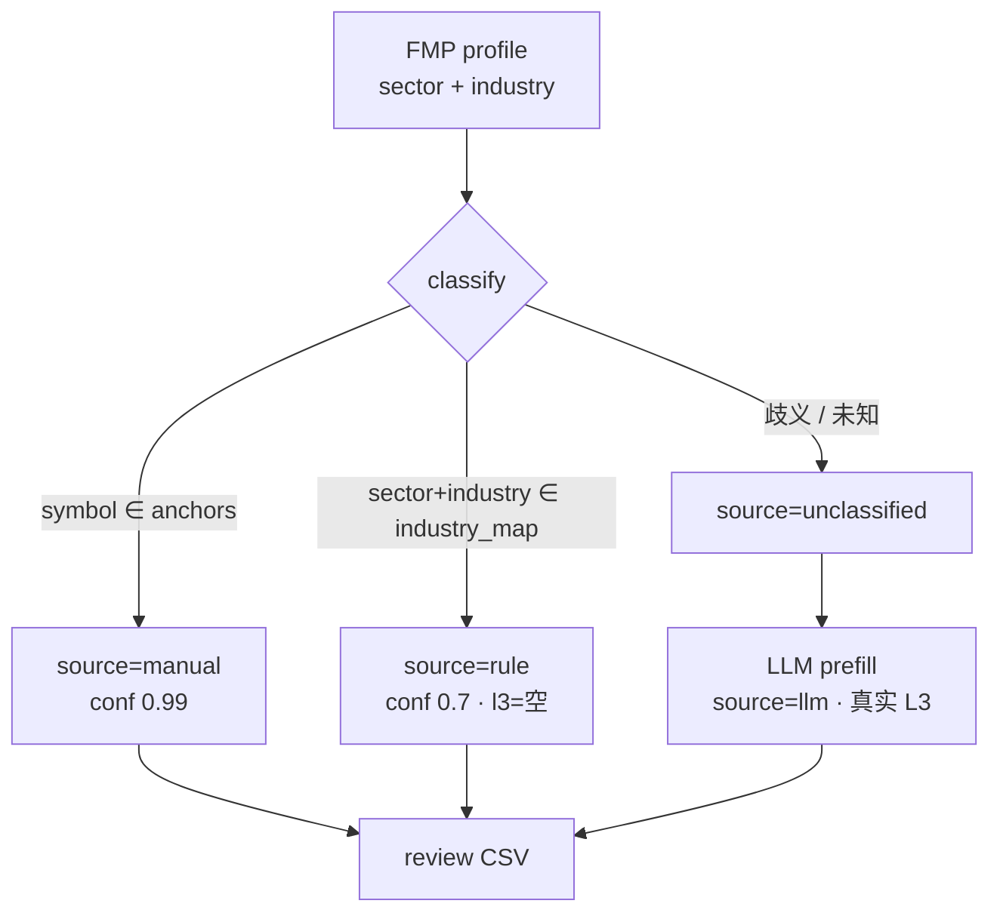
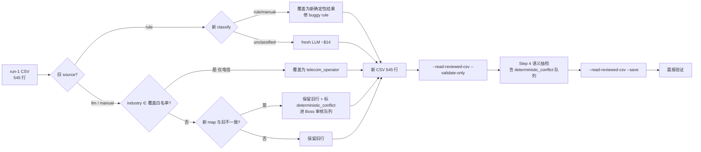

# Concept Rule 分类器重建 — FMP industry 精确映射表 + 电信运营商 L2

> **类型**: Bug fix / data-quality re-plan（跳过架构阶段 — 不引入新子系统）
> **上位 plan**: [`2026-05-13-concept-taxonomy-v2-impl.md`](2026-05-13-concept-taxonomy-v2-impl.md) Task 13
> **状态**: 待 Boss 审批 — 先别实现
> **北极星对齐**: 分析层 / Concept Registry。本 plan 不改方向，是把实现拉回 spec
> `concept_taxonomy_v2_spec.md` §7.3 priority-2 的原始设计「keyword rule（FMP industry
> → L1+L2 **直推**）」—— 当前实现错做成了「全文 substring 匹配」。

---

## 1. 问题陈述

Task 13 Step 3 全量 533 dry-run 产出 `extended_pool_tags_2026-05-15.csv`（545 行）后，
Step 4 人工审改发现 `prefill_source=rule` 的 347 行大面积错分（issue 025）：

- BRK→餐饮、SO→数据中心网络设备、ALL→消费电子、IBKR→矿业、~20 电力公用→新能源。
- 跨 sector 可检出的硬错 ≥30；同 sector 内隐藏误命中查不出，真实错误率更高。

**两个叠加根因**（`terminal/company_concepts.py:120-135`）：

1. `_text()`（line 174-181）把 `description` 自由文本拼进匹配语料 → 财团/宽泛业务公司
   的描述偶然撞上无关行业关键词。
2. `keyword_rules`（51 条）首个命中即返回，列表顺序敏感，宽泛关键词饿死精确规则。
3. **本 plan 新发现**：`keyword_rules` 关键词用 yfinance 风格破折号（`utilities—regulated
   electric`、`bank—diversified`），但 `--refresh-profiles` 拉的是 **FMP** profile，FMP
   industry 用连字符（`Regulated Electric`、`Banks - Diversified`）。所以现在多数 `rule`
   命中根本不是靠 industry 匹配，而是靠 description 子串撞上 —— 字面修 `_text()` 范围会让
   大量行掉 unclassified。

并行问题：电信运营商（VZ/T/TMUS/VOD/VIV/CHT，FMP `Telecommunications Services` 11 只）
在 v2 taxonomy 无合适 L2 桶。

## 2. 已锁定决策（Boss 2026-05-16）

| 决策 | 选择 | 说明 |
|------|------|------|
| issue 025 修复方案 | **A+ 重建为精确映射表** | 弃用 substring `keyword_rules`，改 FMP `(sector,industry)→(l1,l2)` 精确查表；明确 industry 直推 `rule`，歧义 industry 路由 LLM |
| 电信缺桶 | **新增 L2 `telecom_operator` 挂 `internet_software`** | SSOT 变 11 L1 / **61** L2 / 42 L3 |

### 2.1 方案对比（决策留痕）

| 方案 | 做法 | 否决理由 |
|------|------|----------|
| A 字面版 | 只改 `_text()` 不匹配 description，保留 substring 规则 | em-dash 关键词对不上 FMP 连字符 → 大量行掉 unclassified→LLM，keyword 表仍乱 |
| **A+（采纳）** | substring 规则整体换成 FMP industry 精确查表 | 确定性、可审计、零顺序敏感、根治；改动较大但一次到位 |
| B 全量 LLM | 347 rule 票全走 LLM | +~$70/次，每次刷新都贵且撞限流 |
| C 只重分 30 | 检出冲突单独 LLM | 同 sector 内隐藏误命中修不到，下次刷新复发 |
| D 手改 CSV | Boss 手工改 30+7 | 根因不修，复发 |

## 3. 设计

### 3.1 数据：`industry_map`（SSOT 新 section）

`config/concepts/concept_taxonomy_v2.json` 删 `keyword_rules`，加 `industry_map`。
键 = `"<sector>|<industry>"`（FMP 原始大小写），值 = `{"l1": ..., "l2": ...}`。

- **命中** → `source="rule"`, `confidence=0.7`, `l3_themes=[]`, `business_role=""`。
- **未命中**（歧义 industry / 新 industry / 空 sector）→ `source="unclassified"` →
  builder 的 LLM prefill 接管（行为不变）。

歧义 industry **故意不入 map**（缺席即 LLM），不需显式 `route` 标记。
完整草案 82 个 pair 见 §8 附录（已对 533 profile 验证：405 直推 / 151 歧义）。

### 3.2 代码：`ConceptRegistry.classify()` 重写

```
classify(item):
  1. symbol ∈ multi_segment_anchors  → source="manual"   (不变)
  2. (sector,industry) ∈ industry_map → source="rule"    (新：精确查表)
  3. 否则                            → source="unclassified"
```

- 删 `_keyword_rules` 加载与 substring 循环；加 `_industry_map` 加载。
- `__init__` 必需 key 校验（line 37）：`keyword_rules` → 改为要求 `industry_map`。
- `_text()` 不再被 classify 使用 —— 保留或删除（倾向删，无其它调用方，执行时 grep 确认）。
- `keyword_rules` property（line 82-83）：保留并返回 `[]`（防下游 import 崩），或随调用方
  一起删 —— 执行时 grep `keyword_rules` 全仓确认。

### 3.3 数据：电信运营商 L2

`concepts` 数组加一条：
```json
{"concept_id": "telecom_operator", "label": "电信运营商", "level": 2,
 "parent_id": "internet_software", "concept_type": "evergreen", "status": "active"}
```
`industry_map` 加 `"Communication Services|Telecommunications Services" → internet_software/telecom_operator`。

### 3.4 架构图



### 3.5 重跑业务流程图



### 3.6 重跑策略与成本（关键 — 第 3 轮修订）

> **Boss 第 2 轮 P0 修正**：第 2 版「新旧不一致即覆盖」太宽 —— run-1 的 `llm` 行是
> LLM 读 description 做的判断，常常**比粗粒度 industry map 更准**（DLR/EQIX 是数据中心
> REIT 不是普通地产 REIT；COIN 是加密交易所不是普通金融交易所；VEEV 是生命科学
> 企业 SaaS 不是医保服务）。自动覆盖 = 用粗映射抹掉细判断，至少 29 行坏回归。

正确策略：**按旧 source 分流**，绝不自动覆盖 `llm` 判断（电信白名单除外）：

| 旧 source | 新 classify / 条件 | 动作 | 成本 |
|---|---|---|---|
| `rule` | 新 `rule`/`manual` | 用新确定性结果覆盖（修 buggy substring 命中） | $0 |
| `rule` | 新 `unclassified`（industry 不在 map） | 走 fresh LLM | ~$0.2/次 |
| `llm` | industry ∈ **覆盖白名单** | 覆盖为新确定性结果 | $0 |
| `llm` | 非白名单 · 新 map 与旧 (l1,l2) **不一致** | **保留旧行** + `review_reason="deterministic_conflict"` 进 Boss 审核队列 | $0 |
| `llm` | 非白名单 · 一致或新 unclassified | 保留旧行 | $0 |
| `manual` | 任意 | **永远逐字节透传**（anchor 是最高优先级，除非 Boss 显式改 anchor） | $0 |

**覆盖白名单** = `{"Communication Services|Telecommunications Services"}` —— 只含
「正确桶是本次新增、run-1 时 LLM 无从选择」的 industry。telecom_operator 是本 plan
唯一新增 L2，故白名单当前仅此一项。其余 industry 即使新旧不一致也**不自动覆盖**，
而是进 `deterministic_conflict` 队列让 Boss 在 Step 4 逐行裁决。
**白名单覆盖只作用于旧 `source=llm` 行**；旧 `source=manual`（anchor）永远透传，
不受白名单影响 —— anchor 是最高优先级，只有 Boss 显式改 anchor 才动（Boss P2-1）。

这套逻辑：①修 347 个 buggy rule 行；②修电信 llm 错分（白名单覆盖）；③**不抹掉
正确的 LLM 判断**（DLR/COIN/VEEV 等保留）；④把 **21 个**非电信冲突显式交 Boss，不静默降级。

> **实测**（§8 map 套 run-1 CSV）：电信白名单覆盖 **8 票**（T/TBB/TMUS/VIV/VOD/VZ/CHTR/CHT），
> `deterministic_conflict` 队列 **21 行**。队列内容印证 Boss 判断 —— DLR/EQIX(数据中心运营)、
> COIN(加密交易所)、VEEV(企业SaaS) 等旧 llm 判断明显优于粗 map，必须保留交 Boss 裁决。
> 队列也暴露了 §8 map 几处可改进项（`Waste Management→industrial_automation`、
> `Industrial - Machinery` 把 CARR/JCI 这类暖通/楼宇也收进来），建议 Boss 审 §8 时一并看。

已对 run-1 CSV + profiles 精算：fresh LLM ≈ **69 次 ≈ $14**（旧 rule 行里 industry
不在 map 的部分）；电信白名单覆盖 0 成本；冲突队列 0 LLM。69 < issue 026 的 ~161 限流
阈值，单批 `claude -p` 可跑完，失败的按 issue 026 #4 retry。**Task 13 累计成本 $45 → ~$59。**

不做 issue 026 #2（prefill 改 SDK + caching）—— 69 次未到 justify 重构的量，留作未来。

**(l1,l2) 比对实现**：CSV 的 `l1`/`l2` 列存中文 label，`classify()` 返回 concept_id。
比对时用 registry 的 `_concepts_by_id` 反查 label→id 后比 id。

### 3.7 重跑机制：builder 加 `--reclassify <csv>` 模式

issue 026 #4 教训：长流程必须有重跑入口。新增 `--reclassify <input_csv>` 模式：

- 读入 CSV（545 行）；逐行按 §3.6 表格逻辑决定「覆盖 / 保留 / 走 LLM」。
- **保留** = 该 CSV 行**逐字节透传**到输出（不解析回内部 row dict，避免 label↔id 转换歧义）。
- **覆盖 / 走 LLM** = 用新结果重新渲染该行。
- 写出新 CSV（路径由 `--review-csv` 指定）+ `_manifest.json`；**manifest `full_universe`
  记录全部 545 symbol**（含透传行），否则 `apply_reviewed_csv` coverage union 会漏。
- 复用、可审计，未来任何 industry_map 调整都能重跑。

**CLI 语义（Boss 指定，消除 3.7/Task9 混乱）**：
| 阶段 | 命令 |
|---|---|
| 产新 CSV | `--reclassify <old.csv> --review-csv <new.csv> --dry-run` |
| 结构校验 | `--read-reviewed-csv <new.csv> --validate-only` |
| 写库 | `--read-reviewed-csv <new.csv> --save` |

`--reclassify` 只负责「读旧 CSV → 重算 → 写新 CSV」，**不碰 validate/save**；validate/save
沿用现有 `--read-reviewed-csv` 路径（builder line 1102）。

## 4. 风险自证

- **最大风险**：`industry_map` 草案对某些 industry 的 L2 判断有偏（如 `Oil & Gas
  Midstream→integrated_oil`，中游不完全等于综合油气；`Auto - Manufacturers→ev_oem`
  纯 ICE 车企归到「电动车整车」略勉强）。**缓解**：①§8 草案逐条 Boss 审批；②Step 4
  语义抽检仍保留；③确定性查表错了也是「整类一致地错」，一改就全对，不像 substring
  那样零散随机错。
- **为什么不用更简单的 C/D**：C/D 不修根因，下次 `--refresh-profiles` 重跑必复发；
  本 bug 已经吃掉一次 $45 全量跑，复发成本比一次性根治高。
- **测试风险**：现有测试断言 `industry="Semiconductors" → source="rule"`
  （`test_company_concepts.py:35`、`test_concept_v2_integration.py:209`）。A+ 下
  Semiconductors 是歧义 industry → `unclassified`/LLM。测试 fixture 必须改用真正在
  map 内的 industry（如 `Aerospace & Defense`）测 rule 分支，用 `Semiconductors`
  测 LLM 分支。已纳入 Task 5。

## 5. Checklist

> ⚠️ **Task 1 + Task 2 必须在同一 commit / 同一 working session 内完成**（审查
> P0 B-1）：`company_concepts.py:37` 校验 `keyword_rules` 必须存在，taxonomy 一旦删
> `keyword_rules` 而代码未同步，所有 `ConceptRegistry(...)` 实例化立刻 `ValueError`。
> 中间态**不要跑 pytest**。

### Task 1 — taxonomy SSOT 改造（与 Task 2 atomic）
- [ ] 1.1 `concept_taxonomy_v2.json` `concepts` 加 `telecom_operator`（level 2，parent `internet_software`）
- [ ] 1.2 删 `keyword_rules`，加 `industry_map`（§8 全 **82** pair）。
  **JSON key 必须是 FMP 原始 industry 字符串** —— 转录 §8 表格时去掉 `⚠️` 标记和 markdown 粗体，
  否则 key 对不上 profile 的 `industry` 字段（审查 P2）
- [ ] 1.3 `multi_segment_anchors` 保持不动
- **验收**: `python -m json.tool` 通过；L1=11 / L2=61 / L3=42；`industry_map` 82 键无重复；
  脚本断言每个 key 都能在 `profiles.json` 的某条 `f"{sector}|{industry}"` 中找到

### Task 2 — `ConceptRegistry` 重写（与 Task 1 atomic）
- [ ] 2.1 `__init__` 必需 key 校验：`keyword_rules` → `industry_map`
- [ ] 2.2 加 `_industry_map` 加载（键归一化策略：原样 `f"{sector}|{industry}"`，大小写敏感）
- [ ] 2.3 `classify()` rule 步改精确查表；删 substring 循环
- [ ] 2.4 grep 全仓 `keyword_rules` / `ConceptRegistry._text`（范围含 `*.py` + `*.md` + `*.json`）确认下游不崩；
  注意 `concept_classifier.py:124/145` 的 `_text` 是 **`ConceptClassifier` 独立类的方法**，与 `ConceptRegistry._text` 无关，不要误删
- [ ] 2.5 `build_company_concept_registry.py:read_reviewed_csv` 两处硬编码错误串 `"not in 60 L2"`（line ~654 / ~714）改为动态计数或 `"not in L2 pool"`（审查 R-4 / M-4）
- **验收**: `classify({"sector":"Utilities","industry":"Regulated Electric"})` →
  `realestate_utility/power_utility` source=rule；`classify({"industry":"Semiconductors"})`
  → unclassified

### Task 3 — builder `--reclassify` 模式
- [ ] 3.1 `scripts/build_company_concept_registry.py` 加 `--reclassify <input_csv>` 参数；
  与 `--review-csv <out>` `--dry-run` 配合（CLI 语义见 §3.7 表格）
- [ ] 3.2 逐行按 §3.6 **分流表**处理（旧 source 分流，非「不一致即覆盖」）：
  旧 `rule` → 重 classify（rule/manual 覆盖，unclassified 走 LLM）；
  旧 `llm` 且 industry∈白名单 → 覆盖；
  旧 `llm` 非白名单且与新 map 冲突 → 透传 + 标 `review_reason="deterministic_conflict"`；
  旧 `manual` → 永远逐字节透传；其余 → CSV 行逐字节透传
- [ ] 3.3 覆盖白名单 = `{"Communication Services|Telecommunications Services"}`，写成 builder 内常量并加注释
- [ ] 3.4 **重渲染（覆盖 / 走 LLM）的行只改分类相关列**（`l1/l2/l3_themes/business_role/
  prefill_source/confidence/needs_review/display_tags`），**保留原 CSV 的 metadata 列原值**
  （`company_name/description/market_cap_b/mcap_tier/fmp_sector/fmp_industry/boss_notes`）——
  当前 CSV 87 行 `market_cap_b/mcap_tier` 非空，不能因重渲染清空（Boss P2-2）
- [ ] 3.5 输出新 CSV（`--review-csv` 路径）+ `_manifest.json`；**manifest 的 `full_universe`
  记录全部 545 symbol**（含透传行），否则 `apply_reviewed_csv` coverage union 会漏（审查 B-3）
- **验收**: 用 run-1 CSV 跑 `--reclassify --dry-run`，输出 545 行；
  电信 8 票（T/TBB/TMUS/VIV/VOD/VZ/CHTR/CHT）被覆盖为 `internet_software/telecom_operator`；
  DLR/EQIX/COIN/VEEV 旧 llm 行**逐字节不变**（仅可能被标 `deterministic_conflict`）；
  `deterministic_conflict` 行数打印出来供 Boss 预览；manifest `full_universe` = 545

### Task 4 — issue 026 #1 低成本修复（顺手）
- [ ] 4.1 `llm_concept_prefill.py:_run_claude_cli` 失败时同时记 `stdout`（错误真实所在）
- **验收**: 单测 mock rc=1 + stdout 有内容 → 日志包含 stdout 片段

### Task 5 — 测试更新
- [ ] 5.1 `test_company_concepts.py`：rule 分支 fixture 改用 map 内 industry（如 `Aerospace & Defense`）；
  原 `Semiconductors` fixture（line 26-36，**靠 description 子串命中**）改成测 unclassified 分支，
  description 字段一并清掉（审查 R-1）
- [ ] 5.2 `test_concept_v2_integration.py:209`：NVDA fixture industry 改后走 LLM，需**同步更新 `prefill_one` mock 返回值**，
  断言 source 从 `rule` 改为 `llm`（审查 R-2）
- [ ] 5.3 `test_concept_taxonomy_v2_json.py:23`：L2 断言 60→61
- [ ] 5.4 `test_concept_v2_cli_semantics.py` line 565 POET：Semiconductors 变歧义后走 LLM，
  **必须加 `prefill_one` mock patch**，否则测试真调 `claude` CLI（审查 R-3 / M-3）
- [ ] 5.5 `test_build_concept_registry.py` **全面整改**（Boss 第 2 轮 P1）：
  - `build_env` / `build_env_with_watchlist` fixture（line ~44-52）的「Rule hits」样例
    NVDA/MU 用 `Semiconductors` —— A+ 后变 unclassified。改用 map 内 industry（如
    NVDA 给 `Aerospace & Defense` 之类，或干脆造一个 `Regulated Electric` 测试票）
  - `test_build_registry_skips_llm_when_rule_hits`（line ~123）：rule-hit 样例同步换
  - `test_save_writes_concepts_113_rows`（line ~250）：113 → 114；函数名/注释同步
  - grep 该文件所有 `Semiconductors` 出现点，凡走 build_registry 且未 patch `prefill_one`
    的，要么换 industry，要么补 mock —— 杜绝真实 spawn `claude`
- [ ] 5.6 新增 `test`: industry_map 精确查表命中 + 歧义未命中 + 财团/电力不再误命中
- **验收**: `pytest tests/ -k concept -v` 全绿；全量 `pytest tests/` 中**无任何测试真实
  spawn `claude` CLI**（可临时 `which claude` 改名或断网 smoke 验证）

### Task 6 — 全量回归
- [ ] 6.1 `/Users/owen/CC workspace/Finance/.venv/bin/python -m pytest tests/ -q`
- **验收**: 0 regression（基线 1951 passed / 3 skipped）

### Task 7 — 重跑（产新 CSV）
- [ ] 7.1 `--reclassify reports/concept_registry/extended_pool_tags_2026-05-15.csv
  --review-csv reports/concept_registry/extended_pool_tags_2026-05-16.csv --dry-run`
- [ ] 7.2 产出 `extended_pool_tags_2026-05-16.csv`（覆盖 buggy rule + 电信 llm；fresh LLM ≈ 69 票）
- [ ] 7.3 LLM 失败行按 issue 026 #4 单独 retry 补回
- **验收**: 545 行；`source` 分布以实跑为准（预期 `rule` 大幅上升、`llm` 下降，**不再用固定数字
  当验收口径** —— 审查 P1）；硬门槛：**输出 CSV 0 个 `l1/l2` 留空行**

### Task 8 — Step 4 语义抽检
- [ ] 8.1 sector↔l1 一致性交叉核对（issue 025 教训：结构校验 ≠ 语义正确）
- [ ] 8.2 重点抽查原 30 个误命中是否归正 + 电信 8 票（T/TBB/TMUS/VIV/VOD/VZ/CHTR/CHT）入 `telecom_operator`
- [ ] 8.3 **逐行过 `deterministic_conflict` 审核队列**（实测 21 行）：Boss 决定每行保留旧 llm
  判断 还是 改用确定性 map 结果（DLR/EQIX/COIN/VEEV 这类预期保留旧 llm）
- [ ] 8.4 Conglomerates（BRK 等 2 票）走 LLM 单桶不理想 → Boss 决定 anchor vs 接受
- **验收**: Boss 确认无明显跨 sector 错分；`deterministic_conflict` 队列已逐行裁决

### Task 9 — save + 晨报验证
- [ ] 9.1 `--read-reviewed-csv extended_pool_tags_2026-05-16.csv --validate-only` 结构校验
- [ ] 9.2 `--read-reviewed-csv extended_pool_tags_2026-05-16.csv --save`（写前 backup market.db）
- [ ] 9.3 晨报跑一次，确认 concept 三段展示正常
- **验收**: market.db `company_concept_tags` 行数对；晨报无报错

### Task 10 — 收尾
- [ ] 10.1 issue 025 / 026 status → resolved，记修复 commit
- [ ] 10.2 commit（CSV + 代码 + taxonomy + 测试）；**push 前等 Boss 确认**
- [ ] 10.3 更新 ongoing.md

## 6. 验收标准（Boss 视角，不看代码也能判断）

1. 打开新 CSV，原来错的几个（BRK / SO / ALL / DUK / 电力公用）l1/l2 都对了。
2. VZ/T/TMUS 等显示「互联网与软件 / 电信运营商」。
3. 晨报 concept 段正常显示。
4. 全量测试绿，无回归。
5. Task 13 总成本停在 ~$59，不再失控。

## 7. 不做什么（范围边界）

- 不改 LLM prefill 为 SDK+caching（issue 026 #2，留未来）。
- 不重跑全量 533 走 LLM（只对 industry 不在 map 的旧 rule 行花新钱，≈69 票）。
- 不动云端、不动 cron。

## 8. 附录：`industry_map` 草案（82 pair，需 Boss 逐条审）

> 已对 533 FMP profile 验证：405 直推命中 / 151 歧义留 LLM。
> 标 ⚠️ 的是 L2 判断有商榷余地，请 Boss 重点看。
>
> **回应 Boss Open Question**（`Auto - Manufacturers` / `Banks - Regional` /
> `Oil & Gas Midstream` 是否该进 deterministic map）：建议**留在 map**。理由：这三类
> 不是「industry 跨多桶、需 description 消歧」的真歧义（半导体 7 子桶才是），而是
> 「taxonomy 没有完全对应的桶」—— LLM 拿到 description 也只能从同样的 6 个桶里挑，
> 给不出更好答案，反而花钱 + 撞限流。三者 **L1 都正确**（autonomy_robotics / finance /
> energy_materials），只是 L2 是「最近似桶」。确定性映射保证「整类一致」，比 LLM
> 逐票漂移更可控。**真正的根因是 taxonomy 缺桶**（区域银行 / 油气中游 / 传统车企）——
> 这是独立的 taxonomy 设计问题，建议另开条目，不在本 plan 解决。Boss 若不认同可在此批注。

| sector | industry | → l1 | → l2 |
|--------|----------|------|------|
| Basic Materials | Agricultural Inputs | energy_materials | agriculture_fertilizer |
| Basic Materials | Chemicals | energy_materials | chemicals_gases |
| Basic Materials | Chemicals - Specialty | energy_materials | chemicals_gases |
| Basic Materials | Construction Materials | realestate_utility | industrial_materials |
| Basic Materials | Copper | energy_materials | mining_metals |
| Basic Materials | Gold | energy_materials | mining_metals |
| Basic Materials | Industrial Materials | realestate_utility | industrial_materials |
| Basic Materials | Steel | energy_materials | mining_metals |
| Communication Services | Electronic Gaming & Multimedia | internet_software | gaming_interactive |
| Communication Services | Entertainment | internet_software | streaming_content |
| Communication Services | Telecommunications Services | internet_software | **telecom_operator** |
| Consumer Cyclical | Apparel - Footwear & Accessories | consumer_retail | consumer_discretionary_brand |
| Consumer Cyclical | Apparel - Retail | consumer_retail | consumer_discretionary_brand |
| Consumer Cyclical | Auto - Manufacturers ⚠️ | autonomy_robotics | ev_oem |
| Consumer Cyclical | Home Improvement | consumer_retail | home_improvement |
| Consumer Cyclical | Luxury Goods | consumer_retail | consumer_discretionary_brand |
| Consumer Cyclical | Restaurants | consumer_retail | restaurant |
| Consumer Defensive | Agricultural Farm Products | energy_materials | agriculture_fertilizer |
| Consumer Defensive | Beverages - Alcoholic | consumer_retail | consumer_staples |
| Consumer Defensive | Beverages - Non-Alcoholic | consumer_retail | consumer_staples |
| Consumer Defensive | Beverages - Wineries & Distilleries | consumer_retail | consumer_staples |
| Consumer Defensive | Discount Stores | consumer_retail | big_box_retail |
| Consumer Defensive | Food Confectioners | consumer_retail | consumer_staples |
| Consumer Defensive | Food Distribution | consumer_retail | consumer_staples |
| Consumer Defensive | Grocery Stores | consumer_retail | big_box_retail |
| Consumer Defensive | Household & Personal Products | consumer_retail | consumer_staples |
| Consumer Defensive | Packaged Foods | consumer_retail | consumer_staples |
| Consumer Defensive | Tobacco | consumer_retail | consumer_staples |
| Energy | Oil & Gas Equipment & Services | energy_materials | oil_services |
| Energy | Oil & Gas Exploration & Production | energy_materials | integrated_oil |
| Energy | Oil & Gas Integrated | energy_materials | integrated_oil |
| Energy | Oil & Gas Midstream ⚠️ | energy_materials | integrated_oil |
| Energy | Oil & Gas Refining & Marketing | energy_materials | integrated_oil |
| Financial Services | Asset Management | finance | asset_management |
| Financial Services | Asset Management - Global | finance | asset_management |
| Financial Services | Banks - Diversified | finance | mega_bank |
| Financial Services | Banks - Regional ⚠️ | finance | mega_bank |
| Financial Services | Financial - Capital Markets | finance | investment_bank |
| Financial Services | Financial - Credit Services | finance | payment_fintech |
| Financial Services | Financial - Data & Stock Exchanges | finance | broker_exchange |
| Financial Services | Financial - Mortgages | finance | mega_bank |
| Financial Services | Insurance - Brokers | finance | insurance |
| Financial Services | Insurance - Diversified | finance | insurance |
| Financial Services | Insurance - Life | finance | insurance |
| Financial Services | Insurance - Property & Casualty | finance | insurance |
| Financial Services | Investment - Banking & Investment Services | finance | investment_bank |
| Healthcare | Biotechnology | pharma_life_sci | innovative_biotech |
| Healthcare | Drug Manufacturers - General | pharma_life_sci | large_pharma |
| Healthcare | Drug Manufacturers - Specialty & Generic | pharma_life_sci | large_pharma |
| Healthcare | Medical - Care Facilities | pharma_life_sci | health_services |
| Healthcare | Medical - Devices | pharma_life_sci | medical_device |
| Healthcare | Medical - Diagnostics & Research | pharma_life_sci | life_sci_tools_cro |
| Healthcare | Medical - Distribution ⚠️ | pharma_life_sci | health_services |
| Healthcare | Medical - Healthcare Information Services | pharma_life_sci | health_services |
| Healthcare | Medical - Healthcare Plans | pharma_life_sci | health_services |
| Healthcare | Medical - Instruments & Supplies | pharma_life_sci | medical_device |
| Healthcare | Medical - Pharmaceuticals | pharma_life_sci | large_pharma |
| Industrials | Aerospace & Defense | industrial_aerospace | aerospace_defense |
| Industrials | Agricultural - Machinery | industrial_aerospace | heavy_machinery |
| Industrials | Airlines, Airports & Air Services | industrial_aerospace | airlines |
| Industrials | Construction | industrial_aerospace | engineering_construction |
| Industrials | Engineering & Construction | industrial_aerospace | engineering_construction |
| Industrials | Industrial - Distribution | industrial_aerospace | industrial_automation |
| Industrials | Industrial - Machinery | industrial_aerospace | industrial_automation |
| Industrials | Integrated Freight & Logistics | industrial_aerospace | logistics_shipping |
| Industrials | Oil & Gas Midstream ⚠️ | energy_materials | integrated_oil |
| Industrials | Railroads | industrial_aerospace | logistics_shipping |
| Industrials | Trucking | industrial_aerospace | logistics_shipping |
| Industrials | Waste Management ⚠️ | industrial_aerospace | industrial_automation |
| Real Estate | REIT - Diversified | realestate_utility | residential_commercial_reit |
| Real Estate | REIT - Healthcare Facilities | realestate_utility | residential_commercial_reit |
| Real Estate | REIT - Industrial | realestate_utility | residential_commercial_reit |
| Real Estate | REIT - Mortgage | realestate_utility | residential_commercial_reit |
| Real Estate | REIT - Office | realestate_utility | residential_commercial_reit |
| Real Estate | REIT - Retail | realestate_utility | residential_commercial_reit |
| Real Estate | REIT - Specialty | realestate_utility | comm_infra_reit |
| Utilities | Diversified Utilities | realestate_utility | power_utility |
| Utilities | Independent Power Producers | realestate_utility | power_utility |
| Utilities | Regulated Electric | realestate_utility | power_utility |
| Utilities | Regulated Gas | realestate_utility | power_utility |
| Utilities | Regulated Water | realestate_utility | power_utility |
| Utilities | Renewable Utilities | energy_materials | clean_energy |

**故意留 LLM 的歧义 industry**（151 票）：Semiconductors(33) / Software-Application(16) /
Communication Equipment(12) / Software-Infrastructure(11) / Hardware Equipment & Parts(11) /
Specialty Retail(10) / Internet Content & Information(7) / Travel Services(6) / IT Services(6) /
Computer Hardware(5) / Electrical Equipment & Parts(4) / Auto-Parts(4) / Specialty Business
Services(4) / 其余各 ≤2。理由：industry 信号定不了 L2（半导体 7 个子桶 / 软件多个 SaaS
子桶），交给 LLM 读 description 判断。
