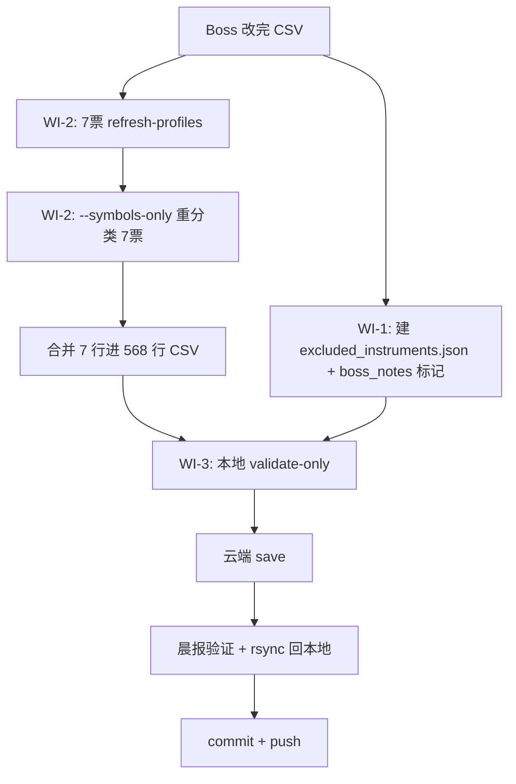

# Concept Registry reviewed CSV 重新落库 + ETF 排除 + 缺-profile 美股修复

> 计划日期: 2026-05-17 | 状态: **待 Boss 批注，先别实现**
> 上游: 活跃任务 "Concept 注册表 reviewed CSV — Boss 手动修订待重新落库"

## 北极星对齐

属 **Terminal Desk / Concept Registry** 基础设施维护，非新增子系统。不触动北极星四层结构。
对齐 `docs/design/concept_taxonomy_v2_spec.md` Rev 3.1 的 reviewed-CSV 落库管线。

## 背景

Boss 手动修订 `reports/concept_registry/extended_pool_tags_2026-05-17.csv`（568 行）期间发现两个数据质量问题：

1. **ETF / 非美股混入** — `03032`、`07709`（港股恒生科技 ETF）、`DRAM`（Boss 标记为 ETF）。这些不是公司，日后基于注册表做概念聚类时应排除。
2. **缺-profile 美股硬猜** — 共 10 行 FMP profile 全空，LLM 仅凭 ticker 字符串分类。除上述 3 个 ETF 外，剩 7 个是真美股：`POET OKLO MXL TTD AAL SOFI IREN`，分类不可靠（OKLO 恰好猜对，其余存疑）。

Boss 决定：ETF 保留行但打排除标记；7 票真美股 refresh-profile 后重分类。

## 工作项

### WI-1 — ETF / 非美股排除标记

**目标**：`03032 / 07709 / DRAM` 保留在 reviewed CSV 与注册表中，但带一个机器可读的"排除标记"，未来概念聚类消费方据此过滤。

> ⚠️ 现状：概念聚类消费方**尚不存在**（Boss 原话"日后…做概念聚类时"）。`company_concept_tags` 无 `instrument_type` 列；`boss_notes` 列在 CSV 但不落 DB。

#### 方案 A（推荐）— 独立排除配置 `config/concepts/excluded_instruments.json`

- 新建 `config/concepts/excluded_instruments.json`，记录 `{symbol, reason}` 三条
- CSV 三行的 `boss_notes` 填 `ETF-EXCLUDE`（人类可读痕迹）
- 注册表 DB 数据不变（3 行照常 upsert，schema 零改动）
- 未来聚类消费方读此 config 做过滤集
- **优点**：零 schema 迁移、零 CSV schema 改动、可逆；恰是废弃 worktree 前就存在的设计（`config/concepts/{excluded_instruments,...}.json`），属"复用既有模式"非新发明
- **缺点**：排除信息与注册表行物理分离，靠 symbol 关联

#### 方案 B — `company_concept_tags` 加 `instrument_type` 列

- DDL 迁移：`company_concept_tags` 加 `instrument_type TEXT`（默认 NULL=股票）
- reviewed CSV 加第 17 列 `instrument_type`；改 `read_reviewed_csv` / `apply_reviewed_csv` / `save_to_market_db` / manifest 渲染
- 3 个 ETF 行该列填 `ETF`
- **优点**：标记随行存在注册表内，聚类直接 `WHERE instrument_type IS NULL`
- **缺点**：为 3 行做 schema 迁移 + 改 ~5 个文件 + 改既有 16 列 CSV 契约，消费方还不存在 → 过早工程化

**CC 建议**：方案 A。聚类消费方不存在时，config 是比例适当且可逆的选择；真到建聚类那天若需 DB 字段再迁移不迟。请 Boss 批注定夺。

### WI-2 — 7 票缺-profile 美股 refresh + 重分类

`POET OKLO MXL TTD AAL SOFI IREN` —— FMP profile 全空导致 LLM 硬猜。

**步骤**：
1. 建 7 票 universe JSON：`reports/concept_registry/relodge7_universe_2026-05-17.json`
2. `python -m scripts.build_company_concept_registry --refresh-profiles --extended-universe-path relodge7_universe_2026-05-17.json`
   - `refresh_profiles()` 是 merge 语义（`build_company_concept_registry.py:178-191`）→ 只重拉这 7 个，合并进 `data/fundamental/profiles.json`，不影响其余 ~533
   - 仅调 FMP，不碰 DB，可本地跑
3. **代码改动**：builder 新增 `--symbols-only` flag —— 传该 flag 时 `build_registry` 不再 union `portfolio / broad_top / watchlist`（`build_company_concept_registry.py:1510-1528` 的 union 是上次 24→107 票膨胀、$14 LLM 浪费的根因）
4. `--symbols relodge7_universe_2026-05-17.json --symbols-only --dry-run` 分类这 7 个
   - profile 补全后多数应命中 rule 分类器（FMP `(sector,industry)` 精确查表，零 LLM）；仅真不可分的走 LLM（7 票全 LLM 上限 ≈ $1.4）
5. 把 7 行新分类结果**合并**进 568 行 reviewed CSV（替换原 7 行 stale 数据），沿用 new24 批次的合并先例

> 风险：部分 ticker FMP 可能确实无 profile 覆盖（POET/IREN 等小盘/海外注册）。refresh 后仍空的，标注 boss_notes 由 Boss 人工裁定，不阻塞落库。

### WI-3 — reviewed CSV 重新落库

前置：Boss 完成 CSV 修订 + WI-1/WI-2 合并完毕。

```
1. 本地 --validate-only        校验 568 行（L1/L2/L3 闭集 + extend_pool 覆盖）
2. 云端 --save                 ssh -4 -b 192.168.1.121 aliyun（已知 workaround）
                               --read-reviewed-csv extended_pool_tags_2026-05-17.csv
                               --extended-universe-path extended_pool_tags_2026-05-17_universe.json
3. 晨报验证                    get_report_concept_classifier() 从注册表解析、不 fallback
4. rsync market.db 回本地
5. commit + push               data(concept) + 本计划 + WI-1 config + WI-2 代码
```

## 执行流程



## 替代方案对比（整体）

| 方案 | 描述 | 取舍 |
|------|------|------|
| 本计划 | ETF 打标(config) + 7 票 refresh 重分类 + 落库 | 数据质量最优，需 1 处小代码改动(`--symbols-only`) |
| 极简：直接落库 | 不管 ETF / 缺-profile，原样落 568 行 | 零工作量，但 ETF 污染聚类、7 票分类不可靠遗留 |
| 删行：ETF/缺-profile 全删 | 从 CSV 删 10 行只落 558 | 简单，但丢失 7 个真美股、Boss 已否决删 ETF 行 |

## 风险自证

- **最大风险**：WI-2 refresh 后部分 ticker FMP 仍无 profile → 缓解：不阻塞，转人工裁定。
- **为何不用更简单做法**：极简方案让 ETF 永久污染聚类基础数据；`--symbols-only` 不做则重分类再次触发 107 票 union、$14 浪费——这是上次已踩的坑，必须修。
- **`--symbols-only` 会不会影响既有 cron**：不会，新 flag 默认关闭，既有 `--symbols extended` 全量路径行为不变。

## 验收标准

- [ ] `excluded_instruments.json` 含 3 条，JSON 合法，schema 自洽（WI-1 方案 A）
- [ ] 7 票 refresh 后 `profiles.json` 对应条目 `sector/industry/description` 非空（FMP 有覆盖者）
- [ ] `--symbols-only` 重分类实跑 LLM 次数 ≤ 7（对比上次 71 次）
- [ ] `--validate-only` 输出 `568 rows parsed`，无 `_rejected.csv`
- [ ] 云端 `company_concept_tags` 行数 = CSV 行数；晨报 concept 三段展示从注册表解析、不 fallback
- [ ] 本地 market.db 与云端一致（rsync 后校验）

## 实现 Checklist

- [x] WI-1: 建 `config/concepts/excluded_instruments.json`（方案 A，3 条 03032/07709/DRAM）
- [ ] WI-1: CSV 三行 `boss_notes` 填 `ETF-EXCLUDE`（待 CSV 定稿）
- [x] WI-2: 建 `relodge7_universe_2026-05-17.json`
- [x] WI-2: 跑 `--refresh-profiles`（7 票，profiles.json 575→582）
- [x] WI-2: 加 `--symbols-only` flag + 测试（commit `42b69fd`，104 tests pass，已 merge main）
- [x] WI-2: 重分类 7 票（`--symbols-only` 实跑 3 LLM；输出 `relodge7_tags_2026-05-17.csv`）
- [ ] WI-2: 合并 5 行进 reviewed CSV（POET/MXL/TTD/AAL/SOFI；OKLO/IREN 保留现值——见下）（待 CSV 定稿）
- [ ] WI-3: 本地 validate-only
- [ ] WI-3: 云端 save
- [ ] WI-3: 晨报验证 + rsync
- [ ] WI-3: commit + push + 更新 ongoing.md

## 执行记录（2026-05-17）

- WI-2 重分类 7 票结果：POET/MXL → LLM 改善；TTD → 与旧值一致；AAL/SOFI → rule 命中
  L1/L2 正确（丢 `利率敏感` L3，Boss 裁定接受不补）；**OKLO/IREN → rule 被 FMP 错误
  行业标签带偏**（OKLO 被标 Regulated Electric、IREN 被标 Capital Markets），Boss 裁定
  保留重分类前旧值。详见 `docs/issues/028`。
- ⇒ merge 时只替换 **POET / MXL / TTD / AAL / SOFI 5 行**，OKLO / IREN 不动。
- ⏸ 阻塞：reviewed CSV 仍在 Boss 手中编辑，且 Boss 表示"CSV 这部分需单独再讨论"。
  WI-1 boss_notes 标记 + WI-2 行合并 + 全部 WI-3 均待 CSV 定稿后继续。

## 2026-05-17 续：L3 概念簇闭集重构（对话中 re-scope）

Boss 复核 CSV 时发现 LITE/COHR 等光通信票未被打上光模块标签 → 暴露 L3 词表
本身的粒度与一致性问题。Boss 揭示真实用途：晨报按概念簇做量价动量热度排名 +
（未来）按簇比 forward PE。结论：概念簇 = L3 主题层，需重构。

**决定的工作流**：Boss 直接在 CSV `l3_themes` 列手写概念 → CC 派生 distinct 集 →
整合复核 → 形成新闭集 SSOT。L1/L2 不动，DB schema 不动。

**执行结果**：
- Boss 手编 CSV：L3 派生出 39 个 distinct 概念（新增 光通信/存储/CPU，淘汰 6 个
  0 成员旧概念）。
- 整合复核：5 个成员过少的概念合并 — `AI模型层→AI应用层`、`HBM→存储`、
  `人形机器人→自动驾驶/FSD`、`储能→能源转型`、`FDA审批催化` drop。4 个无损删 token。
- SSOT `concept_taxonomy_v2.json` v2.0→**v2.1**：L3 42→**34**，总 114→**106**。
  `multi_segment_anchors` 的 TSLA 条目引用已删 id（humanoid_robotics/energy_storage）
  → 修正为 autonomy_fsd/energy_transition。
- 6 个 count 断言测试同步修正（42→34 / 114→106），**129 concept tests 全过**。
- `--validate-only`：568 行 parsed，0 拒绝行。
- WI-1 boss_notes 标记 **de-scope**：`excluded_instruments.json` 已是机器可读 SSOT，
  CSV 内再加 boss_notes 纯冗余，略过。
- relodge 5 票对账作废：Boss 手编 CSV 时已亲自给 POET/MXL/TTD/AAL/SOFI 更准的分类，
  覆盖 relodge 输出。

**子系统 2（晨报概念簇热度动量）、3（跨簇 forward PE）** 待此闭集落库后单独 brainstorm。

## 待 Boss 批注

1. **WI-1 方案 A vs B** —— CC 建议 A（独立 config）。Boss 若坚持标记入注册表行选 B。
2. 是否在本批次顺带做 `--symbols-only`，还是单独拆一个 commit？
3. `relodge7` 重分类后若某些票仍无 profile，接受人工裁定 / 还是从 CSV 删该行？
