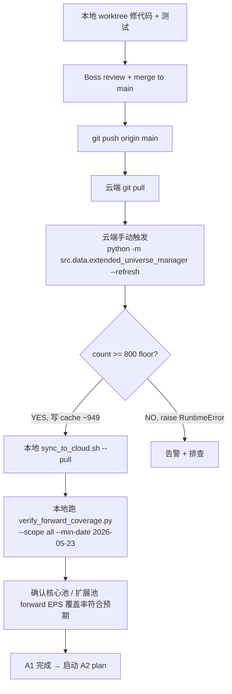
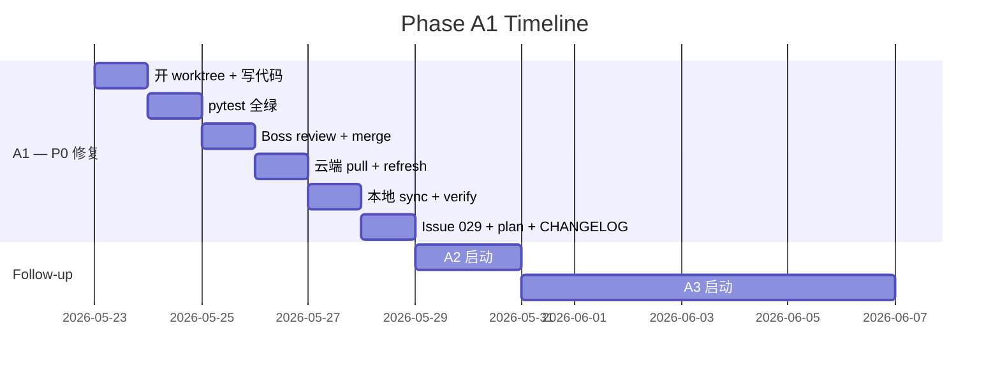

# Extended Pool Data Integrity Fix — Phase A1

> P0 数据完整性 bug 修复：FMP screener 默认 limit=1000 导致扩展池 533 ≈ "top-1000 minus ETF/Fund"，而非配置的 $10B+ 全集 (~949)。
>
> **方案 C 拆分**：A1 = bug 修复 + 池刷新 + 验证；A2 = 416 只新增票 concept 补分类（独立 plan）；A3 = 周频 concept-build cron 接入（独立 plan，依赖 A2）。

- **状态**：草案，待 Boss 审阅
- **作者**：CC (主)
- **日期**：2026-05-23
- **触发**：2026-05-21 Boss 问"概念词表里 TTMI 的 L1-L3"，发现 TTMI（市值 $17.59B）不在 concept registry / extended pool / 任何 universe
- **依赖**：无
- **后续**：A2 (concept 补分类) → A3 (周频 concept cron 接入)
- **关联文档**：
  - 触发追踪：`docs/issues/029-extended-pool-screener-limit-truncated.md`（本 plan 同步落档）
  - 治理前置：`docs/plans/2026-05-09-extended-pool-weekly-refresh.md`（修治理漏洞，没碰 limit truncation）
  - 北极星：数据层（Layer 1）数据完整性 hygiene fix

---

## 0. 范围与边界（Section 1）

### In Scope

1. `src/data/fmp_client.py:get_large_cap_stocks()` 加 `limit=SCREENER_DEFAULT_LIMIT=5000` 默认参数 + truncation sentinel warning
2. `src/data/extended_universe_manager.py:MIN_COUNT_FLOOR` 400 → 800
3. `terminal/tools/fmp_tools.py:GetLargeCapStocksTool.execute()` 同步透传 `limit`
4. 单元 + 集成测试：5 个新增 unit + 2 个新增/扩展 integration
5. 云端手动触发 `python -m src.data.extended_universe_manager --refresh`
6. 本地 `sync_to_cloud.sh --pull` 同步 `data/pool/extended_universe.json`
7. `verify_forward_coverage.py --scope all --min-date 2026-05-23` 验证 coverage
8. 落档 `docs/issues/029-extended-pool-screener-limit-truncated.md`
9. Tainted-by-Pool-533 research backlog 段落

### Out of Scope（明确不做，交给 A2/A3 或后续 plan）

- ❌ ~416 只新增 concept 补分类（→ A2 独立 plan）
- ❌ 周频 concept-build cron 接入（→ A3 独立 plan）
- ❌ 重跑下游研究（RS backtest / PMARP factor study）
- ❌ `get_screener_page()` 审计——已确认分页逻辑正确
- ❌ `scripts/check_fmp_api.py` 自定义函数——是 API 健康检查，$100B 阈值 top-1000 之内
- ❌ MarketData / FRED / Adanos 等其他第三方 API 的同类 limit 普查（记入下游 backlog）

### 影响面（grep 已核对）

| 调用点 | source line | 阈值 | A1 修复后效果 |
|------|----|----|------|
| `pool_manager.refresh_universe()` 通用池 | `src/data/pool_manager.py:150` | $100B | 不变（top-1000 内） |
| `pool_manager.refresh_universe()` 科技扩池 | `src/data/pool_manager.py:159` | $10B | **自动受益**——下次池刷新拿到完整科技 universe |
| `extended_universe_manager.refresh_extended_universe()` | `src/data/extended_universe_manager.py:87` | $10B | **A1 主修复点**——533 → ~949 |
| `scripts/rs_universe_scan.py:fetch_universe()` | `scripts/rs_universe_scan.py:64` | $10B default | **自动受益**——下次 RS scan universe ~1000 → ~1797 |
| `scripts/check_fmp_api.py:46` (custom func, 独立) | `scripts/check_fmp_api.py:46` | $100B | 不受影响（top-1000 内）|

---

## 1. 核心代码改动（Section 2）

> Plan 伪代码必须对齐真实代码——每个引用已 grep 核对并标 source line。

### 1.1 `src/data/fmp_client.py:69-83` get_large_cap_stocks 加 limit + sentinel

**改动前**（line 69-83，grep 核对）：
```python
def get_large_cap_stocks(self, market_cap_threshold: int) -> List[Dict]:
    """获取大市值股票列表"""
    params = {
        "marketCapMoreThan": market_cap_threshold,
        "exchange": "NYSE,NASDAQ",
        "isActivelyTrading": "true",
    }
    data = self._request("company-screener", params)

    if not data:
        return []

    # 过滤 ETF 和基金
    stocks = [s for s in data if not s.get("isEtf") and not s.get("isFund")]
    return stocks
```

**改动后**：
```python
# Module-level constant for testability
SCREENER_DEFAULT_LIMIT = 5000  # FMP screener page cap; ~2.8x $10B+ 全集 (1797 as of 2026-05-21)

def get_large_cap_stocks(
    self,
    market_cap_threshold: int,
    limit: int = SCREENER_DEFAULT_LIMIT,
) -> List[Dict]:
    """获取大市值股票列表

    Args:
        market_cap_threshold: 最小市值（美元）
        limit: FMP screener page size. Default 5000 覆盖当前 $10B+ 全 US universe.
            FMP 默认 limit=1000，必须显式传 limit 否则按 marketCap 降序截断。
            若未来 $10B+ 全集 > 5000，调高此 anchor 并审计 sentinel 日志。

    Returns:
        过滤掉 ETF/Fund 后的股票列表
    """
    params = {
        "marketCapMoreThan": market_cap_threshold,
        "exchange": "NYSE,NASDAQ",
        "isActivelyTrading": "true",
        "limit": limit,
    }
    data = self._request("company-screener", params)

    if not data:
        return []

    # Sentinel: 返回行数精确等于 limit = 大概率被 page 截断
    if isinstance(data, list) and len(data) == limit:
        logger.warning(
            "FMP screener returned exactly limit=%d rows for marketCapMoreThan=%d; "
            "possible truncation, increase limit or switch to get_screener_page().",
            limit, market_cap_threshold,
        )

    # 过滤 ETF 和基金
    stocks = [s for s in data if not s.get("isEtf") and not s.get("isFund")]
    return stocks
```

### 1.2 `src/data/extended_universe_manager.py:40` MIN_COUNT_FLOOR 400 → 800

```python
# Before (line 40):
MIN_COUNT_FLOOR = 400  # 73% of current 548; tune via `min_count_floor` kwarg

# After:
MIN_COUNT_FLOOR = 800  # ~84% of A1 刷新后预期 baseline ~949；防 future regression
                       # （screener truncation / FMP empty return / 池骤减都卡在此 floor）
```

**注**：4 个现有 `TestRefreshFloorGuard` 测试用 `min_count_floor=0` 显式 override，不受影响。

同步更新 docstring 注释 (line 36-39)：
```python
# Sanity floor: FMP screener API failure can return [] silently. Raise rather
# than overwrite the cache when returned count < floor (preserves old cache for
# next cron retry). Default 800 = ~84% of A1 刷新后预期 ~949; tune via
# `min_count_floor` kwarg in tests/dev paths.
```

argparse help 字符串 (line 158-159) 自动用新值，无需改：
```python
help="Refresh extended_universe.json from FMP screener (raises if "
     f"returned count < {MIN_COUNT_FLOOR})",
```

### 1.3 `terminal/tools/fmp_tools.py:215-227` 工具注册表透传 limit

```python
# Before (line 215-227):
def execute(self, market_cap_threshold: int) -> List[Dict]:
    """Execute: get large-cap stocks."""
    return self._execute_client_method(
        "get_large_cap_stocks", market_cap_threshold=market_cap_threshold
    )

# After (line 17-23 现有 try/except 块扩展 — 保持 graceful degradation):
try:
    from src.data.fmp_client import fmp_client, SCREENER_DEFAULT_LIMIT
    FMP_CLIENT_AVAILABLE = True
except ImportError:
    FMP_CLIENT_AVAILABLE = False
    fmp_client = None
    SCREENER_DEFAULT_LIMIT = 5000  # fallback；fmp_client 不可用时维持常量语义

# GetLargeCapStocksTool.execute() 改动 (line 215-227):
def execute(
    self,
    market_cap_threshold: int,
    limit: int = SCREENER_DEFAULT_LIMIT,
) -> List[Dict]:
    """Execute: get large-cap stocks."""
    return self._execute_client_method(
        "get_large_cap_stocks",
        market_cap_threshold=market_cap_threshold,
        limit=limit,
    )
```

**为什么**：`terminal/tools/fmp_tools.py:17-23` 现有用 `try/except ImportError` 保护 FMP tool 加载（src.data.fmp_client 缺失时 `FMP_CLIENT_AVAILABLE=False` 模块继续可加载）。如果常量 import 在 try 外，会把"tool unavailable" 退化路径变成模块崩溃。
```

注：`ToolMetadata` 不需要改——FMP tool registry 走的是 method delegation，不强校验签名。

---

## 2. 部署 + 数据刷新流程（Section 3）



### 2.1 完整命令清单

```bash
# 0) 本地开 worktree
git worktree add .worktrees/extended-pool-data-integrity-a1 feature/extended-pool-data-integrity-a1
cd ".worktrees/extended-pool-data-integrity-a1"

# 1) 改代码 + 跑测试
"/Users/owen/CC workspace/Finance/.venv/bin/python" -m pytest \
    tests/test_fmp_client_mcap.py \
    tests/test_extended_universe_manager.py \
    -v
# 期望: 既有测试全绿 + 5+1 个新测试通过

# 2) commit
git add -A
git commit -m "fix(fmp): screener limit truncation — get_large_cap_stocks default limit=5000 + sentinel"

# 3) 回主 worktree merge（Boss 拍板后执行，遵守 no-merge-without-asking）
cd "/Users/owen/CC workspace/Finance"
git merge --no-ff feature/extended-pool-data-integrity-a1

# 4) Boss 拍板后 push
git push origin main

# 5) 云端 pull + refresh（用 -b 192.168.1.121 workaround，记忆已记录）
ssh -4 -b 192.168.1.121 aliyun \
    "cd /root/workspace/Finance && git pull --ff-only && \
     python3 -m src.data.extended_universe_manager --refresh 2>&1 | tee /tmp/refresh_extended_$(date +%Y%m%d).log"
# 期望: log 末尾有 "Extended universe refreshed: ~949 symbols"，无 "possible truncation"

# 6) 本地同步 universe.json（双端 merge 关系，P3 所有权模型）
./sync_to_cloud.sh --pull
# 检查 data/pool/extended_universe.json 的 count 字段从 533 → ~949
# 验证 TTMI 入池: grep TTMI data/pool/extended_universe.json

# 7) verify
"/Users/owen/CC workspace/Finance/.venv/bin/python" scripts/verify_forward_coverage.py \
    --scope all --min-date 2026-05-23
# 期望: exit 0；若有 416 新增票还无 forward EPS 历史数据，会在下次 Sat 10:15 cron 后 100%
```

### 2.2 验收清单

| # | 验收项 | 命令 / 入口 | 期望 |
|---|---|---|---|
| V1 | 单元测试全绿 | `pytest tests/test_fmp_client_mcap.py tests/test_extended_universe_manager.py -v` | 既有 + 6 新增全 pass |
| V2 | 全套回归测试无退化 | `pytest tests/ -q` | ~1951 + 6 新增 pass, 0 regression |
| V3 | 云端 refresh 数字符合预期 | `tail /tmp/refresh_extended_*.log` | "refreshed: ~949 symbols"（容忍 ±50） |
| V4 | 无 truncation warning | 同 log | 不应出现 "possible truncation"（5000 >> 1797） |
| V5 | Cache 写入 | `cat data/pool/extended_universe.json \| python -c 'import sys,json; print(json.load(sys.stdin)["count"])'` after pull | count 从 533 → ~949 |
| V6 | TTMI 入池（核心样本） | `grep TTMI data/pool/extended_universe.json` | 存在 |
| V7 | Forward coverage 通过 | `verify_forward_coverage.py --scope all --min-date 2026-05-23` exit code | 0 |
| V8 | Sentinel 不误报 | `grep "possible truncation" logs/`（refresh 后） | 无命中 |

### 2.3 已知降级路径 / 回滚

- **云端 refresh count < 800**：旧 cache 保留不动（floor guard 预期行为）。排查 FMP API + 重试，不强行覆盖
- **云端 refresh count > 5000**：sentinel warning 入日志。**本次不预防性调高 SCREENER_DEFAULT_LIMIT**，记入下游 backlog
- **代码回滚**：`git revert` 合并 commit；fmp_client + floor 改动均为可逆。已写入的 949 symbols 不会回退到 533（池扩大本身是 net positive，无需回滚数据）

---

## 3. 文档落档（Section 4）

| 文档 | 路径 | 内容要点 |
|---|---|---|
| Issue 029 | `docs/issues/029-extended-pool-screener-limit-truncated.md` | 前因 + 根因 + 影响面表 + 修复方案 + 时序 + 教训 |
| Plan A1（本文件）| `docs/plans/2026-05-23-extended-pool-data-integrity-phase-a1.md` | 完整 plan + 设计 + checklist |
| Memory L2 | `.claude/memory/decisions-investing.md` | 加一条："任何调用第三方 screener / list API 拿全集语义时，必须显式传 page limit + 加 sentinel" |
| ongoing.md | `.claude/ongoing.md` | A1 plan merge 后从"活跃任务 🚨 P0"移到"最近完成"；新增 A2/A3 占位 |
| CHANGELOG | `docs/CHANGELOG.md` | 加一行：扩展池数据完整性修复，533→~949 |
| ARCHITECTURE.md | 主仓 `ARCHITECTURE.md` line 127, 188, 190 | **改**：`~548` → `~949`；`MIN_COUNT_FLOOR=400` → `=800`；forward `~563` → `~949` |
| CLAUDE.md | `Finance/CLAUDE.md` line 43, 55 | **改**：扩展池 `~533` → `~949`；forward `~563` → `~949` |

### 3.1 Issue 029 内容草案

```markdown
# Issue 029: Extended Pool Screener Limit Truncated

## 触发
2026-05-21 Boss 问"概念词表里 TTMI 的 L1-L3"，发现 TTMI（市值 $17.59B）不在 concept registry / extended pool / 任何 universe。

## 根因
`src/data/fmp_client.py:get_large_cap_stocks()` 调用 FMP screener 时未传 `limit` 参数。FMP screener 默认 `limit=1000` 且按 marketCap 降序返回。

实际效果：扩展池等价于 **隐式 marketCap >= $24.41B 阈值**（top-1000 边界），而非配置的 `EXTENDED_UNIVERSE_MIN_MCAP_B = 10`。

## 影响面
- `extended_universe.json`: 533 only（应 ~949），漏 ~416 只 $10B-$24B 中盘
- `pool_manager` 科技扩池 `TECH_MARKET_CAP_THRESHOLD=$10B` 同样受影响
- `rs_universe_scan` default `--min-mcap=10` universe 阉割
- 下游因子研究 / RS backtest / concept registry 全部受污染

## 修复（commit hash 落定后填）
- `src/data/fmp_client.py`: 加 `limit=SCREENER_DEFAULT_LIMIT=5000` 默认参数 + truncation sentinel warning
- `src/data/extended_universe_manager.py`: `MIN_COUNT_FLOOR` 400→800
- `terminal/tools/fmp_tools.py`: tool registry execute() 透传 limit

## 教训
1. **任何调用第三方 screener / list API 拿"全集"语义时，必须显式传 page limit + 加 sentinel**
2. `MIN_COUNT_FLOOR` 设计目的是防 corruption，但救不了"被默默截断"的失败模式——floor 之上还需要 sentinel
3. 历史 commit `34535aa`（5/9 weekly refresh fix）只修了 cron 漏调 flag，没碰 limit truncation——**修复 governance 不等于修复正确性**

## 关联
- 5/9 plan `docs/plans/2026-05-09-extended-pool-weekly-refresh.md`（修治理漏洞）
- A2 follow-up: 416 只新增票 concept 补分类
- A3 follow-up: 周频 concept-build cron 接入
```

### 3.2 Tainted-by-Pool-533 Research Backlog

| 研究 | 输出物 | 污染程度 | 重跑建议优先级 |
|---|---|---|---|
| RS Universe Scan 历史日报 | `data/scans/rs_universe_*.json` | 高——universe 缺 ~800 中盘股 | 不重跑——RS 是流量信号，下次 cron 自动用新 universe |
| PMARP factor study（4/22 hardening report）| `docs/research/2026-04-22-pmarp-extended-hardening.md` | 中——extended PIT $10B 阈值实际是 top-1000 | 中等：true survivorship overlay 已部分修复，全 universe 重跑边际收益 ongoing.md 已记录"低于进入组合层验证" |
| RS Backtest 4 组对比（3/31 session 55）| `.claude/memory/project_rs_regime_comparison.md` | 中——extended Sharpe 1.51 是 top-1000 上的 | 低：结论是状态描述，不影响后续决策；如未来用 extended Sharpe 数字做对比 baseline，先 invalidate 此数字 |
| Concept Registry 545+23 reviewed CSV | `reports/concept_registry/extended_pool_tags_2026-05-17.csv` | 低——CSV 本身正确；只是覆盖范围窄 | **由 A2 plan 处理**——416 只补分类 |
| Broad Breadth event-validity（5/1）| `docs/research/2026-05-01-breadth-event-validity.md` | 无——breadth 走的是 broad universe (2769)，不依赖 extended_universe.json | 不重跑 |
| Factor study 在 extended 池上的所有 IC/事件研究 | `reports/factor_study/*` | 中——universe 缺 ~800 中盘股 | 中：未来如果要把 extended 池因子结论升级到 production 信号，必须在 ~949 池重跑 |

**默认策略**：所有 533 池产出的"已发表"研究结论保留，但加 caveat tag `[universe: stale-533]`。新研究 from 2026-05-23 全部用 ~949。

---

## 4. 测试策略 + 错误处理（Section 5）

### 4.1 测试金字塔

```
       ┌────────────────────────────────┐
       │  E2E (云端 refresh)            │  1×: 手动 ssh 触发，验真实 FMP 行为
       └────────────────────────────────┘
     ┌────────────────────────────────────┐
     │  Integration                       │  2×: refresh_extended_universe()
     │  (mocked FMP, real cache file)     │     落 floor guard + truncation 路径
     └────────────────────────────────────┘
   ┌────────────────────────────────────────┐
   │  Unit                                  │  5×: fmp_client params/sentinel/limit
   │  (mocked _request)                     │
   └────────────────────────────────────────┘
```

### 4.2 单元测试（5 新增）

加入 `tests/test_fmp_client_mcap.py`（mcap 主题与 `get_large_cap_stocks` 直接相关，无需新建文件）。

| # | 测试 | 防退化场景 |
|---|---|---|
| U1 | `test_get_large_cap_stocks_passes_default_limit` | 默认 limit=5000 写进 params——本 bug 的"反证测试" |
| U2 | `test_get_large_cap_stocks_warns_on_exact_limit_match` | sentinel 在 `len(data)==limit` 时触发（mock 返回 `[{"symbol":f"S{i}"} for i in range(5000)]`，`caplog` 抓 "possible truncation"） |
| U3 | `test_get_large_cap_stocks_no_warn_when_below_limit` | sentinel 不误报（mock 返 1000 行，断言无 warning） |
| U4 | `test_get_large_cap_stocks_respects_custom_limit` | 调用 `limit=100`，验证 params 含 `limit=100` |
| U5 | `test_get_large_cap_stocks_no_warn_on_empty_response` | API 返 `None`/`[]` 时直接 return，不进 sentinel 分支 |

### 4.3 集成测试（1 新增 + 1 扩展）

加入 `tests/test_extended_universe_manager.py::TestRefreshFloorGuard`。

| # | 测试 | 防退化场景 |
|---|---|---|
| I1 | `test_aborts_when_below_new_floor_800` | mock 返回 700 个 symbol，断言 `RuntimeError` + cache 不变 |
| I2 | `test_refresh_writes_cache_when_sentinel_triggers` | mock 返回正好 5000 个 symbol，断言 cache 写入成功 + warning 落 caplog（warning 不阻塞） |

### 4.4 错误处理矩阵

| 失败模式 | 检测 | 行为 | 告警 |
|---|---|---|---|
| FMP 返回 `None`（API down） | `if not data: return []` | 静默返空——caller 责任接住 | ❌（floor guard 在 caller 层 raise） |
| FMP 返回 < 800 行 | `if len(symbols) < min_count_floor: raise` | RuntimeError，cache 保留 | ✅ Telegram（cron wrapper） |
| FMP 返回 == 5000 行（truncation） | `if len(data) == limit: logger.warning(...)` | 写入 cache（不阻塞），warning 入日志 | ❌ warning-only |
| FMP 返回 > 5000 行 | N/A | N/A——FMP 强制 limit | N/A |
| FMP 返回乱序数据 | `sorted(set(...))` in caller | OK | ❌ |
| 网络超时 | `_request()` 内部 retry × 3 | 失败时 `_request` 返 None → 走 "FMP 返回 None" 分支 | ❌ |
| 云端 cron 跑 `--refresh` 时 RuntimeError | cron wrapper 抓 exit code | cron 标失败 + Telegram | ✅ 已现有机制 |

### 4.5 错误处理设计选择

**选择 1: Sentinel 是 warning 不是 raise**
理由：5000 是 anchor 不是 hard ceiling；万一未来 $10B+ 全集自然涨到 5000+，raise 会把云端 cron 卡死；warning 给 Boss 反应时间。

**选择 2: Floor guard raise 而非 warning**
理由：池骤减 = 数据完整性 vs 噪声完整性两难，宁可保留旧 cache（旧数据 > 损坏数据）。

**选择 3: 不加 retry on `< floor`**
理由：retry 会 mask FMP 临时故障，下次 cron（24h 内）会自然重试。**显式失败 > 自愈式失败**——后者会形成"数据看似正常但实际是上次成功结果"的幽灵 bug。

---

## 5. Follow-up Plans（Section 6）

### A2 — Concept Registry 416 只新增票补分类（独立 plan，依赖 A1）

- **触发**：A1 merge + 云端 refresh + 本地 sync 完成后，extended_universe.json 净增 ~416 票
- **路径**：`docs/plans/2026-05-2X-concept-registry-416-new-symbols-relodge.md`（A1 落地后建）
- **工作流**：参考 5/15-17 reviewed CSV——LLM prefill + Boss 手编 L3
- **Boss 偏好**：亲过 L3（5/17 工作流强度）
- **预估**：~$60-80 LLM cost + 1-2 sessions 审改
- **入库**：`company_concept_tags` 568 → ~984

### A3 — 周频 concept-build cron 接入（独立 plan，依赖 A2）

- **触发**：A2 reviewed CSV 落库后，验证 build pipeline 健康
- **路径**：`docs/plans/2026-05-2X-weekly-concept-build-cron.md`
- **内容**：`broad_universe_cron_wrapper.sh weekly_refresh` 末尾加 `build_company_concept_registry --reclassify` 步骤
- **边界**：cron 只跑 rule classifier + LLM fallback（不要求 Boss 审），所以 cron 只能保 hard fallback 行进 review queue；soft 手动入库仍需 Boss 决策——cron 不替代 reviewed CSV 工作流

---

## 6. 时序



**乐观估算**：A1 一个 session 闭环（Boss 审 + merge + 部署 + verify）。**保守估算**：跨 2 sessions（写代码 + 测试 + Boss 审一天，部署 + verify 一天）。

---

## 7. 风险自证

| Q | A |
|---|---|
| **为什么不直接 hard-code `limit=5000`，不加 sentinel？** | Sentinel 是廉价保险——若未来 $10B+ 全集涨到 5000+，没 sentinel 就会重蹈 5/21 覆辙（数据看起来正常但实际被截断）。warning 不阻塞，只是日志线索 |
| **为什么不直接调高到 10000 一劳永逸？** | FMP plan 没明文支持 10000+，超 5000 行为不可预测；anchor 5000 是 1797 全集 × 2.8x safety margin 已充分 |
| **为什么不一次性 merge A1+A2+A3 减少 3 次 worktree 开销？** | P0 修复延迟交付 = 下游研究继续被污染；A2 416 只手编 L3 需要 Boss 大量时间，把它放进 critical path 会卡 main 几天；方案 C 是 Boss 已决策 |
| **为什么 floor 800 不是 900？** | ~949 全集 × ~84% = 800；900 = 95% buffer 太紧，扩展池自然波动 ±50 会误触发 raise；800 留 ~149 元 safety |
| **为什么不让 sentinel 同时 raise 出来？** | 见 4.5 选择 1——sentinel 是软告警，floor 才是硬门，两层防御互补 |
| **本 plan 最大失败模式是什么？** | (1) 云端 refresh count 不是 ~949 而是其他值（FMP 数据自然波动 / 估算有偏差）→ 不影响修复正确性，可能需调整验收数字。(2) 修完后 verify_forward_coverage 时间窗口外的 416 票还没有 forward EPS 历史（等下次 Sat 10:15 cron） |
| **会破坏什么现有功能吗？** | 不会。API 签名向后兼容；测试覆盖 5+1；现有 caller 全部沿用旧调用形式自动受益；唯一行为变化是池从 533→949，416 票首次进入数据流 |

---

## 8. 北极星对齐

| 北极星层 | 对应 |
|---|---|
| **数据层（Layer 1）** | A1 直接修数据完整性 bug，影响整个数据底座的"全集"语义 |
| **分析层（Layer 2）** | A1 落地后所有依赖 extended_universe 的因子研究 / RS backtest 在新池上自动跑（下次 cron）。不在本 plan 内重跑历史 |
| **策略层（Layer 3）** | OPRMS 评级走核心池（~130），不依赖 extended——不受影响 |
| **CIO 层（Layer 4）** | A 副轨（PI）走 holdings，不依赖 extended；B 主轨 gated on 分析层成熟度，本 plan 提升分析层数据完整性，间接支撑 |

本 plan 是数据层 hygiene fix，不引入新功能，不改变 north-star 层定义。属于数据正确性类的隐性需求修复。

---

## 9. 决策记录（brainstorm 阶段所有 Boss 拍板）

| # | 决策 | Boss 选 |
|---|---|---|
| 1 | 修复抽象层 | fmp_client 本体加 limit 参数 |
| 2 | concept 补分类节奏 | 同步补（经方案 C 后拆为 A2 独立 plan） |
| 3 | 下游研究复盘 | 仅列 backlog，不重跑 |
| 4 | RS scan 修复 | 默认抽象层受益，不额外验证 |
| 5 | 周频 cron | 接入本 plan（经方案 C 后拆为 A3 独立 plan） |
| 6 | Boss 参与度 | 亲过 L3（A2 plan 范围） |
| 7 | 执行编排 | 方案 C（A1 立即 / A2+A3 后续两轮）|

---

## 10. Implementation Checklist（writing-plans skill 会展开）

> 本节是高层 checklist，writing-plans skill 接手后展开为完整的 task-level plan。

- [ ] T1: 开 worktree `.worktrees/extended-pool-data-integrity-a1` (branch `feature/extended-pool-data-integrity-a1`)
- [ ] T2: 修改 `src/data/fmp_client.py` (line 69-83) — limit + sentinel
- [ ] T3: 修改 `src/data/extended_universe_manager.py` (line 36-40) — MIN_COUNT_FLOOR 800
- [ ] T4: 修改 `terminal/tools/fmp_tools.py` (line 215-227) — 透传 limit
- [ ] T5: 新增 5 个 unit tests
- [ ] T6: 扩展 1 个 + 新增 1 个 integration tests
- [ ] T7: 跑 targeted pytest 全绿
- [ ] T8: 跑全套 pytest 无退化
- [ ] T9: commit + Boss review + merge to main
- [ ] T10: push origin main
- [ ] T11: 云端 git pull + `--refresh`
- [ ] T12: 本地 `sync_to_cloud.sh --pull`
- [ ] T13: 跑 verify_forward_coverage.py
- [ ] T14: 落档 issue 029
- [ ] T15: 更新 `.claude/memory/decisions-investing.md` + ongoing.md + CHANGELOG
- [ ] T16: 创建 A2 plan 文件（占位，A1 完成后开始）

---

# Implementation Plan

> **For agentic workers:** REQUIRED SUB-SKILL: Use superpowers:subagent-driven-development (recommended) or superpowers:executing-plans to implement this plan task-by-task. Steps use checkbox (`- [ ]`) syntax for tracking.

**Goal:** 修复 `get_large_cap_stocks()` FMP screener default limit truncation bug，恢复扩展池 533 → ~949 完整 $10B+ 全集。

**Architecture:** fmp_client 抽象层加 `limit=5000` 默认参数 + truncation sentinel；MIN_COUNT_FLOOR 提升到 800 防 future regression；fmp_tools.py 工具注册表透传 limit；所有现有 caller 沿用旧调用形式自动受益。

**Tech Stack:** Python 3.12 (本地) / 3.10 (云端) · pytest · FMP API (Starter plan) · SQLite (market.db, P3 model) · git worktree workflow

---

## File Structure

| 文件 | 操作 | 责任 |
|------|------|------|
| `src/data/fmp_client.py` | Modify (line 1-83 region) | `SCREENER_DEFAULT_LIMIT` 常量定义 + `get_large_cap_stocks()` 加 limit 参数 + truncation sentinel |
| `src/data/extended_universe_manager.py` | Modify (line 36-40) | `MIN_COUNT_FLOOR` 400→800 + docstring 注释更新 |
| `terminal/tools/fmp_tools.py` | Modify (line 201-227 region) | 工具注册表 execute() 透传 limit，引用 `SCREENER_DEFAULT_LIMIT` 单源常量 |
| `tests/test_fmp_client_mcap.py` | Modify (append 5 new tests) | unit tests U1-U5 覆盖 limit 默认值 / sentinel 触发 / 不误报 / custom limit / empty response |
| `tests/test_fmp_tools.py` | Create or Modify (append 2 new tests) | behavior tests: GetLargeCapStocksTool.execute() 默认 + 自定义 limit 透传 |
| `tests/test_extended_universe_manager.py` | Modify (扩展 `TestRefreshFloorGuard`) | integration tests I1 (floor 800) + I2 (sentinel 不阻塞 cache 写入) |
| `docs/issues/029-extended-pool-screener-limit-truncated.md` | Create | 踩坑落档 |
| `.claude/memory/decisions-investing.md` | Modify | 加一条 screener API limit 通用教训 |
| `.claude/ongoing.md` | Modify | A1 P0 任务从活跃→最近完成；新增 A2/A3 占位 |
| `docs/CHANGELOG.md` | Modify | 加 A1 修复 milestone 行 |
| `docs/plans/<A2-plan-stub>.md` | Create (空骨架) | A2 plan 占位文件 |

---

## Task 1: Setup Worktree

**Files:**
- 创建分支: `feature/extended-pool-data-integrity-a1`
- worktree 路径: `.worktrees/extended-pool-data-integrity-a1/`

- [ ] **Step 1.1: 确认 main 工作区干净（不阻塞 worktree 创建）**

```bash
cd "/Users/owen/CC workspace/Finance"
git status --short
# 期望: 无 staged 改动；未 tracked 的 reports/concept_registry/* 等不影响 worktree
```

- [ ] **Step 1.2: 创建 worktree + 分支**

```bash
git worktree add .worktrees/extended-pool-data-integrity-a1 -b feature/extended-pool-data-integrity-a1
# 期望: "Preparing worktree (new branch 'feature/extended-pool-data-integrity-a1')"
# 注：本 A1 不需要 data/ symlink（issue 023 场景不触发，只改代码）
```

- [ ] **Step 1.3: 验证 worktree 切到新分支**

```bash
cd .worktrees/extended-pool-data-integrity-a1
git branch --show-current
# 期望: feature/extended-pool-data-integrity-a1
git log --oneline -1
# 期望: 69ea038 docs(plan): Extended Pool Data Integrity Fix — Phase A1 design
```

---

## Task 2: TDD — fmp_client SCREENER_DEFAULT_LIMIT 常量 + 默认 limit 参数（U1）

**Files:**
- Test: `tests/test_fmp_client_mcap.py` (append 1 test in worktree)
- Modify: `src/data/fmp_client.py:1-83` (worktree)

- [ ] **Step 2.1: 写失败测试 U1**

在 `tests/test_fmp_client_mcap.py` 末尾追加:

```python
# === Phase A1: screener limit truncation regression tests ===

from unittest.mock import MagicMock, patch

def test_get_large_cap_stocks_passes_default_limit():
    """A1 regression: default limit must be 5000 to cover full $10B+ universe."""
    from src.data.fmp_client import FMPClient, SCREENER_DEFAULT_LIMIT
    client = FMPClient(api_key="fake")
    with patch.object(client, "_request", return_value=[]) as m:
        client.get_large_cap_stocks(market_cap_threshold=10_000_000_000)
    assert SCREENER_DEFAULT_LIMIT == 5000, "anchor: 5000 covers ~2.8x of $10B+ universe (1797 as of 2026-05-21)"
    called_params = m.call_args[0][1]
    assert called_params["limit"] == 5000, "screener call must explicitly pass limit, else FMP defaults to 1000"
```

- [ ] **Step 2.2: 跑测试验证 fail**

```bash
"/Users/owen/CC workspace/Finance/.venv/bin/python" -m pytest \
    tests/test_fmp_client_mcap.py::test_get_large_cap_stocks_passes_default_limit -v
# 期望: ImportError "cannot import name 'SCREENER_DEFAULT_LIMIT' from 'src.data.fmp_client'"
```

- [ ] **Step 2.3: 实施最小代码使测试通过**

编辑 `src/data/fmp_client.py`，在 line 19 (logger 之后) 加常量定义：

```python
SCREENER_DEFAULT_LIMIT = 5000  # FMP screener page cap; ~2.8x $10B+ 全集 (1797 as of 2026-05-21)
```

替换 line 69-83 `get_large_cap_stocks` 方法：

```python
    def get_large_cap_stocks(
        self,
        market_cap_threshold: int,
        limit: int = SCREENER_DEFAULT_LIMIT,
    ) -> List[Dict]:
        """获取大市值股票列表

        Args:
            market_cap_threshold: 最小市值（美元）
            limit: FMP screener page size. Default 5000 覆盖当前 $10B+ 全 US universe.
                FMP 默认 limit=1000，必须显式传 limit 否则按 marketCap 降序截断。
                若未来 $10B+ 全集 > 5000，调高此 anchor 并审计 sentinel 日志。
        """
        params = {
            "marketCapMoreThan": market_cap_threshold,
            "exchange": "NYSE,NASDAQ",
            "isActivelyTrading": "true",
            "limit": limit,
        }
        data = self._request("company-screener", params)

        if not data:
            return []

        # Sentinel: 返回行数精确等于 limit = 大概率被 page 截断
        if isinstance(data, list) and len(data) == limit:
            logger.warning(
                "FMP screener returned exactly limit=%d rows for marketCapMoreThan=%d; "
                "possible truncation, increase limit or switch to get_screener_page().",
                limit, market_cap_threshold,
            )

        # 过滤 ETF 和基金
        stocks = [s for s in data if not s.get("isEtf") and not s.get("isFund")]
        return stocks
```

- [ ] **Step 2.4: 跑测试验证 pass**

```bash
"/Users/owen/CC workspace/Finance/.venv/bin/python" -m pytest \
    tests/test_fmp_client_mcap.py::test_get_large_cap_stocks_passes_default_limit -v
# 期望: PASSED
```

- [ ] **Step 2.5: Commit**

```bash
git add src/data/fmp_client.py tests/test_fmp_client_mcap.py
git commit -m "fix(fmp): get_large_cap_stocks pass explicit limit=5000 + sentinel warning

FMP screener defaults to limit=1000 with marketCap-desc ordering, silently
truncating any 'fetch the whole universe' caller. extended pool 533 == top-1000
minus ETF/Fund, not true \$10B+ (~949).

- Add SCREENER_DEFAULT_LIMIT=5000 module constant (2.8x \$10B+ universe anchor)
- Add limit kwarg to get_large_cap_stocks() with default
- Add truncation sentinel logger.warning when len(data) == limit

Caller signature unchanged; all existing callers auto-receive new default.
Issue: docs/issues/029-..."
```

---

## Task 3: TDD — Sentinel 触发 + 不误报 + 自定义 limit + 空响应（U2-U5）

**Files:**
- Test: `tests/test_fmp_client_mcap.py` (append 4 more tests in worktree)

- [ ] **Step 3.1: 追加 U2-U5 测试**

```python
def test_get_large_cap_stocks_warns_on_exact_limit_match(caplog):
    """Sentinel: len(data) == limit -> warning."""
    import logging
    from src.data.fmp_client import FMPClient
    client = FMPClient(api_key="fake")
    fake_data = [{"symbol": f"S{i}"} for i in range(5000)]
    with patch.object(client, "_request", return_value=fake_data):
        with caplog.at_level(logging.WARNING, logger="src.data.fmp_client"):
            result = client.get_large_cap_stocks(market_cap_threshold=10_000_000_000)
    assert len(result) == 5000
    assert any("possible truncation" in rec.message for rec in caplog.records), \
        "sentinel must log truncation warning when len(data) == limit"


def test_get_large_cap_stocks_no_warn_when_below_limit(caplog):
    """Sentinel: len(data) < limit -> no warning (noisy warnings would mask real ones)."""
    import logging
    from src.data.fmp_client import FMPClient
    client = FMPClient(api_key="fake")
    fake_data = [{"symbol": f"S{i}"} for i in range(1000)]
    with patch.object(client, "_request", return_value=fake_data):
        with caplog.at_level(logging.WARNING, logger="src.data.fmp_client"):
            client.get_large_cap_stocks(market_cap_threshold=10_000_000_000)
    assert not any("possible truncation" in rec.message for rec in caplog.records)


def test_get_large_cap_stocks_respects_custom_limit():
    """Caller may override limit; params must reflect it."""
    from src.data.fmp_client import FMPClient
    client = FMPClient(api_key="fake")
    with patch.object(client, "_request", return_value=[]) as m:
        client.get_large_cap_stocks(market_cap_threshold=100_000_000_000, limit=100)
    assert m.call_args[0][1]["limit"] == 100


def test_get_large_cap_stocks_no_warn_on_empty_response(caplog):
    """Empty response from FMP (API down) -> return [], no sentinel branch."""
    import logging
    from src.data.fmp_client import FMPClient
    client = FMPClient(api_key="fake")
    with patch.object(client, "_request", return_value=None):
        with caplog.at_level(logging.WARNING, logger="src.data.fmp_client"):
            result = client.get_large_cap_stocks(market_cap_threshold=10_000_000_000)
    assert result == []
    assert not any("possible truncation" in rec.message for rec in caplog.records)
```

- [ ] **Step 3.2: 跑测试验证全 pass**

```bash
"/Users/owen/CC workspace/Finance/.venv/bin/python" -m pytest \
    tests/test_fmp_client_mcap.py -v -k "large_cap"
# 期望: 5 个新 test 全 PASSED + 既有 test_fmp_client_mcap 测试不退化
```

- [ ] **Step 3.3: Commit**

```bash
git add tests/test_fmp_client_mcap.py
git commit -m "test(fmp): cover sentinel triggering / not-firing / custom limit / empty response

Tests U2-U5: regression coverage for screener limit truncation fix.
- U2: exact-limit-match triggers truncation warning
- U3: below-limit does NOT trigger (noisy warnings mask real ones)
- U4: caller-provided limit honored
- U5: None/[] from _request -> empty return, no sentinel branch"
```

---

## Task 4: terminal/tools/fmp_tools.py 透传 limit

**Files:**
- Modify: `terminal/tools/fmp_tools.py:201-227`

- [ ] **Step 4.1: 编辑 fmp_tools.py — 扩展现有 try/except 块，保 graceful degradation**

`terminal/tools/fmp_tools.py` 替换现有 line 17-23：

```python
# Before (line 17-23):
try:
    from src.data.fmp_client import fmp_client
    FMP_CLIENT_AVAILABLE = True
except ImportError:
    FMP_CLIENT_AVAILABLE = False
    fmp_client = None

# After (在同一 try 内 import 常量，except 提供 fallback):
try:
    from src.data.fmp_client import fmp_client, SCREENER_DEFAULT_LIMIT
    FMP_CLIENT_AVAILABLE = True
except ImportError:
    FMP_CLIENT_AVAILABLE = False
    fmp_client = None
    SCREENER_DEFAULT_LIMIT = 5000  # fallback；fmp_client 不可用时维持常量语义
```

替换 `GetLargeCapStocksTool.execute()` (line 215-227)：

```python
    def execute(
        self,
        market_cap_threshold: int,
        limit: int = SCREENER_DEFAULT_LIMIT,
    ) -> List[Dict]:
        """
        Execute: get large-cap stocks.

        Args:
            market_cap_threshold: Minimum market cap in dollars
            limit: FMP screener page size (default 5000)

        Returns:
            List of stock info dicts
        """
        return self._execute_client_method(
            "get_large_cap_stocks",
            market_cap_threshold=market_cap_threshold,
            limit=limit,
        )
```

- [ ] **Step 4.2: 写行为测试覆盖 execute() limit 透传**

加入 `tests/test_fmp_tools.py`（若不存在则新建）：

```python
from unittest.mock import patch
from terminal.tools.fmp_tools import GetLargeCapStocksTool
from src.data.fmp_client import SCREENER_DEFAULT_LIMIT


def test_get_large_cap_stocks_tool_passes_default_limit():
    """Tool default execute() must pass SCREENER_DEFAULT_LIMIT through to client."""
    tool = GetLargeCapStocksTool()
    with patch.object(tool, "_execute_client_method", return_value=[]) as m:
        tool.execute(market_cap_threshold=10_000_000_000)
    m.assert_called_once_with(
        "get_large_cap_stocks",
        market_cap_threshold=10_000_000_000,
        limit=SCREENER_DEFAULT_LIMIT,
    )


def test_get_large_cap_stocks_tool_passes_custom_limit():
    """Caller-provided limit must be forwarded verbatim."""
    tool = GetLargeCapStocksTool()
    with patch.object(tool, "_execute_client_method", return_value=[]) as m:
        tool.execute(market_cap_threshold=100_000_000_000, limit=123)
    m.assert_called_once_with(
        "get_large_cap_stocks",
        market_cap_threshold=100_000_000_000,
        limit=123,
    )
```

- [ ] **Step 4.3: 跑测试 + 验证 import 路径不引入循环依赖**

```bash
"/Users/owen/CC workspace/Finance/.venv/bin/python" -m pytest \
    tests/test_fmp_tools.py -v -k "large_cap"
# 期望: 2 个新测试 PASSED

"/Users/owen/CC workspace/Finance/.venv/bin/python" -c "
from terminal.tools.fmp_tools import GetLargeCapStocksTool, SCREENER_DEFAULT_LIMIT, FMP_CLIENT_AVAILABLE
print('OK', SCREENER_DEFAULT_LIMIT, FMP_CLIENT_AVAILABLE)
"
# 期望: OK 5000 True
```

- [ ] **Step 4.4: Commit**

```bash
git add terminal/tools/fmp_tools.py tests/test_fmp_tools.py
git commit -m "fix(tools): GetLargeCapStocksTool transparent limit pass-through

Tool registry must forward limit kwarg so any registry-driven caller
(agent flows) also gets the screener truncation fix. Constant lives in
the existing try/except ImportError block to preserve graceful
degradation. Two behavior tests verify default + custom limit pass-through."
```

---

## Task 5: TDD — MIN_COUNT_FLOOR 400 → 800（I1）

**Files:**
- Test: `tests/test_extended_universe_manager.py` (扩展 `TestRefreshFloorGuard`)
- Modify: `src/data/extended_universe_manager.py:36-40`

- [ ] **Step 5.1: 写失败测试 I1**

在 `tests/test_extended_universe_manager.py` 内 `TestRefreshFloorGuard` 类末尾追加：

```python
    def test_aborts_when_below_new_floor_800(self, populated_cache):
        """A1: MIN_COUNT_FLOOR raised from 400 to 800 to catch screener regression."""
        from src.data.extended_universe_manager import MIN_COUNT_FLOOR
        assert MIN_COUNT_FLOOR == 800, "A1 floor: ~84% of post-A1 ~949 baseline"

        mock_client = MagicMock()
        mock_client.get_large_cap_stocks.return_value = [
            {"symbol": f"S{i}"} for i in range(700)
        ]
        with patch("src.data.fmp_client.FMPClient", return_value=mock_client):
            with pytest.raises(RuntimeError, match="below floor 800"):
                refresh_extended_universe()

        cache_after = populated_cache.read_text()
        assert "count" in cache_after  # populated_cache fixture wrote a cache; mtime/contents untouched
```

注：测试需要的 `MagicMock`, `patch`, `pytest`, `refresh_extended_universe` 等 import 在已有测试文件顶部，不重复 import。

- [ ] **Step 5.2: 跑测试验证 fail**

```bash
"/Users/owen/CC workspace/Finance/.venv/bin/python" -m pytest \
    tests/test_extended_universe_manager.py::TestRefreshFloorGuard::test_aborts_when_below_new_floor_800 -v
# 期望: FAILED — assert 400 == 800 (current floor still 400)
```

- [ ] **Step 5.3: 实施 floor 800**

编辑 `src/data/extended_universe_manager.py`，line 36-40 替换：

```python
# Sanity floor: FMP screener API failure can return [] silently. Raise rather
# than overwrite the cache when returned count < floor (preserves old cache for
# next cron retry). Default 800 = ~84% of A1 刷新后预期 ~949; tune via
# `min_count_floor` kwarg in tests/dev paths.
MIN_COUNT_FLOOR = 800
```

- [ ] **Step 5.4: 跑测试验证 pass**

```bash
"/Users/owen/CC workspace/Finance/.venv/bin/python" -m pytest \
    tests/test_extended_universe_manager.py::TestRefreshFloorGuard -v
# 期望: 全 TestRefreshFloorGuard 5 个 test PASS（4 既有用 min_count_floor=0 override 不受影响 + 1 新加）
```

- [ ] **Step 5.5: Commit**

```bash
git add src/data/extended_universe_manager.py tests/test_extended_universe_manager.py
git commit -m "fix(extended-universe): MIN_COUNT_FLOOR 400 -> 800

Raise sanity floor to ~84% of A1 expected baseline ~949. Floor designed to
catch regressions where screener returns truncated/empty results without
overwriting cache. Existing 4 floor-guard tests use min_count_floor=0
override and remain valid."
```

---

## Task 6: TDD — Sentinel 触发不阻塞 refresh cache 写入（I2）

**Files:**
- Test: `tests/test_extended_universe_manager.py` (扩展 `TestRefreshFloorGuard` 或独立 class)

- [ ] **Step 6.1: 写集成测试 I2**

在 `tests/test_extended_universe_manager.py::TestRefreshFloorGuard` 末尾追加:

```python
    def test_refresh_writes_cache_when_sentinel_triggers(self, tmp_cache, caplog):
        """Sentinel is warning-only; cache MUST still write when len == limit.

        Scenario: FMP returns exactly 5000 rows (limit hit). This is a soft
        warning, not a hard failure. refresh_extended_universe must still
        update the cache so downstream consumers see fresh symbols.
        """
        import logging
        mock_client = MagicMock()
        # FMP-style payload: 5000 rows, all valid symbols
        mock_client.get_large_cap_stocks.return_value = [
            {"symbol": f"S{i:04d}"} for i in range(5000)
        ]
        with patch("src.data.fmp_client.FMPClient", return_value=mock_client):
            with caplog.at_level(logging.WARNING):
                symbols = refresh_extended_universe(min_count_floor=0)

        assert len(symbols) == 5000, "cache must write even when sentinel fires"
        # Note: sentinel fires inside FMPClient.get_large_cap_stocks, which is
        # mocked here — so we don't assert on the warning text. We only assert
        # that floor_guard logic does NOT block writes at the manager layer.
        cache_path_data = json.loads(tmp_cache.read_text())
        assert cache_path_data["count"] == 5000
```

注：如果文件顶部没有 `import json`，需要补 import。其他依赖（`tmp_cache`, `MagicMock`, `patch`, `refresh_extended_universe`）已在 fixture/imports 中。

- [ ] **Step 6.2: 跑测试验证 pass（无需新代码 — 现有 refresh 已满足语义）**

```bash
"/Users/owen/CC workspace/Finance/.venv/bin/python" -m pytest \
    tests/test_extended_universe_manager.py::TestRefreshFloorGuard::test_refresh_writes_cache_when_sentinel_triggers -v
# 期望: PASSED （sentinel 是 fmp_client 层 warning，refresh_extended_universe 不阻塞）
```

- [ ] **Step 6.3: Commit**

```bash
git add tests/test_extended_universe_manager.py
git commit -m "test(extended-universe): sentinel does not block cache write

I2 integration test: when FMP returns exactly limit (5000) rows, the
truncation warning fires at fmp_client layer but refresh_extended_universe
must still write the cache. Two-layer defense:
- sentinel: soft warning (anchor may need raising)
- floor: hard raise (preserves stale cache vs writing corrupted state)"
```

---

## Task 7: 全套 pytest 回归

**Files:** N/A (验证步骤)

- [ ] **Step 7.1: 跑 targeted 测试**

```bash
cd "/Users/owen/CC workspace/Finance/.worktrees/extended-pool-data-integrity-a1"
"/Users/owen/CC workspace/Finance/.venv/bin/python" -m pytest \
    tests/test_fmp_client_mcap.py \
    tests/test_fmp_tools.py \
    tests/test_extended_universe_manager.py \
    -v
# 期望:
# - 既有 test_fmp_client_mcap 测试全 pass
# - 5 个新 unit test (U1-U5) pass
# - 2 个新 tool behavior test (Task 4.2) pass
# - 既有 test_extended_universe_manager 测试全 pass
# - 2 个新 integration test (I1, I2) pass
```

- [ ] **Step 7.2: 跑全套回归**

```bash
"/Users/owen/CC workspace/Finance/.venv/bin/python" -m pytest tests/ -q --tb=short 2>&1 | tail -20
# 期望: ~1960 passed (1951 既有 + 5 unit U1-U5 + 2 tool behavior + 2 integration I1/I2), 0 failed, 0 regression
# 如有 fail/error，回到对应 task 修复
```

- [ ] **Step 7.3: 验证 import 链路完整**

```bash
"/Users/owen/CC workspace/Finance/.venv/bin/python" -c "
from src.data.fmp_client import FMPClient, SCREENER_DEFAULT_LIMIT
from src.data.extended_universe_manager import MIN_COUNT_FLOOR, refresh_extended_universe
from terminal.tools.fmp_tools import GetLargeCapStocksTool
print(f'SCREENER_DEFAULT_LIMIT={SCREENER_DEFAULT_LIMIT}')
print(f'MIN_COUNT_FLOOR={MIN_COUNT_FLOOR}')
print('All imports OK')
"
# 期望:
# SCREENER_DEFAULT_LIMIT=5000
# MIN_COUNT_FLOOR=800
# All imports OK
```

---

## Task 8: 落档 Issue 029

**Files:**
- Create: `docs/issues/029-extended-pool-screener-limit-truncated.md`

- [ ] **Step 8.1: 创建 issue 文件**（cwd 仍在 worktree）

```bash
cd "/Users/owen/CC workspace/Finance/.worktrees/extended-pool-data-integrity-a1"
cat > docs/issues/029-extended-pool-screener-limit-truncated.md <<'EOF'
# Issue 029: Extended Pool Screener Limit Truncated

**Status**: Resolved (Phase A1)
**Date**: 2026-05-23
**Severity**: P0 数据完整性
**Related**: docs/plans/2026-05-23-extended-pool-data-integrity-phase-a1.md

## 触发
2026-05-21 Boss 问"概念词表里 TTMI 的 L1-L3"，发现 TTMI（市值 $17.59B）不在 concept registry / extended pool / 任何 universe。

## 根因
`src/data/fmp_client.py:get_large_cap_stocks()` 调用 FMP screener 时未传 `limit` 参数。FMP screener 默认 `limit=1000` 且按 marketCap 降序返回。

实际效果：扩展池等价于 **隐式 marketCap >= $24.41B 阈值**（top-1000 边界），而非配置的 `EXTENDED_UNIVERSE_MIN_MCAP_B = 10`。

## 影响面
- `extended_universe.json`: 533 only（应 ~949），漏 ~416 只 $10B-$24B 中盘
- `pool_manager` 科技扩池 `TECH_MARKET_CAP_THRESHOLD=$10B` 同样受影响
- `rs_universe_scan` default `--min-mcap=10` universe 阉割
- 下游因子研究 / RS backtest / concept registry 全部受污染

## 修复
Phase A1 (commit hash 落定后填):
- `src/data/fmp_client.py`: 加 `limit=SCREENER_DEFAULT_LIMIT=5000` 默认参数 + truncation sentinel warning
- `src/data/extended_universe_manager.py`: `MIN_COUNT_FLOOR` 400→800
- `terminal/tools/fmp_tools.py`: tool registry execute() 透传 limit

## 教训
1. **任何调用第三方 screener / list API 拿"全集"语义时，必须显式传 page limit + 加 sentinel**
2. `MIN_COUNT_FLOOR` 设计目的是防 corruption，但救不了"被默默截断"的失败模式——floor 之上还需要 sentinel
3. 历史 commit `34535aa`（5/9 weekly refresh fix）只修了 cron 漏调 flag，没碰 limit truncation——**修复 governance 不等于修复正确性**

## 关联
- 5/9 plan `docs/plans/2026-05-09-extended-pool-weekly-refresh.md`（修治理漏洞）
- A2 follow-up: 416 只新增票 concept 补分类
- A3 follow-up: 周频 concept-build cron 接入
EOF
```

- [ ] **Step 8.2: Commit**

```bash
cd "/Users/owen/CC workspace/Finance/.worktrees/extended-pool-data-integrity-a1"
git add docs/issues/029-extended-pool-screener-limit-truncated.md
git commit -m "docs(issues): 029 extended pool screener limit truncated

P0 数据完整性 bug 踩坑落档。FMP screener 默认 limit=1000，导致扩展池
533 ≈ top-1000 minus ETF/Fund 而非真实 \$10B+ 全集 (~949)。
Phase A1 修复方案已实施。"
```

---

## Task 9: Boss Review + Merge

**Files:** N/A (Boss 决策步骤)

- [ ] **Step 9.1: 提交 diff 给 Boss 审阅**

```bash
cd "/Users/owen/CC workspace/Finance/.worktrees/extended-pool-data-integrity-a1"
git log --oneline main..HEAD
# 期望: 6-7 个 commits（task 2/3/4/5/6/8）

git diff main..HEAD --stat
# Boss 审 diff，决定是否 merge
```

- [ ] **Step 9.2: Boss 拍板后回主 worktree merge（NO MERGE WITHOUT ASKING）**

> ⛔ **STOP** — 等 Boss 明确批准 merge。这一步绝不能 autonomous。

```bash
cd "/Users/owen/CC workspace/Finance"
git merge --no-ff feature/extended-pool-data-integrity-a1 -m "merge: Phase A1 — extended pool screener limit truncation fix"
git log --oneline -5
# 验证 merge commit 在 HEAD
```

- [ ] **Step 9.3: Boss 拍板后 push**

```bash
git push origin main
# 期望: 推送 6-7 commits + 1 merge commit
```

---

## Task 10: 云端部署 + Refresh

**Files:** N/A (云端运维)

- [ ] **Step 10.1: 云端 git pull**

```bash
ssh -4 -b 192.168.1.121 aliyun "cd /root/workspace/Finance && git pull --ff-only && git log --oneline -3"
# 期望: HEAD 是 merge commit；之后 6-7 个 A1 commits
```

- [ ] **Step 10.2: 云端手动触发 refresh**

```bash
LOG_FILE="/tmp/refresh_extended_$(date +%Y%m%d_%H%M%S).log"
ssh -4 -b 192.168.1.121 aliyun \
    "cd /root/workspace/Finance && \
     python3 -m src.data.extended_universe_manager --refresh 2>&1 | tee $LOG_FILE"
# 期望: log 末尾出现 "Extended universe refreshed: ~949 symbols"
# 不期望: "possible truncation" (5000 远大于 1797 全集)
```

- [ ] **Step 10.3: 验证云端 cache 状态**

```bash
ssh -4 -b 192.168.1.121 aliyun \
    "python3 -c 'import json; d=json.load(open(\"/root/workspace/Finance/data/pool/extended_universe.json\")); print(\"count:\", d[\"count\"], \"updated:\", d[\"updated\"], \"TTMI in?:\", \"TTMI\" in d[\"symbols\"])'"
# 期望:
# count: ~949 (容忍 ±50)
# updated: 2026-05-23
# TTMI in?: True
```

---

## Task 11: 本地同步 + Verify

**Files:** N/A (本地运维)

- [ ] **Step 11.1: 本地从云端 pull universe.json**

```bash
cd "/Users/owen/CC workspace/Finance"
./sync_to_cloud.sh --pull
# 期望: 同步 universe.json（包括 extended_universe.json）
```

- [ ] **Step 11.2: 验证本地 cache**

```bash
"/Users/owen/CC workspace/Finance/.venv/bin/python" -c "
import json
d = json.load(open('data/pool/extended_universe.json'))
print(f'count: {d[\"count\"]}')
print(f'updated: {d[\"updated\"]}')
print(f'TTMI in: {\"TTMI\" in d[\"symbols\"]}')
"
# 期望:
# count: ~949 (容忍 ±50)
# updated: 2026-05-23
# TTMI in: True
```

- [ ] **Step 11.3: 跑 verify_forward_coverage —— 旧窗口验未污染**

A1 只扩池，**不**跑 416 新增票的 forward estimates。verify_forward_coverage 默认 extended 95% 门槛，若用 `--min-date 2026-05-23` 会因 416 票无 forward 数据而 exit 1（假失败）。

改为用上次 cron 窗口验证：原 533 池 forward 覆盖未被破坏。

```bash
"/Users/owen/CC workspace/Finance/.venv/bin/python" scripts/verify_forward_coverage.py \
    --scope all --min-date 2026-05-09
echo "Exit code: $?"
# 期望: Exit code 0
# 语义: 原 533 池在 5/9 cron 窗口的 forward 数据未被 A1 破坏
# 注: 416 新增票 forward 覆盖等下次 Sat 10:15 cron 自然补齐，本任务不补
```

- [ ] **Step 11.3a: Follow-up 验收（A1 完成后下个 Sat 10:15 cron 跑过 24h 内）**

> ⏳ 此步骤异步——不卡 A1 完成判定。Boss 周末看一眼 cron 日志即可。

```bash
# 本地等下个 Sat 后跑（具体日期取决于 A1 部署当日）：
ssh -4 -b 192.168.1.121 aliyun "tail -50 /root/workspace/Finance/logs/cron_forward_est.log"
# 期望: 看到 forward estimates 写入 ~949 unique（~563 → ~949）

./sync_to_cloud.sh --pull
"/Users/owen/CC workspace/Finance/.venv/bin/python" scripts/verify_forward_coverage.py \
    --scope all --min-date <次 Sat 日期>
# 期望: Exit code 0；core + extended 覆盖率 >= 95%
```

- [ ] **Step 11.4: 检查 sentinel 在日志中未误报**

```bash
ssh -4 -b 192.168.1.121 aliyun "grep -i 'possible truncation' /tmp/refresh_extended_*.log || echo 'NO TRUNCATION WARNING - OK'"
# 期望: "NO TRUNCATION WARNING - OK"
```

---

## Task 12: 文档收尾 + Memory + ongoing + CHANGELOG

**Files:**
- Modify: `.claude/memory/decisions-investing.md`
- Modify: `.claude/ongoing.md`
- Modify: `docs/CHANGELOG.md`

- [ ] **Step 12.0: 更新 ARCHITECTURE.md + CLAUDE.md stale 数字**

主仓 `ARCHITECTURE.md`：
- line 127: `~548 只，weekly 09:00 Sat ... MIN_COUNT_FLOOR=400` → `~949 只，weekly 09:00 Sat ... MIN_COUNT_FLOOR=800`
- line 188: `extended 有 MIN_COUNT_FLOOR=400 保护` → `extended 有 MIN_COUNT_FLOOR=800 保护`
- line 190: `核心 + 扩展池 ~563 unique` → `核心 + 扩展池 ~949 unique`

主仓 `Finance/CLAUDE.md`：
- line 43: `核心 + 扩展池 ~563` → `核心 + 扩展池 ~949`
- line 55: `FMP $10B+，~533 只` → `FMP $10B+，~949 只`

注：具体数字以 Task 11.2 本地验证后的真实 count 为准（容忍 ±50）。

- [ ] **Step 12.1: 更新 memory L2**

在 `.claude/memory/decisions-investing.md` 顶部"决策记录"section 加一条：

```markdown
## 2026-05-23 — Screener API limit 通用教训（来自 issue 029）

任何调用第三方 screener / list API 拿"全集"语义时，必须显式传 page limit + 加 sentinel `if len(data) == limit: log_warning`。
- FMP screener 默认 limit=1000 不是无穷大。floor guard 救不了"默默截断"——floor 上还要 sentinel。
- 适用范围: FMP / MarketData / FRED / yfinance / Adanos / 任何 paginated REST endpoint。
- 反例: 5/9 plan 修了 cron 治理漏洞但没碰 limit truncation——修治理不等于修正确性。
```

- [ ] **Step 12.2: 更新 ongoing.md**

`.claude/ongoing.md` 中：
1. 找到 "🚨 Extended Pool screener limit truncated — P0 数据完整性 bug" section，移到 "最近完成" 区域，加日期 `- 2026-05-23`
2. 在 "活跃任务" 区域加 A2/A3 占位：

```markdown
### Phase A2 — Concept Registry 416 只新增票补分类 — 新增 2026-05-23
- **状态**: 规划中
- **当前进度**: A1 P0 修复完成（extended_universe 533→~949），416 只新增票走 reviewed CSV 工作流补 concept 分类
- **下一步**: 替换占位 `docs/plans/2026-05-23-concept-registry-416-new-symbols-relodge-PLACEHOLDER.md`，跑 brainstorming + writing-plans 出正式 plan
- **阻塞项**: 无
- **关联**: A1 已落地（see 最近完成）；依赖 A1 池数据

### Phase A3 — 周频 concept-build cron 接入 — 新增 2026-05-23
- **状态**: 规划中（依赖 A2）
- **下一步**: A2 reviewed CSV 落库后建 plan
- **阻塞项**: A2 完成
```

3. 从"待处理决策"删除 `🎯 周频 concept-build cron 待接入`（已转为 A3 活跃任务）

- [ ] **Step 12.3: 更新 CHANGELOG**

`docs/CHANGELOG.md` 加一行（按惯例格式）：

```markdown
- **2026-05-23**: Phase A1 — 修复 FMP screener limit truncation bug；扩展池 533→~949（issue 029，恢复 ~416 只 $10B-$24B 中盘股）
```

- [ ] **Step 12.4: Commit 文档收尾**

```bash
cd "/Users/owen/CC workspace/Finance"
git add ARCHITECTURE.md Finance/CLAUDE.md .claude/memory/decisions-investing.md .claude/ongoing.md docs/CHANGELOG.md
git commit -m "docs: A1 收尾 — 同步 ARCHITECTURE/CLAUDE/memory/ongoing/CHANGELOG

- ARCHITECTURE.md + CLAUDE.md: 扩展池 ~533/~548 → ~949；MIN_COUNT_FLOOR 400 → 800；forward ~563 → ~949
- L2 memory: screener API limit 通用教训
- ongoing.md: A1 P0 → 最近完成；新增 A2/A3 活跃任务占位
- CHANGELOG: 2026-05-23 A1 修复 milestone"
```

- [ ] **Step 12.5: Push 文档收尾**

```bash
git push origin main
```

---

## Task 13: A2 Plan 占位文件 + Worktree 清理

**Files:**
- Create: `docs/plans/2026-05-2X-concept-registry-416-new-symbols-relodge.md`（占位空骨架，A1 完成后立即填）

- [ ] **Step 13.1: 创建 A2 plan 骨架**

```bash
cd "/Users/owen/CC workspace/Finance"
cat > docs/plans/2026-05-23-concept-registry-416-new-symbols-relodge-PLACEHOLDER.md <<'EOF'
# Phase A2 Plan — Concept Registry 416 只新增票补分类 (PLACEHOLDER)

> ⏳ **状态**: 占位，A1 完成后正式 brainstorm + 填写

## 触发
A1 落地后 extended_universe.json: 533 → ~949。净增 ~416 只 $10B-$24B 中盘股需补 concept 分类。

## 范围预估
- LLM prefill (416 票)
- Boss 亲过 L3（参考 5/15-17 工作流强度）
- reviewed CSV → company_concept_tags 568 → ~984
- 预估 LLM cost: ~$60-80
- 预估 sessions: 1-2

## TODO（A1 完成后）
- 跑 brainstorming skill align 决策点
- writing-plans skill 展开 task-level plan
- 替换本占位文件
EOF

git add docs/plans/2026-05-23-concept-registry-416-new-symbols-relodge-PLACEHOLDER.md
git commit -m "docs(plans): A2 placeholder — concept registry 416 new symbols relodge"
git push origin main
```

- [ ] **Step 13.2: 删除已 merge 的 worktree + 分支**

```bash
cd "/Users/owen/CC workspace/Finance"
git worktree remove .worktrees/extended-pool-data-integrity-a1
git branch -d feature/extended-pool-data-integrity-a1
# 期望: 分支已 merge, 可安全 -d 删除
git worktree list
# 期望: 只剩主 worktree 和其他长期 worktree
```

---

## 验收清单（最终）

| # | 验收项 | 命令 | 期望 |
|---|---|---|---|
| V1 | 单元测试全绿 | Task 7.1 | 既有 + 6 新增全 pass |
| V2 | 全套回归测试无退化 | Task 7.2 | ~1957 pass, 0 fail |
| V3 | 云端 refresh 数字 | Task 10.2 | "refreshed: ~949"，容忍 ±50 |
| V4 | 无 truncation warning | Task 11.4 | 无命中 |
| V5 | Cache 写入 | Task 11.2 | count 533 → ~949 |
| V6 | TTMI 入池 | Task 11.2 | True |
| V7 | Forward coverage 通过 | Task 11.3 | Exit 0 |
| V8 | Issue 029 落档 | Task 8.1 | 文件存在 |
| V9 | Memory + ongoing + CHANGELOG | Task 12 | 已 commit |
| V10 | A2 占位 plan | Task 13.1 | 文件存在 |
| V11 | Worktree 清理 | Task 13.2 | feature/extended-pool-data-integrity-a1 已删 |

---

## 失败回滚路径

- **测试 fail 时**：回到对应 Task，单独修；不要 batch fix
- **云端 refresh raise RuntimeError (count < 800)**：旧 cache 保留是预期行为；排查 FMP API 或重试，不强行覆盖
- **代码回滚**：`git revert <merge commit>` 即可；池数据不回滚（949 是 net positive）
- **整 plan 回滚**：删除 worktree + `git revert` 所有 A1 commits；池数据保持当前状态

