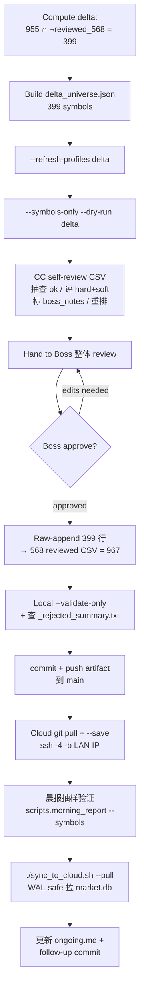

# Phase A2 — Concept Registry 399 只新增票补分类 (relodge)

> 计划日期: 2026-05-24 | 状态: **v3 — Boss v2 review 修订后，等再次批注**
> 上游: 活跃任务 "Phase A2 — Concept Registry ~422 只新增票补分类"
> 替代占位: `docs/plans/2026-05-23-concept-registry-422-new-symbols-relodge-PLACEHOLDER.md`（写完本 plan 后删除）
>
> **v2 变更（Boss review 后）**：
> - 实算 delta = **399**，churn-out = **12**，merged 总行数 = **967**（替换原 ~422/~990 估值）
> - P0 fix: cloud `--save` 前先 commit + push + cloud pull（artifact 走 git，不裸 rsync）
> - P1 fix: Step 4 CLI `--reviewed-csv` → `--review-csv`；本地 `python` → `.venv/bin/python`；云端 `python3`
> - P1 fix: AC6 v2 改查 `_rejected_summary.txt` 内容（首版假设 `--validate-only` 即使有 rejected 也返回 0）
> - P1 fix: Step 10 morning_report 命令完全重写（脚本在 `scripts/`，参数是 `--symbols/--no-telegram`）
> - P1 fix: Step 11 `./sync_to_cloud.sh --pull`（含 WAL checkpoint，不裸 rsync）
> - P2 fix: Step 7 显式 raw-append + 保留 5/17 17 列 header（含 duplicate `business_role`）
> - 答 Boss open Q：delta 源 = 5/17 reviewed CSV（与本地 `company_concept_tags` 568 等价）；R3 = 先允许 L3 空落库，同一缺口簇 ≥3 才暂停扩 v2.2
>
> **v3 变更（Boss v2 review 后）**：
> - P1 fix: AC6 + Step 8 改用 strict validation（不带 `--validate-only`/`--save`，退出码 0 才算过）—— v2 假设的 `_rejected_summary.txt` 干净通过时不会生成（line 795 守门）
> - P1 fix: Step 10 DB 抽样 SQL 列名 `l1/l2/l3` → 真实 schema `primary_concept_id / secondary_concept_id / tertiary_concept_id / theme_ids / display_tags`（line 464 market_store.py）；L3 列允许空（R3 决策）
> - P2 fix: Step 7(d) 写法明确为 `cat old_header + old_568_body + delta_399_body`，避免实现时丢 header

## 北极星对齐

属 **Terminal Desk / Concept Registry** 基础设施维护，与 5/17 plan 同性质，不触动北极星四层结构。

- **解决的需求**：晨报 concept 三段展示（L1/L2/L3）从注册表解析（不 fallback）— 5/17 已对核心 568 票实现，本批补齐 A1 新增的 399 票（含 TTMI / AAOI / AAON / AA / AEG / AFRM / AGI 等 $10B-$24B 段）
- **依赖**：A1 已落地的 `extended_universe.json` (955)、5/14 落库的 v2.1 taxonomy (11 L1 / 61 L2 / 34 L3)、5/17 reviewed CSV (568 行)
- **前置 A3**：周频 concept-build cron 接入（本 plan 完成后单独启动）

## 决策点对齐（2026-05-24 brainstorm）

| # | 决策 | 选定 | 备注 |
|---|------|------|------|
| 1 | 批次 | 单批 399 一把过 | 1 个 session 完成；不分批 |
| 2 | 568 行复用 | Delta-only（568 不动） | 沿用 5/17 new24 合并先例 |
| 3 | LLM 模型 | 沿用 `claude -p` 默认 | 与 5/17 一致，~$0.20/call |
| 4 | 审改强度 | CC 自检 + 标注 → Boss 整体 review | CC 多承担一道工序换 Boss 高效定稿 |
| 5 | delta 起算源（Boss v1 review）| 5/17 reviewed CSV symbol 集 | 与本地 `company_concept_tags` 568 等价 |
| 6 | R3 兜底（Boss v1 review）| 先允许 L3 空落库；同一缺口簇 ≥3 才暂停扩 v2.2 | 不阻塞主流程 |

## 数据现状（2026-05-24 复算）

```
extended_universe.json:        955 symbols
5/17 reviewed CSV:             568 symbols  
delta (universe \ reviewed):   399 symbols  ← 本批分类目标
churn-out (reviewed \ universe): 12 symbols ← 5/17 后已退池，保留在 reviewed 中不动
merged 总行数:                 967 (= 568 + 399)
```

Churn-out 12 票（保留不动，方便回查）：`03032, 07709, AAL, CUK, DRAM, DXYZ, FITBM, HBANZ, MXL, NTRS, ...`

> 注：5/17 后部分 ticker（如 DXYZ 私募基金、MXL 已退池）被 weekly refresh 剔除。保留在 reviewed CSV 中不会污染晨报（晨报按 current `extended_universe` filter）。

## 工作流（架构）



## 业务流程图（数据视角）

```mermaid
flowchart LR
    EU[extended_universe.json<br/>955 symbols] --> DELTA[Delta calculator]
    REV5_17[extended_pool_tags_2026-05-17.csv<br/>568 reviewed rows] --> DELTA
    DELTA --> NEW[delta_universe_2026-05-24.json<br/>399 NEW symbols]
    NEW --> FMP[FMP profile refresh]
    FMP --> PROFILES[profiles.json<br/>+399 entries]
    PROFILES --> CLF[ConceptRegistry.classify<br/>rule first → LLM fallback]
    CLF --> DRY[delta_tags_2026-05-24.csv<br/>399 rows]
    DRY --> CCREV[CC self-review:<br/>boss_notes + 重排]
    CCREV --> BOSSREV[Boss 整体 review]
    BOSSREV --> MERGE[Raw-append: 568 + 399<br/>= extended_pool_tags_2026-05-24.csv<br/>967 rows]
    MERGE --> VAL[--validate-only<br/>+ _rejected_summary.txt]
    VAL --> GIT[git commit + push]
    GIT --> SAVE[云端 git pull + --save]
    SAVE --> DB[(market.db<br/>company_concept_tags<br/>568 → 967)]
    DB --> MORN[晨报 concept 三段展示]
```



## 替代方案对比

| 方案 | 描述 | 取舍 |
|------|------|------|
| **A（本计划）** | Delta classify + **CC 自检层**（标注 + 重排）+ Boss 整体 review | 比 5/17 多一道 CC 自检；Boss 拿到的 CSV 已按 ⚠/?/✓/ok 重排并带 CC 备注。CC +30min, Boss -60min |
| B | Delta classify + 直接交 raw dry-run CSV | 工作量最小，与 5/17 工作流照搬，但 Boss 一次性 399 行无 CC 标注 → 整体 review 更累 |
| C | Delta classify + LLM-as-judge 自验（让 LLM 再 review 自己输出） | 质量上限最高，但单批 399 性价比低（LLM cost ×2，同模型回声风险） |
| D | 按 L1 拆 7-8 批小 CSV（科技/金融/能源…）| 与 "单批 399 一把过" 决策冲突 |
| E | 跳过 `--refresh-profiles` 用现有 profile | 5/17 已踩坑：profile 缺时 LLM 硬猜不可靠（POET/OKLO/IREN 教训）|

**推荐 A**。Boss 的"你做好，我整体 review"明确暗示 CC 多承担一道自检。

## 风险自证

| 风险 | 概率 | 缓解 |
|------|------|------|
| **R1**: Delta 数量与估的有出入 | 已消解 | 5/24 实算 = 399（v1 计划估 ~422 偏 23 票），数字已纳入 plan |
| **R2**: CC self-review "✓" 标错，Boss 误信跳过（CC 与 LLM 同侧偏 OKLO/IREN 类 FMP-label 误导）| 中 | self-review 规则：FMP profile sector/industry 与 L1/L2 不一致 → 一律降为 `?`；只有 rule 命中 + profile 自洽才标 `✓` |
| **R3**: 399 票里有票不 fit 现有 34 个 L3 闭集 | 中 | Boss 已批：**先允许 L3 空落库**（晨报会按 L2 聚合，不致命）；若 ≥3 票同一缺口簇 → 暂停回 brainstorm 扩 v2.2 闭集 |
| **R4**: 合并 399 → 568 误删 Boss 5/17 手编值 / 改 schema | 中 | **Raw-append**：(a) 先 cp 568 → pre-merge-bak.csv；(b) **保留 5/17 17 列 header 字面量**（含 duplicate `business_role` 列）；(c) 用 `cat new.csv >> existing` 风格 raw append，不走 `DictWriter` 重写；(d) `diff` 前 568 行 hash 不变 |
| **R5**: 云端 `--save` mid-fail 致 DB 半状态 | 低 | 5/14 Round 2 已实现 backup-before-rebuild（commit afde54e）；失败可 rollback；本地先 `--validate-only` 双保险 |
| **R6**: 本地 ssh 走 LAN IP bind 又抽风 | 高（已知）| 复用 `ssh -4 -b <LAN IP>`（IP 可能漂移，跑前 `ifconfig en0 \| awk '/inet /{print \$2}'` 核对）|
| **R7**: 周频 cron 在 A2 执行中触发再刷 extended pool（5/24 Sat 09:00 broad weekly_refresh 含 refresh_extended）| 中 | A2 应今天/明天内跑完，避开下周六；若拖延，下周六触发后 delta 会再变 → 重算即可，不会数据损坏 |
| **R8 (v2 新加)**: cloud `--save` 找不到 CSV | 已消解 | Step 9 (v2) 改为 `commit + push + cloud git pull` 路径，artifact 必经 git；不再裸 rsync |
| **R9 (v2 新加)**: `--validate-only` 静默通过（脚本返回 0 即使有 rejected）| 高 | AC6 改查 `_rejected_summary.txt` 字面量 `Per-row failures: 0` + `Coverage-level errors: (none)`；不能只看退出码 |

### 最大风险 + 为何不用更简单做法

**最大风险 = R2**（CC self-review 失准）。5/17 OKLO/IREN 教训：rule + FMP label 集体走偏，Boss 不查就漏。

**为何还要做 self-review**：放弃就是方案 B，Boss 一次性扫 399 行 raw CSV 累且易漏。Self-review 把 CC 与 Boss 注意力分工 → CC 抓 mechanical 异常（profile 不自洽、L3 闭集匹配度），Boss 抓 judgmental 异常（business 角色、概念簇归属）。两层互补 > 单层 Boss。

**为何不用 LLM-as-judge 自验**：单批 399 性价比低；同模型自我 review 易集体偏（回声效应），不能替代人类判断。

## 验收标准

| # | 验收项 | 验证方式 | Boss 独立判断 |
|---|--------|---------|---------------|
| AC1 | Delta universe 精确算出 = 399 | `delta_count = len(current_955 \ reviewed_568)` | ✓ 看数字 |
| AC2 | `--refresh-profiles` 后 delta profile 覆盖率 ≥ 95% | profiles.json 对应 delta symbol 的 sector/industry/description 非空率 | ✓ 看百分比 |
| AC3 | `--symbols-only` 实跑 LLM ≤ delta_count = 399（无 union 膨胀）| dry-run 日志 LLM 调用计数 vs delta_count | ✓ 看日志 |
| AC4 | CC self-review CSV 含 boss_notes 列，按 ⚠/?/✓ 重排 | 打开 CSV 看前 N 行排序 + boss_notes 非空率 | ✓ 看 CSV |
| AC5 | 合并后 reviewed CSV 总行数 = 967，**前 568 行 byte-for-byte 等于 5/17 CSV** | `diff <(head -569 new.csv) <(head -569 old.csv)` 必须 empty | ✓ 看 diff |
| AC6 **(v3 改)** | strict validation 退出码 0（不带 `--validate-only`/`--save` 跑 `--read-reviewed-csv`，干净通过即 exit 0；任何 rejected/coverage error 走 line 819-827 raise → exit 2）| `echo $?` 必须 = 0；失败时再用 `--validate-only` 跑一次产 `_rejected_summary.txt` 诊断 | ✓ 看退出码 |
| AC7 | 云端 `--save` 后 `company_concept_tags` 行数 = 967 | sqlite `SELECT COUNT(*)` | ✓ 看数字 |
| AC8 **(v2 改)** | 晨报命令 `python3 -m scripts.morning_report --no-telegram --symbols <抽 5 个新票>` 输出 concept 三段（L1/L2/L3 + 业务角色），非 fallback | 命令输出 + 直接 `SELECT * FROM company_concept_tags WHERE symbol=?` 抽样 5 个新票确认有行 | ✓ 看 5 个 ticker concept 输出 + DB 行 |
| AC9 | 本地 market.db rsync 后与云端 `company_concept_tags` 行数一致 = 967 | 本地 sqlite COUNT vs 云端 | ✓ 看两数字相等 |

## 实现 Checklist

- [x] **Step 1 — Delta calculation (already done 2026-05-24)**
  - 已算：delta = **399**（list 见 `reports/concept_registry/delta_universe_2026-05-24.json` 输出时落地）
  - churn-out = 12（保留在 reviewed CSV，不动）
  - 起算源：5/17 reviewed CSV symbol 集（与 DB `company_concept_tags` 当前 568 等价）

- [x] **Step 2 — Write delta universe JSON**
  - 输出 `reports/concept_registry/delta_universe_2026-05-24.json`（schema 同 5/17 new24/relodge7 universe JSON）

- [x] **Step 3 — `--refresh-profiles`** ✅ 2026-05-30: 399/399 found, 398/399 满字段 (WSE 空)
  - 命令：
    ```bash
    .venv/bin/python -m scripts.build_company_concept_registry \
      --refresh-profiles \
      --extended-universe-path reports/concept_registry/delta_universe_2026-05-24.json
    ```
  - 仅调 FMP merge 进 `data/fundamental/profiles.json`，不碰 DB
  - 验 AC2：`profiles.json` 中 delta symbol 的 sector/industry/description 非空率 ≥ 95%

- [x] **Step 4 — Dry-run classify** ✅ 2026-05-30: 首轮 249 rule + 135 llm + 15 llm_failed；retry x2 救回 11，剩 4 持续失败 (U/ULS/WSE/WSM `claude -p` 空 result)；最终 249 + 146 + 4
  - 命令（注意 `--review-csv` **不是** `--reviewed-csv`）：
    ```bash
    .venv/bin/python -m scripts.build_company_concept_registry \
      --symbols reports/concept_registry/delta_universe_2026-05-24.json \
      --symbols-only \
      --dry-run \
      --review-csv reports/concept_registry/delta_tags_2026-05-24.csv
    ```
  - 验 AC3：LLM 调用计数 ≤ 399

- [x] **Step 5 — CC self-review** ✅ 2026-05-30: 标 10 ⚠ (4 hard + 6 soft 错配) + 3 ? + 2 ✓ + 20 sampled OK + 364 未审 rule；CSV 按 ⚠→?→✓→ok 重排
  - (a) 抽 10-20 行 `ok` rule 命中验证（profile 与 L1/L2 自洽 → 标 ✓）
  - (b) 逐行评 `hard_needs_review`：读 FMP description，判 L1/L2/L3 是否合理
  - (c) 逐行评 `soft_low_confidence`：同上
  - (d) 写 `boss_notes` 列：`✓ CC OK` / `? L3 待定` / `⚠ FMP 标签可疑 - profile 读为 X 但 rule 标 Y`
  - (e) 重排 CSV：⚠ → ? → ✓ → ok
  - (f) 输出 self-review 摘要给 Boss（✓/?/⚠ 数 + 抽 3 个有代表性案例展示）

- [x] **Step 6 — Boss 整体 review** ✅ 2026-05-30: Boss 拍 4 hard 行 (U=互联网软件/游戏互动, ULS=工业航天/工业自动化, WSE=金融/支付fintech 保留, WSM=消费零售/可选消费品牌) + BWA soft 改对 (自动驾驶/电动车整车 → 工业航天/工业自动化); 其余 5 soft 缺桶留 taxonomy 迭代
  - Boss 在 `reports/concept_registry/delta_tags_2026-05-24.csv` 文件里修改
  - Boss 完成后告知 CC

- [x] **Step 7 — Raw-append merge delta → 568** ✅ 2026-05-30: 968 行 (1 header + 967 body); head-569 byte-equal pre-merge-bak; manifest full_universe=967 (955 + 12 churn)
  - **背景**：5/17 CSV 实际 17 列 header 含 duplicate `business_role`（at index 2 + 11），与当前 `REVIEW_CSV_FIELDS` 的 16 列不一致。必须保留 5/17 header 字面量。
  - (a) `cp reports/concept_registry/extended_pool_tags_2026-05-17.csv reports/concept_registry/extended_pool_tags_2026-05-17.csv.pre-merge-bak`（备份）
  - (b) 算 5/17 CSV 真实 header：`head -1 extended_pool_tags_2026-05-17.csv` → 17 列字面量
  - (c) 把 delta_tags_2026-05-24.csv (Boss reviewed 后) 的 399 行**对齐到 5/17 17 列 schema**：
    - 17 列里非空对齐取值
    - duplicate `business_role` 两列都写同一值
    - 任何 delta symbol 若意外已在 568 中 → 跳过并 warning（不应发生，churn-out 12 是反向，正向应为空集）
  - (d) **明确写法**：`cat old_header_line old_568_body delta_399_body > extended_pool_tags_2026-05-24.csv` —— 三段拼接：① 5/17 CSV 第 1 行 header 原封不动 ② 5/17 CSV 第 2-569 行 body 原封不动 ③ delta 399 行对齐 17 列后的 body。最终文件应有 1 行 header + 967 行 body = 968 行
  - (e) `diff <(head -569 extended_pool_tags_2026-05-24.csv) <(head -569 extended_pool_tags_2026-05-17.csv.pre-merge-bak)` 必须 **empty**（568 行 byte-for-byte 等同）
  - (f) 同时写 `extended_pool_tags_2026-05-24_manifest.json` 记录 full_universe = current 955 + churn-out 12

- [x] **Step 8 — Local strict validation** ✅ 2026-05-30: `validated 967 rows`, EXIT_CODE=0
  - 命令（**不带** `--validate-only` / **不带** `--save`，走 line 1506-1516 strict 路径）：
    ```bash
    .venv/bin/python -m scripts.build_company_concept_registry \
      --read-reviewed-csv reports/concept_registry/extended_pool_tags_2026-05-24.csv \
      --extended-universe-path data/pool/extended_universe.json
    echo $?
    ```
  - 验 AC6：退出码必须 = 0（输出 `validated 967 rows (use --save to persist)`）。任何 rejected/coverage error → line 819-827 `raise CSVValidationError` → CLI catches → exit 2，stderr 打 `CSV VALIDATION FAILED:` + 错误明细
  - 失败诊断专用：再跑一次加 `--validate-only`，产 `_rejected_summary.txt` 看 per-row failures + coverage errors
  - 关于 churn-out：read_reviewed_csv 的 coverage check 只检查 "extend_pool 中有但 CSV 缺" 方向（line 787-793 `missing = extend_pool - seen_symbols`）。CSV 多出 churn-out 12 票不触发 coverage error。Step 7(f) manifest 写全 967 是双保险，让 `_effective_extend_pool` 取 union 后仍无 missing。

- [x] **Step 8.5 (v2 NEW) — Commit + push artifact 到 main** ✅ 2026-05-30: commit `5b5c631` (13 files: 7 核心 + 6 retry provenance); push origin/main (首次 TUN 代理瞬时失败, 重试成功)
  - 提前 commit + push，保证云端 `--save` 拿到的是 git 里 reproducible 版本
  - commit message: `data(concept): A2 — relodge 399 new extended-pool symbols (568 → 967 reviewed)`
  - 含：plan + delta universe JSON + delta tags CSV + manifest + merged CSV + pre-merge-bak
  - push origin/main

- [x] **Step 9 — Cloud git pull + `--save`** ✅ 2026-05-30: AC7 = **967** ✓。⚠ **偏离**: 云端 `extended_universe.json` 今早 Sat 09:00 周频刷新漂移到 **964**, 含 **19 个新进票不在 CSV** (AG/AVAV/BNY/BROS/DOCU/ESI/HBM/IAG/ICLR/LGN/LINE/LUMN/MAIR/MGM/OC/RIOT/SAIL/UHAL/VMI) → 直接用云端 964 会 coverage fail。按 5/17 先例, `--extended-universe-path` 改指向 manifest 的 pinned-967 集 (`/tmp/a2_pinned_universe_967.json`), `_effective_extend_pool = 967 ∪ 967 = 967`, coverage=0 通过。19 drifted-in deferred 给 A3 周频 cron。WAL-safe pre-rebuild backup 自动创建。
  - 命令（用 LAN IP workaround）：
    ```bash
    LAN_IP=$(ifconfig en0 | awk '/inet /{print $2}')
    ssh -4 -b $LAN_IP aliyun "cd /root/workspace/Finance && \
      git pull --ff-only && \
      python3 -m scripts.build_company_concept_registry \
        --read-reviewed-csv reports/concept_registry/extended_pool_tags_2026-05-24.csv \
        --extended-universe-path data/pool/extended_universe.json \
        --save"
    ```
  - 验 AC7：`ssh -4 -b $LAN_IP aliyun "sqlite3 /root/workspace/Finance/data/market.db 'SELECT COUNT(*) FROM company_concept_tags'"` = 967

- [x] **Step 10 — 晨报抽样验证** ✅ 2026-05-30: AC8 双段过。part2 DB schema: TTMI/AAOI/AFRM llm 三段+role 齐全, AAON/AGI rule 行 L1/L2+display_tags 齐全但 L3/role 空 (A2.5 rule-path 限制, 非回归); part1 `get_report_concept_classifier().display_tags()` 全 7 抽样票均「注册表」来源, 无 fallback。改用轻量 classifier 直调代替重量级 morning_report。
  - 选 5 个新票（如 `TTMI, AAOI, AAON, AFRM, AGI`）
  - 云端命令：
    ```bash
    ssh -4 -b $LAN_IP aliyun "cd /root/workspace/Finance && \
      python3 -m scripts.morning_report --no-telegram --symbols TTMI,AAOI,AAON,AFRM,AGI"
    ```
  - 验 AC8 part 1：输出含 concept 三段（L1/L2/L3 + 业务角色），非 fallback
  - 验 AC8 part 2：DB 抽样用真实 schema：
    ```bash
    ssh -4 -b $LAN_IP aliyun "sqlite3 /root/workspace/Finance/data/market.db \
      \"SELECT symbol, display_tags, primary_concept_id, secondary_concept_id, theme_ids, business_role, needs_review FROM company_concept_tags WHERE symbol IN ('TTMI','AAOI','AAON','AFRM','AGI')\""
    ```
    必须 5 行齐全；`display_tags` 和 `business_role` 非空；`needs_review = 0`。**L3 (`tertiary_concept_id` / `theme_ids`) 允许空**（R3 决策）。

- [x] **Step 11 — `./sync_to_cloud.sh --pull` 回本地** ✅ 2026-05-30: 脚本内部 plain `ssh aliyun` 卡 bind, 走手动 WAL-safe fallback (checkpoint cloud TRUNCATE → `rsync -az -e "ssh -4 -b 192.168.1.140"` → 清本地 stale wal/shm)。⚠ macOS rsync 2.6.9 不支持 `--info=progress2`, 去掉后成功。AC9 = local **967** ✓。
  - **不用裸 rsync**（market.db 是 WAL mode，需先 checkpoint）
  - 命令：`./sync_to_cloud.sh --pull`（脚本自带 WAL checkpoint + 大小校验）
  - 若卡 LAN IP bind：临时改 `sync_to_cloud.sh` 的 ssh 命令加 `-4 -b $LAN_IP`，或退回手动：
    ```bash
    ssh -4 -b $LAN_IP aliyun "cd /root/workspace/Finance && python3 -c \"
import sqlite3; c=sqlite3.connect('data/market.db'); c.execute('PRAGMA wal_checkpoint(TRUNCATE)'); c.close()\""
    rsync -avz -e "ssh -4 -b $LAN_IP" aliyun:/root/workspace/Finance/data/market.db ./data/market.db
    ```
  - 验 AC9：`sqlite3 data/market.db "SELECT COUNT(*) FROM company_concept_tags"` = 967

- [x] **Step 12 — Follow-up commit + ongoing** ✅ 2026-05-30: 删占位 plan; ongoing A2 → 最近完成 (含 19 drifted-in deferral 记入 A3); 更新 LAN IP 记忆 .119→.140
  - 若 Step 11 后 market.db 有改动需进 git（按现仓库惯例 market.db 不入 git）→ skip
  - 删占位 plan `docs/plans/2026-05-23-concept-registry-422-new-symbols-relodge-PLACEHOLDER.md`
  - 更新 `.claude/ongoing.md`：A2 → 最近完成；A3（周频 cron 接入）保持规划中
  - commit message: `docs(concept): A2 done — 967 reviewed; remove placeholder`
  - push origin/main

## 关键产出路径

| 类型 | 路径 |
|------|------|
| Plan | `docs/plans/2026-05-24-concept-registry-422-new-symbols-relodge.md`（本文件）|
| Delta universe | `reports/concept_registry/delta_universe_2026-05-24.json` |
| Dry-run CSV | `reports/concept_registry/delta_tags_2026-05-24.csv` + `_manifest.json` |
| 合并后 CSV | `reports/concept_registry/extended_pool_tags_2026-05-24.csv`（967 行）|
| 备份 | `reports/concept_registry/extended_pool_tags_2026-05-17.csv.pre-merge-bak` |
| Manifest | `reports/concept_registry/extended_pool_tags_2026-05-24_manifest.json` |
| Rejected summary | `reports/concept_registry/extended_pool_tags_2026-05-24_rejected_summary.txt`（Step 8 后）|

## 待 Boss 批注（v2 剩余 2 条）

1. **commit 粒度**：plan 单独一个 commit（不动数据/代码）？还是 plan + delta universe JSON 一起？我倾向 plan 单独 commit 让审批边界清晰，artifact 在 Step 8.5 才一起进 git。
2. **执行 worktree 策略**：plan 在 main，但 Step 3-12 实际跑（含 `--save`）是否走 worktree？我倾向不走 worktree（本批纯数据 + 配置，不动代码；与 5/17 一致），CSV 产物直接在 main commit。

## 不在本 Plan 范围

- 周频 concept-build cron 接入（A3，独立 plan）
- L3 闭集扩展（v2.1 → v2.2）—— 除非 R3 触发（≥3 票同一缺口簇）
- 晨报概念簇热度动量算法（独立 brainstorm，5/17 ongoing 已登记）
- 晨报输出格式 PDF → HTML（5/22 ongoing 已登记）
