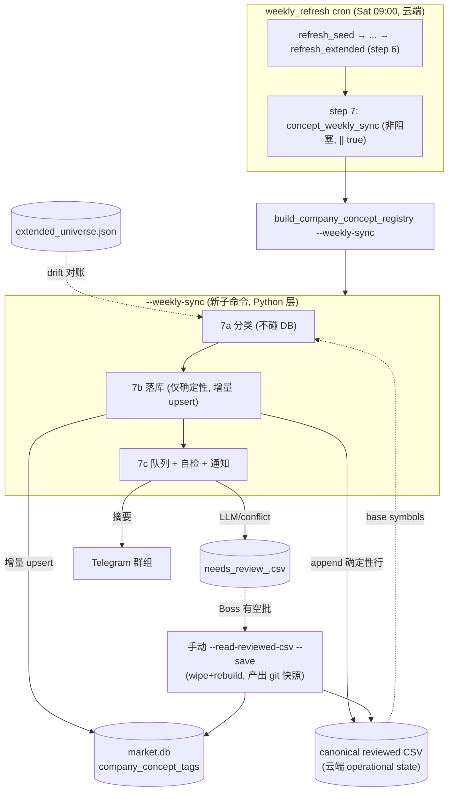

# A3 — 周频 Concept Sync 设计 Spec

> **类型**: Design Spec（brainstorming 产出，writing-plans 的上位输入）
> **日期**: 2026-06-01
> **状态**: Draft v2 — 已过 Boss plan-review（3×P1 + 3×P2 全部核对真实代码确认并修入，见文末「修订记录」），待 Boss 复核后进 writing-plans
> **作者**: CC（交易台运营官）
> **关联**: issue 030（drift-in coverage）· issue 031（manifest schema）· `docs/plans/2026-05-24-concept-registry-422-new-symbols-relodge.md`（A2）· `docs/plans/2026-05-30-a2.5-ai-power-anchors.md`（A2.5）
> **北极星对齐**: Data Desk 治理层 —— 让 concept registry（分析层展示地基）跟随 extended_universe 周频换血自动对齐，消灭手动落库与对账。*（plan 阶段需对照 `docs/design/north-star.md` 确认层归属与需求编号）*

---

## 1. 问题陈述（根因）

`extended_universe.json` 由 **weekly_refresh cron（Sat 09:00）独立换血**（drift-in 新票 + churn-out 老票），但 concept registry（`company_concept_tags`）**无自动追赶机制**。每次手动落库都要：

1. 在算 delta 那一刻冻结 reviewed CSV 的 symbol 集，
2. 与云端漂移后的 universe 对账（单向 coverage 会被 drift-in 卡死），
3. 靠 `--extended-universe-path` 指向 pinned manifest 绕过，
4. drift-in 新票 deferred 给人工。

**两次实证**（issue 030）：5/17 差 24 票、5/30 差 19 票（`AG/AVAV/BNY/BROS/DOCU/ESI/HBM/IAG/ICLR/LGN/LINE/LUMN/MAIR/MGM/OC/RIOT/SAIL/UHAL/VMI`）。这些 drift-in 票当前在晨报走 **legacy fallback 单桶分类**（非 registry 三段）。

**叠加陷阱**（issue 031）：coverage sidecar（manifest）有两种 schema 并存，loader 只读 `symbols` key，喂 `full_universe`-schema 的 manifest = 空集 = sidecar 形同虚设（fails-open，删行静默通过）。

### 关键认知校正

ongoing.md 原设想 "cron 末尾加 `build_company_concept_registry --reclassify`"。**研究证明 `--reclassify <old_csv>` 只处理 CSV 里已有的 symbol，不会自动吃 drift-in 新票**（脚本以输入 CSV 的 symbol 集为界）。因此 A3 不是加一行 flag，而是一个新的 **`--weekly-sync` 子命令**，专门处理 universe 漂移。

---

## 2. 锁定的设计决策（Boss 已拍板 2026-06-01）

| # | 决策 | 选择 |
|---|------|------|
| D1 | drift-in 自动落库 vs 进 review 队列的边界 | **仅确定性自动落库**：rule/anchor → 自动 `--save`；LLM 软分类 + deterministic_conflict → 写 review 队列 CSV + Telegram，Boss 有空批一批再手动 apply。SSOT 保持 100% 亲审 |
| D2 | concept 步失败时 cron 姿态 | **非阻塞 + 每周 Telegram 摘要**：concept 步用隔离方式跑（不拖垮 weekly_refresh），不论成败都推群组摘要 |
| D3 | churn-out（离开 universe 的老票）处理 | **KEEP（不删 tags）**：票常在 $10B 阈值上下震荡，保留避免来回重审；tags 对晨报无害（晨报只展示扫描内的票） |
| D4 | base 状态模型 | **canonical 云端 CSV ⇔ DB 锁步**（见 §4），cloud-owned operational state，对齐 P3 所有权 |

---

## 3. 架构



**核心原则**：复杂的 coverage 协调 / 拆分 / 原子性留在**可单测的 Python**，cron wrapper 只当**非阻塞调用方**。

---

## 4. 状态模型（D4，要点）

引入 **canonical reviewed CSV**（暂名 `reports/concept_registry/reviewed_current.csv` + 同名 manifest），**云端权威 operational state，不进 git**（对齐 P3：market.db 云端独占写入），与 `company_concept_tags` 表 **尽量对齐**（注意：不是同一事务，见下方 §4.1 一致性策略）：

- cron 每周把**确定性 drift-in 行**同时写 canonical CSV + 增量 upsert DB（两步，非原子）。
- **git 只存 Boss 刻意提交的快照**（像 A2 的 5/24 967-row commit），仍走"push 先确认"纪律。
- 本地副本：**现有 `sync_to_cloud.sh --pull` 不覆盖 `reports/concept_registry/`**（只拉 market.db + fundamental/ + universe.json，见 `sync_to_cloud.sh:128-146`）。因此 **A3 必须显式扩展 pull/push 规则**，把 canonical CSV + manifest 纳入双向同步——否则本地 DB 有 cron 自动行、本地 canonical base 没有，本地手动 apply 会 clobber（**finding P1**）。

### 4.1 一致性策略（CSV ⇔ DB 非原子，finding P1）

CSV append（文件系统）与 SQLite upsert（DB）是**两个独立操作**，任一侧成功另一侧失败都会分叉。锁步靠流程纪律，不是事务保证：

| 阶段 | 做法 |
|------|------|
| preflight | 落库前比对 canonical CSV symbol 集 == DB tags symbol 集（上周末态应一致），不一致 → fail closed + Telegram，不继续 |
| CSV 写 | 写 **temp CSV → `os.replace`** 原子替换（避免半写文件） |
| DB 写 | 增量 upsert，pre-rebuild WAL backup 留作保险 |
| postflight | upsert 后**二次比对** CSV 集 == DB 集；不一致 → fail closed + Telegram（保留 backup，人工介入） |

> 顺序：先 DB upsert 成功 → 再 `os.replace` CSV。若 DB 成功但 CSV 替换失败，postflight 检出分叉并告警；canonical CSV 仍是替换前的旧态（os.replace 原子），下周 preflight 会再次检出，不会静默累积。

**为什么必须有 canonical CSV（不能只写 DB）**：
若 cron 只增量写 DB、不更新一个 base CSV，则下次 Boss review LLM 队列跑 `--read-reviewed-csv --save`（该路径 `rebuild_concept_tree` = **wipe 全表** 再从 CSV upsert）会把 cron 自动落的行**一起清掉**（CSV 里没有它们）。锁步避免这个 clobber。

**两条写路径**：

| 路径 | 触发 | DB 操作 | git |
|------|------|---------|-----|
| 自动（cron weekly-sync） | 每周 | **增量 upsert**（drift-in 只映射已有 concept，无新 concept → **无需 rebuild_concept_tree，无 wipe**） | 否（云端 operational state） |
| 手动（Boss review 队列） | Boss 有空 | 全量 apply（wipe+rebuild，现有路径） | Boss 刻意 commit 快照 |

> 增量 upsert 的安全性前提：drift-in 票走 rule/anchor 必映射到 **已存在的** L1/L2/L3 concept id（taxonomy 不变），故 `upsert_company_concepts(new_rows)` 不需要重建 concept 树。*（plan 阶段需 grep 核对 `upsert_company_concepts` 是否支持不 rebuild 的纯增量，以及 concept id 解析路径。）*

> ⚠️ **不能复用现有 `--save` 保存路径**（finding P1）：`build_company_concept_registry.py:594` 的入库门是 `if r["needs_review"] == 0`，而**高置信 LLM 行也是 `needs_review=0`**（`company_concepts.py` anchor `source="manual"` / rule / 高置信 llm 都可能 needs_review=0）→ 复用它会把 LLM 行也自动落库，**违反 D1**。weekly-sync 的 deterministic filter 必须**按 source 显式过滤 `{manual, rule}`**（anchor 的 source 是 `manual`，见 `company_concepts.py:202`），独立于 needs_review 门。

---

## 5. 每周流程（cron step 7，非阻塞）

```
7a 分类（不碰 DB）:
    base      = canonical_CSV 的 symbol 集
    universe  = extended_universe.json（落库目标端 = 云端为准）
    drift_in  = universe − base
    churn_out = base − universe                         → KEEP（D3，不删）
    给 drift_in 补 FMP profile（仅 delta，scope 到新票控成本）
    对 drift_in 跑 classify()：
        anchor 命中 → source=manual（最高优先级）
        industry_map 命中 → source=rule
        缺席/歧义 → unclassified → LLM prefill
    拆桶（按 source 显式过滤，独立于 needs_review 门，见 §4 finding P1）:
        deterministic = {source ∈ manual, rule}        # anchor 的 source == "manual"
        review_queue  = {source ∈ llm, deterministic_conflict, soft_low_confidence}

7b 落库（仅确定性，CSV ⇔ DB 非原子，按 §4.1 一致性策略）:
    preflight: canonical CSV 集 == DB tags 集，否则 fail closed + Telegram
    deterministic 行 → 增量 upsert DB（pre-rebuild WAL backup 留作保险）
                     → temp CSV + os.replace 原子替换 canonical CSV
    写 canonical manifest（issue 031 的 `symbols` schema）
    postflight: 二次比对 CSV 集 == DB 集，不一致 fail closed + Telegram

7c 队列 + 自检 + 通知:
    review_queue → dated needs_review_<date>.csv
    coverage 自检: assert drift_in ⊆ (deterministic ∪ review_queue)   ← 没有静默丢票
    Telegram 群组摘要:
        "concept 周刷: <N> 自动落库 / <M> 待审 / <K> churn-out / 失败: <reason 或 无>"
```

**LLM 隔离**：7a 跑 LLM（已知会抽风）只影响 review_queue 桶，**碰不到 DB**。7b 只动确定性行（无 LLM），即便 7a 中途 LLM 全失败，确定性票照样落库、失败计入摘要。

---

## 6. 顺带修的两个 issue（A3 自检依赖它们）

| issue | 修复 | 理由 |
|-------|------|------|
| **031** manifest schema 失配 | `_load_review_manifest` 加 fallback：`syms = data.get("symbols") or data.get("full_universe") or []` | 一行，retroactive 修好所有历史 manifest；否则 coverage sidecar 仍是死的，7c 自检不可靠 |
| **030** drift-in 单向 coverage | 7c 双向对账自检（`drift_in ⊆ saved ∪ queued`）写进 weekly-sync；pin 手段退役 | 把"靠人记得加 pin"变成 cron 自动可验证 |

> issue 031 的 durable 修法另有"统一写入口"选项；A3 取**改 loader（一行）**，最小且 retroactive。

---

## 7. 方案对比（编排层）

| | A — 专用 `--weekly-sync` 子命令（**选用**） | B — cron wrapper bash 编排 | C — 扩展 `--reclassify` 吃 universe |
|---|---|---|---|
| coverage 协调 + 拆分 + 原子性 | Python，**可单测** | bash，脆弱难测 | 污染 reclassify 纯 CSV 变换契约 |
| DB 安全 | 增量 upsert 不 wipe | 走 wipe+rebuild，中途崩=空库 | 同 B |
| 成本 | 新增 ~150-250 行 + 测试 | 省 Python 但高风险 | 改动小但语义混 |

**否决 B**：issue 030/031 的坑本质就是"靠人在 shell 里记得做对"，不能再把协调逻辑搬进 bash。**否决 C**：`--reclassify` 当前是干净的纯 CSV 变换（不碰 DB/网络），weekly-sync 的关注点（漂移 + 落库 + 通知）足够独立，应自带入口。

---

## 8. 范围红线（YAGNI）

- A3 **只做 universe-drift 同步**。
- **不做** "重分类已有行"（taxonomy/anchor 变更后的 `--reclassify` 全量重跑）—— 那是 Boss 手动的**刻意事件**（如 A2.5 改 industry_map 后跑一次），塞进周 cron 只会每周刷 deterministic_conflict 队列噪音。
- **不做** churn-out 清理 / 历史 prune（监控增长，未来需要再加）。

---

## 9. 风险

| 风险 | 缓解 |
|------|------|
| canonical CSV 引入新的云端 operational state，可能与 DB / git 快照 / 本地副本分叉 | DB ⇔ canonical CSV 非原子，靠 §4.1 一致性策略（preflight/postflight 比对 + os.replace + fail closed）；**显式扩展 sync_to_cloud.sh pull/push** 把 canonical CSV+manifest 纳入双向同步（现有 pull 不覆盖 reports/）；plan 写清首跑 base 初始化 |
| 历史 CSV schema 失配（5/24/5/30 是 17 列 + dup `business_role`，现 writer 16 唯一字段） | canonical 初始化必须 **normalize 到 `REVIEW_CSV_FIELDS`（16 字段）并拒绝重复 header**；plan 加显式 normalize 步 + 测试 |
| 增量 upsert 假设"drift-in 不引入新 concept"，若某新票需要新 L3 主题则假设破裂 | plan 阶段验证：rule/anchor 必映射已有 concept；若 classify 要求新 concept，该票应被推入 review_queue 而非自动落库 |
| FMP profile 补拉对 ~10-20 新票/周 = 网络延时，可能拖慢 step 7 | scope 到 drift-in delta（非全池）；非阻塞，超时不影响 weekly_refresh |
| 首跑要消化 5/30 deferred 的 19 票 + 此后累积的漂移 | 首跑作为验收用例，预期把这 19 票（多数 rule 确定性）自动落库，少量 LLM 入队列 |
| Telegram 摘要污染群组噪音 | D2 已选"每周都推"；摘要单行精炼 |

---

## 10. 验收标准（草稿，plan 细化）

1. **首跑实证**：weekly-sync 在云端跑，5/30 的 19 deferred 票被处理 —— 确定性票自动落库（`company_concept_tags` 增量），LLM 票进 `needs_review_<date>.csv`，两者并集 = 19（coverage 自检通过）。
2. **DB ⇔ CSV 锁步**：落库后 canonical CSV 的 symbol 集 == DB tags 的 symbol 集。
3. **非阻塞**：人为让 LLM 步失败，weekly_refresh 仍 `DONE`，step 7 失败计入 Telegram 摘要、退出码不污染前序步。
4. **issue 031 修复**：删 **reviewed/canonical CSV 一行**（不是删 manifest 行）后 `--validate-only` 必须报 coverage error（原静默通过）；并用 legacy `full_universe`-schema manifest 跑一次回归，确认 loader fallback 也能拦住。
5. **不回归**：现有 concept registry 测试全过；anchor/manual 行 reclassify-safe（passthrough）。
6. **churn-out KEEP**：人为 churn 一票出 universe，其 tags 仍在 DB。
7. **本地同步**：扩展后的 `sync_to_cloud.sh --pull` 把 canonical CSV + manifest 带回本地，且本地 DB 含自动落的行；落库后本地 canonical CSV 集 == 本地 DB tags 集。
8. **一致性 fail-closed**：人为制造 CSV ⇔ DB 分叉（如 upsert 后 CSV 替换失败），postflight 检出并 fail closed + Telegram 告警，不静默继续。
9. **schema normalize**：用 17 列 dup-`business_role` 的历史 CSV（如 5/24）初始化 canonical，输出必须 normalize 到 16 字段 `REVIEW_CSV_FIELDS`、无重复 header。

---

## 11. 留给 writing-plans / 实现阶段的开放点

> 以下需在 plan 阶段 grep 核对真实代码并标 source line（遵循 `feedback_plan_pseudocode_fidelity`）：

1. `upsert_company_concepts` 是否支持不 `rebuild_concept_tree` 的纯增量？concept id 解析路径？
2. `--refresh-profiles` 能否 scope 到 `--symbols <delta.json>` 仅补新票？实际 FMP 调用量 / 耗时？
3. canonical CSV 首跑 base 用哪个文件初始化（5/24 的 967 commit？还是从当前 DB 导出）—— 选定后必须经 §4/§9 的 16 字段 normalize（拒绝历史 17 列 dup `business_role`）。
4. Telegram 发送复用 `src/telegram_bot.py` 哪个入口 → 群组 channel（`TELEGRAM_GROUP_CHAT_ID`）。
5. cron wrapper step 7 的非阻塞实现（`|| true` vs 独立 error trap）+ 摘要如何从 Python 传给 wrapper（stdout JSON？sidecar 文件？）。
6. classify() 在"需要新 concept"时的行为 —— 确认会落到 unclassified→review_queue，不会强行自动落库。
7. 北极星层归属与需求编号对齐。
8. **【finding P1】sync_to_cloud.sh 扩展**：pull + push 各加 canonical CSV + manifest 的 rsync 规则（参照 `sync_to_cloud.sh:128-146` 的 market.db 写法 + `check_file_size` 安全检查）；明确所有权方向（云端写、本地只读拉取）。
9. **【finding P1】deterministic save 实现**：weekly-sync 走独立 `{manual, rule}` source filter，**不复用** `build_company_concept_registry.py:594` 的 `needs_review==0` 入库门；plan 写清新落库函数与现有 `save_to_market_db` 的边界。
10. **【finding P1】一致性策略实现**：§4.1 的 preflight/postflight 比对 + temp CSV `os.replace` + fail-closed 分支，落到具体函数 + 测试用例。

---

## 修订记录

### v2 — 2026-06-01 Boss plan-review 闭环

6 条 finding 全部核对真实代码确认后修入：

| # | finding | 真实代码核对 | 处理 |
|---|---------|------------|------|
| P1 | sync --pull 不带回 canonical CSV | `sync_to_cloud.sh:128-146` 只拉 market.db/fundamental/universe.json | §4 + §11.8：显式扩展 pull/push 规则 |
| P1 | "CSV ⇔ DB 永远一致/原子"过强 | CSV append + SQLite upsert 非同一事务 | §4.1 新增一致性策略（preflight/postflight + os.replace + fail-closed）；§5 7b、§10.8 同步 |
| P1 | 不能复用 `--save` 入库门 | `build_company_concept_registry.py:594` 是 `needs_review==0`，含高置信 LLM 行 | §4 note + §11.9：独立 `{manual, rule}` source filter |
| P2 | anchor source 是 `manual` 非 `anchor` | `company_concepts.py:202` `source="manual"` | §5 7a：`{rule, anchor}` → `{manual, rule}` |
| P2 | issue 031 验收写错对象 | issue 031:8 真实 mode = 删 CSV 行 manifest 该拦 | §10.4：改删 CSV 行 + legacy `full_universe` manifest 回归 |
| P2 | canonical 首跑 schema 失配 | 5/24 CSV header 17 列、`business_role` 在第 3/13 位重复；`REVIEW_CSV_FIELDS` 16 唯一字段 | §9 risk + §10.9 + §11.3：normalize 到 16 字段、拒绝重复 header |

D1-D4 主方向、A3 ≠ `--reclassify`、LLM 隔离、churn KEEP、YAGNI 红线 Boss 认可不变。
