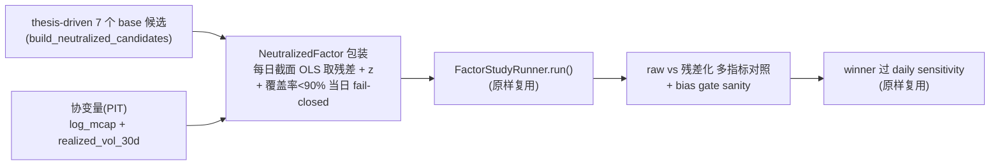

# 动量因子 — Size/Vol 残差化后重赛（Phase 0.5）

> **状态：DRAFT（决策已定，待执行）** — 待 Codex review Phase 0 分支通过 + **新 session 执行**。决策已锁（Boss 2026-06-03），执行时不再改方向、按 §9 checklist 机械执行。
> **北极星对齐**：分析层（因子研究）。上位约束 = `docs/design/2026-06-02-morning-report-redesign.md` §4 Phase 0。
> **前置**：Phase 0 已完成于分支 `feat/momentum-factor-study`（未 merge）。

---

## 1. 为什么有这一轮（Phase 0 的结论）

Phase 0（18 候选 × 3 horizon，扩展池 927 标的，IS152/OOS100 周频）结论：**三个 horizon `per_horizon_winner` 全 null**。来源：分支 `feat/momentum-factor-study` 的 `docs/research/2026-06-02-momentum-factor-study.md` + `reports/factor_study/momentum_horse_race/horse_race_result.json`。

- 信号**有真实 OOS 预测力**（30d：Clenow_30=+0.253、RiskAdj_30=+0.230）。
- 但**全被中性化门槛拒绝**：size_abs∈[0.056,0.086]（全部≥0.05）、vol_abs∈[0.099,0.211]（仅 1 个<0.10）。
- 关键：size 的 `signed_mean≈0` 而 `abs_mean≈0.06` → 不是稳定倾斜，而是**逐日翻转的不稳定 size 耦合** + 温和高波动 lean。

**核心未决问题**：这点 OOS 预测力，**是干净的动量 alpha，还是 size/vol 耦合的副产品？** Phase 0.5 用残差化直接判决。

---

## 2. 候选集 — thesis-driven 7（Boss 拍板）

每个窗口只留 Phase 0 里真正有效的形态：

| 窗口 | 带量? | 因子 | 个数 | Phase 0 raw OOS IC_IR |
|------|:----:|------|:----:|----------------------|
| **3d** | ✅ 带量 (VolConf) | `VolConf_3_a030` / `a050` / `a070` | 3 | +0.030 / +0.023 / +0.010 |
| **10d** | ❌ 纯价格 | `RiskAdj_10` / `Clenow_10` | 2 | +0.054 / +0.003 |
| **30d** | ❌ 纯价格 | `RiskAdj_30` / `Clenow_30` | 2 | +0.230 / +0.253 |

**收窄理由（Boss，grounded in Phase 0）：**
- **MFI 全族抛弃** —— 最弱族，且指标有 textbook off-by-one（量流分类错位一天）；不投资该族、不修来用。
- **3d 只带量** —— 纯价格 3d OOS IC 为负（RiskAdj_3=−0.009、Clenow_3=−0.001，短期反转区）；唯一翻正靠量腿（VolConf_3 → +0.030，量腿权重越高越好）。
- **10d/30d 不带量** —— 加量在 10d 中性（Δ+0.001）、30d 拖累（Δ−0.007）；高 α VolConf 与纯价格相关 0.88–0.92（再皮肤）。长窗口纯价格趋势质量最强（RiskAdj=收益/波动、Clenow=斜率×R²）。

> **已知取舍（Boss 拍板，记录在案）**：只跑 7、不跑全 15，等于在 Phase 0 raw（被 size/vol 污染）结果上预筛候选，存在 selection-bias。Boss 选择接受它换聚焦——被剪掉的臂（MFI 弱+bug、3d 纯价格反转、长窗口加量再皮肤）残差化后复活概率低，风险可控。若未来怀疑漏判，再跑全网格复核。

**预期校准（诚实说）**：真正的判决点在 **30d**（raw +0.23/+0.25，有肉）。10d 纯价格 raw 已偏弱（RiskAdj_10 +0.054、Clenow_10 ~0），残差化后大概率接近 0；3d 即便存活绝对值也 ≤0.03。**别对 3d/10d 期望太高，30d 是主战场。**

> VWAP 距离（设计文档里的备胎 Candidate 5）本轮仍不上。

---

## 3. 方法：横截面残差化（regress-out size + vol）

对每个候选，在**每个计算日**做一次横截面 OLS，把分数对 size/vol 协变量回归，取**残差**作中性化分数：

```
score_i  =  b0 + b1·log(mcap_i) + b2·realized_vol_i  +  resid_i
neutralized_score_i  =  cross_sectional_z(resid_i)     # winsor ±3
```

- **size 协变量** = `log(PIT market cap)` —— 复用 `backtest.adapters.us_stocks._get_bulk_mcaps(date)`（PIT 无前视）。
- **vol 协变量** = `realized_vol_30d(df)` —— 复用 `backtest.factor_study.bias_diagnostics.realized_vol_30d`（PIT）。
- **再标准化** = 复用 `backtest.factor_study.momentum_factors.cross_sectional_z`。

与 Phase 0 的 bias 诊断**同一组协变量**，口径自洽：残差化后 size_abs/vol_abs 应**趋近 0**（生效 sanity，不是结论）。

**协变量覆盖率政策（硬规则，不留实现自由度）：**
- **永远用同一组协变量模型（size+vol），绝不按日切换维度。** "缺 mcap 当日退化为仅 vol 残差化"是**禁止**的 —— 同一因子在不同日用不同模型维度，残差分布与 bias gate 跨日不可比，会制造假通过。
- 每个 date：缺**任一**协变量（mcap 或 vol）的 symbol 从**该日横截面剔除**。
- 每个 date 要求 **covariate 覆盖率 ≥ 90%**（被保留 symbol 数 / 当日候选 symbol 数）。**覆盖率不足 → 该日 fail-closed**（整日剔除，不进 IC），并记录 `dropped_count` 与 `coverage`。
- ~25 标的常年无 PIT mcap → 它们每天都被剔除（正常、可预期）；真正要防的是某日覆盖率坍塌。

---

## 4. 架构（wrapper，不改 verified runner）



- `NeutralizedFactor(base_factor)` 是 `Factor` 子类：`compute()` 内 ①调 `base.compute()` 拿 base 分数 → ②取同批 symbol 的 PIT 协变量 → ③（覆盖率达标后）截面 OLS 取残差 → ④`cross_sectional_z(residuals)`。
- `build_neutralized_candidates()` **只包 thesis-driven 7 个 base**（MFI 不在内）。
- runner / gate / winner_selection / daily_sensitivity / 报告管线**全部原样复用**（wrapper 哲学，禁止重写已验证逻辑）。

---

## 5. 判决规则（多指标、绝对标准为主）

只看 IC_IR 会被骗 —— 残差化可能因 `std_ic` 下降而**抬高 IC_IR，但 mean IC 仍很弱**。所以每候选必须报 raw vs 残差化的**多指标对照**：

| 必报指标 | 来源 (ICResult) |
|---|---|
| `mean_ic` | `.mean_ic` |
| `ic_ir` (=mean/std) | `.ic_ir` |
| `n_obs` | `.n_ic_obs` |
| `t_stat` / `p_value` | `.t_stat` / `.p_value` |
| `size_abs` / `vol_abs`（残差化后）| bias_after（应趋近 0）|

**存活判定（绝对标准为主门槛）：**
- **主门槛（绝对）**：残差化后 OOS `mean_ic` 显著（`p_value < 0.05`，即 `|t_stat| ≳ 2`）**且** `|mean_ic| ≥ 0.02`（floor）**且** `ic_ir ≥ 0.10`。
- **辅助（仅说明，非门槛）**：raw→残差化保留比 `resid/raw`。**对 raw≈0 或为负的候选，保留比无解释力 → 一律只看绝对主门槛。**
- 三项绝对门槛全过 = 存在干净中性动量 alpha → 选 winner → 过 daily sensitivity → 再议 P3 注册。
- 任一不过 = 该窗口动量非独立 alpha，晨报不上（或换信号源）。

主战场是 30d（RiskAdj_30 / Clenow_30）：raw +0.23/+0.25 残差化后 `mean_ic` 是否**仍显著且达标**，决定晨报有没有可用的中长期动量信号。

---

## 6. 替代方案对比

| 方案 | 优 | 劣 | 取舍 |
|------|----|----|------|
| **A. 残差化重赛（本方案）** | 直接判决"真 alpha vs tilt"；复用全部 Phase 0 机器；口径自洽 | 残差化可能连真 alpha 一起削（用绝对显著性判，缓解）| **选** |
| B. 放宽 size 门槛→0.06 | 一行 | 只放出最弱的 VolConf_3_a030，且自我消解中性门槛 = 买 tilt | 弃 |
| C. 双重排序/分层中性化 | 非参数稳健 | 桶边界敏感、样本切薄、口径不一 | 备选（残差化不稳再上） |

---

## 7. 风险自证

- **最大风险**：残差化把真 alpha 一起 regress 掉 → 假阴性。缓解：判决用**绝对显著性 + mean_ic floor**（非"非零"或"保留比"），并报 raw vs 残差化多指标对照让衰减可见。
- **为什么不用更简单的放宽门槛？** 那不回答核心问题，只是把 tilt 放进生产；三轮 review 加固中性门槛正为防此。
- **selection-bias（已知接受）**：只跑 7 是在污染的 raw 上预筛——Boss 拍板接受（§2 取舍）。被剪臂复活概率低；存疑时再跑全网格复核。
- **协变量缺失（已硬化，见 §3）**：绝不按日切换模型维度；统一 size+vol；缺任一协变量的 symbol 当日剔除；当日覆盖率 <90% → 该日 fail-closed 并记 `dropped_count/coverage`。
- **3d 量腿 ↔ vol 残差化**：量腿 RVOL 与 vol 协变量概念邻近，但 Phase 0 里 VolConf_3 的 vol_abs 全场最低（a030=0.099）→ 量腿本身相对 vol-中性，残差化 vs vol 不会把 3d 信号削光。
- **前视**：协变量全 PIT，无前视。

---

## 8. 验收标准

1. **残差化生效（sanity）**：7 个中性化候选的 size_abs/vol_abs **趋近 0**（远低于 0.05/0.10）。没降 → 实现有 bug，先修。
2. **协变量覆盖率审计**：每日记录 `coverage / dropped_count`；任何 <90% 的日子 fail-closed 且在报告里列出（§3 硬规则）。
3. **OOS 完整性**：沿用 Phase 0 fail-closed（has_oos_ic + oos_n_obs≥20，绝不退回 IS，见 issue 032）。
4. **判决产出**：raw vs 残差化**多指标**对照表（mean_ic/ic_ir/n_obs/t/p/bias_after，7 候选）+ 逐窗口存活/塌缩结论（绝对标准为主，见 §5）。
5. **worktree 池非空自检**：执行前 smoke 验证 extended=955（见 issue 033，data/pool symlink）。

---

## 9. checklist（执行时细化，每个引用 grep 核对 + 标 source line；全程 TDD 红→绿→commit）

- [ ] T1 — `NeutralizedFactor` wrapper（新，~50 行）+ 覆盖率政策 + 单测（4 条）：
  - 纯 size 倾斜假因子 → 残差化后 size_abs ≈ 0
  - 纯 vol 倾斜假因子 → 残差化后 vol_abs ≈ 0
  - true signal ⟂ 协变量（混合输入）→ 正交真信号被保留（残差化后仍与真信号高相关）
  - 协变量奇异（共线/常数）或当日覆盖率 <90% → fail-closed（该日剔除并记 coverage）
- [ ] T2 — `build_neutralized_candidates()` 只包 **thesis-driven 7 个 base**
- [ ] T3 — orchestration 加 `--neutralize` 开关（或 sibling 脚本），复用 `run_horse_race`；输出每日 coverage/dropped 审计
- [ ] T4 — 重赛 7 + 写 Phase 0.5 报告（多指标 raw vs 残差化对照 + 逐窗口判决）

---

## 10. 已定决策（Boss 2026-06-03）

| # | 决策 |
|---|------|
| 候选集 | **thesis-driven 7**（只跑 7，不跑全 15）|
| MFI | **抛弃**（off-by-one bug + 不投资该族；不纳入重赛）|
| 残差化协变量 | `log_mcap + realized_vol_30d` 两个（不加 sector/beta）|
| 3d 带量臂 | 统一 size+vol 残差化（**不**额外报"仅 size"变体）|
| 存活绝对门槛 | `p_value<0.05` 且 `\|mean_ic\|≥0.02` 且 `ic_ir≥0.10`；保留比仅辅助说明 |
| 覆盖率阈值 | 每日 ≥90%，不足该日 fail-closed |

**唯一剩余 gate**：Codex review Phase 0 分支通过 → **新 session** 执行 T1–T4（建 worktree、subagent-driven / 手动 TDD 均可）。
