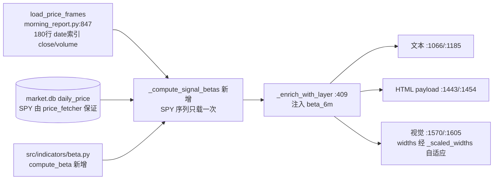
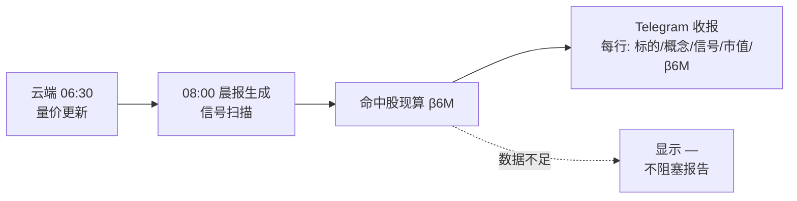

# 晨报个股 6 个月 Beta 属性 — 实现计划

> **For agentic workers:** REQUIRED SUB-SKILL: Use superpowers:subagent-driven-development (recommended) or superpowers:executing-plans to implement this plan task-by-task. Steps use checkbox (`- [ ]`) syntax for tracking.

**Goal:** 晨报每个个股条目新增 6 个月 beta（126 交易日日收益率对 SPY 回归），与市值并列展示，不落库。

**Architecture:** 新增纯计算模块 `src/indicators/beta.py`；在 `build_market_signal_report` 内复用已加载的 `price_frames`（180 行 ≥ 127 行需求）为信号命中股算 beta，经 `_enrich_with_layer` 注入 `item["beta_6m"]`；文本 / HTML / PNG 三个投递面同步加 "β6M" 列（三面 one-to-one 是现有硬约束，见 `build_html_payload` docstring `morning_report.py:1404-1409`）。

**Tech Stack:** Python（云端 3.10 兼容，禁 3.12 特性）+ pandas/numpy + pytest。

**Spec:** `docs/design/2026-06-12-morning-report-beta-attribute.md`（已批准）。替代方案对比、风险自证见 spec §4/§5。

**北极星对齐:** 分析层（Terminal/晨报）展示增强；不触碰数据层 schema（market.db 零变更，验收硬检查）。

---

## 数据流（实现视角）



## Boss 视角业务流程



## 关键事实（已 grep 核对）

| 事实 | 位置 |
|------|------|
| `MORNING_SIGNAL_PRICE_ROWS = 180`，已加载帧足够算 126 日收益率 | `morning_report.py:50` |
| `load_price_frames_from_market_db` 返回 date 索引 `close/volume` frame，行数不足直接跳过该 symbol | `broad_market_scan.py:372-402` |
| `price_frames` 在 `build_market_signal_report` 内已就绪且作用域可达 | `morning_report.py:847` |
| `signal_symbols` 在 `:872-875`，`_hydrate_signal_metadata` 在 `:876`，三处 `_enrich_with_layer` 调用在 `:879/:890/:896` | `morning_report.py` |
| 文本报告只组装 PMARP + 量能异常两个个股 section（`:2222/:2224`）；`format_section_layered_dv/rvol` 无调用点，**不改** | `morning_report.py:2222-2224` |
| PNG 列宽经 `_scaled_widths` 按内容宽度缩放，加列安全 | `morning_report.py:1879` |
| 缺失值惯例：单元格用 `"—"` | `morning_report.py:1162/:1172` |
| 测试 helper：`_make_pmarp_hit` / `_make_market_signals(pmarp_hits=, anomaly_hits=)` | `tests/test_morning_report.py:34-44` |
| SPY/QQQ 由 price_fetcher 始终随池更新写入 daily_price | `src/data/price_fetcher.py:100-102`、`config/settings.py:144` |

## 文件结构

| 文件 | 动作 | 职责 |
|------|------|------|
| `src/indicators/beta.py` | 新建 | 纯 beta 计算（不碰 DB，遵循 indicators 惯例） |
| `tests/test_beta_indicator.py` | 新建 | compute_beta 单测（合成序列） |
| `scripts/morning_report.py` | 修改 | `_format_beta` + `_compute_signal_betas` + `_enrich_with_layer` 注入 + 三投递面加列 |
| `tests/test_morning_report.py` | 修改 | 渲染层 beta 列测试（追加到文件末尾） |

---

### Task 0: Worktree 环境准备

**Files:** 无代码变更。

- [ ] **Step 0.1: 创建 worktree + 分支**

```bash
cd "/Users/owen/CC workspace/Finance"
git worktree add "../Finance-wt-beta" -b feature/morning-report-beta-6m
```

- [ ] **Step 0.2: symlink live data（已知陷阱：worktree 的 market.db 是 0 行骨架，见 memory `project_worktree_needs_live_data_symlink`）**

```bash
cd "/Users/owen/CC workspace/Finance-wt-beta"
# 先确认主仓 market.db 实际路径（get_store 用的那个）
"/Users/owen/CC workspace/Finance/.venv/bin/python" -c \
  "import sys; sys.path.insert(0, '/Users/owen/CC workspace/Finance'); from src.data.market_store import get_store; print(get_store().db_path)"
# 按打印出的路径，把主仓对应文件 symlink 进 worktree 同相对位置（只读使用，不写入）
# 例如打印 /Users/owen/CC workspace/Finance/data/market.db 则：
mkdir -p data && ln -sf "/Users/owen/CC workspace/Finance/data/market.db" data/market.db
ln -sfn "/Users/owen/CC workspace/Finance/data/pool" data/pool
```

注意：本 plan 的单测全部用合成数据，不依赖 DB；symlink 只为 Task 5 的 dry-run 验证。后续所有 pytest/python 命令一律用主仓 venv 绝对路径 `/Users/owen/CC workspace/Finance/.venv/bin/pytest`（worktree 不共享 .venv）。

---

### Task 1: `compute_beta` 纯函数（TDD）

**Files:**
- Create: `src/indicators/beta.py`
- Test: `tests/test_beta_indicator.py`

- [ ] **Step 1.1: 写失败测试**

```python
"""compute_beta 单测 — 全部合成序列，不碰 DB。"""
import numpy as np
import pandas as pd

from src.indicators.beta import compute_beta, BETA_WINDOW, BETA_MIN_OBS


def _make_pair(n=200, beta=1.5, seed=42, noise_sd=0.001):
    """构造已知 beta 的个股/基准收盘价对（日简单收益率线性关系 + 噪声）。"""
    rng = np.random.default_rng(seed)
    dates = pd.bdate_range("2025-08-01", periods=n)
    bench_ret = rng.normal(0.0005, 0.01, n)
    stock_ret = beta * bench_ret + rng.normal(0.0, noise_sd, n)
    bench = pd.Series(100.0 * np.cumprod(1 + bench_ret), index=dates)
    stock = pd.Series(50.0 * np.cumprod(1 + stock_ret), index=dates)
    return stock, bench


def test_recovers_known_beta():
    stock, bench = _make_pair(beta=1.5)
    result = compute_beta(stock, bench)
    assert result is not None
    assert abs(result - 1.5) < 0.05          # spec §6.1


def test_recovers_low_beta():
    stock, bench = _make_pair(beta=0.4, seed=7)
    assert abs(compute_beta(stock, bench) - 0.4) < 0.05


def test_uses_tail_window_only():
    # 前段 beta=0.5、后 130 日 beta=2.0 的拼接序列：窗口只看末尾 → 接近 2.0
    s1, b1 = _make_pair(n=120, beta=0.5, seed=1)
    rng = np.random.default_rng(2)
    dates2 = pd.bdate_range(s1.index[-1] + pd.Timedelta(days=1), periods=130)
    bench_ret2 = rng.normal(0.0005, 0.01, 130)
    stock_ret2 = 2.0 * bench_ret2 + rng.normal(0.0, 0.001, 130)
    bench = pd.concat([b1, pd.Series(float(b1.iloc[-1]) * np.cumprod(1 + bench_ret2), index=dates2)])
    stock = pd.concat([s1, pd.Series(float(s1.iloc[-1]) * np.cumprod(1 + stock_ret2), index=dates2)])
    result = compute_beta(stock, bench, window=126)
    assert abs(result - 2.0) < 0.1


def test_insufficient_overlap_returns_none():
    stock, bench = _make_pair(n=40)          # 39 个收益率 < BETA_MIN_OBS=60
    assert compute_beta(stock, bench) is None


def test_misaligned_dates_inner_join():
    # 个股中段停牌 30 日：inner join 后仍 >= min_obs，正常出值且接近真值
    stock, bench = _make_pair(n=200, beta=1.2, seed=3)
    stock = stock.drop(stock.index[80:110])
    result = compute_beta(stock, bench)
    assert result is not None
    assert abs(result - 1.2) < 0.1


def test_constant_benchmark_returns_none():
    stock, _ = _make_pair()
    flat = pd.Series(100.0, index=stock.index)
    assert compute_beta(stock, flat) is None


def test_none_or_empty_inputs():
    stock, bench = _make_pair()
    assert compute_beta(None, bench) is None
    assert compute_beta(stock, None) is None
    assert compute_beta(pd.Series(dtype=float), bench) is None


def test_defaults_match_spec():
    assert BETA_WINDOW == 126
    assert BETA_MIN_OBS == 60
```

- [ ] **Step 1.2: 跑测试确认失败**

```bash
cd "/Users/owen/CC workspace/Finance-wt-beta"
"/Users/owen/CC workspace/Finance/.venv/bin/pytest" tests/test_beta_indicator.py -v
```
Expected: FAIL — `ModuleNotFoundError: No module named 'src.indicators.beta'`

- [ ] **Step 1.3: 实现 `src/indicators/beta.py`**

```python
"""6 个月滚动 beta — 个股日收益率对基准（SPY）的回归系数。

晨报个股属性用（与市值并列展示，spec: docs/design/2026-06-12-morning-report-beta-attribute.md）。
纯计算模块：输入收盘价序列，不碰数据库（遵循 src/indicators/ 惯例）。
"""
from typing import Optional

import numpy as np
import pandas as pd

BETA_WINDOW = 126   # ≈6 个月交易日
BETA_MIN_OBS = 60   # 对齐后收益率样本下限，不足返回 None（如上市不足 6 个月）


def compute_beta(
    stock_closes: Optional[pd.Series],
    bench_closes: Optional[pd.Series],
    window: int = BETA_WINDOW,
    min_obs: int = BETA_MIN_OBS,
) -> Optional[float]:
    """beta = cov(r_i, r_m) / var(r_m)，日简单收益率。

    两条序列以日期为 index，按日期 inner join 对齐（停牌/缺日自动剔除）
    后取末尾 window 个收益率。样本 < min_obs 或基准方差为 0 时返回 None。
    """
    if stock_closes is None or bench_closes is None:
        return None
    if len(stock_closes) < 2 or len(bench_closes) < 2:
        return None
    aligned = pd.concat(
        [stock_closes.rename("stock"), bench_closes.rename("bench")],
        axis=1, join="inner",
    ).sort_index().dropna()
    returns = aligned.pct_change().dropna().tail(window)
    if len(returns) < min_obs:
        return None
    var_bench = float(returns["bench"].var())
    if not np.isfinite(var_bench) or var_bench < 1e-12:
        return None
    cov = float(returns["stock"].cov(returns["bench"]))
    return cov / var_bench
```

- [ ] **Step 1.4: 跑测试确认通过**

```bash
"/Users/owen/CC workspace/Finance/.venv/bin/pytest" tests/test_beta_indicator.py -v
```
Expected: 8 passed

- [ ] **Step 1.5: Commit**

```bash
git add src/indicators/beta.py tests/test_beta_indicator.py
git commit -m "feat(indicators): 6 个月滚动 beta 纯计算模块（126d 日收益率对基准回归）"
```

---

### Task 2: 晨报接线 — `_compute_signal_betas` + `_enrich_with_layer` 注入（TDD）

**Files:**
- Modify: `scripts/morning_report.py`（`:50` 常量区、`:409` `_enrich_with_layer`、`:876-898` 接线）
- Test: `tests/test_morning_report.py`（文件末尾追加）

- [ ] **Step 2.1: 写失败测试（追加到 `tests/test_morning_report.py` 末尾）**

```python
# ---------- 6 个月 beta（2026-06-12 plan） ----------

def _make_beta_frames(beta=1.5, n=180, seed=11):
    """与 load_price_frames 同形：date 索引、close/volume 列。"""
    import numpy as np
    rng = np.random.default_rng(seed)
    dates = pd.bdate_range("2025-09-01", periods=n)
    bench_ret = rng.normal(0.0005, 0.01, n)
    stock_ret = beta * bench_ret + rng.normal(0.0, 0.001, n)
    bench = pd.DataFrame({"close": 100.0 * (1 + pd.Series(bench_ret, index=dates)).cumprod(),
                          "volume": 1e6}, index=dates)
    stock = pd.DataFrame({"close": 50.0 * (1 + pd.Series(stock_ret, index=dates)).cumprod(),
                          "volume": 1e6}, index=dates)
    return stock, bench


def test_compute_signal_betas_uses_loaded_frames(monkeypatch):
    stock_frame, bench_frame = _make_beta_frames(beta=1.5)
    import scripts.broad_market_scan as bms
    monkeypatch.setattr(bms, "load_price_frames_from_market_db",
                        lambda symbols, rows_needed: {"SPY": bench_frame})
    betas = mr._compute_signal_betas({"NVDA": stock_frame}, ["NVDA", "MISSING"])
    assert abs(betas["NVDA"] - 1.5) < 0.05
    assert betas["MISSING"] is None          # 不在 price_frames → None，不报错


def test_compute_signal_betas_benchmark_missing(monkeypatch):
    stock_frame, _ = _make_beta_frames()
    import scripts.broad_market_scan as bms
    monkeypatch.setattr(bms, "load_price_frames_from_market_db",
                        lambda symbols, rows_needed: {})
    betas = mr._compute_signal_betas({"NVDA": stock_frame}, ["NVDA"])
    assert betas == {"NVDA": None}           # 基准缺失 → 全 None，报告不阻塞


def test_compute_signal_betas_empty_symbols():
    assert mr._compute_signal_betas({}, []) == {}


def test_enrich_with_layer_injects_beta():
    item = {"symbol": "NVDA", "value": 99.0}
    metadata = {"NVDA": {"marketCap": 3e12}}
    enriched = mr._enrich_with_layer(item, metadata, {"NVDA"}, betas={"NVDA": 1.83})
    assert enriched["beta_6m"] == 1.83


def test_enrich_with_layer_beta_default_none():
    item = {"symbol": "NVDA", "value": 99.0}
    metadata = {"NVDA": {"marketCap": 3e12}}
    enriched = mr._enrich_with_layer(item, metadata, {"NVDA"})
    assert enriched["beta_6m"] is None       # betas 不传 → None（向后兼容）
```

- [ ] **Step 2.2: 跑测试确认失败**

```bash
"/Users/owen/CC workspace/Finance/.venv/bin/pytest" tests/test_morning_report.py -k beta -v
```
Expected: FAIL — `AttributeError: ... has no attribute '_compute_signal_betas'`

- [ ] **Step 2.3: 实现接线**

(a) `morning_report.py:50` 常量区，`MORNING_SIGNAL_PRICE_ROWS = 180` 下一行加：

```python
BETA_BENCHMARK = "SPY"   # 6 个月 beta 的回归基准（daily_price 始终含 SPY，price_fetcher.py:100）
```

(b) `_enrich_with_layer`（`:409`）签名加 `betas=None`，`enriched["concept_bucket"] = ...` 之前加一行：

```python
def _enrich_with_layer(item: dict, metadata: dict, pool_symbols: set, betas: dict | None = None) -> dict:
    ...（现有逻辑不动）
    enriched["beta_6m"] = (betas or {}).get(symbol)
    enriched["concept_bucket"] = _concept_bucket(enriched)
    return enriched
```

(c) `_enrich_with_layer` 定义后新增 helper（放 `:427` 附近）：

```python
def _compute_signal_betas(
    price_frames: dict,
    signal_symbols: list,
) -> dict:
    """信号命中股的 6 个月 beta（对 BETA_BENCHMARK）。基准序列只加载一次。

    price_frames: load_price_frames 输出（date 索引 close/volume frame，180 行）。
    基准缺失或个股不在 price_frames → None（晨报渲染为 —，不阻塞）。
    """
    from scripts.broad_market_scan import load_price_frames_from_market_db
    from src.indicators.beta import compute_beta

    targets = sorted(set(signal_symbols))
    if not targets:
        return {}
    bench_frames = load_price_frames_from_market_db(
        [BETA_BENCHMARK], rows_needed=MORNING_SIGNAL_PRICE_ROWS,
    )
    bench_frame = bench_frames.get(BETA_BENCHMARK)
    if bench_frame is None:
        logger.warning("beta skipped: benchmark %s missing from market.db", BETA_BENCHMARK)
        return {symbol: None for symbol in targets}
    bench_closes = bench_frame["close"]
    betas = {}
    for symbol in targets:
        frame = price_frames.get(symbol)
        betas[symbol] = compute_beta(frame["close"], bench_closes) if frame is not None else None
    return betas
```

(d) `build_market_signal_report` 内 `:876` `_hydrate_signal_metadata(metadata, signal_symbols)` 之后加：

```python
    betas = _compute_signal_betas(price_frames, signal_symbols)
```

三处调用（`:879/:890/:896`）改为 `_enrich_with_layer(item, metadata, pool_symbols, betas)`。

- [ ] **Step 2.4: 跑测试确认通过**

```bash
"/Users/owen/CC workspace/Finance/.venv/bin/pytest" tests/test_morning_report.py -k beta -v
```
Expected: 5 passed

- [ ] **Step 2.5: 回归 — 整个晨报测试文件**

```bash
"/Users/owen/CC workspace/Finance/.venv/bin/pytest" tests/test_morning_report.py -q
```
Expected: 全部 passed（`_enrich_with_layer` 新参数有默认值，存量测试不受影响）

- [ ] **Step 2.6: Commit**

```bash
git add scripts/morning_report.py tests/test_morning_report.py
git commit -m "feat(morning-report): 信号命中股计算 6 个月 beta 并注入 item[beta_6m]"
```

---

### Task 3: 文本投递面 — "β6M" 列（TDD）

**Files:**
- Modify: `scripts/morning_report.py`（`:120` 附近加 `_format_beta`；`:1066-1073` PMARP；`:1185-1193` 量能异常）
- Test: `tests/test_morning_report.py`（末尾追加）

- [ ] **Step 3.1: 写失败测试**

```python
def test_format_beta():
    assert mr._format_beta(1.834) == "1.83"
    assert mr._format_beta(0.4) == "0.40"
    assert mr._format_beta(None) == "—"


def test_pmarp_text_section_has_beta_column():
    hit = _make_pmarp_hit("NVDA", "bullish_breakout", 99.0, 3e12)
    hit["beta_6m"] = 1.83
    out = mr.format_section_pmarp_by_signal_and_cap(_make_market_signals(pmarp_hits=[hit]))
    assert "β6M" in out                      # 表头
    assert "1.83" in out                     # 值与市值同行
    line = next(l for l in out.splitlines() if "NVDA" in l)
    assert "$3.0T" in line and "1.83" in line


def test_pmarp_text_section_beta_missing_dash():
    hit = _make_pmarp_hit("XYZ", "oversold_recovery", 2.0, 50e9)   # 无 beta_6m 键
    out = mr.format_section_pmarp_by_signal_and_cap(_make_market_signals(pmarp_hits=[hit]))
    line = next(l for l in out.splitlines() if "XYZ" in l)
    assert line.rstrip().endswith("—")


def test_volume_anomaly_text_section_has_beta_column():
    hit = {"symbol": "SMCI", "marketCap": 30e9, "layer": "pool",
           "from_dv": True, "from_rvol": False, "volume_signal_kind": "流动性加速",
           "dv_ratio": 2.1, "dv_5d": 5e9, "dv_20d": 2.4e9, "beta_6m": 2.05}
    out = mr.format_section_layered_volume_anomaly(_make_market_signals(anomaly_hits=[hit]))
    assert "β6M" in out
    line = next(l for l in out.splitlines() if "SMCI" in l)
    assert "2.05" in line
```

- [ ] **Step 3.2: 跑测试确认失败**

```bash
"/Users/owen/CC workspace/Finance/.venv/bin/pytest" tests/test_morning_report.py -k beta -v
```
Expected: 新增 4 个 FAIL（`_format_beta` 不存在 / 表头无 β6M）

- [ ] **Step 3.3: 实现**

(a) `_format_market_cap`（`:120`）之后加：

```python
def _format_beta(beta: float | None) -> str:
    if beta is None or pd.isna(beta):
        return "—"
    return "{:.2f}".format(beta)
```

(b) `format_section_pmarp_by_signal_and_cap`（`:1066-1073`）：

```python
        lines.append("  标的 | 概念 | 信号 | 当前 | 变化 | 市值 | β6M")
        for item in tier_hits:
            lines.append("    {} | {} | {} | {:.1f}% | {:.1f}→{:.1f} | {} | {}".format(
                _compact_company(item), _display_concept_tags(item),
                PMARP_SIGNAL_LABELS.get(item.get("signal"), "—"),
                item.get("value") or 0, item.get("previous") or 0, item.get("value") or 0,
                _format_market_cap(item.get("marketCap")),
                _format_beta(item.get("beta_6m")),
            ))
```

(c) `format_section_layered_volume_anomaly`（`:1185-1193`）：

```python
        "标的 | 概念 | 类型 | DV 5d/20d | RVOL | 市值 | β6M",
        lambda item: "{} | {} | {} | {} | {} | {} | {}".format(
            _compact_company(item),
            _display_concept_tags(item),
            item.get("volume_signal_kind") or "—",
            _format_volume_anomaly_dv_cell(item),
            _format_volume_anomaly_rvol_cell(item),
            _format_market_cap(item.get("marketCap")),
            _format_beta(item.get("beta_6m")),
        ),
```

注：`format_section_layered_dv`（`:1077`）和 `format_section_layered_rvol`（`:1096`）在报告组装路径无调用点（仅 `:2222/:2224` 组装 PMARP + 量能异常），**不改**（YAGNI）。

- [ ] **Step 3.4: 跑测试确认通过 + 文件级回归**

```bash
"/Users/owen/CC workspace/Finance/.venv/bin/pytest" tests/test_morning_report.py -q
```
Expected: 全部 passed

- [ ] **Step 3.5: Commit**

```bash
git add scripts/morning_report.py tests/test_morning_report.py
git commit -m "feat(morning-report): 文本晨报 PMARP/量能异常 section 新增 β6M 列"
```

---

### Task 4: HTML + PNG 投递面 — "β6M" 列（TDD）

**Files:**
- Modify: `scripts/morning_report.py`（HTML payload `:1443-1461`；视觉 `:1570-1588`、`:1603-1616`）
- Test: `tests/test_morning_report.py`（末尾追加）

- [ ] **Step 4.1: 写失败测试**

```python
def test_html_payload_pmarp_and_anomaly_have_beta_column():
    pm = _make_pmarp_hit("NVDA", "bullish_breakout", 99.0, 3e12); pm["beta_6m"] = 1.83
    va = {"symbol": "SMCI", "marketCap": 30e9, "layer": "pool",
          "from_dv": True, "from_rvol": False, "volume_signal_kind": "流动性加速",
          "dv_ratio": 2.1, "dv_5d": 5e9, "dv_20d": 2.4e9, "beta_6m": None}
    ms = _make_market_signals(pmarp_hits=[pm], anomaly_hits=[va])
    payload = mr.build_html_payload(ms, None, as_of="2026-06-12")
    pm_blocks = [b for b in payload["blocks"] if "信号" in (b.get("columns") or [])]
    assert pm_blocks and all("β6M" in b["columns"] for b in pm_blocks)
    assert pm_blocks[0]["rows"][0]["β6M"] == "1.83"
    va_block = next(b for b in payload["blocks"] if b.get("heading") == "2. 量能异常")
    assert "β6M" in va_block["columns"]
    assert va_block["rows"][0]["β6M"] == "—"          # 缺失 → —


def test_visual_blocks_have_beta_column_and_width():
    pm = _make_pmarp_hit("NVDA", "bullish_breakout", 99.0, 3e12); pm["beta_6m"] = 1.83
    va = {"symbol": "SMCI", "marketCap": 30e9, "layer": "pool",
          "from_dv": True, "from_rvol": False, "volume_signal_kind": "流动性加速",
          "dv_ratio": 2.1, "dv_5d": 5e9, "dv_20d": 2.4e9, "beta_6m": 2.05}
    sections = mr.build_morning_visual_sections(
        market_signals=_make_market_signals(pmarp_hits=[pm], anomaly_hits=[va]), dv_result=None)
    pmarp = next(s for s in sections if s["slug"] == "01_pmarp")
    for block in pmarp["blocks"]:
        assert block["columns"][-1] == "β6M"
        assert len(block["widths"]) == len(block["columns"])   # 防 zip 静默截断
        assert block["rows"][0]["cells"][-1] == "1.83"
    anomaly = next(s for s in sections if s["slug"] == "02_volume_anomaly")
    block = anomaly["blocks"][0]
    assert block["columns"][-1] == "β6M"
    assert len(block["widths"]) == len(block["columns"])
    assert block["rows"][0]["cells"][-1] == "2.05"
```

- [ ] **Step 4.2: 跑测试确认失败**

```bash
"/Users/owen/CC workspace/Finance/.venv/bin/pytest" tests/test_morning_report.py -k beta -v
```
Expected: 新增 2 个 FAIL

- [ ] **Step 4.3: 实现**

(a) HTML `build_html_payload`（`:1443-1451`）：

```python
    pm_cols = ["标的", "概念", "信号", "当前", "市值", "β6M"]
    ...
        rows = [{"标的": _compact_company(h), "概念": _display_concept_tags(h),
                 "信号": PMARP_SIGNAL_LABELS.get(h.get("signal"), "—"),
                 "当前": "{:.1f}%".format(h.get("value") or 0),
                 "市值": _format_market_cap(h.get("marketCap")),
                 "β6M": _format_beta(h.get("beta_6m"))} for h in tier_hits]
```

(b) HTML 量能异常（`:1454-1460`）：

```python
    va_cols = ["标的", "概念", "类型", "DV 5d/20d", "RVOL", "市值", "β6M"]
    va_rows = [{"标的": _compact_company(h), "概念": _display_concept_tags(h),
                "类型": h.get("volume_signal_kind") or "—",
                "DV 5d/20d": _format_volume_anomaly_dv_cell(h),
                "RVOL": _format_volume_anomaly_rvol_cell(h),
                "市值": _format_market_cap(h.get("marketCap")),
                "β6M": _format_beta(h.get("beta_6m"))} for h in va_hits]
```

(c) 视觉 PMARP（`:1570-1588`）：

```python
        _pmarp_cols = ["标的", "概念", "信号", "当前", "变化", "市值", "β6M"]
        _pmarp_widths = [300, 320, 140, 130, 170, 150, 120]
        ...
                "rows": [_visual_row(item, [
                    ...（现有 6 个 cell 不动）
                    _format_market_cap(item.get("marketCap")),
                    _format_beta(item.get("beta_6m")),
                ]) for item in _tier_hits],
```

(d) 视觉量能异常（`:1603-1616`）：

```python
                _build_visual_block(
                    "量能异常",
                    ["标的", "概念", "类型", "DV 5d/20d", "RVOL", "市值", "β6M"],
                    volume_anomaly.get("hits", []),
                    lambda item: [
                        ...（现有 6 个 cell 不动）
                        _format_market_cap(item.get("marketCap")),
                        _format_beta(item.get("beta_6m")),
                    ],
                    [280, 320, 140, 280, 180, 150, 120],
                ),
```

（PNG 列宽经 `_scaled_widths` 自适应缩放，`morning_report.py:1879`，加列安全。）

- [ ] **Step 4.4: 全文件回归 + 关联测试文件**

```bash
"/Users/owen/CC workspace/Finance/.venv/bin/pytest" tests/test_morning_report.py tests/test_morning_html_report.py tests/test_beta_indicator.py -q
```
Expected: 全部 passed

- [ ] **Step 4.5: Commit**

```bash
git add scripts/morning_report.py tests/test_morning_report.py
git commit -m "feat(morning-report): HTML/PNG 投递面同步 β6M 列（三面 one-to-one）"
```

---

### Task 5: 独立对照验证 + 本地 dry-run（spec 验收 §6.2/§6.3）

**Files:** 无新增提交代码（验证脚本用完即弃，不入库）。

- [ ] **Step 5.1: yfinance 独立对照（spec：误差 < 0.1）**

```bash
cd "/Users/owen/CC workspace/Finance-wt-beta"
"/Users/owen/CC workspace/Finance/.venv/bin/python" - <<'EOF'
"""独立口径对照：yfinance 数据 + 手写公式 vs 本实现 + market.db 数据。"""
import numpy as np
import yfinance as yf
from src.indicators.beta import compute_beta
from scripts.broad_market_scan import load_price_frames_from_market_db

for sym in ["NVDA", "MSFT", "KO"]:
    raw = yf.download([sym, "SPY"], period="9mo", progress=False)["Close"].dropna()
    r = raw.pct_change().dropna().tail(126)
    manual = float(np.cov(r[sym], r["SPY"])[0, 1] / np.var(r["SPY"], ddof=1))
    frames = load_price_frames_from_market_db([sym, "SPY"], rows_needed=180)
    ours = compute_beta(frames[sym]["close"], frames["SPY"]["close"])
    print(f"{sym}: manual(yf)={manual:.3f} ours(db)={ours:.3f} diff={abs(manual-ours):.3f}")
    assert abs(manual - ours) < 0.1, sym
print("PASS: all diffs < 0.1")
EOF
```
Expected: 三只标的 diff < 0.1，打印 PASS。（若 worktree 内 DB symlink 缺失会报 frames 为空 → 回查 Task 0.2。）

- [ ] **Step 5.2: 本地 dry-run 晨报（spec：β 与市值并列、缺失显示 —）**

```bash
"/Users/owen/CC workspace/Finance/.venv/bin/python" scripts/morning_report.py \
  --symbols NVDA,MU,MSFT --no-telegram --image-delivery html
ls -t reports/rendered/ | head -3
```
Expected: 正常生成（exit 0）；打开生成的 `morning_report_*.html`，PMARP/量能异常表格出现 "β6M" 列（若当日这几只无信号命中则表为空，属正常——改用当日实际有信号的标的重跑，标的从前一日晨报取）。

- [ ] **Step 5.3: market.db 零变更硬检查（spec §6.4）**

```bash
cd "/Users/owen/CC workspace/Finance-wt-beta"
git diff main --stat -- src/data/market_store.py    # 应无输出
git diff main --name-only | grep -v "^\(scripts/morning_report\|src/indicators/beta\|tests/\|docs/\)" || echo "CLEAN"
```
Expected: market_store.py 无 diff；改动面只含 morning_report.py / beta.py / tests / docs，打印 CLEAN。

---

### Task 6: 收尾

- [ ] **Step 6.1: 全量测试**

```bash
"/Users/owen/CC workspace/Finance/.venv/bin/pytest" tests/ -q
```
Expected: 与 main 基线一致 + 新增 15 个测试全 passed（worktree 基线注意 memory `project_worktree_needs_live_data_symlink`：缺 live data 时部分 registry 测试结果会漂移，对照 main 跑一次基线确认无新增失败）。

- [ ] **Step 6.2: 语法预检（云端 3.10 兼容自查：无 match/case、f-string 无反斜杠）**

```bash
"/Users/owen/CC workspace/Finance/.venv/bin/python" -m py_compile scripts/morning_report.py src/indicators/beta.py && echo OK
```

- [ ] **Step 6.3: 汇报 Boss 验收**

展示：对照验证输出 + dry-run HTML 截图/路径 + 测试摘要。**不 merge 不 push**（等 Boss 指示，memory `feedback_no_merge_without_asking`）。合并后云端次日 06:25 auto-pull 生效，无需改 cron。

---

## 自审记录

- **Spec 覆盖**：§1 口径（126d/SPY/日频）→ Task 1；§3.1 模块 → Task 1；§3.2 接线/单次加载 SPY/只算命中股 → Task 2；§3.3 双路径渲染 + 缺失 `—` → Task 3/4（实为三路径：文本/HTML/PNG，PNG 是 PDF fallback 的来源，三面 one-to-one 是代码硬约束）；§5 数据不足/错位/3.10/性能 → Task 1 测试 + Task 6.2；§6 验收 1/2/3/4 → Task 1 / 5.1 / 5.2 / 5.3；§7 范围外未引入。
- **占位符扫描**：无 TBD/TODO；所有代码步骤含完整代码。
- **类型一致性**：`beta_6m`（item 键）、`_format_beta`、`_compute_signal_betas`、`BETA_BENCHMARK`、`compute_beta(stock_closes, bench_closes, window, min_obs)` 全计划一致；测试中 helper 引用（`_make_pmarp_hit`/`_make_market_signals(pmarp_hits=, anomaly_hits=)`）已对照 `tests/test_morning_report.py:34-44` 实际签名。
