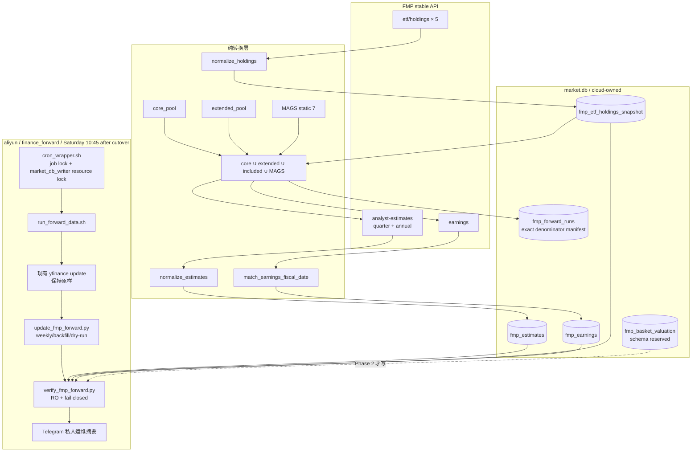
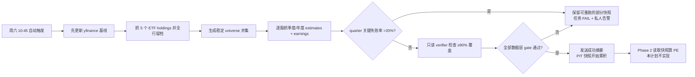
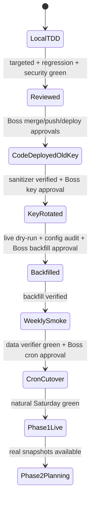

# FMP Forward EPS Data Layer Implementation Plan

> **For Claude:** REQUIRED SUB-SKILL: Use superpowers:executing-plans to implement this plan task-by-task.

**Status:** Round-7 merge-review 全修 complete (2026-07-13)。Tasks 0–10 已实现；round-6 5×P1 + round-7 2×P1/2×P2 已全修 + 回归测试。等 Boss 复审后进入 Task 11+ 审批门。

> **Review Round-7 批注（2026-07-13，Boss merge review 2×P1 + 2×P2 全修）**
>
> - **P1 resume 遗忘 run-wide earnings 失败** → `run_state` 新增 `earnings_failed` 持久化集；resume 按 `(prior_failed − 本次 earnings_success) ∪ current_failed` 合并；earnings gate 改用 run-wide unresolved 集 ÷ 完整 manifest 分母裁决。Boss 复现场景（8/8 断供 → 只修 1 票 → 曾被标 complete）已被回归测试冻结：修 1 票仍 failed，修完全部才 complete。
> - **P1 全 malformed payload 错误完成** → earnings 非空 payload 规范化后零有效行 = endpoint failure（计入 `earnings_failed`）；holdings 每篮子规范化后必须 ≥1 行 `included=1`，否则 `_FatalRunError` 零写入；verifier 同步加 defense-in-depth：非零行但零 included 的篮子直接 FAIL。
> - **P2 `--today-override` 生产后门** → CLI 参数删除；clock 只能通过 `run_update(..., today_fn=)` 代码注入，测试断言该 flag 已不可用（exit 2）。
> - **P2 complete rerun 先烧 5 次 holdings API** → 终态检查提前到 holdings 抓取之前，零 API 调用拒绝。
> - 回归：5 个新测试；专属套件 138 passed、相邻 97 passed。

> **Review Round-6 批注（2026-07-13，Boss merge review 5×P1 全修）**
>
> - **P1 历史 PIT 可改写** → `complete` 设为终态（resume 与 full rerun 都拒绝）；新增 PIT 冻结守卫：非 dry-run 只允许写 `[today-6d, today]` 窗口内的 snapshot_date（同自然周修复失败 run），更早/未来日期零写入拒绝。`--today-override` 隐藏参数供测试注入。
> - **P1 earnings 断供仍可 complete** → writer 层新增 earnings 覆盖门槛：本轮 `earnings_failed/targets > 20%` → manifest failed + 非零退出，不进 verifier；estimates 快照保留供 resume 修复。
> - **P1 异常遗留永久 running** → 三层收尾：① 转换层行级校验（`[None]`/非 dict 元素按 malformed 跳过，holdings 坏行照样留档）；② `_process_symbol` 内规范化/落库异常按该股失败记账继续批次（全 malformed → quarter_failed）；③ manifest 开启后全部工作包进外层 try，未预期异常 best-effort 持久化 `failed` + `completed_at`（holdings 落库也移入保护段）。
> - **P1 `--data-root` 契约不完整** → 新增 `build_pool_loaders(data_root)`：非 None 时 core/extended 均从 `data_root/pool/` 读取，绝不回落 worktree 默认目录；main 接线 + 单测。
> - **P1 20% gate 是 post-hoc** → 改为真熔断：累计关键失败 `> floor(0.2×n)` 立即停止逐股循环，余量记 `summary.unprocessed`（入 `attempts[].unprocessed`）供 resume；恰好等于阈值不触发。resume 的 `run_state.quarter_empty` 合并改用实际 processed 集（熔断余量不算已修复）。
> - 回归：10 个新测试（终态拒绝×2 / 日期冻结×2 / earnings 断供 / `[None]` payload / post-manifest 异常收尾 / 熔断早停+边界 / data-root loaders）；专属套件 133 passed、相邻回归 97 passed、Python 3.10 AST 通过。

**Confidence: 94%**

> **Review Round-4/5 批注（2026-07-12，Boss 已拍板方案 A；Codex round-5 复核）**
>
> - **P1 universe 覆盖缺口 → 方案 A 已采纳**：实测核心池 198 只中 25 只不在扩展池 cache（`refresh_extended_universe()` 是纯 $10B+ screener，从不 union 核心池），含 QS/CRSP/DOCU/PSTG/TEM/FROG 等 ~16 只真股票。旧 yfinance 线（`get_symbols() ∪ get_extended_only_symbols()`）覆盖它们，原公式会在替代 yfinance 后造成核心票 forward EPS 永久断供。**修正**：universe 公式并入核心池全量（Spec §5.4 已同步改），`resolve_fmp_forward_universe()` 增加 `core_symbols` 参数，成本约 +75 调用/周。核心池不做基金/ETF 类型过滤（pool 元数据无可靠类型字段）；~9 只基金/ETF 类成员无 estimates，预期常驻 verifier missing 名单，由 90% gate 容差吸收（<1%，同旧线 SOXX 阈值容差先例，不建静态排除清单）。
> - **P2 key staging 事实纠正**：round-4 检查错了路径；根工作区 `.env` 自 2026-07-09 起已有非空 `FMP_UPGRADED_API_KEY`，且与当前 `FMP_API_KEY` 不同（只验证布尔/相等性，未输出值）。Task 11 改为动态非空 preflight，不再虚假阻塞购买/staging。
> - **P2 >20% gate 语义升格（知情确认）**：Phase 1 `>20%` 立即 fail/alert；Phase 2 同时禁止篮子聚合。Spec §5.5/风险表已同步，90% verifier 是更严格的最终成功门，>20% 是提前熔断门。
> - **P2 SSH 事实纠正**：2026-05 有过 `Can't assign requested address`，但 2026-07-12 plain `ssh aliyun` 实测可用。执行时 plain 优先；仅失败时动态发现当前 LAN IP 并 fallback `ssh -4 -b "$LAN_IP" aliyun`，禁止固化旧 DHCP 地址。
> - **P2 missing 可解释性**：denominator 不变、不建静态排除清单；verifier 将 missing 动态拆成 `known_structural_missing` / `structural_candidates` / `unexpected_missing`，结构性集合漂移也告警。
> - 事实核对结论：round-5 补齐 `run_update(..., core_loader, extended_loader, ...)` 后，剩余代码符号、签名与文件存在性核对通过；Spec 13 项业务决策不变；`fmp_estimates` PK 不含 `snapshot_kind`，同日 backfill→weekly 改标说法成立。

**不确定点:** 新 FMP plan 的真实持续限速尚未用批量请求测量；当前 holdings 原始行中除 Spec 已识别样本外，可能还有新的外股映射与双股权组。二者都被收敛为实施期的只读 contract probe + fail-closed 配置审计，不需要在代码里猜。

**北极星对齐:** `docs/design/north-star.md` 第一层 Data Desk（新增 FMP quarterly consensus + earnings + ETF holdings 周频 PIT 数据线），为第二层基本面分析提供输入；对应 `docs/design/2026-07-09-fmp-forward-eps-valuation-spec.md` 决策 #6–#13。本计划仅交付 Spec 阶段①，不改变策略层/CIO 层方向。

**Goal:** 在不破坏现有 yfinance 周频线的前提下，上线 FMP quarterly forward EPS 数据层：Spec 4 张业务表 + 1 张最小 run-manifest 审计表、5 个 ETF holdings 快照、约 1,075–1,175 股票周频 PIT 快照（核心池 ∪ 扩展池 ∪ 篮子 included ∪ MAGS）、2021+ 一次性 backfill、独立 verifier、单一 `finance_forward` cron 串行编排与安全 key 轮换。

**Architecture:** 采用独立 `scripts/update_fmp_forward.py` 编排器和 `src/data/fmp_forward_ingestion.py` 纯转换模块；`scripts/run_forward_data.sh` 在同一个 `finance_forward` lock 内先跑稳定的 yfinance，再跑 FMP。`market.db` 仍由云端独占写，本地仅通过既有 pull 同步。

**Tech Stack:** Python 3.10+、requests、SQLite/WAL、pytest、Bash、FMP stable API、现有 `src/telegram_bot.py`。

**Primary Spec:** `docs/design/2026-07-09-fmp-forward-eps-valuation-spec.md`

**Baseline evidence (2026-07-11):**

- 生产 yfinance `finance_forward`：985 symbols，`OK duration=1299s`。
- `verify_forward_coverage.py --scope all --min-date 2026-07-05`：core 156/157（SOXX expected missing），extended 829/829。
- 当前 `forward_estimates`：最新 snapshot `2026-07-11`，985 symbols / 3,940 rows；旧线必须原样保留进入四周对拍期。
- 新 worktree targeted baseline：83 passed。
- 新 worktree full baseline：2161 passed / 14 failed / 3 skipped；14 个已知失败来自 gitignored breadth/registry 数据和私密 `PORTFOLIO_SHEET_ID`，不是本功能。实施验收以“无新增失败 + 本计划 targeted suite 全绿”为准。

---

## Architecture（架构图）



> 一句话解释：旧 yfinance 是稳定基线，新 FMP 是同一 lock 内的独立追加步骤；FMP 原始响应先经过可单测的纯转换层，再写云端 4 张业务表和 1 张 run manifest，verifier 只读裁决本次快照是否合格。

## Business Flow（业务流程图）



> 一句话解释：Boss 无需手工维护周频数据；系统每周自动追加快照，任何大面积残缺都显式失败，不让残缺数据静默进入未来估值计算。

---

## Scope Boundary（阶段边界）

### 本计划包含

- FMP client 日志脱敏、实例级限速和 3 个新 endpoint。
- `market.db` Spec 4 张业务表 + `fmp_forward_runs` 审计表与最小 CRUD；`fmp_basket_valuation` 本期只建表/测契约，不计算数据。
- holdings 规范化、审计留档、双股权/外股配置、MAGS 静态清单。
- estimates/earnings 规范化、120 天窗口、`snapshot_kind`、fiscal-date 匹配、null 预排 earnings 清理。
- weekly / backfill / dry-run 编排、断点式幂等重跑、失败率 gate。
- 数据层 verifier、Telegram 私人运维摘要、cron 串行接入。
- 云端 backfill、首次 weekly、下一个自然周六验证。

### 明确不包含

- `terminal/forward_valuation.py` 的 PE_ntm / PE_blend / YoY / FY1/FY2。
- 6 篮子聚合和 `fmp_basket_valuation` 实际写入。
- 晨报、CIO-B、图表展示。
- yfinance 下线或旧表迁移。
- 2021 以前的回填、日频快照、历史伪 PIT 重建。

### 为什么现在只做阶段①

PIT 面板的不可逆成本是时间：本周不落快照，就永远无法补回“本周当时看到的 consensus”。指标算法和展示可以在数据上线后补做。阶段拆分让第一批生产变更只有“抓取、规范化、写库、验证”，回滚面最小；阶段②再基于真实覆盖/异常分布写算法计划，避免用假 fixture 设计全部估值逻辑。

---

## Alternatives Considered（替代方案）

| 方案 | 优势 | 劣势 | 选择理由 |
|---|---|---|---|
| **B：独立 FMP CLI + 新串行 wrapper（推荐）** | 旧 yfinance 逻辑零侵入；weekly/backfill/dry-run 语义清晰；同一 cron lock；Phase 2 可复用 | 新增 2 个脚本 | 最符合单一职责，且生产回滚只需把 cron 指回旧命令 |
| A：继续扩 `scripts/update_data.py` 加 `--fmp-forward` | 文件改动少；复用现有 CLI | 现有 300+ 行 monolith 再承载 holdings、backfill、gate、Telegram；单测和失败边界混乱 | 不选：少一个文件不等于更简单，运行语义反而耦合 |
| C：新增第二条独立 cron | 两条线完全隔离；部署直观 | 可能与 yfinance/其他 FMP 任务抢 API 和 DB；两个 lock/日志/告警；时序漂移 | 不选：违反共用资源串行原则 |
| D：一次实现阶段①+②+③ | 一次看到最终产品 | 数据接入、估值算法、篮子成分、展示同时上线；无法隔离数据质量问题 | 不选：PIT 起点被大交付拖延，回滚边界过大 |

---

## Risks & Mitigation（风险自证）

- **最大风险:** FMP 升级 plan 的真实限速、覆盖和 raw holdings 边界与小样本实测不同，造成 1,100 × 3 调用超时或把残缺数据当完整快照。
- **缓解:** Task 1 先做脱敏，再用升级 key 跑不落库 contract probe；限速只通过实例级 env 配置调整；writer 在请求个股前把 exact target universe 写入 `fmp_forward_runs`，weekly 写入后 verifier 只使用该不可变 manifest 裁决 ≥4Q 覆盖，关键失败率 >20% 直接非零退出。
- **第二风险:** API key 经 RequestException URL → log → cron tail → Telegram 泄露。
- **缓解:** 日志脱敏是第一个独立 commit，也是 key 轮换的硬前置；单测使用 canary secret 并断言 `caplog.text` 完全不含。
- **第三风险:** holdings 的外股、现金、swap、空 asset、双股权导致 universe 或篮子未来重复计权。
- **缓解:** 每一原始行按 `raw_row_index` 全量留档；未知外股 fail-closed 排除并报警；副类股记录 `covered_by`；live audit 产出配置 diff 后才允许全量跑。
- **第四风险:** backfill 被误当历史 PIT。
- **缓解:** `snapshot_kind='backfill'`；verifier 分开统计；backfill CLI 在同日已存在 weekly 行时拒绝执行；历史消费者（Phase 2）必须显式排除 backfill。
- **为什么不用更简单的“只存 API JSON”做法:** JSON 无法可靠表达同日幂等、symbol/date/fiscal join、只读 coverage SQL 和未来篮子 PIT 重建；已有 `market.db` 是时序数据 SSOT，Spec 4 张业务表 + 1 张小型 run-manifest 表是最小一致方案。
- **回滚方案:** cron 恢复原行 `run_update_data.sh --forward-estimates --scope=all`；新表是 additive schema，不删旧表、不影响旧消费者；key 如有异常恢复旧 key；FMP partial rows保留供审计，可按 `snapshot_date` 精确删除，但任何删除必须单独获 Boss 批准。

---

## Acceptance Criteria（Boss 可直接判断）

- [ ] 现有 yfinance cron 仍先执行，最新周快照覆盖不低于当前基线（core ≥99%、extended ≥95%）。
- [ ] 任何日志、pytest 输出、Telegram 文本、git diff 都不出现真实或 canary FMP key。
- [ ] 5 个 ETF holdings 的每一原始响应行均落库；重复空 `raw_asset` 不丢行。
- [ ] 周频 universe 精确等于 `core_pool ∪ extended_pool ∪ 5 baskets included normalized symbols ∪ MAGS 7`，verifier 使用同一个 resolver 作为分母；核心池非扩展池成员（实测 25 只，含 QS/CRSP/DOCU 等）必须在 universe 内。
- [ ] 每次 weekly/backfill 的 exact target universe 在请求个股前持久化到 `fmp_forward_runs`；池子后续刷新不能改变历史 snapshot 的 verifier 分母。
- [ ] 本次 weekly snapshot 中至少 90% universe 各有 ≥4 个 `fiscal_date >= snapshot_date` 的季度 EPS estimates。
- [ ] 每股 weekly 只保存 `fiscal_date >= snapshot_date - 120d`；backfill 只保存 2021-01-01 起且全部标 `snapshot_kind='backfill'`。
- [ ] earnings 的 `fiscal_date/match_method` 可审计；无匹配不入未来计算；旧 null 预排行不会残留为幽灵记录。
- [ ] 同一 `snapshot_date` 重跑行数不翻倍；单股失败可补跑；关键 quarter 失败率 >20% 时任务非零退出并告警。
- [ ] 一次性 backfill 完成后，行数、symbol 数、日期范围、`snapshot_kind` 和 unmatched 统计均有只读报告。
- [ ] FMP weekly 全量耗时目标 <30 分钟；若升级 plan 实测无法达到，保留安全限速并把实际时长作为 Phase 1 验收例外交 Boss，而不是偷偷加并发。
- [ ] 新 targeted suite 100% 通过；全量 suite 相对已知 baseline 无新增失败；云端 Python 3.10 import/compile 通过。
- [ ] 下一个自然周六 `finance_forward` 日志同时出现 yfinance 成功、FMP verifier PASS、wrapper `OK duration=...`，无失败 Telegram。

---

## Execution Rules（Superpowers 执行纪律）

1. 使用当前隔离 worktree `/Users/owen/CC workspace/Finance/.worktrees/forward-eps-valuation-plan`（branch `codex/forward-eps-valuation-plan`）继续实现；不要在主工作区写代码。
2. 每个 Task 严格 RED → GREEN → REFACTOR → targeted tests → commit。
3. 每个 Task 后运行 `git status --short`，禁止带入主工作区的 untracked 数据、数据库或报告。
4. 新增 shell 文件后立即 `chmod +x` 并用 `bash -n`。
5. 不调用真实 API，除非该 Step 明确标注 `LIVE CONTRACT` 或 `CLOUD SMOKE`。
6. `merge`、`push`、云端代码部署、`.env` key 轮换、backfill、crontab 改动是六个独立审批门，不可串成自动流水线。
7. 任何真实 key 只通过根工作区 `.env` 的 `FMP_UPGRADED_API_KEY` staging 变量和人工安全写入传递；命令、文档、commit message 不出现值。Round-5 已确认该变量非空且与当前 key 不同，但 Task 11 开始时仍必须动态重验；存在性不能替代可用性 contract probe。
8. 生产 DB 变更前先 WAL checkpoint + 备份；禁止从本地向云端 push `market.db`。
9. 云端连接先试 plain `ssh aliyun`（2026-07-12 实测可用）。只有出现 `Can't assign requested address` 时才动态获取当前 LAN IP，并 fallback `ssh -4 -b "$LAN_IP" aliyun`；禁止固化 2026-05 的旧 DHCP 地址。

---

## File Map（预计变更）

| 文件 | 动作 | 责任 |
|---|---|---|
| `docs/design/2026-07-09-fmp-forward-eps-valuation-spec.md` | Modify (planning hardening complete) | idempotent DDL + exact manifest + run state/lock contracts |
| `src/data/fmp_client.py` | Modify | 脱敏、实例限速、3 endpoint |
| `config/settings.py` | Modify | `FMP_FORWARD_API_CALL_INTERVAL` |
| `src/data/market_store.py` | Modify | Spec 4 表 + run manifest schema/CRUD |
| `src/data/fmp_forward_ingestion.py` | Create | 纯规范化、fiscal match、universe resolver |
| `config/baskets/listing_overrides.json` | Create | 外股 → US ticker |
| `config/baskets/share_class_groups.json` | Create | 主/副类股 SSOT |
| `config/baskets/mags_members.json` | Create | Mag 7 静态 SSOT |
| `scripts/update_fmp_forward.py` | Create | weekly/backfill/dry-run orchestration |
| `scripts/verify_fmp_forward.py` | Create | RO data/full stage verifier |
| `scripts/run_forward_data.sh` | Create | yfinance → FMP 单 lock 串行入口 |
| `scripts/cron_wrapper.sh` | Modify | critical job lock-busy 非零/告警语义 |
| `ARCHITECTURE.md` | Modify | Data Desk / cron / ownership / tables |
| `CLAUDE.md` | Modify | FMP source and weekly data line |
| `tests/fixtures/fmp_forward/*.json` | Create | 去敏真实形状 fixtures |
| `tests/test_fmp_forward_client.py` | Create | client + secret safety |
| `tests/test_market_store_fmp_forward.py` | Create | 5-table contracts |
| `tests/test_fmp_forward_ingestion.py` | Create | transformations + edge cases |
| `tests/test_update_fmp_forward.py` | Create | orchestrator/gates/idempotency |
| `tests/test_verify_fmp_forward.py` | Create | verifier fail-closed semantics |
| `tests/test_forward_cron_entrypoint.py` | Create | shell ordering/exit propagation |
| `tests/test_cron_wrapper.py` | Create | lock-busy critical-job behavior |

---

## Task 0: Freeze Baseline and Create the Implementation Worktree

**Files:**

- Reference: `docs/design/2026-07-09-fmp-forward-eps-valuation-spec.md`
- Reference: `docs/issues/036-glw-forward-core-vs-income-gaap-eps-basis-mismatch.md`
- Reference: `docs/issues/023-git-worktree-not-empty-due-to-negated-gitignore.md`
- No production file changes.

**Step 1: Confirm branch and worktree isolation**

Run:

```bash
git worktree list
git check-ignore -v .worktrees
git status --short --branch
```

Expected: implementation occurs on a `codex/` branch under `.worktrees/`; `.worktrees/` is ignored; main-worktree dirty files are absent.

**Step 2: Record current production yfinance baseline without mutation**

Run read-only commands:

```bash
if ssh -o BatchMode=yes -o ConnectTimeout=5 aliyun true 2>/dev/null; then
  SSH_CMD=(ssh aliyun)
else
  LAN_IP="$(ipconfig getifaddr en0 2>/dev/null || ipconfig getifaddr en1 2>/dev/null)"
  test -n "$LAN_IP" || { echo "No active LAN IP for SSH fallback" >&2; exit 1; }
  SSH_CMD=(ssh -4 -b "$LAN_IP" aliyun)
  "${SSH_CMD[@]}" true
fi
"${SSH_CMD[@]}" 'cd /root/workspace/Finance && crontab -l | grep finance_forward'
"${SSH_CMD[@]}" 'cd /root/workspace/Finance && tail -80 logs/cron_forward_est.log'
"${SSH_CMD[@]}" 'cd /root/workspace/Finance && python3 scripts/verify_forward_coverage.py --scope all --min-date 2026-07-11'
```

Expected: cron still uses `run_update_data.sh --forward-estimates --scope=all`; wrapper OK; record actual core/extended counts in the plan execution notes.

**Step 3: Run targeted baseline**

Run:

```bash
/Users/owen/CC\ workspace/Finance/.venv/bin/python -m pytest \
  tests/test_fmp_client_mcap.py \
  tests/test_fmp_client_delisted.py \
  tests/test_market_store.py \
  tests/test_update_data_scope.py \
  tests/test_verify_forward_coverage.py \
  tests/test_extended_universe_manager.py -q
```

Expected: 83 passed (or a documented higher count if main has advanced).

**Step 4: Create an execution-baseline note in the plan, not a new report file**

Append only date, commit SHA, test counts, production snapshot date and cron duration under this Task's execution checklist. Do not copy logs or DB into git.

**Step 5: Commit only if execution adds a baseline annotation**

```bash
git add docs/plans/2026-07-11-fmp-forward-eps-data-layer.md
git commit -m "docs(plan): record forward EPS implementation baseline"
```

### Task 0 checklist

- [x] Worktree ignored and isolated.
- [x] Current cron/log/coverage recorded.
- [x] Targeted baseline green.
- [x] Known full-suite failures recorded, not “fixed” in this scope.

> **Execution baseline（2026-07-12）**: branch `codex/forward-eps-valuation-plan` @ `4c63e52`；`.worktrees/` ignored（.gitignore:39）。SSH plain `ssh aliyun` 可用。云端 cron 原行确认：`0 10 * * 6 … finance_fundamental … --fundamental` / `15 10 * * 6 … finance_forward … --forward-estimates --scope=all`；最近 run `[2026-07-11 10:36:40 CST] [finance_forward] OK duration=1299s`；coverage `--min-date 2026-07-11`：core 156/157（99.36%，missing SOXX）、extended 829/829（100%）。本地 targeted baseline：83 passed in 0.98s。Full-suite 已知失败沿用 plan 冻结记录（14 failed：gitignored breadth/registry 数据 + `PORTFOLIO_SHEET_ID`）。

---

## Task 1: Make FMP Logging Secret-Safe and Rate Limit Instance-Scoped

**Files:**

- Modify: `src/data/fmp_client.py`
- Modify: `config/settings.py`
- Create: `tests/test_fmp_forward_client.py`

**Step 1: Write failing secret-safety and interval tests**

Add tests with these exact behaviors:

```python
def test_request_exception_log_redacts_apikey(monkeypatch, caplog):
    client = FMPClient(api_key="canary_secret", call_interval=0)
    exc = requests.RequestException(
        "boom https://financialmodelingprep.com/stable/x?symbol=AAPL&apikey=canary_secret"
    )
    monkeypatch.setattr("src.data.fmp_client.requests.get", Mock(side_effect=exc))
    with caplog.at_level(logging.ERROR, logger="src.data.fmp_client"):
        assert client._request("x", {"symbol": "AAPL"}) is None
    assert "canary_secret" not in caplog.text
    assert "apikey=***" in caplog.text


def test_http_error_body_and_params_repr_redact_literal_key(monkeypatch, caplog):
    client = FMPClient(api_key="canary_secret", call_interval=0)
    response = Mock(status_code=500, text="upstream apikey=canary_secret")
    monkeypatch.setattr("src.data.fmp_client.requests.get", Mock(return_value=response))
    with caplog.at_level(logging.ERROR, logger="src.data.fmp_client"):
        assert client._request("x", {"debug": {"apikey": "canary_secret"}}) is None
    assert "canary_secret" not in caplog.text


def test_instances_use_independent_call_intervals(monkeypatch):
    sleeps = []
    monkeypatch.setattr("src.data.fmp_client.time.sleep", sleeps.append)
    slow = FMPClient(api_key="x", call_interval=2.0)
    fast = FMPClient(api_key="x", call_interval=0.25)
    slow._last_call_time = time.time()
    fast._last_call_time = time.time()
    slow._rate_limit()
    fast._rate_limit()
    assert sleeps[0] > sleeps[1]
```

**Step 2: Run tests and verify RED**

```bash
python -m pytest tests/test_fmp_forward_client.py -v
```

Expected: FAIL because `call_interval` and sanitizer do not exist.

**Step 3: Implement the minimum client change**

Required contract:

```python
_APIKEY_RE = re.compile(r"(apikey(?:=|['\"]?\s*:\s*['\"]?))[^&\s,'\"}]+", re.IGNORECASE)


def _sanitize_log_text(value: object, api_key: str = "") -> str:
    text = _APIKEY_RE.sub(r"\1***", str(value))
    return text.replace(api_key, "***") if api_key else text


class FMPClient:
    def __init__(self, api_key: str = FMP_API_KEY,
                 call_interval: Optional[float] = None):
        self.api_key = api_key
        self.base_url = FMP_BASE_URL
        self.call_interval = API_CALL_INTERVAL if call_interval is None else call_interval
        self._last_call_time = 0
```

`_rate_limit()` must use `self.call_interval`。所有 error/warning text（包括 HTTP 4xx/5xx `resp.text`、PreparedRequest URL、exception、params repr 和 final failure）必须统一经过 `_sanitize_log_text(value, self.api_key)`。不要只依赖 query-string regex；literal key replacement 是第二层防线。不要改变现有默认 2 秒行为。

In `config/settings.py`:

```python
FMP_FORWARD_API_CALL_INTERVAL = float(
    os.environ.get("FMP_FORWARD_API_CALL_INTERVAL", str(API_CALL_INTERVAL))
)
```

The forward CLI will explicitly pass this value; all other callers keep old behavior.

**Step 4: Run GREEN and regression tests**

```bash
python -m pytest tests/test_fmp_forward_client.py tests/test_fmp_client_mcap.py tests/test_fmp_client_delisted.py -v
python -m py_compile src/data/fmp_client.py config/settings.py
```

Expected: all pass; no canary secret in output.

**Step 5: Commit**

```bash
git add src/data/fmp_client.py config/settings.py tests/test_fmp_forward_client.py
git commit -m "fix(fmp): redact API keys and isolate forward rate limit"
```

### Task 1 checklist

- [ ] Existing FMP callers retain 2s default.
- [ ] Forward caller can use env override.
- [ ] RequestException cannot leak key.
- [ ] No real key used in tests.

---

## Task 2: Lock the Three FMP Endpoint Contracts with Sanitized Fixtures

**Files:**

- Modify: `src/data/fmp_client.py`
- Modify: `tests/test_fmp_forward_client.py`
- Create: `tests/fixtures/fmp_forward/analyst_estimates_quarter.json`
- Create: `tests/fixtures/fmp_forward/analyst_estimates_annual.json`
- Create: `tests/fixtures/fmp_forward/earnings.json`
- Create: `tests/fixtures/fmp_forward/etf_holdings.json`

**Step 1: Build minimal sanitized fixtures from the already verified response shape**

Each fixture must contain only fields used by the system and fake/non-sensitive values. Include:

- quarter: one past row, one current boundary row, four future rows, analyst count 2 edge.
- annual: FY1 and FY2 rows.
- earnings: one announced actual, one `epsActual=null` scheduled row.
- holdings: normal US ticker, `NVMI.TA`, cash/fund, TRS, two empty `asset` rows, GOOG/GOOGL.

No HTTP URL, query string, key, account metadata or copied full vendor payload.

**Step 2: Write failing method tests**

```python
def test_get_analyst_estimates_passes_period_and_limit(client, monkeypatch): ...
def test_get_earnings_passes_symbol_and_limit(client, monkeypatch): ...
def test_get_etf_holdings_returns_list(client, monkeypatch): ...
def test_new_methods_raise_sanitized_error_for_none_or_non_list_payload(client, monkeypatch): ...
def test_new_methods_allow_valid_empty_list_for_orchestrator_to_classify(client, monkeypatch): ...
```

Assert exact endpoint names and params:

```python
client.get_analyst_estimates("AAPL", period="quarter", limit=100)
# _request("analyst-estimates", {"symbol": "AAPL", "period": "quarter", "limit": 100})

client.get_earnings("AAPL", limit=8)
# _request("earnings", {"symbol": "AAPL", "limit": 8})

client.get_etf_holdings("SPY")
# _request("etf/holdings", {"symbol": "SPY"})
```

**Step 3: Run RED**

```bash
python -m pytest tests/test_fmp_forward_client.py -v
```

Expected: new method tests fail.

**Step 4: Add the three thin client methods**

```python
def get_analyst_estimates(self, symbol: str, period: str = "quarter",
                          limit: int = 100) -> List[Dict]:
    if period not in {"quarter", "annual"}:
        raise ValueError("period must be 'quarter' or 'annual'")
    data = self._request("analyst-estimates", {
        "symbol": symbol.upper(), "period": period, "limit": limit,
    })
    if not isinstance(data, list):
        raise FMPResponseError("analyst-estimates returned no valid list payload")
    return data

def get_earnings(self, symbol: str, limit: int = 8) -> List[Dict]:
    data = self._request("earnings", {"symbol": symbol.upper(), "limit": limit})
    if not isinstance(data, list):
        raise FMPResponseError("earnings returned no valid list payload")
    return data

def get_etf_holdings(self, symbol: str) -> List[Dict]:
    data = self._request("etf/holdings", {"symbol": symbol.upper()})
    if not isinstance(data, list):
        raise FMPResponseError("etf/holdings returned no valid list payload")
    return data
```

`FMPResponseError` must never include URL, params, response body or key. A valid `[]` remains distinguishable from transport/shape failure; the orchestrator treats empty quarter/holdings/earnings as endpoint failure and must not call destructive replace methods. Do not normalize vendor fields in the client.

Add a transport-to-orchestrator regression in Task 6: simulated HTTP 500 and timeout must travel through the real client method as `FMPResponseError`, increment the endpoint failure list and preserve prior DB rows.

**Step 5: Run GREEN and compile**

```bash
python -m pytest tests/test_fmp_forward_client.py -v
python -m py_compile src/data/fmp_client.py
```

**Step 6: Commit**

```bash
git add src/data/fmp_client.py tests/test_fmp_forward_client.py tests/fixtures/fmp_forward
git commit -m "feat(fmp): add estimates earnings and ETF holdings contracts"
```

---

## Task 3: Add the Five Additive SQLite Tables and Store Contracts

**Files:**

- Modify: `src/data/market_store.py`
- Create: `tests/test_market_store_fmp_forward.py`

**Step 1: Write schema and CRUD tests before schema code**

Tests must instantiate `MarketStore(tmp_path / "market.db")` and assert:

```python
EXPECTED = {
    "fmp_estimates",
    "fmp_earnings",
    "fmp_etf_holdings_snapshot",
    "fmp_basket_valuation",
    "fmp_forward_runs",
}
```

Required cases:

1. all 5 tables and indexes exist;
2. closing and reopening the same tmp DB succeeds (all indexes are idempotent);
3. `fmp_estimates` same-PK rerun replaces, different snapshot appends;
4. `snapshot_kind` rejects values outside weekly/backfill;
5. earnings null cleanup + upsert happen in one transaction;
6. two holdings rows with empty `raw_asset` and distinct `raw_row_index` both survive;
7. basket valuation `members_json` round-trips;
8. run manifest same `(snapshot_date, run_kind)` replaces only its execution stats while preserving exact sorted universe JSON;
9. all 5 names are accepted by `_validate_table`;
10. current `forward_estimates` rows remain readable after initialization.

**Step 2: Run RED**

```bash
python -m pytest tests/test_market_store_fmp_forward.py -v
```

Expected: FAIL because tables/methods do not exist.

**Step 3: Add the Spec schemas plus one review-hardening manifest table to `_SCHEMA`**

Copy the four business-table DDL blocks from Spec §5.2, with one mandatory P0 correction: **every index must use `CREATE INDEX IF NOT EXISTS`** because `MarketStore._init_db()` executes `_SCHEMA` on every open. Include:

- `snapshot_kind CHECK`;
- `fmp_earnings.fiscal_date/match_method`;
- holdings PK `(basket, snapshot_date, raw_row_index)` and `covered_by`;
- basket coverage/members fields;
- indexes named in the Spec, all idempotent.

Add the plan-review hardening table:

```sql
CREATE TABLE IF NOT EXISTS fmp_forward_runs (
    snapshot_date TEXT NOT NULL,
    run_kind TEXT NOT NULL CHECK(run_kind IN ('weekly','backfill')),
    status TEXT NOT NULL CHECK(status IN ('planned','running','complete','failed')),
    target_universe_json TEXT NOT NULL,
    target_count INTEGER NOT NULL,
    quarter_success INTEGER NOT NULL DEFAULT 0,
    quarter_failure_count INTEGER NOT NULL DEFAULT 0,
    started_at TEXT NOT NULL,
    completed_at TEXT,
    summary_json TEXT,
    PRIMARY KEY (snapshot_date, run_kind)
);
CREATE INDEX IF NOT EXISTS idx_ffr_status ON fmp_forward_runs(status, snapshot_date);
```

Rationale: using only the current `extended_universe.json` makes historical verifier denominators drift after pool refresh. This table freezes the exact sorted symbol set writer intended to fetch; it is audit metadata, not a fifth business dataset.

Add all five names to `_VALID_TABLES`.

**Step 4: Add narrow store methods**

Implement these public contracts (names frozen for Phase 2):

```python
upsert_fmp_estimates(symbol: str, rows: List[Dict]) -> int
get_fmp_estimates(symbol: str, snapshot_date: Optional[str] = None,
                  period_type: Optional[str] = None,
                  snapshot_kind: str = "weekly") -> List[Dict]
replace_fmp_earnings(symbol: str, rows: List[Dict]) -> int
get_fmp_earnings(symbol: str, as_of: Optional[str] = None) -> List[Dict]
replace_fmp_etf_holdings(basket: str, snapshot_date: str,
                         rows: List[Dict]) -> int
get_fmp_etf_holdings(basket: str, snapshot_date: str,
                     included_only: bool = False) -> List[Dict]
upsert_fmp_basket_valuation(row: Dict) -> int
get_fmp_basket_valuation(basket: str,
                         snapshot_date: Optional[str] = None) -> List[Dict]
upsert_fmp_forward_run(row: Dict) -> int
get_fmp_forward_run(snapshot_date: str, run_kind: str = "weekly") -> Optional[Dict]
```

Rules:

- Normalize symbol/basket to uppercase.
- Validate `period_type` and required dates before opening transaction.
- `replace_fmp_earnings` first deletes only that symbol's rows where `eps_actual IS NULL`, then upserts all supplied rows within the same `with conn:` block.
- `replace_fmp_etf_holdings` deletes only `(basket, snapshot_date)` before inserting the full raw snapshot, also in one transaction; partial replacement must roll back on a bad row.
- `get_fmp_estimates()` defaults to `snapshot_kind='weekly'`; when `snapshot_date` is omitted it selects the latest weekly snapshot only. Backfill can never become the implicit latest PIT snapshot. Passing `snapshot_kind=None` is allowed only for explicit audit callers and must be tested.
- `upsert_fmp_forward_run()` JSON-serializes a sorted, deduplicated universe; later stats updates may not change that exact universe unless the caller passes the identical list. A mismatched same-PK universe raises instead of silently rewriting history.
- No generic dynamic SQL beyond existing whitelist helpers.

**Step 5: Run GREEN and old store suite**

```bash
python -m pytest tests/test_market_store_fmp_forward.py tests/test_market_store.py -v
python -m py_compile src/data/market_store.py
```

Expected: all pass; old yfinance table tests unchanged.

**Step 6: Commit**

```bash
git add src/data/market_store.py tests/test_market_store_fmp_forward.py
git commit -m "feat(data): add FMP forward PIT storage contracts"
```

---

## Task 4: Normalize ETF Holdings and Freeze Basket Configuration

**Files:**

- Create: `src/data/fmp_forward_ingestion.py`
- Create: `config/baskets/listing_overrides.json`
- Create: `config/baskets/share_class_groups.json`
- Create: `config/baskets/mags_members.json`
- Create: `tests/test_fmp_forward_ingestion.py`

**Step 1: Create failing config and normalization tests**

Freeze these initial configuration contracts:

`mags_members.json`:

```json
{"basket": "MAGS", "symbols": ["AAPL", "AMZN", "GOOGL", "META", "MSFT", "NVDA", "TSLA"]}
```

`listing_overrides.json`（minimum Spec-proven seed; live audit may append）:

```json
{"NVMI.TA": "NVMI", "OTEX.TO": "OTEX", "LSPD.TO": "LSPD"}
```

`share_class_groups.json`:

```json
{
  "GOOGL": ["GOOG"],
  "FOXA": ["FOX"],
  "NWSA": ["NWS"],
  "HEI": ["HEI.A"]
}
```

The module also freezes the API-to-basket mapping (SOX deliberately uses SOXX holdings):

```python
ETF_HOLDING_SOURCES = {
    "SPY": "SPY",
    "QQQ": "QQQ",
    "SOX": "SOXX",
    "IGV": "IGV",
    "XLF": "XLF",
}
```

Tests must cover:

- normal ticker included;
- mapped foreign ticker included as US symbol;
- unmapped dotted foreign ticker excluded with `foreign_listing_unmapped`;
- cash/fund and TRS excluded with distinct reasons;
- secondary share class excluded with `covered_by` primary;
- every input row emitted exactly once, preserving input enumeration as `raw_row_index`;
- two blank asset rows both emitted;
- no input dict mutation;
- invalid config (duplicate secondary, primary also secondary, lowercase target) fails fast.

**Step 2: Run RED**

```bash
python -m pytest tests/test_fmp_forward_ingestion.py -v
```

**Step 3: Implement pure config loaders and holdings normalizer**

Required result shape:

```python
def normalize_holdings(
    basket: str,
    snapshot_date: str,
    raw_rows: Sequence[Mapping[str, Any]],
    listing_overrides: Mapping[str, str],
    share_class_groups: Mapping[str, Sequence[str]],
) -> List[Dict[str, Any]]:
    """Return exactly one audit row per raw input row; never call API or DB."""
```

Every output row must contain all holdings table columns. Classification order is frozen:

1. cash/fund;
2. swap/TRS;
3. foreign listing mapping or exclusion;
4. share-class secondary;
5. included normal equity.

Do not drop unknown/blank rows. Unknown blank rows are `included=0` with an explicit fail-closed reason such as `unrecognized_asset`; add that value to tests and verifier reporting even though Spec's common reasons list was illustrative, not exhaustive.

**Step 4: Implement denominator resolver**

```python
def resolve_fmp_forward_universe(
    core_symbols: Iterable[str],
    extended_symbols: Iterable[str],
    normalized_holdings: Iterable[Mapping[str, Any]],
    mags_symbols: Iterable[str],
) -> List[str]:
    included = {r["symbol"] for r in normalized_holdings
                if r["included"] == 1 and r.get("symbol")}
    return sorted({s.upper() for s in core_symbols} |
                  {s.upper() for s in extended_symbols} | included |
                  {s.upper() for s in mags_symbols})
```

This exact function must be imported by both writer and verifier; do not duplicate denominator logic.

Round-4 regression tests (must exist):

- a core-pool symbol absent from `extended_symbols` (e.g. a manually added <$10B name) appears in the resolved universe;
- an empty `core_symbols` or empty `extended_symbols` iterable is rejected with a fail-fast error — either loader returning `[]` means a broken pool/cache file, not a legitimately empty universe; a silently shrunken denominator must never be persisted to `fmp_forward_runs`.

**Step 5: Run GREEN**

```bash
python -m pytest tests/test_fmp_forward_ingestion.py -v
python -m py_compile src/data/fmp_forward_ingestion.py
python -m json.tool config/baskets/listing_overrides.json >/dev/null
python -m json.tool config/baskets/share_class_groups.json >/dev/null
python -m json.tool config/baskets/mags_members.json >/dev/null
```

**Step 6: Commit**

```bash
git add src/data/fmp_forward_ingestion.py config/baskets tests/test_fmp_forward_ingestion.py
git commit -m "feat(data): normalize basket holdings and freeze universe rules"
```

---

## Task 5: Normalize Estimates and Match Earnings to Fiscal Quarters

**Files:**

- Modify: `src/data/fmp_forward_ingestion.py`
- Modify: `tests/test_fmp_forward_ingestion.py`

**Step 1: Write failing boundary tests**

Required cases:

- weekly includes `fiscal_date == snapshot_date - 120d`, excludes one day older;
- NTM future rows remain present; quarterly and annual get `Q` / `FY`;
- backfill includes `>= 2021-01-01`, labels every row `backfill`;
- duplicate vendor dates within same period type resolve deterministically to one row;
- malformed/missing date is skipped and counted, not inserted as null PK;
- earnings match picks the maximum fiscal date `< announce_date` within 120d;
- 121d gap yields `match_method='none'` and null fiscal date;
- eight historical earnings rows can match against the **full validated raw quarter date set**, even though only the 120-day estimate window is written in weekly mode;
- a weekly rerun with a temporarily shorter raw estimates response may not downgrade an already stored `estimates_window` mapping to `none`;
- null actual scheduled row is retained for current fetch;
- vendor camelCase maps only to Spec fields.

**Step 2: Run RED**

```bash
python -m pytest tests/test_fmp_forward_ingestion.py -v
```

**Step 3: Implement estimate normalization**

```python
def normalize_estimates(
    symbol: str,
    raw_rows: Sequence[Mapping[str, Any]],
    snapshot_date: str,
    period_type: str,
    mode: str,
    backfill_start: str = "2021-01-01",
) -> Tuple[List[Dict[str, Any]], Dict[str, int]]:
    ...
```

Filtering contract:

```python
if mode == "weekly":
    keep = fiscal_date >= snapshot - timedelta(days=120)
    snapshot_kind = "weekly"
elif mode == "backfill":
    keep = fiscal_date >= date.fromisoformat(backfill_start)
    snapshot_kind = "backfill"
else:
    raise ValueError(...)
```

Return rows plus counters (`input`, `kept`, `malformed`, `duplicate`) so the orchestrator can report data loss explicitly.

Before filtering rows for storage, expose a separate helper:

```python
def extract_valid_quarter_fiscal_dates(
    raw_rows: Sequence[Mapping[str, Any]],
) -> List[str]:
    """Return every valid distinct fiscal date from the full raw quarter payload."""
```

The orchestrator must pass this **pre-filter full date set** to earnings matching. The 120-day rule applies only to rows written to `fmp_estimates`, never to the fiscal-join lookup universe.

**Step 4: Implement fiscal-date matching and earnings normalization**

```python
def match_fiscal_date(announce_date: str,
                      estimate_fiscal_dates: Iterable[str]) -> Optional[str]:
    candidates = [d for d in parsed_dates
                  if d < announce and (announce - d).days <= 120]
    return max(candidates).isoformat() if candidates else None


def normalize_earnings(symbol: str,
                       raw_rows: Sequence[Mapping[str, Any]],
                       quarter_fiscal_dates: Iterable[str]) -> Tuple[List[Dict], Dict]:
    ...
```

Map FMP `date` to `announce_date`; `epsActual/epsEstimated/revenueActual/revenueEstimated` to snake-case fields; use UTC ISO timestamp for `last_updated`。Never infer fiscal date from calendar quarter alone.

When writing a weekly rerun, do not replace an existing matched actual row with a new `match_method='none'` version. Either preserve the existing match in `replace_fmp_earnings()` when the incoming row has the same PK and weaker mapping, or fail the run and require a targeted refetch; freeze the chosen behavior in a regression test. Recommended minimum: preserve the prior non-null fiscal mapping while updating actual values.

**Step 5: Run GREEN**

```bash
python -m pytest tests/test_fmp_forward_ingestion.py -v
python -m py_compile src/data/fmp_forward_ingestion.py
```

**Step 6: Commit**

```bash
git add src/data/fmp_forward_ingestion.py tests/test_fmp_forward_ingestion.py
git commit -m "feat(data): normalize FMP estimates and earnings fiscal joins"
```

---

## Task 6: Build a Dry-Run-First Weekly/Backfill Orchestrator

**Files:**

- Create: `scripts/update_fmp_forward.py`
- Create: `tests/test_update_fmp_forward.py`
- Modify: `src/data/fmp_forward_ingestion.py` only if orchestration exposes a missing pure helper.

**Step 1: Freeze CLI semantics with failing parser tests**

The CLI contract is:

```text
python scripts/update_fmp_forward.py --mode weekly [--snapshot-date YYYY-MM-DD]
python scripts/update_fmp_forward.py --mode backfill --backfill-start 2021-01-01
python scripts/update_fmp_forward.py --mode weekly --symbols AAPL,MU,ONTO,GLW,NVMI --dry-run
```

Arguments:

```python
--mode {weekly,backfill}          # required
--snapshot-date ISO_DATE         # default today; injectable for tests/replay
--backfill-start ISO_DATE        # default 2021-01-01; only valid in backfill
--symbols CSV                    # explicit smoke override after holdings refresh
--resume                         # non-dry-run subset repair; requires existing full manifest
--dry-run                        # call/normalize/report; no DB writes
--no-telegram                    # local/smoke only
--data-root PATH                 # derive market.db + pool cache for worktrees
```

Invalid combinations must exit 2 before API/DB initialization. Frozen semantics:

- `--symbols --dry-run`: free-form smoke; no manifest/DB.
- non-dry-run `--symbols` without `--resume`: reject.
- `--resume --symbols`: require an existing same-date/same-kind full manifest; every symbol must be a subset of it; repair only those symbols and never change manifest universe/target_count.
- `--resume` without `--symbols`: reject.

`--symbols --dry-run` does not suppress holdings fetch/normalization because the smoke validates that contract. `--resume --symbols` is different: it loads the existing immutable manifest and stored holdings snapshot, skips holdings API refresh/replacement, validates subset membership, and repairs only requested symbols.

**Step 2: Write failing orchestration tests**

Use fake client/store objects; no network and no real DB. Required tests:

1. call order is holdings for SPY/QQQ/SOXX/IGV/XLF, then per-symbol quarter, annual, earnings;
2. all holdings rows are normalized in memory first; only after full-universe resolution and manifest rules pass may non-resume runs persist holdings;
3. full universe loaders are `get_symbols()` (core pool) **and** `get_extended_symbols()`, unioned inside `resolve_fmp_forward_universe()`; never `get_extended_only_symbols()`, and never `get_extended_symbols()` alone (round-4 finding: extended cache is a pure $10B+ screener that does NOT contain 25 core-pool symbols);
4. exact sorted target universe is persisted to `fmp_forward_runs` before the first per-symbol API request;
5. weekly passes `limit=100` estimates and `limit=8` earnings;
6. backfill requests enough earnings history (fixed `limit=100`) and marks rows backfill;
7. dry-run performs zero store writes and does not create `market.db`;
8. one-symbol endpoint exception is recorded and later symbols continue;
9. HTTP 500/timeout through real FMP client methods becomes a failure (not a successful empty payload) and does not call any replace method;
10. valid empty quarter/holdings/earnings lists are failures and preserve prior DB rows;
11. quarter critical failure rate `> 0.20` returns nonzero;
12. exactly 20% does not trigger the `>20%` gate;
13. first non-dry-run partial `--symbols` without an existing full manifest is rejected;
14. full manifest followed by `--resume --symbols AAPL,MU` repairs that subset while preserving exact denominator/target_count;
15. same-date full rerun resolves in memory and compares immutable manifest **before holdings or estimate writes**; mismatch performs zero DB writes;
16. same snapshot valid rerun invokes same replace/upsert keys, not a new timestamp;
17. backfill refuses when weekly rows already exist for the same snapshot date;
18. no secret appears in summary/error structures;
19. success/failure Telegram goes `channel="private"` and `--no-telegram` suppresses it.

**Step 3: Run RED**

```bash
python -m pytest tests/test_update_fmp_forward.py -v
```

**Step 4: Implement dependency-injected orchestration**

Keep `main()` thin. Core contract:

```python
@dataclass
class ForwardRunSummary:
    mode: str
    snapshot_date: str
    target_count: int
    holdings_rows: int = 0
    quarter_success: int = 0
    quarter_failed: List[str] = field(default_factory=list)
    quarter_empty: List[str] = field(default_factory=list)  # valid [] response, not transport error
    annual_failed: List[str] = field(default_factory=list)
    earnings_failed: List[str] = field(default_factory=list)
    estimate_rows: int = 0
    earnings_rows: int = 0
    unmatched_earnings: int = 0
    duration_seconds: float = 0.0


def run_update(args, *, client, store, core_loader, extended_loader,
               send_message_fn) -> Tuple[int, ForwardRunSummary]:
    ...
```

Both loaders are injected—never import `get_symbols()` inside `run_update()`—so unit tests can independently assert empty-core and empty-extended fail-fast behavior.

Implementation sequence:

1. load/validate 3 config files;
2. normal/dry-run path: fetch and normalize all five ETF holdings fully in memory; any transport error or valid-empty response is fatal before holdings/manifest/per-symbol writes;
3. normal/dry-run path: resolve the **full** universe using `get_symbols()` ∪ `get_extended_symbols()` ∪ included holdings ∪ MAGS;
4. resume path: load existing manifest + stored holdings, require requested symbols ⊆ manifest, skip holdings API and never replace holdings;
5. inspect manifest before any DB write: full rerun requires exact equality; no existing manifest permits only a full non-`--symbols` run;
6. only after manifest rules pass, non-dry-run insert/retain `fmp_forward_runs(status='running')`; normal runs then replace each validated full holdings snapshot;
7. choose per-symbol targets: full manifest for normal run, requested subset for resume, explicit symbols for dry-run only;
8. per symbol fetch quarter → annual → earnings;
9. derive fiscal matching dates from the full validated raw quarter payload, then separately filter estimate rows for storage;
10. normalize first; only then write nonempty estimate/earnings rows;
11. catch sanitized `FMPResponseError`/exceptions per endpoint and continue; empty critical payloads are failures, never destructive replaces, and are recorded separately in `quarter_empty` for dynamic structural-missing analysis;
12. compute attempt failure rate against this attempt's targets: writer failure sets manifest `failed`; writer pass leaves it `running` for Task 8 verifier;
13. persist secret-free cumulative evidence plus attempt history. Full run sets `summary_json.run_state.quarter_empty = current_attempt_empty`. Resume computes `current_run_empty = (prior_run_empty - resumed_symbols) ∪ current_attempt_empty`, writes it back to `run_state`, and appends the subset detail to `summary_json.attempts[]`; never replace snapshot-wide evidence with subset-only data;
14. return 1 if writer critical gate fails, otherwise 0 (verifier is wired in Task 8).

Instantiate `FMPClient(call_interval=FMP_FORWARD_API_CALL_INTERVAL)` only after arguments and data paths validate. Instantiate `MarketStore` lazily only when not dry-run.

**Step 5: Protect backfill/weekly same-day semantics**

Add a read-only store query helper or narrow SQL check:

```sql
SELECT 1 FROM fmp_estimates
WHERE snapshot_date = ? AND snapshot_kind = 'weekly'
LIMIT 1
```

`--mode backfill` must fail before API calls when true. Normal order is non-Saturday backfill, then future weekly. If a weekly run follows backfill on the same date, `INSERT OR REPLACE` naturally relabels overlapping future rows `weekly` as required by the Spec.

**Step 6: Run GREEN**

```bash
python -m pytest tests/test_update_fmp_forward.py tests/test_fmp_forward_ingestion.py -v
python -m py_compile scripts/update_fmp_forward.py
python scripts/update_fmp_forward.py --help
```

Expected: no DB/network on `--help`; parser documents modes and safety rules.

**Step 7: Commit**

```bash
git add scripts/update_fmp_forward.py tests/test_update_fmp_forward.py src/data/fmp_forward_ingestion.py
git commit -m "feat(data): add dry-run-first FMP forward orchestrator"
```

---

## Task 7: Add a Shared-Universe, Read-Only Data Verifier

**Files:**

- Create: `scripts/verify_fmp_forward.py`
- Create: `tests/test_verify_fmp_forward.py`

**Step 1: Freeze verifier CLI and report schema with failing tests**

CLI:

```text
python scripts/verify_fmp_forward.py --stage data --snapshot-date YYYY-MM-DD
python scripts/verify_fmp_forward.py --stage data --run-kind backfill --snapshot-date YYYY-MM-DD
python scripts/verify_fmp_forward.py --stage full --snapshot-date YYYY-MM-DD
python scripts/verify_fmp_forward.py --stage data --snapshot-date YYYY-MM-DD --json
```

Defaults:

- `--stage data` for this plan;
- `--run-kind weekly` by default; orchestrator always passes its actual mode explicitly;
- `--min-quarter-coverage-pct 90`;
- `--data-root` same semantics as writer;
- ISO date required;
- open `market.db` with `file:...?mode=ro` only.

Stable report shape:

```python
{
  "ok": bool,
  "snapshot_date": "YYYY-MM-DD",
  "run_kind": "weekly|backfill",
  "universe": {
    "expected": n, "covered_4q": n, "pct": x, "missing": [...],
    "known_structural_missing": [...],
    "structural_candidates": [...],
    "unexpected_missing": [...]
  },
  "holdings": {"SPY": {...}, "QQQ": {...}, "SOX": {...}, "IGV": {...}, "XLF": {...}},
  "earnings": {"rows": n, "matched": n, "unmatched": n, "recent_actual": n},
  "estimates": {"weekly_rows": n, "backfill_rows": n},
  "warnings": [...],
  "failures": [...]
}
```

**Step 2: Write fail-closed tests**

Required cases:

- missing DB fails without creating a file;
- missing/invalid `fmp_forward_runs` manifest fails (never reconstruct a historical denominator from today's pool);
- manifest target count and JSON length mismatch fails;
- current writer dry-run may use `resolve_fmp_forward_universe`, but persisted-run verification uses the exact manifest stored before requests;
- exactly 90% 4Q coverage passes, below fails;
- only quarterly rows with `fiscal_date >= snapshot_date` **and `eps_avg IS NOT NULL`** count toward 4Q coverage (120d stored rows and null consensus rows do not);
- four future dates with one null EPS do not qualify as covered_4q;
- backfill rows do not satisfy weekly coverage, and weekly rows do not satisfy backfill verification;
- `run_kind='backfill'` reads the backfill manifest/rows, applies the same ≥4 future non-null EPS coverage gate, and reports historical Q/FY depth (`min/max fiscal_date`, rows/symbol) without pretending the backfill is PIT history;
- all five holdings baskets require nonzero rows for the snapshot;
- duplicate `raw_row_index` is impossible by schema, but blank raw assets are reported not dropped;
- `foreign_listing_unmapped` and `unrecognized_asset` become warnings;
- normalized issuer-name collisions among included rows that are absent from `share_class_groups.json` become warnings (strip only explicit class suffixes; do not fuzzy-merge unrelated companies);
- missing classification is dynamic, not a static exclusion list: current `summary_json.run_state.quarter_empty` intersect previous completed weekly run's run-state set → `known_structural_missing`; new valid-empty names → `structural_candidates`; all remaining missing → `unexpected_missing`; denominator and 90% gate still include every category;
- first run has no known structural set, so valid-empty names are candidates and remain visible; later structural-set count/membership drift emits a warning;
- earnings `match_method='none'` is counted;
- `--stage data` does not require basket valuation;
- `--stage full` requires six basket rows and valid JSON (future Phase 2 contract).

**Step 3: Run RED**

```bash
python -m pytest tests/test_verify_fmp_forward.py -v
```

**Step 4: Implement verifier with one denominator SSOT**

Load the exact sorted target universe from `fmp_forward_runs(snapshot_date, run_kind)`; do not reload `extended_universe.json` for a persisted run. Coverage SQL must group by symbol and count distinct future quarterly fiscal dates within `snapshot_kind=run_kind`, exact `snapshot_date` and `eps_avg IS NOT NULL`.

The shared `resolve_fmp_forward_universe()` remains the writer's denominator builder and is used by verifier only for dry-run/planning diagnostics where no persisted run exists; it is never authoritative for a completed historical snapshot.

Known-noise contract (round-5): ~9 core-pool fund/ETF/private-like members (ABALX/SOXX/SPCX/DXYZ 等) are expected to return valid-empty estimates and consume <1% of the 10% slack. Do NOT add a static exclusion list and do NOT lower the 90% gate. Instead, derive the reporting split from consecutive completed-run `quarter_empty` evidence as defined above; a new/missing structural name remains visible and alerts on drift.

Do not use “date >= target” because a later snapshot must never mask a failed earlier run.

**Step 5: Run GREEN and RO check**

```bash
python -m pytest tests/test_verify_fmp_forward.py -v
python -m py_compile scripts/verify_fmp_forward.py
```

Test explicitly records `db_path.exists() is False` after missing-DB run.

**Step 6: Commit**

```bash
git add scripts/verify_fmp_forward.py tests/test_verify_fmp_forward.py
git commit -m "feat(data): verify FMP forward snapshots fail closed"
```

---

## Task 8: Wire Verifier and Operational Summary into the Orchestrator

**Files:**

- Modify: `scripts/update_fmp_forward.py`
- Modify: `scripts/verify_fmp_forward.py` only to expose a reusable `run()` if needed.
- Modify: `tests/test_update_fmp_forward.py`
- Modify: `tests/test_verify_fmp_forward.py`

**Step 1: Write failing integration tests**

Required cases:

1. writer success + verifier PASS returns 0;
2. writer pass leaves run status `running`; verifier PASS is the only transition to `complete`;
3. writer critical gate PASS + verifier FAIL returns 1 and persists run status `failed`;
4. critical failure >20% skips verifier, returns 1 and persists `failed`;
5. backfill writer PASS calls verifier with `run_kind='backfill'` and can transition to complete;
6. resume success recomputes run-wide `quarter_success/failure_count` from the full manifest snapshot; subset attempt counts live only in `summary_json` and never overwrite full-run fields;
7. resume of a subset preserves non-resumed symbols in `summary_json.run_state.quarter_empty`, removes successfully repaired resumed symbols, adds still-valid-empty resumed symbols, and appends rather than replaces `attempts[]`;
8. success Telegram includes snapshot, target/covered, rows, unmatched, duration and no member-level sensitive data;
9. failure Telegram includes failure reasons and top 20 missing symbols only;
10. Telegram send failure logs warning but does not turn a data PASS into job failure;
11. dry-run reports “verifier skipped (no writes)” and never falsely says PASS.

**Step 2: Run RED**

```bash
python -m pytest tests/test_update_fmp_forward.py tests/test_verify_fmp_forward.py -v
```

**Step 3: Expose and call `verify_run()`**

```python
def verify_run(db_path: Path, data_root: Path, snapshot_date: str,
               run_kind: str = "weekly", stage: str = "data",
               min_quarter_coverage_pct: float = 90.0) -> Tuple[int, Dict]:
    ...
```

Call it only after non-dry-run writes and only if the critical gate has not already failed. State machine is frozen:

```text
manifest running
  ├─ writer gate FAIL ───────────────> failed
  └─ writer gate PASS (stay running)
         ├─ verifier PASS ───────────> complete
         └─ verifier FAIL/exception ─> failed
```

The final exit code is nonzero if either writer critical gate or verifier fails. No code path may mark `complete` before verifier success is persisted. On verifier completion (normal or resume), persist run-wide counts from the full report: `quarter_success = covered_4q` and `quarter_failure_count = expected - covered_4q`; keep snapshot-wide empty evidence in `summary_json.run_state.quarter_empty` and append subset attempt details only to `summary_json.attempts[]`.

**Step 4: Use existing Telegram module**

Call `src.telegram_bot.send_message(message, channel="private")`. Do not duplicate HTTP code and do not send holdings member lists or API error URLs.

**Step 5: Run GREEN**

```bash
python -m pytest tests/test_update_fmp_forward.py tests/test_verify_fmp_forward.py tests/test_telegram_bot.py -v
```

**Step 6: Commit**

```bash
git add scripts/update_fmp_forward.py scripts/verify_fmp_forward.py \
  tests/test_update_fmp_forward.py tests/test_verify_fmp_forward.py
git commit -m "feat(data): gate FMP forward runs with verifier summary"
```

---

## Task 9: Create a Single-Lock Forward Cron Entrypoint and Critical Lock Semantics

**Files:**

- Create: `scripts/run_forward_data.sh`
- Modify: `scripts/cron_wrapper.sh`
- Create: `tests/test_forward_cron_entrypoint.py`
- Create: `tests/test_cron_wrapper.py`
- Modify: `ARCHITECTURE.md`
- Modify: `CLAUDE.md`

**Step 1: Write failing shell contract tests**

The Python test should run a copied/temp wrapper with fake executables and assert:

- yfinance command runs before FMP command;
- yfinance is invoked through existing `run_update_data.sh` (no copied old logic);
- if yfinance returns nonzero, FMP is not run and exit code propagates;
- if FMP returns nonzero, wrapper returns that code;
- env file is loaded;
- script contains no secret literal;
- explicit interpreter fallback matches cloud reality (`.venv/bin/python` if executable, else `python3`).

`tests/test_cron_wrapper.py` must additionally assert:

- default jobs preserve current lock-busy behavior (`SKIP`, exit 0);
- with `FINANCE_CRON_LOCK_BUSY_RC=75`, lock busy logs `FAIL/SKIP locked`, sends the existing private failure alert and exits 75;
- two different job names with the same `FINANCE_CRON_RESOURCE_KEY=market_db_writer` cannot run concurrently;
- a busy shared resource lock uses the same configured rc/alert path;
- no command runs when the lock is busy;
- the alert contains no env secrets.

**Step 2: Run RED**

```bash
python -m pytest tests/test_forward_cron_entrypoint.py -v
```

**Step 3: Implement the minimum wrapper**

Required behavior:

```bash
#!/usr/bin/env bash
set -euo pipefail

PROJECT_DIR="${FINANCE_PROJECT_DIR:-/root/workspace/Finance}"
ENV_FILE="${FINANCE_ENV_FILE:-$PROJECT_DIR/.env}"
RUN_UPDATE_DATA="${FINANCE_RUN_UPDATE_DATA:-$PROJECT_DIR/scripts/run_update_data.sh}"

if [ -f "$ENV_FILE" ]; then
  set -a
  # shellcheck disable=SC1090
  source "$ENV_FILE"
  set +a
fi

cd "$PROJECT_DIR"
PYTHON="$PROJECT_DIR/.venv/bin/python"
if [ ! -x "$PYTHON" ]; then
  PYTHON="python3"
fi

"$RUN_UPDATE_DATA" --forward-estimates --scope=all
"$PYTHON" scripts/update_fmp_forward.py --mode weekly
```

Do not call `cron_wrapper.sh` inside this file; the existing crontab owns the single lock/log/alert boundary. Reusing `run_update_data.sh` prevents old yfinance env/cwd behavior from forking into two copies.

Add optional critical lock-busy behavior to `cron_wrapper.sh`:

```bash
LOCK_BUSY_RC="${FINANCE_CRON_LOCK_BUSY_RC:-0}"
RESOURCE_KEY="${FINANCE_CRON_RESOURCE_KEY:-}"
if ! flock -n 9; then
  log_line "SKIP locked lock=$LOCK_FILE rc=$LOCK_BUSY_RC"
  if [ "$LOCK_BUSY_RC" -ne 0 ]; then
    send_alert "$LOCK_BUSY_RC"
  fi
  exit "$LOCK_BUSY_RC"
fi
```

After acquiring the job lock, if `RESOURCE_KEY` is nonempty, acquire a second nonblocking FD lock at `$LOCK_DIR/resource-${RESOURCE_KEY}.lock` using the identical busy rc/alert helper. Production `finance_fundamental` and `finance_forward` both set `FINANCE_CRON_RESOURCE_KEY=market_db_writer`; forward additionally sets `FINANCE_CRON_LOCK_BUSY_RC=75`. Therefore a long fundamental run cannot overlap forward even if the clock buffer is exhausted. Other jobs keep existing behavior unless separately opted in.

**Step 4: Validate shell and tests**

```bash
chmod +x scripts/run_forward_data.sh
bash -n scripts/run_forward_data.sh
python -m pytest tests/test_forward_cron_entrypoint.py -v
python -m pytest tests/test_cron_wrapper.py -v
```

**Step 5: Update documentation**

`ARCHITECTURE.md` must document:

- 4 new tables and cloud ownership;
- Saturday order yfinance → holdings → FMP estimates/earnings → verifier;
- `finance_forward` moves from 10:15 to **10:45** because the observed 2026-07-11 `finance_fundamental` run ended 10:26; this lowers normal wait/failure probability and gives a 19-minute schedule buffer;
- fundamental and forward share the `market_db_writer` resource lock, so the no-overlap guarantee does not depend on timing alone;
- resource/job lock-busy is fatal for this PIT job (`rc=75` + alert);
- weekly universe formula and expected range;
- `fmp_basket_valuation` schema reserved until Phase 2;
- logs remain `logs/cron_forward_est.log`;
- expected duration becomes old 15–22m + FMP target <30m, not a fabricated single number.

`CLAUDE.md` Data Desk table must list FMP quarterly estimates/earnings and keep yfinance as “parallel comparison line” until four-week review.

**Step 6: Commit**

```bash
git add scripts/run_forward_data.sh scripts/cron_wrapper.sh \
  tests/test_forward_cron_entrypoint.py tests/test_cron_wrapper.py \
  ARCHITECTURE.md CLAUDE.md
git commit -m "feat(cron): serialize yfinance and FMP forward pipelines"
```

---

## Task 10: Run the Local Quality Gate and Review the Plan Implementation

**Files:** All files changed in Tasks 1–9.

**Step 1: Run the dedicated suite**

```bash
python -m pytest \
  tests/test_fmp_forward_client.py \
  tests/test_market_store_fmp_forward.py \
  tests/test_fmp_forward_ingestion.py \
  tests/test_update_fmp_forward.py \
  tests/test_verify_fmp_forward.py \
  tests/test_forward_cron_entrypoint.py \
  tests/test_cron_wrapper.py -v
```

Expected: 100% pass.

**Step 2: Run adjacent regression suite**

```bash
python -m pytest \
  tests/test_fmp_client_mcap.py \
  tests/test_fmp_client_delisted.py \
  tests/test_market_store.py \
  tests/test_update_data_scope.py \
  tests/test_verify_forward_coverage.py \
  tests/test_extended_universe_manager.py \
  tests/test_telegram_bot.py -q
```

Expected: all pass.

**Step 3: Run static/syntax checks**

```bash
python -m py_compile \
  src/data/fmp_client.py \
  src/data/market_store.py \
  src/data/fmp_forward_ingestion.py \
  scripts/update_fmp_forward.py \
  scripts/verify_fmp_forward.py
bash -n scripts/run_forward_data.sh scripts/cron_wrapper.sh scripts/run_update_data.sh
git diff --check
```

**Step 4: Run full suite and compare to frozen baseline**

```bash
python -m pytest tests/ -q
```

Expected: no new failures beyond the documented worktree-only baseline. If a prior baseline failure disappears because test data becomes available, note it; do not loosen expected assertions.

**Step 5: Run security grep without printing `.env`**

```bash
rg -n "apikey=|FMP_UPGRADED_API_KEY|canary_secret" \
  src scripts config tests docs/plans/2026-07-11-fmp-forward-eps-data-layer.md
git diff --name-only
git status --short
```

Expected: only sanitizer/test references; no key values; no `.env`, DB, logs, raw live payload or report artifacts staged.

**Step 6: Required code review**

Use a code-review subagent against the branch diff. Reviewer must specifically audit:

- secret leakage path;
- writer/verifier denominator identity;
- transaction boundaries;
- same-day backfill semantics;
- raw holdings row preservation;
- Python 3.10 compatibility;
- old yfinance non-regression.

Fix all P0/P1 findings with new failing tests. Re-run Steps 1–5. Do not merge yet.

**Step 7: Commit review fixes**

```bash
git add src/data/fmp_client.py config/settings.py src/data/market_store.py \
  src/data/fmp_forward_ingestion.py config/baskets \
  docs/design/2026-07-09-fmp-forward-eps-valuation-spec.md \
  docs/plans/2026-07-11-fmp-forward-eps-data-layer.md \
  scripts/update_fmp_forward.py scripts/verify_fmp_forward.py \
  scripts/run_forward_data.sh scripts/cron_wrapper.sh ARCHITECTURE.md CLAUDE.md \
  tests/fixtures/fmp_forward tests/test_fmp_forward_client.py \
  tests/test_market_store_fmp_forward.py tests/test_fmp_forward_ingestion.py \
  tests/test_update_fmp_forward.py tests/test_verify_fmp_forward.py \
  tests/test_forward_cron_entrypoint.py tests/test_cron_wrapper.py
git commit -m "fix(data): harden FMP forward rollout gates"
```

---

## Task 11: Live Contract Probe and Holdings Configuration Audit

> **LIVE CONTRACT / PAUSE:** This task consumes the upgraded FMP plan and requires Boss approval before using the staged key. It still performs no production DB writes.
>
> **硬前置（round-5 动态检查）：** 根工作区 `.env` 当前已有非空 `FMP_UPGRADED_API_KEY`；开始时仍必须 source 后检查非空，只输出 `configured=yes/no`，不打印值。若为空则暂停 Task 11。

**Files:**

- Modify: `config/baskets/listing_overrides.json` only if live evidence requires.
- Modify: `config/baskets/share_class_groups.json` only if live evidence requires.
- Optional execution artifact (gitignored): `reports/forward_valuation/holdings_audit_${RUN_DATE}.json`, where `RUN_DATE="$(date +%F)"` is set by the execution shell.

**Step 1: Confirm sanitizer code is deployed nowhere yet but tested locally**

Run the Task 1 canary test again, then verify the staged key is nonempty without printing it:

```bash
set -a
source '/Users/owen/CC workspace/Finance/.env'
set +a
if [ -n "${FMP_UPGRADED_API_KEY:-}" ]; then
  echo 'FMP_UPGRADED_API_KEY configured=yes'
else
  echo 'FMP_UPGRADED_API_KEY configured=no' >&2
  exit 1
fi
```

**Step 2: Run a five-symbol dry-run with staged upgraded key**

Use an environment handoff that does not put the key literal in shell history. The process must see the upgraded key as `FMP_API_KEY`; documentation records only presence/absence.

```bash
set -a
source '/Users/owen/CC workspace/Finance/.env'
set +a
FMP_API_KEY="$FMP_UPGRADED_API_KEY" python scripts/update_fmp_forward.py \
  --mode weekly \
  --symbols AAPL,MU,ONTO,GLW,NVMI \
  --dry-run --no-telegram
```

Expected:

- quarter/annual/earnings response lists parse;
- 5 ETF holdings normalize;
- no `market.db` created in worktree;
- summary contains counts only;
- no key appears in terminal/log.

**Step 3: Measure sustained safe interval without concurrency**

Run a bounded serial probe (for example 100 mixed endpoint calls) using the same client. Record status-code counts, 429 count and duration, never URL/key. Choose the slowest interval that projects full run under 30 minutes with zero 429 in the bounded probe. Put the chosen numeric interval in local/cloud `.env` during deployment, not in source unless it equals the safe default.

**Step 4: Audit all live holdings classifications**

Produce counts and distinct lists for:

- `foreign_listing_unmapped`;
- `dual_class_secondary` and `covered_by`;
- `cash_or_fund`, `swap`, `unrecognized_asset`;
- included symbol count per basket;
- normalized symbol collision.

Every proposed override must be backed by a US-listed ticker with FMP estimates coverage. Add only verified mappings/groups, then re-run normalization tests.

**Step 5: Stop for Boss review if config changes are material**

If more than 5 new mappings/groups or any ambiguous issuer appears, present the audit before committing. Do not guess.

**Step 6: Commit evidence-backed config changes**

```bash
git add config/baskets tests/test_fmp_forward_ingestion.py
git commit -m "data(config): reconcile live FMP basket holdings"
```

Do not commit the raw audit payload unless it is fully sanitized, small and explicitly approved.

---

## Task 12: Merge, Deploy Sanitized Code, Then Rotate the FMP Key

> **FOUR SEPARATE APPROVAL GATES IN THIS TASK:** (A) merge, (B) push, (C) cloud deploy, (D) key rotation. Approval for one does not authorize the next. Backfill and crontab are two additional gates in Task 13.

**Files/Systems:** git main, origin, aliyun `/root/workspace/Finance`, local/cloud `.env`, cloud `market.db` backup.

**Step 1: Present branch handoff before merge**

Show:

```bash
git log --oneline main..codex/forward-eps-valuation-plan
git diff --stat main...codex/forward-eps-valuation-plan
git status --short
```

Include targeted/full test results and unresolved warnings. Wait for Boss merge approval.

**Step 2: Merge only after approval**

Use the approved merge strategy. Do not push automatically.

**Step 3: Push only after separate approval**

Before push, grep staged/tracked files for key patterns and confirm `.env` is untracked/ignored. Push main only after Boss approval.

**Step 4: Stop again and request cloud-deploy approval**

Show the pushed SHA, exact cloud commands and confirm crontab/key/DB will remain unchanged during code deploy. Do not run `git pull` until Boss separately approves deployment.

**Step 5: Deploy code with the old key first**

Cloud:

```bash
cd /root/workspace/Finance
git pull --ff-only
python3 -m py_compile src/data/fmp_client.py src/data/market_store.py \
  src/data/fmp_forward_ingestion.py scripts/update_fmp_forward.py \
  scripts/verify_fmp_forward.py
python3 -m pytest tests/test_fmp_forward_client.py -q
```

Expected: sanitizer is physically present and tested before secret rotation. Existing cron is still unchanged.

**Step 6: Back up the production DB before first schema initialization**

Use WAL checkpoint then copy to a timestamped backup outside the repo. Verify backup opens read-only and contains existing `forward_estimates` row count. Do not alter or upload the DB from local.

**Step 7: Rotate key only after Boss approval**

- Replace local and cloud `FMP_API_KEY` with the staged upgraded value using a safe editor/input method that does not echo it.
- Remove local `FMP_UPGRADED_API_KEY` staging line after successful replacement.
- Set cloud/local `FMP_FORWARD_API_CALL_INTERVAL=$SAFE_INTERVAL`, where `SAFE_INTERVAL` is the numeric value recorded and reviewed in Task 11 Step 3.
- Verify only booleans (`configured=yes`), never values.

**Step 8: Smoke all old and new client paths**

Run one existing harmless FMP read and the five-symbol new dry-run. Check logs and Telegram-safe summary for redaction. If any old endpoint entitlement regresses, restore old key and stop.

---

## Task 13: Run One-Time Backfill, Cut Over Cron, and Validate the First Natural Week

> **CLOUD MUTATION / TWO APPROVAL GATES:** Backfill and crontab change are separate approvals.

**Files/Systems:** cloud `market.db`, cloud crontab, `logs/cron_fmp_forward_backfill_${RUN_DATE}.log`, existing `logs/cron_forward_est.log`.

**Step 1: Verify backfill day is not Saturday and no `finance_forward` lock is active**

Backfill must use the same `finance_forward` lock to prevent overlap:

```bash
RUN_DATE="$(date +%F)"
FINANCE_CRON_RESOURCE_KEY=market_db_writer \
FINANCE_CRON_LOCK_BUSY_RC=75 scripts/cron_wrapper.sh \
  finance_forward \
  "cron_fmp_forward_backfill_${RUN_DATE}.log" \
  python3 scripts/update_fmp_forward.py \
  --mode backfill --backfill-start 2021-01-01 --no-telegram
```

Run via a resilient remote session mechanism approved by Boss; do not leave a fragile foreground SSH as the only owner. `--no-telegram` may be omitted if Boss wants the normal private summary.

**Step 2: Verify backfill before any cron change**

Read-only SQL must report:

- distinct symbols;
- `MIN/MAX(fiscal_date)` by Q/FY;
- row counts by `snapshot_kind` (backfill only for this run);
- earnings actual/null counts;
- matched/unmatched counts;
- holdings raw/included/excluded counts by basket;
- zero duplicate PKs;
- old yfinance latest snapshot unchanged.

Run the backfill-specific gate:

```bash
python3 scripts/verify_fmp_forward.py \
  --stage data --run-kind backfill --snapshot-date "$RUN_DATE"
```

The orchestrator already calls this same backfill verifier and only its PASS may transition `running` to `complete`; this standalone RO invocation confirms the persisted result and cannot mutate status. Weekly rows cannot satisfy it.

Investigate outliers; do not delete partial rows without approval. Because the full manifest is immutable, repair failed symbols only through the explicit resume protocol:

```bash
RUN_DATE="${RUN_DATE:-$(date +%F)}"
python3 scripts/update_fmp_forward.py \
  --mode backfill --snapshot-date "$RUN_DATE" \
  --resume --symbols AAPL,MU
```

The subset must already belong to the full backfill manifest; the resume cannot change `target_universe_json` or `target_count`. After repair, the backfill verifier recomputes full-manifest `quarter_success/failure_count`; cumulative empty evidence stays in `summary_json.run_state`, and subset attempt details append to `summary_json.attempts[]`.

**Step 3: Run a full weekly FMP smoke before cron cutover**

On an approved date:

```bash
SNAPSHOT_DATE="$(date +%F)"
FINANCE_CRON_RESOURCE_KEY=market_db_writer \
FINANCE_CRON_LOCK_BUSY_RC=75 scripts/cron_wrapper.sh \
  finance_forward cron_fmp_forward_smoke.log \
  python3 scripts/update_fmp_forward.py --mode weekly --no-telegram
python3 scripts/verify_fmp_forward.py --stage data --snapshot-date "$SNAPSHOT_DATE"
```

Expected: ≥90% 4Q non-null-EPS coverage against the persisted run manifest, five holdings snapshots present, duration target <30m, no critical failure gate. A busy lock exits 75 and alerts instead of silently skipping.

**Step 4: Prepare crontab safely and show exact diff**

Export current crontab to a timestamped backup file. First inspect the last four `finance_fundamental` durations. The observed 2026-07-11 run ended 10:26 (`1571s`), so the recommended cutover is 10:45. If any recent run exceeded 35 minutes, move forward to 11:00 instead and show that choice in the diff. Change exactly the fundamental resource-lock prefix and the forward schedule/command:

```diff
-0 10 * * 6 ... cron_wrapper.sh finance_fundamental cron_fundamental.log .../run_update_data.sh --fundamental
+0 10 * * 6 FINANCE_CRON_RESOURCE_KEY=market_db_writer FINANCE_CRON_LOCK_BUSY_RC=75 ... cron_wrapper.sh finance_fundamental cron_fundamental.log .../run_update_data.sh --fundamental
-15 10 * * 6 ... cron_wrapper.sh finance_forward cron_forward_est.log .../run_update_data.sh --forward-estimates --scope=all
+45 10 * * 6 FINANCE_CRON_RESOURCE_KEY=market_db_writer FINANCE_CRON_LOCK_BUSY_RC=75 ... cron_wrapper.sh finance_forward cron_forward_est.log .../run_forward_data.sh
```

Validate there is exactly one `finance_fundamental` and one `finance_forward` line and all unrelated lines are byte-for-byte unchanged. Show diff to Boss; wait for crontab approval.

**Step 5: Install and verify crontab after approval**

Write from the reviewed file, then immediately run `crontab -l` and compare with the reviewed version. Never use a pipeline that can install an empty crontab.

**Step 6: Validate the next natural Saturday**

After the approved 10:45/11:00 CST slot:

```bash
SNAPSHOT_DATE="$(date +%F)"
tail -200 /root/workspace/Finance/logs/cron_forward_est.log
python3 scripts/verify_forward_coverage.py --scope all --min-date "$SNAPSHOT_DATE"
python3 scripts/verify_fmp_forward.py --stage data --snapshot-date "$SNAPSHOT_DATE"
```

Expected:

- order is yfinance then FMP;
- wrapper ends `OK duration=...s`;
- yfinance keeps core ≥99% / extended ≥95%;
- FMP 4Q coverage ≥90%;
- five holdings baskets present;
- no new key/URL in last 200 log lines;
- no failure Telegram; one private success summary if enabled.

**Step 7: Close Phase 1 only after two weekly snapshots exist**

One smoke + one natural Saturday is the minimum. Prefer two natural Saturdays if timing allows. Update `.claude/ongoing.md` to mark Phase 1 LIVE and create a new active item for Phase 2 plan (`terminal/forward_valuation.py` + six-basket aggregation). Do not mark yfinance for removal until four-week comparison is completed in Phase 3.

---

## Rollout State Machine（不可跳步）



---

## Verification Command Matrix

| Gate | Command | Expected |
|---|---|---|
| Client | `pytest tests/test_fmp_forward_client.py -v` | methods + sanitizer green |
| Store | `pytest tests/test_market_store_fmp_forward.py -v` | 5-table contracts green |
| Pure transforms | `pytest tests/test_fmp_forward_ingestion.py -v` | boundaries/mappings green |
| Orchestrator | `pytest tests/test_update_fmp_forward.py -v` | failure gates/idempotency green |
| Verifier | `pytest tests/test_verify_fmp_forward.py -v` | RO/fail-closed green |
| Cron entry | `pytest tests/test_forward_cron_entrypoint.py -v && bash -n scripts/run_forward_data.sh` | order and exit propagation green |
| Adjacent regression | existing 83-test baseline + Telegram tests | no regression |
| Full local | `pytest tests/ -q` | no new failures vs frozen baseline |
| Cloud syntax | `python3 -m py_compile ...` | Python 3.10 compatible |
| Backfill | RO SQL + verifier | range/kind/match counts sane |
| Natural cron | old + new verifiers | yfinance and FMP both green |

---

## Definition of Done

- [ ] Tasks 0–10 implemented and reviewed in an isolated worktree.
- [ ] Task 11 live contract/config audit completed without secret leakage.
- [ ] Merge, push, deploy, key rotation, backfill and crontab each received separate Boss approval.
- [ ] Cloud backfill verified and old yfinance data untouched.
- [ ] At least one natural Saturday run green; second snapshot scheduled/observed.
- [ ] `.claude/ongoing.md`, `ARCHITECTURE.md`, `CLAUDE.md`, session digest and issue record (if any pitfall occurred) updated.
- [ ] Phase 2 remains a separate plan; yfinance remains live pending four-week comparison.

---

## Annotation Checklist for Boss（审 WHAT）

- [ ] 阶段边界是否正确：先让 PIT 数据层上线，指标/篮子/晨报后置。
- [ ] 旧 yfinance 先跑、新 FMP 后跑是否符合预期。
- [ ] 90% snapshot coverage 与 >20% critical failure gate 是否能接受。
- [ ] 运维成功摘要走私人 Telegram 是否合适。
- [ ] Phase 1 完成门：一次 smoke + 一次自然周六（建议再观察第二周）是否足够。
- [ ] 六个独立审批门是否符合你的生产操作习惯。

> 批注循环规则：Boss 可直接在本文件加 inline 批注；处理完全部批注并再次 review 前，不进入实现。
