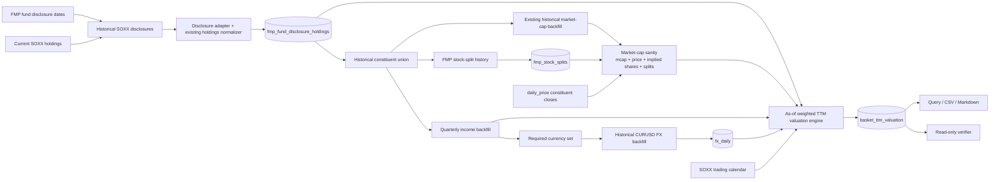
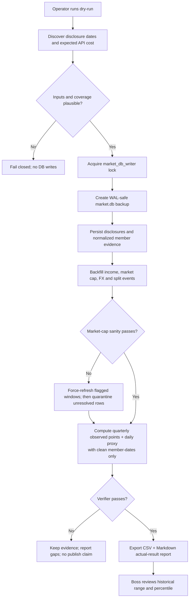

# SOXX Historical TTM PE Implementation Plan

> **For Claude:** REQUIRED SUB-SKILL: Use `using-git-worktrees` for isolation, then execute every implementation task with TDD (RED → GREEN → commit). Use `requesting-code-review` before merge. Do not change production cron in this plan.

**Confidence: 88%**

**不确定点**: FMP 历史 disclosure 是季度末实际持仓权重，而 SOXX 官方调仓在第三个星期五收盘后生效；本计划把季度末权重固定回映到下一个交易日，适合描述性 proxy，但不等同于官方逐日指数权重。2026Q2 disclosure 尚未发布，6 月调仓后区间只能回映抓取日已经漂移的 live 权重，证据层级更弱。FMP 历史财报可按 `accepted_date` 防公告日前视，但可能包含后续重述，不是完整的 vintage database。`historical_market_cap` 还存在 issue035 这类“新鲜但错误”的行，必须先过 sanity gate。

**北极星对齐**: 对齐 `docs/design/north-star.md` 第一层 Data（fundamentals + time series + provenance）与第二层 Fundamental Analysis（可解释估值）。不改变四层架构，不新增重大子系统；沿用现有 FMP client、MarketStore、historical market cap 与 cron lock 体系。

**Goal:** 按 SOXX 历史披露权重，重建 2021-09 至今的季度观察点与日频 rebalance-weighted GAAP TTM PE proxy，保留调仓、披露、财报、汇率和覆盖率证据，并产出可查询的真实结果。

**Architecture:** 在现有 Data Desk 内新增一条独立的 historical basket valuation pipeline。FMP `pctVal` 提供经上限处理后的权重，历史市值必须先经过 price/implied-shares/split 交叉 sanity；通过后再与严格 as-of 的连续四季度净利润形成成员 earnings yield，估值日 FX 统一币种。历史 GAAP TTM proxy 与现有 forward PE 分表存储，禁止混用。

**Tech Stack:** Python 3.10、SQLite/WAL、现有 `FMPClient`/`MarketStore`、pytest、bash resource lock、CSV/Markdown export。

**Research:** `docs/research/2026-07-14-soxx-historical-pe-feasibility.md`

---

## 1. Why This Metric

当前系统从 2026-07-13 起才有可审计的 forward EPS snapshot，因此只能从该日开始积累真实 forward PE 历史。为了现在就观察 SOXX 的历史估值区间，本计划使用 GAAP trailing twelve-month net income 重建两种明确命名的指标：

```text
earnings_yield_i(t)
  = Σq net_income_native_i,q × CURUSD_currency_i,q(t) / market_cap_i(t)

eligible_weight(t) = Σ normalized valid equity weights
covered_weight(t)  = Σ weights with market cap + continuous 4Q income + FX

weighted_earnings_yield(t)
  = Σcovered weight_i × earnings_yield_i / covered_weight

soxx_rebalance_weighted_ttm_pe_proxy(t)
  = 1 / weighted_earnings_yield(t)

uncapped_mcap_basket_pe(t)
  = Σcovered market_cap_i / Σcovered TTM_net_income_usd_i
```

重要语义：

- 主指标是 `fixed_rebalance_weight_proxy`，不是官方 SOXX PE，更不是 forward PE；
- FMP `pctVal` 经非股票过滤和 `covered_by` 权重归并后作为权重 SSOT，在两次调仓之间固定；
- `Σ market cap / Σ net income` 只作为次要的 uncapped constituent-basket 指标；
- 主、次指标都只使用同一组“完整覆盖成员”；
- 负净利润以负 earnings yield 纳入，不做盈利公司幸存者过滤；
- 每个估值日只使用当时已经披露的财报；
- 通过可见性门控的本币 TTM 净利润按估值日 FX 换算；
- 历史权重由事后披露回映，结果属于描述性历史 proxy。

## 2. Architecture



### Dependency direction

```text
FMP client → ingestion/normalization → MarketStore source tables
                                     → pure valuation engine
                                     → output table → query/verifier
```

Scripts are orchestration only. Date selection, currency conversion, coverage and PE computation remain pure/testable functions under `terminal/` or `src/data/`.

## 3. Business Flow



## 4. Source Contracts and Date Semantics

### 4.1 Holdings sources

Historical snapshots:

```text
GET /stable/funds/disclosure-dates?symbol=SOXX
GET /stable/funds/disclosure?symbol=SOXX&year=YYYY&quarter=Q
```

Current snapshot remains:

```text
GET /stable/etf/holdings?symbol=SOXX
```

The historical endpoint is mandatory because live ETF holdings ignored the probed historical `date` parameter.

Split cross-check source:

```text
GET /stable/splits?symbol=KLAC
```

The endpoint returns split `date`, `numerator`, `denominator` and `splitType`; live probing confirmed the KLAC 10:1 event on 2026-06-12. Official contract: <https://site.financialmodelingprep.com/developer/docs/stable/splits-company>.

### 4.2 Three composition dates

| Field | Definition | Rule |
|---|---|---|
| `holding_date` | Vendor quarter-end snapshot date | Preserve verbatim |
| `rebalance_close_date` | Official scheduled rebalance close | Third Friday of Mar/Jun/Sep/Dec |
| `composition_effective_date` | Proxy starts using the new fixed weight | First SOXX trading date after rebalance close |
| `composition_available_date` | Complete snapshot externally visible | Historical: max row `acceptedDate`; live: fetch date |

`composition_effective_date` drives the descriptive daily proxy. Every output row also carries `composition_available_date` and `is_ex_post_composition=1` when the valuation date precedes it. `acceptedDate` values must be internally consistent within a snapshot; inconsistencies are retained and warned, and the snapshot-level available date is their maximum.

The official methodology says March/June/December rebalances recalculate weights but do not normally add/remove members. Any membership delta outside September is flagged as `non_reconstitution_membership_delta`; the first version retains the observed fund snapshot but does not claim the delta was caused by the scheduled rebalance.

**Live-tail rule (2026Q2 and any future disclosure lag):** when the latest scheduled rebalance has no quarterly disclosure yet, fetch live `etf/holdings(SOXX)` and set:

- `source_kind='live'`;
- `holding_date = composition_available_date = actual fetch/snapshot date`;
- `rebalance_close_date = most recent scheduled rebalance close` (2026-06-19 for the current gap);
- `composition_effective_date = first SOXX trading date after that close`;
- `weight_basis='live_snapshot_backcast_proxy'` for the backcast interval, because fetch-date weights have already drifted since rebalance;
- `is_ex_post_composition=1` before the live fetch date and `0` from the fetch date onward.

The report must separate this live-tail quality tier from `historical_disclosure_fixed_proxy`; it may not silently join the two under one label.

### 4.3 Weight semantics

- Remove cash/fund/swap rows using the existing holdings normalizer.
- Merge `covered_by` rows into the covered equity weight before aggregation.
- `eligible_weight = Σ` normalized valid equity weights.
- A member is covered only if market cap, four continuous visible quarters and required FX are all present.
- `covered_weight = Σ` covered member weights.
- `weight_coverage = covered_weight / eligible_weight`.
- Normalize the primary PE calculation by `covered_weight`; missing weights are not treated as cash or zero earnings yield.
- On `holding_date`, the FMP weight is an observed quarterly anchor.
- For historical-disclosure daily output, hold that same weight fixed from `composition_effective_date` until the next scheduled effective date and label it `weight_basis=fixed_rebalance_weight_proxy`.
- For the disclosure-lag interval sourced from a live snapshot, use the same fixed-weight computation but preserve `weight_basis=live_snapshot_backcast_proxy` and the weaker `data_quality_tier`; the historical rule must not overwrite this label.
- Do not simulate daily weight drift in Phase 1 because existing constituent price sources are not contractually guaranteed to be split-adjusted and consistent.

### 4.4 Trading calendar

Use dates present in `daily_price` for `SOXX`, starting at the first trading day after the first rebalance close (expected 2021-09-20) and ending at the latest available SOXX trading date. Do not synthesize weekends or holidays. The calendar—not a weekday assumption—selects the effective date.

### 4.5 Market cap as-of

For each member/date, choose the latest `historical_market_cap.date <= valuation_date`. Maximum staleness is 7 calendar days. A stale or missing value excludes the member from both aggregate numerator and denominator and records a reason.

The earlier 95.57% feasibility figure used a 10-day lookup window. The production dry-run must recompute snapshot and daily coverage under this exact 7-day rule before accepting the `>=95% publishable trading dates` target; if the target misses, report the measured result rather than loosening staleness.

### 4.6 Market-cap sanity and repair

Freshness and non-null checks do not catch an incorrect row. Before valuation, scan the complete historical constituent union daily:

```text
mcap_return(t)       = market_cap(t) / market_cap(t-1) - 1
price_return(t)      = close(t) / close(t-1) - 1
implied_shares(t)    = market_cap(t) / close(t)
implied_share_ratio  = implied_shares(t) / implied_shares(t-1)
```

Candidate trigger: `abs(mcap_return) > 40%` **or** the date is within one trading day of a persisted split event. Classification then uses price alignment and split evidence:

- `price_move_plausible`: market-cap and close returns align within 15 percentage points and implied shares stay within ±20% (SLAB 2026-02-04 pattern);
- `split_consistent`: market cap remains economically continuous while implied shares change by the announced split ratio near the event;
- `invalid_mcap`: market cap changes sharply without matching price or correctly timed split/share change (MCHP 2026-02-02/09 pattern), or a split leaves market cap off by the split factor (KLAC issue035 pattern);
- `unresolved`: insufficient price/split evidence; fail closed.

An unsupported implied-share discontinuity opens an anomaly interval. That state persists through later low-volatility rows until a reverse discontinuity or split-consistent normalization closes it. The complete bad interval—not only the opening trigger date—is classified and repaired/quarantined; the normalization row is separately revalidated rather than automatically quarantined. This is required to cover all KLAC 2026-06-10..2026-06-23 and MCHP 2026-02-02..2026-02-06 observations.

Split acceptance also requires economic continuity. For an observed share-count change, compare market-cap return with `(1 + raw_price_return) × split_ratio - 1`; for an already back-adjusted series, compare with raw price return. Both returns must stay within the 40% jump threshold and align within 15 percentage points. A synchronous price+mcap divide therefore cannot masquerade as an already-adjusted split; the post-split expected-share regime remains open until mcap recovers.

Known one-time-study boundaries remain documented in `docs/issues/046-market-cap-sanity-gradual-drift-and-bootstrap-anchor.md`: a sub-threshold multi-day implied-share drift may re-anchor gradually, and a symbol's first row has no prior observation for validation. A recurring pipeline must add rolling-anchor and multi-row bootstrap evidence before promotion.

Repair policy:

1. Clean existing rows remain idempotently skipped.
2. Any `invalid_mcap` or `unresolved` existing window becomes **eligible for forced re-fetch and overwrite**; “row exists” is not completeness.
3. Expand refresh range by five trading days on each side, overwrite atomically, and rerun sanity once.
4. If still invalid, quarantine those symbol-dates from both primary and secondary PE calculations and emit member/row warnings; never forward-fill across a quarantined anomaly.
5. Known acceptance anchor: KLAC 2026-06-10 through 2026-06-23 must either be corrected to economically continuous market cap or excluded. This is the OPEN bug documented at `docs/issues/035-klac-split-cross-table-adjustment-inconsistency.md`.

### 4.7 Earnings as-of

For each resolved member/date:

1. filter `income_quarterly.accepted_date <= valuation_date`;
2. deduplicate fiscal periods deterministically;
3. choose the latest four unique fiscal quarters;
4. require the four fiscal periods to be continuous: each adjacent fiscal-end gap must be 60–120 days; a missing middle quarter fails closed;
5. require exactly four numeric `net_income` values;
6. include negative values;
7. record the four fiscal dates and accepted dates in member evidence.

This prevents announcement-date look-ahead. It does not claim protection against later vendor restatements.

Malformed rows older than the provisional four-quarter TTM window are ignored; a malformed row inside or after that window fails closed and cannot silently force fallback to a stale TTM. Cross-run restatement vintages are not preserved by the current `(symbol,date)` source-table key; see `docs/issues/047-income-quarterly-overwrite-loses-restatement-vintages.md`.

KLAC's 2024-03-31 split-basis residue affects EPS/shares, not total `net_income`; this pipeline deliberately uses net income and is immune to that row's per-share mismatch. MU FY2026 Q2/Q3 extreme net income is verified ground truth (`docs/issues/037-mu-income-quarterly-last-two-quarters-corrupted.md` is `RESOLVED — FALSE ALARM`) and receives no special exclusion.

### 4.8 FX as-of

- USD income uses rate `1.0` without an API call.
- For each non-USD quarterly income row, use direct `CURUSD` close as USD per native unit.
- `accepted_date` only controls statement visibility. Convert all visible TTM income using the latest FX date `<= valuation_date`, maximum staleness 7 calendar days.
- When all four quarters share one reported currency, the same valuation-date FX rate applies to the complete local-currency TTM sum.
- If direct pair is unavailable, fail that member closed; do not silently invert or triangulate without an explicit tested rule.
- Direct-pair direction and magnitude are validated at read/fetch/write boundaries: EURUSD must be within 0.50–2.00 USD/EUR and TWDUSD within 0.02–0.05 USD/TWD. Unknown non-USD currencies fail closed until explicitly allowlisted.
- Persist `currency`, `fx_date`, `usd_per_unit`, and `source_symbol`.

### 4.9 Alias resolution

Resolution order:

1. disclosure raw symbol;
2. explicit alias with matching CIK;
3. explicit configured alias backed by a documented corporate action.

No fuzzy name matching. Evidence records both symbols and the reason. Initial fixture must cover `CREE → WOLF` only if the raw symbol lacks the required data and CIK equivalence is confirmed.

## 5. Storage Design

### 5.1 `fmp_fund_disclosure_holdings`

Purpose: atomically replaceable source/audit cache for historical and live constituent snapshots.

| Column | Notes |
|---|---|
| `basket_symbol` | `SOXX` |
| `holding_date` | Vendor snapshot date |
| `source_kind` | `disclosure` or `live` |
| `raw_row_index` | Preserve every source row |
| `rebalance_close_date` | Scheduled third Friday |
| `composition_effective_date` | Next SOXX trading date |
| `composition_available_date` | Max row `acceptedDate` or live fetch date |
| `raw_symbol`, `symbol`, `name` | Provenance + normalized member |
| `weight_pct`, `market_value` | Vendor values |
| `cik`, `cusip`, `isin` | Identity evidence |
| `included`, `filter_reason`, `covered_by` | Existing normalization semantics |
| `created_at` | Audit timestamp |

Primary key: `(basket_symbol, holding_date, source_kind, raw_row_index)`.

Write contract: replace one complete snapshot atomically; never mix partial rows with an old snapshot.

### 5.2 `fx_daily`

Purpose: reproducible USD conversion inputs without polluting equity `daily_price`.

| Column | Notes |
|---|---|
| `currency` | ISO code, e.g. EUR/TWD |
| `date` | FX market date |
| `usd_per_unit` | Direct `CURUSD` close |
| `source_symbol` | e.g. EURUSD |
| `source` | `fmp` |
| `created_at` | Audit timestamp |

Primary key: `(currency, date)`.

### 5.3 `fmp_stock_splits`

Purpose: make market-cap sanity reproducible and keep the verifier read-only/offline.

| Column | Notes |
|---|---|
| `symbol` | Normalized constituent symbol |
| `date` | Split effective date |
| `numerator`, `denominator` | Vendor ratio |
| `split_type` | Vendor `splitType` |
| `source` | `fmp` |
| `fetched_at` | Audit timestamp |

Primary key: `(symbol, date, numerator, denominator)`.

### 5.4 `basket_ttm_valuation`

Purpose: one auditable daily GAAP TTM PE row per basket.

| Column group | Fields |
|---|---|
| Identity | `basket_symbol`, `valuation_date` |
| Composition | `holding_date`, `composition_effective_date`, `composition_available_date`, `is_ex_post_composition` |
| Weight basis | `weight_basis`, `data_quality_tier`, `is_observed_weight_date`, `eligible_weight`, `covered_weight` |
| Primary metric | `rebalance_weighted_ttm_pe_gaap_proxy`, `weighted_earnings_yield` |
| Secondary metric | `uncapped_mcap_basket_pe_gaap`, `covered_market_cap`, `ttm_net_income_usd` |
| Coverage | `member_count`, `covered_count`, `weight_coverage`, `mcap_weight_coverage`, `income_weight_coverage`, `fx_weight_coverage` |
| Evidence | `members_json`, `warnings_json`, `mcap_sanity_json`, `methodology_version`, `created_at` |

Primary key: `(basket_symbol, valuation_date)`.

`members_json` includes each raw/resolved symbol, normalized source weight, inclusion status, market-cap observation and sanity status, four fiscal/accepted dates, reported currencies, valuation-date FX observations, USD TTM income, earnings yield and exclusion reason. `mcap_sanity_json` records trigger/classification/repair/quarantine evidence for all flagged member-dates.

`weight_coverage` is the publish gate because it still accounts for a member whose market cap is missing. Market-cap/income/FX coverage are recorded as **source-specific weight coverage diagnostics** rather than using an unknowable `universe_market_cap` denominator.

### 5.5 Why separate from forward tables

Do not overload `fmp_etf_holdings_snapshot` or `fmp_basket_valuation`:

- the former is the weekly live forward pipeline source;
- the latter contains forward EPS aggregation semantics;
- mixing GAAP TTM and forward consensus under one schema invites downstream metric confusion and accidental cron regressions.

## 6. Alternatives Considered

| Option | Advantages | Disadvantages | Decision |
|---|---|---|---|
| One-off notebook/CSV | Fastest first chart | No provenance, no idempotency, no verifier, hard to reproduce | Reject |
| Reuse forward holdings/valuation tables | Fewer tables | Conflates live vs historical and GAAP vs forward semantics; regression risk | Reject |
| Only 19 holding-date points | Uses actually observed weights; simplest to explain | Too sparse for percentile/timing context | Include as the high-confidence anchor series |
| Dedicated historical pipeline + fixed-weight daily proxy | Clear metric/date contracts, auditable, reusable for QQQ/SMH later | Daily values remain an ex-post approximation | **Choose as the second output layer** |
| Buy official point-in-time index constituent database | Highest fidelity | Cost and vendor integration; unnecessary before proving product value | Defer |

## 7. Failure Policy and Safety Boundaries

- API responses that are non-list/error-shaped raise `FMPResponseError`.
- Empty disclosure-date set, empty source snapshot, or zero included members fails fast.
- A single constituent gap does not abort the entire date; it reduces coverage and is reported.
- A fresh/non-null market-cap row is not automatically valid. `invalid_mcap`/`unresolved` rows are force-refreshed once, then quarantined if still bad; they never enter PE.
- Primary PE is null if weighted earnings yield is zero/negative, `weight_coverage < 0.90`, or no covered members exist. The secondary uncapped basket PE is null if aggregate covered TTM income is zero/negative.
- Publish threshold: `weight_coverage >= 0.90`. Source-specific market-cap/income/FX weight coverage remains diagnostic and must be reported.
- `>20%` constituent failure in any required backfill stage trips a batch fuse before valuation publication.
- Each snapshot, symbol, currency batch, or output range write is individually atomic; there is no whole-backfill transaction. The post-stage `>20%` completion gate blocks downstream valuation publication but retains earlier successful idempotent source writes. Dry-run writes nothing.
- Production run must acquire the existing `market_db_writer` resource lock and make a WAL-safe backup before the first write.
- Never log API key-bearing URLs or response objects containing keys.
- No `.env`, database, backup or generated bulk CSV is committed unless explicitly approved.
- No change to the existing Saturday FMP forward cron in this plan.

## 8. Acceptance Criteria

### Data integrity

- [ ] Load all 19 FMP disclosure dates observed from 2021Q3 through 2026Q1, plus the current live snapshot; evidence-backed vendor drift is allowed and reported.
- [ ] Preserve every raw disclosure row and a normalized included/excluded decision.
- [ ] Historical raw-symbol union remains near the observed 41; unexplained shrinkage fails verification.
- [ ] Source snapshot weight sum is within 99.5%–100.5% before normalization, or emits a blocking warning.
- [ ] Included membership is plausibly 25–31 equity names per snapshot; exceptions require explicit evidence.
- [ ] March/June/December membership deltas emit a distinct warning because scheduled quarterly rebalances normally change weights only.
- [ ] Snapshot `composition_available_date` is the maximum row `acceptedDate`; inconsistent row dates are reported.
- [ ] Live tail uses `source_kind=live`, explicit fetch/available date, most recent rebalance close/effective date, and `weight_basis=live_snapshot_backcast_proxy`; report separates it from historical disclosure quality.
- [ ] Persist split evidence for every constituent with a returned FMP event; KLAC includes 2026-06-12 10:1.
- [ ] Scan every historical constituent for `>40%` daily market-cap jumps and all split-adjacent dates using close/implied-shares/split evidence.
- [ ] KLAC 2026-06-10..2026-06-23 and MCHP 2026-02-02..2026-02-06 cannot enter PE unless forced refresh makes them pass sanity; normalization boundary rows are independently revalidated and unresolved rows are quarantined.
- [ ] SLAB 2026-02-04 fixture demonstrates that a price-aligned +48.9% move is not automatically deleted.
- [ ] `PRAGMA quick_check` returns `ok`; duplicate primary keys are zero.

### Time correctness

- [ ] Every income row used satisfies `accepted_date <= valuation_date`.
- [ ] Every market-cap row used satisfies `mcap_date <= valuation_date` and staleness `<=7` days.
- [ ] Every market-cap row used has `mcap_sanity_status` in the accepted allowlist (`clean`, `price_move_plausible`, `split_consistent`); invalid/unresolved status is excluded without forward-fill.
- [ ] Every FX row used satisfies `fx_date <= valuation_date` and staleness `<=7` days.
- [ ] Composition switch dates are the first SOXX trading date after the third-Friday close and remain labeled `inferred`.
- [ ] Each row records whether its full composition was observable on that valuation date.

### Metric correctness

- [ ] Exactly four unique, continuous fiscal quarters are used for each covered member; a missing middle quarter fails closed.
- [ ] Negative net income is included, not filtered.
- [ ] EUR/TWD and any other non-USD income is converted with persisted direct `CURUSD` rates.
- [ ] The primary metric equals the covered-weight-normalized sum of member earnings yields; missing weight is not treated as cash.
- [ ] The secondary uncapped basket numerator and denominator contain the same covered member set.
- [ ] Published rows meet the 90% weight-coverage gate and report source-specific diagnostic coverage.
- [ ] Current-period result is compared with iShares published P/E only as a non-blocking sanity check because methodologies can differ.

### Product result

- [ ] Produce the 19 observed `holding_date` anchor points plus current live point.
- [ ] Produce a daily fixed-rebalance-weight proxy from the first post-rebalance trading date (expected 2021-09-20) through the latest SOXX trading date.
- [ ] Dry-run recomputes 7-day snapshot and daily coverage; the prior 10-day 95.57% figure is informational only.
- [ ] Target at least 95% of SOXX trading dates with publishable PE under the 7-day rule; if measured coverage is lower, deliver the exact dated gap report and stop before claiming the target passed—do not widen staleness.
- [ ] Query output clearly labels the rebalance-weighted proxy and uncapped basket metric, and shows current PE proxy, history percentile, min/max/median, coverage and composition dates.
- [ ] Export a reproducible CSV and a Markdown actual-result report.
- [ ] Re-running the entire backfill is idempotent and deterministic for unchanged inputs.

### Regression and security

- [ ] Existing FMP forward, yfinance forward and cron suites remain green.
- [ ] Python 3.10 AST/import checks, `git diff --check`, security grep and `bash -n` pass.
- [ ] No production cron changes.

## 9. Detailed TDD Implementation Tasks

### Task 0: Freeze source-contract fixtures and research evidence

**Files:**

- Create: `tests/fixtures/fmp_fund_disclosure_dates_soxx.json`
- Create: `tests/fixtures/fmp_fund_disclosure_soxx_2025q3.json`
- Create: `tests/fixtures/fmp_fx_eurusd_sample.json`
- Create: `tests/fixtures/fmp_fx_twdusd_sample.json`
- Create: `tests/fixtures/fmp_splits_klac.json`
- Modify: `docs/research/2026-07-14-soxx-historical-pe-feasibility.md`

**Steps:**

1. Redact fixtures to the smallest representative payload while preserving field shapes and edge cases.
2. Assert no key-like values appear in fixtures.
3. Record endpoint, retrieval date and expected shape in fixture metadata or tests.
4. Run:

   ```bash
   rg -n -i '(apikey|api_key|secret|token)[=:][^$<{ ]' tests/fixtures docs/research
   git diff --check
   ```

5. Commit: `test(fmp): freeze SOXX disclosure FX and split contracts`

### Task 1: Add historical disclosure, FX and split client methods

**Files:**

- Modify: `src/data/fmp_client.py`
- Create: `tests/test_fmp_historical_valuation_client.py`

**Public methods:**

```python
get_fund_disclosure_dates(symbol: str) -> list[dict]
get_fund_disclosure(symbol: str, year: int, quarter: int) -> list[dict]
get_historical_fx(symbol: str, from_date: str, to_date: str) -> list[dict]
get_stock_splits(symbol: str) -> list[dict]
```

**RED tests:**

- correct endpoint/parameters;
- instance-level rate limiting still applies;
- list payload passes;
- error dict/non-list raises `FMPResponseError`;
- API key redaction protects logs;
- year/quarter/date validation fails before network.
- split details preserve `date/numerator/denominator/splitType` and reject malformed payloads.

**GREEN:** implement the narrow wrappers using existing `_get`, `_sanitize_for_logging` and response error conventions; no generic new abstraction.

**Verify:**

```bash
"/Users/owen/CC workspace/Finance/.venv/bin/python" -m pytest tests/test_fmp_historical_valuation_client.py tests/test_fmp_forward_client.py -q
```

**Commit:** `feat(fmp): add disclosure FX and split endpoints`

### Task 2: Add storage schema and narrow CRUD

**Files:**

- Modify: `src/data/market_store.py`
- Create: `tests/test_market_store_historical_basket_valuation.py`

**RED tests:**

- tables and constraints are created additively;
- complete snapshot replacement is atomic;
- mid-batch failure rolls back the whole snapshot;
- cached raw rows change only through complete atomic snapshot replacement; partial append/update is forbidden;
- FX upsert is idempotent;
- split-event upsert is idempotent and ratio fields are positive;
- valuation daily upsert/get range is deterministic;
- JSON evidence round-trips;
- read-only query path does not create/write a DB.

**GREEN:** add exactly the four tables in §5 and narrow methods:

```python
replace_fund_disclosure_snapshot(...)
get_fund_disclosure_snapshots(...)
upsert_fx_daily(...)
get_fx_at_or_before(...)
upsert_stock_splits(...)
get_stock_splits(...)
upsert_basket_ttm_valuations(...)
get_basket_ttm_valuations(...)
```

**Verify:**

```bash
"/Users/owen/CC workspace/Finance/.venv/bin/python" -m pytest tests/test_market_store_historical_basket_valuation.py tests/test_market_store_fmp_forward.py tests/test_market_store_mcap.py -q
```

**Commit:** `feat(store): add auditable historical basket valuation tables`

### Task 3: Normalize disclosures and infer rebalance dates

**Files:**

- Modify: `src/data/fmp_forward_ingestion.py`
- Create: `tests/test_fmp_fund_disclosure_ingestion.py`
- Create: `config/soxx_symbol_aliases.json`

**RED tests:**

- map `symbol/pctVal/valUsd/acceptedDate` to the existing holdings-normalizer contract;
- preserve one result per raw row;
- cash/fund rows remain retained but excluded;
- foreign/dual-class rules reuse current behavior;
- March/June/September/December third-Friday close inference, including month starting Saturday/Sunday;
- effective date resolves to the next date in the SOXX trading calendar;
- historical `acceptedDate` and live fetch date stay distinct;
- snapshot available date uses max row `acceptedDate` and warns on inconsistent rows;
- March/June/December membership deltas receive a distinct warning;
- current live snapshot derives the latest rebalance close/effective dates and uses `live_snapshot_backcast_proxy` with fetch-date quality semantics;
- alias requires matching CIK or explicit evidence; fuzzy match forbidden.

**GREEN:** add a thin disclosure adapter plus `infer_soxx_rebalance_close()` and `next_trading_date()`; call existing `normalize_holdings()` instead of duplicating filters.

**Verify:**

```bash
"/Users/owen/CC workspace/Finance/.venv/bin/python" -m pytest tests/test_fmp_fund_disclosure_ingestion.py tests/test_fmp_forward_ingestion.py -q
```

**Commit:** `feat(valuation): normalize SOXX disclosure history`

### Task 4: Add market-cap sanity, forced refresh and quarantine

**Files:**

- Create: `terminal/historical_market_cap_sanity.py`
- Create: `tests/test_historical_market_cap_sanity.py`
- Modify only if necessary: `scripts/fetch_historical_mcap.py`

**Core pure functions:**

```python
scan_market_cap_candidates(...)
classify_market_cap_candidate(...)
build_forced_refresh_windows(...)
accepted_market_cap_status(...)
```

**RED tests:**

- KLAC-shaped fixture: mcap falls ÷10 while close is stable before a 10:1 split, remains wrong after split, then jumps ×10 with flat close → `invalid_mcap` across the complete contaminated window;
- MCHP-shaped fixture: mcap ×2, stays doubled through 2026-02-06, then normalizes on 2026-02-09 while close stays roughly flat and no split exists → the complete 2026-02-02..2026-02-06 bad interval is `invalid_mcap`, while the normalization row is independently revalidated;
- interval propagation marks every row between the unsupported implied-share discontinuity and its normalization, not only the boundary jump dates;
- SLAB-shaped fixture: mcap and close both +48.9% with stable implied shares → `price_move_plausible`;
- a correct 10:1 split keeps mcap continuous and implied shares changes by the announced ratio → `split_consistent`;
- a split-adjacent date is inspected even when `abs(mcap_return) <=40%`;
- invalid windows expand five trading days on both sides for forced refresh;
- existing clean rows are skipped, but existing invalid/unresolved rows are never considered complete;
- failed post-refresh sanity produces quarantine dates and forbids forward-fill across them;
- classifications and thresholds are deterministic and serialized into evidence.

**GREEN:** implement pure classification first. Add the thinnest adapter needed to force-overwrite a flagged `historical_market_cap` window using the existing FMP market-cap fetch path; do not duplicate the historical-mcap downloader.

**Verify:**

```bash
"/Users/owen/CC workspace/Finance/.venv/bin/python" -m pytest tests/test_historical_market_cap_sanity.py tests/test_market_store_mcap.py tests/test_fmp_client_mcap.py -q
```

**Commit:** `feat(valuation): gate historical market cap anomalies`

### Task 5: Build the pure as-of GAAP TTM valuation engine

**Files:**

- Create: `terminal/historical_basket_valuation.py`
- Create: `tests/test_historical_basket_valuation.py`

**Core pure functions:**

```python
select_asof_market_cap(...)
select_four_continuous_asof_quarters(...)
select_asof_fx(...)
compute_member_ttm_income_usd(...)
compute_weighted_ttm_pe_proxy(...)
compute_uncapped_mcap_basket_pe(...)
```

**RED tests:**

- a quarter accepted tomorrow is invisible today;
- duplicate fiscal periods are deterministic;
- exactly four unique continuous quarters are required, and a missing middle quarter fails closed;
- negative income produces negative member earnings yield and reduces both aggregate earnings measures;
- EUR/TWD conversion uses direct USD-per-unit rate as of valuation date, not income acceptance date;
- stale/missing/invalid/unresolved market cap or missing FX excludes the member from both sides;
- quarantined market-cap dates are never rescued by as-of forward-fill from a neighboring clean row;
- `covered_by` weights merge before eligible/covered weight calculation;
- primary weighted earnings yield is normalized by covered weight;
- secondary basket numerator and denominator use the same covered symbols;
- `weight_coverage` denominator is all normalized eligible equity weight;
- source-specific mcap/income/FX weight coverage is reported;
- primary PE is null when weighted earnings yield `<=0` or weight coverage `<90%`;
- member evidence contains every input date/rate/exclusion reason;
- historical composition before `available_date` is labeled ex-post.

**GREEN:** implement simple dataclasses/pure functions. Do not access SQLite or FMP in the engine.

**Verify:**

```bash
"/Users/owen/CC workspace/Finance/.venv/bin/python" -m pytest tests/test_historical_basket_valuation.py -q
```

**Commit:** `feat(valuation): compute strict as-of basket TTM PE`

### Task 6: Add staged, idempotent backfill orchestration

**Files:**

- Create: `scripts/backfill_soxx_historical_pe.py`
- Create: `tests/test_backfill_soxx_historical_pe.py`
- Modify only if necessary: `scripts/fetch_historical_mcap.py`

**CLI contract:**

```text
python -m scripts.backfill_soxx_historical_pe \
  --stage source|fundamentals|mcap|splits|mcap_sanity|fx|compute|all \
  --from-date YYYY-MM-DD --to-date YYYY-MM-DD \
  [--dry-run] [--allow-network] [--db PATH]
```

**RED tests:**

- naked dry-run makes zero network calls unless explicitly given `--allow-network`;
- dry-run never opens DB writable;
- stages call only their owned endpoint/store paths;
- existing complete source/fundamental/FX/split rows and **sanity-clean** mcap rows are skipped on rerun;
- existing mcap rows classified invalid/unresolved are force-refetched and atomically overwritten, then rechecked once;
- unresolved post-refresh windows are quarantined and propagated into valuation evidence;
- dry-run prints 7-day snapshot coverage, projected daily publishable coverage, flagged jumps, planned forced-refresh windows and live-tail quality tier;
- empty source/member union fails fast;
- `>20%` per-symbol failure trips fuse;
- rerun is idempotent;
- non-dry-run creates a WAL-safe backup before the first write;
- failures return non-zero and never print secrets;
- historical market-cap logic wraps/reuses existing implementation rather than copying it.

**GREEN:** implement sequential calls with existing FMP interval. Keep orchestration in script, logic in existing modules. Do not add a run-manifest table for this ~41-symbol one-time job; stage boundaries plus idempotent upserts provide recovery.

**Verify:**

```bash
"/Users/owen/CC workspace/Finance/.venv/bin/python" -m pytest tests/test_backfill_soxx_historical_pe.py tests/test_fmp_historical_valuation_client.py tests/test_historical_market_cap_sanity.py tests/test_historical_basket_valuation.py -q
```

**Commit:** `feat(valuation): orchestrate idempotent SOXX history backfill`

### Task 7: Add query and export CLI

**Files:**

- Create: `scripts/query_basket_ttm_pe.py`
- Create: `tests/test_query_basket_ttm_pe.py`

**CLI output:**

- current rebalance-weighted GAAP TTM PE proxy and secondary uncapped basket PE;
- percentile using `count(values <= current) / total * 100`;
- min, max, median and observation count;
- the 19 observed `holding_date` anchor points separately from the daily fixed-weight proxy;
- current coverage, composition dates, `data_quality_tier`, market-cap sanity warnings and quarantine gaps;
- optional `--as-of`, `--from-date`, `--to-date`, `--csv`, `--markdown`;
- explicit banner: `SOXX rebalance-weighted GAAP TTM PE proxy; fixed retrospective snapshot weights; not official SOXX PE or historical forward PE`.

**RED tests:** percentile ties, null PE exclusion, read-only DB URI, empty range exit 2, deterministic CSV and Markdown.

**Verify:**

```bash
"/Users/owen/CC workspace/Finance/.venv/bin/python" -m pytest tests/test_query_basket_ttm_pe.py -q
```

**Commit:** `feat(valuation): query and export basket TTM PE history`

### Task 8: Add read-only source recomputation verifier

**Files:**

- Create: `scripts/verify_basket_ttm_pe.py`
- Create: `tests/test_verify_basket_ttm_pe.py`

**Checks:**

1. DB opened with `mode=ro`;
2. source snapshot count/range and raw-row uniqueness;
3. plausible snapshot weight/member counts;
4. trading-calendar denominator is SOXX `daily_price` SSOT;
5. output date continuity and `>=95%` publishable coverage;
6. all published rows satisfy the 90% weight-coverage gate and source-specific coverage fields are consistent;
7. evidence proves mcap/income/FX as-of constraints;
8. recompute every output date's weights, continuous quarters, FX and both PE metrics from disclosure/income/HMC/FX source tables—not only from output `members_json`;
9. duplicate PK and invalid JSON are zero;
10. drift warnings distinguish source, live-tail quality, non-September membership delta, market-cap sanity, fundamentals, FX and computation gaps;
11. rerun jump/split/implied-shares detection directly from `historical_market_cap`, `daily_price` and `fmp_stock_splits`; fail if any published member-date is invalid/unresolved, with explicit KLAC/MCHP anchors.

**RED tests:** one fixture per failure classification plus all-green fixture.

**Verify:**

```bash
"/Users/owen/CC workspace/Finance/.venv/bin/python" -m pytest tests/test_verify_basket_ttm_pe.py -q
```

**Commit:** `feat(valuation): verify SOXX historical PE read-only`

### Task 9: Wire documentation and full regression gates

**Files:**

- Modify: `ARCHITECTURE.md`
- Modify: `CLAUDE.md`
- Create if a new pitfall emerges: `docs/issues/NNN-*.md`

**Documentation:** metric semantics, tables, one-time commands, date caveats, no-cron status, future extension point for QQQ/SMH.

**Verification:**

```bash
"/Users/owen/CC workspace/Finance/.venv/bin/python" -m pytest \
  tests/test_fmp_historical_valuation_client.py \
  tests/test_market_store_historical_basket_valuation.py \
  tests/test_fmp_fund_disclosure_ingestion.py \
  tests/test_historical_market_cap_sanity.py \
  tests/test_historical_basket_valuation.py \
  tests/test_backfill_soxx_historical_pe.py \
  tests/test_query_basket_ttm_pe.py \
  tests/test_verify_basket_ttm_pe.py -q

"/Users/owen/CC workspace/Finance/.venv/bin/python" -m pytest \
  tests/test_fmp_forward_client.py \
  tests/test_fmp_forward_ingestion.py \
  tests/test_market_store_fmp_forward.py \
  tests/test_update_fmp_forward.py \
  tests/test_verify_fmp_forward.py \
  tests/test_forward_cron_entrypoint.py \
  tests/test_market_store_mcap.py \
  tests/test_fmp_client_mcap.py -q

"/Users/owen/CC workspace/Finance/.venv/bin/python" -m compileall -q src terminal scripts
bash -n scripts/*.sh
git diff --check
```

Run the full suite and compare failures with the frozen baseline.

**Commit:** `docs(valuation): document SOXX historical TTM PE pipeline`

### Task 10: Independent code review and hardening

Use the code-review workflow against the full branch diff, with explicit audit prompts for:

- composition effective vs available date;
- financial-statement look-ahead;
- restatement caveat;
- native-currency conversion;
- fresh-but-wrong market cap, split cross-check, forced-refresh ordering and quarantine propagation;
- weighted earnings-yield formula and fixed-weight proxy labeling;
- coverage denominator consistency;
- aliases, non-September membership deltas and corporate actions;
- transaction/backup ordering;
- dry-run/network/write semantics;
- secret leakage;
- no existing forward cron/table regression.

Fix all P0/P1 findings with RED tests. Re-run Task 9 gates. Commit each coherent fix separately.

### Task 11: Production rollout and actual-result delivery

This task starts only after Boss approves merge/deploy.

**Preflight:**

1. Show branch commits and final diff summary.
2. Confirm main worktree unrelated changes remain untouched.
3. Obtain explicit Boss approval for merge, push and cloud deployment gates.
4. Deploy code without changing crontab.
5. Confirm the write command below routes through `cron_wrapper.sh` with the shared `market_db_writer` lock and busy rc 75.
6. Confirm the backfill creates and verifies a WAL-safe `market.db` backup before its first write.

**Dry-run:**

```bash
python3 -m scripts.backfill_soxx_historical_pe \
  --stage all --from-date 2021-09-20 --dry-run --allow-network
```

Review expected disclosure count, constituent union, request count, currencies, 7-day coverage, live-tail quality tier, all market-cap jump classifications, KLAC/MCHP forced-refresh windows and estimated duration before writes. The dry-run must prove that no known invalid market-cap row is planned for valuation reuse.

**Backfill:**

```bash
FINANCE_CRON_RESOURCE_KEY=market_db_writer \
FINANCE_CRON_LOCK_BUSY_RC=75 \
scripts/cron_wrapper.sh \
  soxx_historical_pe \
  soxx_historical_pe_20260714.log \
  python3 -m scripts.backfill_soxx_historical_pe \
    --stage all --from-date 2021-09-20
```

**Verify and export:**

```bash
python3 -m scripts.verify_basket_ttm_pe --basket SOXX --min-date 2021-09-20
python3 -m scripts.query_basket_ttm_pe --basket SOXX \
  --from-date 2021-09-20 \
  --csv reports/valuation/soxx_ttm_pe_history.csv \
  --markdown reports/valuation/soxx_ttm_pe_result.md
```

**Required actual-result report:**

- date range and observation count;
- current rebalance-weighted TTM PE proxy, uncapped basket PE and their separately labeled historical percentiles;
- min/median/max and dates;
- 19 observed holding-date anchor points and a rebalance-by-rebalance daily-proxy table;
- 7-day coverage distribution, missing members and whether the 95% publishable-date target actually passed;
- live-tail (`live_snapshot_backcast_proxy`) date range and its weaker evidence label;
- market-cap sanity report: flagged jumps, split matches, forced refreshes, quarantine rows, and explicit KLAC/MCHP/SLAB outcomes;
- comparison with current official SOXX P/E as a non-blocking sanity check;
- explicit methodology/point-in-time limitations;
- verifier output and backup path.

No cron is added. Recurring quarterly refresh is a separate decision after Boss sees the result.

### Implementation hardening recorded during Tasks 0–8

- source rows retain both disclosure `acceptedDate` and ingestion `fetched_at`; accepted-date timezone is conservatively visible only from the next SOXX trading day;
- live holdings are frozen per inferred rebalance unless `--refresh-live` is explicit;
- split history is replaced as a complete per-symbol set (including authoritative empty history), keyed by `(symbol,date)`;
- forced HMC repair and valuation output both use atomic range replacement so stale rows cannot survive a rerun;
- a market-cap date missing from the local price calendar remains in the quarantine/refresh plan instead of crashing or disappearing;
- query and verifier never construct `MarketStore`; both open `mode=ro` + `query_only`, while verifier deliberately avoids `immutable=1` so live WAL pages remain visible;
- verifier recomputes every daily output from source tables and re-runs raw HMC/price/split sanity through the shared pure kernels, rather than sampling or trusting `members_json`; it is a read-only recomputation/tamper detector, not an independent methodology oracle (`docs/issues/048-basket-verifier-shared-kernel-and-repair-provenance.md`).
- every snapshot must contain 25–31 eligible equity rows and 99.5%–100.5% raw source weight before normalization or publication; verifier repeats the same blocking gate;
- official disclosure supersedes a temporary live snapshot for the same effective rebalance, and verifier checks full leading/trailing trading-calendar continuity;
- alias semantics are split into raw-first `fallback` (CREE→WOLF) and CUSIP/ISIN-backed `authoritative` vendor correction (TERN→TER), preventing data from the unrelated Terns Pharmaceuticals ticker entering SOXX;
- split ratios update the implied-shares anchor only when the observed share count changes by that ratio; already back-adjusted price/HMC histories are not adjusted twice;
- write-mode computation stops before output replacement when publishable coverage misses 95%; dry-run returns rc=1 while preserving the measured report;
- dry-run includes current/min/median/max/percentile previews, weight-coverage distribution, observed-weight anchors and current missing-member evidence without writing the database.

## 10. Estimated Cost and Duration

Based on live probes:

- 19 historical disclosure fetches + current snapshot;
- historical constituent union about 41 symbols;
- up to 40 quarterly income rows per symbol;
- FX only for currencies actually observed, expected USD/EUR/TWD;
- historical market cap covers about 95.57% of snapshot pairs under the preliminary **10-day** lookup; the production gate is 7 days and must be remeasured;
- split history adds about one narrow request per constituent; only sanity-failed market-cap windows are force-refetched.

At the existing two-second FMP interval, source/fundamental/FX/split network time should be measured in minutes, not hours. Daily sanity and valuation computation is local SQLite work. The production dry-run must print the exact request and repair plan before execution.

## 11. Definition of Done

Done means all of the following are true:

1. source and output semantics are documented and tested;
2. the full branch has passed independent review and all quality gates;
3. Boss has separately approved merge/push/deploy;
4. production backfill, market-cap sanity gate and read-only verifier pass;
5. the actual SOXX historical TTM PE report is delivered with caveats;
6. existing FMP forward automation remains unchanged and healthy;
7. no required work remains hidden behind “future cleanup.”

The optional recurring quarterly refresh is intentionally outside this definition of done.
