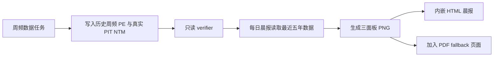

# SPY / QQQ / SOXX 五年周频估值图设计

**状态**：Boss 已批准（2026-07-19）

**范围**：历史数据产品、当前 FMP forward Phase 2、晨报展示

**北极星对齐**：数据层（PIT 基本面与成分快照）→ 分析层（指数估值聚合）→ 晨报消费层

**2026-07-30 修订**（CC 审核 [`docs/audit/2026-07-30-three-index-pe-cc-review.md`](../audit/2026-07-30-three-index-pe-cc-review.md)，Boss 批准）：

1. **§2.1 口径澄清**：aggregate `Σmcap/ΣNI` 是唯一的图表与 percentile 指标。SOXX 历史引擎的 holding-weighted 主字段（`rebalance_weighted_ttm_pe_gaap_proxy`）仅作日频诊断证据保留，不进 weekly 表、不进图；其 aggregate 次级字段现状不过 90% gate，weekly 产品须对 aggregate 指标重新施加门控。
2. **§4 percentile 澄清**：五年分位只对 `quality_tier = actual_only` 的点计算；consensus tail 点展示数值但不参与分位；PIT 序列不给分位。
3. **§5 位置冻结**：图表作为 `0d. 三指数估值` 插入 `0b. 成交集中度` 之后、`1. PMARP` 之前；既有 section 不重排，`*D. Dollar Volume*` Telegram split_marker 不变。

**2026-07-31 修订**（Boss 停点 1 复审拍板）：

4. **§2.4 双维发布门**：在 mcap coverage ≥90% 之外，新增披露权重覆盖率 ≥90% 为第二发布门——mcap gate 结构性看不见完全缺市值的成员（隔离 60% 权重后剩余成员仍可 100% mcap coverage）。两门均作用于最终 aggregate 指标。
5. **percentile 分线语义**：TTM 分位用全部非空 TTM 点（TTM 无 tail 概念）；hindsight 分位仅用 `quality_tier = actual_only` 的点；禁止用 hindsight tier 过滤 TTM 历史。
6. **R5 整篮回滚保留**，但恢复流程、显式停发状态与告警提前至 Task 5 交付（weekly tail refresh 自 Task 5 起运行，不能等 Task 8 才补运维能力）。

## 1. 目标

在每日晨报中加入一张自包含 PNG，展示 SPY、QQQ、SOXX 过去五年的周频估值。每个指数一个纵向面板，每个面板同时展示：

1. **GAAP TTM P/E**：历史时点市值除以当时已经公开的过去四季度 GAAP 净利润；
2. **后视镜 NTM P/E**：历史时点市值除以该时点之后四季度的实际 GAAP 净利润；
3. **真实 PIT NTM P/E**：从 FMP forward 快照开始日（2026-07-13）起，使用当时可见的分析师预期计算，随周频快照逐步累积。

这三条序列回答三个不同问题：

- TTM：市场当时为已经实现的利润支付多少倍估值；
- 后视镜 NTM：事后知道未来利润后，当时的价格究竟贵不贵；
- 真实 PIT NTM：当时市场基于当时共识预期支付多少倍估值。

## 2. 冻结的计算口径

### 2.1 聚合公式

三个指数、三类序列统一采用 aggregate earnings yield 的倒数：

```text
Basket P/E = Σ covered member historical market cap
             ───────────────────────────────────────
             Σ covered member applicable net income
```

其中 applicable net income 分别为：

- TTM：估值日可得的最近连续四个季度实际 GAAP 净利润；
- 后视镜 NTM：估值日之后连续四个财政季度的实际 GAAP 净利润；
- 真实 PIT NTM：对应快照日 FMP 分析师共识 NTM 净利润；**2026-09-11 Boss 确认**：不将共识标成已验证的 GAAP，图例/脚注明确其与实际 GAAP 的口径差异。后视镜 consensus tail 同样保留该提示。

亏损成分股保留在分母中；不会像“剔除亏损股后做个股 P/E 算术平均”那样产生幸存者偏差。每个指标只在分子和分母使用完全相同的 covered member 集合。

### 2.2 历史可得性

- TTM 使用严格 point-in-time 门控：`accepted_date <= valuation_date`；
- 后视镜 NTM 明确是 ex-post 分析，不伪装成历史可交易信号；
- 最近不足四个已实现未来季度的尾部，用“已有实际 + 最新 FMP 共识”补齐，标记为 `latest_consensus_tail`；
- 真实 PIT NTM 只从 2026-07-13 的已持久化 FMP 快照起画，不向过去反推。

### 2.3 成分与日期语义

- 组合来源以 FMP fund disclosure 为历史主证据，以当前 ETF holdings snapshot 衔接最新区间；
- 每个历史组合同时保存 `holding_date`、`composition_effective_date`、`available_date`；
- 图表只在组合可用之后使用该组合，避免信息穿越；
- SPY 的披露快照是 ETF 持仓代理，不声称等同于 S&P Dow Jones 的逐次指数委员会变更记录；
- QQQ 使用披露快照代理 Nasdaq-100 的定期/临时调整；
- SOXX 在 2021-09 之前没有可验证历史披露，因此五年窗口开头保留缺口，不制造数据。

### 2.4 数据质量门槛

- 历史市值最大 staleness：7 个自然日；
- 市值 jump sanity：复用已审计的价格、隐含股数、拆股事件交叉检查；
- KLAC issue035 窗口及同类异常必须重拉、修复或隔离，完整坏行不得因幂等跳过而永久保留；
- 每条序列的市值覆盖率低于 90% 时不发布该点；
- 图中同时显示最新覆盖率与数据截至日；
- verifier 必须只读重算源数据，不信任物化结果本身。

## 3. 存储边界

### 3.1 审计源表保持不变

已审计的 `basket_ttm_valuation` 继续保存日频 TTM 计算及成员证据，不塞入图表专属字段。

### 3.2 新增周频图表 SSOT

新增 `basket_weekly_pe_history`，主键为 `(basket, valuation_date)`，只保存图表所需的周频物化结果：

| 字段组 | 内容 |
|---|---|
| 估值 | `ttm_pe_gaap`、`hindsight_ntm_pe_gaap` |
| 分子分母 | 两类 total mcap、net income |
| 覆盖 | member count、covered count、mcap coverage |
| 尾部质量 | actual quarters、estimate quarters、quality tier |
| 组合日期 | effective / available date |
| 审计 | members JSON、warnings JSON、methodology version |

这个表规模只有约 `3 × 261` 行，重复少量 TTM 周频结果换取清晰的数据产品边界和快速、只读的晨报消费。

### 3.3 真实 PIT forward 继续使用现有表

`fmp_basket_valuation` 是真实 PIT forward 的 SSOT。Phase 2 对原设计的六个 basket（SPY、QQQ、SOX、MAGS、IGV、XLF）全部计算；本图仅消费 SPY、QQQ、SOXX/SOX 映射后的三条序列。

## 4. 图表设计

- 一张 1800px 宽 PNG，SPY / QQQ / SOXX 三个纵向面板，共享五年横轴；
- TTM：深青色实线；
- 后视镜 NTM：紫色实线；最近 consensus 补齐区间改为紫色虚线；
- 真实 PIT NTM：珊瑚色圆点与短实线，只从 2026-07-13 开始；
- 不做插值、不做曲线平滑；每个点都是当周最后一个可发布交易日；
- 每个面板显示最新值、五年分位、覆盖率；
- 标题必须使用“后视镜 NTM”，不得把它简称为“历史 Forward P/E”；
- 数据缺失保留空白，不能用前后值连线掩盖断档；
- 采用晨报现有扁平视觉语言，无渐变、无阴影、无新字体依赖。

## 5. 晨报行为



- 周频任务负责触网、写库和验证；
- 每日晨报只读数据库并生成 PNG，不触网、不写估值表；
- HTML 通过 data URI 自包含图片，避免 Telegram 收件端拿不到本地路径；
- HTML 发送失败时，PNG 加入原有 PDF fallback；
- 不再单独发送一张 Telegram 图片，避免晨报消息膨胀；
- 数据缺失或过期时晨报继续发送，只在图表位置显示明确的 unavailable/stale 说明。

## 6. 方案对比

| 方案 | 优点 | 缺点 | 结论 |
|---|---|---|---|
| A. 周频 SSOT + 晨报只读 | 可审计、快、稳定、无晨报外部依赖 | 多一张小表与周频维护任务 | **采用** |
| B. 晨报运行时即时重算 | 少一张物化表 | 每天重扫大量源表；失败会拖垮晨报；难以复现 | 否决 |
| C. 采购 vendor 历史 forward P/E | 上线快 | 口径黑箱、价格高、难与自有 TTM 对齐 | 暂不采用 |

## 7. 最大风险与防线

最大风险不是算错一行，而是把“后视镜 NTM”误读成当时可见的 forward P/E，从而把事后解释当成可交易信号。防线是：字段名、图例、标题、质量标签、文档和测试全部强制使用 hindsight/ex-post 语义；真实 PIT 序列使用不同颜色并只从真实快照开始。

第二大风险是历史市值或成分数据“存在但错误”。因此覆盖率只能作为必要条件，不能替代 jump sanity、拆股交叉检查和只读重算 verifier。

## 8. 官方方法背景

- S&P 500 的正式维护遵循 S&P DJI 美国指数方法论，ETF 披露只是本项目可审计的组合代理：[S&P U.S. Indices Methodology](https://www.spglobal.com/spdji/en/documents/methodologies/methodology-sp-us-indices.pdf)
- Nasdaq-100 的定期与临时调整遵循其官方方法论；本项目使用 FMP 披露快照代理历史组合：[Nasdaq-100 Index Methodology](https://indexes.nasdaq.com/docs/Methodology_NDX.pdf)
- Nasdaq 已宣布 2026-05-01 生效的方法调整，因此组合日期逻辑应配置化而非永久硬编码：[Nasdaq methodology update](https://www.nasdaq.com/press-release/nasdaq-concludes-public-consultation-on-nasdaq-100-indexr-methodology-2026-03-30)
