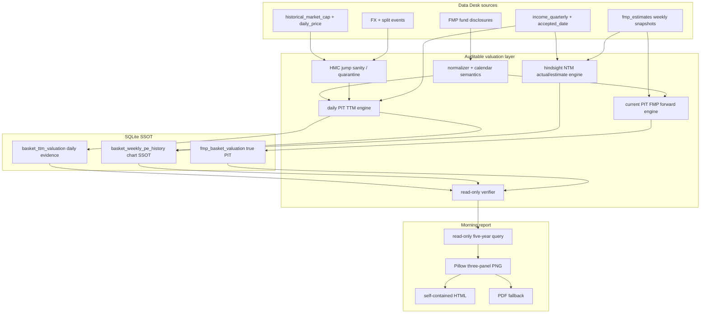
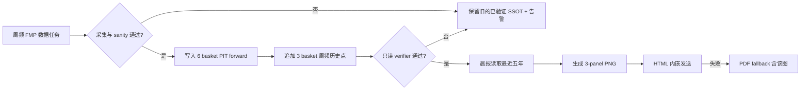

# Three-Index Weekly PE Morning Chart Implementation Plan

> **For Claude:** REQUIRED SUB-SKILL: Use `receiving-code-review` for review feedback and `finishing-a-development-branch` after all acceptance gates pass. Execute each task TDD-style: RED → GREEN → focused tests → commit. Do not deploy, merge, or push without Boss approval.

**Confidence: 90%**

**不确定点**：FMP 历史 disclosure 对 SPY/QQQ/SOXX 的日期覆盖已通过只读 API probe 验证，但完整五年 backfill 后按 7 天市值 staleness 的 publishable 比例、SPY 临时成分变更造成的代理误差，只有真实 dry-run 才能最终量化。SOXX 2021-09 之前无披露是已知硬边界。

**北极星对齐**：第一层 Data（PIT fundamentals、历史成分、HMC sanity、FX）→ 第二层 Analysis（可审计的指数估值聚合）→ Morning Report 消费；不进入策略或 CIO 自动决策层。

**Goal:** 生成 SPY / QQQ / SOXX 过去五年周频 GAAP TTM P/E、后视镜 NTM P/E 和从 2026-07-13 起真实 PIT NTM P/E 的三面板 PNG，并把它自包含地嵌入晨报 HTML、纳入 PDF fallback。

**Architecture:** 复用已审计但未合并的 SOXX historical TTM 分支作为历史证据层；新增通用三篮子周频物化层；完成现有 FMP forward Phase 2 六篮子聚合；晨报只读持久化结果并用已有 Pillow 渲染，不触网、不写库。

**Tech Stack:** Python 3.10-compatible、SQLite、Pillow、pytest、现有 FMP client / MarketStore / cron wrapper / Telegram HTML+PDF delivery。

**Approved design:** [`2026-07-19-index-pe-morning-chart-design.md`](2026-07-19-index-pe-morning-chart-design.md)

**2026-07-30 修订（Boss 批准）**：按 CC 审核 [`docs/audit/2026-07-30-three-index-pe-cc-review.md`](../audit/2026-07-30-three-index-pe-cc-review.md) 完成 7 处修订，编号 R1–R7：

| 编号 | 修订 | 落点 |
|---|---|---|
| R1 | 主 PE 口径契约：aggregate 唯一，gate 作用于 aggregate 本身 | §3.1、Task 4 |
| R2 | `refresh_market_cap_windows` 空响应 fail-closed 修复 | Task 0 Step 4 |
| R3 | producer/verifier 聚合共享纯函数 + issue048 manifest 对齐 | Task 4 |
| R4 | Task 0 数字修正（18 commits）、先合 main、冲突面预期仅 ARCHITECTURE.md | Task 0 |
| R5 | hindsight tail 演化契约（quality_tier 单向升级、percentile 仅 actual_only） | §3.3、Task 2、Task 6 |
| R6 | 晨报位置冻结为 `0c`（0b 之后）、split_marker 约束、typed image dispatch | Task 7 |
| R7 | 测试基线在 Task 0 合并后重新冻结，废弃 2026-07-19 旧基线 | Task 0、Task 9 |

执行拆为三个审批停点：**停点 1** = Task 0–4（离线历史数据产品 + dry-run 验收）；**停点 2** = Task 5（打开 `fmp_basket_valuation` 生产写入路径）；**停点 3** = Task 6–9（图表 + 晨报 + 运维 + 部署审批）。每个停点须 Boss 批准后才进入下一段。

## 1. 建成后的架构



依赖方向固定为 `sources → valuation → storage → report`。晨报 renderer 不导入 ingestion/orchestrator；数据任务不导入 Telegram/report 代码。

## 2. 用户流程



## 3. 关键契约

### 3.1 指标语义

```text
ttm_pe_gaap(t) = Σ mcap_i(t) / Σ NI_i(last 4 continuous quarters known at t)

hindsight_ntm_pe_gaap(t)
  = Σ mcap_i(t) / Σ NI_i(next 4 continuous fiscal quarters after t)

fwd_pe_ntm(snapshot)
  = Σ mcap_i(snapshot) / Σ FMP consensus NTM NI_i(snapshot)
```

- 亏损股保留；分母 `<= 0` 时该 basket point 不发布，并记录 warning；
- 每条指标内部的分子/分母成员集合严格一致；
- 每条指标 mcap coverage `< 90%` 时该点不发布；
- 历史 TTM actual 必须 `accepted_date <= valuation_date`；
- hindsight actual 不做 accepted-date 门控，但字段、图例、API 名称强制标记 ex-post；
- 最近尾部按 fiscal quarter key 去重：actual 优先，缺少的 quarter 才使用 latest consensus；恰好四个连续季度才可发布；
- 外币净利润沿用历史引擎的估值日 FX 口径，保持 TTM/NTM 横向一致。

**口径契约（R1）**：三条指标全部且仅使用 aggregate 口径 `Σmcap / ΣNI`，同一面板三线可比。SOXX 历史引擎的主字段 `rebalance_weighted_ttm_pe_gaap_proxy`（holding-weighted，`terminal/historical_basket_valuation.py:269-298`）**不是**本产品指标，仅作为 `basket_ttm_valuation` 诊断证据保留，不进 weekly 表、不进图、不进 percentile。该引擎的 aggregate 次级字段 `uncapped_mcap_basket_pe_gaap` 当前**不过 90% coverage gate**（`:473-475` 中 primary 为 None 时 secondary 仍写值），因此 weekly 表的 `ttm_pe_gaap` 不得直接提升该字段——必须对 aggregate 指标本身重新施加 `mcap_coverage_ttm >= 0.90` 门控后写入。**（2026-07-31 Boss 拍板）发布门为双维**：mcap coverage ≥ 0.90 **且**披露权重 coverage ≥ 0.90，两门均作用于最终 aggregate 指标（权重门防隔离/缺市值成员造成的"40% 篮子假 100% 覆盖"）。

### 3.2 周频取样

- 目标频率：每个自然周最后一个可发布交易日；
- 不使用周日 resample + forward-fill 制造点；
- 五年窗口边界由 report as-of 回推五年；
- 序列断档保留 `NULL`，renderer 不跨 gap 连线；
- 真实 PIT 序列按 FMP `snapshot_date` 原样落点，不改写成周五日期。

### 3.3 新表

`basket_weekly_pe_history`：

| 字段 | 约束 |
|---|---|
| `basket`, `valuation_date` | 复合主键 |
| `ttm_pe_gaap`, `hindsight_ntm_pe_gaap` | nullable；质量门失败为 NULL |
| `ttm_total_mcap`, `ttm_net_income` | 同成员集合 |
| `hindsight_total_mcap`, `hindsight_ntm_net_income` | 同成员集合 |
| `n_members`, `n_covered_ttm`, `n_covered_hindsight` | 非负 |
| `mcap_coverage_ttm`, `mcap_coverage_hindsight` | `[0,1]` |
| `hindsight_actual_quarters`, `hindsight_estimate_quarters` | 0–4 且合计为 4 才能 publish |
| `composition_effective_date`, `composition_available_date` | ISO date |
| `quality_tier` | `actual_only` / `latest_consensus_tail` / `unpublishable` |
| `members_json`, `warnings_json` | 审计证据 |
| `methodology_version` | 固定版本，不允许静默覆写旧口径 |

窄 CRUD：atomic whole-batch upsert、按 basket/date 只读查询、禁止 generic delete/update。新表必须显式注册进 `market_store.py` 的表白名单机制（现 `:606` 附近），未注册 fail-fast。

**Tail 演化契约（R5）**：`quality_tier` 从 `latest_consensus_tail` 升级为 `actual_only` 是**同一 methodology 下的合法周频数据更新**，不 bump `methodology_version`。规则：

1. 每次 weekly run 重算所有 hindsight tail 未满四个 actual 季度的点（约最近 12 个月）；**（2026-07-31 Boss 拍板：整窗重写，不做 supersession chain）**：认证 run 在单一事务内完成——认证新五年窗口 → 写入全部窗口行 → 删除该 basket 窗口外旧行 → 提交；任一步失败整批回滚。增量 tail-only 刷新被 verifier 大声拒绝（有测试钉住）。必须有"窗口向前滑动一周"的真实回归测试（旧首周行被删除、无孤立行、验证干净通过）。周频 ~17 分钟成本已接受；
2. `quality_tier` 只允许单向升级（estimate → actual）；降级（actual → estimate）必须拒绝写入并记录 warning；
3. 五年 percentile **分线计算**（2026-07-31 Boss 细化）：TTM 分位用全部非空 TTM 点（TTM 无 tail 概念）；hindsight 分位仅用 `quality_tier = actual_only` 的点，consensus tail 点展示数值但不参与分位；**禁止用 hindsight tier 过滤 TTM 历史**（查询层与 renderer 同契约，见 Task 6）。

## 4. 替代方案与取舍

### 方案 A：周频物化表 + PIT 表（采用）

优点：晨报稳定、查询轻、每个点可重现；不改变已审计日频 TTM 表的职责。缺点：增加一张约 800 行的小表和维护任务。

### 方案 B：晨报运行时从源表即时计算

优点：少一张表。缺点：每日重扫源表；把 DB 写锁/数据质量风险带进 08:00 关键路径；失败难复现。否决。

### 方案 C：扩展 `basket_ttm_valuation` 塞入 hindsight 字段

优点：少一张表。缺点：把日频 TTM 审计证据、周频图表产品和 ex-post NTM 混在同一 schema；后续迁移与 verifier 边界模糊。否决。

## 5. 风险自证

### 最大风险

“后视镜 NTM”被误认为当时可交易的 forward P/E。这个风险比数值误差更严重，因为它会改变研究结论。防线：

1. schema、函数、图例、标题全部含 `hindsight` / `后视镜`；
2. 真实 PIT 使用独立表、独立颜色，只从 2026-07-13 开始；
3. 测试禁止历史区间出现未限定的 `Forward P/E` 标签；
4. 最新 consensus 补齐尾部必须虚线并显示估算季度数；
5. 报告脚注说明该线只用于估值解释，不是历史信号回测输入。

### 为什么不用更简单的做法

只画 ETF 历史价格除以当前 EPS，或者把当前成分倒推五年，代码更少但会同时引入成分幸存者偏差、信息穿越与拆股/市值污染。现有 SOXX 审计已经证明这些不是理论问题（KLAC issue035 会实质扭曲结果），因此必须复用证据链与 sanity gate。

### 其余风险

- SPY/QQQ disclosure 只是 ETF 代理：在 warnings 和方法脚注中披露，不宣传成官方指数历史 P/E；
- FMP source identity 漂移：复用 CREE→WOLF、TERN→TER 一类 alias 审计逻辑；
- 真实 PIT 尚短：不补造历史，允许最初只有两个周点；
- 图表过密：只画周频，三面板共享横轴，latest annotation 限一处；
- HTML 文件过大：PNG 做确定性尺寸和压缩测试，目标 `< 1.5 MB`；
- cron 失败污染：writer lock + whole-batch transaction + verifier 后才对晨报可见。

## 6. 实施任务

### Task 0：合并已审计历史证据层（R2 / R4 / R7 修订）

**Files:**
- Merge: `main`（先，消化 14 behind，含 volconc 晨报线）
- Merge: `codex/soxx-historical-ttm-pe`（后）
- Resolve: `ARCHITECTURE.md`（预期唯一冲突文件）
- Modify: `terminal/historical_market_cap_sanity.py`（R2 修复）
- Modify: `scripts/backfill_soxx_historical_pe.py`（R2 修复）
- Modify: `tests/test_historical_market_cap_sanity.py`（R2 测试）

**Step 1 — 记录双分支基线（R4）**

```bash
git log --oneline main..codex/soxx-historical-ttm-pe
git diff --stat main...codex/soxx-historical-ttm-pe
```

验收：**18** 个历史分支 commits（audit 基准 `d47f6a9` 的 17 个 + 审计修复 `4b96d47`）；`38 files, +7829/-3`；当前 feature worktree clean。

**Step 2 — 先合 main，再合审计分支，不改写任一历史（R4）**

```bash
git merge main
git merge --no-ff codex/soxx-historical-ttm-pe
```

冲突预期：merge-base `db86d75` 之后 main 侧改动 11 个文件、SOXX 侧 38 个，交集**仅 `ARCHITECTURE.md`**（`src/data/fmp_client.py` / `fmp_forward_ingestion.py` / `market_store.py` / `CLAUDE.md` 只有分支侧改动，应干净合入）。出现预期外冲突立即停下 re-plan。冲突原则不变：保留 main 的 FMP forward Phase 1 契约与 volconc 晨报线，同时保留 historical 分支的 disclosure/FX/split endpoint 与表；不为了消冲突删除任一侧测试。

**Step 3 — 运行组合基线并重新冻结全量基线（R7）**

```bash
python -m pytest \
  tests/test_fmp_forward_client.py \
  tests/test_fmp_forward_ingestion.py \
  tests/test_market_store_fmp_forward.py \
  tests/test_historical_basket_valuation.py \
  tests/test_historical_market_cap_sanity.py \
  tests/test_morning_report.py \
  tests/test_morning_html_report.py -q
python -m pytest tests/ -q
```

验收：目标测试全绿（含 volconc frozen-fixture parity 零变化）；full-suite 的 pre-existing failures 清单落盘 `docs/plans/2026-07-19-index-pe-morning-chart-baseline.md`，作为 Task 9 的唯一比较基线——**废弃 2026-07-19 旧基线与 SOXX audit 的 14-failed 数字**。若出现非冲突型回归，立即停下 re-plan，不继续叠功能。

**Step 4 — 修复 refresh 空响应数据丢失隐患（R2）**

现状：`terminal/historical_market_cap_sanity.py:339-354` 的 `refresh_market_cap_windows` 在 API 空响应时无条件 `replace_historical_market_cap_range(..., [])`，会删掉整个 range 的 HMC 行；生产实际跑的是 `scripts/backfill_soxx_historical_pe.py:539-548` 的内联安全版（`if not rows: continue`），被测试覆盖的却是危险的库函数版。

RED tests：

1. 库函数版空响应不得触发 range replace（fail-closed，记 warning）；
2. backfill 改为调用统一后的库函数，行为与原内联版一致（空响应 skip + warning）；
3. 非空响应路径回归不变。

GREEN：统一为单一实现——库函数空响应 fail-closed，backfill 内联版删除、改调库函数。

**Commit:** merge main 与 merge SOXX 各保留 provenance，冲突修复包含在各自 merge commit；R2 修复独立 commit `fix(valuation): fail-closed empty refresh window replacement`。

---

### Task 1：把 SOXX disclosure pipeline 泛化为三 basket

**Files:**
- Modify: `src/data/fmp_forward_ingestion.py`（**post-merge 实况修正**：历史 disclosure normalizer 实际在此，无独立 `terminal/soxx_holdings_normalizer.py`；SOXX 配置实为 `config/soxx_symbol_aliases.json`，无 `config/soxx_historical_pe.json`）
- Modify: `scripts/backfill_soxx_historical_pe.py`（提炼通用 orchestrator，保留旧 CLI alias）
- Create: `config/baskets/index_pe_baskets.json`（进 `config/baskets/` 目录，遵循 `load_basket_configs` 惯例（`scripts/update_fmp_forward.py:133`），不在 `config/` 根另起平行文件）
- Create: `tests/test_index_pe_basket_config.py`
- Create: `tests/test_index_holdings_normalizer.py`（覆盖**历史 disclosure** normalizer；与既有 `tests/test_fmp_forward_ingestion.py` 覆盖的 live snapshot `normalize_holdings` 是两个不同 normalizer，测试文件 docstring 需写明边界）

**RED tests:**

1. SPY / QQQ / SOXX source basket 与展示 symbol 映射；
2. 三日期语义 round-trip；
3. disclosure 为空 fail-closed；
4. SOXX 2021-09 前返回 gap；
5. SPY off-cycle member delta 写 warning；
6. 旧 SOXX CLI/wrapper 仍能调用通用逻辑。

**GREEN implementation:**

- 配置冻结 basket alias、五年窗口、coverage/staleness、display order；
- normalizer 不硬编码 SOXX；
- 组合有效日由配置策略生成，原始日期与推导日期均留证据；
- live snapshot 衔接规则显式标 `source_kind=live_snapshot`，`composition_effective_date=snapshot_date`，`available_date=snapshot_date`，质量弱于历史 disclosure。

**Verify:**

```bash
python -m pytest tests/test_index_pe_basket_config.py tests/test_index_holdings_normalizer.py \
  tests/test_fmp_fund_disclosure_ingestion.py -q
```

**Commit:** `refactor(valuation): generalize historical basket disclosures`

---

### Task 2：新增周频估值 SSOT 与窄 CRUD

**Files:**
- Modify: `src/data/market_store.py`
- Create: `tests/test_market_store_basket_weekly_pe.py`

**RED tests:**

1. fresh DB 自动建表和索引；
2. whole-batch upsert 成功；
3. 中间坏行触发整批 rollback；
4. coverage、quarter count、quality tier CHECK/fail-fast；
5. `(basket, valuation_date)` 幂等更新同 methodology version；
6. methodology version 不同且已有 complete row 时拒绝静默覆盖；
7. read-only range query 不创建 DB、不写 last_updated；
8. （R5）同 methodology 下 `latest_consensus_tail` 行被新一周 actual 数据升级为 `actual_only` 成功且留审计痕迹；
9. （R5）`quality_tier` 降级（actual → estimate）被拒绝并写 warning；
10. 新表已注册 `market_store.py` 表白名单，未注册路径 fail-fast。

**GREEN implementation:**

- 加 `basket_weekly_pe_history` DDL 与索引；
- 增加 dataclass/validator（如项目现有风格不使用 dataclass，则保持 dict 窄接口）；
- 单事务 batch upsert；
- 只提供 `upsert_basket_weekly_pe_batch` 和 `get_basket_weekly_pe_history`。

**Verify:**

```bash
python -m pytest tests/test_market_store_basket_weekly_pe.py \
  tests/test_market_store_fmp_forward.py -q
```

**Commit:** `feat(store): add weekly basket PE history contract`

---

### Task 3：实现后视镜 NTM actual/estimate 引擎

**Files:**
- Create: `terminal/hindsight_ntm_valuation.py`
- Create: `tests/test_hindsight_ntm_valuation.py`

**RED tests:**

1. 估值日之后连续四 fiscal quarter actual 求和；
2. actual 不受 `accepted_date <= valuation_date` 限制，但输出明确 `actual_only`；
3. 最近尾部 2 actual + 2 estimate 正确拼接；
4. actual 覆盖的 fiscal quarter 不得再叠 estimate；
5. estimate 必须取最新允许 snapshot，不能跨 symbol 混 snapshot；
6. fiscal quarter 缺口、重复、非连续 → unpublishable；
7. 亏损公司保留；basket denominator `<=0` → unpublishable；
8. numerator 与 denominator member set 对称；
9. EUR/TWD FX 转换复用历史引擎；
10. coverage 89.99% 不发布，90.00% 发布；
11. members evidence 记录 actual/estimate quarter provenance。

**GREEN implementation:**

- 先做纯函数：quarter selection、actual/estimate merge、member NTM、basket aggregate；
- 不在引擎内访问网络；
- tail estimate 只允许 latest consensus，不伪装 PIT；
- 使用 Decimal/float 的选择与现有 valuation engine 一致，不引入第二套数值习惯。

**Verify:**

```bash
python -m pytest tests/test_hindsight_ntm_valuation.py \
  tests/test_historical_basket_valuation.py -q
```

**Commit:** `feat(valuation): compute hindsight NTM basket earnings`

---

### Task 4：三指数五年周频 backfill 与只读 verifier

**Files:**
- Create: `scripts/backfill_index_pe_history.py`
- Create: `scripts/verify_index_pe_history.py`
- Create: `tests/test_backfill_index_pe_history.py`
- Create: `tests/test_verify_index_pe_history.py`
- Modify: `terminal/historical_market_cap_sanity.py`

**RED tests:**

1. `--baskets SPY,QQQ,SOXX --frequency weekly --years 5` 路由；
2. manifest 在首个远程逐股调用前落库/落文件；
3. weekly selection 取周内最后 publishable trading day；
4. gap 不 forward-fill；
5. rerun 先复查 jump sanity，不能因已有完整 mcap 行跳过 issue035；
6. KLAC 污染窗被重拉或 quarantine；
7. >20% member failure 熔断且整批结果不发布；
8. dry-run 不写 valuation 表；
9. verifier `mode=ro`，独立重算抽样源行；
10. verifier 检查 jump、coverage、连续季度、成员对称、日期穿越、tail quality、methodology version、三篮子日期范围；
11. SOXX 开头 gap 属于 expected，不报假失败；
12. （R1）weekly `ttm_pe_gaap` 为 aggregate 口径 `Σmcap/ΣNI` 且 90% gate 作用于该指标本身（coverage 89.99% → NULL）；holding-weighted 字段不出现在 weekly 表；
13. （R3）producer 与 verifier 的 basket 聚合走同一纯函数（import 同源断言），另有异构抽样 reconciliation（抽样点用独立 SQL/纯 Python 重算对账）；
14. （R3）run manifest 为 append-only，含 forced-refresh 窗口的 pre/post row hash，manifest 声明 expected date range（防止较晚 `--min-date` 只验证 suffix）。

**GREEN implementation:**

- wrapper 复用原 audited backfill 的 FMP/sanity/FX 逻辑，但 weekly `ttm_pe_gaap` 按 R1 契约（§3.1）对 aggregate 指标重新施加 coverage gate，不直接提升 `uncapped_mcap_basket_pe_gaap`；
- （R3）聚合公式提炼为共享纯函数，消灭现状的手抄双份（`scripts/verify_basket_ttm_pe.py:397-406` vs `terminal/historical_basket_valuation.py:278-290`，含各存一份的 90% 阈值）；verifier 独立性由异构抽样 reconciliation 补足，定位遵循 issue048（tamper/evidence 检查器而非独立方法学 oracle）；
- （R3）manifest 逐条对齐 issue048 的四个 recurring 关闭条件；
- 一次性计算日频 TTM 证据，再选周频点；
- 后视镜 NTM 与同一 valuation date、同一 composition 组合；
- 每个 basket batch 独立事务，任一 basket 失败不让该 basket partial rows 可见；
- verifier 分母以 run manifest/物化 evidence 为 SSOT，而非当前 universe。

**Dry-run acceptance:**

```bash
python -m scripts.backfill_index_pe_history \
  --baskets SPY,QQQ,SOXX --frequency weekly --years 5 --dry-run
python -m scripts.verify_index_pe_history \
  --baskets SPY,QQQ,SOXX --years 5 --mode ro
```

目标：SPY/QQQ 覆盖完整五年，SOXX 从首个可验证披露开始；按 7 天口径重新计算 publishable 比例，不沿用 10 天 feasibility 数字。

**Commit:** `feat(valuation): backfill three-index weekly PE history`

---

### Task 5：完成 FMP Forward Phase 2 六 basket PIT 聚合

**Files:**
- Create: `terminal/forward_valuation.py`
- Modify: `scripts/update_fmp_forward.py`
- Modify: `scripts/verify_fmp_forward.py`
- Modify: `scripts/run_forward_data.sh`
- Create: `tests/test_forward_valuation.py`
- Modify: `tests/test_update_fmp_forward.py`
- Modify: `tests/test_verify_fmp_forward.py`
- Modify: `tests/test_forward_cron_entrypoint.py`

**RED tests:**

1. SPY/QQQ/SOX/MAGS/IGV/XLF 六 basket 全路由；
2. `Σmcap / ΣNTM NI`，亏损股保留；
3. actual FY/FQ 与 estimate 的 NTM fiscal mapping 无重叠；
4. incomplete member 对 numerator/denominator 对称剔除；
5. `mcap_coverage_ntm` 与 `weight_coverage` 正确；
6. coverage gate 失败不写 complete valuation；
7. SOX → display SOXX 映射仅在消费层，不改源 basket identity；
8. resume 不重复覆盖坏的 snapshot state；
9. cron writer lock 内顺序为 ingestion → PIT valuation → history-tail refresh → verifier；
10. 任一步 non-zero 退出码上抛；
11. 既有 reader `scripts/verify_fmp_forward.py:320`（`SELECT basket, members_json FROM fmp_basket_valuation`）在表从 0 行变为有数据后行为正确（空路径 → 逐行校验），不产生假绿；
12. （2026-07-31 Boss 拍板，自 Task 8 提前）weekly tail refresh 触发 R5 拒绝（tier 降级/跨版本冲突）导致整篮回滚时：该 basket 的停发状态显式可查（manifest/状态表）、cron rc 非零、Telegram 告警发出；
13. （同上）恢复路径有测试：按 runbook 命令（补记 run_failed / 按 methodology_version 精确删除后重填）操作后，该 basket 恢复发布且 verifier 通过。

**GREEN implementation:**

- 按冻结 spec 实现 `fwd_pe_ntm`，同时补齐已有表的 `fwd_pe_blend`，但图只用 NTM；
- 成员级证据写 `members_json`；
- update CLI 支持 `--phase valuation` 或与现有 run 语义兼容的显式入口；
- weekly 完成后追加三 basket 当前周历史 TTM/hindsight 点；
- verifier 新增 basket 估值重算和 coverage 检查。

**Verify:**

```bash
python -m pytest tests/test_forward_valuation.py tests/test_update_fmp_forward.py \
  tests/test_verify_fmp_forward.py tests/test_forward_cron_entrypoint.py -q
```

**Commit:** `feat(fmp): compute six-basket PIT forward valuation`

---

### Task 6：实现三面板 PNG renderer

**Files:**
- Create: `terminal/index_valuation_chart.py`
- Create: `tests/test_index_valuation_chart.py`

**RED tests:**

1. query 只读最近五年，排序、去重、basket 顺序固定；
2. 3 个纵向 panel，共享横轴；
3. TTM 实线、hindsight actual 实线、consensus tail 虚线、PIT marker；
4. gap 不连线；
5. SOXX 开头 gap 正常渲染；
6. latest value、percentile、coverage、as-of 文本存在；
7. 图例必须含“后视镜 NTM”和“真实 PIT NTM”；
8. 不得出现未限定的历史 `Forward P/E` 标签；
9. deterministic 1800px PNG、RGB、目标 `<1.5 MB`；
10. 空数据渲染 unavailable card，不抛异常。

**GREEN implementation:**

- 用 Pillow `ImageDraw.line` 绘制原始周频折线，不新增 matplotlib；
- 颜色：TTM teal、hindsight purple、PIT coral；
- 用分段绘制实现虚线与 gap；
- percentile 复用项目公式 `count(values <= current) / total`，**分线语义**（2026-07-31 Boss 细化）：TTM 分位对全部非空 TTM 点；hindsight 分位仅对 `quality_tier = actual_only` 点（consensus tail 与 PIT 序列不参与分位）；禁止用 hindsight tier 过滤 TTM 历史；
- 所有坐标/格式函数保持纯函数，便于单测。

**Visual verify:**

```bash
python -m terminal.index_valuation_chart \
  --db data/market.db --output reports/rendered/index_pe_weekly.png
```

人工检查：文字可读、三面板比例一致、没有断线被误连、SOXX 缺口清楚、tail 语义不会误读。

**Commit:** `feat(report): render three-index weekly PE chart`

---

### Task 7：嵌入晨报 HTML 与 PDF fallback

**Files:**
- Modify: `terminal/morning_html_report.py`
- Modify: `scripts/morning_report.py`
- Modify: `tests/test_morning_html_report.py`
- Modify: `tests/test_morning_report.py`
- Modify: `tests/test_telegram_routing.py`

**RED tests:**

1. HTML payload 支持 typed `image` block；
2. PNG 转 data URI，自包含 HTML 不引用本地绝对路径；
3. image alt/caption HTML escape；
4. （R6）图作为 `0c. 三指数估值` 插在 `0b. 成交集中度` 之后、`1. PMARP` 之前；既有 section 零重排，volconc frozen-fixture parity 测试零变化；`*D. Dollar Volume*` split_marker（`scripts/morning_report.py:104`）逐字不变；
5. HTML 成功仍只发送一个 document；
6. HTML 失败时 valuation PNG 进入 PDF page list；
7. 不额外调用 `send_photo`；
8. 图表生成失败/数据 stale 时晨报继续发送并显示说明；
9. `--no-telegram` 可生成本地 HTML/PDF 供验收。

**GREEN implementation:**

- （R6）`morning_html_report` 现状**没有** block type 概念（`terminal/morning_html_report.py:33-44`，靠 `rows is None and not columns` 推断表格/标题）——引入最小 typed dispatch：dict 含 `type == "image"` 时优先分派，其余保留现有推断路径向后兼容；这是新增一个分派机制而非往 switch 加 case，`tests/test_morning_html_report.py`（现仅 89 行）需同步扩覆盖；
- `morning_report` 在 delivery 前生成一次 valuation PNG，HTML 与 PDF 共用；
- 不把 chart 逻辑写进 HTML renderer；
- HTML CSS 只加响应式宽度，无阴影/渐变。

**Verify:**

```bash
python -m pytest tests/test_morning_html_report.py tests/test_morning_report.py \
  tests/test_telegram_routing.py -q
python -m scripts.morning_report --no-social --image-report \
  --image-delivery html --no-telegram
```

**Commit:** `feat(morning): embed weekly index PE chart`

---

### Task 8：周频运维、文档与失败降级

**Files:**
- Modify: `scripts/run_forward_data.sh`
- Modify: `scripts/cron_wrapper.sh`（仅当现有 `market_db_writer` route 不能直接复用）
- Modify: `ARCHITECTURE.md`
- Modify: `CLAUDE.md`
- Create: `docs/issues/<next>-index-pe-hindsight-is-not-pit.md`
- Modify: `tests/test_forward_cron_entrypoint.py`

**RED tests:**

1. 周频估值任务在 `market_db_writer` 锁内；
2. morning report 无网络调用、无估值表 write；
3. verifier 失败时保留上次验证成功的数据，cron rc 非零并告警；
4. latest weekly data 超过 14 天时图表标 stale，但不阻断晨报；
5. shell 退出码与 `bash -n`。

**GREEN implementation:**

- 复用现有 `run_forward_data.sh`，不新增竞争写库的 cron；
- backfill 与增量两种 run kind 明确分开；
- 文档写清三条线语义、运行时序、表所有权、恢复步骤；
- issue 记录“hindsight NTM 不是 PIT forward”的反模式。

**Verify:**

```bash
bash -n scripts/run_forward_data.sh scripts/cron_wrapper.sh
python -m pytest tests/test_forward_cron_entrypoint.py -q
```

**Commit:** `docs(valuation): document weekly index PE operations`

---

### Task 9：全量验收、review 与部署前停点

**Step 1 — 专属套件**

```bash
python -m pytest \
  tests/test_index_pe_basket_config.py \
  tests/test_index_holdings_normalizer.py \
  tests/test_market_store_basket_weekly_pe.py \
  tests/test_hindsight_ntm_valuation.py \
  tests/test_backfill_index_pe_history.py \
  tests/test_verify_index_pe_history.py \
  tests/test_forward_valuation.py \
  tests/test_index_valuation_chart.py \
  tests/test_morning_html_report.py \
  tests/test_forward_cron_entrypoint.py -q
```

**Step 2 — 相邻回归与全量**

```bash
python -m pytest tests/ -q
python -m compileall terminal scripts src tests
bash -n scripts/run_forward_data.sh scripts/cron_wrapper.sh
git diff --check
```

（R7）比较基线是 Task 0 Step 3 重新冻结并落盘到 `docs/plans/2026-07-19-index-pe-morning-chart-baseline.md` 的 pre-existing failures 清单——不引用 2026-07-19 旧基线或 SOXX audit 的 14-failed 数字。零新增失败；pre-existing failures 不能顺手修改。

**Step 3 — Security / write-boundary audit**

```bash
git grep -nE '(apikey=|api_key=|FMP_API_KEY=.{4,}|TELEGRAM_.*=.{4,})' -- ':!tests/**'
git status --short
```

验收：无 key 值、无 `.env`、无 DB/生成 PNG 混入 commit；晨报路径只读估值表。

**Step 4 — Code review**

按以下清单独立审查：

1. hindsight/PIT 语义隔离；
2. 成分日期无穿越；
3. numerator/denominator 成员对称；
4. HMC jump sanity 与 issue035；
5. actual/estimate quarter 无重叠；
6. coverage 与 gap fail-closed；
7. whole-batch transaction / rerun；
8. morning report 无网络/写库；
9. HTML/PDF fallback 不重复发送；
10. Python 3.10 与 cron 退出码。

**Step 5 — 本地实际图验收**

生成真实 PNG 与 HTML，检查文件尺寸、像素、最新数值、三条线 label 和 SOXX gap。将 PNG 路径交给 Boss 目视验收。

**Step 6 — 停在待审批状态**

展示 commit 列表、diff stat、测试结果、实际 PNG、预计 FMP 调用量和云端写表范围。没有 Boss 单独批准，不 merge、不 push、不部署、不改 crontab。

**Commit:** `test(valuation): close three-index PE acceptance gates`（仅当确有测试/fixture 变更；否则不制造空 commit）

## 7. 云端执行（另行批准后）

以下不是本计划自动授权范围：

1. push feature branch；
2. 在 aliyun 临时 checkout/worktree 运行 read-only dry-run；
3. 估算调用量并由 Boss 批准一次性五年 backfill；
4. 备份 `market.db`，在 `market_db_writer` 锁内执行 backfill；
5. 运行两个只读 verifier；
6. 生成生产数据 PNG/HTML，Boss 目视确认；
7. merge main、push、云端 fast-forward；
8. 手工跑一次 `run_forward_data.sh` smoke；
9. 手工跑一次晨报 `--no-telegram`；
10. 等下一次自然 08:00 晨报验收实际 delivery。

云端回滚是代码 fast-forward 回退到前一个 commit，并保留新增表（additive schema）；如数据方法错误，按 `methodology_version` 精确删除该版本行，禁止恢复整库覆盖同期其他 writer 的新数据。

## 8. Boss 可见验收标准

- [ ] 一张 PNG，三行依次为 SPY、QQQ、SOXX，过去五年周频；
- [ ] 每行清楚区分 TTM、后视镜 NTM、真实 PIT NTM；
- [ ] 最近 estimate tail 是虚线，SOXX 2021-09 前是空白；
- [ ] 最新值、五年分位、coverage、as-of 可读；
- [ ] SPY/QQQ 五年范围完整；SOXX 从可验证历史起；
- [ ] TTM 与 hindsight 使用同一聚合公式，亏损股保留；
- [ ] 真实 PIT 不向 2026-07-13 之前伪造；
- [ ] KLAC/MCHP 异常不会污染结果；
- [ ] HTML 只有一个晨报附件且图像内嵌；
- [ ] HTML fallback PDF 仍包含该图；
- [ ] 数据任务失败不污染上次通过数据，晨报本身不中断；
- [ ] 专属、相邻、全量质量门零新增失败；
- [ ] Boss 目视批准实际生产数据 PNG 后才合并部署。
