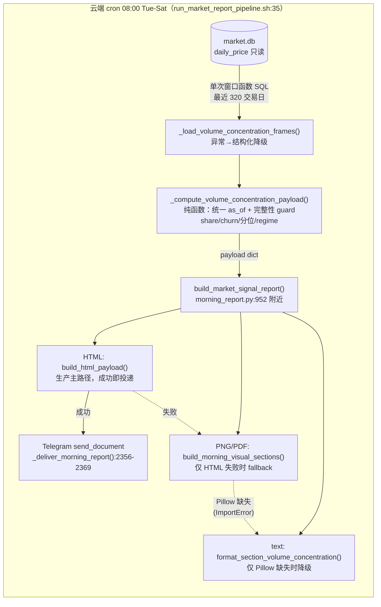
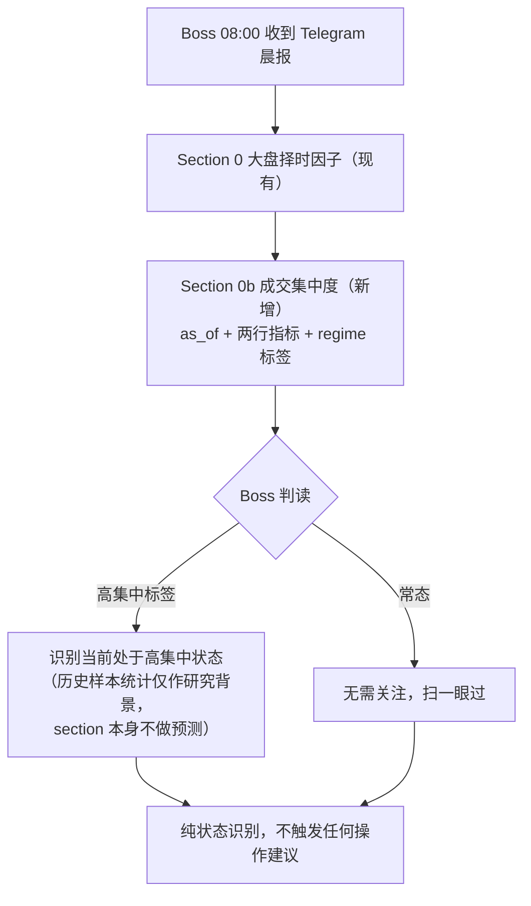

# 晨报成交集中度 Context 序列 — 执行计划

**Date:** 2026-07-24
**Status:** Round 2 批注已处理 — 待 Boss 复审，未动代码
**上游研究:** `docs/research/2026-07-24-volume-concentration-signal-stat-study.md`（判定：方向性但证据不足，用途上限 = 晨报 context 序列）

## 北极星对齐

north-star.md **第二层 分析层 — 技术维度**（`docs/design/north-star.md:72,153`）。与 2026-05-13 量能异常合并 plan 同一定位：市场级技术观测，"服务 Terminal 晨报展示，**不进入策略层 / CIO 建议**"。不新增架构层，不新增数据表（见方案对比）。

**语义红线**（研究预注册处置上限）：本 section 只展示数值 + regime 标签，渲染文案不得出现任何建议性/预测性措辞。渲染测试含 negative assertions：三面不得出现「预计 / 概率 / 风险升高 / 建议 / 减仓 / 仓位 / Timing」等词。不进 OPRMS Timing、不进任何仓位公式。

## 要展示什么

晨报新增一个市场级 context 小节（**"0b. 成交集中度"**，紧跟 Section 0 大盘择时因子，市场级 context 聚在一起），标题行显式携带数据日 `as_of`：

```
*0b. 成交集中度*（截至 2026-07-17）
Top50 成交额占比(20日平滑)   47.8%   1年分位 92
Top50 名单20日换手率(平滑)   25.3%   1年分位 0
状态: 高集中+上行（拥挤）
```

regime 标签三种正常状态：`高集中+上行（拥挤）` / `高集中+下行（恐慌）`（分位>80 按 SPY 20 日方向）/ `常态`（≤80）；另有一种降级状态 `方向数据缺失`（as_of 处 SPY 数据缺失时，两行指标照常显示）。

参数与研究主组合完全一致：N=50、20 日平滑、252 日滚动分位（定义：当前值与窗口内**前 251 个值**比较的严格大于占比 ×100，分母 251，`run_study.py:65-66`）、阈值 80、SPY 20 日方向、剔除 SPY/QQQ/SOXX。

## 架构图



三个渲染面共享同一 payload，**生产是 HTML 优先、失败才 PNG/PDF fallback**（`morning_report.py:2355-2403`），不是三面同时投递。text 降级**只发生在 Pillow 缺失**（legacy 路径只捕 `ImportError`，:2373-2388）；其他 PNG/PDF 渲染异常走 main 错误路径——本 plan 不扩展该行为（Round 2 批注 5 选 A）。

数据流关键点：**零写入**——market.db 只读（P3 所有权不动），无新表、无缓存文件、无状态。

## 业务流程图



## 替代方案对比

| 方案 | 做法 | 优点 | 缺点 | 判定 |
|------|------|------|------|------|
| **A 报告时现算**（选定） | 晨报运行时单次窗口函数 SQL 拉最近 320 交易日，内存算完即弃 | 零 schema 变更、零新写入方、无状态无迁移、对齐 P3；生产代码改动集中在 morning_report.py 一个文件 | 每次 cron 多约数秒（本地 849MB 实测 3.27s，云端待 T8a 实测）；只能给 1 年分位 | ✅ 最少步骤 |
| B 云端新表 | 新增 `market_concentration_daily` 表，每日增量写，晨报读小表 | 查询快；可积累长历史供全样本分位 | 新增 schema + 写入方职责 + 回填脚本 + 同步链路检查，重量级 | ❌ 过度工程；若 T8a 云端 loader >30s 则回头启用 |
| C JSON 缓存 | 独立脚本产 `data/scans/` 缓存，晨报读缓存 | 晨报本体零延时 | 多一个 cron 环节 + 缓存过期/缺失两个新失败模式 | ❌ 复杂度换来的收益不值 |

## 实现设计（伪代码已对齐真实代码）

全部**生产代码**改动在 `scripts/morning_report.py`，测试在 `tests/test_morning_report.py`（另有 T9 文档行）。模板 = Section 0 全链路。

### 常量（模块级，仿 `S2_BREADTH_THRESHOLD` 先例 morning_report.py:63-64）

```python
# 成交集中度 context（校准依据: docs/research/2026-07-24-volume-concentration-signal-stat-study.md）
VOLCONC_TOP_N = 50
VOLCONC_SMOOTH_DAYS = 20
VOLCONC_PCTILE_WINDOW = 252          # 分位分母 = 窗口内前 251 个值
VOLCONC_HIGH_PCTILE = 80.0
VOLCONC_DIR_LOOKBACK = 20
VOLCONC_ETF_EXCLUDE = ("SPY", "QQQ", "SOXX")
VOLCONC_LOOKBACK_TRADING_DAYS = 320  # 252 分位窗 + 20 平滑 + 20 churn lag + 余量
VOLCONC_MIN_ROWS = 292               # 有效截面日下限，低于此降级
VOLCONC_COMPLETENESS_RATIO = 0.95    # 末日截面完整性 guard（实测最近 20 有效日最低覆盖≈99.58%，0.95 留足正常波动余量且能拦截严重部分写入）
VOLCONC_MAX_STALE_STEPS = 3          # 末日不完整时最多回退天数
```

### Loader（只读连接仿 :482；**单次** CTE，两个窗口函数共用同一 PARTITION）

```python
def _load_volume_concentration_frames(db_path=None, as_of=None):
    # db_path/as_of 为测试注入口，不暴露给 CLI；默认 DATA_DIR/market.db + 最新数据
    # sqlite3.connect(f"file:{db_path}?mode=ro", uri=True)
    # cutoff: SELECT DISTINCT date FROM daily_price
    #         WHERE close>0 AND volume>0 AND symbol NOT IN (...ETF...)
    #           [AND date<=as_of]
    #         ORDER BY date DESC LIMIT 320   → 取最小值
    #   （cutoff 与主查询口径完全一致，无有效股票截面的日期不消耗 lookback）
    # 主查询（单次执行，ranked CTE 只算一遍）:
    # WITH ranked AS (
    #   SELECT date, symbol, close*volume AS dv,
    #          ROW_NUMBER() OVER (PARTITION BY date ORDER BY close*volume DESC) AS rn,
    #          SUM(close*volume) OVER (PARTITION BY date) AS total_dv,
    #          COUNT(*)          OVER (PARTITION BY date) AS n_symbols
    #   FROM daily_price
    #   WHERE date >= ? [AND date <= ?] AND close > 0 AND volume > 0
    #     AND symbol NOT IN ('SPY','QQQ','SOXX'))
    # SELECT date, symbol, dv, total_dv, n_symbols FROM ranked WHERE rn <= 50
    # → pandas 一次生成 share_df(date, top50_dv/total_dv, n_symbols) + member sets
    # 顺序契约（SQL 不保证返回顺序）：pandas 侧解析 ISO date、
    #   校验重复 (date,symbol)（发现重复→降级）、share/SPY 显式按日期升序 sort、
    #   member sets 与 share 同一日期轴对齐；任何 rolling 前强制排序
    # SPY: SELECT date, close FROM daily_price WHERE symbol='SPY' AND date>=? [AND date<=?]
    # 全程 try/except (sqlite3.Error, pd.errors.*, KeyError):
    #   任何异常 → 返回 {"available": False, "reason": "<短句，不含路径/SQL>"}
    # 记录 elapsed + 行数日志（logger.info），T8a 云端 gate 直接读此数字
```

### 纯函数（可直接单测，仿 `_merge_volume_anomaly_hits` :1243 的纯函数纪律）

```python
def _volconc_regime(share_pctile, spy_ret20):
    # 独立小 helper，便于边界测试：
    # pctile is None → "数据不足"; spy_ret20 is None → "方向数据缺失"
    # pctile > 80.0（严格大于）→ 拥挤/恐慌按 spy_ret20 符号；else "常态"

def _compute_volume_concentration_payload(share_df, members_df, spy_close):
    # 1) as_of 统一：以 share_df 最新「完整截面日」为唯一 as_of——
    #    完整性 guard（双条件）: n_symbols >= VOLCONC_TOP_N 且
    #    n_symbols >= 0.95 × median(前 20 日 n_symbols)；
    #    不满足则回退一天，最多 3 步；仍不满足 → available=False("最新截面不完整")
    #    回退后先把 share/members/SPY 全部截断到 as_of 再做 rolling/churn/方向
    #    ——被判不完整的末几日不得污染任何滚动值
    # 2) SPY reindex 到截断后的 share_df.index（与研究 run_study.py:52-61 一致），
    #    spy_ret20 取 as_of 行；as_of 处 SPY 缺失/不足 21 个交易日 → regime="方向数据缺失"，指标照常
    # 3) sm = share.rolling(20).mean(); pctile = rolling(252) 严格大于占比×100（分母 251）
    # 4) churn[t] = 1 - |top50[t] ∩ top50[t-20]| / 50 → 20 日平滑 → 252 分位
    #    （churn 平滑及分位与研究 run_study.py:261-264 逐行一致）
    # 5) 有效截面日 < VOLCONC_MIN_ROWS → available=False("历史数据不足")
    # 正常 → {"available": True, "as_of", "share_sm_pct", "share_pctile_1y",
    #          "churn_sm_pct", "churn_pctile_1y", "spy_ret20_pct", "regime"}
```

### 接线与渲染

| 环节 | 落点（现有代码） |
|------|------------------|
| payload 注入 | `build_market_signal_report()` 增加 `"volume_concentration": ...`（:952 `market_timing_factor` 键旁）；调用点整体 try/except，异常一律转 `available=False`，**绝不冒泡到 main()** |
| 文本 | 新增 `format_section_volume_concentration()`（仿 :1034），在 `format_morning_report` :2269 Section 0 之后接线 |
| HTML | `build_html_payload()` 增加块（仿 :1458-1483 market timing 块） |
| PNG | `build_morning_visual_sections()` 增加 spec（仿 :1574-1600） |
| 降级 | `available=False` 时三面统一一行"成交集中度: 数据不足（reason）"；reason 为短句白名单，不含绝对路径/SQL |
| 顺序 | 三面均断言 section 顺序 `0 → 0b → 1` |

## 风险自证

- **最大风险：云端 SQLite 窗口函数性能**。320 交易日 × ~2800 只 ≈ 90 万行单次 PARTITION BY date 双窗口。注意 `_load_market_db_broad_price_frames` 是按 symbol 500 只一组走索引，**不是等价先例**。实测证据：本地 849MB market.db 单机完整复算 3.27s 且精确复现 2026-07-17 四项数值；云端以 T8a 的 **loader 独立 elapsed 日志**做 gate（<30s），不用总 wall time 猜差值。超 gate 回头做方案 B。
- **为什么不做更简单的（直接搬研究 CSV）**：研究产物是本地一次性输出，晨报在云端日更，必须自算。
- **为什么不做更全的（方案 B 建表）**：当前用途上限只是 context 展示，1 年分位够用；等复评触发（新增 ≥6 个 regime 片段）或 T8a 超时再升级。
- **日期错位风险**（批注 1）：share/members/SPY 各取末值会在数据晚到时拼接两个日期——已改为唯一 as_of + 完整性 guard + SPY reindex，见纯函数设计。
- **已知陷阱对照**：云端 Python 3.10（不用 3.12 语法）；worktree market.db 是 0 行骨架（T0 必须 symlink live data，memory `project_worktree_needs_live_data_symlink`）；拆股不影响当日 dv 口径；三渲染面列数对齐（volume-anomaly plan 的 column parity 纪律）。
- **自审盲点对照**（`feedback_plan_self_audit_blind_spots`）：降级路径显式测试（含 DB 异常注入，不是 import smoke）；无状态所以无终态防御问题；测试注入参数（db_path/as_of）在 T3/T6 中真正被使用，不是半实现。

## 验收标准（Boss 无需读代码）

1. **冻结对拍**：以研究 `series_daily.csv` 的 max date（2026-07-17）为冻结 as_of（loader 测试入口注入），逐字段对拍 **top50_sm / pctile_252 / churn_sm / churn_pctile_252 / spy_up20 / regime** 六项。churn_pctile 按 `run_study.py:261-264` 从 raw churn 重算作为参照。容差 ±0.1pp，测试内用更严的数值近似。
2. **三面各自验证**：直接调用 text formatter、`build_html_payload()+compile_morning_html_report`、`build_morning_visual_sections()` 分别断言 0b 存在、顺序 0→0b→1、available/unavailable 两种 payload 的标题/列/数值/降级原因三面一致；CLI E2E 用 `--no-social --no-telegram --image-report --image-delivery html`（HTML 成功路径不产 PNG，PNG 面由函数级测试覆盖）。
3. **不炸整报 + 异常降级**：注入 missing DB（不存在路径）或 query 异常 → 0b 显示降级文案且 reason 不含路径/SQL，晨报其余 section 正常输出。
4. **云端 pre-deploy gate（T8a，无副作用）**：`rsync` 本地 worktree 代码快照到云端 `/tmp/volconc_gate/`（不碰 production checkout、不需要提前 push）；**单条隔离 Python 调用只执行 loader + compute**，显式传只读 `/root/workspace/Finance/data/market.db`。判定顺序：先断言 `available=True`、as_of 合理、末日 n_symbols 合理、四项数值非空且有限，**然后**才看 loader elapsed <30s（防缺 DB 快速降级假通过）；超时停止部署流程。不跑完整 CLI——完整 CLI 会触发 FMP 调用并写 `dollar_volume.db`/`scans/morning_*.json`（`collect_dollar_volume.py:169-227`、`morning_report.py:2524-2535`），完整 E2E 由本地 T8 与 post-deploy T8b 覆盖。
5. **测试全绿 + 语义红线**：`pytest tests/test_morning_report.py tests/test_morning_html_report.py tests/test_telegram_routing.py` 无回归；渲染输出 negative assertions 通过（禁词表：预计/概率/风险升高/建议/减仓/仓位/Timing；**只扫描 0b section/block 的输出**，避免其他 section 合法用词误报）。
6. **post-deploy 验收（T8b，部署审批后）**：生产环境单次真实 Telegram 投递，晨报含 0b 小节。

## Checklist

- [ ] T0 开 worktree 分支 `feature/morning-volconc`，symlink live `data/market.db`（只读用途）+ 用主仓 `.venv` 绝对路径
- [ ] T1 常量块 + `_load_volume_concentration_frames()`（单次 CTE、异常降级契约、elapsed 日志、db_path/as_of 测试入口）
- [ ] T2 `_volconc_regime()` + `_compute_volume_concentration_payload()` 纯函数（统一 as_of + 完整性 guard + SPY reindex）
- [ ] T3 纯函数单测 ×10+：正常 payload / regime helper 边界（传 80.0 断言严格大于；真实序列用分位网格最近可达值 79.68↔80.08）/ regime 三种正常状态 + 方向缺失降级态 / churn 计算 / 完整性 guard（轻微波动通过、严重部分写入拒绝、连续 3 日不完整降级、回退后截断重算 = 直接用截断数据计算）/ 历史不足降级 / 空输入
- [ ] T4 loader 集成测试（临时 SQLite）：ETF 排除 / Top50 排名与分母 / 20 日 member lag / 只读路径 / DB 异常降级 / 乱序插入与 frames 打乱后结果不变（顺序契约）
- [ ] T5 接线 `build_market_signal_report`（try/except 包裹）+ 文本渲染 + 接线 `format_morning_report`
- [ ] T6 HTML 块 + PNG spec + 三面 parity 测试（fixture 扩展 :62；顺序断言 0→0b→1；available/unavailable 双态；禁词 negative assertions）
- [ ] T7 冻结对拍：as_of=2026-07-17 注入，六字段 vs 研究 CSV（验收 1）
- [ ] T8 本地 E2E：三面函数级验证 + CLI `--no-social --no-telegram --image-report --image-delivery html`
- [ ] T8a 云端 pre-deploy gate（无副作用）：rsync worktree 快照到云端 `/tmp/volconc_gate/` + 隔离 Python 只跑 loader+compute（只读 production market.db），先验 payload 正确性再验 elapsed <30s，通过才可进入部署审批（不跑完整 CLI）
- [ ] T9 文档：ARCHITECTURE.md 晨报小节一句话 + docs/CHANGELOG.md 一行（文档刷新四原则，不写易腐数字）
- [ ] T10 独立审批点：merge 审批 → push 审批 → 生产 pull/部署审批（逐项等 Boss，不合并为一次；晨报为 cron 每次启动 Python，无常驻进程需重启）
- [ ] T8b post-deploy 验收：生产单次真实 Telegram 投递确认（验收 6）

## 批注区

> Boss 在此加 inline 批注，处理完批注前不动代码。

### 2026-07-24 Plan Review（Codex）

**结论：With fixes。** 方案 A（报告时现算）、0b 的展示位置、以及"不进入 Timing / 仓位公式"的边界均可保留；无 Critical。以下 7 项 Important 批注处理完，plan 才进入可实施状态。

1. **[Important] concentration 与 SPY 必须按同一个 `as_of` 对齐，不能各取独立末值。**
   - 关联：架构图 / Loader / 纯函数。
   - 研究实现先把 SPY `closes.reindex(daily.index)`，再在同一日序列上算 20 日方向（`run_study.py:52-61,76-80`）。当前伪代码让 share、members、SPY 三条序列各自取末值；只要 SPY 或 broad 数据晚一天，regime 就会把两个日期拼在一起。
   - 修改要求：以 concentration 的最新**完整截面日**为唯一 `as_of`，SPY 必须 reindex/校验到该日后再算方向；三面都显式显示该 `as_of`。同时定义最新截面完整性/陈旧 guard（例如与前 20 日 symbol count 中位数比较）；不完整时回退到最近完整日或降级，二选一写死并测试。用于确定最近 320 个交易日的 cutoff 查询也必须带上与主查询完全相同的 `close>0 AND volume>0` 和 ETF 排除口径，不能让无有效股票截面的日期消耗 lookback。

2. **[Important] 降级契约必须覆盖 SQL/Schema/连接异常，而不只是空数据。**
   - 关联：Loader 返回值、降级说明、T3/T7。
   - `build_market_signal_report()` 当前没有包住新增调用；若只对"任一为空"返回 `None`，缺表、SQLite query error、只读连接失败仍会冒泡到 `main()`，使整份晨报进入"晨报异常"路径，与"不炸整报"承诺冲突。
   - 修改要求：loader/adapter 捕获数据库和 pandas 解析异常，返回结构化 `available=False + reason`；测试至少覆盖 missing DB/缺表或 query exception 之一，以及空集/历史不足。reason 必须短且可安全渲染，不能泄漏绝对路径或整段 SQL。

3. **[Important] 不要把最贵的 `ranked` 窗口排序执行两遍；性能先例表述也要修正。**
   - 关联：Loader 查询 1/2、风险自证。
   - 计划的查询 1 和查询 2 会各自重跑约 90 万行的 `ROW_NUMBER() OVER (PARTITION BY date ORDER BY dv)`。现有 `_load_market_db_broad_price_frames()` 是按 symbol、500 个一组并利用索引，不是等价的 date 横截面排序先例。
   - 修改要求：用一个 CTE/query 同时返回每个交易日的 `total_dv` 与 `rn<=50` members/dv，再由 pandas 一次生成 share 和 member sets；或给出保留双查询的实测理由。给 loader 加独立 elapsed/row-count 日志，云端 gate 测 loader 增量，不用一次总 pipeline wall time 猜差值。
   - 实测证据：本地 849MB `market.db`、320 日、约 90 万行，当前双查询完整复算 3.27s，精确复现 2026-07-17 的 `47.8039% / 91.6335 / 25.3% / 0`。因此方案 A 仍成立，但没必要主动付两次排序成本。

4. **[Important] 对拍必须冻结日期并逐字段定义；当前"份额/分位/churn 三项"不可复现。**
   - 关联：验收 1、T6。
   - 实际展示有四个核心数值：`top50_sm`、`pctile_252`、`churn_sm`、`churn_pctile_252`。`series_daily.csv` 只直接包含前两项和 raw `churn50_20d`；后两项要按 `run_study.py:261-264` 从 raw churn 再算。
   - 修改要求：T6 以研究 CSV 的 max date（当前 2026-07-17）为冻结 `as_of`，逐字段对拍四项及 `spy_up20/regime`，不要依赖执行当天 DB 的"最新日"。分位公式写清楚为"当前值与窗口内前 251 个值比较，分母 251"（`run_study.py:65-66`），不是含糊的 252 个值排名。为此给 loader 提供默认不暴露给 CLI 的 `as_of`/`db_path` 测试入口，或在对拍脚本中构造同截止日 frames。容差保留 ±0.1pp，但测试中最好使用更严的数值近似。
   - 另补一个临时 SQLite loader 集成测试，至少证明 ETF 排除、Top50 排名/分母、20 日 member lag 和只读路径；现有 T3 几乎全是纯函数测试，覆盖不到最容易口径漂移的 SQL。

5. **[Important] 三渲染面不是一次 CLI 调用同时产出；T7 当前命令还会误发 Telegram。**
   - 关联：架构图、验收 2、T7。
   - 真实主路径是：HTML 成功即 return；只有 HTML 失败才进入 PNG→PDF fallback（`morning_report.py:2355-2403`）。所以架构图不能画成 text/HTML/PNG 三者同时投递。
   - `--no-social` 是 deprecated no-op，不是 dry-run，也不禁止 Telegram。任何本地实跑都必须带 `--no-telegram`。
   - 修改要求：架构图改成"共享 payload → 三个 renderer；生产优先 HTML，失败才 PNG/PDF，再失败才 text"。T7 分开验证：直接调用 text formatter、`build_html_payload()+compile`、`build_morning_visual_sections()/render images`；CLI E2E 使用 `--no-social --no-telegram --image-report --image-delivery html`。不能声称单次成功的 HTML CLI 同时生成 PNG。三面都加 section 顺序断言 `0 → 0b → 1`，并覆盖 available/unavailable 两种 payload 的标题、列、数值和降级原因一致性。

6. **[Important] 业务流程图仍含预测性措辞，和本 plan 的语义红线冲突。**
   - 关联：业务流程图。
   - "路径颠簸概率高（中位回撤×2）"把低显著性、单周期的描述统计写成了面向未来的概率判断；研究明确说置换检验不显著，context 不得作预测。
   - 修改要求：改成纯状态识别，例如"识别当前处于高集中+上行；历史样本描述仅作背景，不触发预测/建议"。渲染验收增加 negative assertions：三面不得出现"预计/概率/风险升高/建议/减仓/仓位/Timing"等建议或预测词。

7. **[Important] T8/T10 与验收 4 的部署顺序矛盾，需拆成 pre-deploy 与 post-deploy 两个 gate。**
   - 关联：验收 4、T8、T10。
   - T8 写"云端 dry-run"，验收却要求 Telegram 真收到；而 T10 才等待 merge 审批。不能为了性能验证提前改 production checkout，也不能把 dry-run 和真实群发混成一个动作。
   - 修改要求：T8a 在云端临时 branch snapshot/临时目录运行 `--no-telegram`，记录 loader elapsed 与总耗时；超 30s 停止进入部署。T10 之后仍需分别取得 merge、push、production pull/restart（如适用）的审批；部署完成后再做 T8b 单次真实 Telegram 验收。plan 明确这些是独立审批点。

**Ready 条件：** 上述 7 项全部落回正文和 checklist，并再次核对行号/真实命令后，可进入实现审批；不要求改成建表方案。

**Minor：**

- T3 的"分位边界 `=80`"不能由真实 rolling percentile 自然产生：分位步长是 `1/251×100`，80.0 不在可达网格上。真实序列测试改成阈值两侧最近可达值；如仍要证明严格 `>80`，把 regime 判定拆成小 helper 后直接传 80.0 做边界测试。
- "全部改动在 `morning_report.py + test_morning_report.py`"与 T9 修改 `ARCHITECTURE.md / CHANGELOG.md` 的描述不一致，改成"全部生产代码改动"即可。

### 2026-07-24 批注处理记录（Round 1）

| 批注 | 处理 | 落点 |
|------|------|------|
| 1 as_of 对齐 | ✅ 唯一 as_of + 完整性 guard（0.8×前20日中位数，回退≤3步）+ SPY reindex + 三面显示 as_of + cutoff 查询同口径 | 要展示什么 / 纯函数 / 常量 / T2/T3 |
| 2 异常降级 | ✅ loader try/except 结构化降级 + 接线处 try/except 双保险 + reason 白名单不含路径/SQL + missing DB 测试 | Loader / 接线表 / T4 / 验收 3 |
| 3 单次 CTE | ✅ ROW_NUMBER + SUM OVER + COUNT OVER 共用 PARTITION 单次执行；先例表述修正（broad frames 按 symbol 分组非等价）；loader 独立 elapsed 日志做 gate | Loader / 风险自证 / T8a |
| 4 冻结对拍 | ✅ as_of 冻结 2026-07-17、六字段逐项、分位公式写明分母 251、db_path/as_of 测试注入口、新增 loader 集成测试 | 验收 1 / T4 / T7 |
| 5 渲染面与 CLI | ✅ 架构图改为 HTML 主路径 + 逐级 fallback；CLI E2E 加 `--no-telegram`（核对 :2409 存在，HTML 分支 no_telegram 提前 return :2361-2363）；三面函数级分别验证 + 顺序断言 | 架构图 / 验收 2 / T6/T8 |
| 6 预测性措辞 | ✅ 业务流程图改纯状态识别；语义红线加禁词表 + 渲染 negative assertions | 业务流程图 / 北极星对齐 / 验收 5 |
| 7 部署顺序 | ✅ T8a（云端临时目录 + --no-telegram + loader gate）→ T10（merge/push/生产 pull 三个独立审批点）→ T8b（生产真实投递验收） | 验收 4/6 / Checklist |
| Minor 1 分位网格 | ✅ regime helper 拆出直接传 80.0 测边界；真实序列测试用可达值 79.68/80.08 | 纯函数 / T3 |
| Minor 2 措辞 | ✅ 改为"全部生产代码改动" | 实现设计首行 |

**本轮已再次核对的引用**：`--no-telegram` argparse `morning_report.py:2409`、HTML 分支 no_telegram 提前 return `:2361-2363`、HTML 成功即 return / PNG 仅 fallback `:2356-2380`、`roll_pctile` 分母 251 `run_study.py:65-66`、churn 平滑与分位 `run_study.py:261-264`。

### 2026-07-24 Plan Review（Codex Round 2）

**结论：仍是 With fixes。** Round 1 的 7 项 Important + 2 项 Minor 已基本实质落回正文、验收与 checklist；以下 5 项 Important 仍需处理。处理完可判 Ready，不需要第三次扩大架构范围。

1. **[Important] `VOLCONC_COMPLETENESS_RATIO = 0.8` 过松且无证据，完整性 guard 仍会放过严重部分写入。**
   - 关联：常量 / 纯函数 / T3（现 L85-86、L126-134、L173）。
   - 2,800 只 universe 缺约 560 只仍会被判“完整”，足以明显改变 Top50 分子/总成交额分母并制造假高分位。实际库最近 20 个有效日相对前 20 日中位数的最低覆盖约 **99.58%**；当前 320 日里除窗口起点外，正常波动也远小于 20%。
   - 修改要求：至少同时满足 `n_symbols >= VOLCONC_TOP_N`；比例改成有数据依据的严格值（建议 ≥0.95，或提供支持 0.8 的实证）。测试覆盖“正常轻微波动通过 / 明显部分写入拒绝 / 连续 3 日不完整后降级”。
   - 回退到较早 `as_of` 后，必须先把 share、members、SPY **全部截断到该日**再做 rolling/churn/方向计算；否则被判不完整的末几日仍会污染滚动值。

2. **[Important] 单次 SQL 没有定义稳定顺序，rolling 和 20-session lag 可能依赖 SQLite 偶然返回顺序。**
   - 关联：Loader 主查询 / 纯函数（现 L100-111、L125-136）。
   - outer query 没有 `ORDER BY`；SQL 不保证窗口结果按 date/rn 返回。研究实现显式 `sort_index()`（`run_study.py:52-53`）。
   - 修改要求：loader/纯函数契约写死：解析 ISO date、校验/处理重复 `(date,symbol)`、share 与 SPY 按日期升序、member sets 按相同日期轴对齐；rolling 前显式排序。T4 增加“临时 DB 故意乱序插入 / frames 打乱后仍与冻结结果一致”的测试。

3. **[Important] T8a 尚未说明未 push 分支如何抵达云端，也没有防止“缺 DB 快速降级后假通过”。**
   - 关联：验收 4 / T8a（现 L164、L179）。
   - T10 才审批 push，因此云端不能凭空 `checkout` 本地 feature branch；临时 checkout 也没有 ignored 的生产 `market.db`。loader 缺 DB 会正常、快速返回 unavailable，反而可能以 `<30s` 错误通过 gate。
   - 修改要求：明确二选一运输方式：`rsync` 当前 worktree 代码快照到云端 `/tmp/...`（不碰 production checkout），或单独申请 feature-branch push 审批。loader 显式传只读 `/root/workspace/Finance/data/market.db`。
   - 性能判断顺序必须是：先断言 `available=True`、`as_of` 合理、有效日期/末日 `n_symbols` 合理、四项数值非空且有限，再判断 elapsed `<30s`；不能只看 exit code/耗时。

4. **[Important] T8a 不应运行完整 `morning_report.py` CLI；`--no-telegram` 不是无副作用 dry-run。**
   - 关联：验收 4 / T8a（现 L164、L179）。
   - `--no-telegram` 只阻止投递。完整 CLI 仍会执行 `run_dollar_volume()`；`collect_daily()` 会调用 FMP 并写 `data/dollar_volume.db`（`collect_dollar_volume.py:169-227`），主流程还会写 `data/scans/morning_*.json`（`morning_report.py:2524-2535`）。
   - 修改要求：T8a 只用一条隔离的 Python 调用直接执行 loader + compute（显式 production market.db 只读路径），打印/断言 payload 与 elapsed；不要跑完整 CLI。完整 E2E 已由本地 T8 和 post-deploy T8b 覆盖。若坚持云端完整 CLI，必须给 temp 目录独立可写 data/.env、禁止连接 production `dollar_volume.db`，并明确 API 消耗与写入边界。

5. **[Important] 架构图仍把任意 PNG/PDF 失败画成 text fallback，与真实代码不符。**
   - 关联：架构图/说明（现 L37-45）。
   - `morning_report.py:2373-2388` 只捕获 Pillow `ImportError` 并降级文本；其他 PNG/PDF 渲染异常会冒泡到 main error path，不会自动发送正常文本晨报。
   - 修改要求二选一：A）图与文字收窄为“Pillow 缺失（或无视觉产物）→ text”；B）把通用视觉异常转 text fallback 纳入本次生产代码与 delivery 测试。优先 A，避免无关 scope expansion。

**Minor：**

- 现 L130 的“不足 21 障”改为“不足 21 个交易日”。
- 禁词 negative assertions 明确只扫描 0b section/block，避免其他 section 未来合法出现相同词造成误报。
- T10 的“生产 pull/重启”改成“生产 pull/部署”；晨报是 cron 每次启动 Python，没有常驻进程需要重启。若未来确有常驻依赖，再单独申请重启。
- 正文称“regime 标签三态”，但又增加 `方向数据缺失`，实际是三种正常状态 + 一种降级状态；改一下措辞即可。

**Ready 条件：** Round 2 的 5 项 Important 落回正文、验收和 checklist；特别是 T8a 改为无副作用的 loader-only gate。届时 plan 可批准实现。

### 2026-07-24 批注处理记录（Round 2）

| 批注 | 处理 | 落点 |
|------|------|------|
| 1 完整性 guard 过松 | ✅ ratio 0.8→0.95（注明实测最低覆盖≈99.58% 依据）+ 双条件加 `n_symbols >= VOLCONC_TOP_N` + 回退后 share/members/SPY 全部截断到 as_of 再算滚动值 + T3 三种 guard 场景测试 | 常量 / 纯函数 / T3 |
| 2 顺序契约缺失 | ✅ Loader 写死顺序契约：ISO date 解析、重复 (date,symbol) 校验（重复→降级）、share/SPY 升序 sort、member sets 同轴对齐、rolling 前强制排序；T4 加乱序插入/打乱 frames 测试 | Loader / T4 |
| 3 T8a 运输方式 + 假通过 | ✅ 选 rsync worktree 快照到云端 `/tmp/volconc_gate/`（不碰 production checkout、不提前 push）；loader 显式只读 production db 路径；判定顺序先 payload 正确性（available/as_of/n_symbols/四项数值）后 elapsed | 验收 4 / T8a |
| 4 T8a 不跑完整 CLI | ✅ T8a 改为隔离 Python 只跑 loader+compute；注明完整 CLI 的副作用证据（`collect_dollar_volume.py:169-227` 写 dollar_volume.db、`morning_report.py:2524-2535` 写 scans JSON）；完整 E2E 由本地 T8 + T8b 覆盖 | 验收 4 / T8a |
| 5 text fallback 画法失真 | ✅ 选 A（不扩 scope）：架构图与说明收窄为"仅 Pillow ImportError → text 降级（:2373-2388），其他视觉异常走 main 错误路径" | 架构图 |
| Minor 1 错字 | ✅ "不足 21 障"→"不足 21 个交易日" | 纯函数 |
| Minor 2 禁词范围 | ✅ negative assertions 限定只扫描 0b section/block | 验收 5 |
| Minor 3 重启措辞 | ✅ "生产 pull/重启"→"生产 pull/部署"，注明 cron 启动无常驻进程 | T10 |
| Minor 4 三态措辞 | ✅ 改为"三种正常状态 + 一种降级状态（方向数据缺失）" | 要展示什么 / T3 |
