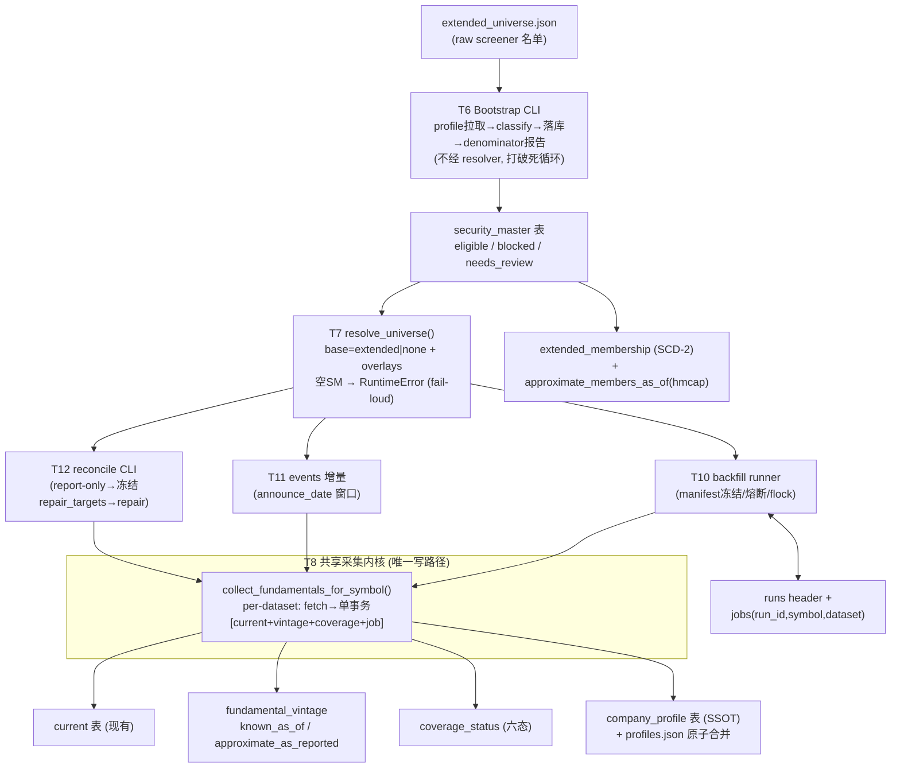

# Extended Primary Universe Implementation Plan (v2.4)

> **For agentic workers:** REQUIRED SUB-SKILL: 实施阶段必须使用 superpowers:test-driven-development 执行每个 task 的 RED→GREEN 循环；任务编排用 superpowers:subagent-driven-development（推荐）或 superpowers:executing-plans。Steps use checkbox (`- [ ]`) syntax for tracking.

> ✅ **v2.4 已获 Boss 正式 PASS（2026-08-18，历经 5 轮批注）——可开始执行：先 Stop 0，再 Stop A（T1 起按序 TDD）。** 每个 Stop Point 仍需单独验收，禁止自动 merge / push / 部署 / 改 crontab。

> **版本**: v2.4（2026-08-18）。Round 1（8 P1 + 7 must-fix）、Round 2（6 P1 + 5 P2）、Round 3（4 P1 + 6 minor）、Round 4（2 P1 + 4 P2）、Round 5（1 P1）全部处理。

## Round 5 批注处理对照表（v2.3 → v2.4 落点）

| # | 批注 | v2.4 落点 |
|---|---|---|
| R5-P1-1 | Historical run 按"是否 current base"跳过是错的——current 成员的普通 backfill 只有最近 8Q，可能不覆盖 as-of 所需历史窗口 | **T10 historical 目标改为按数据完整性跳过**：新增 `has_asof_window(store, symbol, as_of, quarters=8)`（三表各自在 as-of 前 8 个财季窗口内无洞，复用 T18 的 ≤120 天连续性规则）；目标 = 全部 as-of candidates − `has_asof_window` 为真者；测试改为 AAPL（current 但窗口不足→重拉加深）/ MSFT（current 且窗口足→跳过）/ OLDCO（historical-only→拉取）三例；`candidate_coverage_pct` 分母 = **全部** as-of candidates |

## Round 4 批注处理对照表（v2.2 → v2.3 落点）

| # | 批注 | v2.3 落点 |
|---|---|---|
| R4-P1-1 | 两阶段提交仍可能 DB 成功、JSON 发布失败 → 分叉 | **SSOT 倒转**：`extended_membership`（DB）升格为 current-base SSOT；`extended_universe.json` 降级为**可重建 cache**——`current_base_universe()` 改读 active membership ∩ eligible，不再依赖 JSON；JSON 发布失败只 warn，下次任务重建（T7/T17 改写 + 新增"DB 成功 JSON 失败"故障测试；T6 bootstrap 末尾写初始 membership snapshot 解决冷启动） |
| R4-P1-2 | 历史候选有名单无财报 | **T10 实现 `--include-historical --as-of DATE`**（Boss 选项 1）：目标 = `approximate_members_as_of(as_of)` − 已覆盖者；`limit_quarters` 自动加深至覆盖 as-of 前 8Q（上限 40）；独立 run_id manifest；完成报告含 `candidate_coverage_pct`；不影响 current 分母与 R9 gate |
| R4-P2-1 | 云端识别用现有 SSOT | T16 守卫改 `config.settings.IS_CLOUD`（`FINANCE_ENV=cloud`）；Stop E cron 行删除自造的 `FINANCE_CLOUD=1` |
| R4-P2-2 | 测试数量陈旧 | T2/T5/T6/T10/T12 的 GREEN 步骤统一改"全部 passed"，不再写死数字 |
| R4-P2-3 | forward 失败桶来源不明确 | T18：失败桶显式从最新 complete run 的 `fmp_forward_runs` manifest（summary/failures 字段，Step 0 grep 确认字段名）读 per-symbol fetch_failed |
| R4-P2-4 | Stop D 闸门时序 | 注明闸门是 backfill 结束后（~3h 后）单独执行的步骤，不得紧随后台启动 |

## Round 3 批注处理对照表（v2.1 → v2.2 落点）

| # | 批注 | v2.2 落点 |
|---|---|---|
| R3-P1-1 | 身份全集与当前分母混用 | 新增「**Universe 三集合定义**」冻结章节；**T7** 增 `current_base_universe()` helper（= 当前 Extended raw ∩ SM eligible）；**T10 / T11 / T14 / T18** 的目标与分母全部改用它；历史公司补数需显式 `--include-historical`（不在 Stop D 范围） |
| R3-P1-2 | identity 状态契约冲突 | 新增「**Identity 状态契约**」冻结表（T6 内）：网络失败 → coverage `fetch_failed` 不写 SM **但必写 coverage(identity)**；200 空 → SM `missing_profile` + coverage `provider_empty`+TTL；冲突 → SM `identity_conflict` + coverage `identity_blocked`；**`missing_profile` 永不作为 coverage status**；T17 文字修正 + 新增网络失败可见性测试 |
| R3-P1-3 | collector 与 job 状态不兼容 | **T10** 显式 `JOB_STATUS_MAP = {"ok": "done", "provider_empty": "provider_empty", "fetch_failed": "fetch_failed"}` + happy-path **E2E 测试**（done==total_jobs、is_complete、run.status=="complete"） |
| R3-P1-4 | Extended JSON 与 DB 分叉 | **T17** 两阶段提交：screener 结果先入 tmp → entrant bootstrap + membership 成功 → `os.replace` 发布 JSON；失败旧 JSON 不动；含故障注入测试 |
| R3-m1 | T1 rollback 测试列数错 | T1 测试 SQL 改具名列插入 |
| R3-m2 | observed_at 纯日期边界 | T5：`record_vintage` 拒绝纯日期 observed_at（ValueError）；`known_as_of` 查询参数纯日期规范化为当日 `T23:59:59.999999Z`（含当日语义）；测试全部改 timestamp |
| R3-m3 | forward verifier fetch_failed 伪装 not_applicable | T18：分类顺序冻结——最新 run `fetch_failed` 先单列为失败桶，之后才判 not_applicable |
| R3-m4 | Stop E 无完整 cron 行 | Stop E 给出可复制的完整 crontab 行（cron_wrapper 三参格式） |
| R3-m5 | watchlist 云端写入防护 | T16：`add_to_watchlist()` 检测云端环境即 raise（`FINANCE_CLOUD=1`，Stop E 在 crontab 环境注入；Step 0 先 grep 现有云端检测惯例优先复用） |
| R3-m6 | Stop D manifest 查询不精确 | Stop D 用显式 `$RUN_ID` 变量查询，弃用 `started_at desc limit 1` |

## 批注处理对照表（Round 1 → v2 落点）

| # | 批注 | v2 落点 |
|---|---|---|
| P1-1 | 北极星顺序反了 | **Stop 0** 前置：北极星修订草案全文在本 plan 内，批准后先落盘再开 TDD |
| P1-2 | Security Master 启动死循环 | **T6 Bootstrap CLI**：raw extended 名单（不经 resolver）→ Profile → SM → denominator 报告；resolver 空 SM fail-loud（T7 测试锁定）；backfill 冻结目标断言 >0（T10） |
| P1-3 | 两套采集链 | **T8 共享内核** `collect_fundamentals_for_symbol()`：backfill / events / reconciliation / `--scope core` 全部走同一内核（T10/T11/T12 接线） |
| P1-4 | 事务不原子 + ledger 粒度 | **T8** `write_symbol_dataset()` 单事务写 current+vintage+coverage+job；**T9** manifest 改 run header + `(run_id, symbol, dataset)` 粒度 |
| P1-5 | reconcile 命令不存在且会全池重抓 | **T12** 独立 `scripts/reconcile_fundamentals.py`：report-only 对账 → 冻结 repair_targets → 只修 targets → Telegram 摘要，argparse/冻结/摘要全有测试 |
| P1-6 | R8 历史 PIT 缺失 + anchor 混用 | **T5** 拆两个不可混用接口 `known_as_of(observed_at)` / `approximate_as_reported(as_of)`（后者强制 approximate 标签）；**T3** `approximate_members_as_of()` 用 historical_market_cap 构造上线前候选集 |
| P1-7 | 退役无完整迁移任务 | **T20 全调用方迁移矩阵**：23 行逐个列 file:line / 替代语义 / 测试 / commit；退役门槛 = 埋点 4 周零 + **静态 grep 零引用**（T19 检查脚本） |
| P1-8 | identity 规则不可靠 | **T2 重写**：真实字段 contract fixture、CIK+名称交叉验证、override 表 → mktCap → volAvg → **needs_review（不自动拍板）**；ADR 不误杀（TSM 用例锁定） |
| MF-1 | profiles.json 原子更新 | T8：新 `company_profile` 表为 SSOT + profiles.json tmp+os.replace 原子合并写（Profile ≥98% 从表测量） |
| MF-2 | backfill 无锁 | T10：runner 内建 flock `resource-market_db_writer.lock`，busy → exit 75；runbook 命令更新 |
| MF-3 | metrics 返回类型破坏 | T13：保持 `dict[symbol,int]` 不变，失败经 `collect_failures` out-param，`sum()` 兼容有测试 |
| MF-4 | forward 分母自证循环 | T18：D1（分析师覆盖）/ D2（≥4Q 有效）两集合显式定义，not_applicable 单列 |
| MF-5 | 缺 Confidence header | 见下节 |
| MF-6 | TDD 步骤不完整 | 每个 task 都有显式 RED 命令 + 预期失败 + GREEN 命令 + 预期通过 |
| MF-7 | `git add -A` | 所有 commit 步骤改精确文件列表 |

## Round 2 批注处理对照表（v2 → v2.1 落点）

| # | 批注 | v2.1 落点 |
|---|---|---|
| R2-P1-1 | 历史 approximate universe 有 survivorship bias（SM 只建于今天的 Extended） | **T6** bootstrap 分母扩为 current Extended ∪ 历史 hmcap ≥$10B ∪ delisted overlay；**T3** `approximate_members_as_of` 不与当前 membership 求交，仅剔除身份封禁者，SM 无记录者进 `unverified` 单列；新增 OLDCO 双测试 |
| R2-P1-2 | 新进池公司永久卡 missing_profile | **T17** 重排：raw entrants → 增量 identity bootstrap → 用最终 eligible 写 membership；失败进 identity repair queue（coverage dataset="identity"）；**T12** reconcile 处理该队列（不限 eligible） |
| R2-P1-3 | coverage 缺重试字段 + provider_empty 永久终态 | **T1** DDL 加 `last_attempt_at / last_success_at / consecutive_failures / next_retry_at`；**T8** 内核维护；`provider_empty` 改带 TTL 负缓存（默认 30 天），**T12** retryable = `next_retry_at <= now` |
| R2-P1-4 | Runbook 三处命令错误 | Stop C：smoke 实例化 MarketStore 触发建表；cron_wrapper 补 `<log_file>` 参数；Stop D：metrics 等 manifest complete 后经同一 writer lock 执行 |
| R2-P1-5 | 迁移矩阵漏项 | **T20 新增 B5 批次 #21-23**：fundamental_fetcher 六处默认 `get_symbols()`、一次性 `Core − eligible → watchlist` 迁移、回测 `"pool"` selector alias；#14 forward parity 改为"允许损失清单"语义 + 加 holdings overlay |
| R2-P1-6 | watchlist 无所有权/同步模型 | **T16** 改存 company.db `watchlist` 表（本地独占写，随现有 `--push` 同步，符合 P3 所有权模型）；废弃 watchlist.json 方案 |
| R2-P2-1 | membership NOT IN 千参 | T3 Step 3：Python 求 exited + 分批 UPDATE |
| R2-P2-2 | observed_at 只用日期会撞主键 | T5：observed_at 统一完整 UTC timestamp（ISO 8601），加同日双修订测试 |
| R2-P2-3 | profiles.json 每家重写一次 | T8 内核只写 `company_profile` 表；`rebuild_profiles_json()` 在 run/reconcile 结束一次性重建镜像 |
| R2-P2-4 | Stop F 翻 gate 无显式发布 | Stop F 改为：config commit → 部署 → 验证三步 |
| R2-P2-5 | 表数/行数计数错误 | 全文修正：新表 7 张；矩阵 23 行（含 B5） |

## Confidence / 不确定点

| 等级 | 项 | 处理 |
|---|---|---|
| 低置信 | FMP profile 真实字段名（`exchange` vs `exchangeShortName`、`mktCap` vs `marketCap`、`isAdr` 是否存在） | T2 Step 0 用真实 payload 录 fixture 做 contract test；classify 用多候选字段 accessor |
| 低置信 | `MarketStore` 构造签名 / `_bulk_upsert` 内部可否抽出 conn 级 helper | T1 Step 0 强制先读 `tests/test_market_store.py` + `market_store.py:691-734` 再动手 |
| 中置信 | share class primary 判定的边角（BRK-A/B 符号格式、双类 ADR） | override 表兜底 + needs_review 不自动拍板 |
| 中置信 | 8Q 连续性的 gap 阈值（相邻 fiscal_date ≤120 天） | T18 常量可调，验收时按真实分布校准 |
| 中置信 | 云端 sqlite3 版本（IN 子句 999 参数限制是否命中） | T20-B1 直接改分块查询，不赌版本 |
| ✅ 已拍板（Round 2） | 价格线 **P1**：FMP 只跑 overlay tier，Extended 全池 yfinance batch | T20 #6 按 P1 实施 |
| ✅ 已拍板（2026-08-18） | share_class_overrides 初始内容：**Alphabet → GOOG**、Berkshire → BRK-B | T2 按此实施 |
| ✅ 已拍板（2026-08-18） | `POOL_SIZE_RANGE=(70,260)`（临时 gate，Stop G 删除） | T14 按此实施 |

---

**Goal:** 把 `$10B+` Extended Pool 升级为唯一默认 base universe：security master 资格闸门 + 统一 resolver + 共享采集内核 + 全池三张财报回填 + 不可变 fundamental vintage + 事件驱动增量 + Core 两阶段软退役（含完整迁移矩阵）。

**Architecture:** Bootstrap（raw 名单→SM）打破鸡生蛋循环；单一采集内核被 backfill/events/reconcile 共用；`(symbol, dataset)` 粒度 manifest + 单事务写入边界；严格 PIT（`known_as_of`）与近似 PIT（`approximate_as_reported`）双接口不可混用；`universe.json` 永不写入 extended 内容。

**Tech Stack:** Python 3.10（云端）/ SQLite WAL / FMP API（2s 串行）/ pytest

**Spec:** `docs/design/requirements.md`（R1–R14）· `docs/design/research.md` · `docs/design/glossary.md` · Handoff `docs/plans/2026-08-16-extended-primary-universe-cc-handoff.md`

---

## Global Constraints

- 云端 Python 3.10：禁 f-string 反斜杠、禁 match/case（PEP 585/604 类型可用）
- FMP 串行 2s（`config/settings.py:129`）；MarketData 单 IP 绑定云端
- `market.db` 云端独占写入；`market_db_writer` flock 锁（`scripts/cron_wrapper.sh:83-96`，锁文件 `/tmp/finance-cron-locks/resource-market_db_writer.lock`）——**一切长写任务（含手动 backfill）必须持锁**
- 本地测试用绝对路径 venv：`PY` = `/Users/owen/CC\ workspace/Finance/.venv/bin/python`
- worktree 无 live data：所有测试用 tmp fixture db，不得依赖 `data/`
- crontab 只允许覆盖写入（`crontab <file>`），操作前 `crontab -l > backup`
- SQLite 备份只用 backup API；库体积按 2GB 软上限设计
- **`universe.json` 双端并集 merge 只增不减（`pool_manager.py:469-546`）——任何任务禁止把 extended 名单写入该文件**
- 缺失值禁止默认 0/neutral/沿用旧值不打标；空返回必须区分 provider_empty vs fetch_failed
- IV / 期权链 / 新闻 / LLM 深度分析禁止扩全池默认运行（R5/R13）
- 本 plan 引用的现有代码行号来自 2026-08-18 审计（research.md §3/§5）；**每个 Modify 点动手前先 grep 核对签名**
- 提交纪律：TDD、小步 commit、**精确文件列表（禁 `git add -A`）**、消息前缀 `feat(universe):` / `fix(universe):` / `test(universe):`

---

## 架构图



## 业务流程图（Boss 视角）


---

## 方案对比（v1 已过审部分保留结论，全文见 research.md）

- **主架构**：B——resolver + 兼容层迁移后删 Core（A 硬切被 handoff 禁止；C 双池被 Boss 否决）
- **Vintage**：独立表 JSON payload + change-only append（绕 `_migrate_add_columns` 地雷；~5MB/年）
- **Backfill 排期**：周日独立时窗（周六方案会杀 forward 当周快照）
- **v2 新增——采集链**：共享内核（唯一写路径）vs 双链并存（v1 方案，P1-3 否决）：双链意味着 events/reconcile 更新的公司没有 vintage/coverage，R7/R10 直接落空
- **v2 新增——manifest 粒度**：`(run_id, symbol, dataset)`（可表达 income 成功 balance 失败）vs `(run_id, symbol)`（v1，P1-4 否决）

## 风险自证

**最大风险**：消费方迁移的静默语义变化（11 个独立 resolver、五种 "pool" 含义、~40 处 `universe_variant` 命名地雷）。**应对**：T20 全量迁移矩阵逐行带 parity 测试；回测默认值**不翻**（显式选项新增而已）；每行独立 commit 可独立 revert。

**次大风险**：backfill 中途损坏生产库。**应对**：pre-backfill backup + `(symbol,dataset)` 粒度 manifest + 单事务写入边界 + 20% 熔断 + canary 25 先行 + current 幂等 + vintage 可按 observed_at 精确回滚 + runner 内建 flock。

**为什么不用更简单的做法**：更简单 = 硬切 `get_symbols()`（五个爆炸点见 research.md §5.5）或跳过 SM/vintage 直接扩池（= 分母被 ETF/双类污染 + restatement 静默覆盖，R1/R7 落空）。

## 回滚方案

| Stop | 回滚手段 |
|---|---|
| 0 | 北极星 revert 单 commit |
| A | worktree 分支未 merge 零影响 |
| B | `git revert -m 1 <merge-sha>` |
| C | 云端 `git reset --hard <prev>`（新表 CREATE IF NOT EXISTS 幂等，不动旧表） |
| D | 恢复 pre-backfill backup；或按 `observed_at=run日期` 删 vintage + runs 标 rolled_back（current 重跑自愈） |
| E | `crontab cron_backup_<date>` 覆盖恢复 |
| G | 阶段 1 零删除；阶段 2 前 tag `pre-core-retirement` |

---

## Universe 三集合定义（R3-P1-1，全 plan 冻结语义）

| 集合 | 定义 | 消费方 |
|---|---|---|
| **identity universe** | security_master 全部行（当前 + 历史曾达标 + 退市）——身份层，只回答"这个 symbol 是谁" | T2/T3/T6 身份解析；`approximate_members_as_of` 的过滤器 |
| **current base universe** | **active `extended_membership`（`effective_to IS NULL`）∩ SM eligible —— SSOT 在 DB**（R4-P1-1）；`extended_universe.json` 降级为可重建 cache，仅供 legacy 读者过渡 | **backfill 目标（T10）、`--scope base`（T11）、health 分母（T14）、R9 verifier 分母（T18）、默认讨论（T7 resolver base="extended"）** |
| **historical candidates** | `approximate_members_as_of(as_of)`：as-of hmcap ≥$10B，经身份过滤，强制 approximate 标签 | 历史排名/回测查询专用；**不进入任何默认采集或覆盖率分母** |

历史退池/退市公司的基本面补数不在本项目默认范围：backfill runner 只接受 current base universe；`--include-historical` 显式 flag 保留为未来入口（传入即要求同时给 `--as-of`，Stop D 不使用）。

## Stop Points 总览

| Stop | 内容 | Boss 审批 |
|---|---|---|
| **0** | 北极星 Data Layer 修订落盘（草案见下） | ✅ 随本 plan 一并批准 |
| **A** | T1–T21 TDD 代码完成 | 验收后批 merge |
| **B** | merge no-ff + push | ✅ |
| **C** | 云端部署 + 备份清理（issue 046）+ **bootstrap 首跑 + denominator 报告** | ✅ |
| **D** | canary 25 → 报告 → 全量 backfill（周日，~2.8h，持锁） | ✅ canary 后批全量 |
| **E** | cron 切换（events 日更 + 周日 reconcile；周六 10:00 旧 job 下线） | ✅ |
| **F** | R9 四指标 verifier 验收 → 覆盖 gate 转强制 | 报告交 Boss |
| **G** | 迁移矩阵清零 → 埋点 4 周零 + grep 零引用 → 删 Core | ✅ 两阶段各批一次 |

---

# Stop 0 — 北极星 Data Layer 修订（先于一切代码）

**Files:** Modify `docs/design/north-star.md`（只动第一层 section + 关键架构决策表，不重画金字塔）

**修订草案全文**（替换现有"### 第一层：数据层（地基）"section 的表格及其导语；Boss 批注可直接改此处文字）：

```markdown
### 第一层：数据层（地基）

自动更新的原始数据，为上层分析提供输入。

**Universe 语义（2026-08 修订）**
- 唯一默认 base universe = **Extended**（FMP NYSE/NASDAQ active、非 ETF/Fund、市值 ≥$10B、
  经 security master 资格闸门去除重复 share class 与身份异常）
- 持仓 / 手动关注 / 基准 ETF 通过**显式 overlay** 进入具体任务，不改变 base 定义
- Broad（$1B+）仍为价格/市值研究底座；Core Pool 软退役中（全调用方迁移 + 对拍完成后删除）
- 昂贵数据（IV / 期权链 / 新闻 / LLM 深度分析）**永不**随 base 扩大自动全池运行

| 数据类型 | 来源 | 存储 | 更新机制 |
|---------|------|------|---------|
| 量价 | FMP + yfinance | market.db:daily_price | 日频 (云端 cron) |
| 基本面 current | FMP | market.db:income/BS/CF/metrics_quarterly | 财报事件驱动 + 周日全池对账 |
| 基本面 vintage | 采集时自建 | market.db:fundamental_vintage (append-only, change-only) | 随每次采集 |
| Universe membership | FMP screener + security master | market.db:extended_membership (SCD-2) | 周频 |
| 覆盖率状态 | 自建 | market.db:coverage_status (六态失败语义) | 随采集 + 周对账 |
| 期权 IV | MarketData.app | market.db:iv_daily | 日频（显式 targets：持仓∪关注∪基准，非全池） |
| 前瞻预期 | FMP + yfinance | market.db:fmp_estimates / forward_estimates (周频 PIT) | 周频 |
| 宏观 | FRED | macro_snapshot.json (4h/12h TTL) | 准实时 |
| 社交情感 | Adanos (已 archive) | market.db:social_sentiment (历史) | 停更 |
| 新闻 | FMP | 按需获取 | 按需 |

**PIT 边界**：严格 PIT（`known_as_of`，认知时间轴重放）自 vintage 上线日起有效；
上线前历史一律 approximate PIT（`approximate_as_reported`：as-of 历史市值门槛 + 最新重述值 +
accepted_date 过滤），输出强制携带 approximate 标签，两接口不可混用。
```

**关键架构决策表追加两行**：

```markdown
| Extended 唯一主池 | Core 软退役，Extended $10B+ 为唯一默认 base + explicit overlay | 2026-08-18 |
| 基本面 PIT 双轨 | current 表高效查询 + fundamental_vintage 不可变版次；严格/近似 PIT 双接口 | 2026-08-18 |
```

- [ ] **Step 1**: Boss 批准本 plan（含上述草案文字）
- [ ] **Step 2**: 按草案修改 `docs/design/north-star.md`
- [ ] **Step 3**: Commit: `git add docs/design/north-star.md && git commit -m "docs(universe): north-star data layer revision — extended as sole base universe"`

---

# Stop A — 代码任务（TDD）

> 执行环境：worktree `/Users/owen/CC workspace/Finance/.worktrees/extended-primary-universe`
> 基线（应保持 79 passed）：`PY -m pytest tests/test_extended_universe_manager.py tests/test_update_data_scope.py tests/test_market_store.py tests/test_market_store_fmp_forward.py -q`

### Task 1: MarketStore 存储基础设施（新表 + 事务边界）

**Files:**
- Modify: `src/data/market_store.py`（`_SCHEMA` :214-579 末尾追加 DDL；`_VALID_TABLES` :594-607 注册新表名；新增方法）
- Test: `tests/test_market_store_universe.py`

**Step 0（不产码）**: 读 `tests/test_market_store.py` 确认 MarketStore 构造签名与 tmp db fixture 写法；读 `market_store.py:691-734` 确认 `_bulk_upsert` 结构，规划抽出 `_upsert_rows_in_conn(conn, table, rows)`（供 T8 在外层事务内复用，不自带 `with conn:`）。

**Interfaces (Produces):**
- 新表 DDL（七张）：

```sql
CREATE TABLE IF NOT EXISTS security_master (
    symbol TEXT PRIMARY KEY, cik TEXT, company_name TEXT, exchange TEXT,
    is_etf INTEGER NOT NULL DEFAULT 0, is_fund INTEGER NOT NULL DEFAULT 0,
    is_adr INTEGER NOT NULL DEFAULT 0, share_class_of TEXT,
    eligible INTEGER NOT NULL, reason TEXT NOT NULL, updated_at TEXT NOT NULL
);
CREATE TABLE IF NOT EXISTS extended_membership (
    symbol TEXT NOT NULL, effective_from TEXT NOT NULL, effective_to TEXT,
    reason TEXT NOT NULL DEFAULT 'screener',
    PRIMARY KEY (symbol, effective_from)
);
CREATE INDEX IF NOT EXISTS idx_membership_window ON extended_membership(effective_from, effective_to);
CREATE TABLE IF NOT EXISTS coverage_status (
    symbol TEXT NOT NULL, dataset TEXT NOT NULL, status TEXT NOT NULL,
    detail TEXT, updated_at TEXT NOT NULL,
    last_attempt_at TEXT, last_success_at TEXT,
    consecutive_failures INTEGER NOT NULL DEFAULT 0,
    next_retry_at TEXT,
    PRIMARY KEY (symbol, dataset)
);
-- 重试语义（R2-P1-3）：fetch_failed → next_retry_at = now + min(2^consecutive_failures, 16) 天；
-- provider_empty → 带 TTL 负缓存 next_retry_at = now + 30 天（settings.PROVIDER_EMPTY_TTL_DAYS）；
-- ok → 清零 consecutive_failures、写 last_success_at、next_retry_at = NULL。
-- dataset 取值含 "identity"（身份补拉队列，见 T12/T17）。
CREATE TABLE IF NOT EXISTS company_profile (
    symbol TEXT PRIMARY KEY, payload TEXT NOT NULL, updated_at TEXT NOT NULL
);
CREATE TABLE IF NOT EXISTS fundamental_vintage (
    symbol TEXT NOT NULL, statement TEXT NOT NULL, fiscal_date TEXT NOT NULL,
    observed_at TEXT NOT NULL, filing_date TEXT, accepted_date TEXT,
    content_hash TEXT NOT NULL, vintage_quality TEXT NOT NULL, payload TEXT NOT NULL,
    PRIMARY KEY (symbol, statement, fiscal_date, observed_at)
);
CREATE INDEX IF NOT EXISTS idx_fv_symbol_stmt ON fundamental_vintage(symbol, statement, fiscal_date);
CREATE TABLE IF NOT EXISTS fundamental_backfill_runs (
    run_id TEXT PRIMARY KEY, universe_hash TEXT NOT NULL, params_json TEXT NOT NULL,
    status TEXT NOT NULL DEFAULT 'running', started_at TEXT NOT NULL, finished_at TEXT
);
CREATE TABLE IF NOT EXISTS fundamental_backfill_jobs (
    run_id TEXT NOT NULL, symbol TEXT NOT NULL, dataset TEXT NOT NULL,
    status TEXT NOT NULL DEFAULT 'pending',
    attempts INTEGER NOT NULL DEFAULT 0, last_error TEXT,
    claimed_at TEXT, completed_at TEXT,
    PRIMARY KEY (run_id, symbol, dataset)
);
```

- `store.transaction()` 上下文管理器：`BEGIN IMMEDIATE` → yield conn → commit；异常 → rollback。文档注明：**在 transaction() 内只能调 `_in_conn` 后缀 helper**，不得调用自带 `with conn:` 的公开方法（嵌套会提前 commit）。

- [ ] **Step 1 (RED): 写失败测试**

```python
# tests/test_market_store_universe.py
import pytest, sqlite3

# fixture: tmp_store —— 按 tests/test_market_store.py 现有写法构造指向 tmp_path 的 MarketStore

NEW_TABLES = ["security_master", "extended_membership", "coverage_status",
              "company_profile", "fundamental_vintage",
              "fundamental_backfill_runs", "fundamental_backfill_jobs"]

def test_new_tables_created(tmp_store):
    conn = sqlite3.connect(tmp_store.db_path)
    names = {r[0] for r in conn.execute("select name from sqlite_master where type='table'")}
    assert set(NEW_TABLES) <= names

def test_transaction_rolls_back_multi_table_on_error(tmp_store):
    with pytest.raises(RuntimeError):
        with tmp_store.transaction() as conn:
            conn.execute("insert into coverage_status(symbol, dataset, status, detail, updated_at) "
                         "values ('A','income_quarterly','ok',NULL,'2026-08-20')")   # 具名列（表共 9 列）
            conn.execute("insert into company_profile(symbol, payload, updated_at) "
                         "values ('A','{}','2026-08-20')")
            raise RuntimeError("boom")
    conn = sqlite3.connect(tmp_store.db_path)
    assert conn.execute("select count(*) from coverage_status").fetchone()[0] == 0
    assert conn.execute("select count(*) from company_profile").fetchone()[0] == 0
```

- [ ] **Step 2 (RED 确认)**: `PY -m pytest tests/test_market_store_universe.py -q` → 预期失败：`AssertionError`（表不存在）/ `AttributeError: 'MarketStore' object has no attribute 'transaction'`
- [ ] **Step 3 (实现)**: DDL 追加进 `_SCHEMA`；`transaction()` 用 thread-local conn 显式 `BEGIN IMMEDIATE`；抽出 `_upsert_rows_in_conn`（`_bulk_upsert` 内部改调它，行为不变）
- [ ] **Step 4 (GREEN)**: 同命令 → 2 passed；回归：`PY -m pytest tests/test_market_store.py tests/test_market_store_fmp_forward.py -q` → 与基线相同 passed 数
- [ ] **Step 5 (Commit)**: `git add src/data/market_store.py tests/test_market_store_universe.py && git commit -m "feat(universe): storage tables + explicit transaction boundary"`

---

### Task 2: Security 分类逻辑（真实字段 + 交叉验证 + needs_review）

**Files:**
- Create: `src/data/security_master.py`
- Create: `config/share_class_overrides.json`
- Create: `tests/fixtures/fmp_profiles/`（真实 payload 录制）
- Test: `tests/test_security_master.py`

**Step 0（contract fixture，不产码）**: 从主仓库 `data/fundamental/profiles.json` 摘录 5 条真实 payload（AAPL、TSM(ADR)、GOOG、GOOGL、任一 ETF 若有）存为 `tests/fixtures/fmp_profiles/*.json`。若字段名与本 task 假设不符（如无 `exchangeShortName` 只有 `exchange`、`mktCap` vs `marketCap`），**先改本 task 的字段 accessor 再写测试**——这是 P1-8 的 contract test 要求。

**Interfaces (Produces):**
- `SecurityRecord` dataclass：`symbol, cik, company_name, exchange, is_etf, is_fund, is_adr, share_class_of, eligible, reason`
- `reason ∈ {"ok","etf","fund","secondary_share_class","identity_conflict","needs_review_primary","missing_profile"}`；`eligible=True` 仅当 `reason=="ok"`
- `classify_security(profile: dict) -> SecurityRecord`（单票分类，不做分组）
- `resolve_share_classes(records, overrides: dict[str, str], profiles_by_symbol: dict) -> list[SecurityRecord]`（分组 + primary 判定）
- 规则（P1-8 核心）：
  1. 字段读取用多候选 accessor：`_field(p, "exchangeShortName", "exchange")`、`_field(p, "mktCap", "marketCap")`
  2. **ADR 不 block**（`is_adr` 仅记录——TSM 等 NYSE ADR 是合法成员）
  3. 分组条件 = CIK 相同 **且** 规范化公司名相同（lower + 去标点 + 去 Inc/Corp/Class 后缀）。CIK 同名不同 → 双方 `identity_conflict`（vendor CIK 不可盲信）
  4. primary 判定优先级：`share_class_overrides.json`（key=cik, value=primary symbol）→ 更高 `mktCap` → 更高 `volAvg` → 都缺 → 组内全部 `needs_review_primary`（**不自动拍板**）
  5. `missing_profile`（无 companyName 或无 CIK 且非 ETF/Fund）→ blocked 但可经 bootstrap 补拉 profile 后升级
- `share_class_overrides.json` 初始内容（✅ Boss 已拍板 2026-08-18）：`{"0001652044": "GOOG", "0001067983": "BRK-B"}`

- [ ] **Step 1 (RED)**:

```python
# tests/test_security_master.py
import json, pathlib, pytest
from src.data.security_master import classify_security, resolve_share_classes

FIX = pathlib.Path(__file__).parent / "fixtures" / "fmp_profiles"

def _load(name):
    return json.loads((FIX / name).read_text())

def test_contract_real_payload_fields():
    p = _load("AAPL.json")
    rec = classify_security(p)
    assert rec.eligible and rec.reason == "ok" and rec.cik

def test_adr_is_eligible():
    rec = classify_security(_load("TSM.json"))
    assert rec.eligible is True and rec.is_adr in (True, False)  # ADR 标志仅记录，绝不 block

def test_etf_blocked():
    p = _load("AAPL.json"); p = dict(p, symbol="SOXX", isEtf=True)
    assert classify_security(p).reason == "etf"

def test_share_class_override_wins():
    goog, googl = _load("GOOG.json"), _load("GOOGL.json")
    recs = [classify_security(goog), classify_security(googl)]
    out = {r.symbol: r for r in resolve_share_classes(
        recs, overrides={goog["cik"]: "GOOG"},          # Boss 拍板：Alphabet 主类 = GOOG
        profiles_by_symbol={"GOOG": goog, "GOOGL": googl})}
    assert out["GOOG"].eligible is True
    assert out["GOOGL"].reason == "secondary_share_class" and out["GOOGL"].share_class_of == "GOOG"

def test_no_override_falls_to_mktcap_then_needs_review():
    a = {"symbol": "XX-A", "companyName": "Xx Inc.", "cik": "9",
         "exchange": "NYSE", "isEtf": False, "isFund": False}
    b = dict(a, symbol="XX-B")
    recs = [classify_security(a), classify_security(b)]
    out = {r.symbol: r for r in resolve_share_classes(recs, overrides={},
           profiles_by_symbol={"XX-A": a, "XX-B": b})}
    assert {out["XX-A"].reason, out["XX-B"].reason} == {"needs_review_primary"}  # 无数据不拍板

def test_same_cik_different_name_is_identity_conflict():
    a = {"symbol": "AA", "companyName": "Alpha Inc.", "cik": "7",
         "exchange": "NYSE", "isEtf": False, "isFund": False}
    b = {"symbol": "BB", "companyName": "Beta Corp.", "cik": "7",
         "exchange": "NYSE", "isEtf": False, "isFund": False}
    out = {r.symbol: r for r in resolve_share_classes(
        [classify_security(a), classify_security(b)], overrides={},
        profiles_by_symbol={"AA": a, "BB": b})}
    assert out["AA"].reason == out["BB"].reason == "identity_conflict"
```

- [ ] **Step 2 (RED 确认)**: `PY -m pytest tests/test_security_master.py -q` → `ModuleNotFoundError: src.data.security_master`
- [ ] **Step 3 (实现)**: 按规则 1-5；`_normalize_name()` = lower → 去 `.,'&` → 去尾缀 token `{inc, corp, corporation, class, co, ltd, plc}` → join
- [ ] **Step 4 (GREEN)**: 同命令 → 全部 passed
- [ ] **Step 5 (Commit)**: `git add src/data/security_master.py config/share_class_overrides.json tests/test_security_master.py tests/fixtures/fmp_profiles && git commit -m "feat(universe): security classification with cross-validated identity + needs_review (R1)"`

---

### Task 3: Store 方法（SM 落库 / membership 双接口 / coverage）

**Files:**
- Modify: `src/data/market_store.py`
- Test: 追加 `tests/test_market_store_universe.py`

**Interfaces (Produces):**
- `upsert_security_master(records: list[dict]) -> int`：全字段校验（symbol 非空、eligible ∈ {0,1}、reason ∈ 白名单七值），坏行整批拒绝（照抄 `upsert_fmp_estimates` :948-965 模式）
- `get_security_eligibility() -> dict[str, bool]`：**表为空 → raise RuntimeError("security_master empty — run bootstrap first")**（P1-2 fail-loud）
- `get_needs_review_symbols() -> list[str]`
- `record_membership_snapshot(symbols, as_of) -> {"entered": [...], "exited": [...]}`（SCD-2；幂等）
- `get_members_as_of(as_of: str) -> list[str]`：**严格接口**——`as_of` 早于首条 membership 记录 → raise ValueError（不静默降级）
- `approximate_members_as_of(as_of: str, min_mcap_usd: float = 1e10) -> dict`：**近似接口**（P1-6 + R2-P1-1）——`historical_market_cap` 中 `date <= as_of` 最近一日市值 ≥ 门槛的**全部** symbols（**不与当前 Extended membership 求交**——已跌出池/已退市者必须保留），仅剔除 SM 中身份封禁者（reason ∈ {etf, fund, secondary_share_class, identity_conflict}）；SM 无记录的达标 symbol **保留**并归入返回的 `unverified` 列表单列；返回 `{"symbols": [...], "unverified": [...], "approximate": True, "as_of": ..., "basis": "historical_market_cap"}`（approximate 标志硬编码在返回结构里，调用方无法丢弃）
- `upsert_coverage_status(rows) -> int`（六态白名单）；`get_coverage(dataset) -> dict[str, str]`

- [ ] **Step 1 (RED)**:

```python
def test_eligibility_fail_loud_on_empty_sm(tmp_store):
    with pytest.raises(RuntimeError, match="bootstrap"):
        tmp_store.get_security_eligibility()

def test_membership_scd2_enter_exit(tmp_store):
    r1 = tmp_store.record_membership_snapshot(["AAPL", "MSFT"], as_of="2026-08-20")
    assert set(r1["entered"]) == {"AAPL", "MSFT"}
    r2 = tmp_store.record_membership_snapshot(["AAPL", "NVDA"], as_of="2026-08-27")
    assert r2["entered"] == ["NVDA"] and r2["exited"] == ["MSFT"]
    assert set(tmp_store.get_members_as_of("2026-08-21")) == {"AAPL", "MSFT"}

def test_strict_members_raises_before_first_snapshot(tmp_store):
    tmp_store.record_membership_snapshot(["AAPL"], as_of="2026-08-20")
    with pytest.raises(ValueError):
        tmp_store.get_members_as_of("2026-01-01")

def test_approximate_includes_former_member_not_in_current_extended(tmp_store):
    # R2-P1-1 核心用例：OLDCO 历史 $12B，今天既不在 Extended 也已 exited membership
    tmp_store.upsert_security_master([_sm_row(symbol="OLDCO")])
    tmp_store.record_membership_snapshot(["OLDCO"], as_of="2025-01-04")
    tmp_store.record_membership_snapshot(["AAPL"], as_of="2026-08-16")   # OLDCO 已 exited
    _seed_hmcap(tmp_store, "OLDCO", "2025-06-30", 12e9)   # helper: 直插 historical_market_cap
    out = tmp_store.approximate_members_as_of("2025-07-01")
    assert out["approximate"] is True and "OLDCO" in out["symbols"]

def test_approximate_keeps_unknown_symbol_as_unverified(tmp_store):
    _seed_hmcap(tmp_store, "GHOSTCO", "2025-06-30", 15e9)   # SM 完全无记录（如已退市未入池者）
    out = tmp_store.approximate_members_as_of("2025-07-01")
    assert "GHOSTCO" in out["symbols"] and "GHOSTCO" in out["unverified"]

def test_approximate_excludes_identity_blocked(tmp_store):
    tmp_store.upsert_security_master([_sm_row(symbol="SOXX", eligible=0, reason="etf")])
    _seed_hmcap(tmp_store, "SOXX", "2025-06-30", 11e9)
    assert "SOXX" not in tmp_store.approximate_members_as_of("2025-07-01")["symbols"]

def test_security_master_rejects_bad_row_atomically(tmp_store):
    with pytest.raises(ValueError):
        tmp_store.upsert_security_master([_sm_row(), _sm_row(symbol="", eligible=None)])
    with pytest.raises(RuntimeError):
        tmp_store.get_security_eligibility()   # 整批拒绝 → 表仍空

def test_coverage_six_states_only(tmp_store):
    with pytest.raises(ValueError):
        tmp_store.upsert_coverage_status([{"symbol": "A", "dataset": "income_quarterly",
                                           "status": "kinda_ok", "detail": None,
                                           "updated_at": "2026-08-20"}])
```

（`_sm_row` helper 沿用 T2 风格：完整字段 dict 工厂）

- [ ] **Step 2 (RED 确认)**: `PY -m pytest tests/test_market_store_universe.py -q` → `AttributeError: ... has no attribute 'get_security_eligibility'`
- [ ] **Step 3 (实现)**：exited 在 **Python 侧**求差（先 `SELECT symbol FROM extended_membership WHERE effective_to IS NULL` 读 active set，与本次名单求差），再按每批 500 分批 `UPDATE`——禁止生成千参 `NOT IN (...)`（R2-P2-1）；coverage 白名单 `{"ok","not_applicable","provider_empty","fetch_failed","stale","identity_blocked"}` + 重试字段维护逻辑（见 T1 DDL 注释）
- [ ] **Step 4 (GREEN)**: 同命令全 passed + 基线回归
- [ ] **Step 5 (Commit)**: `git add src/data/market_store.py tests/test_market_store_universe.py && git commit -m "feat(universe): SM store + strict/approximate membership interfaces (R1,R8,R10)"`

---

### Task 4: FMP client 状态区分

**Files:**
- Modify: `src/data/fmp_client.py`（现状：:304-311 空与失败同返 `[]`；:78-80 非 429 零重试）
- Test: `tests/test_fmp_client_status.py`

**Interfaces (Produces):** `FMPClient.get_dataset_with_status(kind: str, symbol: str, limit: int = 8) -> tuple[list, str]`；`kind ∈ {"profile","income","balance","cashflow","ratios"}`；status ∈ `{"ok","provider_empty","fetch_failed"}`。现有方法零改动；重试集合加入 5xx（保持 3 次退避）。

- [ ] **Step 1 (RED)**:

```python
# tests/test_fmp_client_status.py（monkeypatch client._request / 底层 session）
def test_ok(client_with_response):
    data, status = client_with_response([{"date": "2026-06-30"}]).get_dataset_with_status("income", "AAPL")
    assert status == "ok" and data

def test_provider_empty(client_with_response):
    data, status = client_with_response([]).get_dataset_with_status("income", "GHOST")
    assert status == "provider_empty" and data == []

def test_fetch_failed_on_none(client_with_response):
    data, status = client_with_response(None).get_dataset_with_status("income", "AAPL")
    assert status == "fetch_failed"

def test_5xx_retries_then_failed(client_with_5xx):
    data, status = client_with_5xx.get_dataset_with_status("income", "AAPL")
    assert status == "fetch_failed" and client_with_5xx.attempts == 3
```

- [ ] **Step 2 (RED 确认)**: `PY -m pytest tests/test_fmp_client_status.py -q` → `AttributeError: get_dataset_with_status`
- [ ] **Step 3 (实现)**: 内部 `_request_with_status()` 包装 `_request`/`_rate_limit`；kind→endpoint 映射复用现有 `get_income_statement` 等的 URL 构造
- [ ] **Step 4 (GREEN)** + 回归 client 现有测试
- [ ] **Step 5 (Commit)**: `git add src/data/fmp_client.py tests/test_fmp_client_status.py && git commit -m "feat(universe): FMP fetch with explicit ok/empty/failed status (R10)"`

---

### Task 5: Vintage 写入 + 严格/近似双读接口

**Files:**
- Modify: `src/data/market_store.py`
- Test: `tests/test_fundamental_vintage.py`

**Interfaces (Produces):**
- `record_vintage_in_conn(conn, symbol, statement, rows, observed_at, quality) -> int`（**conn 级**，供 T8 单事务组合；change-only：`content_hash = sha256(json.dumps(row, sort_keys=True, separators=(",",":")))`，与该 fiscal_date 最新版相同 → 跳过）；外层便捷封装 `record_vintage(...)` 自带事务
- **observed_at 统一为完整 UTC timestamp**（`"2026-08-24T10:00:00Z"` 格式，R2-P2-2）——同日两次修订不撞主键
- **边界规范化（R3-m2）**：`record_vintage` 收到纯日期 observed_at → **ValueError**（写入侧强制 timestamp）；`known_as_of` 的 as_of 查询参数若为纯日期 → 内部规范化为 `<date>T23:59:59.999999Z`（"截至该日结束所知"语义），timestamp 原样使用
- `quality ∈ {"latest_known","as_reported","revised"}`
- **两个不可混用的读接口（P1-6）**：
  - `known_as_of(symbol, statement, observed_at: str) -> list[dict]`：认知时间轴严格重放——每个 fiscal_date 取 `observed_at <= 参数` 的最新版；每行附 `_vintage_quality` 与 `_observed_at`。**没有 as-of 早于首个 vintage 的静默降级**：无命中即返回 `[]`
  - `approximate_as_reported(symbol, statement, as_of: str) -> dict`：上线前历史用——查 **current 表**（最新重述值）过滤 `accepted_date <= as_of`；返回 `{"rows": [...], "approximate": True, "basis": "current_tables_restated"}`。approximate 标志在返回结构，丢不掉
  - v1 的 `get_fundamentals_as_of(anchor=...)` 单函数双语义方案**废弃**（Boss P1-6：anchor="accepted_date" 会把未来 restatement 放进过去还不打标）

- [ ] **Step 1 (RED)**:

```python
def test_change_only_append(tmp_store):
    row = {"date": "2026-06-30", "revenue": 100, "acceptedDate": "2026-08-01 16:00:00"}
    assert tmp_store.record_vintage("AAPL", "income", [row], "2026-08-24T10:00:00Z", "latest_known") == 1
    assert tmp_store.record_vintage("AAPL", "income", [row], "2026-08-31T10:00:00Z", "latest_known") == 0

def test_record_vintage_rejects_pure_date_observed_at(tmp_store):
    with pytest.raises(ValueError):
        tmp_store.record_vintage("AAPL", "income", [{"date": "2026-06-30", "revenue": 1}],
                                 "2026-08-24", "latest_known")     # R3-m2：写入侧强制 timestamp

def test_restatement_two_versions_coexist(tmp_store):
    tmp_store.record_vintage("AAPL", "income", [{"date": "2026-06-30", "revenue": 100}], "2026-08-24T10:00:00Z", "latest_known")
    tmp_store.record_vintage("AAPL", "income", [{"date": "2026-06-30", "revenue": 95}], "2026-09-07T10:00:00Z", "revised")
    assert tmp_store.known_as_of("AAPL", "income", "2026-08-30")[0]["revenue"] == 100   # 纯日期→当日 23:59:59.999999Z
    new = tmp_store.known_as_of("AAPL", "income", "2026-09-08")[0]
    assert new["revenue"] == 95 and new["_vintage_quality"] == "revised"

def test_pure_date_asof_includes_same_day_observation(tmp_store):
    # R3-m2 边界：as_of="2026-08-24" 必须包含当日 10:00 的观测（规范化到当日末尾）
    tmp_store.record_vintage("AAPL", "income", [{"date": "2026-06-30", "revenue": 100}], "2026-08-24T10:00:00Z", "latest_known")
    assert tmp_store.known_as_of("AAPL", "income", "2026-08-24")[0]["revenue"] == 100

def test_known_as_of_before_golive_returns_empty_not_fallback(tmp_store):
    tmp_store.record_vintage("AAPL", "income", [{"date": "2026-06-30", "revenue": 100}], "2026-08-24T10:00:00Z", "latest_known")
    assert tmp_store.known_as_of("AAPL", "income", "2026-08-01") == []

def test_same_day_double_revision_both_stored(tmp_store):
    # R2-P2-2：同一天两版不同值 → 两行并存（timestamp 主键不撞）
    tmp_store.record_vintage("AAPL", "income", [{"date": "2026-06-30", "revenue": 100}],
                             "2026-09-07T10:00:00Z", "revised")
    n = tmp_store.record_vintage("AAPL", "income", [{"date": "2026-06-30", "revenue": 96}],
                                 "2026-09-07T18:30:00Z", "revised")
    assert n == 1
    assert tmp_store.known_as_of("AAPL", "income", "2026-09-07T12:00:00Z")[0]["revenue"] == 100
    assert tmp_store.known_as_of("AAPL", "income", "2026-09-08")[0]["revenue"] == 96

def test_approximate_reads_current_and_is_tagged(tmp_store):
    _seed_income_current(tmp_store, "AMAT", fiscal="2026-06-30",
                         accepted="2026-08-13 16:03:36", revenue=7)   # helper: 走现有 upsert_income
    out = tmp_store.approximate_as_reported("AMAT", "income", "2026-08-20")
    assert out["approximate"] is True and out["rows"][0]["revenue"] == 7
    assert tmp_store.approximate_as_reported("AMAT", "income", "2026-08-01")["rows"] == []
```

- [ ] **Step 2 (RED 确认)**: `PY -m pytest tests/test_fundamental_vintage.py -q` → `AttributeError: record_vintage`
- [ ] **Step 3 (实现)** → **Step 4 (GREEN)**: 全部 passed + 基线回归
- [ ] **Step 5 (Commit)**: `git add src/data/market_store.py tests/test_fundamental_vintage.py && git commit -m "feat(universe): vintage change-only append + strict/approximate read interfaces (R7,R8)"`

---

### Task 6: Bootstrap CLI（打破死循环）

**Files:**
- Create: `scripts/bootstrap_security_master.py`
- Test: `tests/test_bootstrap_security_master.py`

**Interfaces:**
- Consumes: **raw 三源并集分母（R2-P1-1，不经 resolver）**：
  1. `extended_universe_manager.get_extended_symbols()`（:113，当前名单）
  2. `historical_market_cap` 中**历史任一日**市值 ≥$10B 的全部 symbols（`SELECT DISTINCT symbol FROM historical_market_cap WHERE market_cap >= 1e10`——覆盖已跌出池者）
  3. `delisted_universe_manager` 的 delisted overlay（:21，覆盖已退市者）
  以及 T4 `get_dataset_with_status("profile", ...)`、T2 classify/resolve、T3 upsert
- Produces: CLI `PY scripts/bootstrap_security_master.py [--dry-run] [--limit N] [--current-only]`（`--current-only` 仅跑第 1 源，供周频增量场景复用）
- 流程：三源并集（空 → **exit 2 fail-loud**）→ 逐票 profile（provider_empty/fetch_failed 记 `missing_profile`/`fetch_failed`；**退市票 profile 拉不到属预期**：记 `missing_profile` 但仍在 approximate universe 的 `unverified` 路径可见，不消失）→ classify + resolve_share_classes → upsert_security_master + company_profile 表 → **denominator 报告** stdout+文件：按源分段（current / historical-only / delisted）× 按 reason 计数，及 needs_review 明细清单（Boss 定 override 用）
- eligible == 0 → exit 2（不静默产出空分母）
- **末步（R4-P1-1 冷启动）**：SM 建成后写**初始 membership snapshot**：`record_membership_snapshot(当前 raw 名单 ∩ eligible, as_of=today)`——此后 `current_base_universe()` 读 DB 即有值；报告附 membership 初始化计数
- 注：分母扩大后 profile 调用约 1,200-1,500 次（历史达标 + 退市并集），首跑 ~45-50 分钟，仍在 Stop C 时窗内

**Identity 状态契约（R3-P1-2，全 plan 冻结；bootstrap / entrant_bootstrap / reconcile 阶段 0 共用）**：

| 事件 | SM 写入 | coverage(dataset="identity") 写入 |
|---|---|---|
| 网络/HTTP 失败 | **不写 SM** | **必写** `fetch_failed` + 退避 next_retry_at（保证 repair queue 可见，不消失） |
| 200 + 空 profile | reason=`missing_profile` | `provider_empty` + TTL next_retry_at |
| 身份冲突（CIK 同名不同等） | reason=`identity_conflict` | `identity_blocked`（人工 override 解锁，无自动重试） |
| 解析成功 | reason=`ok`（或 etf/fund/secondary 等封禁值） | `ok` |

**`missing_profile` 永不作为 coverage status**（coverage 白名单六态不变）。

- [ ] **Step 1 (RED)**:

```python
def test_bootstrap_happy_path(tmp_store, fake_client, raw_list_3):
    rc = run_bootstrap(store=tmp_store, client=fake_client, raw_loader=lambda: raw_list_3)
    assert rc == 0
    elig = tmp_store.get_security_eligibility()
    assert sum(elig.values()) >= 1

def test_bootstrap_empty_raw_list_fails_loud(tmp_store, fake_client):
    assert run_bootstrap(store=tmp_store, client=fake_client, raw_loader=lambda: []) == 2

def test_bootstrap_zero_eligible_fails_loud(tmp_store, fake_client_all_etf):
    rc = run_bootstrap(store=tmp_store, client=fake_client_all_etf, raw_loader=lambda: ["SOXX"])
    assert rc == 2

def test_fetch_failed_symbol_not_written_as_blocked(tmp_store, fake_client_one_500):
    run_bootstrap(store=tmp_store, client=fake_client_one_500, raw_loader=lambda: ["AAPL", "BADNET"])
    assert "BADNET" not in tmp_store.get_security_eligibility()   # 待重跑，不是永久 blocked

def test_network_failure_still_visible_in_identity_queue(tmp_store, fake_client_one_500):
    # R3-P1-2：不写 SM 但必写 coverage(identity)=fetch_failed —— repair queue 不丢
    run_bootstrap(store=tmp_store, client=fake_client_one_500, raw_loader=lambda: ["AAPL", "BADNET"])
    assert tmp_store.get_coverage("identity").get("BADNET") == "fetch_failed"

def test_report_counts_by_reason(tmp_store, fake_client_mixed, capsys):
    run_bootstrap(store=tmp_store, client=fake_client_mixed, raw_loader=lambda: ["AAPL", "SOXX"])
    out = capsys.readouterr().out
    assert "eligible" in out and "etf" in out

def test_denominator_includes_historical_and_delisted_sources(tmp_store, fake_client_full):
    # R2-P1-1：OLDCO 不在当前 Extended，但历史 hmcap $12B → 必须进 bootstrap 分母
    _seed_hmcap(tmp_store, "OLDCO", "2025-06-30", 12e9)
    run_bootstrap(store=tmp_store, client=fake_client_full,
                  raw_loader=lambda: ["AAPL"],
                  delisted_loader=lambda: ["DEADCO"])
    fetched = fake_client_full.symbols_fetched
    assert {"AAPL", "OLDCO", "DEADCO"} <= set(fetched)

def test_delisted_profile_empty_recorded_not_dropped(tmp_store, fake_client_deadco_empty):
    run_bootstrap(store=tmp_store, client=fake_client_deadco_empty,
                  raw_loader=lambda: ["AAPL"], delisted_loader=lambda: ["DEADCO"])
    import sqlite3
    conn = sqlite3.connect(tmp_store.db_path)
    row = conn.execute("select reason from security_master where symbol='DEADCO'").fetchone()
    assert row[0] == "missing_profile"        # 在册可见，不是消失
```

- [ ] **Step 2 (RED 确认)**: `PY -m pytest tests/test_bootstrap_security_master.py -q` → import error
- [ ] **Step 3 (实现)**（`run_bootstrap()` 纯函数可注入，CLI wrapper 组装真实依赖；profiles.json 原子写 helper `_atomic_write_json(path, obj)` = tmp 文件 + `os.replace`）
- [ ] **Step 4 (GREEN)**: 全部 passed
- [ ] **Step 5 (Commit)**: `git add scripts/bootstrap_security_master.py tests/test_bootstrap_security_master.py && git commit -m "feat(universe): security master bootstrap CLI, fail-loud denominator (R1)"`

---

### Task 7: Universe Resolver

**Files:**
- Create: `src/data/universe_resolver.py`、`src/data/overlays.py`
- Test: `tests/test_universe_resolver.py`、`tests/test_overlays.py`

**Interfaces (Produces):**
- `ResolvedUniverse` dataclass：`base, symbols: tuple, provenance: dict[symbol, "base"|"overlay:<name>"], generated_at`
- `resolve_universe(base="extended", overlays=(), *, eligible_only=True, symbol_loader=None, eligibility_loader=None, overlay_loaders=None) -> ResolvedUniverse`
- 默认 eligibility_loader = `store.get_security_eligibility()` → **SM 空表时 RuntimeError 向上传播**（T3 已锁定，本 task 加集成断言）
- `base ∈ {"extended","none"}`；未知 overlay → ValueError
- **`current_base_universe(store=None) -> list[str]`**（模块级 helper，R3-P1-1 + R4-P1-1）：= **active membership（`effective_to IS NULL`）∩ SM eligible**——读 DB SSOT，**不读 extended_universe.json**；resolver base="extended" 的默认 `symbol_loader` 同步改为 `store.get_active_members()`（T3 顺带补该只读方法：`SELECT symbol FROM extended_membership WHERE effective_to IS NULL`）。**T10/T11/T14/T18 的统一入口**，与 SM 全体（含历史/退市身份）严格区分。active membership 为空 → RuntimeError("run bootstrap first")（与空 SM 同语义 fail-loud）
- overlays.py：`load_holdings()`（读 company.db holdings——Step 0 先 grep `terminal/company_store.py` 定位现有读取 API 复用）、`load_watchlist()`（读 **company.db `watchlist` 表**，表不存在/空返回 `[]`——所有权与同步见 T16）、`load_benchmarks()`（`settings.BENCHMARK_SYMBOLS`）
- **Bootstrap 不使用 resolver**（依赖方向：bootstrap → SM → resolver，无环）

- [ ] **Step 1 (RED)**（v1 五个用例保留 + 新增 fail-loud 传播）:

```python
def test_empty_sm_propagates_runtime_error():
    def boom():
        raise RuntimeError("security_master empty — run bootstrap first")
    with pytest.raises(RuntimeError, match="bootstrap"):
        resolve_universe(symbol_loader=lambda: ["AAPL"], eligibility_loader=boom,
                         overlay_loaders={})
# + test_base_extended_filters_ineligible / test_overlay_adds_with_provenance_and_no_base_pollution
# + test_base_none_is_pure_overlay / test_unknown_overlay_raises / test_symbols_sorted_dedup（同 v1 文本）
```

- [ ] **Step 2 (RED 确认)**: `PY -m pytest tests/test_universe_resolver.py tests/test_overlays.py -q` → ModuleNotFoundError
- [ ] **Step 3 (实现)**（实现体同 v1 Task 2 Step 3 代码块，另加 overlays 三 loader）
- [ ] **Step 4 (GREEN)**: 全 passed
- [ ] **Step 5 (Commit)**: `git add src/data/universe_resolver.py src/data/overlays.py tests/test_universe_resolver.py tests/test_overlays.py && git commit -m "feat(universe): unified resolver, fail-loud on empty SM (R1-R3,R13)"`

---

### Task 8: 共享采集内核（唯一写路径 + 原子边界）

**Files:**
- Create: `src/data/fundamental_collector.py`
- Modify: `src/data/market_store.py`（`write_symbol_dataset_in_conn` 组合方法）
- Test: `tests/test_fundamental_collector.py`

**Interfaces (Produces):**
- `DATASETS = ("profile", "income", "balance", "cashflow", "ratios")`
- `collect_fundamentals_for_symbol(symbol, *, client, store, limit_quarters=8, observed_at, job_writer=None) -> dict[str, str]`（返回 per-dataset status，六态子集 `{ok, provider_empty, fetch_failed}`）
- 每个 dataset 的原子边界（P1-4）：**一个事务** = [current 表 upsert（经 T1 `_upsert_rows_in_conn`；dataset→表映射：income→income_quarterly、balance→balance_sheet_quarterly、cashflow→cash_flow_quarterly、ratios→ratios_annual、profile→company_profile）+ `record_vintage_in_conn`（income/balance/cashflow 三类才写 vintage）+ coverage_status upsert + `job_writer(dataset, status)` 若提供]。事务中任一步失败 → 全部回滚，dataset 状态记 fetch_failed（在**新事务**里写 coverage+job，保证失败也有记录）
- **内核不写 profiles.json**（R2-P2-3）：profile dataset 只落 `company_profile` 表（SSOT）。另提供 `rebuild_profiles_json(store, path)`：从表一次性重建镜像文件（tmp + `os.replace` 原子替换），由 runner / reconcile 在**批次结束时调用一次**，供 legacy 读者（`data_health.py:117` / `exposure/analyzer.py:222`）过渡使用
- coverage 重试字段由内核维护（R2-P1-3）：每次尝试写 `last_attempt_at`；ok → `last_success_at` + 清零 `consecutive_failures` + `next_retry_at=NULL`；fetch_failed → `consecutive_failures+=1` + 指数退避 `next_retry_at`；provider_empty → `next_retry_at = now + PROVIDER_EMPTY_TTL_DAYS`（TTL 负缓存，到期可重探）
- 跨 dataset 不原子（明示局限）：dataset 级 ledger 记录部分状态，resume 只补失败的 dataset
- backfill / events / reconcile / `--scope core` **全部**调用本内核（P1-3）

- [ ] **Step 1 (RED)**:

```python
def test_happy_path_writes_all_five_targets(tmp_store, fake_client_full):
    statuses = collect_fundamentals_for_symbol("AAPL", client=fake_client_full,
                                               store=tmp_store, observed_at="2026-08-24")
    assert statuses == {d: "ok" for d in DATASETS}
    assert tmp_store.known_as_of("AAPL", "income", "2026-08-24")     # vintage 落了
    assert tmp_store.get_coverage("income_quarterly")["AAPL"] == "ok"

def test_atomic_rollback_on_midwrite_failure(tmp_store, fake_client_full, monkeypatch):
    monkeypatch.setattr(tmp_store, "record_vintage_in_conn",
                        lambda *a, **k: (_ for _ in ()).throw(RuntimeError("disk")))
    statuses = collect_fundamentals_for_symbol("AAPL", client=fake_client_full,
                                               store=tmp_store, observed_at="2026-08-24")
    assert statuses["income"] == "fetch_failed"
    import sqlite3
    conn = sqlite3.connect(tmp_store.db_path)
    assert conn.execute("select count(*) from income_quarterly").fetchone()[0] == 0  # current 也回滚了
    assert tmp_store.get_coverage("income_quarterly")["AAPL"] == "fetch_failed"       # 失败有记录

def test_partial_dataset_states(tmp_store, fake_client_balance_500):
    statuses = collect_fundamentals_for_symbol("AAPL", client=fake_client_balance_500,
                                               store=tmp_store, observed_at="2026-08-24")
    assert statuses["income"] == "ok" and statuses["balance"] == "fetch_failed"

def test_provider_empty_recorded_not_zeroed(tmp_store, fake_client_no_cashflow):
    statuses = collect_fundamentals_for_symbol("BANKCO", client=fake_client_no_cashflow,
                                               store=tmp_store, observed_at="2026-08-24")
    assert statuses["cashflow"] == "provider_empty"
    import sqlite3
    conn = sqlite3.connect(tmp_store.db_path)
    assert conn.execute("select count(*) from cash_flow_quarterly where symbol='BANKCO'").fetchone()[0] == 0
```

- [ ] **Step 2 (RED 确认)**: `PY -m pytest tests/test_fundamental_collector.py -q` → ModuleNotFoundError
- [ ] **Step 3 (实现)** → **Step 4 (GREEN)**: 全部 passed + 基线回归
- [ ] **Step 5 (Commit)**: `git add src/data/fundamental_collector.py src/data/market_store.py tests/test_fundamental_collector.py && git commit -m "feat(universe): shared collection kernel with per-dataset atomic writes (R6,R7,R10)"`

---

### Task 9: Manifest（run header + dataset 粒度 jobs）

**Files:**
- Modify: `src/data/market_store.py`
- Test: `tests/test_backfill_manifest.py`

**Interfaces (Produces):**
- `create_backfill_run(run_id, symbols, datasets, params: dict) -> None`：冻结 `(run_id, symbol, dataset)` 全组合为 pending；`universe_hash = sha256(",".join(sorted(symbols)))` 入 header；**同 run_id 二次创建且 universe_hash 不同 → ValueError**（照抄 `upsert_fmp_forward_run` :1134-1139 的不可变语义）；symbols 为空 → ValueError
- `claim_pending_jobs(run_id, symbol) -> list[dataset]`（该 symbol 的非终态 dataset；`fetch_failed` 且 attempts<3 可重入）
- `complete_job_in_conn(conn, run_id, symbol, dataset, status, error=None)`（conn 级，作 T8 `job_writer` 与内核同事务）
- `run_progress(run_id) -> dict`（各状态计数：`pending/in_progress/done/provider_empty/fetch_failed/skipped` + `total_symbols`、`total_jobs`、`is_complete`）；`finish_run(run_id, status)`（status ∈ {complete, aborted, rolled_back}）；`get_backfill_run(run_id) -> dict`（header 行：run_id/universe_hash/status/started_at/finished_at）
- 终态：`{done, provider_empty, skipped}`；`fetch_failed` attempts≥3 后转终态

- [ ] **Step 1 (RED)**:

```python
def test_create_freezes_symbol_dataset_grid(tmp_store):
    tmp_store.create_backfill_run("r1", ["AAPL", "MSFT"], ["income", "balance"], {})
    assert tmp_store.run_progress("r1")["pending"] == 4

def test_create_empty_symbols_raises(tmp_store):
    with pytest.raises(ValueError):
        tmp_store.create_backfill_run("r1", [], ["income"], {})

def test_rerun_with_different_universe_rejected(tmp_store):
    tmp_store.create_backfill_run("r1", ["AAPL"], ["income"], {})
    with pytest.raises(ValueError):
        tmp_store.create_backfill_run("r1", ["MSFT"], ["income"], {})

def test_resume_skips_terminal_and_retries_failed_under_cap(tmp_store):
    tmp_store.create_backfill_run("r1", ["AAPL"], ["income", "balance", "cashflow"], {})
    with tmp_store.transaction() as conn:
        tmp_store.complete_job_in_conn(conn, "r1", "AAPL", "income", "done")
        tmp_store.complete_job_in_conn(conn, "r1", "AAPL", "balance", "provider_empty")
        tmp_store.complete_job_in_conn(conn, "r1", "AAPL", "cashflow", "fetch_failed", error="502")
    assert tmp_store.claim_pending_jobs("r1", "AAPL") == ["cashflow"]   # 终态不重入，失败可重试
```

- [ ] **Step 2 (RED 确认)** → **Step 3 (实现)** → **Step 4 (GREEN)**: 4 passed
- [ ] **Step 5 (Commit)**: `git add src/data/market_store.py tests/test_backfill_manifest.py && git commit -m "feat(universe): dataset-granular backfill manifest with frozen universe (R6)"`

---

### Task 10: Backfill Runner CLI（锁 / 熔断 / canary）

**Files:**
- Create: `scripts/backfill_extended_fundamentals.py`
- Test: `tests/test_backfill_runner.py`

**Interfaces:**
- Consumes: T7 `current_base_universe()`（R3-P1-1：目标 = **当前 raw ∩ eligible**，不是 SM 全体——历史/退市身份绝不进默认 backfill）、T8 内核、T9 manifest
- Produces: CLI `--run-id <id> [--canary N] [--resume] [--limit-quarters 8] [--dry-run] [--no-lock] [--include-historical --as-of DATE]`
- **Historical 模式（R4-P1-2 + R5-P1-1，Boss 选项 1）**，`--include-historical` 必须伴随 `--as-of`：
  - 新增 helper `has_asof_window(store, symbol, as_of, quarters=8) -> bool`：三张 current 表**各自**在 as-of 前 8 个财季窗口内（`fiscal_date ∈ (as_of − 8×91天 − 缓冲, as_of]`）有 ≥8 个季度且相邻间隔 ≤120 天（复用 T18 连续性常量）——回答"这家公司的既有数据够不够支撑 as-of 排名"
  - **目标 = `approximate_members_as_of(as_of)["symbols"] − {已满足 has_asof_window 者}`**（R5-P1-1：**按数据完整性跳过，不按 current-base 成员身份跳过**——current 成员的普通 backfill 只有最近 8Q，as-of 较早时同样需要拉深；`unverified` 者一并纳入，identity 契约照常处理）
  - `limit_quarters` 自动加深：`8 + ceil(days_between(as_of, today) / 91)`，上限 40——保证 FMP 单次 limit 拉回的窗口能覆盖 as-of 前 8Q（client 无 from/to 参数，audit §3.3）
  - 独立 run_id manifest（与 current run 同一套 T9 机制）；vintage quality 全部 `latest_known`（历史段本就是 approximate PIT）；current 成员被拉深时 current 表按既有幂等 upsert 追加更早季度，不影响最近 8Q 数据
  - 完成报告输出 **`candidate_coverage_pct`** = run 结束后满足 `has_asof_window` 者 / **全部 as-of candidates**——历史排名消费方必须引用该数字，覆盖不足时禁止自称完整排名
  - **不影响** current 分母：R9 verifier、health gate、`--scope base` 一律不含 historical 目标
- **`JOB_STATUS_MAP`（R3-P1-3，模块常量）**：collector 返回值 → job 终态 `{"ok": "done", "provider_empty": "provider_empty", "fetch_failed": "fetch_failed"}`；`job_writer` 经此映射写 manifest
- 行为规约（每条有测试）:
  1. 目标冻结：`current_base_universe()` 列表（canary 取字典序前 N）；**空 → exit 2**（P1-2）
  2. **flock**：启动即以非阻塞模式锁 `/tmp/finance-cron-locks/resource-market_db_writer.lock`（与 `cron_wrapper.sh:83-96` 同文件同语义）；busy → **exit 75** 且不触碰 manifest；`--no-lock` 仅测试用（MF-2）
  3. 逐 symbol：`claim_pending_jobs` → 内核采集（`job_writer=complete_job_in_conn`）→ 进度日志每 25 只一行
  4. 熔断：`fetch_failed 事件数 / 已处理 dataset 数 > 0.2` 且已处理 ≥ 250 → `finish_run(status="aborted")` 中止，余量保持 pending 可 resume
  5. finally 收尾：进程异常退出前把本进程 claimed 未完成的 job 回置 pending（绝不留永久 in_progress）
  6. `--resume`：复用既有 run_id，只处理非终态（T9 语义）

- [ ] **Step 1 (RED)**:

```python
def test_freeze_targets_from_eligible_nonzero(tmp_store_sm3, fake_client_full):
    rc = run_backfill(run_id="r1", store=tmp_store_sm3, client=fake_client_full, lock=FakeLock())
    assert rc == 0 and tmp_store_sm3.run_progress("r1")["done"] > 0

def test_empty_eligible_exit2(tmp_store, fake_client_full):
    # SM 有表但全 blocked
    tmp_store.upsert_security_master([_sm_row(symbol="SOXX", eligible=0, reason="etf")])
    assert run_backfill(run_id="r1", store=tmp_store, client=fake_client_full, lock=FakeLock()) == 2

def test_lock_busy_exits_75_untouched(tmp_store_sm3, fake_client_full):
    rc = run_backfill(run_id="r1", store=tmp_store_sm3, client=fake_client_full,
                      lock=FakeLock(busy=True))
    assert rc == 75
    with pytest.raises(Exception):
        tmp_store_sm3.run_progress("r1")    # manifest 未创建

def test_circuit_breaker_aborts_and_preserves_pending(tmp_store_sm_many, fake_client_all_500):
    rc = run_backfill(run_id="r1", store=tmp_store_sm_many, client=fake_client_all_500, lock=FakeLock())
    assert rc == 1
    prog = tmp_store_sm_many.run_progress("r1")
    assert prog["pending"] > 0                                # 余量保留

def test_crash_leaves_no_permanent_in_progress(tmp_store_sm3, fake_client_crash_mid):
    with pytest.raises(KeyboardInterrupt):
        run_backfill(run_id="r1", store=tmp_store_sm3, client=fake_client_crash_mid, lock=FakeLock())
    assert tmp_store_sm3.run_progress("r1")["in_progress"] == 0

def test_canary_limits_scope(tmp_store_sm_many, fake_client_full):
    run_backfill(run_id="c1", store=tmp_store_sm_many, client=fake_client_full,
                 lock=FakeLock(), canary=2)
    prog = tmp_store_sm_many.run_progress("c1")
    assert prog["total_symbols"] == 2

def test_e2e_happy_path_manifest_completes(tmp_store_sm3, fake_client_full):
    # R3-P1-3：ok→done 映射闭环，happy path 必须能把 manifest 推到 complete
    rc = run_backfill(run_id="r1", store=tmp_store_sm3, client=fake_client_full, lock=FakeLock())
    prog = tmp_store_sm3.run_progress("r1")
    assert rc == 0
    assert prog["done"] == prog["total_jobs"]
    assert prog["is_complete"] is True
    assert tmp_store_sm3.get_backfill_run("r1")["status"] == "complete"

def test_historical_symbols_never_in_default_targets(tmp_store_sm3_plus_historical, fake_client_full):
    # R3-P1-1：SM 里有 OLDCO（历史身份，不在当前 active membership）→ 默认 backfill 绝不抓它
    run_backfill(run_id="r1", store=tmp_store_sm3_plus_historical, client=fake_client_full, lock=FakeLock())
    assert "OLDCO" not in fake_client_full.symbols_fetched

def test_historical_targets_by_data_completeness_not_membership(tmp_store_hist_scenario, fake_client_full):
    # R5-P1-1 核心场景（fixture 构造）：
    #   AAPL  = current member，但三表只有最近 8Q（2024Q3-2026Q2），不覆盖 as-of=2026-03-31 所需的 2024Q1-2025Q4
    #   MSFT  = current member，已有 2023Q1 起完整历史窗口
    #   OLDCO = historical-only 候选（hmcap 达标），三表无数据
    rc = run_backfill(run_id="h1", store=tmp_store_hist_scenario, client=fake_client_full,
                      lock=FakeLock(), include_historical=True, as_of="2026-03-31")
    assert rc == 0
    assert "AAPL" in fake_client_full.symbols_fetched      # current 成员窗口不足 → 必须重拉加深
    assert "MSFT" not in fake_client_full.symbols_fetched  # 窗口已足 → 跳过（按完整性，不按身份）
    assert "OLDCO" in fake_client_full.symbols_fetched     # 历史候选缺数据 → 拉取

def test_has_asof_window_boundary(tmp_store_hist_scenario):
    from scripts.backfill_extended_fundamentals import has_asof_window
    assert has_asof_window(tmp_store_hist_scenario, "MSFT", "2026-03-31") is True
    assert has_asof_window(tmp_store_hist_scenario, "AAPL", "2026-03-31") is False   # 只有最近 8Q
    assert has_asof_window(tmp_store_hist_scenario, "OLDCO", "2026-03-31") is False

def test_historical_mode_requires_asof_and_deepens_limit(tmp_store_sm3_plus_historical, fake_client_full):
    with pytest.raises(SystemExit):        # --include-historical 无 --as-of → argparse error
        parse_args(["--run-id", "h1", "--include-historical"])
    run_backfill(run_id="h1", store=tmp_store_sm3_plus_historical, client=fake_client_full,
                 lock=FakeLock(), include_historical=True, as_of="2025-06-30")
    assert fake_client_full.last_limit >= 8 + 4                # ~2025-06-30 距今 >4 个季度，自动加深

def test_historical_report_coverage_pct_over_all_candidates(tmp_store_hist_scenario, fake_client_full, capsys):
    # R5-P1-1：分母 = 全部 as-of candidates（AAPL+MSFT+OLDCO=3），不是本次抓取的子集
    run_backfill(run_id="h1", store=tmp_store_hist_scenario, client=fake_client_full,
                 lock=FakeLock(), include_historical=True, as_of="2026-03-31")
    out = capsys.readouterr().out
    assert "candidate_coverage_pct" in out
    assert "3/3" in out or "denominator=3" in out          # 全候选分母显式可见
```

- [ ] **Step 2 (RED 确认)**: `PY -m pytest tests/test_backfill_runner.py -q` → import error
- [ ] **Step 3 (实现)**（`run_backfill()` 纯函数注入 store/client/lock；CLI wrapper 用 `fcntl.flock(fd, LOCK_EX | LOCK_NB)`）
- [ ] **Step 4 (GREEN)**: 全部 passed
- [ ] **Step 5 (Commit)**: `git add scripts/backfill_extended_fundamentals.py tests/test_backfill_runner.py && git commit -m "feat(universe): backfill runner with flock, circuit breaker, canary (R6,R14)"`

---

### Task 11: 事件驱动增量 + `--scope` 接线（全走内核）

**Files:**
- Create: `src/data/fundamental_events.py`
- Modify: `scripts/update_data.py`（`_resolve_target_symbols` :26-58 增 `eligible`/`events`；`--fundamental` 路径 :137-154 改调内核）
- Test: `tests/test_fundamental_events.py` + 扩展 `tests/test_update_data_scope.py`

**Interfaces (Produces):**
- `detect_earnings_targets(store, *, window_days=8, as_of) -> list[str]`：`fmp_earnings.announce_date ∈ (as_of - window_days, as_of]` ∩ eligible
- `update_data.py --fundamental` 一律经内核逐票采集（P1-3：**废除 `update_all_fundamentals()` 直连**，该函数保留但 `--fundamental` 不再调它）：
  - `--scope core`（默认，行为兼容）：目标 = `get_symbols()`（Core 209），但**写路径已是内核**（额外产出 vintage+coverage——行为新增显式记入 CHANGELOG）
  - `--scope base`：目标 = `current_base_universe()`（R3-P1-1：当前 raw ∩ eligible，**不是 SM 全体**；仅供手动/维修用，**cron 不用它**——P1-5）
  - `--scope events`：目标 = `detect_earnings_targets()`；0 targets → 正常 exit 0 打印 "no earnings events"
- current 表 parity：`--scope core` 用内核后，三张 current 表落库行与旧路径逐字段一致（用 fixture 对拍测试锁定）

- [ ] **Step 1 (RED)**:

```python
def test_events_window_filters(tmp_store_sm3):
    _seed_earnings(tmp_store_sm3, "AAPL", announce="2026-08-20")
    _seed_earnings(tmp_store_sm3, "MSFT", announce="2026-05-01")
    assert detect_earnings_targets(tmp_store_sm3, window_days=8, as_of="2026-08-24") == ["AAPL"]

def test_events_excludes_ineligible(tmp_store_sm3):
    _seed_earnings(tmp_store_sm3, "SOXX", announce="2026-08-20")   # SOXX 在 SM 里是 etf/blocked
    assert "SOXX" not in detect_earnings_targets(tmp_store_sm3, window_days=8, as_of="2026-08-24")

def test_scope_core_kernel_parity_with_legacy(tmp_store, fake_client_full):
    run_fundamental_update(scope="core", symbols=["AAPL"], store=tmp_store, client=fake_client_full)
    rows_kernel = _dump_income(tmp_store, "AAPL")
    legacy_store = _fresh_store()
    _legacy_update_income(legacy_store, "AAPL", fake_client_full)   # 旧路径基准
    assert rows_kernel == _dump_income(legacy_store, "AAPL")

def test_scope_events_zero_targets_exit0(tmp_store_sm3, fake_client_full):
    assert run_fundamental_update(scope="events", store=tmp_store_sm3,
                                  client=fake_client_full, as_of="2026-08-24") == 0
```

- [ ] **Step 2 (RED 确认)** → **Step 3 (实现)** → **Step 4 (GREEN)**: 4 passed + `tests/test_update_data_scope.py` 全量回归
- [ ] **Step 5 (Commit)**: `git add src/data/fundamental_events.py scripts/update_data.py tests/test_fundamental_events.py tests/test_update_data_scope.py && git commit -m "feat(universe): event-driven targets + all fundamental scopes through kernel (R6)"`

---

### Task 12: Reconcile CLI（对账 → 冻结 → 修复 → 摘要）

**Files:**
- Create: `scripts/reconcile_fundamentals.py`
- Test: `tests/test_reconcile_fundamentals.py`

**Interfaces (Produces):**
- CLI：`PY scripts/reconcile_fundamentals.py [--repair] [--max-targets 200] [--stale-after-days 120] [--json]`
- 阶段 0（identity 队列，R2-P1-2 + R3-P1-2）：**队列键 = coverage(dataset="identity") 且 `next_retry_at <= now`**（覆盖网络失败退避到期与 provider_empty TTL 到期两类；identity_blocked 无 next_retry_at 不入队，等人工 override）→ 增量 identity bootstrap（复用 T6 per-symbol 内核，**不限 eligible**）；成功者升级 SM 状态，供后续阶段纳入分母
- 阶段 1（永远执行，只读）：对每个 eligible symbol × {income, balance, cashflow, profile}：
  - 无任何行且 coverage ≠ provider_empty/not_applicable → `missing`
  - 最新 fiscal_date 距 as_of > stale_after_days → 标 `stale`（写 coverage_status，detail 记天数；R10：超窗即从排名排除的执行点在消费侧读 coverage）
  - coverage.status ∈ {fetch_failed, provider_empty} 且 `next_retry_at <= now` → `retryable`（R2-P1-3：判据是 coverage 表自带的重试字段，provider_empty 靠 TTL 到期重探，不再永久终态）
  - **repair_targets = missing ∪ stale ∪ retryable，截断到 --max-targets（字典序），冻结成清单后打印**
- 阶段 2（仅 `--repair`）：**只**对冻结清单逐票走内核（持锁，同 T10 flock 语义）；绝不全池重抓（P1-5）；结束时调 `rebuild_profiles_json()` 一次
- 收尾：Telegram 摘要（注入 `notifier` callable；内容 = 六态计数 + repair 成功/失败数 + 截断提示）
- 无 `--repair` = report-only，零写入（coverage 的 stale 标注除外——它就是对账的产出）

- [ ] **Step 1 (RED)**:

```python
def test_report_only_freezes_targets_no_fetch(tmp_store_cov, fake_client_full, spy_notifier):
    rc, targets = run_reconcile(store=tmp_store_cov, client=fake_client_full,
                                repair=False, notifier=spy_notifier, as_of="2026-08-24")
    assert rc == 0 and fake_client_full.calls == 0          # 只读，零 API
    assert "STALECO" in targets                              # 130 天前的最新季度 → stale

def test_repair_touches_only_frozen_targets(tmp_store_cov, fake_client_full, spy_notifier):
    rc, targets = run_reconcile(store=tmp_store_cov, client=fake_client_full,
                                repair=True, max_targets=1, notifier=spy_notifier, as_of="2026-08-24")
    assert fake_client_full.symbols_fetched == sorted(targets)[:1]   # 截断生效，非全池

def test_max_targets_cap_and_notice(tmp_store_cov_many, fake_client_full, spy_notifier):
    run_reconcile(store=tmp_store_cov_many, client=fake_client_full,
                  repair=True, max_targets=2, notifier=spy_notifier, as_of="2026-08-24")
    assert "truncated" in spy_notifier.last_message

def test_argparse_contract():
    args = parse_args(["--repair", "--max-targets", "50"])
    assert args.repair is True and args.max_targets == 50
    assert parse_args([]).repair is False                    # 默认 report-only

def test_provider_empty_within_ttl_not_in_targets(tmp_store_cov, fake_client_full, spy_notifier):
    # NOCFCO 的 provider_empty next_retry_at 在未来 → 不重烧配额
    _, targets = run_reconcile(store=tmp_store_cov, client=fake_client_full,
                               repair=False, notifier=spy_notifier, as_of="2026-08-24")
    assert "NOCFCO" not in targets

def test_provider_empty_ttl_expired_is_retryable(tmp_store_cov_ttl_expired, fake_client_full, spy_notifier):
    # R2-P1-3：TTL 到期（next_retry_at <= as_of）→ 重探（新上市/供应商补数场景）
    _, targets = run_reconcile(store=tmp_store_cov_ttl_expired, client=fake_client_full,
                               repair=False, notifier=spy_notifier, as_of="2026-08-24")
    assert "NOCFCO" in targets

def test_identity_queue_reprobes_missing_profile_beyond_eligible(tmp_store_idq, fake_client_full, spy_notifier):
    # R2-P1-2：NEWCO 在 SM 中 missing_profile（blocked）→ 阶段 0 补拉，不因非 eligible 被跳过
    run_reconcile(store=tmp_store_idq, client=fake_client_full,
                  repair=True, notifier=spy_notifier, as_of="2026-08-24")
    assert "NEWCO" in fake_client_full.profile_symbols_fetched
    assert tmp_store_idq.get_security_eligibility().get("NEWCO") is True   # 升级成功
```

- [ ] **Step 2 (RED 确认)** → **Step 3 (实现)** → **Step 4 (GREEN)**: 全部 passed
- [ ] **Step 5 (Commit)**: `git add scripts/reconcile_fundamentals.py tests/test_reconcile_fundamentals.py && git commit -m "feat(universe): reconcile CLI — audit, freeze repair targets, bounded repair (R6,R10)"`

---

### Task 13: metrics 计算器加固（返回类型兼容）

**Files:**
- Modify: `src/data/metrics_calculator.py:344-373`（循环 :364-369 加 per-symbol try/except）
- Test: 扩展 metrics 现有测试文件（Step 0 先 `grep -rl "compute_all_metrics" tests/` 定位）

**Interfaces:** 签名改为 `compute_all_metrics(symbols=None, *, collect_failures: list | None = None) -> dict[str, int]`——返回类型不变（MF-3），失败 symbol 不入 dict、append 进调用方提供的 `collect_failures`；`update_data.py:145-153` 的 `sum(results.values())` 不受影响。

- [ ] **Step 1 (RED)**:

```python
def test_one_bad_symbol_does_not_abort_batch(tmp_store_metrics, monkeypatch):
    failures = []
    monkeypatch.setattr(mc, "_compute_symbol", _raise_for("BAD"))
    result = mc.compute_all_metrics(["GOOD1", "BAD", "GOOD2"], collect_failures=failures)
    assert set(result) == {"GOOD1", "GOOD2"} and failures == ["BAD"]
    assert isinstance(sum(result.values()), int)     # 旧调用方 sum() 兼容
```

- [ ] **Step 2 (RED 确认)**: 现状 `BAD` 抛异常中断 → 测试 FAIL（异常传播）
- [ ] **Step 3 (实现)** → **Step 4 (GREEN)** + metrics 全量回归
- [ ] **Step 5 (Commit)**: `git add src/data/metrics_calculator.py tests/<定位到的测试文件> && git commit -m "fix(universe): per-symbol isolation in metrics batch, signature-compatible (R6)"`

---

### Task 14: data_health scope-aware

**Files:**
- Modify: `src/data/data_health.py`（:98-113 / 新增 extended 检查）+ `config/settings.py`
- Test: 扩展 data_health 测试（Step 0 `grep -rl "data_health" tests/`）

**Interfaces:**
- `settings.POOL_SIZE_RANGE = (70, 260)`（✅ Boss 已拍板 2026-08-18；修复今天已红的 209>200——现状该 FAIL 会让 `sync_to_cloud.sh:74-80` 中止同步）
- 新增 `_check_extended_coverage`：分母 = **`current_base_universe()`**（R3-P1-1：当前 raw ∩ eligible，不含历史/退市身份）；三表覆盖率；`settings.EXTENDED_COVERAGE_ENFORCE = False` 时仅 WARN（backfill 前不 FAIL——防"验收 gate 假失败"），Stop F 后翻 True 变 FAIL 熔断
- SM 表为空时该检查报 WARN "bootstrap 未运行"，**不抛异常**（health check 必须能在部署后、bootstrap 前运行）
- Core 分母的现有检查全部保留（Stop G 阶段 2 才删）

- [ ] **Step 1 (RED)**: ① 209 只池 → pool_integrity PASS；② eligible=1000 覆盖=202、enforce=False → WARN；enforce=True → FAIL；③ SM 空 → WARN 含 "bootstrap"
- [ ] **Step 2 (RED 确认)** → **Step 3 (实现)** → **Step 4 (GREEN)** + data_health 全量回归
- [ ] **Step 5 (Commit)**: `git add src/data/data_health.py config/settings.py tests/<对应文件> && git commit -m "fix(universe): scope-aware health gates, unblock pool>200 (R9,R14)"`

---

### Task 15: 晨报标签迁移

**Files:**
- Modify: `scripts/morning_report.py`（`LAYER_ORDER` :53 与 `_layer_for_symbol` :315-321：`pool`/`extend` 合并为 `extend`；:1113 与 :1701 改读 resolver；删除 :2825 的弃用调用）
- Test: 扩展晨报测试（用现有冻结 fixture 对拍机制）

**要点**：扫描宇宙已是 market.db PIT ≥$10B（:1131-1140），**只改标签不改内容**。

- [ ] **Step 1 (RED)**: parity 测试——同一冻结 fixture 输入，新旧输出 diff 仅限层标签字段（`pool`→`extend`），其余逐字节一致
- [ ] **Step 2 (RED 确认)**（未改前 diff 为空 → 断言"存在且仅存在标签 diff"失败）→ **Step 3 (实现)** → **Step 4 (GREEN)** + 晨报测试全量回归
- [ ] **Step 5 (Commit)**: `git add scripts/morning_report.py tests/<晨报测试> && git commit -m "feat(universe): morning report layers via resolver, labels only (R3)"`

---

### Task 16: 写侧切断 + Watchlist（company.db 所有权）+ IV 显式 targets

**Files:**
- Modify: `terminal/company_store.py`（新增 `watchlist` 表 DDL + `add_to_watchlist(symbol, source, added_at)` / `get_watchlist() -> list[str]`——company.db **本地独占写入**，随现有 `sync_to_cloud.sh --push` 同步到云端，符合 P3 所有权模型；R2-P1-6）。**云端写入防护（R3-m5 + R4-P2-1）**：`add_to_watchlist()` 用**现有 SSOT** `config.settings.IS_CLOUD`（`FINANCE_ENV=cloud`，项目已有）判定云端 → `raise RuntimeError("watchlist is local-owned; cloud write forbidden")`——防止云端写入在下次本地 push 时被覆盖丢失；不新增环境变量，手动 SSH 运行同样受保护（云端机器 FINANCE_ENV 已配置）
- Modify: `terminal/pipeline.py:394-397`（`ensure_in_pool` → `ensure_tracked`：写 company.db watchlist 表，**不再写 universe.json**）
- Modify: `scripts/update_options_iv.py:61-62`（→ `resolve_universe(base="none", overlays=("holdings","watchlist","benchmarks"))`）
- Test: `tests/test_watchlist_store.py` + `tests/test_ensure_tracked.py` + IV 脚本测试

**同步语义（明示）**：本地 deep analysis 写入 → 下一次 `--push` 后云端 IV/Forward cron 可见（最长滞后一个 push 周期）；云端**只读** watchlist——`load_watchlist()` 在云端读的是 push 过来的副本。此滞后记入 ARCHITECTURE 文档（T21）。

- [ ] **Step 1 (RED)**: ① `add_to_watchlist("NEWCO")` 幂等（二次调用不重复）且 `get_watchlist()` 含 NEWCO；② `ensure_tracked("NEWCO")` 后 watchlist 表含 NEWCO 且 universe.json 字节不变；③ IV targets = overlay 并集且数量 < 100（**绝不是** 955/1003）；④ watchlist 表不存在时 `load_watchlist()` 返回 `[]` 不抛异常；⑤ monkeypatch `settings.IS_CLOUD = True` 后 `add_to_watchlist` raise RuntimeError（R3-m5/R4-P2-1）
- [ ] **Step 2 (RED 确认)**: `PY -m pytest tests/test_watchlist_store.py tests/test_ensure_tracked.py -q` → AttributeError/AssertionError
- [ ] **Step 3 (实现)** → **Step 4 (GREEN)** + company_store 现有测试回归
- [ ] **Step 5 (Commit)**: `git add terminal/company_store.py terminal/pipeline.py scripts/update_options_iv.py tests/test_watchlist_store.py tests/test_ensure_tracked.py tests/<IV测试> && git commit -m "feat(universe): watchlist in company.db, cut core write path, explicit IV targets (R2,R5,R13)"`

---

### Task 17: 周频 membership 快照接线（entrant 生命周期，R2-P1-2）

**Files:**
- Modify: `src/data/extended_universe_manager.py`（`refresh_extended_universe` :59 成功路径末尾接入下述流程）
- Create: `src/data/entrant_bootstrap.py`（`bootstrap_entrants(symbols, *, client, store) -> dict`——复用 T6 的 per-symbol identity 内核，**严格遵守 T6 的 Identity 状态契约表**（R3-P1-2）：网络失败 → 只写 coverage(identity)=fetch_failed 不写 SM；200 空 → SM missing_profile + coverage provider_empty+TTL；冲突 → SM identity_conflict + coverage identity_blocked）
- Test: 扩展 `tests/test_extended_universe_manager.py` + `tests/test_entrant_bootstrap.py`

**流程（顺序即语义；SSOT = DB membership，JSON = 可重建 cache，R3-P1-4 + R4-P1-1）**：
1. screener 拉取成功（floor 校验通过）→ 新名单只在内存，**不写任何文件**
2. `raw_entrants = 新名单 − SM 已有 symbols` → 跑 `bootstrap_entrants()`（per-symbol 限流照旧）
3. 用「新名单 ∩ 最终 eligible」写 `record_membership_snapshot()`——**这一步是唯一的提交点**（membership DB 即 current-base SSOT）
4. 提交成功后**重建 cache**：新名单写 tmp → `os.replace(tmp, extended_universe.json)`。**发布失败只 warn 不回滚不报错**——JSON 已是派生物，`current_base_universe()` 读 DB 不读它，陈旧 cache 不影响任何 base 语义消费方；下一次任务重建。2-3 失败 → 不动 membership 也不动 JSON（都停旧态）
5. entrant bootstrap 失败者留在 identity repair queue（coverage(identity) 契约），由 T12 阶段 0 周期重试——**不会永久卡 missing_profile**

实现落点：`refresh_extended_universe()`（:59）内部的 `_write_cache`（:52）调用移到 membership 提交之后并改 tmp+os.replace+try/warn；hooks（bootstrap/membership）在 cache 重建前执行。JSON 的 legacy 读者（`get_extended_symbols` :113 等）过渡期继续可用，其潜在陈旧性已无害化。

- [ ] **Step 1 (RED)**:

```python
def test_entrants_bootstrapped_before_membership(tmp_store, fake_client_full):
    _bootstrap_minimal_sm(tmp_store, ["AAPL"])            # 既有 SM 只有 AAPL
    refresh_with_snapshot(["AAPL", "NEWCO"], store=tmp_store, client=fake_client_full)
    assert tmp_store.get_security_eligibility().get("NEWCO") is True     # 先解析身份
    assert "NEWCO" in tmp_store.get_members_as_of("2026-08-22")           # 再写 membership

def test_failed_entrant_queued_not_membered(tmp_store, fake_client_newco_500):
    _bootstrap_minimal_sm(tmp_store, ["AAPL"])
    refresh_with_snapshot(["AAPL", "NEWCO"], store=tmp_store, client=fake_client_newco_500)
    assert "NEWCO" not in tmp_store.get_members_as_of("2026-08-22")
    row = tmp_store.get_coverage("identity").get("NEWCO")
    assert row == "fetch_failed"                                          # 进 repair queue，T12 会重试

def test_json_not_rebuilt_when_db_hooks_fail(tmp_store, fake_client_full, monkeypatch, tmp_path):
    # R3-P1-4 故障注入：membership 写入失败 → 正式 JSON 字节不变，无 tmp 残留
    _write_old_cache(tmp_path, ["AAPL"])                      # 旧 JSON 基线
    monkeypatch.setattr(tmp_store, "record_membership_snapshot",
                        lambda *a, **k: (_ for _ in ()).throw(RuntimeError("db down")))
    with pytest.raises(RuntimeError):
        refresh_with_snapshot(["AAPL", "NEWCO"], store=tmp_store, client=fake_client_full,
                              cache_dir=tmp_path)
    assert _read_cache_symbols(tmp_path) == ["AAPL"]          # 旧名单原样
    assert not (tmp_path / "extended_universe.json.tmp").exists()

def test_membership_committed_even_if_json_publish_fails(tmp_store, fake_client_full, monkeypatch, tmp_path, caplog):
    # R4-P1-1 故障注入：DB 提交成功、os.replace 失败 → membership 已前进（SSOT），只 warn 不抛
    _write_old_cache(tmp_path, ["AAPL"])
    monkeypatch.setattr("os.replace",
                        lambda *a, **k: (_ for _ in ()).throw(OSError("disk full")))
    rc = refresh_with_snapshot(["AAPL", "NEWCO"], store=tmp_store, client=fake_client_full,
                               cache_dir=tmp_path)            # 不抛异常
    assert "NEWCO" in tmp_store.get_members_as_of("2026-08-22")   # DB 是真相
    assert _read_cache_symbols(tmp_path) == ["AAPL"]              # cache 陈旧但无害
    assert any("cache" in r.message.lower() for r in caplog.records)   # 显式告警

def test_current_base_universe_reads_db_not_json(tmp_store, tmp_path):
    # SSOT 断言：JSON 与 DB 不一致时，以 DB 为准
    _bootstrap_minimal_sm(tmp_store, ["AAPL", "NEWCO"])
    tmp_store.record_membership_snapshot(["AAPL", "NEWCO"], as_of="2026-08-22")
    _write_old_cache(tmp_path, ["AAPL"])                      # JSON 落后
    from src.data.universe_resolver import current_base_universe
    assert set(current_base_universe(store=tmp_store)) == {"AAPL", "NEWCO"}

def test_floor_failure_writes_nothing(tmp_store, fake_client_full):
    # 既有 floor RuntimeError 路径（:92）回归：membership 与 SM 均零写入
    with pytest.raises(RuntimeError):
        refresh_with_snapshot(["ONLY1"], store=tmp_store, client=fake_client_full,
                              min_count_floor=800)
    import sqlite3
    conn = sqlite3.connect(tmp_store.db_path)
    assert conn.execute("select count(*) from extended_membership").fetchone()[0] == 0
    assert conn.execute("select count(*) from security_master").fetchone()[0] == 0
```

- [ ] **Step 2 (RED 确认)** → **Step 3 (实现)** → **Step 4 (GREEN)** + 基线 4 文件回归
- [ ] **Step 5 (Commit)**: `git add src/data/extended_universe_manager.py src/data/entrant_bootstrap.py tests/test_extended_universe_manager.py tests/test_entrant_bootstrap.py && git commit -m "feat(universe): entrant identity bootstrap before membership snapshot (R8)"`

---

### Task 18: Coverage Verifier（R9，分母显式化）

**Files:**
- Create: `scripts/verify_fundamental_coverage.py`
- Test: `tests/test_verify_fundamental_coverage.py`

**Interfaces:** CLI `[--json]`，只读。四指标与**显式分母**（MF-4）：

| 指标 | 分子 | 分母 | 阈值 |
|---|---|---|---|
| 三表覆盖率 | 三张 current 表都 ≥1 行的 symbol | **current base universe**（R3-P1-1） | ≥95% |
| 8Q 连续可用率 | 最近 8 个 fiscal quarter 无洞（相邻 fiscal_date 间隔 ≤120 天，常量可调） | current base universe | ≥95% |
| Profile 覆盖率 | company_profile 表有行 | current base universe | ≥98% |
| Forward 覆盖率 | **D2** = 最新 weekly snapshot 中 ≥4 个不同未来财季且 consensus EPS 非空 | **D1** = fmp_estimates 近 180 天内 ≥1 行非空预期的 symbol（"确认有分析师覆盖"）| ≥95% |

- **Forward 分类顺序冻结（R3-m3 + R4-P2-3）**：① 失败桶来源显式化——从最新 status=complete 的 `fmp_forward_runs` manifest 行读 per-symbol 失败清单（summary/failures 字段名 Step 0 grep `update_fmp_forward.py` 与 `market_store.py:1134` 附近确认），fetch_failed 的 symbol → **失败桶单列**（计入 D1 分母、不计入 D2 分子——采集失败不是"无分析师覆盖"）；② 其后才对"从未有任何预期行"者判 `not_applicable`（不进分母也不假装覆盖）——切断"分母=成功抓到的"自证循环
- 每个未达标 symbol 必须列 coverage_status 六态归因；无归因缺失 → verifier 本身 FAIL（禁静默缺失）
- 退出码：全达标 0，否则 1

- [ ] **Step 1 (RED)**: fixture 构造 95%/94% 边界 + not_applicable 不进分母 + 无归因缺失时 verifier FAIL 三组断言
- [ ] **Step 2 (RED 确认)** → **Step 3 (实现)** → **Step 4 (GREEN)**
- [ ] **Step 5 (Commit)**: `git add scripts/verify_fundamental_coverage.py tests/test_verify_fundamental_coverage.py && git commit -m "feat(universe): coverage verifier with explicit denominators (R9)"`

---

### Task 19: Legacy 埋点 + 静态引用检查

**Files:**
- Modify: `src/data/pool_manager.py`（`get_symbols()` 入口采样日志：caller 模块 + 日期 → `data/pool/legacy_calls.log`；日志失败静默吞掉）
- Create: `scripts/check_core_references.sh`（grep `get_symbols\|UNIVERSE_FILE\|universe\.json` 于 `src/ scripts/ terminal/ backtest/`，排除注释/文档/归档/pool_manager 自身，输出功能性引用清单；零引用 → exit 0）
- Test: `tests/test_legacy_telemetry.py`

**退役门槛（Stop G 阶段 2，两条都要）**：`legacy_calls.log` 连续 4 周零新增 **且** `check_core_references.sh` exit 0（P1-7：dormant 路径靠静态检查兜底，不只靠运行日志）。

- [ ] **Step 1 (RED)**: ① 调用后 log 增一行含 caller 名；② log 目录只读时不抛异常；③ `bash scripts/check_core_references.sh` 当前 exit 非 0 且清单与 T20 矩阵一致（脚本自身先行，作为矩阵完成度的机器可验度量）
- [ ] **Step 2 (RED 确认)** → **Step 3 (实现)** → **Step 4 (GREEN)**（③ 在本 task 只验证"能列出清单"，exit 0 是 Stop G 的验收）
- [ ] **Step 5 (Commit)**: `git add src/data/pool_manager.py scripts/check_core_references.sh tests/test_legacy_telemetry.py && git commit -m "feat(universe): legacy telemetry + static reference gate (R11)"`

---

### Task 20: 全调用方迁移矩阵（P1-7 核心交付）

> 共 23 行（B1-B5）。每行 = 独立 commit，附测试；按批次 B1→B5 执行，每批结束跑全量回归。行号来自 2026-08-18 审计，动手前 grep 核对。

**批次 B1 — 展示/校验类（零语义风险）**

| # | file:line | 现状 | 替代语义 | 测试 |
|---|---|---|---|---|
| 1 | `src/data/data_validator.py:137` | `get_symbols()[:5]` 抽样 | resolver eligible 前 5 | 断言抽样非空且 ⊆ eligible |
| 2 | `src/data/data_validator.py:190` | pool_count | resolver eligible 计数 | 计数 = len(eligible) |
| 3 | `terminal/company_store.py:1425-1426` + `terminal/dashboard.py:165-166` | `len(get_symbols())` 展示 | resolver eligible 计数 | 显示串含新计数 |
| 4 | `sync_to_cloud.sh:240,264,282` | 显示用 `get_symbols()` | `extended_membership` 当前在册计数（sqlite 一行查询） | bash -n + 输出含计数 |
| 5 | `terminal/company_store.py:602-608` | N-placeholder `IN (?,...)` | 分块查询（每批 500，规避 SQLITE_MAX_VARIABLE_NUMBER=999） | 1,100 symbols 输入不抛异常且结果等价 |

**批次 B2 — 数据管线 scope（🎯 含价格线决策）**

| # | file:line | 现状 | 替代语义 | 测试 |
|---|---|---|---|---|
| 6 | `scripts/update_data.py:129` + `src/data/price_fetcher.py:107` | FMP 日频价格 = Core 209 | 🎯 **P1（推荐）**：FMP 价格只覆盖 overlay tier（holdings∪watchlist∪benchmarks，~50 只，credit 降 75%），全池日频价格统一走 yfinance batch（extended fetcher 已验证 ~750 只分钟级）。**P2**：FMP 扩到全池 1,003（+33min/日 06:30 窗口爆窗，不推荐）。**两案都保留 `daily_price` 表 schema 不变**。✅ Boss 已拍板 P1 | P1: FMP 调用数 ≤ overlay 数；yfinance targets = **current base universe**；daily_price 当日覆盖 ≥ 现状 |
| 7 | `src/data/extended_price_fetcher.py:209-213` + `scripts/update_extended_prices.py:96-114` | 默认 `get_extended_only_symbols()`（ext−core） | 新 helper `get_yfinance_price_targets()` = **current base universe** − FMP tier（P1 案）| targets ∪ FMP tier ⊇ current base universe |
| 8 | `src/data/extended_universe_manager.py:123 get_extended_only_symbols` | 内部 import pool_manager | 转发到 `get_yfinance_price_targets()` + DeprecationWarning；Stop G 阶段 2 删除 | warning 触发 + 返回值等价 |
| 9 | `scripts/update_data.py:292` correlation | Core 全池 O(n²) | 默认 overlays（holdings∪watchlist∪benchmarks）；`--wide` 显式开 eligible | 默认调用规模 <100 |
| 10 | `scripts/fetch_historical_mcap.py:47-70` | fallthrough 隐式默认 extended | `--universe` 必填（无默认，缺参 exit 2） | argparse 缺参报错 |
| 11 | `scripts/backfill_iv.py:88-89` | `get_symbols()` | `--symbols` 必填（手动工具，显式目标） | 缺参 exit 2 |
| 12 | `scripts/scan_themes.py:214` | `get_symbols()` | resolver eligible（本地指标计算，扩池成本可忽略）；输出规模变化记 CHANGELOG | 冻结 fixture 上 top-N 主题排名 parity（允许新增票，不允许旧票消失） |
| 13 | `src/indicators/engine.py:98,293` | 默认 Core | 默认改 resolver eligible；显式传参路径不动 | 默认 universe = eligible；显式传参回归不变 |

**批次 B3 — Forward 线（分母变更需 parity）**

| # | file:line | 现状 | 替代语义 | 测试 |
|---|---|---|---|---|
| 14 | `src/data/fmp_forward_ingestion.py:390-409` | core∪ext∪ETF∪MAGS，两池任一空 fail-fast | `resolver(base=extended, overlays=(**holdings**,watchlist,benchmarks))` ∪ ETF baskets ∪ MAGS（R2-P1-5：holdings overlay 保证持仓票不丢）；fail-fast 改为 SM 空/eligible 空 | **parity（允许损失清单语义，R2-P1-5）**：`旧 union − 新 union ⊆ {SM reason ∈ {secondary_share_class, etf, fund}}`——次级 share class（如 GOOGL，Alphabet 主类已定 GOOG）被 SM 去重是设计内损失，parity 测试显式列出该清单并断言损失仅限于此；其余票不许丢；universe_hash 变更在 manifest 正常滚动 |
| 15 | `scripts/update_fmp_forward.py:632-649 build_pool_loaders` | 双路径（managers / --data-root 直读） | 两路径都换 resolver 注入（--data-root 测试路径给 file-based eligibility loader） | 现有 forward 测试全量回归 |
| 16 | `scripts/verify_forward_coverage.py:88-91` | Core / ext-only 双分母 | 单分母 eligible + overlay 桶单列；阈值沿用 | 桶计数之和 = 旧双桶并集 |

**批次 B4 — 回测 + 潜伏 bug（默认值不翻）**

| # | file:line | 现状 | 替代语义 | 测试 |
|---|---|---|---|---|
| 17 | `backtest/adapters/us_stocks.py:277-298` | pool/extended/extended_true/else→market.db-all | **新增** `"eligible_extended"` 选项；`else` 默认**保持 market.db-all 不变**（翻默认需专门研究 parity run，明示不在本项目范围） | 新选项返回 eligible；bare `USStocksAdapter()` 行为逐字节回归 |
| 18 | `backtest/event_study/runner.py:203,354-360` | `universe_name="pool"` 读裸 list 会 AttributeError | `_read_symbols` 容忍裸 list 与 dict 两种 schema（照抄 `_load_universe` :1510-1522 模式） | pool 名字不再抛异常 |
| 19 | `scripts/run_rs_backtest.py:223` | choices 缺 extended_true | choices 增 `extended_true` 与 `eligible_extended` | argparse 接受新值 |
| 20 | `backtest/adapters/us_stocks.py:203-209` | mcap 覆盖 <90% 直接 raise | 加 `strict_mcap=True` 参数：False 时 warn+排除缺数票（新票薄数据不 crash）；默认 True 保持现状 | strict=False 时正常出结果并列出排除清单 |

**批次 B5 — Round 2 补充（R2-P1-5）**

| # | file:line | 现状 | 替代语义 | 测试 |
|---|---|---|---|---|
| 21 | `src/data/fundamental_fetcher.py:74,119,156,193,230,258` | 六处公开函数默认 `if symbols is None: get_symbols()` | `symbols=None` → `ValueError("explicit symbols required; use fundamental_collector")` + DeprecationWarning（`--fundamental` 已不经它们，T11；其余调用方按矩阵迁移后无隐式使用者）；函数体保留至 Stop G 阶段 2 删除 | 六个函数 `symbols=None` 各抛 ValueError；显式传参路径回归不变 |
| 22 | 一次性数据迁移（Stop C 执行，代码在本 task 备好） | Core 中低于 $10B 的手动票（`source ∈ {analysis, manual}`，如历史 `ensure_in_pool` 写入者）只存在于 universe.json | `scripts/migrate_core_watchlist.py`：`Core − eligible − ETF` → company.db watchlist 表（幂等，重复跑不重复插）；ETF（如 SOXX）确认已在 forward ETF baskets 中，不进 watchlist | fixture Core 含 1 只 $8B 手动票 + SOXX → 手动票入 watchlist、SOXX 不入且脚本输出确认其 basket 归属 |
| 23 | `backtest/adapters/us_stocks.py:277-298` 的 `"pool"` 选项（Stop G 后 universe.json 归档） | 归档后 `"pool"` 读不到文件直接 crash | `"pool"` → 读 `data/pool/archive/universe.json`（归档冻结版）+ DeprecationWarning "frozen core pool as of retirement date"——历史研究可复现，新研究提示改用 `eligible_extended` | 归档路径存在时返回冻结名单 + warning；两路径都缺 → 明确报错指向 `eligible_extended` |

**明示不迁移（记录在案）**：`scripts/rs_universe_scan.py:60-68`（设计上独立 FMP screener 广扫，加注释标注 intentional）；`scripts/backfill_social.py`（Adanos 已 archive）；`terminal/freshness.py:173-191`（company.db 域性能问题，与 universe 语义无关，另立 issue 跟进）；`backtest/breadth_study` 的 `universe_variant` ~40 处（广度计算变体命名，非池，**禁止**触碰）。

- [ ] 每行执行循环：**Step 1 (RED)** 该行测试 → **Step 2** 确认失败 → **Step 3** 实现 → **Step 4 (GREEN)** + 所属域测试回归 → **Step 5** 独立 commit（`git add <该行精确文件>`，消息 `feat(universe): migrate <file> to resolver [matrix #N]`）
- [ ] 每批次末：全量套件，新增失败 = 0

---

### Task 21: 文档收尾

**Files:**
- Modify: `ARCHITECTURE.md` + `CLAUDE.md`（Data Desk 股票池表：Extended 单文件路径修正、Broad $1B+ market.db 修正、新增 SM/membership/vintage/coverage 行）、`docs/CHANGELOG.md`（里程碑 + `--scope core` 走内核的行为新增）
- （north-star 已在 Stop 0 完成）

- [x] **Step 1**: 修订（遵循文档刷新四原则）→ **Step 2**: 通读自检 → **Step 3**: Commit `git add ARCHITECTURE.md CLAUDE.md docs/CHANGELOG.md && git commit -m "docs(universe): architecture + data desk refresh"`

---

### Stop A 收尾验收

- [x] 基线 4 文件 79 passed 不回归；全量套件新增失败 = 0（follow-up review fix 后最终 gate：2717 passed / 同一 15 baseline failed / 4 skipped）
- [x] `scripts/check_core_references.sh` 清单 == T20 已完成行 + Stop G 待删项（57 条均为兼容 fallback / intentional Core / Stop G 待删项）
- [x] 自审对照 `feedback_plan_self_audit_blind_spots` 八类盲点（final review fix wave 补 latest-run 终态 fail-closed、真实 read-only、filing-date PIT、wrapper 行为级锁测试）
- [ ] 交 Boss 验收 → Stop B

**2026-08-20 Boss 要求完整自审后的 fix wave**：修复 identity retry/rebootstrap 未对
same-CIK incumbents 闭包、forward/price producer broad fallback 吞真实 DB 故障、
pre-bootstrap combined price 丢 Extended complement、cloud tracking 失败连带跳过基本面缓存、
以及 `eligible_extended` 回测空集 fail-open；同步修正文档契约。相关模式记录为 issue 044/045。

**2026-08-20 外部 code review follow-up**：恢复 kernel writer 迁移后
`profiles.json` mirror 的稳定刷新者（events 零 target / reconcile 零 repair 亦刷新）；
weekly extended 有界等锁且失败 rc 延迟到 concept 独立同锁尝试之后；已有
`needs_review_primary` CIK 对新 entrant 保持人工 gate，并在 override 落地后由 reconcile
拾取整组裁决。记录 issue 047/048。

---

# Stop C–G 运维 Runbook（每步单独 Boss 批准）

### Stop C: 云端部署 + Bootstrap

```bash
# 0. 前置（Boss 已批 issue 046）：备份裁剪至 2-3 份，df -h 确认可用 ≥15GB
# 1. 部署 + smoke —— 实例化 MarketStore 触发 CREATE TABLE IF NOT EXISTS（R2-P1-4：只 import 不建表）
ssh aliyun "cd /root/workspace/Finance && git pull && python3 -c 'from src.data.market_store import MarketStore; s = MarketStore(); print(\"schema ok\")'"
#    （Step 0 落地时 grep 确认 MarketStore 默认构造即指向 data/market.db；若需参数则在此补路径）
# 2. 新表确认（7 张）
ssh aliyun "cd /root/workspace/Finance && python3 - <<'EOF'
import sqlite3
c = sqlite3.connect('data/market.db')
want = {'security_master','extended_membership','coverage_status','company_profile',
        'fundamental_vintage','fundamental_backfill_runs','fundamental_backfill_jobs'}
have = {r[0] for r in c.execute(\"select name from sqlite_master where type='table'\")}
print(sorted(want & have)); assert want <= have
EOF"
# 3. Bootstrap 首跑（三源分母 ~1,200-1,500 次 profile 调用 ≈ 45-50 分钟，经 cron_wrapper 持锁；
#    注意 cron_wrapper 参数序：<job_name> <log_file> <command...>（R2-P1-4）
ssh aliyun "cd /root/workspace/Finance && \
  FINANCE_CRON_RESOURCE_KEY=market_db_writer FINANCE_CRON_LOCK_BUSY_RC=75 \
  scripts/cron_wrapper.sh manual_bootstrap cron_bootstrap_security_master.log \
  python3 scripts/bootstrap_security_master.py"
# 4. denominator 报告 + needs_review 清单交 Boss（override 补充后可重跑 bootstrap，幂等）
# 5. 先把云端 bootstrap 后的 market.db 拉回本地；迁移脚本的 current_base_universe 必须读新 SSOT
./sync_to_cloud.sh --pull
# 6. 一次性 Core 存量迁移（T20 #22）：Core − eligible − ETF → watchlist（本地跑，company.db 本地写 + --push）
"/Users/owen/CC workspace/Finance/.venv/bin/python" scripts/migrate_core_watchlist.py && ./sync_to_cloud.sh --push
# 7. pre-backfill 备份（backup API）+ integrity_check
```

**Stop C→E 过渡期锁时序**：周六 `weekly_refresh` 的 extended step 对
`market_db_writer` 最多等待 1800 秒（环境变量
`FINANCE_MARKET_WRITER_WAIT_SECONDS` 可调）。等待超时/refresh 失败时，step 7
`concept_weekly_sync` 不被控制流连坐，而是再做一次独立的同锁非阻塞尝试：锁已释放则
执行，仍忙则 WARN；wrapper 最后以 extended 原 rc 非零退出。Stop E 删除 10:00 旧
fundamental cron 前，首个周六必须同时核对 weekly/fundamental 两份日志；若发生锁等待
或任一任务 skip，先手工补跑缺失任务，不把时钟错位当成成功。

验收：smoke 打印 "schema ok"、7 表存在、bootstrap exit 0、eligible 数在 900-1000 合理区间、needs_review 清单 Boss 已过目、watchlist 迁移清单过目、备份 integrity ok。

### Stop D: Backfill（runner 内建 flock，nohup 安全）

```bash
# canary（25 只 × 5 dataset × 2s ≈ 4 分钟）
ssh aliyun "cd /root/workspace/Finance && python3 scripts/backfill_extended_fundamentals.py --run-id canary-\$(date +%F) --canary 25"
# → 报告交 Boss：per-dataset 状态分布 / provider_empty 名单 / 抽 3 只 vs FMP 网页比对
# 全量（Boss 批准后，周日 09:00，~2.8h；中断续跑加 --resume）
# RUN_ID 显式固定（R3-m6）：本地 shell 定义一次，启动与闸门用同一个值
RUN_ID="full-$(date +%F)"
ssh aliyun "cd /root/workspace/Finance && nohup python3 scripts/backfill_extended_fundamentals.py --run-id $RUN_ID > logs/backfill_full.log 2>&1 &"
# （runner 启动即自取 market_db_writer flock；锁被占则 exit 75 不动 manifest）
# 收尾闸门（R2-P1-4 + R3-m6 + R4-P2-4）：⚠️ 这是 backfill 结束后（~3h 后，或收到完成日志/Telegram 后）
# 才执行的独立步骤——不得紧随上面的后台启动命令立即运行。按显式 RUN_ID 查询，未 complete 则 exit 1 绝不进入 metrics
ssh aliyun "cd /root/workspace/Finance && python3 - $RUN_ID <<'EOF'
import sqlite3, sys
run_id = sys.argv[1]
c = sqlite3.connect('data/market.db')
row = c.execute("select status from fundamental_backfill_runs where run_id = ?", (run_id,)).fetchone()
print(run_id, row)
sys.exit(0 if row and row[0] == 'complete' else 1)
EOF"
# complete 确认后：metrics 重算，经同一 writer lock（cron_wrapper 参数序同上）
ssh aliyun "cd /root/workspace/Finance && \
  FINANCE_CRON_RESOURCE_KEY=market_db_writer FINANCE_CRON_LOCK_BUSY_RC=75 \
  scripts/cron_wrapper.sh manual_metrics cron_backfill_metrics.log \
  python3 -c 'from src.data.metrics_calculator import compute_all_metrics; f=[]; r=compute_all_metrics(collect_failures=f); print(len(r), f)'"
```

可选（另需 Boss 单独批准，R4-P1-2）：历史候选补数 run——
```bash
# 例：以 2026 Q1 观察点为目标（本项目起因场景）；独立 run_id，不影响 current 分母
ssh aliyun "cd /root/workspace/Finance && nohup python3 scripts/backfill_extended_fundamentals.py --run-id hist-2026Q1 --include-historical --as-of 2026-03-31 > logs/backfill_hist.log 2>&1 &"
# 完成后报告中的 candidate_coverage_pct 决定历史排名可否自称完整
```

验收：runs.status=complete、熔断未触发、jobs 全终态且 fetch_failed 终态占比 <5%、`verify_fundamental_coverage.py` 四指标 + 全部缺失有六态归因、`dbstat` 增量 <50MB。

### Stop E: Cron 切换

```bash
ssh aliyun "crontab -l > /root/cron_backup_$(date +%F)"
# 编辑副本后 crontab <file> 覆盖。完整可复制行（R3-m4；落地前对照现网既有行的
# cron_wrapper 调用格式与 PATH/环境前缀，格式以现网为准微调）：

# --- 新增两行 ---
# 事件增量（Tue-Sat 07:10）
10 7 * * 2-6 cd /root/workspace/Finance && FINANCE_CRON_RESOURCE_KEY=market_db_writer FINANCE_CRON_LOCK_BUSY_RC=75 scripts/cron_wrapper.sh finance_fundamental_events cron_fundamental_events.log python3 scripts/update_data.py --fundamental --scope events
# 周日对账+补漏（Sun 09:00）
0 9 * * 0 cd /root/workspace/Finance && FINANCE_CRON_LOCK_BUSY_RC=75 scripts/cron_wrapper.sh finance_reconcile cron_reconcile.log python3 scripts/reconcile_fundamentals.py --repair --max-targets 200

# --- 删除一行 ---
# Sat 10:00 原 finance_fundamental job（由上两行取代）

# --- 不动 ---
# Sat 08:30 pool refresh / Sat 10:45 finance_forward / 其余全部
# 云端识别沿用现有 FINANCE_ENV=cloud / settings.IS_CLOUD（R4-P2-1），无需新增环境前缀
```

验收（首周观察）：07:10 与 06:30 pipeline 无锁碰撞（06:44 结束余量 26 分钟；漂移则后移时间）、周六 forward 快照正常、周日 reconcile Telegram 摘要正常且 repair 数量收敛。

### Stop F: R9 验收（三步显式发布，R2-P2-4）

1. `verify_fundamental_coverage.py` 全绿 + Boss 抽样通过
2. **config commit**：worktree/main 改 `settings.EXTENDED_COVERAGE_ENFORCE = True`，单独 commit `feat(universe): enforce extended coverage gate`，Boss 批后 merge + push
3. **部署 + 验证**：云端 `git pull` → 手动跑 `data_health` 确认 extended 检查从 WARN 语义切到 FAIL 语义且当前为 PASS（覆盖率此后退化会熔断）

### Stop G: Core 软退役

阶段 1（观察 + 长尾清零）：T20 矩阵 100% 完成后，`legacy_calls.log` 连续 4 周零新增 **且** `check_core_references.sh` exit 0。
阶段 2（删除，单独批准）：tag `pre-core-retirement` → 删 `pool_manager.refresh_universe` 及 Sat 08:30 pool cron / `UNIVERSE_FILE` 配置 / `get_symbols` 与 `get_extended_only_symbols` / data_health Core 检查 → 全量测试 + 云端一周观察。**归档不删**：`universe.json`、`pool_history.json` 移入 `data/pool/archive/`（FATAL-002）。

---

## 需求覆盖矩阵

| 需求 | 落点 |
|---|---|
| R1 唯一 base + 严格定义 | T2/T3 (SM) + T6 (bootstrap) + T7 (resolver) |
| R2 overlay 不污染 | T7 provenance + T16 写侧切断 |
| R3 默认 Extended | T7 + T15 + T20 + Stop E/G |
| R4 全池数据覆盖 | T8 内核 + T10 backfill + Stop D（forward/earnings/concept 已达标，audit §5.4） |
| R5 昂贵数据按需 | T16 IV targets + T20 #9/#11 + 红线 |
| R6 分片/断点/幂等/事件/对账 | T9 manifest + T10 runner + T11 events + T12 reconcile + T13 |
| R7 current + 不可变 vintage | T1/T5/T8（current 零 schema 改动 + vintage append-only 单事务同写） |
| R8 as-of 候选 + approximate 标记 | T3 双 membership 接口 + T5 双读接口 + T17 快照 + T10 historical 补数模式（candidate_coverage_pct） |
| R9 覆盖率阈值 + 独立 verifier | T18 + Stop F |
| R10 多态失败语义 | T3 六态 + T4 status + T8 失败记录 + T12 stale |
| R11 两阶段软退役 | T19 埋点+grep + T20 矩阵 + Stop G |
| R12 Broad 定位不变 | 无任务触碰 Broad 生成线（audit 确认独立） |
| R13 昂贵调用显式小范围 | T7 base="none" + T16 + T20 #9/#10/#11 |
| R14 单 writer/3.10/容量/时序/回滚 | Global Constraints + T10 flock + T14 + Stop C/D/E runbook + 回滚表 |

## Handoff 禁止事项确认

- ✅ 不硬切 `get_symbols()`（方案 B + T20 逐行迁移）
- ✅ 缺失不默认 0/neutral（T3/T4/T8 六态贯穿）
- ✅ 不用当前成分冒充 PIT（T3/T5 严格与近似接口不可混用，approximate 标志不可丢弃）
- ✅ IV/期权/LLM 不扩全池（T16 + T20 + 红线）
- ✅ backfill 有锁/备份/staging 语义/可恢复（T10 flock + Stop C/D）
- ✅ 不自动 merge/push/部署/改 crontab（Stop B/C/E 独立审批）
