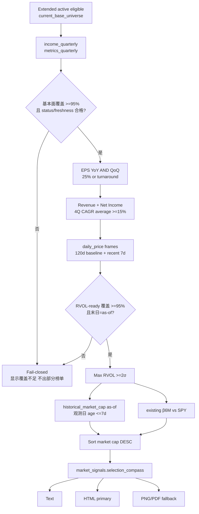

# Selection Compass Morning Report Implementation Plan

> **For Claude:** REQUIRED SUB-SKILL: Use superpowers:test-driven-development and superpowers:executing-plans to implement this plan task-by-task.

**Confidence: 95%**
**不确定点**: 无。Boss 已冻结筛选条件、日报投递、市值排序及 Beta 展示口径。
**北极星对齐**: `docs/design/north-star.md` 第一层 Data Layer（Extended 唯一 base、current fundamentals、daily_price）+ 第二层 Analysis Layer（基本面季频 × 技术面日频）；复用 Extended rollout 的 R3-P1-1 current-base SSOT 与 R9 coverage gate。

**Goal:** 每日从当前 Extended eligible universe 中筛出同时满足 EPS 双增长、四季度复合成长和近 7 日 RVOL 条件的股票，并在次日晨报中按当前市值从高到低展示市值与 β6M。

**Tech Stack:** Python 3.10 / SQLite `market.db` / pandas / pytest / existing morning HTML + PNG/PDF/text delivery pipeline

---

## Frozen Business Rules

1. **Universe**：`current_base_universe()`，即 active `extended_membership ∩ security_master.eligible`；禁止读 legacy Core 或 raw JSON。
2. **EPS 双门槛（AND）**：
   - 最新季度 diluted EPS YoY ≥25%；并且
   - 最新季度 diluted EPS QoQ ≥25%。
   - 当前 EPS 必须 `>0`。
   - 任一比较期 EPS `<=0` 且当前 EPS `>0`，该维度显示“扭亏”并视为通过。
   - 当前仍亏损、只是亏损收窄，不通过。
3. **四季度成长**：`(revenue_cagr_4q + net_income_cagr_4q) / 2 >=15%`。任一 CAGR 不可计算时不通过，不用 0 或旧值代替。
4. **量能**：沿用现有 z-score RVOL，120 个交易日基线；最近 7 个交易日中至少一天 `RVOL >=2.0σ`。
5. **展示**：全量当前命中；列为 `标的 / EPS YoY / EPS QoQ / 营收4Q CAGR / 净利4Q CAGR / 成长均值 / 近7日最高RVOL / 触发日 / 当前市值 / β6M`。
6. **排序**：当前市值降序，同市值按 ticker 排序；任一命中股缺少 fresh 市值时 section fail-closed，不用未知值参与伪排序。
7. **Beta**：复用 `src.indicators.beta.compute_beta`，126 日窗口、相对 SPY；不足 60 个对齐收益样本显示 `—`，不阻断筛选。
8. **Coverage 语义**：分母始终是完整 Extended；`fundamental_ready` 与 `rvol_ready` 分别计算，两个覆盖率均须 ≥95% 才可出榜。任何 `<100%` 的结果必须在 subtitle 明示 `基本面 covered/total | RVOL covered/total`，称为“Extended 扫描覆盖”而不是“全池完整榜单”。任一产品门槛不足时 fail-closed，不输出部分命中。
9. **Freshness**：scanner 接收唯一 `as_of`。`income` 的 coverage status 必须为 `ok`、最新财报日不得早于 as-of 200 天；每个 price frame 的末日必须等于 as-of；市值观测日不得早于 as-of 7 天。过期值计入 not-ready，不能冒充当前值。
10. **空结果**：coverage 健康但零命中时隐藏该 section；coverage 不足时显示 warning。
11. **Selection-ready 原始输入**：每只股票必须同时具备当前季度、上季度、当前向前第 3 季以及同 period/上一 fiscal year 的原始 income 行；相邻季度间隔均不得超过 `FUNDAMENTAL_QUARTER_GAP_MAX_DAYS`；当前/上季/去年同期 diluted EPS 与 CAGR 两端的 revenue/net income 均不得为 NULL。缺行、断档、NULL 均计入 not-ready；真实存在的非正 revenue/net-income 基期仍计为 ready，但按 CAGR 不可计算而业务不通过。

---

## Architecture（架构图）



> 一句话解释：先用全池覆盖闸门保证没有把“缺数据”伪装成“不符合”，然后按基本面→量能顺序缩小候选，最后只给命中股补市值与 Beta 并接入现有晨报三种投递面。

## Business Flow（业务流程图）


> 一句话解释：Boss 明早看到的要么是可信的市值排序命中表，要么是明确的数据闸门提示，不会看到不完整却貌似完整的结果。

## Alternatives Considered（替代方案）

| 方案 | 优势 | 劣势 | 选择理由 |
|---|---|---|---|
| A. 独立纯筛选模块 + 复用晨报已加载 price frames（推荐） | 可单测；不重复下载价格；三投递面共用同一 payload；SQLite 查询开销小 | 新增一个模块和测试文件 | 规则复杂度已超过适合塞进 3000 行 morning_report 的程度，且要严格 TDD |
| B. 全部内嵌 `scripts/morning_report.py` | 文件少、开发快 | 业务规则/IO/渲染耦合，难测；后续周报复用困难 | 不选：短期少一个文件，长期更脆弱 |
| C. 预计算并持久化 daily screen 表 | 历史可追踪、查询最快 | 新 schema、writer ownership、cron 与回填，明显超出“明早日报”范围 | 不选：YAGNI；当前计算量很小 |

## Risks & Mitigation（风险自证）

- **最大风险：数据缺口造成假阴性。** 先完成 Stop D canary→全量 backfill→metrics 重算；运行时分别计算 fundamental/RVOL coverage，任一 `<95%` 时 section fail-closed。95–99.99% 放行时 subtitle 必须显示精确覆盖分数，不宣称 100% 全池完整。
- **EPS 负分母语义歧义。** 使用冻结规则：当前 EPS 必须正；比较期非正只认“扭亏”；仍亏损不认“增长”。分别对 YoY/QoQ 做单测。
- **最新 metrics 与 income 未同步、旧值残留或原始字段断档。** 除 `metrics.date == income.date` 外，income coverage status 必须 `ok` 且财报日距 as-of ≤200 天；EPS 三比较点、CAGR 两端必须非 NULL；前五个财季连续且 YoY 行须严格匹配 `period + fiscal_year-1`。缺行/NULL/断档计入 not-ready；真实非正基期计为 ready 但不通过 CAGR 业务门槛。
- **RVOL 前视、窗口不足或旧价格。** 复用 `calculate_rvol_series`；只使用按日期正序的 127+ 行，取末尾 7 个已完成交易日；frame 末日必须等于统一 as-of，并单列 RVOL-ready coverage。
- **市值/Beta 缺失。** 市值观测值必须携带观测日期且距 as-of ≤7 天；命中股缺 fresh market cap 时 section fail-closed（无法满足排序契约）。Beta 缺失显示 `—`，不伪造 0。
- **Universe resolver 故障。** 选股罗盘独立调用严格 `current_base_universe()`；resolver 异常/空分母直接 unavailable，绝不复用晨报旧信号的 legacy pool fallback。
- **报告三面漂移。** text/HTML/visual exact-column parity 测试；HTML 失败时 PDF/text fallback 仍包含选股罗盘。
- **生产变更风险。** 功能在 `codex/selection-compass` worktree 开发；merge 前全量测试；部署后云端 `--no-telegram` dry-run，再由现有 08:00 cron 真投递。
- **回滚方案。** 代码：revert feature merge；生产数据：backfill 是 current 幂等 + vintage append，必要时恢复明确的 post-hardening pre-backfill SQLite backup；cron 时间和命令不改。

## Acceptance Criteria（验收标准）

- [x] Stop D canary run complete，125 个 dataset jobs 全终态，`fetch_failed <5%`，数据库 `quick_check=ok`。
- [x] Full backfill run complete，独立 `--verify-only` 通过；三表覆盖 ≥95%、profile ≥98%、forward ≥95%，所有缺口有显式 attribution。全项目 Stop F 的 8Q×三表 continuity 另行审计，不作为本罗盘上线 blocker；原因与后续见下方 2026-09-05 evidence amendment 及 issue 056。
- [x] `compute_all_metrics` 完成；命令显式 `assert not failures`，并断言返回结果与 exact current-base 的交集覆盖 ≥95%，任一失败非零退出（933/935 = 99.79%，failures=[]）。
- [x] EPS YoY 与 QoQ 必须同时通过；任一不通过则不命中。
- [x] `negative/zero comparison → positive current` 显示“扭亏”；`negative → less negative` 不命中。
- [x] 四季度成长严格使用两个现有 CAGR 的算术平均且阈值 15%。
- [x] 最近 7 个交易日任一天 RVOL ≥2σ 即通过，并显示窗口最高值与对应日期。
- [x] 输出包含当前市值和 β6M，并严格按市值从高到低。
- [x] fundamental-ready 与 RVOL-ready 都以 exact Extended 为分母、分别 ≥95%；subtitle 显示两个 `covered/total`。任一不足时 warning + hits 为空。
- [x] resolver 异常/空 universe 时 unavailable，绝不回退 Core/raw JSON。
- [x] stale fundamental/status、stale price、stale market cap 均不能进入榜单或冒充当前值。
- [x] raw EPS/CAGR 输入缺失、YoY fiscal-period 不匹配或季度间隔断裂计入 fundamental not-ready；真实存在但非正的 CAGR 基期计入 ready、业务不通过。
- [x] Text、HTML、PNG/PDF 三面列完全一致。
- [x] Targeted tests 全绿；全量测试相对 main 零新增失败（2811 passed / 4 skipped）。
- [x] 云端 Python 3.10 import/compile 通过，真实生产库 HTML dry-run 生成包含选股罗盘的 HTML；真实 PNG 与 PDF render smoke 证明 10 列未被截断且顺序一致。
- [x] `origin/main` 与云端 HEAD 一致，08:00 cron 命令保持原样，2026-09-05 08:01:22 真投递且 wrapper OK；08:03:12 补发成交额缓存更正版（issue057）。

Final evidence: `docs/audit/2026-09-05-selection-compass-rollout.md`。正式报告为10只命中，基本面896/935、RVOL924/935；市值降序、Beta与所有增长/RVOL条件经过原始数据独立核算。

---

## 2026-09-05 Post-backfill Evidence Amendment

本 plan 初版把 Extended 全项目 Stop F 的 `8Q continuity across income/balance/cashflow ≥95%`
同时列为罗盘上线门槛。真实全量 backfill 后证明这属于**过度范围**，不是本功能所需的数据契约：

- Stop D runner gate：PASS（4669 done + 6 attributed fetch_failed，0.128% <5%，header complete）。
- 三表覆盖：933/935 = 99.79%；profile 100%；forward 96.89%；unattributed gaps=0。
- 8Q×三表 continuity：884/935 = 94.55%，差 5 只过全项目 95% 门槛。
- 51 个 miss 主要为半年报 ADR（相邻 fiscal gap ~184 天）、新上市不足 8 季、供应商
  不规则 fiscal rows；TXT/VG 六张表因同 fiscal_date 内容冲突被 vintage PK 防护显式拒绝。
- 选股罗盘真实依赖是**连续 5 季 income 原始字段**（EPS YoY/QoQ + 4Q CAGR 端点），其
  runtime gate 实测 896/935 = 95.83%；RVOL-ready 924/935 = 98.82%。

因此本次不修改全项目 verifier、不放宽 120 天 SSOT，也不把结构性缺口伪装为完整。
罗盘按自己的冻结输入契约与双 coverage subtitle 上线；8Q denominator/结构性
`not_applicable` 的正式建模留在 issue 056，需独立 plan，不能借本功能偷改架构。

---

## Task 0: Production Fundamental Backfill

**Files:** No code changes. Production `data/market.db` only, through the already merged Stop D runner.

- [x] **Step 1:** Production preflight: HEAD, active denominator, disk, writer processes, `quick_check`, zero existing run.
- [x] **Step 2:** Run `canary-2026-09-04` with `--canary 25`.
- [x] **Step 3:** Run `--verify-only` against that exact run id; inspect per-dataset status distribution and provider-empty/fetch-failed lists（125/125 done, zero failures）.
- [x] **Step 4:** If canary passes, start fixed `full-2026-09-04` run under the runner's internal `market_db_writer` flock（PID 252359）.
- [x] **Step 5:** Wait on the exact process/run id; do not restart on observation timeout.
- [x] **Step 6:** After terminal completion, run `--verify-only`, `verify_fundamental_coverage.py --json`, `PRAGMA quick_check`, and inspect DB growth（43.5MiB <50MiB）.
- [x] **Step 7:** Run metrics recomputation under `cron_wrapper` with resource key `market_db_writer`; Python 命令必须 `assert not failures`，并断言 exact current-base metrics coverage ≥95%，否则非零退出。
- [x] **Step 8:** Pull the authoritative DB locally and re-run coverage proof.

## Task 1: Selection Compass Pure Engine — TDD

**Files:**
- Create: `terminal/selection_compass.py`
- Create: `tests/test_selection_compass.py`

- [x] **Loop 1 — EPS RED:** Add `_eps_leg` tests for +25%, below 25%, positive turnaround, zero-to-positive, loss narrowing; run exact test and observe import/missing-function failure.
- [x] **Loop 1 — EPS GREEN:** Implement only `_eps_leg`; rerun exact tests to green.
- [x] **Loop 2 — AND RED:** Add fixture proving YoY and QoQ are AND; run and observe failure.
- [x] **Loop 2 — AND GREEN:** Implement only EPS-pair evaluation; rerun green.
- [x] **Loop 3 — CAGR RED/GREEN:** Add exact arithmetic-average, threshold boundary and missing-CAGR tests; implement only CAGR predicate; rerun green.
- [x] **Loop 4 — RVOL RED/GREEN:** Add any-day recent-7 max/date and insufficient/stale-frame tests; implement with existing `calculate_rvol_series`; rerun green.
- [x] **Loop 5 — Raw readiness RED/GREEN:** Add tests for current/prior/YoY EPS NULL, missing YoY period+prior-FY row, missing CAGR endpoint, and >`FUNDAMENTAL_QUARTER_GAP_MAX_DAYS` quarter gap → fundamental not-ready. Add the contrasting case where all raw values exist but net-income base `<=0` → ready yet CAGR business predicate fails. Implement raw-input readiness only; rerun green.
- [x] **Loop 6 — Coverage RED/GREEN:** Add exact Extended denominator, income status, stale fundamental, metrics-date mismatch, separate fundamental/RVOL readiness and `<95%` fail-closed tests; implement coverage payload; rerun green.
- [x] **Loop 7 — Market Cap RED/GREEN:** Add as-of observation-date freshness, missing hit cap fail-closed, market-cap DESC/tie-break tests; implement sorting; rerun green.
- [x] **Step 7:** Run full `tests/test_selection_compass.py`; expect all pass.
- [x] **Step 8:** Commit exact files with `feat(morning): add selection compass screen engine`.

Core contract:

```python
def scan_selection_compass(
    *, store, symbols: list[str], as_of: str, price_frames: dict,
    market_cap_observations: dict[str, dict],
    min_fundamental_coverage: float = 0.95,
    min_rvol_coverage: float = 0.95,
) -> dict:
    """Return available/reason/coverage/hits; never mutate store or frames."""
```

Each hit must contain:

```python
{
    "symbol": "AVGO",
    "eps_yoy_growth": 0.854,
    "eps_yoy_turnaround": False,
    "eps_qoq_growth": 0.273,
    "eps_qoq_turnaround": False,
    "revenue_cagr_4q": 0.116,
    "net_income_cagr_4q": 0.310,
    "growth_avg_4q": 0.213,
    "rvol_max_7d": 3.91,
    "rvol_trigger_date": "2026-09-03",
    "marketCap": 1_000_000_000_000,
}
```

## Task 2: Morning Report Wiring — TDD

**Files:**
- Modify: `scripts/morning_report.py`
- Modify: `tests/test_morning_report.py`

- [x] **Loop 1 — Strict universe RED/GREEN:** Test resolver success passes exact active symbols; resolver error/empty returns unavailable and never passes fallback `pool_symbols`; implement strict branch; rerun green.
- [x] **Loop 2 — as-of inputs RED/GREEN:** Test existing price frames plus one price-derived as-of and dated market-cap observations reach scanner; implement minimal wiring; rerun green.
- [x] **Loop 3 — Beta RED/GREEN:** Test Beta is computed only for compass hits and injected; implement reuse of `_compute_signal_betas`; rerun green.
- [x] **Loop 4 — Payload RED/GREEN:** Test result lands at `market_signals["selection_compass"]` without changing PMARP/volume outputs; implement return field; rerun green.
- [x] **Step 5:** Run builder-related morning tests; expect pass.
- [x] **Step 6:** Commit exact files with `feat(morning): wire selection compass into daily scan`.

## Task 3: Text / HTML / Visual Rendering — TDD

**Files:**
- Modify: `scripts/morning_report.py`
- Modify: `tests/test_morning_report.py`

- [x] **Loop 1 — Text RED/GREEN:** Add percent/turnaround/cap/Beta/RVOL/date/order/coverage-subtitle tests; implement text formatter; rerun green.
- [x] **Loop 2 — HTML RED/GREEN:** Add exact heading/columns/rows/order test; implement HTML block after 0b; rerun green.
- [x] **Loop 3 — Visual RED/GREEN:** Add exact 10-column widths/cells/order test; implement visual section before PMARP; rerun green.
- [x] **Loop 4 — Visibility RED/GREEN:** Add healthy-no-hit hidden and unhealthy-coverage warning tests across surfaces; implement visibility helper shared by all surfaces; rerun green.
- [x] **Step 5:** Run all morning report tests.
- [x] **Step 6:** Commit exact files with `feat(morning): render selection compass across delivery surfaces`.

Exact columns:

```python
[
    "标的", "EPS YoY", "EPS QoQ", "营收4Q CAGR", "净利4Q CAGR",
    "成长均值", "近7日最高RVOL", "触发日", "当前市值", "β6M",
]
```

## Task 4: Integration and Quality Gates

**Files:**
- Modify: this plan checklist only if implementation details remain aligned.

- [x] **Step 1:** Run `pytest tests/test_selection_compass.py tests/test_morning_report.py -q`.
- [x] **Step 2:** Run full `pytest tests/ -q`; compare exact failures with baseline main（2811 passed / 4 skipped）.
- [x] **Step 3:** Run local real-DB dry build; assert denominator/coverage/hits and descending market caps（11 hits；AVGO→GNRC）.
- [x] **Step 4:** Run HTML compile and inspect generated file contains heading and exact columns.
- [x] **Step 5:** Run real PNG render and PDF composition; inspect title, 10 columns, no zip truncation, market-cap row order. Force HTML send failure and prove produced fallback PDF includes the same section.
- [x] **Step 6:** Plan/spec compliance review, code-quality review, QA evidence review; fix findings with RED→GREEN tests.

## Task 5: Merge, Deploy and Tomorrow-Morning Verification

**Files:** No additional feature files unless deployment reveals a real defect.

- [x] **Step 1:** Show commit list and diff; verify only scoped files changed.
- [x] **Step 2:** Merge approved autonomous branch to `main`, push `origin/main` (Boss pre-authorized by “直接进入明天日报”).
- [x] **Step 3:** Cloud `git pull --ff-only`; Python 3.10 compile/import and targeted tests.
- [x] **Step 4:** Cloud production DB `--no-telegram --image-report --image-delivery html` dry-run; inspect HTML heading/rows/order/dual coverage. Separately render PNG/PDF and inspect 10-column table.
- [x] **Step 5:** Verify existing 08:00 cron still invokes HTML morning report and no schedule/resource collision exists.
- [x] **Step 6:** Wait on the exact 08:00 cron/log next morning; verify exit 0 and Telegram delivery path success.
- [x] **Step 7:** Update audit/ongoing/session digest and close execution state only after the real scheduled delivery is proven.
