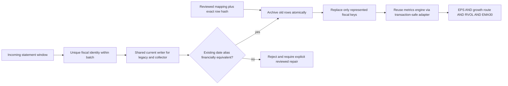
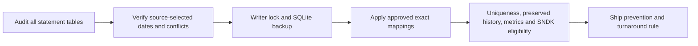

# Fiscal-quarter repair and turnaround growth plan

Authorization: Boss explicitly requested repairing SNDK, checking other affected stocks, and adding a four-quarter turnaround growth route. Continue the existing worktree/TDD/deployment workflow.

North Star: Data Desk current statements and archival provenance; Analysis Layer compass filtering. Vintage history remains append-only. No reclassification of securities, GAAP basis change or relaxation of EPS/RVOL/EMA gates.

## Evidence

- Three raw statement tables contain 27 duplicate fiscal-key groups across nine symbols; metrics contains 12 corresponding groups. Active Extended members affected: GSK, HD, LITE, MDT, SNDK, WDC. PSTG/STRC/STRF are outside current base.
- Root cause: current table PK (symbol,date) does not replace an old calendar-end date when a new fetch supplies the actual fiscal date. Latest FMP re-fetch confirms single fiscal dates for the active cases.
- Not all duplicate payloads are financially equal: SNDK income, old LITE cash flow and WDC balance sheet contain differences. Never pick the larger date or discard conflicting rows without a reviewed mapping.
- SNDK current provider selects 2024-12-27, 2025-03-28, 2025-06-27, 2025-10-03. Earlier dated aliases coexist and pollute row-based metrics/sequence validation.
- BE revenue over the four quarters is 519.048, 777.683, 751.054, 1065.365 million, while net income strictly rises. Boss confirmed on 2026-09-05: “只要求四季整体上升” — compare the first and last quarters, allowing interior declines.

## Architecture and flow

## Decisions

1. Add a small append-only current-row archive table. It is separate from fundamental_vintage: legacy current rows cannot be invented as historically observed vintages. Old metrics are derived and recomputable, but archive their before values during repair as well.
2. Shared statement writer handles both `_bulk_upsert` and collector `_in_conn` entry points. Only the three quarterly statements are affected; other tables retain existing semantics.
3. Auto-normalization is restricted to a single incoming fiscal key/date with equal persisted financial content (excluding date/filing metadata; retain currency/identity checks). Conflicting dates/content require reviewed repair. Unknown fiscal keys cannot authorize deleting anything.
4. Manual repair requires exact symbol/table/FY/quarter/keep-date plus hash of all before rows; verify every mapping before any mutation. Archive removed rows, preserve unrelated quarters and vintage, and recompute full-history metrics atomically using an adapter around existing compute_metrics; avoid nested `with conn` commits.
5. Initial live repair covers SNDK and verified benign active aliases. Conflicting WDC dates/values are investigated and reported, not blindly merged. Retired/noncommon tickers remain outside current-base repair unless evidence supports expansion.
6. A new growth decision returns route and pass status. A turnaround means a positive net-income quarter preceded by a nonpositive quarter, consistent with the existing EPS convention. Check each of the last four distinct quarters, including the oldest target quarter against the fifth comparison quarter. If present, require latest net income >0 and latest revenue and net income each strictly above the oldest of the four target quarters; intermediate declines are allowed, and no CAGR threshold applies. Without turnaround, retain mean revenue/net-income CAGR >=15%. Do not fall back to CAGR when a turnaround route fails its endpoint test. Missing net income in any of the five quarters remains not-ready; existing revenue endpoint validation remains unchanged.
7. Display qualifying turnaround rows as `扭亏成长` in the existing growth-summary cell; undefined net-income CAGR stays `—`. No numeric invented CAGR.

Alternatives: changing the PK destructively or merely dropping duplicate rows in the screen both hide source/history problems. A complete data rebuild wastes API calls and loses older quarters. Scoped archive + fiscal-aware current writes and explicit repairs are reversible and reusable.

## TDD and acceptance checklist

- [x] RED/GREEN shared writer: equivalent aliases collapse, incoming conflicting fiscal keys reject, financial conflicts reject, other tables/symbols/older quarters remain intact, legacy and collector paths both covered.
- [x] RED/GREEN repair: exact-hash mapping, idempotence, archive counts, current/metrics/vintage rollback on injected failure, full-history metrics recomputation and old-date removal.
- [x] Resolve the turnaround continuity clarification: overall first-to-last growth, not monotonic QoQ growth.
- [x] RED/GREEN branch routing, transition within four quarters, no-turnaround CAGR fallback, missing inputs and rendering label. 13 expected RED failures; final targeted suite 233 passed / 1 skipped. Extra positive-start/end decline case also covered.
- [x] Verify real BE and updated full/no-RVOL screens; deploy the rule and update task records. Merge `3b68433`, cloud43 targeted tests passed; read-only production screen and shared display verified at 10:20 CST.
- [x] Run relevant store/collector/metrics/compass/report suites and Python 3.10 syntax checks; broaden to full suite for shared writer change.
- [x] Live backup under market_db_writer; freeze before rows, apply reviewed repair map; independently verify SNDK financial periods, counts and metrics; repeat full-pool alias scan.
- [x] Merge/push/deploy data repair and read-only production screen/render verification. Do not recollect Dollar Volume or send another group report during smoke tests. The clarified turnaround rule was separately deployed in `3b68433`.
- [x] Report repaired scope, unresolved stock conflicts, updated screening counts, artifacts and canonical task records.

Data repair completed: merge `8895121`, 17 current source aliases removed/archived, 60 metrics rows rebuilt, 85 archive rows retained, current-base duplicate fiscal identities zero. SNDK is now in the normal six-hit compass. Post-repair no-RVOL counts are 79 fundamental passes and 54 fundamental+EMA30 passes. See `docs/audit/2026-09-05-fiscal-alias-audit.md` for source verification, backup, idempotence and tests.

The BE growth-policy clarification is implemented and deployed. EPS, RVOL, EMA30 and beta conventions remain unchanged. No-RVOL fundamental+EMA hits increased 54→69; BE passes this list but still fails the full screen's RVOL gate. Full production compass remains six stocks.
