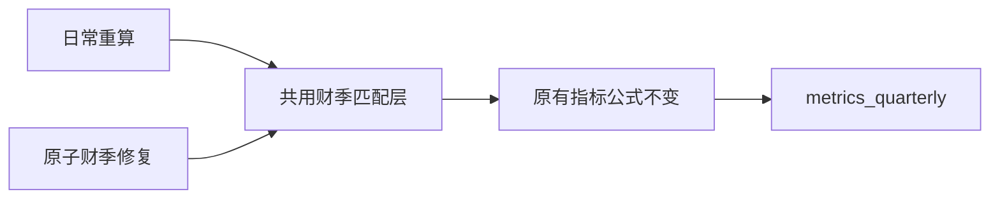

# Fiscal Metrics Alignment Implementation Plan

**Confidence: 95%**
**不确定点**: 无业务口径变更；Boss 已针对 review 中“按经过验证的财年＋季度对齐并补测试”的修复方案回复“修”。
**Goal:** 财季日期别名修正后，同一财季的跨表指标不丢失，日常重算也不复发。
**Tech Stack:** Python / SQLite / pytest。
**北极星对齐**: `docs/design/north-star.md` 第一层数据层（基本面标准化、存储、验证）；不新增子系统或修改筛选公式。

## Research and scope

`compute_metrics()` 使用收入日期直接查资产负债表/现金流表；修复器通过 `MetricsInputs` 调用同一函数。已在临时库复现：仅收入日期 09-30→10-03，负债率25%、FCF利润率15%、ROA20%被重算为空，原始跨表数据仍在。同一缺陷也影响普通周更。上轮402 tests passed/1 skipped 未覆盖跨表日期差异。当前 worktree/main 均为4971734，工作树干净。

## Architecture

## Business flow

## Alternatives

| 方案 | 优点 | 问题 |
|---|---|---|
| 共用指标层按财季匹配（采用） | 修复器和周更共用，公式不动，不写原始日期 | 需检查歧义和冲突 |
| 只改修复器输入日期 | 改动局部 | 下次普通重算仍会清空，不能根治 |
| 改写三表原始日期 | 可继续按日期JOIN | 破坏来源日期，扩大生产数据修复范围，不采用 |

## Matching contract and risks

- 复用 `fiscal_repair._fiscal_key`，不再写一份财年/季度解析器。
- 按完整 FY/Q 的唯一候选匹配。按收入行的日期建立**内存查询索引**，不修改源行日期；现有 TTM 期初资产查询自动共用该索引。
- 无完整财季标识时只保留原有同日精确匹配，不猜测异日所属季度。
- 候选财季重复、同日完整财季身份冲突、已知币种冲突、或异日候选超过既有最大季度间隔时抛异常；写指标前验证，防止错误匹配被持久化。真正没有报表仍保持缺失值。
- 最大风险是把另一季度配进公式，故不采用最近日期匹配或任意第一条候选。
- 回滚：仅代码回退；开发/验证只写临时数据库，原始生产报表和既有财季归档不修改。
- 本次先完成 worktree 修复及验证；合并、部署和生产指标重算仍单独确认。

## Acceptance / TDD checklist

- [x] `tests/test_metrics_calculator.py`: 异日同财季下全部指标等价（覆盖当前资产及TTM期初）；缺标识只同日；冲突/歧义失败且既有metrics不变。
- [x] `tests/test_fiscal_repair.py`: legacy/collector/manual 修复一张表的日期后指标保留；常规再次重算不复发；原始其他表日期和归档不受影响。
- [x] 在实现前确认上述用例 RED：15 failed/2原有兼容行为passed，修复后108/108通过。
- [x] `src/data/metrics_calculator.py`: 新增共用匹配索引，替换两个按date索引构建点；不改指标公式或罗盘。
- [x] 相关套件419 passed/1 skipped，Python3.10语法通过；只读当前池934只、每只最多20季，在内存捕获重算结果，21只/61行跨表指标变化、0匹配冲突、收入派生筛选指标全部不变。SNDK/MDT样本见issue060。
- [x] 全量tests回归：2903 passed/4 skipped（235.62s），无失败。
- [x] 额外按修复器的不限历史长度读取当前池934只，共7711行指标在内存重算，0异常、无生产写入。
- [x] 记录issue与结果，精确文件commit；交付待合并分支。

## Handoff

Boss已批准合并推送部署。修复98fbf41通过merge `c674f44` 进入main，GitHub与云端均已同步，云端181项测试及Python语法检查通过。云端只读罗盘仍为6只、beta均存在，SNDK/MDT预览恢复值与本地一致。

- 合并后主目录相关测试419 passed，但多启用的可选成交集中度live-DB/旧CSV对拍失败；合并前4971734计算代码和相同数据复现完全相同差异（47.821734685 vs47.803916922），非本次回归。见issue061；隔离worktree全量2903 passed/4 skipped仍成立。
- **生产指标补算尚未执行**：10:46写锁探测失败，10:47确认10:45启动的`finance_forward`/`run_forward_data.sh`持有同一`market_db_writer`资源锁。未绕锁、未终止定时任务、未写生产报表/指标。代码部署已完成，数据补算需要在锁释放后恢复执行；尚未安排后台重算或自动跟进。
- 恢复步骤：重新读取云端实际差异 → writer lock → SQLite一致性备份 → 现有归档事务重算受影响指标 → 核查原始三表/vintage不变、筛选结果不变 → 记录备份和归档数量。避免直接rsync热库拉取本地（issue059）。
