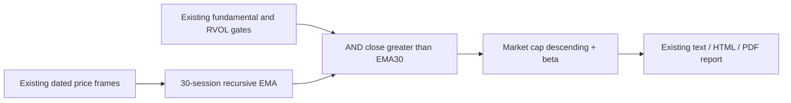
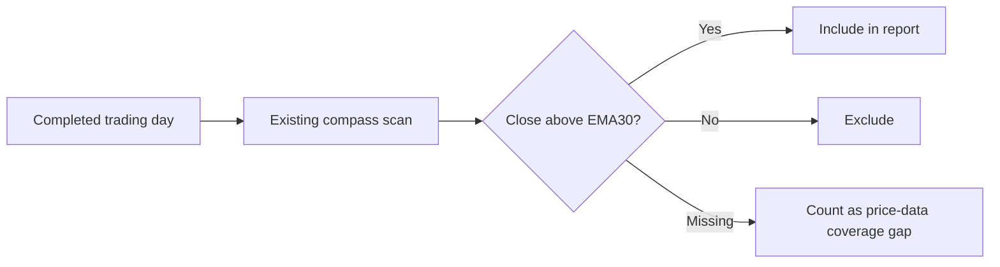

# Selection Compass EMA30 Increment Implementation Plan

**Confidence: 98%**
**Goal:** Keep all existing compass conditions and add the strict daily-close > EMA30 condition. Separately answer the one-date what-if question about removing RVOL.
**Authorization:** Boss accepted the deployed report and explicitly requested this additional condition; continue the authorized TDD/deployment workflow.
**North Star:** Existing Data/Analysis layers, exact Extended eligible universe, read-only morning screen. No universe, data-collection or architecture changes.

## Architecture

## Business flow

## Decisions and alternatives

- Use pandas `ewm(span=30, adjust=False, min_periods=30)` on chronologically sorted, positive finite closes. This follows existing `src/indicators/pmarp.py` EMA conventions and reuses the already loaded price frames (180 rows normally, at least 127 for RVOL-ready IPO supplements). At least 30 dated closes are needed; last date must equal the report as-of. Duplicate dates or invalid close data are unavailable, not below-EMA classifications.
- Alternative: fetch full history or add a persistent EMA table. Rejected because this small condition is directly computable from existing sufficiently warmed price frames and does not need a writer or another cron.
- Alternative: filter the finished report only. Rejected because all delivery formats and stored scan evidence should reflect the same predicate.
- Strict `>`: equality fails. The latest close is included in EMA30. Add raw close/EMA values to hit evidence, keep the existing ten display columns, and append the condition to the shared subtitle.
- EMA data readiness gets its own exact-universe coverage count and 95% availability gate; existing fundamental/RVOL gates stay unchanged. Display the extra coverage only when the new field exists so replaying old saved reports remains truthful.
- Removing RVOL is a one-off comparison only. No production flag or threshold change is introduced.

## Risks and verification

- A prior session can be above EMA30 while the current close falls below it: use the current as-of bar, not any-day logic.
- Missing/invalid prices cannot pass as a normal miss. Test missing close, NaN/inf/nonpositive close, insufficient rows, duplicate dates and stale/future end dates.
- Old price fixtures had volume only; update them to realistic valid increasing closes while preserving all volume values and RVOL assertions.
- Rollback is a scoped revert of this feature commit. No production data writes during verification; render saved scan payloads/cached DV only (issue 057).

## TDD checklist

- [x] Read existing EMA, screen, loader and render paths; dedicated worktree and baseline suite.
- [ ] RED/GREEN 1: strict EMA predicate tests with an independent recursive calculation, above/equal/below cases and invalid dates/prices; implement minimal helper.
- [ ] RED/GREEN 2: scanner AND filter and coverage failure test; add helper result to scan with close/EMA evidence on hits.
- [ ] RED/GREEN 3: shared subtitle/Chinese warning tests across text/HTML/visual; expose rule and readiness while retaining ten columns.
- [ ] Run screen/morning/beta/broad-loader relevant tests plus Python 3.10 grammar check; inspect final scoped diff.
- [ ] Read-only production replay for 2026-09-04: reproduce 78 fundamentals-only, 53 fundamentals+EMA, 10 old compass, 5 new compass; verify caps ordering and EMA values independently.
- [ ] Commit, merge, push, deploy; cloud targeted tests and read-only scanner/render smoke. No extra Telegram send required.
- [ ] Save numerical comparison, completion evidence, session digest and task records.

## Initial read-only comparison

As-of 2026-09-04, 935 eligible Extended members, 896 fundamental-ready. Existing fundamental criteria alone admit 78; 53 also close above EMA30. The 08:00 report has ten RVOL-qualified hits; five also close above EMA30. All 78 have enough current close history for the EMA check.
