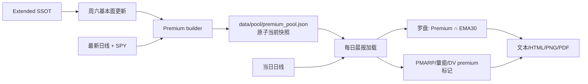
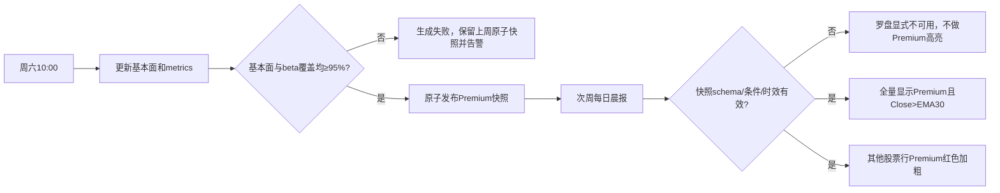

# Premium Pool and Morning Report Integration Plan

> **For Claude:** Implement task-by-task with TDD in the existing dedicated worktree after Boss approves this plan.

**Confidence: 98%**
**不确定点**: Telegram Markdown不支持字体颜色；文本晨报采用`🔴`＋粗体，HTML与PNG/PDF使用真正红色粗体。用户已纠正“周报”为“晨报”，其余规则无歧义。
**Goal:** 每周从Extended生成“精选Premium池”，晨报罗盘展示其中位于EMA30上的全部标的，并在晨报其他股票区块红色加粗Premium成员。
**Tech Stack:** Python、pandas、原子JSON、Bash cron wrapper、pytest、Pillow/HTML renderer。
**北极星对齐:** `docs/design/north-star.md` 第一层数据层的派生数据资产 + 分析层晨报；Premium是显式派生overlay，不改变唯一Extended base universe。

**已批准业务规则（SSOT）**

1. Premium池周频成员条件：最新GAAP diluted EPS YoY≥20%且QoQ≥20%（既有扭亏语义保留）；非扭亏路线的营收/净利润四季CAGR算术均值≥10%，既有“最近四季发生扭亏且首尾营收/净利润均上升”路线免CAGR；β6M（相对SPY）≥1.35。
2. Premium池不含RVOL与EMA30；两者不是基本面池成员条件。
3. 晨报“选股罗盘”=本周Premium成员∩当日日线收盘价>EMA30，全量展示，按当前市值降序；不再要求RVOL。
4. 晨报其他股票区块（PMARP、量能异常、Dollar Volume新面孔与排名）不改变原筛选/排序；命中Premium的股票仅在视觉上红色加粗。

---

## Architecture（架构图）



> 周六只生成一次池；晨报运行时不重新解释基本面，只消费已发布快照并做EMA30与视觉融合。

## Business Flow（业务流程图）



> “池成员”周频稳定；“是否出现在罗盘”随每日EMA30变化。

## Storage contract

派生池使用 `data/pool/premium_pool.json`，不是新的数据库SSOT：

```json
{
  "schema_version": 1,
  "name": "精选Premium池",
  "as_of": "YYYY-MM-DD",
  "generated_at": "UTC timestamp",
  "criteria": {"eps_yoy": 0.20, "eps_qoq": 0.20, "growth_avg_4q": 0.10, "beta_6m": 1.35},
  "universe": {"name": "extended", "count": 934, "symbols_sha256": "..."},
  "coverage": {"fundamental_ready": {...}, "beta_ready": {...}},
  "members": [{"symbol": "...", "beta_6m": 1.35, "eps_yoy_growth": 0.2, "...": "..."}]
}
```

- 临时文件完整写入、flush/fsync、读回验证后`os.replace`；失败不破坏上周快照。
- loader要求schema、名称、条件常量、symbol唯一、成员逐行重验beta和必需字段；生成时间最多8天，允许周六08:00晨报消费上周六快照，漏跑一周后fail-closed。
- 每日晨报保存的JSON继续携带本次Premium元数据与成员，提供实际使用证据；不为当前需求另建历史数据库表。

## Morning report rendering contract

- 罗盘列改为：标的、EPS YoY、EPS QoQ、营收4Q CAGR、净利4Q CAGR、成长均值、收盘、EMA30、当前市值、β6M。去掉“近7日最高RVOL/触发日”，避免暗示RVOL仍是门槛。
- 文字：Premium股票显示为`🔴 *TICKER 公司名*`；其他行逐字保持正常。
- HTML：row metadata `_premium=true`，CSS只让第一列红色粗体；不允许注入未转义HTML。
- PNG/PDF：row metadata `premium=true`，只对第一格使用红色粗体；现有alert红底整行语义不复用、不改变。
- 覆盖区块：PMARP、量能异常、Dollar Volume（新面孔和Top排名）。罗盘本身全是Premium，无需逐行重复红色。

## Alternatives Considered（替代方案）

| 方案 | 优势 | 劣势 | 选择理由 |
|---|---|---|---|
| 周频原子JSON + 日报消费（采用） | 符合现有pool资产；零DB migration；零成员时也能明确发布；可快速回滚 | 不提供独立长期SQL历史 | 每日晨报JSON已有使用历史，当前需求不需要回测membership |
| 两张SQLite snapshot/run表 | PIT历史与查询强 | schema、writer与回填复杂度高 | 当前仅需周频当前池，过度工程化 |
| 每日晨报现场重算Premium | 代码路径短 | 池每天漂移，不符合“每周更新”；报告时基本面异常会改成员 | 不采用 |
| 用Markdown/HTML字符串直接加颜色 | 改动少 | HTML会转义；文本无法真正红色；跨表面不一致 | 不采用 |

## Risks & Mitigation（风险自证）

- **最大风险—池更新时序错误:** Premium必须在周六基本面成功提交后生成。新增`run_weekly_fundamentals.sh`串行执行`run_update_data.sh --fundamental`→builder；cron继续由外层`market_db_writer`锁保护。
- **快照静默陈旧:** loader按`generated_at`和criteria fail-closed；晨报给中文原因，不退回现场重算。
- **首次上线无池:** 部署后在同一云端代码版本手工bootstrap一次，先只读预览再原子发布；下周开始自然cron。
- **高亮污染业务排序:** 只添加metadata，不调整原PMARP/量能/DV筛选与排序。
- **文本颜色限制:** Telegram用红色圆点作为颜色语义并粗体；HTML/图片严格红色粗体。
- **JSON/DB一致性:** builder在外层writer lock内、基本面任务之后运行；完整构建后一次发布。失败保留旧文件。
- **为什么不用更简单的每日重算:** 会违背周频池的稳定身份，并让同一周的高亮集合日间漂移。
- **回滚:** 恢复原cron命令、回退feature merge；归档或忽略Premium JSON。无原始DB数据变更。

## Acceptance Criteria（验收标准）

- [ ] 周频快照成员仅由20%/20%/10%或扭亏/β≥1.35构成；不读取RVOL或EMA决定membership。
- [ ] 周频覆盖不足、成员校验失败或写盘异常均保留旧快照；不会发布部分池。
- [ ] 晨报罗盘只显示有效快照中Close>EMA30的全部成员；常量成交量股票仍可出现，证明RVOL已退出。
- [ ] 罗盘表不再展示RVOL列，显示Close与EMA30，仍按最新有效市值降序。
- [ ] PMARP、量能异常、DV的新面孔/排名中，Premium行在文本、HTML、PNG/PDF按约定高亮；普通行样式和内容不变。
- [ ] 快照缺失、陈旧、criteria不匹配时罗盘显式告警，其他晨报区块正常生成且不误标Premium。
- [ ] 周六cron备份、diff、部署后bootstrap、Python3.10、bash语法、目标/全量测试与无Telegram dry run均通过。

---

## Implementation checklist

### Task 1 — Freeze current threshold branch

**Files:** existing `terminal/selection_compass.py`, `scripts/morning_report.py`, tests, threshold plan.

- [x] 保留提交`7d1f883`+`a6b0f76`为业务计算基线；测试20%/10%/1.35含边界。
- [x] 把“Premium membership计算”从当前RVOL/EMA scanner拆为纯函数，先RED再GREEN。

### Task 2 — Atomic Premium artifact

**Files:** create `src/data/premium_pool.py`, `scripts/build_premium_pool.py`, `tests/test_premium_pool.py`.

- [x] RED：schema、criteria、唯一性、覆盖、8日时效、zero-member、写入故障保旧文件。
- [x] GREEN：build/validate/load/atomic publish；CLI `--dry-run`绝不写盘，默认发布。

### Task 3 — Weekly schedule

**Files:** create `scripts/run_weekly_fundamentals.sh`; modify `ARCHITECTURE.md`; test shell behavior.

- [x] fundamental失败不运行builder；builder失败job非零；成功严格串行。
- [x] 本地`bash -n`、可执行位、Python3.10 AST。
- [ ] 部署阶段安全导出crontab备份，只改10:00行命令，写回后逐行验证；不使用管道直写。

### Task 4 — Compass becomes Premium × EMA30

**Files:** modify `terminal/selection_compass.py`, `scripts/morning_report.py`, `tests/test_selection_compass.py`, `tests/test_morning_report.py`.

- [x] loader结果是唯一生产membership输入；公开scanner不调用财报/beta/RVOL（旧端到端逻辑仅保留私有回归helper）。
- [x] EMA30覆盖以Premium成员为分母；市值缺失仍fail-closed；表格换Close/EMA30。
- [x] 真实9月4日回放：Premium56只、EMA30 ready56/56、罗盘26只，按市值降序；常量成交量不参与。

### Task 5 — Shared Premium emphasis

**Files:** modify `scripts/morning_report.py`, `terminal/morning_html_report.py`, relevant tests.

- [x] PMARP/量能/DV数据只加`is_premium`，原排序/筛选保持；相关全套测试通过。
- [x] 文本`🔴`+粗体；HTML第一格红色粗体并保持escaping；视觉第一格红色粗体、其他格正常。
- [x] Premium缺失/陈旧时所有行保持普通样式。

### Task 6 — Verification and rollout stops

- [x] Targeted273 passed/1 skipped；full2938 passed/4 skipped；`git diff --check`、Python3.10 AST、`bash -n`通过。
- [x] 主线程单遍review：修复损坏快照未重验EPS/成长/覆盖，以及日报异常把周频覆盖错误归零；补RED后全绿。未留Critical/Important。
- [ ] **Stop A:** Boss批准merge/push。
- [ ] **Stop B:** Boss批准云端部署、crontab一行替换与bootstrap发布。
- [ ] 云端目标测试；`--dry-run`对比；发布后晨报`--no-telegram`验证文本/HTML/PNG，不采集或覆写DV缓存，不真发群。

## Local Friday preview evidence

- 临时原子快照 `/tmp/finance-premium-pool-20260904.json`：as_of 2026-09-04，Extended934，基本面ready890，beta ready923，Premium56。
- 罗盘26只：TSM/MU/PLTR/DELL/SNDK/STX/ING/CVNA/BE/ALAB/UMC/SYM/ROKU/SMCI/TPG/PKX/ZBRA/MGA/JHX/SITM/SKM/IVZ/SWK/EMBJ/SMTC/TEM。
- 周五量能异常中Premium：DELL/HPE/MDB/NVT/JHX；PNG目视确认仅第一格红色粗体，普通行不变；HTML对应`premium-row`并保持escape。该本地预览未带Dollar Volume（本地DV库停在3月），最终部署后从云端只读9月4日DV库生成完整版。
- 预览文件：`reports/rendered/premium-preview-20260904/morning_report_2026-09-04.{html,pdf}`，以及5张section PNG。未发送Telegram、未调用DV采集器。

## Current worktree

- Path: `.worktrees/selection-compass-thresholds-beta`
- Branch: `codex/selection-compass-thresholds-beta`
- Commits: `7d1f883` (20%/10%/beta gate wiring), `a6b0f76` (final beta1.35 annotation)
- Baseline: relevant242 passed/1 skipped; full2912 passed/4 skipped; latest verified data2026-09-04.
