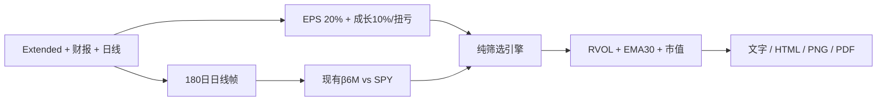
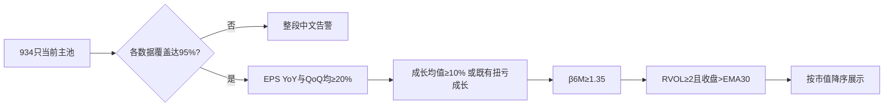

# Selection Compass Thresholds and Beta Gate Implementation Plan

> **For Claude:** Implement task-by-task with TDD in the dedicated worktree.

**Confidence: 97%**
**不确定点**: 无。Boss明确要求EPS YoY/QoQ门槛20%、四季成长门槛10%，并在批注循环中把β门槛从1.00改为1.35。
**Goal:** 调整选股罗盘基本面阈值，并将现有相对SPY的β6M升级为正式硬门槛。
**Tech Stack:** Python、pandas、SQLite、pytest。
**北极星对齐:** `docs/design/north-star.md` 分析层/晨报选股罗盘；复用数据层daily_price和现有beta实现，不增加数据源。

---

## Architecture（架构图）

> beta由晨报编排层批量计算一次，作为显式输入进入纯筛选引擎；所有报告面共享同一命中结果。

## Business Flow（业务流程图）

> beta缺失不能冒充低beta或通过；系统性覆盖不足时不展示不完整榜单。

## Alternatives Considered（替代方案）

| 方案 | 优势 | 劣势 | 选择理由 |
|---|---|---|---|
| 批量算beta后传入纯引擎（采用） | 复用现有实现；scanner本身完整可测；所有报告一致 | 比只给命中股算beta多做约934次轻量回归 | 数据已在内存，成本低，完整性最好 |
| 晨报拿到旧命中后再过滤 | 改动最少 | 直接调用scanner会漏beta门槛；覆盖语义分叉 | 不采用 |
| scanner内部自行加载SPY | 调用参数少 | 纯规则层产生DB I/O且难测试 | 不采用 |

## Risks & Mitigation（风险自证）

- **最大风险:** beta加载失败后静默得到零命中。增加`beta_ready`覆盖率与中文失败原因；低于95%整段fail-closed。
- **阈值边界:** 20%、10%、β=1均使用`>=`；分别锁定刚好等于与略低测试。
- **重复计算:** 删除原“命中后再算beta”路径，确保每次报告只算一轮且展示值就是门控值。
- **兼容旧报告:** 只有payload含`beta_ready`时subtitle才追加新规则；历史保存报告不被错误重标。
- **回滚方案:** 回退单一feature merge；无schema、数据库或原始数据写入。

## Acceptance Criteria（验收标准）

- [x] EPS YoY和QoQ均以20%为含边界门槛；任一不足仍失败。
- [x] 非扭亏成长均值以10%为含边界门槛；扭亏成长口径不变。
- [x] beta恰为1.35通过，1.349不通过；缺失beta按不通过，整体覆盖低于95%给中文告警。
- [x] 报告subtitle明确显示β覆盖和`β6M ≥ 1.35`；表内beta与用于门控的值一致。
- [x] RVOL、EMA30、市值排序、GAAP口径及扭亏路线不变。
- [x] 同一生产快照独立重算新命中，并解释相对旧规则的增减。

---

## TDD checklist

- [x] RED：39个engine失败 + 8个wiring/render失败，覆盖阈值边界、beta边界/缺失/覆盖、编排只算一次、三种报告面语义。
- [x] GREEN：常量化20%/10%/1.35/95%，scanner接收beta观测并门控。
- [x] GREEN：morning_report对完整罗盘池批量计算beta并传入，删除后置补beta。
- [x] 回归：相关242 passed/1 skipped；全量2912 passed/4 skipped；Python3.10语法通过。
- [x] 真实只读回放最终批注：9月4日934只，beta923/934；基本面152只、加β≥1.35后56只；完整命中DELL/SNDK/JHX，三种报告面语义一致。β门槛1.00时的77只/五命中仅为被本批注取代的中间结果。
- [x] 精确文件commit，交Boss确认后再merge/push/deploy。
- [ ] 精确文件commit，交Boss确认后再merge/push/deploy。
