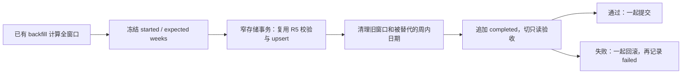
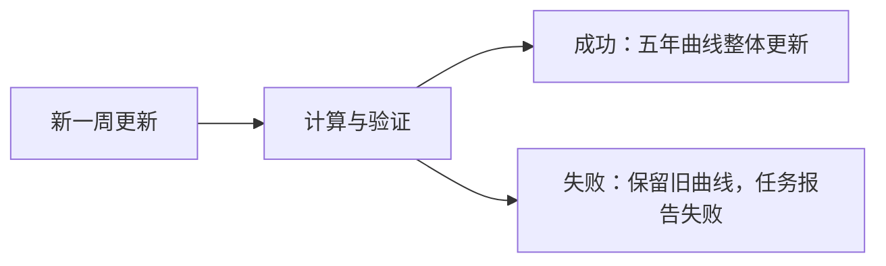

# 三指数 PE C1 续做记录

**Confidence: 90%**。沿用已批准的 `2026-07-19-index-pe-morning-chart.md` §3.3 整窗重写方案；2026-09-11 Boss 指令“继续做后续”解除 C1 停点。本文件是执行细化，不改变估值方法或覆盖门。

**北极星对齐**：Data 层的持久化完整性 → Analysis 层可验收估值；后续 Task 5–9 按主计划推进，生产调用预算与部署在产物可审核后单独确认。

## 组件和流程

选择整窗事务替换：保留简单的 run_id 归属与 hash 校验，接受周频计算成本；不采用 supersession chain，避免为增量效率增加历史认证状态机。最大风险为误清理：以 started 冻结周集合验证完整性，拒绝空批、跨篮子、范围错误和倒退窗口，写入/清理/完成记录同事务。对同一周取样日改变也检查 R5，不能通过换日期绕过 actual_only 降级保护。

## 实施清单

- [x] 存储窄接口：复用现有行校验/upsert/manifest INSERT，单事务完成窗口替换；强制候选周集合与 started 相同。
- [x] 编排接线：已持久化 started；在候选事务中运行现有 verifier（query_only），验证通过再提交；失败回滚后记录 failed。
- [x] 滑动一周、同周日期变更、别篮不动、降级/删行/终态写失败/验收失败回滚测试。
- [x] 更新 runbook、测试记录和 C1 状态（随本次修复提交）。
- [x] 核对 Task 5 spec 与 collector：发现原 FMP spec 与图设计的盈利口径冲突，已向 Boss 提出明确标注共识口径的选项；未改变公式/标注约定。

验收使用临时 SQLite 与合成数据，不把通过测试等同于真实云端覆盖率通过。

**验证结果**：17 个相关测试文件共 489 passed（10 个既有弃用警告）；Python 3.10 AST 与 git diff --check 通过。未重跑全仓套件。C1 新增 16 个测试，包含完整五年滑窗、候选对外不可见、失败回滚及恢复。

## Task 5 入口检查（2026-09-11）

云端只读查询：最新 weekly estimates 为 2026-09-05，1,012 symbols / 16,273 行；五 ETF holdings 均已有 9 期，最近同日。`fmp_basket_valuation` 仍 0 行；`basket_weekly_pe_history` 与 `fmp_fund_disclosure_holdings` 尚未部署建表。没有执行 API 回填或生产写入。

具体口径冲突：原 `2026-07-09-fmp-forward-eps-valuation-spec.md` §6–7 规定分析师预期及街道 actual（blend 不能用 income GAAP EPS 替代），而 `2026-07-19-index-pe-morning-chart-design.md` §2.1 将真实 PIT NTM 称为“共识 NTM GAAP 净利润”。共识字段并不能仅凭其名称被认证为与已实现 GAAP 相同。

建议的最小修订：保持原 FMP 公式和当前数据源，真实 PIT NTM 明确标注“分析师共识口径”；GAAP TTM/后视镜 actual 与共识尾部/PIT 的会计口径差异必须写入图例/脚注。若 Boss 要求严格同 GAAP，则先验证 vendor 的 net_income_avg 口径，不能直接给第三条线冠以 GAAP。该选择已异步提交，等待答复。

**2026-09-11 Boss 已确认“继续，可以”**：采用现有 FMP 分析师共识，明确会计口径差异，继续 Task 5。Task 5 使用独立 `--phase valuation`，只读已 complete 的 weekly 源快照；不重新请求共识，不改变源 manifest。六篮子估值候选整体认证后落库，已认证快照只允许相同结果幂等复跑，不能因 resume 改写。NTM 与 blend 分别记录对称分子/分母及双覆盖门。历史估值不能回退到当前 profile 市值；blend 缺少可信财季股数或拆股口径不明时剔除并报告。

## 对齐当前主线

隔离试合 main `4bb2906`：主线已增加 Extended 主池、财季日期修复、Premium 晨报等 168 个文件的变化。不能以 7 月旧基线直接部署。冲突处保留两边存储/字体/高亮能力；现有 `0c. 选股罗盘` 保持不动，估值图改为 `0d. 三指数估值` 放在其后、PMARP 前（不改变原有板块顺序）。已告知 Boss；集成测试和全量检查在独立数据副本运行，生产 main 与生产数据库未改。
